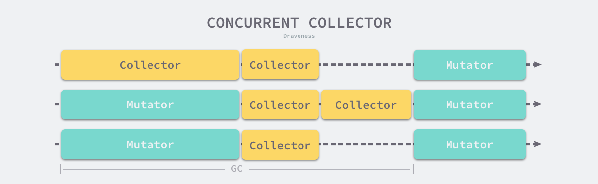
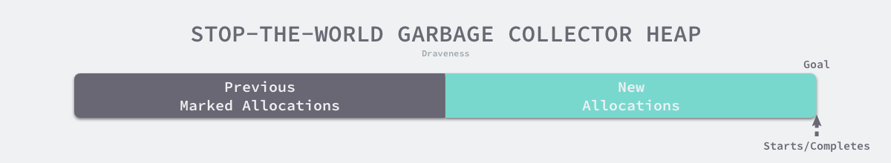
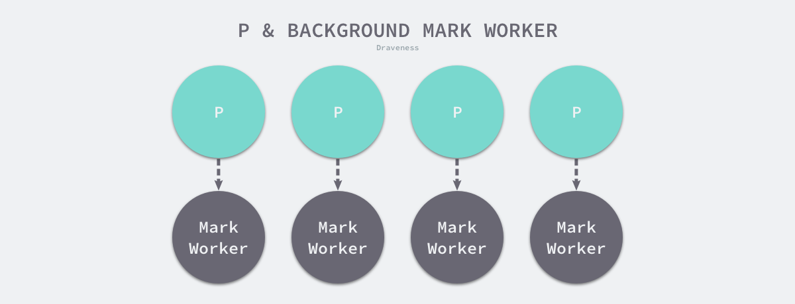
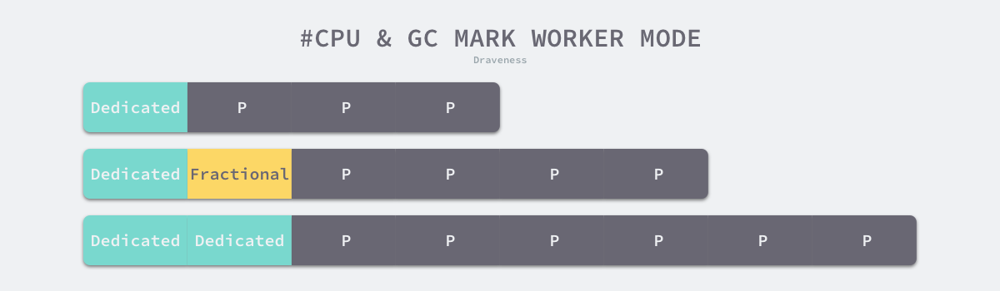
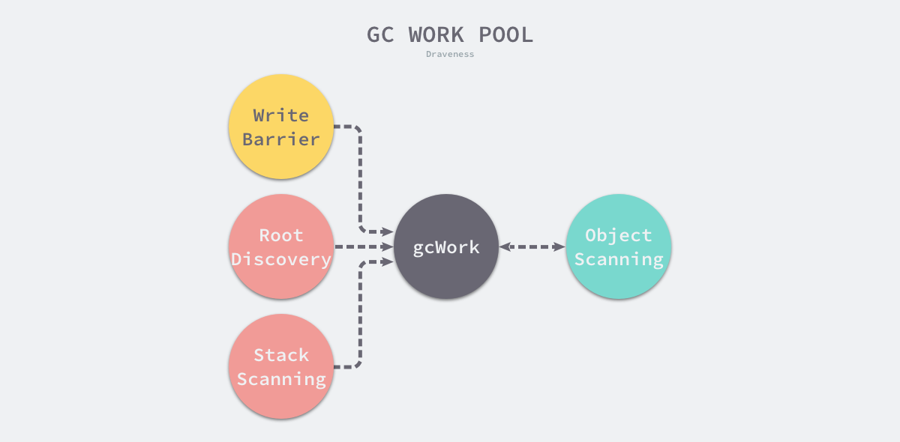
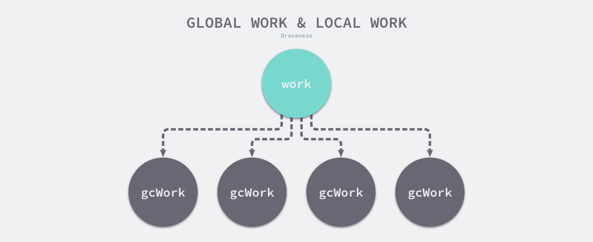
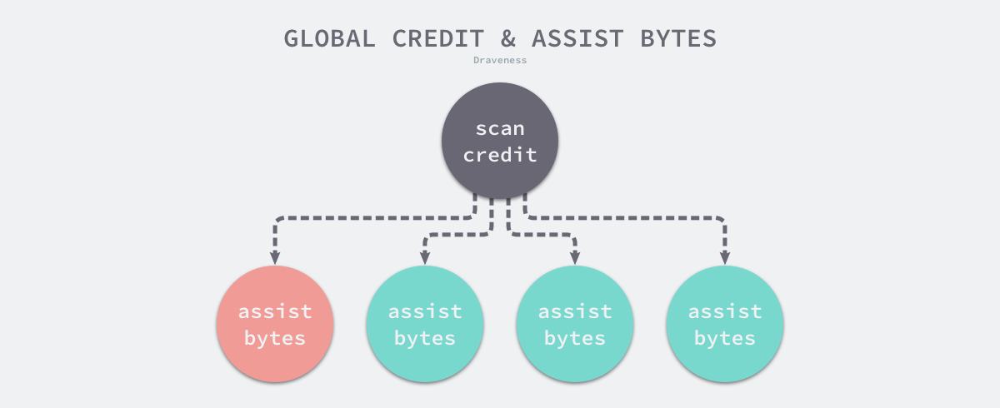

## 垃圾收集器

[原文](https://draveness.me/golang/docs/part3-runtime/ch07-memory/golang-garbage-collector/)

在几乎所有的现代编程语言中，垃圾收集器都是一个复杂的系统，为了在不影响用户程序的情况下回收废弃的内存需要付出非常多的努力，Java 的垃圾收集机制是一个很好的例子，Java 8 中包含线性、并发、并行标记清除和 G1 四个垃圾收集器[1](https://draveness.me/golang/docs/part3-runtime/ch07-memory/golang-garbage-collector/#fn:1)。

### 设计原理

编程语言通常会使用手动和自动两种方式管理内存，C、C++ 以及 Rust 等编程语言使用手动的方式管理内存[2](https://draveness.me/golang/docs/part3-runtime/ch07-memory/golang-garbage-collector/#fn:2)，工程师需要主动申请或者释放内存；而 Python、Ruby、Java 和 Go 等语言使用自动的内存管理系统，一般都是垃圾收集机制，不过 Objective-C 却选择了自动引用计数[3](https://draveness.me/golang/docs/part3-runtime/ch07-memory/golang-garbage-collector/#fn:3)。

相信很多人对垃圾收集器的印象都是暂停程序（Stop the world，STW），随着用户程序申请越来越多的内存，系统中的垃圾也逐渐增多；当程序的内存占用达到一定阈值时，整个应用程序就会全部暂停，垃圾收集器会扫描已经分配的所有对象并回收不再使用的内存空间，当这个过程结束后，用户程序才可以继续执行，Go 语言在早期也使用这种策略实现垃圾收集，但是今天的实现已经复杂了很多。


**图 7-21 内存管理的组件**

在上图中，用户程序（Mutator）会通过内存分配器（Allocator）在堆上申请内存，而垃圾收集器（Collector）负责回收堆上的内存空间，内存分配器和垃圾收集器共同管理着程序中的堆内存空间。

#### 标记清除

标记清除（Mark-Sweep）算法是最常见的垃圾收集算法，标记清除收集器是跟踪式垃圾收集器，其执行过程可以分成标记（Mark）和清除（Sweep）两个阶段：

1. 标记阶段 — 从根对象出发查找并标记堆中所有存活的对象；
2. 清除阶段 — 遍历堆中的全部对象，回收未被标记的垃圾对象并将回收的内存加入空闲链表；

如下图所示，内存空间中包含多个对象，我们从根对象出发依次遍历对象的子对象并将从根节点可达的对象都标记成存活状态，即 A、C 和 D 三个对象，剩余的 B、E 和 F 三个对象因为从根节点不可达，所以会被当做垃圾：


**图 7-22 标记清除的标记阶段**

标记阶段结束后会进入清除阶段，在该阶段中收集器会依次遍历堆中的所有对象，释放其中没有被标记的 B、E 和 F 三个对象并将新的空闲内存空间以链表的结构串联起来，方便内存分配器的使用。


**图 7-23 标记清除的清除阶段**

这里介绍的是最传统的标记清除算法，垃圾收集器从垃圾收集的根对象出发，递归遍历这些对象指向的子对象并将所有可达的对象标记成存活；标记阶段结束后，垃圾收集器会依次遍历堆中的对象并清除其中的垃圾，整个过程需要标记对象的存活状态，用户程序在垃圾收集的过程中也不能执行，需要用到更复杂的机制来解决 STW (Stop The World) 的问题。

#### 三色抽象

为了解决原始标记清除算法带来的长时间 STW，多数现代的追踪式垃圾收集器都会实现三色标记算法的变种以缩短 STW 的时间。三色标记算法将程序中的对象分成白色、黑色和灰色三类：

- 白色对象 — 潜在的垃圾，其内存可能会被垃圾收集器回收；
- 黑色对象 — 活跃的对象，包括不存在任何引用外部指针的对象以及从根对象可达的对象；
- 灰色对象 — 活跃的对象，因为存在指向白色对象的外部指针，垃圾收集器会扫描这些对象的子对象；

在垃圾收集器开始工作时，程序中不存在任何的黑色对象，垃圾收集的根对象会被标记成灰色，垃圾收集器只会从灰色对象集合中取出对象开始扫描，当灰色集合中不存在任何对象时，标记阶段就会结束。


**图 7-25 三色标记垃圾收集器的执行过程**

三色标记垃圾收集器的工作原理很简单，我们可以将其归纳成以下几个步骤：

1. 从灰色对象的集合中选择一个灰色对象并将其标记成黑色；
2. 将黑色对象指向的所有对象都标记成灰色，保证该对象和被该对象引用的对象都不会被回收；
3. 重复上述两个步骤直到对象图中不存在灰色对象；

当三色的标记清除的标记阶段结束之后，应用程序的堆中就不存在任何的灰色对象，我们只能看到黑色的存活对象以及白色的垃圾对象，垃圾收集器可以回收这些白色的垃圾。

因为用户程序可能在标记执行的过程中修改对象的指针，所以三色标记清除算法本身是不可以并发或者增量执行的，它仍然需要 STW，在如下所示的三色标记过程中，用户程序建立了从 A 对象到 D 对象的引用，但是因为程序中已经不存在灰色对象了，所以 D 对象会被垃圾收集器错误地回收。


**图 7-27 三色标记与用户程序**

本来不应该被回收的对象却被回收了，这在内存管理中是非常严重的错误，我们将这种错误称为悬挂指针，即指针没有指向特定类型的合法对象，影响了内存的安全性[5](https://draveness.me/golang/docs/part3-runtime/ch07-memory/golang-garbage-collector/#fn:5)，想要并发或者增量地标记对象还是需要使用屏障技术。

#### 屏障技术

内存屏障技术是一种屏障指令，它可以让 CPU 或者编译器在执行内存相关操作时遵循特定的约束，目前多数的现代处理器都会乱序执行指令以最大化性能，但是该技术能够保证内存操作的顺序性，在内存屏障前执行的操作一定会先于内存屏障后执行的操作。

想要在并发或者增量的标记算法中保证正确性，需要达成以下两种三色不变性（Tri-color invariant）中的一种：

- 强三色不变性 — 黑色对象不会指向白色对象，只会指向灰色对象或者黑色对象；
- 弱三色不变性 — 黑色对象指向的白色对象必须包含一条从灰色对象经由多个白色对象的可达路径；


**图 7-28 三色不变性**

遵循上述两个不变性中的任意一个，我们都能保证垃圾收集算法的正确性，而屏障技术就是在并发或者增量标记过程中保证三色不变性的重要技术。

垃圾收集中的屏障技术更像是一个钩子方法，它是在用户程序读取对象、创建新对象以及更新对象指针时执行的一段代码，根据操作类型的不同，我们可以将它们分成读屏障（Read barrier）和写屏障（Write barrier）两种，因为读屏障需要在读操作中加入代码片段，对用户程序的性能影响很大，所以编程语言往往都会采用写屏障保证三色不变性。

我们在这里想要介绍的是 Go 语言中使用的两种写屏障技术，分别是 Dijkstra 提出的插入写屏障[8](https://draveness.me/golang/docs/part3-runtime/ch07-memory/golang-garbage-collector/#fn:8)和 Yuasa 提出的删除写屏障[9](https://draveness.me/golang/docs/part3-runtime/ch07-memory/golang-garbage-collector/#fn:9)，这里会分析它们如何保证三色不变性和垃圾收集器的正确性。

##### 插入写屏障

Dijkstra 在 1978 年提出了插入写屏障，用户程序和垃圾收集器可以在交替工作的情况下保证程序执行的正确性：

```go
writePointer(slot, ptr):
    shade(ptr)
    *slot = ptr
```

每当执行类似 `*slot = ptr` 的表达式时，我们会执行上述写屏障通过 `shade` 函数尝试改变指针的颜色。如果 `ptr` 指针是白色的，那么该函数会将该对象设置成灰色，其他情况则保持不变。


**图 7-29 Dijkstra 插入写屏障**

假设我们在应用程序中使用 Dijkstra 提出的插入写屏障，在一个垃圾收集器和用户程序交替运行的场景中会出现如上图所示的标记过程：

1. 垃圾收集器将根对象指向 A 对象标记成黑色并将 A 对象指向的对象 B 标记成灰色；
2. 用户程序修改 A 对象的指针，将原本指向 B 对象的指针指向 C 对象，这时触发写屏障将 C 对象标记成灰色；
3. 垃圾收集器依次遍历程序中的其他灰色对象，将它们分别标记成黑色；

Dijkstra 的插入写屏障是一种相对保守的屏障技术，它会将**有存活可能的对象都标记成灰色**以满足强三色不变性。在如上所示的垃圾收集过程中，实际上不再存活的 B 对象最后没有被回收；而如果我们在第二和第三步之间将指向 C 对象的指针改回指向 B，垃圾收集器仍然认为 C 对象是存活的，这些被错误标记的垃圾对象只有在下一个循环才会被回收。

插入式的 Dijkstra 写屏障虽然实现非常简单并且也能保证强三色不变性，但是它也有明显的缺点。因为栈上的对象在垃圾收集中也会被认为是根对象，所以为了保证内存的安全，Dijkstra 必须为栈上的对象增加写屏障或者在标记阶段完成重新对栈上的对象进行扫描，这两种方法各有各的缺点，前者会大幅度增加写入指针的额外开销，后者重新扫描栈对象时需要暂停程序，垃圾收集算法的设计者需要在这两者之间做出权衡。

##### 删除写屏障

Yuasa 在 1990 年的论文 Real-time garbage collection on general-purpose machines 中提出了删除写屏障，因为一旦该写屏障开始工作，它会保证开启写屏障时堆上所有对象的可达，所以也被称作快照垃圾收集（Snapshot GC）[10](https://draveness.me/golang/docs/part3-runtime/ch07-memory/golang-garbage-collector/#fn:10)：

> This guarantees that no objects will become unreachable to the garbage collector traversal all objects which are live at the beginning of garbage collection will be reached even if the pointers to them are overwritten.

该算法会使用如下所示的写屏障保证增量或者并发执行垃圾收集时程序的正确性：

```go
writePointer(slot, ptr)
    shade(*slot)
    *slot = ptr
```

上述代码会在老对象的引用被删除时，将白色的老对象涂成灰色，这样删除写屏障就可以保证弱三色不变性，老对象引用的下游对象一定可以被灰色对象引用。


**图 7-29 Yuasa 删除写屏障**

假设我们在应用程序中使用 Yuasa 提出的删除写屏障，在一个垃圾收集器和用户程序交替运行的场景中会出现如上图所示的标记过程：

1. 垃圾收集器将根对象指向 A 对象标记成黑色并将 A 对象指向的对象 B 标记成灰色；
2. 用户程序将 A 对象原本指向 B 的指针指向 C，触发删除写屏障，但是因为 B 对象已经是灰色的，所以不做改变；
3. **用户程序将 B 对象原本指向 C 的指针删除，触发删除写屏障，白色的 C 对象被涂成灰色**；
4. 垃圾收集器依次遍历程序中的其他灰色对象，将它们分别标记成黑色；

上述过程中的第三步触发了 Yuasa 删除写屏障的着色，因为用户程序删除了 B 指向 C 对象的指针，所以 C 和 D 两个对象会分别违反强三色不变性和弱三色不变性。Yuasa 删除写屏障通过对 C 对象的着色，保证了 C 对象和下游的 D 对象能够在这一次垃圾收集的循环中存活，避免发生悬挂指针以保证用户程序的正确性。

#### 增量和并发

为了减少应用程序暂停的最长时间和垃圾收集的总暂停时间，我们会使用下面的策略优化现代的垃圾收集器：

- 增量垃圾收集 — 增量地标记和清除垃圾，降低应用程序暂停的最长时间；
- 并发垃圾收集 — 利用多核的计算资源，在用户程序执行时并发标记和清除垃圾；

因为增量和并发两种方式都可以与用户程序交替运行，所以我们需要**使用屏障技术**保证垃圾收集的正确性；与此同时，应用程序也不能等到内存溢出时触发垃圾收集，因为当内存不足时，应用程序已经无法分配内存，这与直接暂停程序没有什么区别，增量和并发的垃圾收集需要提前触发并在内存不足前完成整个循环，避免程序的长时间暂停。

##### 增量收集器

增量式（Incremental）的垃圾收集是减少程序最长暂停时间的一种方案，它可以将原本时间较长的暂停时间切分成多个更小的 GC 时间片，虽然从垃圾收集开始到结束的时间更长了，但是这也减少了应用程序暂停的最大时间：


**图 7-31 增量垃圾收集器**

需要注意的是，增量式的垃圾收集需要与三色标记法一起使用，为了保证垃圾收集的正确性，我们需要在垃圾收集开始前打开写屏障，这样用户程序修改内存都会先经过写屏障的处理，保证了堆内存中对象关系的强三色不变性或者弱三色不变性。虽然增量式的垃圾收集能够减少最大的程序暂停时间，但是增量式收集也会增加一次 GC 循环的总时间，在垃圾收集期间，因为写屏障的影响用户程序也需要承担额外的计算开销，所以增量式的垃圾收集也不是只带来好处的，但是总体来说还是利大于弊。

##### 并发收集器

并发（Concurrent）的垃圾收集不仅能够减少程序的最长暂停时间，还能减少整个垃圾收集阶段的时间，通过开启读写屏障、**利用多核优势与用户程序并行执行**，并发垃圾收集器确实能够减少垃圾收集对应用程序的影响：



**图 7-31 并发垃圾收集器**

虽然并发收集器能够与用户程序一起运行，但是并不是所有阶段都可以与用户程序一起运行，部分阶段还是需要暂停用户程序的，不过与传统的算法相比，并发的垃圾收集可以将能够并发执行的工作尽量并发执行；当然，因为读写屏障的引入，并发的垃圾收集器也一定会带来额外开销，不仅会增加垃圾收集的总时间，还会影响用户程序。

### 演进过程

从 Go 语言 v1.0 版本开始分析垃圾收集器的演进过程：

1. [v1.0](https://github.com/golang/go/blob/go1.0.1/src/pkg/runtime/mgc0.c#L882) — 完全串行的标记和清除过程，需要暂停整个程序；
2. [v1.1](https://github.com/golang/go/blob/go1.1/src/pkg/runtime/mgc0.c#L1938) — 在多核主机并行执行垃圾收集的标记和清除阶段[11](https://draveness.me/golang/docs/part3-runtime/ch07-memory/golang-garbage-collector/#fn:11)；
3. [v1.3](https://github.com/golang/go/blob/go1.3/src/pkg/runtime/mgc0.c#L2268) — 运行时基于**只有指针类型的值包含指针**的假设增加了对栈内存的精确扫描支持，实现了真正精确的垃圾收集[12](https://draveness.me/golang/docs/part3-runtime/ch07-memory/golang-garbage-collector/#fn:12)；
   1. 将 `unsafe.Pointer` 类型转换成整数类型的值认定为不合法的，可能会造成悬挂指针等严重问题；
4. [v1.5](https://github.com/golang/go/blob/go1.5/src/runtime/mgc.go#L903) — 实现了基于**三色标记清扫的并发**垃圾收集器[13](https://draveness.me/golang/docs/part3-runtime/ch07-memory/golang-garbage-collector/#fn:13)；
   1. 大幅度降低垃圾收集的延迟从几百 ms 降低至 10ms 以下；
   2. 计算垃圾收集启动的合适时间并通过并发加速垃圾收集的过程；
5. [v1.6](https://github.com/golang/go/blob/go1.6/src/runtime/mgc.go#L869) — 实现了**去中心化**的垃圾收集协调器；
   1. 基于显式的状态机使得任意 Goroutine 都能触发垃圾收集的状态迁移；
   2. 使用密集的位图替代空闲链表表示的堆内存，降低清除阶段的 CPU 占用[14](https://draveness.me/golang/docs/part3-runtime/ch07-memory/golang-garbage-collector/#fn:14)；
6. [v1.7](https://github.com/golang/go/blob/go1.7/src/runtime/mgc.go#L884) — 通过**并行栈收缩**将垃圾收集的时间缩短至 2ms 以内[15](https://draveness.me/golang/docs/part3-runtime/ch07-memory/golang-garbage-collector/#fn:15)；
7. [v1.8](https://github.com/golang/go/blob/go1.8/src/runtime/mgc.go#L930) — 使用**混合写屏障**将垃圾收集的时间缩短至 0.5ms 以内[16](https://draveness.me/golang/docs/part3-runtime/ch07-memory/golang-garbage-collector/#fn:16)；
8. [v1.9](https://github.com/golang/go/blob/go1.9/src/runtime/mgc.go#L1187) — 彻底移除暂停程序的重新扫描栈的过程[17](https://draveness.me/golang/docs/part3-runtime/ch07-memory/golang-garbage-collector/#fn:17)；
9. [v1.10](https://github.com/golang/go/blob/go1.10/src/runtime/mgc.go#L1239) — 更新了垃圾收集调频器（Pacer）的实现，分离软硬堆大小的目标[18](https://draveness.me/golang/docs/part3-runtime/ch07-memory/golang-garbage-collector/#fn:18)；
10. [v1.12](https://github.com/golang/go/blob/go1.12/src/runtime/mgc.go#L1199) — 使用**新的标记终止算法**简化垃圾收集器的几个阶段[19](https://draveness.me/golang/docs/part3-runtime/ch07-memory/golang-garbage-collector/#fn:19)；
11. [v1.13](https://github.com/golang/go/blob/go1.13/src/runtime/mgc.go#L1200) — 通过新的 Scavenger 解决瞬时内存占用过高的应用程序向操作系统归还内存的问题[20](https://draveness.me/golang/docs/part3-runtime/ch07-memory/golang-garbage-collector/#fn:20)；
12. [v1.14](https://github.com/golang/go/blob/go1.14/src/runtime/mgc.go#L1221) — 使用全新的页分配器**优化内存分配的速度**[21](https://draveness.me/golang/docs/part3-runtime/ch07-memory/golang-garbage-collector/#fn:21)；

#### 并发垃圾收集

Go 语言在 v1.5 中引入了并发的垃圾收集器，该垃圾收集器使用了三色抽象和写屏障技术保证垃圾收集器执行的正确性。

并发垃圾收集器必须在合适的时间点触发垃圾收集循环，假设我们的 Go 语言程序运行在一台 4 核的物理机上，那么在垃圾收集开始后，收集器会占用 25% 计算资源在后台来扫描并标记内存中的对象：


**图 7-32 Go 语言的并发收集**

Go 语言的并发垃圾收集器会在扫描对象之前暂停程序做一些标记对象的准备工作，其中包括启动后台标记的垃圾收集器以及开启写屏障，如果在后台执行的垃圾收集器不够快，应用程序申请内存的速度超过预期，运行时会让申请内存的应用程序辅助完成垃圾收集的扫描阶段，在标记和标记终止阶段结束之后就会进入异步的清理阶段，将不用的内存增量回收。

v1.5 版本实现的并发垃圾收集策略由专门的 Goroutine 负责在处理器之间同步和协调垃圾收集的状态。当其他的 Goroutine 发现需要触发垃圾收集时，它们需要将该信息通知给负责修改状态的主 Goroutine，然而这个通知的过程会带来一定的延迟，这个延迟的时间窗口很可能是不可控的，用户程序会在这段时间继续分配内存。

v1.6 引入了去中心化的垃圾收集协调机制[22](https://draveness.me/golang/docs/part3-runtime/ch07-memory/golang-garbage-collector/#fn:22)，将垃圾收集器变成一个显式的状态机，任意的 Goroutine 都可以调用方法触发状态的迁移，常见的状态迁移方法包括以下几个

- [`runtime.gcStart`](https://draveness.me/golang/tree/runtime.gcStart) — 从 `_GCoff` 转换至 `_GCmark` 阶段，进入并发标记阶段并打开写屏障；
- [`runtime.gcMarkDone`](https://draveness.me/golang/tree/runtime.gcMarkDone) — 如果所有可达对象都已经完成扫描，调用 [`runtime.gcMarkTermination`](https://draveness.me/golang/tree/runtime.gcMarkTermination)；
- [`runtime.gcMarkTermination`](https://draveness.me/golang/tree/runtime.gcMarkTermination) — 从 `_GCmark` 转换 `_GCmarktermination` 阶段，进入标记终止阶段并在完成后进入 `_GCoff`；

#### 回收堆目标

STW 的垃圾收集器虽然需要暂停程序，但是它能够有效地控制堆内存的大小，Go 语言运行时的默认配置会在堆内存达到上一次垃圾收集的 2 倍时，触发新一轮的垃圾收集，这个行为可以通过环境变量 `GOGC` 调整，在默认情况下它的值为 100，即增长 100% 的堆内存才会触发 GC。



**图 7-33 STW 垃圾收集器的垃圾收集时间**

因为并发垃圾收集器会与程序一起运行，所以它无法准确的控制堆内存的大小，并发收集器需要在达到目标前触发垃圾收集，这样才能够保证内存大小的可控，并发收集器需要尽可能保证垃圾收集结束时的堆内存与用户配置的 `GOGC` 一致。


Go 语言 v1.5 引入并发垃圾收集器的同时使用垃圾收集调步（Pacing）算法计算触发的垃圾收集的最佳时间，确保触发的时间既不会浪费计算资源，也不会超出预期的堆大小。如上图所示，其中黑色的部分是上一次垃圾收集后标记的堆大小，绿色部分是上次垃圾收集结束后新分配的内存，因为我们使用并发垃圾收集，所以黄色的部分就是在垃圾收集期间分配的内存，最后的红色部分是垃圾收集结束时与目标的差值，我们希望尽可能减少红色部分内存，降低垃圾收集带来的额外开销以及程序的暂停时间。

垃圾收集调步算法是跟随 v1.5 一同引入的，该算法的目标是优化堆的增长速度和垃圾收集器的 CPU 利用率[23](https://draveness.me/golang/docs/part3-runtime/ch07-memory/golang-garbage-collector/#fn:23)，而在 v1.10 版本中又对该算法进行了优化，将原有的目的堆大小拆分成了软硬两个目标[24](https://draveness.me/golang/docs/part3-runtime/ch07-memory/golang-garbage-collector/#fn:24)。

#### 混合写屏障

在 Go 语言 v1.7 版本之前，运行时会使用 Dijkstra 插入写屏障保证强三色不变性，但是运行时并没有在所有的垃圾收集根对象上开启插入写屏障。因为应用程序可能包含成百上千的 Goroutine，而垃圾收集的根对象一般包括全局变量和栈对象，如果运行时需要在几百个 Goroutine 的栈上都开启写屏障，会带来巨大的额外开销，所以 Go 团队在实现上选择了在标记阶段完成时**暂停程序、将所有栈对象标记为灰色并重新扫描**，在活跃 Goroutine 非常多的程序中，重新扫描的过程需要占用 10 ~ 100ms 的时间。

```go
writePointer(slot, ptr):
    shade(*slot)
    if current stack is grey:
        shade(ptr)
    *slot = ptr
```

为了移除栈的重扫描过程，除了引入混合写屏障之外，在垃圾收集的标记阶段，我们还需要**将创建的所有新对象都标记成黑色**，防止新分配的栈内存和堆内存中的对象被错误地回收，因为栈内存在标记阶段最终都会变为黑色，所以不再需要重新扫描栈空间。

### 实现原理

Go 语言的垃圾收集可以分成清除终止、标记、标记终止和清除四个不同阶段，它们分别完成了不同的工作[25](https://draveness.me/golang/docs/part3-runtime/ch07-memory/golang-garbage-collector/#fn:25)：


**图 7-35 垃圾收集的多个阶段**

1. **清理终止阶段（sweep termination）**；
   1. **暂停程序**，所有的处理器在这时会进入安全点（Safe point）；
   2. 如果当前垃圾收集循环是强制触发的，我们还需要处理还未被清理的内存管理单元；
2. **标记阶段（mark）**；
   1. 将状态切换至 `_GCmark`、开启写屏障、用户程序协助（Mutator Assists）并将根对象入队；
   2. **恢复执行程序**，标记进程和用于协助的用户程序会开始并发标记内存中的对象，写屏障会将被覆盖的指针和新指针都标记成灰色，而所有新创建的对象都会被直接标记成黑色；
   3. 开始扫描根对象，包括所有 Goroutine 的栈、全局对象以及不在堆中的运行时数据结构，扫描 Goroutine 栈期间会暂停当前处理器；
   4. 依次处理灰色队列中的对象，将对象标记成黑色并将它们指向的对象标记成灰色；
   5. 使用分布式的终止算法检查剩余的工作，发现标记阶段完成后进入标记终止阶段；
3. **标记终止阶段（mark termination）**；
   1. **暂停程序**、将状态切换至 `_GCmarktermination` 并关闭辅助标记的用户程序；
   2. 清理处理器上的线程缓存；
4. **清理阶段（sweep）**；
   1. 将状态切换至 `_GCoff` 开始清理阶段，初始化清理状态并关闭写屏障；
   2. 恢复用户程序，所有新创建的对象会标记成白色；
   3. 后台并发清理所有的内存管理单元，当 Goroutine 申请新的内存管理单元时就会触发清理；

#### 全局变量

在垃圾收集中有一些比较重要的全局变量：

- [`runtime.gcphase`](https://draveness.me/golang/tree/runtime.gcphase) 是垃圾收集器当前处于的阶段，可能处于 `_GCoff`、`_GCmark` 和 `_GCmarktermination`，Goroutine 在读取或者修改该阶段时需要保证原子性；
- [`runtime.gcBlackenEnabled`](https://draveness.me/golang/tree/runtime.gcBlackenEnabled) 是一个布尔值，当垃圾收集处于标记阶段时，该变量会被置为 1，在这里辅助垃圾收集的用户程序和后台标记的任务可以将对象涂黑；
- [`runtime.gcController`](https://draveness.me/golang/tree/runtime.gcController) 实现了垃圾收集的调步算法，它能够决定触发并行垃圾收集的时间和待处理的工作；
- [`runtime.gcpercent`](https://draveness.me/golang/tree/runtime.gcpercent) 是触发垃圾收集的内存增长百分比，默认情况下为 100，即堆内存相比上次垃圾收集增长 100% 时应该触发 GC，并行的垃圾收集器会在到达该目标前完成垃圾收集；
- [`runtime.writeBarrier`](https://draveness.me/golang/tree/runtime.writeBarrier) 是一个包含写屏障状态的结构体，其中的 `enabled` 字段表示写屏障的开启与关闭；
- [`runtime.worldsema`](https://draveness.me/golang/tree/runtime.worldsema) 是全局的信号量，获取该信号量的线程有权利暂停当前应用程序；

除了上述全局的变量之外，还需要简单了解一下 [`runtime.work`](https://draveness.me/golang/tree/runtime.work) 变量, 该结构体中包含大量垃圾收集的相关字段：

```go
var work struct {
	full  lfstack
	empty lfstack
	pad0  cpu.CacheLinePad

	wbufSpans struct {
		lock mutex
		free mSpanList
		busy mSpanList
	}
	...
	nproc  uint32
	tstart int64
	nwait  uint32
	ndone  uint32
	...
	mode gcMode
	cycles uint32
	...
	stwprocs, maxprocs int32
	...
}
```

#### 触发时机

运行时会通过如下所示的 [`runtime.gcTrigger.test`](https://draveness.me/golang/tree/runtime.gcTrigger.test) 方法决定是否需要触发垃圾收集，当满足触发垃圾收集的基本条件时 — 允许垃圾收集、程序没有崩溃并且没有处于垃圾收集循环，该方法会根据三种不同方式触发进行不同的检查：

```go
func (t gcTrigger) test() bool {
	if !memstats.enablegc || panicking != 0 || gcphase != _GCoff {
		return false
	}
	switch t.kind {
	case gcTriggerHeap:
		return memstats.heap_live >= memstats.gc_trigger
	case gcTriggerTime:
		if gcpercent < 0 {
			return false
		}
		lastgc := int64(atomic.Load64(&memstats.last_gc_nanotime))
		return lastgc != 0 && t.now-lastgc > forcegcperiod
	case gcTriggerCycle:
		return int32(t.n-work.cycles) > 0
	}
	return true
}
```

1. `gcTriggerHeap` — 堆内存的分配达到控制器计算的触发堆大小；
2. `gcTriggerTime` — 如果一定时间内没有触发，就会触发新的循环，该触发条件由 [`runtime.forcegcperiod`](https://draveness.me/golang/tree/runtime.forcegcperiod) 变量控制，默认为 2 分钟；
3. `gcTriggerCycle` — 如果当前没有开启垃圾收集，则触发新的循环；

用于开启垃圾收集的方法 [`runtime.gcStart`](https://draveness.me/golang/tree/runtime.gcStart) 会接收一个 [`runtime.gcTrigger`](https://draveness.me/golang/tree/runtime.gcTrigger) 类型的谓词，所有出现 [`runtime.gcTrigger`](https://draveness.me/golang/tree/runtime.gcTrigger) 结构体的位置都是触发垃圾收集的代码：

- [`runtime.sysmon`](https://draveness.me/golang/tree/runtime.sysmon) 和 [`runtime.forcegchelper`](https://draveness.me/golang/tree/runtime.forcegchelper) — 后台运行定时检查和垃圾收集；
- [`runtime.GC`](https://draveness.me/golang/tree/runtime.GC) — 用户程序手动触发垃圾收集；
- [`runtime.mallocgc`](https://draveness.me/golang/tree/runtime.mallocgc) — 申请内存时根据堆大小触发垃圾收集；


**图 7-36 垃圾收集的触发**

除了使用后台运行的系统监控器和强制垃圾收集助手触发垃圾收集之外，另外两个方法会从任意处理器上触发垃圾收集，这种不需要中心组件协调的方式是在 v1.6 版本中引入的。

##### 后台触发

运行时会在应用程序启动时在后台开启一个用于强制触发垃圾收集的 Goroutine，该 Goroutine 的职责非常简单 — 调用 [`runtime.gcStart`](https://draveness.me/golang/tree/runtime.gcStart) 尝试启动新一轮的垃圾收集：

```go
func init() {
	go forcegchelper()
}

func forcegchelper() {
	forcegc.g = getg()
	for {
		lock(&forcegc.lock)
		atomic.Store(&forcegc.idle, 1)
		goparkunlock(&forcegc.lock, waitReasonForceGGIdle, traceEvGoBlock, 1)
    // Time-triggered, fully concurrent.
		gcStart(gcTrigger{kind: gcTriggerTime, now: nanotime()})
	}
}
```

为了减少对计算资源的占用，该 Goroutine 会在循环中调用 [`runtime.goparkunlock`](https://draveness.me/golang/tree/runtime.goparkunlock) 主动陷入休眠等待其他 Goroutine 的唤醒，[`runtime.forcegchelper`](https://draveness.me/golang/tree/runtime.forcegchelper) 在大多数时间都是陷入休眠的，但是它会被系统监控器 [`runtime.sysmon`](https://draveness.me/golang/tree/runtime.sysmon) 在满足垃圾收集条件时唤醒：

```go
func sysmon() {
	...
	for {
		...
    // check if we need to force a GC
		if t := (gcTrigger{kind: gcTriggerTime, now: now}); t.test() && atomic.Load(&forcegc.idle) != 0 {
			lock(&forcegc.lock)
			forcegc.idle = 0
			var list gList
			list.push(forcegc.g)
			injectglist(&list)
			unlock(&forcegc.lock)
		}
	}
}
```

系统监控在每个循环中都会主动构建一个 [`runtime.gcTrigger`](https://draveness.me/golang/tree/runtime.gcTrigger) 并检查垃圾收集的触发条件是否满足，如果满足条件，系统监控会将 [`runtime.forcegc`](https://draveness.me/golang/tree/runtime.forcegc) 状态中持有的 Goroutine 加入全局队列等待调度器的调度。

##### 手动触发

用户程序会通过 [`runtime.GC`](https://draveness.me/golang/tree/runtime.GC) 函数在程序运行期间主动通知运行时执行，该方法在调用时会阻塞调用方直到当前垃圾收集循环完成，在垃圾收集期间也可能会通过 STW 暂停整个程序：

```go
// GC runs a garbage collection and blocks the caller until the
// garbage collection is complete. It may also block the entire
// program.
func GC() {
  // We consider a cycle to be: sweep termination, mark, mark
	// termination, and sweep. This function shouldn't return
	// until a full cycle has been completed, from beginning to
	// end. Hence, we always want to finish up the current cycle
	// and start a new one. That means:
	//
	// 1. In sweep termination, mark, or mark termination of cycle
	// N, wait until mark termination N completes and transitions
	// to sweep N.
	//
	// 2. In sweep N, help with sweep N.
	//
	// At this point we can begin a full cycle N+1.
	//
	// 3. Trigger cycle N+1 by starting sweep termination N+1.
	//
	// 4. Wait for mark termination N+1 to complete.
	//
	// 5. Help with sweep N+1 until it's done.
	//
	// This all has to be written to deal with the fact that the
	// GC may move ahead on its own. For example, when we block
	// until mark termination N, we may wake up in cycle N+2.
  
 	// Wait until the current sweep termination, mark, and mark
	// termination complete.
	n := atomic.Load(&work.cycles)
	gcWaitOnMark(n)
 
  // We're now in sweep N or later. Trigger GC cycle N+1, which
	// will first finish sweep N if necessary and then enter sweep
	// termination N+1.
	gcStart(gcTrigger{kind: gcTriggerCycle, n: n + 1})
 
  // Wait for mark termination N+1 to complete.
	gcWaitOnMark(n + 1)

  // Finish sweep N+1 before returning. We do this both to
	// complete the cycle and because runtime.GC() is often used
	// as part of tests and benchmarks to get the system into a
	// relatively stable and isolated state.
	for atomic.Load(&work.cycles) == n+1 && sweepone() != ^uintptr(0) {
		sweep.nbgsweep++
		Gosched()
	}

  // Callers may assume that the heap profile reflects the
	// just-completed cycle when this returns (historically this
	// happened because this was a STW GC), but right now the
	// profile still reflects mark termination N, not N+1.
	//
	// As soon as all of the sweep frees from cycle N+1 are done,
	// we can go ahead and publish the heap profile.
	//
	// First, wait for sweeping to finish. (We know there are no
	// more spans on the sweep queue, but we may be concurrently
	// sweeping spans, so we have to wait.)
	for atomic.Load(&work.cycles) == n+1 && atomic.Load(&mheap_.sweepers) != 0 {
		Gosched()
	}

  // Now we're really done with sweeping, so we can publish the
	// stable heap profile. Only do this if we haven't already hit
	// another mark termination.
	mp := acquirem()
	cycle := atomic.Load(&work.cycles)
	if cycle == n+1 || (gcphase == _GCmark && cycle == n+2) {
		mProf_PostSweep()
	}
	releasem(mp)
}
```

1. 在正式开始垃圾收集前，运行时需要通过 [`runtime.gcWaitOnMark`](https://draveness.me/golang/tree/runtime.gcWaitOnMark) 等待上一个循环的标记终止、标记和清除终止阶段完成；
2. 调用 [`runtime.gcStart`](https://draveness.me/golang/tree/runtime.gcStart) 触发新一轮的垃圾收集并通过 [`runtime.gcWaitOnMark`](https://draveness.me/golang/tree/runtime.gcWaitOnMark) 等待该轮垃圾收集的标记终止阶段正常结束；
3. 持续调用 [`runtime.sweepone`](https://draveness.me/golang/tree/runtime.sweepone) 清理全部待处理的内存管理单元并等待所有的清理工作完成，等待期间会调用 [`runtime.Gosched`](https://draveness.me/golang/tree/runtime.Gosched) 让出处理器；
4. 完成本轮垃圾收集的清理工作后，通过 [`runtime.mProf_PostSweep`](https://draveness.me/golang/tree/runtime.mProf_PostSweep) 将该阶段的堆内存状态快照发布出来，我们可以获取这时的内存状态；

手动触发垃圾收集的过程不是特别常见，一般只会在运行时的测试代码中才会出现，不过如果我们认为触发主动垃圾收集是有必要的，我们也可以直接调用该方法，但是作者并不认为这是一种推荐的做法。

##### 申请内存

最后一个可能会触发垃圾收集的就是 [`runtime.mallocgc`](https://draveness.me/golang/tree/runtime.mallocgc) 了，我们在上一节内存分配器中曾经介绍过运行时会将堆上的对象按大小分成微对象、小对象和大对象三类，这三类对象的创建都可能会触发新的垃圾收集循环：

```go
func mallocgc(size uintptr, typ *_type, needzero bool) unsafe.Pointer {
	shouldhelpgc := false
	...
	if size <= maxSmallSize {
		if noscan && size < maxTinySize {
			...
			v := nextFreeFast(span)
			if v == 0 {
				v, _, shouldhelpgc = c.nextFree(tinySpanClass)
			}
			...
		} else {
			...
			v := nextFreeFast(span)
			if v == 0 {
				v, span, shouldhelpgc = c.nextFree(spc)
			}
		  ...
		}
	} else {
		shouldhelpgc = true
		...
	}
	...
	if shouldhelpgc {
		if t := (gcTrigger{kind: gcTriggerHeap}); t.test() {
			gcStart(t)
		}
	}

	return x
}
```

1. 当前线程的内存管理单元中不存在空闲空间时，创建微对象和小对象需要调用 [`runtime.mcache.nextFree`](https://draveness.me/golang/tree/runtime.mcache.nextFree) 从中心缓存或者页堆中获取新的管理单元，在这时就可能触发垃圾收集；
2. 当用户程序申请分配 32KB 以上的大对象时，一定会构建 [`runtime.gcTrigger`](https://draveness.me/golang/tree/runtime.gcTrigger) 结构体尝试触发垃圾收集；

通过堆内存触发垃圾收集需要比较 [`runtime.mstats`](https://draveness.me/golang/tree/runtime.mstats) 中的两个字段 — 表示垃圾收集中存活对象字节数的 `heap_live` 和表示触发标记的堆内存大小的 `gc_trigger`；当内存中存活的对象字节数大于触发垃圾收集的堆大小时，新一轮的垃圾收集就会开始。在这里，我们将分别介绍这两个值的计算过程：

1. `heap_live` — 为了减少锁竞争，运行时只会在中心缓存分配或者释放内存管理单元以及在堆上分配大对象时才会更新；
2. `gc_trigger` — 在标记终止阶段调用 [`runtime.gcSetTriggerRatio`](https://draveness.me/golang/tree/runtime.gcSetTriggerRatio) 更新触发下一次垃圾收集的堆大小；

[`runtime.gcController`](https://draveness.me/golang/tree/runtime.gcController) 会在每个循环结束后计算触发比例并通过 [`runtime.gcSetTriggerRatio`](https://draveness.me/golang/tree/runtime.gcSetTriggerRatio) 设置 `gc_trigger`，它能够决定触发垃圾收集的时间以及用户程序和后台处理的标记任务的多少，利用反馈控制的算法根据堆的增长情况和垃圾收集 CPU 利用率确定触发垃圾收集的时机。

你可以在 [`runtime.gcControllerState.endCycle`](https://draveness.me/golang/tree/runtime.gcControllerState.endCycle) 中找到 v1.5 提出的垃圾收集调步算法[26](https://draveness.me/golang/docs/part3-runtime/ch07-memory/golang-garbage-collector/#fn:26)，并在 [`runtime.gcControllerState.revise`](https://draveness.me/golang/tree/runtime.gcControllerState.revise) 中找到 v1.10 引入的软硬堆目标分离算法[27](https://draveness.me/golang/docs/part3-runtime/ch07-memory/golang-garbage-collector/#fn:27)。

#### 垃圾收集启动

垃圾收集在启动过程一定会调用 [`runtime.gcStart`](https://draveness.me/golang/tree/runtime.gcStart)，它的主要职责是修改全局的垃圾收集状态到 `_GCmark` 并做一些准备工作：

1. 两次调用 [`runtime.gcTrigger.test`](https://draveness.me/golang/tree/runtime.gcTrigger.test) 检查是否满足垃圾收集条件；
2. 暂停程序、在后台启动用于处理标记任务的工作 Goroutine、确定所有内存管理单元都被清理以及其他标记阶段开始前的准备工作；
3. 进入标记阶段、准备后台的标记工作、根对象的标记工作以及微对象、恢复用户程序，进入并发扫描和标记阶段；

验证垃圾收集条件的同时，该方法还会在循环中不断调用 [`runtime.sweepone`](https://draveness.me/golang/tree/runtime.sweepone) 清理已经被标记的内存单元，完成上一个垃圾收集循环的收尾工作：

```go
func gcStart(trigger gcTrigger) {
  ...
	// Pick up the remaining unswept/not being swept spans concurrently
	//
	// This shouldn't happen if we're being invoked in background
	// mode since proportional sweep should have just finished
	// sweeping everything, but rounding errors, etc, may leave a
	// few spans unswept. In forced mode, this is necessary since
	// GC can be forced at any point in the sweeping cycle.
	//
	// We check the transition condition continuously here in case
	// this G gets delayed in to the next GC cycle.
	for trigger.test() && sweepone() != ^uintptr(0) {
		sweep.nbgsweep++
	}
  
	// Perform GC initialization and the sweep termination
	// transition.
	semacquire(&work.startSema)
	// Re-check transition condition under transition lock.
	if !trigger.test() {
		semrelease(&work.startSema)
		return
	}
	...
}
```

在验证了垃圾收集的条件并完成了收尾工作后，该方法会通过 `semacquire` 获取全局的 `worldsema` 信号量、调用 [`runtime.gcBgMarkStartWorkers`](https://draveness.me/golang/tree/runtime.gcBgMarkStartWorkers) 启动后台标记任务、在系统栈中调用 [`runtime.stopTheWorldWithSema`](https://draveness.me/golang/tree/runtime.stopTheWorldWithSema) 暂停程序并调用 [`runtime.finishsweep_m`](https://draveness.me/golang/tree/runtime.finishsweep_m) 保证上一个内存单元的正常回收：

```go
func gcStart(trigger gcTrigger) {
	...
	// Ok, we're doing it! Stop everybody else
	semacquire(&gcsema)
	semacquire(&worldsema)
  ...
	gcBgMarkStartWorkers()
	work.stwprocs, work.maxprocs = gomaxprocs, gomaxprocs
	...

	systemstack(stopTheWorldWithSema)
	systemstack(func() {
		finishsweep_m()
	})

	work.cycles++
	gcController.startCycle()
	...
}
```

除此之外，上述过程还会修改全局变量 [`runtime.work`](https://draveness.me/golang/tree/runtime.work) 持有的状态，包括垃圾收集需要的 Goroutine 数量以及已完成的循环数。

在完成全部的准备工作后，该方法就进入了执行的最后阶段。在该阶段中，我们会修改全局的垃圾收集状态到 `_GCmark` 并依次执行下面的步骤：

1. 调用 [`runtime.gcBgMarkPrepare`](https://draveness.me/golang/tree/runtime.gcBgMarkPrepare) 初始化后台扫描需要的状态；
2. 调用 [`runtime.gcMarkRootPrepare`](https://draveness.me/golang/tree/runtime.gcMarkRootPrepare) 扫描栈上、全局变量等根对象并将它们加入队列；
3. 设置全局变量 [`runtime.gcBlackenEnabled`](https://draveness.me/golang/tree/runtime.gcBlackenEnabled)，用户程序和标记任务可以将对象涂黑；
4. 调用 [`runtime.startTheWorldWithSema`](https://draveness.me/golang/tree/runtime.startTheWorldWithSema) 启动程序，后台任务也会开始标记堆中的对象；

```go
func gcStart(trigger gcTrigger) {
	...
 	// Enter concurrent mark phase and enable
	// write barriers.
	//
	// Because the world is stopped, all Ps will
	// observe that write barriers are enabled by
	// the time we start the world and begin
	// scanning.
	//
	// Write barriers must be enabled before assists are
	// enabled because they must be enabled before
	// any non-leaf heap objects are marked. Since
	// allocations are blocked until assists can
	// happen, we want enable assists as early as
	// possible.
	setGCPhase(_GCmark)

	gcBgMarkPrepare()  // Must happen before assist enable.
	gcMarkRootPrepare()
  
	// Mark all active tinyalloc blocks. Since we're
	// allocating from these, they need to be black like
	// other allocations. The alternative is to blacken
	// the tiny block on every allocation from it, which
	// would slow down the tiny allocator.
	gcMarkTinyAllocs()

  // At this point all Ps have enabled the write
	// barrier, thus maintaining the no white to
	// black invariant. Enable mutator assists to
	// put back-pressure on fast allocating
	// mutators.
	atomic.Store(&gcBlackenEnabled, 1)
	// Concurrent mark.
	systemstack(func() {
		now = startTheWorldWithSema(trace.enabled)
		work.pauseNS += now - work.pauseStart
		work.tMark = now
	})
	// Release the world sema before Gosched() in STW mode
	// because we will need to reacquire it later but before
	// this goroutine becomes runnable again, and we could
	// self-deadlock otherwise.
	semrelease(&work.startSema)
	releasem(mp)
  ...
}
```

在分析垃圾收集的启动过程中，省略了几个关键的过程，其中包括暂停和恢复应用程序和后台任务的启动，下面将详细分析这几个过程的实现原理。

##### 暂停与恢复程序

[`runtime.stopTheWorldWithSema`](https://draveness.me/golang/tree/runtime.stopTheWorldWithSema) 和 [`runtime.startTheWorldWithSema`](https://draveness.me/golang/tree/runtime.startTheWorldWithSema) 是一对用于暂停和恢复程序的核心函数，它们有着完全相反的功能，但是程序的暂停会比恢复要复杂一些：

[`runtime.stopTheWorldWithSema`](https://draveness.me/golang/tree/runtime.stopTheWorldWithSema) 实现原理：

```go
func stopTheWorldWithSema() {
	_g_ := getg()
	sched.stopwait = gomaxprocs
	atomic.Store(&sched.gcwaiting, 1)
	preemptall()
	// stop current P
	_g_.m.p.ptr().status = _Pgcstop
	sched.stopwait--
  // try to retake all P's in Psyscall status
	for _, p := range allp {
		s := p.status
		if s == _Psyscall && atomic.Cas(&p.status, s, _Pgcstop) {
			p.syscalltick++
			sched.stopwait--
		}
	}
  // stop idle P's
	for {
		p := pidleget()
		if p == nil {
			break
		}
		p.status = _Pgcstop
		sched.stopwait--
	}
	wait := sched.stopwait > 0
  // wait for remaining P's to stop voluntarily
	if wait {
		for {
			if notetsleep(&sched.stopnote, 100*1000) {
				noteclear(&sched.stopnote)
				break
			}
			preemptall()
		}
	}
  ...
}
```

暂停程序主要使用了 [`runtime.preemptall`](https://draveness.me/golang/tree/runtime.preemptall)，该函数会调用我们在前面介绍过的 [`runtime.preemptone`](https://draveness.me/golang/tree/runtime.preemptone)，因为程序中活跃的最大处理数为 `gomaxprocs`，所以 [`runtime.stopTheWorldWithSema`](https://draveness.me/golang/tree/runtime.stopTheWorldWithSema) 在每次发现停止的处理器时都会对该变量减一，直到所有的处理器都停止运行。该函数会依次停止当前处理器、等待处于系统调用的处理器以及获取并抢占空闲的处理器，处理器的状态在该函数返回时都会被更新至 `_Pgcstop`，等待垃圾收集器的重新唤醒。

程序恢复过程会使用 [`runtime.startTheWorldWithSema`](https://draveness.me/golang/tree/runtime.startTheWorldWithSema)，该函数的实现也相对比较简单：

1. 调用 [`runtime.netpoll`](https://draveness.me/golang/tree/runtime.netpoll) 从网络轮询器中获取待处理的任务并加入全局队列；
2. 调用 [`runtime.procresize`](https://draveness.me/golang/tree/runtime.procresize) 扩容或者缩容全局的处理器；
3. 调用 [`runtime.notewakeup`](https://draveness.me/golang/tree/runtime.notewakeup) 或者 [`runtime.newm`](https://draveness.me/golang/tree/runtime.newm) 依次唤醒处理器或者为处理器创建新的线程；
4. 如果当前待处理的 Goroutine 数量过多，创建额外的处理器辅助完成任务；

```go
func startTheWorldWithSema(emitTraceEvent bool) int64 {
	mp := acquirem()  // disable preemption because it can be holding p in a local var
	if netpollinited() {
		list := netpoll(0) // non-blocking
		injectglist(&list)
	}

	procs := gomaxprocs
	p1 := procresize(procs)
	sched.gcwaiting = 0
	...
	for p1 != nil {
		p := p1
		p1 = p1.link.ptr()
		if p.m != 0 {
			mp := p.m.ptr()
			p.m = 0
			mp.nextp.set(p)
			notewakeup(&mp.park)
		} else {
      // Start M to run P.  Do not start another M below.
			newm(nil, p)
		}
	}

	if atomic.Load(&sched.npidle) != 0 && atomic.Load(&sched.nmspinning) == 0 {
   // Wakeup an additional proc in case we have excessive runnable goroutines
	 // in local queues or in the global queue. If we don't, the proc will park itself.
	 // If we have lots of excessive work, resetspinning will unpark additional procs as necessary.
		wakep()
	}
	...
}
```

暂停程序会使用 [`runtime.preemptall`](https://draveness.me/golang/tree/runtime.preemptall) 抢占所有的处理器，恢复程序时会使用 [`runtime.notewakeup`](https://draveness.me/golang/tree/runtime.notewakeup) 或者 [`runtime.newm`](https://draveness.me/golang/tree/runtime.newm) 唤醒程序中的处理器。

##### 后台标记模式

在垃圾收集启动期间，运行时会调用 [`runtime.gcBgMarkStartWorkers`](https://draveness.me/golang/tree/runtime.gcBgMarkStartWorkers) 为全局每个处理器创建用于执行后台标记任务的 Goroutine，每一个 Goroutine 都会运行 [`runtime.gcBgMarkWorker`](https://draveness.me/golang/tree/runtime.gcBgMarkWorker)，所有运行 [`runtime.gcBgMarkWorker`](https://draveness.me/golang/tree/runtime.gcBgMarkWorker) 的 Goroutine 在启动后都会陷入休眠等待调度器的唤醒：

```go
func gcBgMarkStartWorkers() {
	for gcBgMarkWorkerCount < gomaxprocs {
		go gcBgMarkWorker()

		notetsleepg(&work.bgMarkReady, -1)
		noteclear(&work.bgMarkReady)

		gcBgMarkWorkerCount++
	}
}
```

这些 Goroutine 与处理器是一一对应的关系，当垃圾收集处于标记阶段并且当前处理器不需要做任何任务时，[`runtime.findrunnable`](https://draveness.me/golang/tree/runtime.findrunnable) 会在当前处理器上执行该 Goroutine 辅助并发的对象标记：



**图 7-37 处理器与后台标记任务**

调度器在调度循环 [`runtime.schedule`](https://draveness.me/golang/tree/runtime.schedule) 中还可以通过垃圾收集控制器的 [`runtime.gcControllerState.findRunnabledGCWorker`](https://draveness.me/golang/tree/runtime.gcControllerState.findRunnabledGCWorker) 获取并执行用于后台标记的任务。

用于并发扫描对象的工作协程 Goroutine 总共有三种不同的模式 [`runtime.gcMarkWorkerMode`](https://draveness.me/golang/tree/runtime.gcMarkWorkerMode)，这三种不同模式的 Goroutine 在标记对象时使用完全不同的策略，垃圾收集控制器会按照需要执行不同类型的工作协程：

- `gcMarkWorkerDedicatedMode` — 处理器专门负责标记对象，不会被调度器抢占；
- `gcMarkWorkerFractionalMode` — 当垃圾收集的后台 CPU 使用率达不到预期时（默认为 25%），启动该类型的工作协程帮助垃圾收集达到利用率的目标，因为它只占用同一个 CPU 的部分资源，所以可以被调度；
- `gcMarkWorkerIdleMode` — 当处理器没有可以执行的 Goroutine 时，它会运行垃圾收集的标记任务直到被抢占；

[`runtime.gcControllerState.startCycle`](https://draveness.me/golang/tree/runtime.gcControllerState.startCycle) 会根据全局处理器的个数以及垃圾收集的 CPU 利用率计算出上述的 `dedicatedMarkWorkersNeeded` 和 `fractionalUtilizationGoal` 以决定不同模式的工作协程的数量。

因为后台标记任务的 CPU 利用率为 25%，如果主机是 4 核或者 8 核，那么垃圾收集需要 1 个或者 2 个专门处理相关任务的 Goroutine；不过如果主机是 3 核或者 6 核，因为无法被 4 整除，所以这时需要 0 个或者 1 个专门处理垃圾收集的 Goroutine，运行时需要占用某个 CPU 的部分时间，使用 `gcMarkWorkerFractionalMode` 模式的协程保证 CPU 的利用率。



**图 7-38 主机核数与垃圾收集任务模式**

垃圾收集控制器会在 [`runtime.gcControllerState.findRunnabledGCWorker`](https://draveness.me/golang/tree/runtime.gcControllerState.findRunnabledGCWorker) 方法中设置处理器的 `gcMarkWorkerMode`：

```go
func (c *gcControllerState) findRunnableGCWorker(_p_ *p) *g {
	...
	if decIfPositive(&c.dedicatedMarkWorkersNeeded) {
		// This P is now dedicated to marking until the end of
		// the concurrent mark phase.
		_p_.gcMarkWorkerMode = gcMarkWorkerDedicatedMode
	} else if c.fractionalUtilizationGoal == 0 {
		// No need for fractional workers.
		return nil
	} else {
		// Is this P behind on the fractional utilization
		// goal?
		//
		// This should be kept in sync with pollFractionalWorkerExit.
		delta := nanotime() - gcController.markStartTime
		if delta > 0 && float64(_p_.gcFractionalMarkTime)/float64(delta) > c.fractionalUtilizationGoal {
			return nil
		}
		// Run a fractional worker.
		_p_.gcMarkWorkerMode = gcMarkWorkerFractionalMode
	}
	// Run the background mark worker.
	gp := _p_.gcBgMarkWorker.ptr()
	casgstatus(gp, _Gwaiting, _Grunnable)
	return gp
}
```

上述方法的实现比较清晰，控制器通过 `dedicatedMarkWorkersNeeded` 决定专门执行标记任务的 Goroutine 数量并根据执行标记任务的时间和总时间决定是否启动 `gcMarkWorkerFractionalMode` 模式的 Goroutine；除了这两种控制器要求的工作协程之外，调度器还会在 [`runtime.findrunnable`](https://draveness.me/golang/tree/runtime.findrunnable) 中利用空闲的处理器执行垃圾收集以加速该过程：

```go
func findrunnable() (gp *g, inheritTime bool) {
	...
stop:
	// We have nothing to do. If we're in the GC mark phase, can
	// safely scan and blacken objects, and have work to do, run
	// idle-time marking rather than give up the P.
	if gcBlackenEnabled != 0 && _p_.gcBgMarkWorker != 0 && gcMarkWorkAvailable(_p_) {
		_p_.gcMarkWorkerMode = gcMarkWorkerIdleMode
		gp := _p_.gcBgMarkWorker.ptr()
		casgstatus(gp, _Gwaiting, _Grunnable)
		return gp, false
	}
	...
}
```

三种不同模式的工作协程会相互协同保证垃圾收集的 CPU 利用率达到期望的阈值，在到达目标堆大小前完成标记任务。

#### 并发扫描与标记辅助

[`runtime.gcBgMarkWorker`](https://draveness.me/golang/tree/runtime.gcBgMarkWorker) 是后台的标记任务执行的函数，该函数的循环中执行了对内存中对象图的扫描和标记，我们分三个部分介绍该函数的实现原理：

1. 获取当前处理器以及 Goroutine 打包成[`runtime.gcBgMarkWorkerNode`](https://draveness.me/golang/tree/runtime.gcBgMarkWorkerNode) 类型的结构并主动陷入休眠等待唤醒；
2. 根据处理器上的 `gcMarkWorkerMode` 模式决定扫描任务的策略；
3. 所有标记任务都完成后，调用 [`runtime.gcMarkDone`](https://draveness.me/golang/tree/runtime.gcMarkDone) 方法完成标记阶段；

首先来看后台标记任务的准备工作，运行时在这里创建了 [`runtime.gcBgMarkWorkerNode`](https://draveness.me/golang/tree/runtime.gcBgMarkWorkerNode)，该结构会预先存储处理器和当前 Goroutine，当我们调用 [`runtime.gopark`](https://draveness.me/golang/tree/runtime.gopark) 触发休眠时，运行时会在系统栈中安全地建立处理器和后台标记任务的绑定关系：

```go
func gcBgMarkWorker() {
	gp := getg()

	// We pass node to a gopark unlock function, so it can't be on
	// the stack (see gopark). Prevent deadlock from recursively
	// starting GC by disabling preemption.
	gp.m.preemptoff = "GC worker init"
	node := new(gcBgMarkWorkerNode)
	gp.m.preemptoff = ""

	node.gp.set(gp)

	node.m.set(acquirem())
	notewakeup(&work.bgMarkReady)
	// After this point, the background mark worker is generally scheduled
	// cooperatively by gcController.findRunnableGCWorker. While performing
	// work on the P, preemption is disabled because we are working on
	// P-local work buffers. When the preempt flag is set, this puts itself
	// into _Gwaiting to be woken up by gcController.findRunnableGCWorker
	// at the appropriate time.
	//
	// When preemption is enabled (e.g., while in gcMarkDone), this worker
	// may be preempted and schedule as a _Grunnable G from a runq. That is
	// fine; it will eventually gopark again for further scheduling via
	// findRunnableGCWorker.
	//
	// Since we disable preemption before notifying bgMarkReady, we
	// guarantee that this G will be in the worker pool for the next
	// findRunnableGCWorker. This isn't strictly necessary, but it reduces
	// latency between _GCmark starting and the workers starting.
  
	for {
		// Go to sleep until woken by
		// gcController.findRunnableGCWorker.
		gopark(func(g *g, parkp unsafe.Pointer) bool {
			node := (*gcBgMarkWorkerNode)(nodep)
			if mp := node.m.ptr(); mp != nil {
				// The worker G is no longer running; release
				// the M.
				//
				// N.B. it is _safe_ to release the M as soon
				// as we are no longer performing P-local mark
				// work.
				//
				// However, since we cooperatively stop work
				// when gp.preempt is set, if we releasem in
				// the loop then the following call to gopark
				// would immediately preempt the G. This is
				// also safe, but inefficient: the G must
				// schedule again only to enter gopark and park
				// again. Thus, we defer the release until
				// after parking the G.
				releasem(mp)
			}
			// Release this G to the pool.
			gcBgMarkWorkerPool.push(&node.node)
			// Note that at this point, the G may immediately be
			// rescheduled and may be running.
			return true
		}, unsafe.Pointer(node), waitReasonGCWorkerIdle, traceEvGoBlock, 0)
	...
}
```

通过 [`runtime.gopark`](https://draveness.me/golang/tree/runtime.gopark) 陷入休眠的 Goroutine 不会进入运行队列，它只会等待垃圾收集控制器或者调度器的直接唤醒；在唤醒后，我们会根据处理器 `gcMarkWorkerMode` 选择不同的标记执行策略，不同的执行策略都会调用 [`runtime.gcDrain`](https://draveness.me/golang/tree/runtime.gcDrain) 扫描工作缓冲区 [`runtime.gcWork`](https://draveness.me/golang/tree/runtime.gcWork)：

```go
		// Preemption must not occur here, or another G might see
		// p.gcMarkWorkerMode.

		// Disable preemption so we can use the gcw. If the
		// scheduler wants to preempt us, we'll stop draining,
		// dispose the gcw, and then preempt.
		node.m.set(acquirem())

		atomic.Xadd(&work.nwait, -1)
		systemstack(func() {
     	// Mark our goroutine preemptible so its stack
			// can be scanned. This lets two mark workers
			// scan each other (otherwise, they would
			// deadlock). We must not modify anything on
			// the G stack. However, stack shrinking is
			// disabled for mark workers, so it is safe to
			// read from the G stack.
			casgstatus(gp, _Grunning, _Gwaiting)
			switch pp.gcMarkWorkerMode {
			case gcMarkWorkerDedicatedMode:
				gcDrain(&_p_.gcw, gcDrainUntilPreempt|gcDrainFlushBgCredit)
				if gp.preempt {
					// We were preempted. This is
					// a useful signal to kick
					// everything out of the run
					// queue so it can run
					// somewhere else.
					lock(&sched.lock)
					for {
						gp, _ := runqget(_p_)
						if gp == nil {
							break
						}
						globrunqput(gp)
					}
					unlock(&sched.lock)
				}
				// Go back to draining, this time
				// without preemption.
				gcDrain(&_p_.gcw, gcDrainFlushBgCredit)
			case gcMarkWorkerFractionalMode:
				gcDrain(&_p_.gcw, gcDrainFractional|gcDrainUntilPreempt|gcDrainFlushBgCredit)
			case gcMarkWorkerIdleMode:
				gcDrain(&_p_.gcw, gcDrainIdle|gcDrainUntilPreempt|gcDrainFlushBgCredit)
			}
			casgstatus(gp, _Gwaiting, _Grunning)
		})
```

需要注意的是，`gcMarkWorkerDedicatedMode` 模式的任务是不能被抢占的，为了减少额外开销，第一次调用 [`runtime.gcDrain`](https://draveness.me/golang/tree/runtime.gcDrain) 时是允许抢占的，但是一旦处理器被抢占，当前 Goroutine 会将处理器上的所有可运行的 Goroutine 转移至全局队列中，保证垃圾收集占用的 CPU 资源。

当所有的后台工作任务都陷入等待并且没有剩余工作时，我们就认为该轮垃圾收集的标记阶段结束了，这时我们会调用 [`runtime.gcMarkDone`](https://draveness.me/golang/tree/runtime.gcMarkDone)：

```go
		// If this worker reached a background mark completion
		// point, signal the main GC goroutine.		
		incnwait := atomic.Xadd(&work.nwait, +1)
		if incnwait == work.nproc && !gcMarkWorkAvailable(nil) {
			// We don't need the P-local buffers here, allow
			// preemption becuse we may schedule like a regular
			// goroutine in gcMarkDone (block on locks, etc).
			releasem(node.m.ptr())
			node.m.set(nil)

			gcMarkDone()
		}
	}
}
```

[`runtime.gcDrain`](https://draveness.me/golang/tree/runtime.gcDrain) 是用于扫描和标记堆内存中对象的核心方法，除了该方法之外，我们还会介绍工作池、写屏障以及标记辅助的实现原理。

##### 工作池

在调用 [`runtime.gcDrain`](https://draveness.me/golang/tree/runtime.gcDrain) 时，运行时会传入处理器上的 [`runtime.gcWork`](https://draveness.me/golang/tree/runtime.gcWork)，这个结构体是垃圾收集器中工作池的抽象，它实现了一个生产者和消费者的模型：



**图 7-39 垃圾收集器工作池**

写屏障、根对象扫描和栈扫描都会向工作池中增加额外的灰色对象等待处理，而对象的扫描过程会将灰色对象标记成黑色，同时也可能发现新的灰色对象，当工作队列中不包含灰色对象时，整个扫描过程就会结束。

为了减少锁竞争，运行时在每个处理器上会保存独立的待扫描工作，然而这会遇到与调度器一样的问题 — 不同处理器的资源不平均，导致部分处理器无事可做，调度器引入了工作窃取来解决这个问题，垃圾收集器也使用了差不多的机制平衡不同处理器上的待处理任务。



**图 7-40 全局任务与本地任务**

[`runtime.gcWork.balance`](https://draveness.me/golang/tree/runtime.gcWork.balance) 会将处理器本地一部分工作放回全局队列中，让其他的处理器处理，保证不同处理器负载的平衡。

[`runtime.gcWork`](https://draveness.me/golang/tree/runtime.gcWork) 为垃圾收集器提供了生产和消费任务的抽象，该结构体持有了两个重要的工作缓冲区 `wbuf1` 和 `wbuf2`，这两个缓冲区分别是主缓冲区和备缓冲区：

```go
type gcWork struct {
	// wbuf1 and wbuf2 are the primary and secondary work buffers.
	//
	// This can be thought of as a stack of both work buffers'
	// pointers concatenated. When we pop the last pointer, we
	// shift the stack up by one work buffer by bringing in a new
	// full buffer and discarding an empty one. When we fill both
	// buffers, we shift the stack down by one work buffer by
	// bringing in a new empty buffer and discarding a full one.
	// This way we have one buffer's worth of hysteresis, which
	// amortizes the cost of getting or putting a work buffer over
	// at least one buffer of work and reduces contention on the
	// global work lists.
	//
	// wbuf1 is always the buffer we're currently pushing to and
	// popping from and wbuf2 is the buffer that will be discarded
	// next.
	//
	// Invariant: Both wbuf1 and wbuf2 are nil or neither are.
	wbuf1, wbuf2 *workbuf
	...
}

// Internally, the GC work pool is kept in arrays in work buffers.
// The gcWork interface caches a work buffer until full (or empty) to
// avoid contending on the global work buffer lists.
type workbufhdr struct {
	node lfnode // must be first
	nobj int
}

//go:notinheap
type workbuf struct {
	workbufhdr
  // account for the above fields
	obj [(_WorkbufSize - unsafe.Sizeof(workbufhdr{})) / sys.PtrSize]uintptr
}
```

当我们向该结构体中增加或者删除对象时，它总会先操作主缓冲区，一旦主缓冲区空间不足或者没有对象，会触发主备缓冲区的切换；而当两个缓冲区空间都不足或者都为空时，会从全局的工作缓冲区中插入或者获取对象。

##### 扫描对象

运行时会使用 [`runtime.gcDrain`](https://draveness.me/golang/tree/runtime.gcDrain) 扫描工作缓冲区中的灰色对象，它会根据传入 `gcDrainFlags` 的不同选择不同的策略：

```go
func gcDrain(gcw *gcWork, flags gcDrainFlags) {
	gp := getg().m.curg
	preemptible := flags&gcDrainUntilPreempt != 0
	flushBgCredit := flags&gcDrainFlushBgCredit != 0
	idle := flags&gcDrainIdle != 0

	initScanWork := gcw.scanWork
  
	// checkWork is the scan work before performing the next
	// self-preempt check.
	checkWork := int64(1<<63 - 1)
	var check func() bool
	if flags&(gcDrainIdle|gcDrainFractional) != 0 {
		checkWork = initScanWork + drainCheckThreshold
		if idle {
			check = pollWork
		} else if flags&gcDrainFractional != 0 {
			check = pollFractionalWorkerExit
		}
	}
	...
}
```

- `gcDrainUntilPreempt` — 当 Goroutine 的 `preempt` 字段被设置成 true 时返回；
- `gcDrainIdle` — 调用 [`runtime.pollWork`](https://draveness.me/golang/tree/runtime.pollWork)，当处理器上包含其他待执行 Goroutine 时返回；
- `gcDrainFractional` — 调用 [`runtime.pollFractionalWorkerExit`](https://draveness.me/golang/tree/runtime.pollFractionalWorkerExit)，当 CPU 的占用率超过 `fractionalUtilizationGoal` 的 20% 时返回；
- `gcDrainFlushBgCredit` — 调用 [`runtime.gcFlushBgCredit`](https://draveness.me/golang/tree/runtime.gcFlushBgCredit) 计算后台完成的标记任务量以减少并发标记期间的辅助垃圾收集的用户程序的工作量；

运行时会使用本地变量中的 `check` 检查当前是否应该退出标记任务并让出该处理器。当我们做完准备工作后，就可以开始扫描全局变量中的根对象了，这也是标记阶段中需要最先被执行的任务：

```go
func gcDrain(gcw *gcWork, flags gcDrainFlags) {
	...
  // Drain root marking jobs.
	if work.markrootNext < work.markrootJobs {
    // Stop if we're preemptible or if someone wants to STW.
		for !(preemptible && gp.preempt) {
			job := atomic.Xadd(&work.markrootNext, +1) - 1
			if job >= work.markrootJobs {
				break
			}
			markroot(gcw, job)
			if check != nil && check() {
				goto done
			}
		}
	}
	...
}
```

扫描根对象需要使用 [`runtime.markroot`](https://draveness.me/golang/tree/runtime.markroot)，该函数会扫描缓存、数据段、存放全局变量和静态变量的 BSS 段以及 Goroutine 的栈内存；一旦完成了对根对象的扫描，当前 Goroutine 会开始从本地和全局的工作缓存池中获取待执行的任务：

```go
func gcDrain(gcw *gcWork, flags gcDrainFlags) {
	...
	// Drain heap marking jobs.
	// Stop if we're preemptible or if someone wants to STW.
	for !(preemptible && gp.preempt) {
		// Try to keep work available on the global queue. We used to
		// check if there were waiting workers, but it's better to
		// just keep work available than to make workers wait. In the
		// worst case, we'll do O(log(_WorkbufSize)) unnecessary
		// balances.
		if work.full == 0 {
			gcw.balance()
		}

		b := gcw.tryGetFast()
		if b == 0 {
			b = gcw.tryGet()
			if b == 0 {
				// Flush the write barrier
				// buffer; this may create
				// more work.
				wbBufFlush(nil, 0)
				b = gcw.tryGet()
			}
		}
		if b == 0 {
			break
		}
		scanobject(b, gcw)

		// Flush background scan work credit to the global
		// account if we've accumulated enough locally so
		// mutator assists can draw on it.
		if gcw.scanWork >= gcCreditSlack {
			atomic.Xaddint64(&gcController.scanWork, gcw.scanWork)
			if flushBgCredit {
				gcFlushBgCredit(gcw.scanWork - initScanWork)
				initScanWork = 0
			}
			checkWork -= gcw.scanWork
			gcw.scanWork = 0

			if checkWork <= 0 {
				checkWork += drainCheckThreshold
				if check != nil && check() {
					break
				}
			}
		}
	}
	...
}
```

扫描对象会使用 [`runtime.scanobject`](https://draveness.me/golang/tree/runtime.scanobject)，该函数会从传入的位置开始扫描，扫描期间会调用 [`runtime.greyobject`](https://draveness.me/golang/tree/runtime.greyobject) 为找到的活跃对象上色。

```go
func gcDrain(gcw *gcWork, flags gcDrainFlags) {
	...
done:
	// Flush remaining scan work credit.
	if gcw.scanWork > 0 {
		atomic.Xaddint64(&gcController.scanWork, gcw.scanWork)
		if flushBgCredit {
			gcFlushBgCredit(gcw.scanWork - initScanWork)
		}
		gcw.scanWork = 0
	}
}
```

当本轮的扫描因为外部条件变化而中断时，该函数会通过 [`runtime.gcFlushBgCredit`](https://draveness.me/golang/tree/runtime.gcFlushBgCredit) 记录这次扫描的内存字节数用于减少辅助标记的工作量。

内存中对象的扫描和标记过程涉及很多位操作和指针操作，相关代码实现比较复杂，我们在这里就不展开介绍相关的内容了，感兴趣的读者可以将 [`runtime.gcDrain`](https://draveness.me/golang/tree/runtime.gcDrain) 作为入口研究三色标记的具体过程。

##### 写屏障

写屏障是保证 Go 语言并发标记安全不可或缺的技术，我们需要使用混合写屏障维护对象图的弱三色不变性，然而写屏障的实现需要编译器和运行时的共同协作。在 SSA 中间代码生成阶段，编译器会使用 [`cmd/compile/internal/ssa.writebarrier`](https://draveness.me/golang/tree/cmd/compile/internal/ssa.writebarrier) 在 `Store`、`Move` 和 `Zero` 操作中加入写屏障，生成如下所示的代码：

```go
if writeBarrier.enabled {
  gcWriteBarrier(ptr, val)
} else {
  *ptr = val
}
```

当 Go 语言进入垃圾收集阶段时，全局变量 [`runtime.writeBarrier`](https://draveness.me/golang/tree/runtime.writeBarrier) 中的 `enabled` 字段会被置成开启，所有的写操作都会调用 [`runtime.gcWriteBarrier`](https://draveness.me/golang/tree/runtime.gcWriteBarrier)：

```go
TEXT runtime·gcWriteBarrier(SB),NOSPLIT,$28
	...
	get_tls(BX)
	MOVL	g(BX), BX
	MOVL	g_m(BX), BX
	MOVL	m_p(BX), BX
	MOVL	(p_wbBuf+wbBuf_next)(BX), CX
	LEAL	8(CX), CX
	MOVL	CX, (p_wbBuf+wbBuf_next)(BX)
	CMPL	CX, (p_wbBuf+wbBuf_end)(BX)
	MOVL	AX, -8(CX)	// 记录值
	MOVL	(DI), BX
	MOVL	BX, -4(CX)	// 记录 *slot
	JEQ	flush
ret:
	MOVL	20(SP), CX
	MOVL	24(SP), BX
	MOVL	AX, (DI) // 触发写操作
	RET

flush:
  ...
	CALL	runtime·wbBufFlush(SB)
  ...
	JMP	ret
```

在上述汇编函数中，DI 寄存器是写操作的目的地址，AX 寄存器中存储了被覆盖的值，该函数会覆盖原来的值并通过 [`runtime.wbBufFlush`](https://draveness.me/golang/tree/runtime.wbBufFlush) 通知垃圾收集器将原值和新值加入当前处理器的工作队列，因为该写屏障的实现比较复杂，所以写屏障对程序的性能还是有比较大的影响，之前只需要一条指令完成的工作，现在需要几十条指令。

我们在上面提到过 Dijkstra 和 Yuasa 写屏障组成的混合写屏障在开启后，所有新创建的对象都需要被直接涂成黑色，这里的标记过程是由 [`runtime.gcmarknewobject`](https://draveness.me/golang/tree/runtime.gcmarknewobject) 完成的：

```go
func mallocgc(size uintptr, typ *_type, needzero bool) unsafe.Pointer {
	...
	if gcphase != _GCoff {
		gcmarknewobject(span, uintptr(x), size, scanSize)
	}
	...
}

// gcmarknewobject marks a newly allocated object black. obj must
// not contain any non-nil pointers.
//
// This is nosplit so it can manipulate a gcWork without preemption.
//
//go:nowritebarrier
//go:nosplit
func gcmarknewobject(span *mspan, obj, size, scanSize uintptr) {
  // Mark object.
	objIndex := span.objIndex(obj)
	span.markBitsForIndex(objIndex).setMarked()

	// Mark span.
	arena, pageIdx, pageMask := pageIndexOf(span.base())
	if arena.pageMarks[pageIdx]&pageMask == 0 {
		atomic.Or8(&arena.pageMarks[pageIdx], pageMask)
	}

	gcw := &getg().m.p.ptr().gcw
	gcw.bytesMarked += uint64(size)
	gcw.scanWork += int64(scanSize)
}
```

[`runtime.mallocgc`](https://draveness.me/golang/tree/runtime.mallocgc) 会在垃圾收集开始后调用该函数，获取对象对应的内存单元以及标记位 [`runtime.markBits`](https://draveness.me/golang/tree/runtime.markBits) 并调用 [`runtime.markBits.setMarked`](https://draveness.me/golang/tree/runtime.markBits.setMarked) 直接将新的对象涂成黑色。

##### 标记辅助

为了保证用户程序分配内存的速度不会超出后台任务的标记速度，运行时还引入了标记辅助技术，它遵循一条非常简单并且朴实的原则，**分配多少内存就需要完成多少标记任务**。每一个 Goroutine 都持有 `gcAssistBytes` 字段，这个字段存储了当前 Goroutine 辅助标记的对象字节数。在并发标记阶段期间，当 Goroutine 调用 [`runtime.mallocgc`](https://draveness.me/golang/tree/runtime.mallocgc) 分配新对象时，该函数会检查申请内存的 Goroutine 是否处于入不敷出的状态：

```go
func mallocgc(size uintptr, typ *_type, needzero bool) unsafe.Pointer {
	...
	// assistG is the G to charge for this allocation, or nil if
	// GC is not currently active.
	var assistG *g
	if gcBlackenEnabled != 0 {
    // Charge the current user G for this allocation.
		assistG = getg()
		if assistG.m.curg != nil {
			assistG = assistG.m.curg
		}
		// Charge the allocation against the G. We'll account
		// for internal fragmentation at the end of mallocgc.
		assistG.gcAssistBytes -= int64(size)

		if assistG.gcAssistBytes < 0 {
			// This G is in debt. Assist the GC to correct
			// this before allocating. This must happen
			// before disabling preemption.
			gcAssistAlloc(assistG)
		}
	}
	...
	return x
}
```

申请内存时调用的 [`runtime.gcAssistAlloc`](https://draveness.me/golang/tree/runtime.gcAssistAlloc) 和扫描内存时调用的 [`runtime.gcFlushBgCredit`](https://draveness.me/golang/tree/runtime.gcFlushBgCredit) 分别负责借债和还债，通过这套债务管理系统，我们能够保证 Goroutine 在正常运行的同时不会为垃圾收集造成太多的压力，保证在达到堆大小目标时完成标记阶段。


**图 7-41 辅助标记的动态平衡**

每个 Goroutine 持有的 `gcAssistBytes` 表示当前协程辅助标记的字节数，全局垃圾收集控制器持有的 `bgScanCredit` 表示后台协程辅助标记的字节数，当本地 Goroutine 分配了较多对象时，可以使用公用的信用 `bgScanCredit` 偿还。我们先来分析 [`runtime.gcAssistAlloc`](https://github.com/golang/go/blob/41d8e61a6b9d8f9db912626eb2bbc535e929fefc/src/runtime/mgcmark.go#L389) 的实现：

```go
// gcAssistAlloc performs GC work to make gp's assist debt positive.
// gp must be the calling user gorountine.
//
// This must be called with preemption enabled.
func gcAssistAlloc(gp *g) {
	...
retry:
	// Compute the amount of scan work we need to do to make the
	// balance positive. When the required amount of work is low,
	// we over-assist to build up credit for future allocations
	// and amortize the cost of assisting.
	debtBytes := -gp.gcAssistBytes
	scanWork := int64(gcController.assistWorkPerByte * float64(debtBytes))
	if scanWork < gcOverAssistWork {
		scanWork = gcOverAssistWork
		debtBytes = int64(gcController.assistBytesPerWork * float64(scanWork))
	}

  // Steal as much credit as we can from the background GC's
	// scan credit. This is racy and may drop the background
	// credit below 0 if two mutators steal at the same time. This
	// will just cause steals to fail until credit is accumulated
	// again, so in the long run it doesn't really matter, but we
	// do have to handle the negative credit case.
	bgScanCredit := atomic.Loadint64(&gcController.bgScanCredit)
	stolen := int64(0)
	if bgScanCredit > 0 {
		if bgScanCredit < scanWork {
			stolen = bgScanCredit
			gp.gcAssistBytes += 1 + int64(gcController.assistBytesPerWork*float64(stolen))
		} else {
			stolen = scanWork
			gp.gcAssistBytes += debtBytes
		}
		atomic.Xaddint64(&gcController.bgScanCredit, -stolen)
		scanWork -= stolen

		if scanWork == 0 {
			// We were able to steal all of the credit we
			// needed.
			return
		}
	}
	...
}
```

该函数会先根据 Goroutine 的 `gcAssistBytes` 和垃圾收集控制器的配置计算需要完成的标记任务数量，如果全局信用 `bgScanCredit` 中有可用的点数，那么会减去该点数，因为并发执行没有加锁，所以全局信用可能会被更新成负值，然而在长期来看这不是一个比较重要的问题。

如果全局信用不足以覆盖本地的债务，运行时会在系统栈中调用 [`runtime.gcAssistAlloc1`](https://draveness.me/golang/tree/runtime.gcAssistAlloc1) 执行标记任务，它会直接调用 [`runtime.gcDrainN`](https://draveness.me/golang/tree/runtime.gcDrainN) 完成指定数量的标记任务并返回：

```go
func gcAssistAlloc(gp *g) {
	...
	// Perform assist work
	systemstack(func() {
		gcAssistAlloc1(gp, scanWork)
		// The user stack may have moved, so this can't touch
		// anything on it until it returns from systemstack.
	})
	...
	if gp.gcAssistBytes < 0 {
		// We were unable steal enough credit or perform
		// enough work to pay off the assist debt. We need to
		// do one of these before letting the mutator allocate
		// more to prevent over-allocation.
		//
		// If this is because we were preempted, reschedule
		// and try some more.
		if gp.preempt {
			Gosched()
			goto retry
		}
		// Add this G to an assist queue and park. When the GC
		// has more background credit, it will satisfy queued
		// assists before flushing to the global credit pool.
		//
		// Note that this does *not* get woken up when more
		// work is added to the work list. The theory is that
		// there wasn't enough work to do anyway, so we might
		// as well let background marking take care of the
		// work that is available.
		if !gcParkAssist() {
			goto retry
		}
    
    // At this point either background GC has satisfied
		// this G's assist debt, or the GC cycle is over.
	}
}
```

如果在完成标记辅助任务后，当前 Goroutine 仍然入不敷出并且 Goroutine 没有被抢占，那么运行时会执行 [`runtime.gcParkAssist`](https://draveness.me/golang/tree/runtime.gcParkAssist)；如果全局信用仍然不足，运行时会通过 [`runtime.gcParkAssist`](https://draveness.me/golang/tree/runtime.gcParkAssist) 将当前 Goroutine 陷入休眠、加入全局的辅助标记队列并等待后台标记任务的唤醒。

用于还债的 [`runtime.gcFlushBgCredit`](https://draveness.me/golang/tree/runtime.gcFlushBgCredit) 的实现比较简单，如果辅助队列中不存在等待的 Goroutine，那么当前的信用会直接加到全局信用 `bgScanCredit` 中：

```go
func gcFlushBgCredit(scanWork int64) {
	if work.assistQueue.q.empty() {
		// Fast path; there are no blocked assists. There's a
		// small window here where an assist may add itself to
		// the blocked queue and park. If that happens, we'll
		// just get it on the next flush.
		atomic.Xaddint64(&gcController.bgScanCredit, scanWork)
		return
	}

	scanBytes := int64(float64(scanWork) * gcController.assistBytesPerWork)
	for !work.assistQueue.q.empty() && scanBytes > 0 {
		gp := work.assistQueue.q.pop()
		// Note that gp.gcAssistBytes is negative because gp
		// is in debt. Think carefully about the signs below.
		if scanBytes+gp.gcAssistBytes >= 0 {
			// Satisfy this entire assist debt.
			scanBytes += gp.gcAssistBytes
			gp.gcAssistBytes = 0
			// It's important that we *not* put gp in
			// runnext. Otherwise, it's possible for user
			// code to exploit the GC worker's high
			// scheduler priority to get itself always run
			// before other goroutines and always in the
			// fresh quantum started by GC.
			ready(gp, 0, false)
		} else {
			// Partially satisfy this assist.
			gp.gcAssistBytes += scanBytes
			scanBytes = 0
			// As a heuristic, we move this assist to the
			// back of the queue so that large assists
			// can't clog up the assist queue and
			// substantially delay small assists.
			work.assistQueue.q.pushBack(gp)
			break
		}
	}

	if scanBytes > 0 {
		// Convert from scan bytes back to work.
		scanWork = int64(float64(scanBytes) * gcController.assistWorkPerByte)
		atomic.Xaddint64(&gcController.bgScanCredit, scanWork)
	}
}
```

如果辅助队列不为空，上述函数会根据每个 Goroutine 的债务数量和已完成的工作决定是否唤醒这些陷入休眠的 Goroutine；如果唤醒所有的 Goroutine 后，标记任务量仍然有剩余，这些标记任务都会加入全局信用中。



**图 7-42 全局信用与本地信用**

用户程序辅助标记的核心目的是避免用户程序分配内存影响垃圾收集器完成标记工作的期望时间，它通过维护账户体系保证用户程序不会对垃圾收集造成过多的负担，一旦用户程序分配了大量的内存，该用户程序就会通过辅助标记的方式平衡账本，这个过程会在最后达到相对平衡，保证标记任务在到达期望堆大小时完成。

#### 标记终止

当所有处理器的本地任务都完成并且不存在剩余的工作 Goroutine 时，后台并发任务或者辅助标记的用户程序会调用 [`runtime.gcMarkDone`](https://draveness.me/golang/tree/runtime.gcMarkDone) 通知垃圾收集器。当所有可达对象都被标记后，该函数会将垃圾收集的状态切换至 `_GCmarktermination`；如果本地队列中仍然存在待处理的任务，当前方法会将所有的任务加入全局队列并等待其他 Goroutine 完成处理：

```go
// gcMarkDone transitions the GC from mark to mark termination if all
// reachable objects have been marked (that is, there are no grey
// objects and can be no more in the future). Otherwise, it flushes
// all local work to the global queues where it can be discovered by
// other workers.
//
// This should be called when all local mark work has been drained and
// there are no remaining workers. Specifically, when
//
//   work.nwait == work.nproc && !gcMarkWorkAvailable(p)
//
// The calling context must be preemptible.
//
// Flushing local work is important because idle Ps may have local
// work queued. This is the only way to make that work visible and
// drive GC to completion.
//
// It is explicitly okay to have write barriers in this function. If
// it does transition to mark termination, then all reachable objects
// have been marked, so the write barrier cannot shade any more
// objects.
func gcMarkDone() {
	...
top:
	// Re-check transition condition under transition lock.
	//
	// It's critical that this checks the global work queues are
	// empty before performing the ragged barrier. Otherwise,
	// there could be global work that a P could take after the P
	// has passed the ragged barrier.
	if !(gcphase == _GCmark && work.nwait == work.nproc && !gcMarkWorkAvailable(nil)) {
		return
	}

	// Flush all local buffers and collect flushedWork flags.
	gcMarkDoneFlushed = 0
	systemstack(func() {
		gp := getg().m.curg
		// Mark the user stack as preemptible so that it may be scanned.
		// Otherwise, our attempt to force all P's to a safepoint could
		// result in a deadlock as we attempt to preempt a worker that's
		// trying to preempt us (e.g. for a stack scan).
		casgstatus(gp, _Grunning, _Gwaiting)
		forEachP(func(_p_ *p) {
			// Flush the write barrier buffer, since this may add
			// work to the gcWork.
			wbBufFlush1(_p_)
			// Flush the gcWork, since this may create global work
			// and set the flushedWork flag.
			//
			// TODO(austin): Break up these workbufs to
			// better distribute work.
			_p_.gcw.dispose()
			// Collect the flushedWork flag.
			if _p_.gcw.flushedWork {
				atomic.Xadd(&gcMarkDoneFlushed, 1)
				_p_.gcw.flushedWork = false
			}
		})
		casgstatus(gp, _Gwaiting, _Grunning)
	})

	if gcMarkDoneFlushed != 0 {
		// More grey objects were discovered since the
		// previous termination check, so there may be more
		// work to do. Keep going. It's possible the
		// transition condition became true again during the
		// ragged barrier, so re-check it.
		goto top
	}
	...
}
```

如果运行时中不包含全局任务、处理器中也不存在本地任务，那么当前垃圾收集循环中的灰色对象也都标记成了黑色，我们就可以开始触发垃圾收集的阶段迁移了：

```go
func gcMarkDone() {
	...
  // There was no global work, no local work, and no Ps
	// communicated work since we took markDoneSema. Therefore
	// there are no grey objects and no more objects can be
	// shaded. Transition to mark termination.
	getg().m.preemptoff = "gcing"
	systemstack(stopTheWorldWithSema)
	// The gcphase is _GCmark, it will transition to _GCmarktermination
	// below. The important thing is that the wb remains active until
	// all marking is complete. This includes writes made by the GC.

	// There is sometimes work left over when we enter mark termination due
	// to write barriers performed after the completion barrier above.
	// Detect this and resume concurrent mark. This is obviously
	// unfortunate.
	//
	// See issue #27993 for details.
	//
	// Switch to the system stack to call wbBufFlush1, though in this case
	// it doesn't matter because we're non-preemptible anyway.
	...

  // Disable assists and background workers. We must do
	// this before waking blocked assists.
	atomic.Store(&gcBlackenEnabled, 0)
	// Wake all blocked assists. These will run when we
	// start the world again.
	gcWakeAllAssists()
	// In STW mode, re-enable user goroutines. These will be
	// queued to run after we start the world.
	schedEnableUser(true)
	// endCycle depends on all gcWork cache stats being flushed.
	// The termination algorithm above ensured that up to
	// allocations since the ragged barrier.
	nextTriggerRatio := gcController.endCycle()
	// Perform mark termination. This will restart the world.
	gcMarkTermination(nextTriggerRatio)
}
```

上述函数在最后会关闭混合写屏障、唤醒所有协助垃圾收集的用户程序、恢复用户 Goroutine 的调度并调用 [`runtime.gcMarkTermination`](https://draveness.me/golang/tree/runtime.gcMarkTermination) 进入标记终止阶段：

```go
// World must be stopped and mark assists and background workers must be
// disabled.
func gcMarkTermination(nextTriggerRatio float64) {
  // Start marktermination (write barrier remains enabled for now).
	atomic.Store(&gcBlackenEnabled, 0)
	setGCPhase(_GCmarktermination)

	_g_ := getg()
	gp := _g_.m.curg
	casgstatus(gp, _Grunning, _Gwaiting)

	// Run gc on the g0 stack. We do this so that the g stack
	// we're currently running on will no longer change. Cuts
	// the root set down a bit (g0 stacks are not scanned, and
	// we don't need to scan gc's internal state).  We also
	// need to switch to g0 so we can shrink the stack.
	systemstack(func() {
		gcMark(startTime)
		// Must return immediately.
		// The outer function's stack may have moved
		// during gcMark (it shrinks stacks, including the
		// outer function's stack), so we must not refer
		// to any of its variables. Return back to the
		// non-system stack to pick up the new addresses
		// before continuing.
	})
	systemstack(func() {
    // marking is complete so we can turn the write barrier off
		setGCPhase(_GCoff)
		gcSweep(work.mode)
	})
	casgstatus(gp, _Gwaiting, _Grunning)
	gcSetTriggerRatio(nextTriggerRatio)
	wakeScavenger()

	...

	injectglist(&work.sweepWaiters.list)
	systemstack(func() { startTheWorldWithSema(true) })
	// Prepare workbufs for freeing by the sweeper. We do this
	// asynchronously because it can take non-trivial time.
	prepareFreeWorkbufs()
	// Free stack spans. This must be done between GC cycles.
	systemstack(freeStackSpans)

	// Ensure all mcaches are flushed. Each P will flush its own
	// mcache before allocating, but idle Ps may not. Since this
	// is necessary to sweep all spans, we need to ensure all
	// mcaches are flushed before we start the next GC cycle.
	systemstack(func() {
		forEachP(func(_p_ *p) {
			_p_.mcache.prepareForSweep()
		})
	})
	...
}
```

我们省略了该函数中很多数据统计的代码，包括正在使用的内存大小、本轮垃圾收集的暂停时间、CPU 的利用率等数据，这些数据能够帮助控制器决定下一轮触发垃圾收集的堆大小，除了数据统计之外，该函数还会调用 [`runtime.gcSweep`](https://draveness.me/golang/tree/runtime.gcSweep) 重置清理阶段的相关状态并在需要时阻塞清理所有的内存管理单元；`_GCmarktermination` 状态在垃圾收集中并不会持续太久，它会迅速转换至 `_GCoff` 并恢复应用程序，到这里垃圾收集的全过程基本上就结束了，**用户程序在申请内存时才会惰性回收内存**。

#### 内存清理

垃圾收集的清理中包含对象回收器（Reclaimer）和内存单元回收器，这两种回收器使用不同的算法清理堆内存：

- 对象回收器在内存管理单元中查找并释放未被标记的对象，但是如果 [`runtime.mspan`](https://draveness.me/golang/tree/runtime.mspan) 中的所有对象都没有被标记，整个单元就会被直接回收，该过程会被 [`runtime.mcentral.cacheSpan`](https://draveness.me/golang/tree/runtime.mcentral.cacheSpan) 或者 [`runtime.sweepone`](https://draveness.me/golang/tree/runtime.sweepone) 异步触发；
- 内存单元回收器会在内存中查找所有的对象都未被标记的 [`runtime.mspan`](https://draveness.me/golang/tree/runtime.mspan)，该过程会被 [`runtime.mheap.reclaim`](https://draveness.me/golang/tree/runtime.mheap.reclaim) 触发；

[`runtime.sweepone`](https://draveness.me/golang/tree/runtime.sweepone) 是我们在垃圾收集过程中经常会见到的函数，它会在堆内存中查找待清理的内存管理单元：

```go
func sweepone() uintptr {
	...
	var s *mspan
	sg := mheap_.sweepgen
	for {
		s = mheap_.nextSpanForSweep()
		if s == nil {
			break
		}
		if state := s.state.get(); state != mSpanInUse {
			continue
		}
		if s.sweepgen == sg-2 && atomic.Cas(&s.sweepgen, sg-2, sg-1) {
			break
		}
	}

  // Sweep the span we found.
	npages := ^uintptr(0)
	if s != nil {
		npages = s.npages
		if s.sweep(false) {
      // Whole span was freed. Count it toward the
			// page reclaimer credit since these pages can
			// now be used for span allocation.
			atomic.Xadduintptr(&mheap_.reclaimCredit, npages)
		} else {
			// Span is still in-use, so this returned no
			// pages to the heap and the span needs to
			// move to the swept in-use list.
			npages = 0
		}
	}

	_g_.m.locks--
	return npages
}
```

查找内存管理单元时会通过 `state` 和 `sweepgen` 两个字段判断当前单元是否需要处理。如果内存单元的 `sweepgen` 等于 `mheap.sweepgen - 2`，那么意味着当前单元需要清理，如果等于 `mheap.sweepgen - 1`，那么当前管理单元就正在清理。

所有的回收工作最终都是靠 [`runtime.mspan.sweep`](https://draveness.me/golang/tree/runtime.mspan.sweep) 完成的，它会根据并发标记阶段回收内存单元中的垃圾并清除标记以免影响下一轮垃圾收集。

### 小结

Go 语言垃圾收集器的实现非常复杂，作者认为这是编程语言中最复杂的模块，调度器的复杂度与垃圾收集器完全不是一个级别，我们在分析垃圾收集器的过程中不得不省略很多的实现细节，其中包括并发标记对象的过程、清扫垃圾的具体实现，这些过程设计大量底层的位操作和指针操作。

垃圾收集是一门非常古老的技术，它的执行速度和利用率很大程度上决定了程序的运行速度，Go 语言为了实现高性能的并发垃圾收集器，使用三色抽象、并发增量回收、混合写屏障、调步算法以及用户程序协助等机制将垃圾收集的暂停时间优化至毫秒级以下，从早期的版本看到今天，我们能体会到其中的工程设计和演进，作者觉得研究垃圾收集的是实现原理还是非常值得的。

### 7.2.5 延伸阅读

- [Garbage Collection In Go : Part I - Semantics](https://www.ardanlabs.com/blog/2018/12/garbage-collection-in-go-part1-semantics.html)
- [Getting to Go: The Journey of Go’s Garbage Collector](https://blog.golang.org/ismmkeynote)
- [The Garbage Collection Handbook](http://gchandbook.org/)
- [Immix: A Mark-Region Garbage Collector with Space Efficiency, Fast Collection, and Mutator Performance](http://users.cecs.anu.edu.au/~steveb/pubs/papers/immix-pldi-2008.pdf)
- [Go’s march to low-latency GC](https://blog.twitch.tv/en/2016/07/05/gos-march-to-low-latency-gc-a6fa96f06eb7/)
- [GopherCon 2015: Rick Hudson - Go GC: Solving the Latency Problem](https://www.youtube.com/watch?v=aiv1JOfMjm0)
- [Go GC: Latency Problem Solved](https://talks.golang.org/2015/go-gc.pdf)
- [Concurrent garbage collection](https://github.com/rubinius/rubinius-website-archive/blob/cf54187d421275eec7d2db0abd5d4c059755b577/_posts/2013-06-22-concurrent-garbage-collection.markdown)
- [Design and Implementation of a Comprehensive Real-time Java Virtual Machine](http://citeseerx.ist.psu.edu/viewdoc/download?doi=10.1.1.128.3176&rep=rep1&type=pdf)
