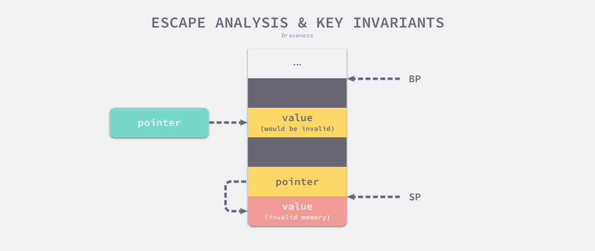
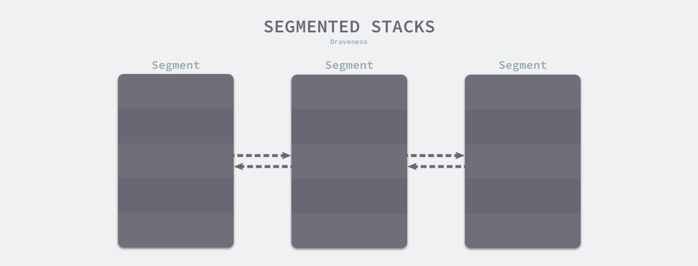
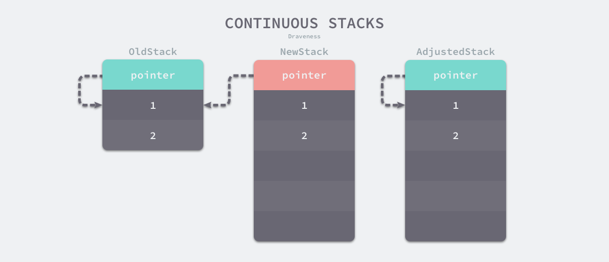
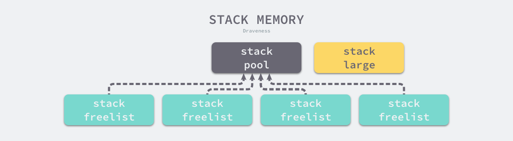
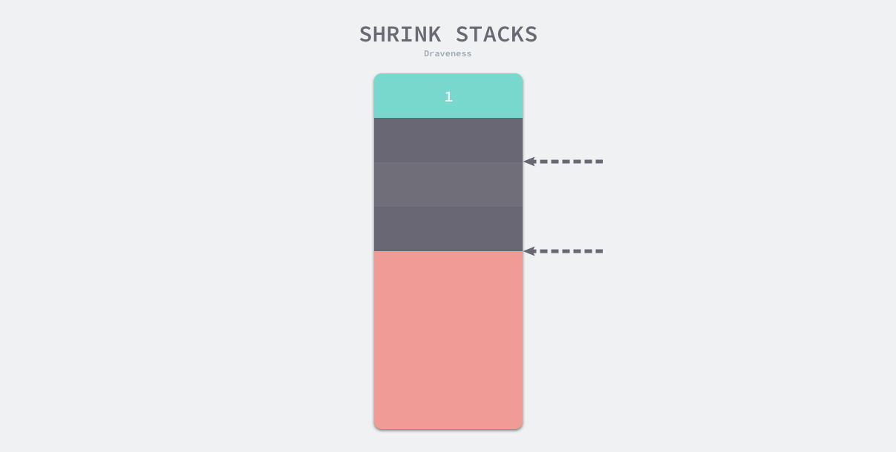

## 栈内存管理器

应用程序的内存一般会分成堆区和栈区，程序在运行期间可以主动从堆区申请内存空间，这些内存由内存分配器分配并由垃圾收集器负责回收，本节会介绍 Go 语言栈内存的管理。

### 设计原理

栈区的内存一般由编译器自动分配和释放，其中存储着函数的入参以及局部变量，这些参数会随着函数的创建而创建，函数的返回而消亡，一般不会在程序中长期存在，这种线性的内存分配策略有着极高地效率，但是工程师也往往不能控制栈内存的分配，这部分工作基本都是由编译器完成的。

#### 寄存器

寄存器[1](https://draveness.me/golang/docs/part3-runtime/ch07-memory/golang-stack-management/#fn:1)是中央处理器（CPU）中的稀缺资源，它的存储能力非常有限，但是能提供最快的读写速度，充分利用寄存器的速度可以构建高性能的应用程序。寄存器在物理机上非常有限，然而栈区的操作会使用到两个以上的寄存器，这足以说明栈内存在应用程序的重要性。

栈寄存器是 CPU 寄存器中的一种，它的主要作用是跟踪函数的调用栈[2](https://draveness.me/golang/docs/part3-runtime/ch07-memory/golang-stack-management/#fn:2)，Go 语言的汇编代码包含 BP 和 SP 两个栈寄存器，它们分别存储了栈的基址指针和栈顶的地址，栈内存与函数调用的关系非常紧密，我们在函数调用一节中曾经介绍过栈区，BP 和 SP 之间的内存就是当前函数的调用栈。


**图 7-43 栈寄存器与内存**

因为历史原因，栈区内存都是从高地址向低地址扩展的，当应用程序申请或者释放栈内存时只需要修改 SP 寄存器的值，这种线性的内存分配方式与堆内存相比更加快速，仅会带来极少的额外开销。

#### 线程栈

如果我们在 Linux 操作系统中执行 `pthread_create` 系统调用，进程会启动一个新的线程，如果用户没有通过软资源限制 `RLIMIT_STACK` 指定线程栈的大小，那么操作系统会根据架构选择不同的默认栈大小[3](https://draveness.me/golang/docs/part3-runtime/ch07-memory/golang-stack-management/#fn:3)。

| 架构    | 默认栈大小 |
| :------ | ---------: |
| i386    |       2 MB |
| IA-64   |      32 MB |
| PowerPC |       4 MB |
| …       |          … |
| x86_64  |       2 MB |

**表 7-4 架构和线程默认栈大小**

多数架构上默认栈大小都在 2 ~ 4 MB 左右，极少数架构会使用 32 MB 的栈，用户程序可以在分配的栈上存储函数参数和局部变量。然而这个固定的栈大小在某些场景下不是合适的值，如果程序需要同时运行几百个甚至上千个线程，这些线程中的大部分都只会用到很少的栈空间，当函数的调用栈非常深时，固定栈大小也无法满足用户程序的需求。

线程和进程都是代码执行的上下文，但是如果一个应用程序包含成百上千个执行上下文并且每个上下文都是线程，会占用大量的内存空间并带来其他的额外开销，Go 语言在设计时认为执行上下文是轻量级的，所以它在用户态实现 Goroutine 作为执行上下文。

#### 逃逸分析

在 C 语言和 C++ 这类需要手动管理内存的编程语言中，将对象或者结构体分配到栈上或者堆上是由工程师自主决定的，这也为工程师的工作带来的挑战，如果工程师能够精准地为每一个变量分配合理的空间，那么整个程序的运行效率和内存使用效率一定是最高的，但是手动分配内存会导致如下的两个问题：

1. 不需要分配到堆上的对象分配到了堆上 — 浪费内存空间；
2. 需要分配到堆上的对象分配到了栈上 — 悬挂指针、影响内存安全；

与悬挂指针相比，浪费内存空间反而是小问题。在 C 语言中，栈上的变量被函数作为返回值返回给调用方是一个常见的错误。

在编译器优化中，逃逸分析是用来决定指针动态作用域的方法[5](https://draveness.me/golang/docs/part3-runtime/ch07-memory/golang-stack-management/#fn:5)。Go 语言的编译器使用逃逸分析决定哪些变量应该在栈上分配，哪些变量应该在堆上分配，其中包括使用 `new`、`make` 和字面量等方法隐式分配的内存，Go 语言的逃逸分析遵循以下两个不变性：

1. 指向栈对象的指针不能存在于堆中；
2. 指向栈对象的指针不能在栈对象回收后存活；



**图 7-44 逃逸分析和不变性**

我们通过上图展示两条不变性存在的意义，当我们违反了第一条不变性时，堆上的绿色指针指向了栈中的黄色内存，一旦函数返回后函数栈会被回收，该绿色指针指向的值就不再合法；如果我们违反了第二条不变性，因为寄存器 SP 下面的内存由于函数返回已经释放，所以黄色指针指向的内存已经不再合法。

逃逸分析是静态分析的一种，在编译器解析了 Go 语言源文件后，它可以获得整个程序的抽象语法树（Abstract syntax tree，AST），编译器可以根据抽象语法树分析静态的数据流，我们会通过以下几个步骤实现静态分析的全过程[6](https://draveness.me/golang/docs/part3-runtime/ch07-memory/golang-stack-management/#fn:6)：

1. 构建带权重的有向图，其中顶点 [`cmd/compile/internal/gc.EscLocation`](https://draveness.me/golang/tree/cmd/compile/internal/gc.EscLocation) 表示被分配的变量，边 [`cmd/compile/internal/gc.EscEdge`](https://draveness.me/golang/tree/cmd/compile/internal/gc.EscEdge) 表示变量之间的分配关系，权重表示寻址和取地址的次数；
2. 遍历对象分配图并查找违反两条不变性的变量分配关系，如果堆上的变量指向了栈上的变量，那么该变量需要分配在堆上；
3. 记录从函数的调用参数到堆以及返回值的数据流，增强函数参数的逃逸分析；

决定变量是在栈上还是堆上虽然重要，但是这是一个定义相对清晰的问题，我们可以通过编译器统一作决策。为了保证内存的绝对安全，编译器可能会将一些变量错误地分配到堆上，但是因为堆也会被垃圾收集器扫描，所以不会造成内存泄露以及悬挂指针等安全问题，解放了工程师的生产力。

#### 栈内存空间

Go 语言使用用户态线程 Goroutine 作为执行上下文，它的额外开销和默认栈大小都比线程小很多，然而 Goroutine 的栈内存空间和栈结构也在早期几个版本中发生过一些变化：

1. v1.0 ~ v1.1 — 最小栈内存空间为 4KB；
2. v1.2 — 将最小栈内存提升到了 8KB；
3. v1.3 — 使用**连续栈**替换之前版本的分段栈；
4. v1.4 — 将最小栈内存降低到了 2KB；

Goroutine 的初始栈内存在最初的几个版本中多次修改，从 4KB 提升到 8KB 是临时的解决方案，其目的是为了减轻分段栈中的栈分裂对程序的性能影响；在 v1.3 版本引入连续栈之后，Goroutine 的初始栈大小降低到了 2KB，进一步减少了 Goroutine 占用的内存空间。

##### 分段栈

分段栈是 Go 语言在 v1.3 版本之前的实现，所有 Goroutine 在初始化时都会调用 [`runtime.stackalloc:go1.2`](https://draveness.me/golang/tree/runtime.stackalloc:go1.2) 分配一块固定大小的内存空间，这块内存的大小由 [`runtime.StackMin:go1.2`](https://draveness.me/golang/tree/runtime.StackMin:go1.2) 表示，在 v1.2 版本中为 8KB：

```c
void* runtime·stackalloc(uint32 n) {
	uint32 pos;
	void *v;
	// Stacks are usually allocated with a fixed-size free-list allocator,
	// but if we need a stack of non-standard size, we fall back on malloc
	// (assuming that inside malloc and GC all the stack frames are small,
	// so that we do not deadlock).
	if(n == FixedStack || m->mallocing || m->gcing) {
		if(m->stackcachecnt == 0)
			stackcacherefill();
		pos = m->stackcachepos;
		pos = (pos - 1) % StackCacheSize;
		v = m->stackcache[pos];
		m->stackcachepos = pos;
		m->stackcachecnt--;
		m->stackinuse++;
		return v;
	}
	return runtime·mallocgc(n, 0, FlagNoProfiling|FlagNoGC|FlagNoZero|FlagNoInvokeGC);
}
```

如果通过该方法申请的内存大小为固定的 8KB 或者满足其他的条件，运行时会在全局的栈缓存链表中找到空闲的内存块并作为新 Goroutine 的栈空间返回；在其余情况下，栈内存空间会从堆上申请一块合适的内存。

当 Goroutine 调用的函数层级或者局部变量需要的越来越多时，运行时会调用 [`runtime.morestack:go1.2`](https://draveness.me/golang/tree/runtime.morestack:go1.2) 和 [`runtime.newstack:go1.2`](https://draveness.me/golang/tree/runtime.newstack:go1.2) 创建一个新的栈空间，这些栈空间虽然不连续，但是当前 Goroutine 的多个栈空间会以链表的形式串联起来，运行时会通过指针找到连续的栈片段：



**图 7-45 分段栈的内存布局**

一旦 Goroutine 申请的栈空间不在被需要，运行时会调用 [`runtime.lessstack:go1.2`](https://draveness.me/golang/tree/runtime.lessstack:go1.2) 和 [`runtime.oldstack:go1.2`](https://draveness.me/golang/tree/runtime.oldstack:go1.2) 释放不再使用的内存空间。

分段栈机制虽然能够按需为当前 Goroutine 分配内存并且及时减少内存的占用，但是它也存在两个比较大的问题：

1. 如果当前 Goroutine 的栈几乎充满，那么任意的函数调用都会触发栈扩容，当函数返回后又会触发栈的收缩，如果在一个循环中调用函数，栈的分配和释放就会造成巨大的额外开销，这被称为热分裂问题（Hot split）；
2. 一旦 Goroutine 使用的内存**越过**了分段栈的扩缩容阈值，运行时会触发栈的扩容和缩容，带来额外的工作量；

##### 连续栈

连续栈可以解决分段栈中存在的两个问题，其核心原理是每当程序的栈空间不足时，初始化一片更大的栈空间并将原栈中的所有值都迁移到新栈中，新的局部变量或者函数调用就有充足的内存空间。使用连续栈机制时，栈空间不足导致的扩容会经历以下几个步骤：

1. 在内存空间中分配更大的栈内存空间；
2. 将旧栈中的所有内容复制到新栈中；
3. **将指向旧栈对应变量的指针重新指向新栈**；
4. 销毁并回收旧栈的内存空间；

在扩容的过程中，最重要的是调整指针的第三步，这一步能够保证指向栈的指针的正确性，因为栈中的所有变量内存都会发生变化，所以原本指向栈中变量的指针也需要调整。我们在前面提到过经过逃逸分析的 Go 语言程序的遵循以下不变性 —— **指向栈对象的指针不能存在于堆中**，所以指向栈中变量的指针只能在栈上，我们只需要调整栈中的所有变量就可以保证内存的安全了。



**图 7-46 连续栈的内存布局**

因为需要拷贝变量和调整指针，连续栈增加了栈扩容时的额外开销，但是通过合理栈缩容机制就能避免热分裂带来的性能问题[10](https://draveness.me/golang/docs/part3-runtime/ch07-memory/golang-stack-management/#fn:10)，在 GC 期间如果 Goroutine 使用了栈内存的四分之一，那就将其内存减少一半，这样在栈内存几乎充满时也只会扩容一次，不会因为函数调用频繁扩缩容。

### 栈操作

Go 语言中的执行栈由 [`runtime.stack`](https://draveness.me/golang/tree/runtime.stack) 表示，该结构体中只包含两个字段，分别表示栈的顶部和栈的底部，每个栈结构体都表示范围为 `[lo, hi)` 的内存空间：

```go
type stack struct {
	lo uintptr
	hi uintptr
}
```

栈的结构虽然非常简单，但是想要理解 Goroutine 栈的实现原理，还是需要我们从编译期间和运行时两个阶段入手：

1. 编译器会在编译阶段会通过 [`cmd/internal/obj/x86.stacksplit`](https://draveness.me/golang/tree/cmd/internal/obj/x86.stacksplit) 在调用函数前插入 [`runtime.morestack`](https://draveness.me/golang/tree/runtime.morestack) 或者 [`runtime.morestack_noctxt`](https://draveness.me/golang/tree/runtime.morestack_noctxt) 函数；
2. 运行时在创建新的 Goroutine 时会在 [`runtime.malg`](https://draveness.me/golang/tree/runtime.malg) 中调用 [`runtime.stackalloc`](https://draveness.me/golang/tree/runtime.stackalloc) 申请新的栈内存，并在编译器插入的 [`runtime.morestack`](https://draveness.me/golang/tree/runtime.morestack) 中检查栈空间是否充足；

需要注意的是，Go 语言的编译器不会为所有的函数插入 [`runtime.morestack`](https://draveness.me/golang/tree/runtime.morestack)，它只会在必要时插入指令以减少运行时的额外开销，编译指令 `nosplit` 可以跳过栈溢出的检查，虽然这能降低一些开销，不过固定大小的栈也存在溢出的风险。本节将分别分析栈的初始化、创建 Goroutine 时栈的分配、编译器和运行时协作完成的栈扩容以及当栈空间利用率不足时的缩容过程。

#### 栈初始化

栈空间在运行时中包含两个重要的全局变量，分别是 [`runtime.stackpool`](https://draveness.me/golang/tree/runtime.stackpool) 和 [`runtime.stackLarge`](https://draveness.me/golang/tree/runtime.stackLarge)，这两个变量分别表示全局的栈缓存和大栈缓存，前者可以分配小于 32KB 的内存，后者用来分配大于 32KB 的栈空间：

```go
// Global pool of spans that have free stacks.
// Stacks are assigned an order according to size.
//     order = log_2(size/FixedStack)
// There is a free list for each order.
var stackpool [_NumStackOrders]struct {
	item stackpoolItem
	_    [cpu.CacheLinePadSize - unsafe.Sizeof(stackpoolItem{})%cpu.CacheLinePadSize]byte
}

//go:notinheap
type stackpoolItem struct {
	mu   mutex
	span mSpanList
}

// Global pool of large stack spans.
var stackLarge struct {
	lock mutex
	free [heapAddrBits - pageShift]mSpanList
}
```

这两个用于分配空间的全局变量都与内存管理单元 [`runtime.mspan`](https://draveness.me/golang/tree/runtime.mspan) 有关，我们可以认为 Go 语言的栈内存都是分配在堆上的，运行时初始化会调用 [`runtime.stackinit`](https://draveness.me/golang/tree/runtime.stackinit) 初始化这些全局变量：

```go
func stackinit() {
	for i := range stackpool {
		stackpool[i].item.span.init()
	}
	for i := range stackLarge.free {
		stackLarge.free[i].init()
	}
}
```

从调度器和内存分配的经验来看，如果运行时只使用全局变量来分配内存的话，势必会造成线程之间的锁竞争进而影响程序的执行效率，栈内存由于与线程关系比较密切，所以我们在每一个线程缓存 [`runtime.mcache`](https://draveness.me/golang/tree/runtime.mcache) 中都加入了栈缓存减少锁竞争影响。

```go
type mcache struct {
  ...
	stackcache [_NumStackOrders]stackfreelist
  ...
}

type stackfreelist struct {
	list gclinkptr // linked list of free stacks
	size uintptr   // total size of stacks in list
}
```



**图 7-47 线程栈缓存和全局栈缓存**

运行时使用全局的 [`runtime.stackpool`](https://draveness.me/golang/tree/runtime.stackpool) 和线程缓存中的空闲链表分配 32KB 以下的栈内存，使用全局的 [`runtime.stackLarge`](https://draveness.me/golang/tree/runtime.stackLarge) 和堆内存分配 32KB 以上的栈内存，提高本地分配栈内存的性能。

#### 栈分配

运行时会在 Goroutine 的初始化函数 [`runtime.malg`](https://draveness.me/golang/tree/runtime.malg) 中调用 [`runtime.stackalloc`](https://draveness.me/golang/tree/runtime.stackalloc) 分配一个大小足够栈内存空间，根据线程缓存和申请栈的大小，该函数会通过三种不同的方法分配栈空间：

1. 如果栈空间较小，使用全局栈缓存或者线程缓存上固定大小的空闲链表分配内存；
2. 如果栈空间较大，从全局的大栈缓存 [`runtime.stackLarge`](https://draveness.me/golang/tree/runtime.stackLarge) 中获取内存空间；
3. 如果栈空间较大并且 [`runtime.stackLarge`](https://draveness.me/golang/tree/runtime.stackLarge) 空间不足，在堆上申请一片大小足够内存空间；

我们在这里会按照栈的大小分两部分介绍运行时对栈空间的分配。在 Linux 上，`_FixedStack = 2048`、`_NumStackOrders = 4`、`_StackCacheSize = 32768`，也就是如果申请的栈空间小于 32KB，我们会在全局栈缓存池或者线程的栈缓存中初始化内存：

```go
// stackalloc allocates an n byte stack.
//
// stackalloc must run on the system stack because it uses per-P
// resources and must not split the stack.
//
//go:systemstack
func stackalloc(n uint32) stack {
	// Stackalloc must be called on scheduler stack, so that we
	// never try to grow the stack during the code that stackalloc runs.
	// Doing so would cause a deadlock (issue 1547).
	thisg := getg()
 
	// Small stacks are allocated with a fixed-size free-list allocator.
	// If we need a stack of a bigger size, we fall back on allocating
	// a dedicated span.
	var v unsafe.Pointer
	if n < _FixedStack<<_NumStackOrders && n < _StackCacheSize {
		order := uint8(0)
		n2 := n
		for n2 > _FixedStack {
			order++
			n2 >>= 1
		}
		var x gclinkptr
		c := thisg.m.mcache
		if stackNoCache != 0 || c == nil || thisg.m.preemptoff != "" {
			// thisg.m.p == 0 can happen in the guts of exitsyscall
			// or procresize. Just get a stack from the global pool.
			// Also don't touch stackcache during gc
			// as it's flushed concurrently.
			x = stackpoolalloc(order)
		} else {
			x = c.stackcache[order].list
			if x.ptr() == nil {
				stackcacherefill(c, order)
				x = c.stackcache[order].list
			}
			c.stackcache[order].list = x.ptr().next
			c.stackcache[order].size -= uintptr(n)
		}
		v = unsafe.Pointer(x)
	} else {
		...
	}
	...
}
```

[`runtime.stackpoolalloc`](https://draveness.me/golang/tree/runtime.stackpoolalloc) 会在全局的栈缓存池 [`runtime.stackpool`](https://draveness.me/golang/tree/runtime.stackpool) 中获取新的内存，如果栈缓存池中不包含剩余的内存，运行时会从堆上申请一片内存空间；如果线程缓存中包含足够的空间，我们可以从线程本地的缓存中获取内存，一旦发现空间不足就会调用 [`runtime.stackcacherefill`](https://draveness.me/golang/tree/runtime.stackcacherefill) 从堆上获取新的内存。

如果 Goroutine 申请的内存空间过大，运行时会查看 [`runtime.stackLarge`](https://draveness.me/golang/tree/runtime.stackLarge) 中是否有剩余的空间，如果不存在剩余空间，它也会从堆上申请新的内存：

```go
func stackalloc(n uint32) stack {
	...
	if n < _FixedStack<<_NumStackOrders && n < _StackCacheSize {
		...
	} else {
		var s *mspan
		npage := uintptr(n) >> _PageShift
		log2npage := stacklog2(npage)

		// Try to get a stack from the large stack cache.
		if !stackLarge.free[log2npage].isEmpty() {
			s = stackLarge.free[log2npage].first
			stackLarge.free[log2npage].remove(s)
		}

		if s == nil {
			// Allocate a new stack from the heap.
			s = mheap_.allocManual(npage, &memstats.stacks_inuse)
			osStackAlloc(s)
			s.elemsize = uintptr(n)
		}
		v = unsafe.Pointer(s.base())
	}

	return stack{uintptr(v), uintptr(v) + uintptr(n)}
}
```

需要注意的是，因为 OpenBSD 6.4+ 对栈内存有特殊的需求，所以只要从堆上申请栈内存，需要调用 [`runtime.osStackAlloc`](https://draveness.me/golang/tree/runtime.osStackAlloc) 做一些额外处理，然而其他的操作系统就没有这种限制了。

#### 栈扩容

编译器会在 [`cmd/internal/obj/x86.stacksplit`](https://draveness.me/golang/tree/cmd/internal/obj/x86.stacksplit) 中为函数调用插入 [`runtime.morestack`](https://draveness.me/golang/tree/runtime.morestack) 运行时检查，它会在几乎所有的函数调用之前检查当前 Goroutine 的栈内存是否充足。

在 `Goroutine` 中会通过 `stackguard0` 来判断是否要进行栈增长：

- `stackguard0`：`stack.lo` + `StackGuard`, 用于`stack overlow`的检测；
- `StackGuard`：保护区大小，常量`Linux`上为 [928 字节](https://github.com/golang/go/blob/go1.16.6/src/cmd/internal/objabi/stack.go#L21)；
- `StackSmall`：常量大小为 `128` 字节，用于小函数调用的优化；
- `StackBig`：常量大小为 `4096` 字节；

 [`cmd/internal/obj/x86.stacksplit`](https://draveness.me/golang/tree/cmd/internal/obj/x86.stacksplit) 根据帧栈大小插入的指令判断逻辑：

1. 当栈帧大小（FramSzie）小于等于 StackSmall（128）时，如果 SP 小于 stackguard0 那么就执行栈扩容；
2. 当栈帧大小（FramSzie）大于 StackSmall（128）时，就会根据公式 `SP-framesize <= stackguard0-StackSmall，如果为true则执行扩容；
3. 当栈帧大小（FramSzie）大于StackBig（4096）时，首先会检查 stackguard0 是否已转变成 StackPreempt 状态了；然后根据公式 `SP-stackguard0+StackGuard <= framesize + (StackGuard-StackSmall)`判断，如果是 true 则执行扩容；

> 参考：https://www.cnblogs.com/luozhiyun/p/14619585.html

主要注意的是，在一些函数的执行代码中，编译器很智能的加上了`NOSPLIT`标记，打了这个标记之后就会禁用栈溢出检测。大致代码逻辑应该是：当函数处于调用链的叶子节点，且栈帧小于StackSmall字节时，则自动标记为NOSPLIT。

```go
// Append code to p to check for stack split.
// Appends to (does not overwrite) p.
// Assumes g is in CX.
// Returns last new instruction.
func stacksplit(ctxt *obj.Link, cursym *obj.LSym, p *obj.Prog, newprog obj.ProgAlloc, framesize int32, textarg int32) *obj.Prog {
  ...
  if framesize <= objabi.StackSmall {
    // small stack: SP <= stackguard
		//	CMPQ SP, stackguard
    ...
  } else if framesize <= objabi.StackBig {
    // large stack: SP-framesize <= stackguard-StackSmall
		//	LEAQ -xxx(SP), AX
		//	CMPQ AX, stackguard
    ...
  }else {
		// Such a large stack we need to protect against wraparound.
		// If SP is close to zero:
		//	SP-stackguard+StackGuard <= framesize + (StackGuard-StackSmall)
		// The +StackGuard on both sides is required to keep the left side positive:
		// SP is allowed to be slightly below stackguard. See stack.h.
		//
		// Preemption sets stackguard to StackPreempt, a very large value.
		// That breaks the math above, so we have to check for that explicitly.
		//	MOVQ	stackguard, SI
		//	CMPQ	SI, $StackPreempt
		//	JEQ	label-of-call-to-morestack
		//	LEAQ	StackGuard(SP), AX
		//	SUBQ	SI, AX
		//	CMPQ	AX, $(framesize+(StackGuard-StackSmall))
    ...
  }
}
```

如果当前栈需要扩容，会保存一些栈的相关信息并调用 [`runtime.newstack`](https://draveness.me/golang/tree/runtime.newstack) 创建新的栈：

```go
// Called from runtime·morestack when more stack is needed.
// Allocate larger stack and relocate to new stack.
// Stack growth is multiplicative, for constant amortized cost.
//
// g->atomicstatus will be Grunning or Gscanrunning upon entry.
// If the scheduler is trying to stop this g, then it will set preemptStop.
//
// This must be nowritebarrierrec because it can be called as part of
// stack growth from other nowritebarrierrec functions, but the
// compiler doesn't check this.
//
//go:nowritebarrierrec
func newstack() {
	thisg := getg()
	gp := thisg.m.curg
	...
	// NOTE: stackguard0 may change underfoot, if another thread
	// is about to try to preempt gp. Read it just once and use that same
	// value now and below.
	preempt := atomic.Loaduintptr(&gp.stackguard0) == stackPreempt

  // Be conservative about where we preempt.
	// We are interested in preempting user Go code, not runtime code.
	// If we're holding locks, mallocing, or preemption is disabled, don't
	// preempt.
	// This check is very early in newstack so that even the status change
	// from Grunning to Gwaiting and back doesn't happen in this case.
	// That status change by itself can be viewed as a small preemption,
	// because the GC might change Gwaiting to Gscanwaiting, and then
	// this goroutine has to wait for the GC to finish before continuing.
	// If the GC is in some way dependent on this goroutine (for example,
	// it needs a lock held by the goroutine), that small preemption turns
	// into a real deadlock.
	if preempt {
		if !canPreemptM(thisg.m) {
			// Let the goroutine keep running for now.
			// gp->preempt is set, so it will be preempted next time.
			gp.stackguard0 = gp.stack.lo + _StackGuard
			gogo(&gp.sched)
		}
	}

	sp := gp.sched.sp
  ...
	if preempt {
    ...
		if gp.preemptShrink {
			// We're at a synchronous safe point now, so
			// do the pending stack shrink.
			gp.preemptShrink = false
			shrinkstack(gp)
		}

		if gp.preemptStop {
			preemptPark(gp) // never returns
		}

		// Act like goroutine called runtime.Gosched.
		gopreempt_m(gp)
	}
	...
}
```

[`runtime.newstack`](https://draveness.me/golang/tree/runtime.newstack) 会先做一些准备工作并检查当前 Goroutine 是否发出了抢占请求，如果发出了抢占请求：

1. 当前线程可以被抢占时，直接调用 [`runtime.gogo`](https://draveness.me/golang/tree/runtime.gogo) 触发调度器的调度；
2. 如果当前 Goroutine 在垃圾回收被 [`runtime.scanstack`](https://draveness.me/golang/tree/runtime.scanstack) 标记成了需要收缩栈，调用 [`runtime.shrinkstack`](https://draveness.me/golang/tree/runtime.shrinkstack)；
3. 如果当前 Goroutine 被 [`runtime.suspendG`](https://draveness.me/golang/tree/runtime.suspendG) 函数挂起，调用 [`runtime.preemptPark`](https://draveness.me/golang/tree/runtime.preemptPark) 被动让出当前处理器的控制权并将 Goroutine 的状态修改至 `_Gpreempted`；
4. 调用 [`runtime.gopreempt_m`](https://draveness.me/golang/tree/runtime.gopreempt_m) 主动让出当前处理器的控制权；

如果当前 Goroutine 不需要被抢占，意味着我们需要新的栈空间来支持函数调用和本地变量的初始化，运行时会先检查目标大小的栈是否会溢出：

```go
func newstack() {
	...
  // Allocate a bigger segment and move the stack.
	oldsize := gp.stack.hi - gp.stack.lo
	newsize := oldsize * 2
  ...
	if newsize > maxstacksize {
		print("runtime: goroutine stack exceeds ", maxstacksize, "-byte limit\n")
		print("runtime: sp=", hex(sp), " stack=[", hex(gp.stack.lo), ", ", hex(gp.stack.hi), "]\n")
		throw("stack overflow")
	}

	// The goroutine must be executing in order to call newstack,
	// so it must be Grunning (or Gscanrunning).
	casgstatus(gp, _Grunning, _Gcopystack)
	// The concurrent GC will not scan the stack while we are doing the copy since
	// the gp is in a Gcopystack status.
	copystack(gp, newsize)
	casgstatus(gp, _Gcopystack, _Grunning)
	gogo(&gp.sched)
}
```

如果目标栈的大小没有超出程序的限制，我们会将 Goroutine 切换至 `_Gcopystack` 状态并调用 [`runtime.copystack`](https://draveness.me/golang/tree/runtime.copystack) 开始栈拷贝。在拷贝栈内存之前，运行时会通过 [`runtime.stackalloc`](https://draveness.me/golang/tree/runtime.stackalloc) 分配新的栈空间：

```go
// Copies gp's stack to a new stack of a different size.
// Caller must have changed gp status to Gcopystack.
func copystack(gp *g, newsize uintptr) {
	old := gp.stack
	used := old.hi - gp.sched.sp

	// allocate new stack
	new := stackalloc(uint32(newsize))
	...
}
```

新栈的初始化和数据的复制是一个比较简单的过程，不过这不是整个过程中最复杂的地方，我们还需要将指向源栈中内存指向新的栈，在这期间我们需要分别调整以下的指针：

1. 调用 [`runtime.adjustsudogs`](https://draveness.me/golang/tree/runtime.adjustsudogs) 或者 [`runtime.syncadjustsudogs`](https://draveness.me/golang/tree/runtime.syncadjustsudogs) 调整 [`runtime.sudog`](https://draveness.me/golang/tree/runtime.sudog) 结构体的指针；
2. 调用 [`runtime.memmove`](https://draveness.me/golang/tree/runtime.memmove) 将源栈中的整片内存拷贝到新的栈中；
3. 调用 [`runtime.adjustctxt`](https://draveness.me/golang/tree/runtime.adjustctxt)、[`runtime.adjustdefers`](https://draveness.me/golang/tree/runtime.adjustdefers) 和 [`runtime.adjustpanics`](https://draveness.me/golang/tree/runtime.adjustpanics) 调整剩余 Goroutine 相关数据结构的指针；

```go
func copystack(gp *g, newsize uintptr) {
	...
	// Compute adjustment.
	var adjinfo adjustinfo
	adjinfo.old = old
	adjinfo.delta = new.hi - old.hi // 计算新栈和旧栈之间内存地址差

	// Adjust sudogs, synchronizing with channel ops if necessary.
	ncopy := used
	if !gp.activeStackChans {
		adjustsudogs(gp, &adjinfo)
	} else {
		// sudogs may be pointing in to the stack and gp has
		// released channel locks, so other goroutines could
		// be writing to gp's stack. Find the highest such
		// pointer so we can handle everything there and below
		// carefully. (This shouldn't be far from the bottom
		// of the stack, so there's little cost in handling
		// everything below it carefully.)
		adjinfo.sghi = findsghi(gp, old)

		// Synchronize with channel ops and copy the part of
		// the stack they may interact with.
		ncopy -= syncadjustsudogs(gp, used, &adjinfo)
	}

	// Copy the stack (or the rest of it) to the new location
	memmove(unsafe.Pointer(new.hi-ncopy), unsafe.Pointer(old.hi-ncopy), ncopy)

	// Adjust remaining structures that have pointers into stacks.
	// We have to do most of these before we traceback the new
	// stack because gentraceback uses them.
	adjustctxt(gp, &adjinfo)
	adjustdefers(gp, &adjinfo)
	adjustpanics(gp, &adjinfo)

	// Swap out old stack for new one
	gp.stack = new
	gp.stackguard0 = new.lo + _StackGuard
	gp.sched.sp = new.hi - used
	gp.stktopsp += adjinfo.delta
	...
	stackfree(old)
}
```

调整指向栈内存的指针都会调用 [`runtime.adjustpointer`](https://draveness.me/golang/tree/runtime.adjustpointer)，该函数会利用 [`runtime.adjustinfo`](https://draveness.me/golang/tree/runtime.adjustinfo) 计算的新栈和旧栈之间的内存地址差来调整指针。所有的指针都被调整后，我们就可以更新 Goroutine 的几个变量并通过 [`runtime.stackfree`](https://draveness.me/golang/tree/runtime.stackfree) 释放原始栈的内存空间了。

##### nosplit检测

nosplit标记可以禁用栈溢出检测`prolog`，即该函数运行不会导致栈分裂，由于不需要再照常执行栈溢出检测，所以会提升一些函数性能。

```go
// cmd/internal/obj/s390x/objz.go

if p.Mark&LEAF != 0 && autosize < objabi.StackSmall {
    // A leaf function with a small stack can be marked
    // NOSPLIT, avoiding a stack check.
    p.From.Sym.Set(obj.AttrNoSplit, true)
}
```

当函数处于调用链的叶子节点，且栈帧小于`StackSmall`字节时，则自动标记为`NOSPLIT`。 `x86`架构处理与之类似

自动标记为`NOSPLIT`的函数，链接器就会知道该函数最多还会使用`StackLimit`字节空间，不需要栈分裂。

#### 栈缩容

栈的收缩发生在 `GC` 时对栈进行扫描的阶段，[`runtime.shrinkstack`](https://draveness.me/golang/tree/runtime.shrinkstack) 栈缩容时调用的函数，该函数的实现原理非常简单，其中大部分都是检查是否满足缩容前置条件的代码，核心逻辑只有以下这几行：

```go
func scanstack(gp *g, gcw *gcWork) {
    ... 
    // 进行栈收缩
    shrinkstack(gp)
    ...
}


// Maybe shrink the stack being used by gp.
//
// gp must be stopped and we must own its stack. It may be in
// _Grunning, but only if this is our own user G.
func shrinkstack(gp *g) {
	...
	oldsize := gp.stack.hi - gp.stack.lo
	newsize := oldsize / 2
	// Don't shrink the allocation below the minimum-sized stack
	// allocation.
	if newsize < _FixedStack {
		return
	}
	// Compute how much of the stack is currently in use and only
	// shrink the stack if gp is using less than a quarter of its
	// current stack. The currently used stack includes everything
	// down to the SP plus the stack guard space that ensures
	// there's room for nosplit functions.
	avail := gp.stack.hi - gp.stack.lo
	if used := gp.stack.hi - gp.sched.sp + _StackLimit; used >= avail/4 {
		return
	}

	copystack(gp, newsize)
}
```

如果要触发栈的缩容，新栈的大小会是原始栈的一半，不过如果新栈的大小低于程序的最低限制 2KB，那么缩容的过程就会停止。



**图 7-48 栈的缩容操作**

运行时只会在栈内存使用不足 1/4 时进行缩容，缩容也会调用扩容时使用的 [`runtime.copystack`](https://draveness.me/golang/tree/runtime.copystack) 开辟新的栈空间。

### 小结 

栈内存是应用程序中重要的内存空间，它能够支持本地的局部变量和函数调用，栈空间中的变量会与栈一同创建和销毁，这部分内存空间不需要工程师过多的干预和管理，现代的编程语言通过逃逸分析减少了我们的工作量，理解栈空间的分配对于理解 Go 语言的运行时有很大的帮助。

### 延伸阅读

- [Go’s runtime C to Go rewrite, by the numbers](https://dave.cheney.net/2014/09/01/gos-runtime-c-to-go-rewrite-by-the-numbers)
- [Re: proc fs and shared pids](http://lkml.iu.edu/hypermail/linux/kernel/9608/0191.html)
- [Go 1.2 Runtime Symbol Information](https://docs.google.com/document/d/1lyPIbmsYbXnpNj57a261hgOYVpNRcgydurVQIyZOz_o/pub)
- [Precise Stack Roots](https://docs.google.com/document/d/13v_u3UrN2pgUtPnH4y-qfmlXwEEryikFu0SQiwk35SA/pub)
- [GC scanning of stacks](https://docs.google.com/document/d/1un-Jn47yByHL7I0aVIP_uVCMxjdM5mpelJhiKlIqxkE/edit#heading=h.bvezjdnoi4no)
- [Go: How Does the Goroutine Stack Size Evolve?](https://medium.com/a-journey-with-go/go-how-does-the-goroutine-stack-size-evolve-447fc02085e5)

### 参考文章

1. https://fanlv.wiki/2021/08/01/golang-stack/#%E5%88%86%E6%AE%B5%E6%A0%88
2. https://draveness.me/golang/docs/part3-runtime/ch07-memory/golang-stack-management/
3. https://www.cnblogs.com/luozhiyun/p/14619585.html