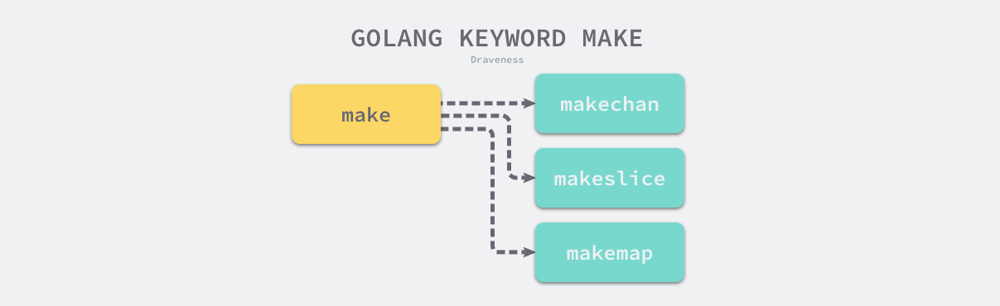

## 类型检查

[原文](https://draveness.me/golang/docs/part1-prerequisite/ch02-compile/golang-typecheck/)

### 强弱类型

对于强弱类型，一般会有如下结论：

- 强类型的编程语言在编译期间会有更严格的类型限制，也就是编译器会在编译期间发现变量赋值、返回值和函数调用时的类型错误；
- 弱类型的编程语言在出现类型错误时可能会在运行时进行隐式的类型转换，在类型转换时可能会造成运行错误。

依据上面的结论，我们就可以认为 Java、C# 等在编译期间进行类型检查的编程语言是强类型的。同样地，因为 Go 语言会在编译期间发现类型错误，也应该是强类型的编程语言。

### 静态类型和动态类型

静态类型和动态类型的编程语言其实也是两个不精确的表述，正确的表达应该是使用[静态类型检查](https://en.wikipedia.org/wiki/Type_system#Static_type_checking)和[动态类型检查](https://en.wikipedia.org/wiki/Type_system#Dynamic_type_checking_and_runtime_type_information)的编程语言

#### 静态类型检查

静态类型检查是基于对源代码的分析来确定运行程序类型安全的过程[3](https://draveness.me/golang/docs/part1-prerequisite/ch02-compile/golang-typecheck/#fn:3)，如果我们的代码能够通过静态类型检查，那么当前程序在一定程度上可以满足类型安全的要求，它能够减少程序在运行时的类型检查，也可以被看作是一种代码优化的方式。

#### 动态类型检查

动态类型检查是在运行时确定程序类型安全的过程，它需要编程语言在编译时为所有的对象加入类型标签等信息，运行时可以使用这些存储的类型信息来实现动态派发、向下转型、反射以及其他特性[6](https://draveness.me/golang/docs/part1-prerequisite/ch02-compile/golang-typecheck/#fn:6)。动态类型检查能为工程师提供更多的操作空间，让我们能在运行时获取一些类型相关的上下文并根据对象的类型完成一些动态操作。

只使用动态类型检查的编程语言叫做动态类型编程语言，常见的动态类型编程语言就包括 JavaScript、Ruby 和 PHP，虽然这些编程语言在使用上非常灵活也不需要经过编译，但是有问题的代码该不会因为更加灵活就会减少错误，该出错时仍然会出错，它们在提高灵活性的同时，也提高了对工程师的要求。

#### 小结

静态类型检查和动态类型检查不是完全冲突和对立的，很多编程语言都会同时使用两种类型检查，例如：Java 不仅在编译期间提前检查类型发现类型错误，还为对象添加了类型信息，在运行时使用反射根据对象的类型动态地执行方法增强灵活性并减少冗余代码。

### 执行过程

Go 语言的编译器不仅使用静态类型检查来保证程序运行的类型安全，还会在编程期间引入类型信息，让工程师能够使用反射来判断参数和变量的类型。当我们想要将 `interface{}` 转换成具体类型时会进行动态类型检查，如果无法发生转换就会发生程序崩溃。

编译器类型检查的主要逻辑都在 [`cmd/compile/internal/gc.typecheck`](https://draveness.me/golang/tree/cmd/compile/internal/gc.typecheck) 和 [`cmd/compile/internal/gc.typecheck1`](https://draveness.me/golang/tree/cmd/compile/internal/gc.typecheck1) 这中，其中 [`cmd/compile/internal/gc.typecheck`](https://draveness.me/golang/tree/cmd/compile/internal/gc.typecheck) 中逻辑不是特别多，它会做一些类型检查之前的准备工作。而核心的逻辑都在 [`cmd/compile/internal/gc.typecheck1`](https://draveness.me/golang/tree/cmd/compile/internal/gc.typecheck1) 中，这是由 switch 语句构成的 2000 行函数：

```go
func typecheck1(n *Node, top int) (res *Node) {
	switch n.Op {
	case OTARRAY:
		...

	case OTMAP:
		...

	case OTCHAN:
		...
	}

	...

	return n
}
```

#### 切片OTARRAY

如果当前节点的操作类型是 `OTARRAY`，那么这个分支首先会对右节点，也就是切片或者数组中元素的类型进行类型检查：

```go
	case OTARRAY:
		r := typecheck(n.Right, Etype)
		if r.Type == nil {
			n.Type = nil
			return n
		}
```

然后会根据当前节点的左节点不同，分三种情况更新 [`cmd/compile/internal/gc.Node`](https://draveness.me/golang/tree/cmd/compile/internal/gc.Node) 的类型，即三种不同的声明方式 `[]int`、`[...]int` 和 `[3]int`，第一种相对来说比较简单，会直接调用 [`cmd/compile/internal/types.NewSlice`](https://draveness.me/golang/tree/cmd/compile/internal/types.NewSlice)：

```go
		if n.Left == nil {
			t = types.NewSlice(r.Type)
```

[`cmd/compile/internal/types.NewSlice`](https://draveness.me/golang/tree/cmd/compile/internal/types.NewSlice) 直接返回了一个 `TSLICE` 类型的结构体，元素的类型信息也会存储在结构体中。当遇到 `[...]int` 这种形式的数组类型时，会由 [`cmd/compile/internal/gc.typecheckcomplit`](https://draveness.me/golang/tree/cmd/compile/internal/gc.typecheckcomplit) 处理：

```go
func typecheckcomplit(n *Node) (res *Node) {
	...
	if n.Right.Op == OTARRAY && n.Right.Left != nil && n.Right.Left.Op == ODDD {
		n.Right.Right = typecheck(n.Right.Right, ctxType)
		if n.Right.Right.Type == nil {
			n.Type = nil
			return n
		}
		elemType := n.Right.Right.Type

		length := typecheckarraylit(elemType, -1, n.List.Slice(), "array literal")

		n.Op = OARRAYLIT
		n.Type = types.NewArray(elemType, length)
		n.Right = nil
		return n
	}
	...
}
```

如果源代码中包含了数组的大小，那么会调用 [`cmd/compile/internal/types.NewArray`](https://draveness.me/golang/tree/cmd/compile/internal/types.NewArray) 初始化一个存储着数组中元素类型和数组大小的结构体：

```go
		} else {
			n.Left = indexlit(typecheck(n.Left, ctxExpr))
			l := n.Left
			v := l.Val()
			bound := v.U.(*Mpint).Int64()
			t = types.NewArray(r.Type, bound)		}

		n.Op = OTYPE
		n.Type = t
		n.Left = nil
		n.Right = nil
```

三个不同的分支会分别处理数组和切片声明的不同形式，每一个分支都会更新 [`cmd/compile/internal/gc.Node`](https://draveness.me/golang/tree/cmd/compile/internal/gc.Node) 结构体中存储的类型并修改抽象语法树中的内容。通过对这个片段的分析，我们发现数组的长度是类型检查期间确定的，而 `[...]int` 这种声明形式也只是 Go 语言为我们提供的语法糖。

#### 哈希 OTMAP

如果处理的节点是哈希，那么编译器会分别检查哈希的键值类型以验证它们类型的合法性：

```go
	case OTMAP:
		n.Left = typecheck(n.Left, Etype)
		n.Right = typecheck(n.Right, Etype)
		l := n.Left
		r := n.Right
		n.Op = OTYPE
		n.Type = types.NewMap(l.Type, r.Type)
		mapqueue = append(mapqueue, n)
		n.Left = nil
		n.Right = nil
```

与处理切片时几乎完全相同，这里会通过 [`cmd/compile/internal/types.NewMap`](https://draveness.me/golang/tree/cmd/compile/internal/types.NewMap) 创建一个新的 `TMAP` 结构并将哈希的键值类型都存储到该结构体中：

```go
func NewMap(k, v *Type) *Type {
	t := New(TMAP)
	mt := t.MapType()
	mt.Key = k
	mt.Elem = v
	return t
}
```

代表当前哈希的节点最终也会被加入 `mapqueue` 队列，编译器会在后面的阶段对哈希键的类型进行再次检查，而检查键类型调用的其实是上面提到的 [`cmd/compile/internal/gc.checkMapKeys`](https://draveness.me/golang/tree/cmd/compile/internal/gc.checkMapKeys) 函数：

```go
func checkMapKeys() {
	for _, n := range mapqueue {
		k := n.Type.MapType().Key
		if !k.Broke() && !IsComparable(k) {
			yyerrorl(n.Pos, "invalid map key type %v", k)
		}
	}
	mapqueue = nil
}
```

该函数会遍历 `mapqueue` 队列中等待检查的节点，判断这些类型能否作为哈希的键，如果当前类型不合法会在类型检查的阶段直接报错中止整个检查的过程。

#### 关键字 OMAKE

最后要介绍的是 Go 语言中很常见的内置函数 `make`，在类型检查阶段之前，无论是创建切片、哈希还是 Channel 用的都是 `make` 关键字，不过在类型检查阶段会根据创建的类型将 `make` 替换成特定的函数，后面[生成中间代码](https://draveness.me/golang/docs/part1-prerequisite/ch02-compile/golang-ir-ssa/)的过程就不再会处理 `OMAKE` 类型的节点了，而是会依据生成的细分类型处理：



编译器会先检查关键字 `make` 的第一个类型参数，根据类型的不同进入不同分支，切片分支 `TSLICE`、哈希分支 `TMAP` 和 Channel 分支 `TCHAN`：

如果 `make` 的第一个参数是切片类型，那么就会从参数中获取切片的长度 `len` 和容量 `cap` 并对这两个参数进行校验，其中包括：

1. 切片的长度参数是否被传入；
2. 切片的长度必须要小于或者等于切片的容量；

```go
		case TSLICE:
			if i >= len(args) {
				yyerror("missing len argument to make(%v)", t)
				n.Type = nil
				return n
			}

			l = args[i]
			i++
			l = typecheck(l, ctxExpr)
			var r *Node
			if i < len(args) {
				r = args[i]
				i++
				r = typecheck(r, ctxExpr)
			}

			if Isconst(l, CTINT) && r != nil && Isconst(r, CTINT) && l.Val().U.(*Mpint).Cmp(r.Val().U.(*Mpint)) > 0 {
				yyerror("len larger than cap in make(%v)", t)
				n.Type = nil
				return n
			}

			n.Left = l
			n.Right = r
			n.Op = OMAKESLICE
```

除了对参数的数量和合法性进行校验，这段代码最后会将当前节点的操作 Op 改成 `OMAKESLICE`，方便后面编译阶段的处理。

第二种情况就是 `make` 的第一个参数是 `map` 类型，在这种情况下，第二个可选的参数就是哈希的初始大小，在默认情况下它的大小是 0，当前分支最后也会改变当前节点的 Op 属性：

```go
		case TMAP:
			if i < len(args) {
				l = args[i]
				i++
				l = typecheck(l, ctxExpr)
				l = defaultlit(l, types.Types[TINT])
				if !checkmake(t, "size", l) {
					n.Type = nil
					return n
				}
				n.Left = l
			} else {
				n.Left = nodintconst(0)
			}
			n.Op = OMAKEMAP
```

`make` 内置函数能够初始化的最后一种结构就是 [Channel](https://draveness.me/golang/docs/part3-runtime/ch06-concurrency/golang-channel/) 了，从下面的代码我们可以发现第二个参数表示的就是 Channel 的缓冲区大小，如果不存在第二个参数，那么会创建缓冲区大小为 0 的 Channel：

```go
		case TCHAN:
			l = nil
			if i < len(args) {
				l = args[i]
				i++
				l = typecheck(l, ctxExpr)
				l = defaultlit(l, types.Types[TINT])
				if !checkmake(t, "buffer", l) {
					n.Type = nil
					return n
				}
				n.Left = l
			} else {
				n.Left = nodintconst(0)
			}
			n.Op = OMAKECHAN
```

在类型检查的过程中，无论 `make` 的第一个参数是什么类型，都会对当前节点的 Op 类型进行修改并且对传入参数的合法性进行一定的验证。

### 小结

类型检查是 Go 语言编译的第二个阶段，在词法和语法分析之后我们得到了每个文件对应的抽象语法树，随后的类型检查会遍历抽象语法树中的节点，对每个节点的类型进行检验，找出其中存在的语法错误，在这个过程中也可能会对抽象语法树进行改写，这不仅能够去除一些不会被执行的代码、对代码进行优化以提高执行效率，而且也会修改 `make`、`new` 等关键字对应节点的操作类型。

`make` 和 `new` 这些内置函数其实并不会直接对应某些函数的实现，它们会在编译期间被转换成真正存在的其他函数。