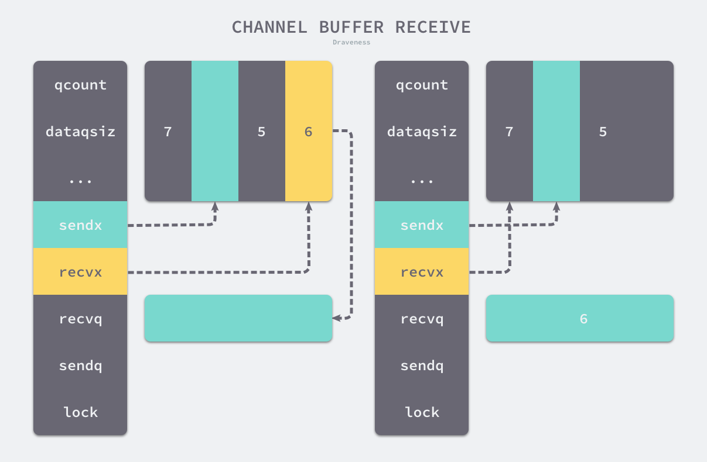

## Channel

[原文连接](https://draveness.me/golang/docs/part3-runtime/ch06-concurrency/golang-channel/)

### 设计原理

虽然我们在 Go 语言中也能使用共享内存加互斥锁进行通信，但是 Go 语言提供了一种不同的并发模型，即通信顺序进程（Communicating sequential processes，CSP）。Goroutine 和 Channel 分别对应 CSP 中的实体和传递信息的媒介，Goroutine 之间会通过 Channel 传递数据。

#### 先入先出

目前的 Channel 收发操作均遵循了先进先出的设计，具体规则如下：

- 先从 Channel 读取数据的 Goroutine 会先接收到数据；
- 先向 Channel 发送数据的 Goroutine 会得到先发送数据的权利；

目前带缓冲区和不带缓冲区的 Channel 都会遵循先入先出发送和接收数据。

#### 无锁管道

锁是一种常见的并发控制技术，我们一般会将锁分成乐观锁(Optimistic)和悲观锁(Pessimistic)，即乐观并发控制和悲观并发控制，无锁（lock-free）队列更准确的描述是使用乐观并发控制的队列。乐观并发控制也叫乐观锁。

乐观并发控制本质上是基于验证的协议，我们使用原子指令 CAS（compare-and-swap 或者 compare-and-set）在多线程中同步数据，无锁队列的实现也依赖这一原子指令。

Channel 在运行时的内部表示是 [`runtime.hchan`](https://draveness.me/golang/tree/runtime.hchan)，该结构体中包含了用于保护成员变量的互斥锁，从某种程度上说，Channel 是一个用于同步和通信的有锁队列，使用互斥锁解决程序中可能存在的线程竞争问题是很常见的，我们能很容易地实现有锁队列。

然而锁导致的休眠和唤醒会带来额外的上下文切换，如果临界区过大，加锁解锁导致的额外开销就会成为性能瓶颈。1994 年的论文 [Implementing lock-free queues](http://people.cs.pitt.edu/~jacklange/teaching/cs2510-f12/papers/implementing_lock_free.pdf) 就研究了如何使用无锁的数据结构实现先进先出队列，而 Go 语言社区也在 2014 年提出了无锁 Channel 的实现方案，该方案将 Channel 分成了以下三种类型：

- 同步 Channel — 不需要缓冲区，发送方会直接将数据交给（Handoff）接收方；
- 异步 Channel — 基于环形缓存的传统生产者消费者模型；
- `chan struct{}` 类型的异步 Channel — `struct{}` 类型不占用内存空间，不需要实现缓冲区和直接发送（Handoff）的语义；

这个提案的目的也不是实现完全无锁的队列，只是在一些关键路径上通过无锁提升 Channel 的性能。社区中已经有无锁 Channel 的实现，但是在实际的基准测试中，无锁队列在多核测试中的表现还需要进一步的改进。

因为目前通过 CAS 实现的无锁 Channel 没有提供先进先出的特性，所以该提案暂时也被搁浅了。

### 数据结构

Go 语言的 Channel 在运行时使用 [`runtime.hchan`](https://draveness.me/golang/tree/runtime.hchan) 结构体表示。我们在 Go 语言中创建新的 Channel 时，实际上创建的都是如下所示的结构：

```go
type hchan struct {
	qcount   uint           // total data in the queue
	dataqsiz uint           // size of the circular queue
	buf      unsafe.Pointer // points to an array of dataqsiz elements
	elemsize uint16
	closed   uint32
	elemtype *_type // element type
	sendx    uint   // send index
	recvx    uint   // receive index
	recvq    waitq  // list of recv waiters
	sendq    waitq  // list of send waiters

	// lock protects all fields in hchan, as well as several
	// fields in sudogs blocked on this channel.
	//
	// Do not change another G's status while holding this lock
	// (in particular, do not ready a G), as this can deadlock
	// with stack shrinking.
	lock mutex
}
```

[`runtime.hchan`](https://draveness.me/golang/tree/runtime.hchan) 结构体中的五个字段 `qcount`、`dataqsiz`、`buf`、`sendx`、`recv` 构建底层的循环队列：

- `qcount` — Channel 中的元素个数；
- `dataqsiz` — Channel 中的循环队列的长度；
- `buf` — Channel 的缓冲区数据指针；
- `sendx` — Channel 的发送操作处理到的位置；
- `recvx` — Channel 的接收操作处理到的位置；

除此之外，`elemsize` 和 `elemtype` 分别表示当前 Channel 能够收发的元素类型和大小；`sendq` 和 `recvq` 存储了当前 Channel 由于缓冲区空间不足而阻塞的 Goroutine 列表，这些等待队列使用双向链表 [`runtime.waitq`](https://draveness.me/golang/tree/runtime.waitq) 表示，链表中所有的元素都是 [`runtime.sudog`](https://draveness.me/golang/tree/runtime.sudog) 结构：

```go
type waitq struct {
	first *sudog
	last  *sudog
}
```

[`runtime.sudog`](https://draveness.me/golang/tree/runtime.sudog) 表示一个在等待列表中的 Goroutine，该结构中存储了两个分别指向前后 [`runtime.sudog`](https://draveness.me/golang/tree/runtime.sudog) 的指针以构成链表。

### 创建管道

Go 语言中所有 Channel 的创建都会使用 `make` 关键字。编译器会将 `make(chan int, 10)` 表达式转换成 `OMAKE` 类型的节点，并在类型检查阶段将 `OMAKE` 类型的节点转换成 `OMAKECHAN` 类型：

```go
func typecheck1(n *Node, top int) (res *Node) {
	switch n.Op {
	case OMAKE:
		...
		switch t.Etype {
		case TCHAN:
			l = nil
			if i < len(args) { // 带缓冲区的异步 Channel
				...
				n.Left = l
			} else { // 不带缓冲区的同步 Channel
				n.Left = nodintconst(0)
			}
			n.Op = OMAKECHAN
		}
	}
}
```

这一阶段会对传入 `make` 关键字的缓冲区大小进行检查，如果我们不向 `make` 传递表示缓冲区大小的参数，那么就会设置一个默认值 0，也就是当前的 Channel 不存在缓冲区。

`OMAKECHAN` 类型的节点最终都会在 SSA 中间代码生成阶段之前被转换成调用 [`runtime.makechan`](https://draveness.me/golang/tree/runtime.makechan) 或者 [`runtime.makechan64`](https://draveness.me/golang/tree/runtime.makechan64) 的函数：

```go
func walkexpr(n *Node, init *Nodes) *Node {
	switch n.Op {
	case OMAKECHAN:
		size := n.Left
		fnname := "makechan64"
		argtype := types.Types[TINT64]

		if size.Type.IsKind(TIDEAL) || maxintval[size.Type.Etype].Cmp(maxintval[TUINT]) <= 0 {
			fnname = "makechan"
			argtype = types.Types[TINT]
		}
		n = mkcall1(chanfn(fnname, 1, n.Type), n.Type, init, typename(n.Type), conv(size, argtype))
	}
}
```

[`runtime.makechan`](https://draveness.me/golang/tree/runtime.makechan) 和 [`runtime.makechan64`](https://draveness.me/golang/tree/runtime.makechan64) 会根据传入的参数类型和缓冲区大小创建一个新的 Channel 结构，其中后者用于处理缓冲区大小大于 2 的 32 次方的情况，因为这在 Channel 中并不常见，所以我们重点关注 [`runtime.makechan`](https://draveness.me/golang/tree/runtime.makechan)：

```go
func makechan(t *chantype, size int) *hchan {
	elem := t.elem
	mem, _ := math.MulUintptr(elem.size, uintptr(size))

	var c *hchan
	switch {
	case mem == 0:
		c = (*hchan)(mallocgc(hchanSize, nil, true))
		c.buf = c.raceaddr()
	case elem.kind&kindNoPointers != 0:
		c = (*hchan)(mallocgc(hchanSize+mem, nil, true))
		c.buf = add(unsafe.Pointer(c), hchanSize)
	default:
		c = new(hchan)
		c.buf = mallocgc(mem, elem, true)
	}
	c.elemsize = uint16(elem.size)
	c.elemtype = elem
	c.dataqsiz = uint(size)
	return c
}
```

上述代码根据 Channel 中收发元素的类型和缓冲区的大小初始化 [`runtime.hchan`](https://draveness.me/golang/tree/runtime.hchan) 和缓冲区：

- 如果当前 Channel 中不存在缓冲区，那么就只会为 [`runtime.hchan`](https://draveness.me/golang/tree/runtime.hchan) 分配一段内存空间；
- 如果当前 Channel 中存储的类型不是指针类型，会为当前的 Channel 和底层的数组分配一块连续的内存空间；
- 其余情况下会单独为 [`runtime.hchan`](https://draveness.me/golang/tree/runtime.hchan) 和缓冲区分配内存；

在函数的最后会统一更新 [`runtime.hchan`](https://draveness.me/golang/tree/runtime.hchan) 的 `elemsize`、`elemtype` 和 `dataqsiz` 几个字段。

### 发送数据

当我们想要向 Channel 发送数据时，就需要使用 `ch <- i` 语句，编译器会将它解析成 `OSEND` 节点并在 [`cmd/compile/internal/gc.walkexpr`](https://draveness.me/golang/tree/cmd/compile/internal/gc.walkexpr) 中转换成 [`runtime.chansend1`](https://draveness.me/golang/tree/runtime.chansend1)：

```go
func walkexpr(n *Node, init *Nodes) *Node {
	switch n.Op {
	case OSEND:
		n1 := n.Right
		n1 = assignconv(n1, n.Left.Type.Elem(), "chan send")
		n1 = walkexpr(n1, init)
		n1 = nod(OADDR, n1, nil)
		n = mkcall1(chanfn("chansend1", 2, n.Left.Type), nil, init, n.Left, n1)
	}
}
```

[`runtime.chansend1`](https://draveness.me/golang/tree/runtime.chansend1) 只是调用了 [`runtime.chansend`](https://draveness.me/golang/tree/runtime.chansend) 并传入 Channel 和需要发送的数据。[`runtime.chansend`](https://draveness.me/golang/tree/runtime.chansend) 是向 Channel 中发送数据时一定会调用的函数，该函数包含了发送数据的全部逻辑，如果我们在调用时将 `block` 参数设置成 `true`，那么表示当前发送操作是阻塞的：

```go
func chansend(c *hchan, ep unsafe.Pointer, block bool, callerpc uintptr) bool {
	lock(&c.lock)

	if c.closed != 0 {
		unlock(&c.lock)
		panic(plainError("send on closed channel"))
	}
```

在发送数据的逻辑执行之前会先为当前 Channel 加锁，防止多个线程并发修改数据。如果 Channel 已经关闭，那么向该 Channel 发送数据时会报 “send on closed channel” 错误并中止程序。

因为 [`runtime.chansend`](https://draveness.me/golang/tree/runtime.chansend) 函数的实现比较复杂，所以我们这里将该函数的执行过程分成以下的三个部分：

- 当存在等待的接收者时，通过 [`runtime.send`](https://draveness.me/golang/tree/runtime.send) 直接将数据发送给阻塞的接收者；
- 当缓冲区存在空余空间时，将发送的数据写入 Channel 的缓冲区；
- 当不存在缓冲区或者缓冲区已满时，等待其他 Goroutine 从 Channel 接收数据；

#### 直接发送

如果目标 Channel 没有被关闭并且已经有处于读等待的 Goroutine，那么 [`runtime.chansend`](https://draveness.me/golang/tree/runtime.chansend) 会从接收队列 `recvq` 中取出最先陷入等待的 Goroutine 并直接向它发送数据：

```go
	if sg := c.recvq.dequeue(); sg != nil {
		send(c, sg, ep, func() { unlock(&c.lock) }, 3)
		return true
	}
```

**直接发送数据的过程**:


发送数据时会调用 [`runtime.send`](https://draveness.me/golang/tree/runtime.send)，该函数的执行可以分成两个部分：

1. 调用 [`runtime.sendDirect`](https://draveness.me/golang/tree/runtime.sendDirect) 将发送的数据直接拷贝到 `x = <-c` 表达式中变量 `x` 所在的内存地址上；
2. 调用 [`runtime.goready`](https://draveness.me/golang/tree/runtime.goready) 将等待接收数据的 Goroutine 标记成可运行状态 `Grunnable` 并把该 Goroutine 放到发送方所在的处理器的 `runnext` 上等待执行，该处理器在下一次调度时会立刻唤醒数据的接收方；

```go
func send(c *hchan, sg *sudog, ep unsafe.Pointer, unlockf func(), skip int) {
	if sg.elem != nil {
		sendDirect(c.elemtype, sg, ep)
		sg.elem = nil
	}
	gp := sg.g
	unlockf()
	gp.param = unsafe.Pointer(sg)
	goready(gp, skip+1)
}
```

需要注意的是，发送数据的过程只是将接收方的 Goroutine 放到了处理器的 `runnext` 中，程序没有立刻执行该 Goroutine。

#### 缓冲区

如果创建的 Channel 包含缓冲区并且 Channel 中的数据没有装满，会执行下面这段代码：

```go
func chansend(c *hchan, ep unsafe.Pointer, block bool, callerpc uintptr) bool {
	...
	if c.qcount < c.dataqsiz {
		qp := chanbuf(c, c.sendx)
		typedmemmove(c.elemtype, qp, ep)
		c.sendx++
		if c.sendx == c.dataqsiz {
			c.sendx = 0
		}
		c.qcount++
		unlock(&c.lock)
		return true
	}
	...
}
```

在这里我们首先会使用 [`runtime.chanbuf`](https://draveness.me/golang/tree/runtime.chanbuf) 计算出下一个可以存储数据的位置，然后通过 [`runtime.typedmemmove`](https://draveness.me/golang/tree/runtime.typedmemmove) 将发送的数据拷贝到缓冲区中并增加 `sendx` 索引和 `qcount` 计数器。

**向缓冲区写入数据**:


如果当前 Channel 的缓冲区未满，向 Channel 发送的数据会存储在 Channel 的 `sendx` 索引所在的位置并将 `sendx` 索引加一。因为这里的 `buf` 是一个循环数组，所以当 `sendx` 等于 `dataqsiz` 时会重新回到数组开始的位置。

#### 阻塞发送

当 Channel 没有接收者能够处理数据时，向 Channel 发送数据会被下游阻塞，当然使用 `select` 关键字可以向 Channel 非阻塞地发送消息。向 Channel 阻塞地发送数据会执行下面的代码，我们可以简单梳理一下这段代码的逻辑：

```go
func chansend(c *hchan, ep unsafe.Pointer, block bool, callerpc uintptr) bool {
	...
	if !block {
		unlock(&c.lock)
		return false
	}

	gp := getg()
	mysg := acquireSudog()
	mysg.elem = ep
	mysg.g = gp
	mysg.c = c
	gp.waiting = mysg
	c.sendq.enqueue(mysg)
	goparkunlock(&c.lock, waitReasonChanSend, traceEvGoBlockSend, 3)

	gp.waiting = nil
	gp.param = nil
	mysg.c = nil
	releaseSudog(mysg)
	return true
}
```

1. 调用 [`runtime.getg`](https://draveness.me/golang/tree/runtime.getg) 获取发送数据使用的 Goroutine；
2. 执行 [`runtime.acquireSudog`](https://draveness.me/golang/tree/runtime.acquireSudog) 获取 [`runtime.sudog`](https://draveness.me/golang/tree/runtime.sudog) 结构并设置这一次阻塞发送的相关信息，例如发送的 Channel、是否在 select 中和待发送数据的内存地址等；
3. 将刚刚创建并初始化的 [`runtime.sudog`](https://draveness.me/golang/tree/runtime.sudog) 加入发送等待队列，并设置到当前 Goroutine 的 `waiting` 上，表示 Goroutine 正在等待该 `sudog` 准备就绪；
4. 调用 [`runtime.goparkunlock`](https://draveness.me/golang/tree/runtime.goparkunlock) 将当前的 Goroutine 陷入沉睡等待唤醒；
5. 被调度器唤醒后会执行一些收尾工作，将一些属性置零并且释放 [`runtime.sudog`](https://draveness.me/golang/tree/runtime.sudog) 结构体；

函数在最后会返回 `true` 表示这次我们已经成功向 Channel 发送了数据。

#### 小结 

我们在这里可以简单梳理和总结一下使用 `ch <- i` 表达式向 Channel 发送数据时遇到的几种情况：

1. 如果当前 Channel 的 `recvq` 上存在已经被阻塞的 Goroutine，那么会直接将数据发送给当前 Goroutine 并将其设置成下一个运行的 Goroutine；
2. 如果 Channel 存在缓冲区并且其中还有空闲的容量，我们会直接将数据存储到缓冲区 `sendx` 所在的位置上；
3. 如果不满足上面的两种情况，会创建一个 [`runtime.sudog`](https://draveness.me/golang/tree/runtime.sudog) 结构并将其加入 Channel 的 `sendq` 队列中，当前 Goroutine 也会陷入阻塞等待其他的协程从 Channel 接收数据；

发送数据的过程中包含几个会触发 Goroutine 调度的时机：

1. 发送数据时发现 Channel 上存在等待接收数据的 Goroutine，立刻设置处理器的 `runnext` 属性，但是并不会立刻触发调度；
2. 发送数据时并没有找到接收方并且缓冲区已经满了，这时会将自己加入 Channel 的 `sendq` 队列并调用 [`runtime.goparkunlock`](https://draveness.me/golang/tree/runtime.goparkunlock) 触发 Goroutine 的调度让出处理器的使用权；

### 接收数据 

我们接下来继续介绍 Channel 操作的另一方：接收数据。Go 语言中可以使用两种不同的方式去接收 Channel 中的数据：

```go
i <- ch
i, ok <- ch
```

这两种不同的方法经过编译器的处理都会变成 `ORECV` 类型的节点，后者会在类型检查阶段被转换成 `OAS2RECV` 类型。数据的接收操作遵循以下的路线图：

**Channel 接收操作的路线图**:


虽然不同的接收方式会被转换成 [`runtime.chanrecv1`](https://draveness.me/golang/tree/runtime.chanrecv1) 和 [`runtime.chanrecv2`](https://draveness.me/golang/tree/runtime.chanrecv2) 两种不同函数的调用，但是这两个函数最终还是会调用 [`runtime.chanrecv`](https://draveness.me/golang/tree/runtime.chanrecv)。

当我们从一个空 Channel 接收数据时会直接调用 [`runtime.gopark`](https://draveness.me/golang/tree/runtime.gopark) 让出处理器的使用权。

```go
func chanrecv(c *hchan, ep unsafe.Pointer, block bool) (selected, received bool) {
	if c == nil {
		if !block {
			return
		}
		gopark(nil, nil, waitReasonChanReceiveNilChan, traceEvGoStop, 2)
		throw("unreachable")
	}

	lock(&c.lock)

	if c.closed != 0 && c.qcount == 0 {
		unlock(&c.lock)
		if ep != nil {
			typedmemclr(c.elemtype, ep)
		}
		return true, false
	}
```

如果当前 Channel 已经被关闭并且缓冲区中不存在任何数据，那么会清除 `ep` 指针中的数据并立刻返回。

除了上述两种特殊情况，使用 [`runtime.chanrecv`](https://draveness.me/golang/tree/runtime.chanrecv) 从 Channel 接收数据时还包含以下三种不同情况：

- 当存在等待的发送者时，通过 [`runtime.recv`](https://draveness.me/golang/tree/runtime.recv) 从阻塞的发送者或者缓冲区中获取数据；
- 当缓冲区存在数据时，从 Channel 的缓冲区中接收数据；
- 当缓冲区中不存在数据时，等待其他 Goroutine 向 Channel 发送数据；

#### 直接接收 

当 Channel 的 `sendq` 队列中包含处于等待状态的 Goroutine 时，该函数会取出队列头等待的 Goroutine，处理的逻辑和发送时相差无几，只是发送数据时调用的是 [`runtime.send`](https://draveness.me/golang/tree/runtime.send) 函数，而接收数据时使用 [`runtime.recv`](https://draveness.me/golang/tree/runtime.recv)：

```go
	if sg := c.sendq.dequeue(); sg != nil {
		recv(c, sg, ep, func() { unlock(&c.lock) }, 3)
		return true, true
	}
```

[`runtime.recv`](https://draveness.me/golang/tree/runtime.recv) 的实现比较复杂：

```go
func recv(c *hchan, sg *sudog, ep unsafe.Pointer, unlockf func(), skip int) {
	if c.dataqsiz == 0 {
		if ep != nil {
			recvDirect(c.elemtype, sg, ep)
		}
	} else {
		qp := chanbuf(c, c.recvx)
		if ep != nil {
			typedmemmove(c.elemtype, ep, qp)
		}
		typedmemmove(c.elemtype, qp, sg.elem)
		c.recvx++
		c.sendx = c.recvx // c.sendx = (c.sendx+1) % c.dataqsiz
	}
	gp := sg.g
	gp.param = unsafe.Pointer(sg)
	goready(gp, skip+1)
}
```

该函数会根据缓冲区的大小分别处理不同的情况：

- 如果 Channel 不存在缓冲区；
  1. 调用 [`runtime.recvDirect`](https://draveness.me/golang/tree/runtime.recvDirect) 将 Channel 发送队列中 Goroutine 存储的 `elem` 数据拷贝到目标内存地址中；
- 如果 Channel 存在缓冲区；
  1. 将队列中的数据拷贝到接收方的内存地址；
  2. 将发送队列头的数据拷贝到缓冲区中，释放一个阻塞的发送方；

无论发生哪种情况，运行时都会调用 [`runtime.goready`](https://draveness.me/golang/tree/runtime.goready) 将当前处理器的 `runnext` 设置成发送数据的 Goroutine，在调度器下一次调度时将阻塞的发送方唤醒。

**从发送队列中获取数据**:


上图展示了 Channel 在缓冲区已经没有空间并且发送队列中存在等待的 Goroutine 时，运行 `<-ch` 的执行过程。发送队列头的 [`runtime.sudog`](https://draveness.me/golang/tree/runtime.sudog) 中的元素会替换接收索引 `recvx` 所在位置的元素，原有的元素会被拷贝到接收数据的变量对应的内存空间上。

#### 缓冲区

当 Channel 的缓冲区中已经包含数据时，从 Channel 中接收数据会直接从缓冲区中 `recvx` 的索引位置中取出数据进行处理：

```go
func chanrecv(c *hchan, ep unsafe.Pointer, block bool) (selected, received bool) {
	...
	if c.qcount > 0 {
		qp := chanbuf(c, c.recvx)
		if ep != nil {
			typedmemmove(c.elemtype, ep, qp)
		}
		typedmemclr(c.elemtype, qp)
		c.recvx++
		if c.recvx == c.dataqsiz {
			c.recvx = 0
		}
		c.qcount--
		return true, true
	}
	...
}
```

如果接收数据的内存地址不为空，那么会使用 [`runtime.typedmemmove`](https://draveness.me/golang/tree/runtime.typedmemmove) 将缓冲区中的数据拷贝到内存中、清除队列中的数据并完成收尾工作。

**从缓冲区中接接收数据**:



收尾工作包括递增 `recvx`，一旦发现索引超过了 Channel 的容量时，会将它归零重置循环队列的索引；除此之外，该函数还会减少 `qcount` 计数器并释放持有 Channel 的锁。

#### 阻塞接收

当 Channel 的发送队列中不存在等待的 Goroutine 并且缓冲区中也不存在任何数据时，从管道中接收数据的操作会变成阻塞的，然而不是所有的接收操作都是阻塞的，与 `select` 语句结合使用时就可能会使用到非阻塞的接收操作：

```go
func chanrecv(c *hchan, ep unsafe.Pointer, block bool) (selected, received bool) {
	...
	if !block {
		unlock(&c.lock)
		return false, false
	}

	gp := getg()
	mysg := acquireSudog()
	mysg.elem = ep
	gp.waiting = mysg
	mysg.g = gp
	mysg.c = c
	c.recvq.enqueue(mysg)
	goparkunlock(&c.lock, waitReasonChanReceive, traceEvGoBlockRecv, 3)

	gp.waiting = nil
	closed := gp.param == nil
	gp.param = nil
	releaseSudog(mysg)
	return true, !closed
}
```

在正常的接收场景中，我们会使用 [`runtime.sudog`](https://draveness.me/golang/tree/runtime.sudog) 将当前 Goroutine 包装成一个处于等待状态的 Goroutine 并将其加入到接收队列中。

完成入队之后，上述代码还会调用 [`runtime.goparkunlock`](https://draveness.me/golang/tree/runtime.goparkunlock) 立刻触发 Goroutine 的调度，让出处理器的使用权并等待调度器的调度。

#### 小结

我们梳理一下从 Channel 中接收数据时可能会发生的五种情况：

1. 如果 Channel 为空，那么会直接调用 [`runtime.gopark`](https://draveness.me/golang/tree/runtime.gopark) 挂起当前 Goroutine；
2. 如果 Channel 已经关闭并且缓冲区没有任何数据，[`runtime.chanrecv`](https://draveness.me/golang/tree/runtime.chanrecv) 会直接返回；
3. 如果 Channel 的 `sendq` 队列中存在挂起的 Goroutine，会将 `recvx` 索引所在的数据拷贝到接收变量所在的内存空间上并将 `sendq` 队列中 Goroutine 的数据拷贝到缓冲区；
4. 如果 Channel 的缓冲区中包含数据，那么直接读取 `recvx` 索引对应的数据；
5. 在默认情况下会挂起当前的 Goroutine，将 [`runtime.sudog`](https://draveness.me/golang/tree/runtime.sudog) 结构加入 `recvq` 队列并陷入休眠等待调度器的唤醒；

我们总结一下从 Channel 接收数据时，会触发 Goroutine 调度的两个时机：

1. 当 Channel 为空时；
2. 当缓冲区中不存在数据并且也不存在数据的发送者时；

### 关闭管道

编译器会将用于关闭管道的 `close` 关键字转换成 `OCLOSE` 节点以及 [`runtime.closechan`](https://draveness.me/golang/tree/runtime.closechan) 函数。

当 Channel 是一个空指针或者已经被关闭时，Go 语言运行时都会直接崩溃并抛出异常：

```go
func closechan(c *hchan) {
	if c == nil {
		panic(plainError("close of nil channel"))
	}

	lock(&c.lock)
	if c.closed != 0 {
		unlock(&c.lock)
		panic(plainError("close of closed channel"))
	}
```

处理完了这些异常的情况之后就可以开始执行关闭 Channel 的逻辑了，下面这段代码的主要工作就是将 `recvq` 和 `sendq` 两个队列中的数据加入到 Goroutine 列表 `gList` 中，与此同时该函数会清除所有 [`runtime.sudog`](https://draveness.me/golang/tree/runtime.sudog) 上未被处理的元素：

```go
	c.closed = 1

	var glist gList
	for {
		sg := c.recvq.dequeue()
		if sg == nil {
			break
		}
		if sg.elem != nil {
			typedmemclr(c.elemtype, sg.elem)
			sg.elem = nil
		}
		gp := sg.g
		gp.param = nil
		glist.push(gp)
	}

	for {
		sg := c.sendq.dequeue()
		...
	}
	for !glist.empty() {
		gp := glist.pop()
		gp.schedlink = 0
		goready(gp, 3)
	}
}
```

该函数在最后会为所有被阻塞的 Goroutine 调用 [`runtime.goready`](https://draveness.me/golang/tree/runtime.goready) 触发调度。

### 小结

Channel 是 Go 语言能够提供强大并发能力的原因之一，我们在这一节中分析了 Channel 的设计原理、数据结构以及发送数据、接收数据和关闭 Channel 这些基本操作，相信能够帮助大家更好地理解 Channel 的工作原理。

### 扩展阅读

- [Dmitry Vyukov. Oct, 2014.“runtime: lock-free channels”](https://github.com/golang/go/issues/8899)
- [Simple, fast, and practical non-blocking and blocking concurrent queue algorithms](https://doi.org/10.1145/248052.248106)
- [Channel types · The Go Programming Language Specification](https://golang.org/ref/spec#Channel_types)
- [Concurrency in Golang](http://www.minaandrawos.com/2015/12/06/concurrency-in-golang/)
- [Communicating sequential processes](https://en.wikipedia.org/wiki/Communicating_sequential_processes)
- [Why build concurrency on the ideas of CSP?](https://golang.org/doc/faq#csp)
- [Performance without the event loop](https://dave.cheney.net/2015/08/08/performance-without-the-event-loop)
