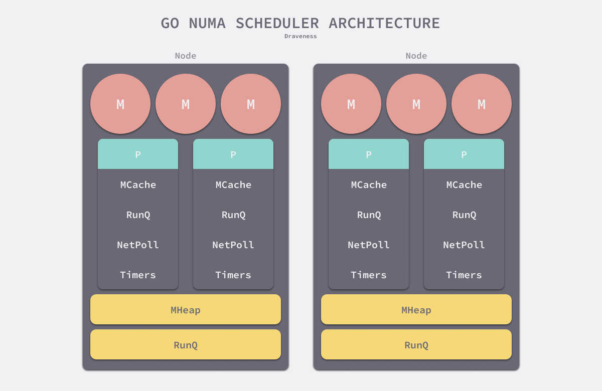
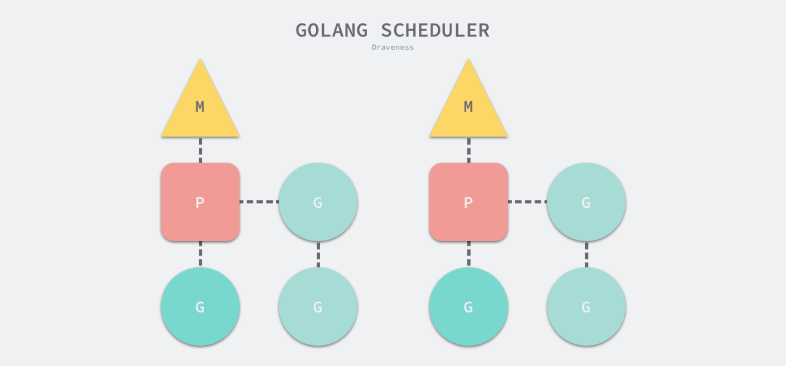
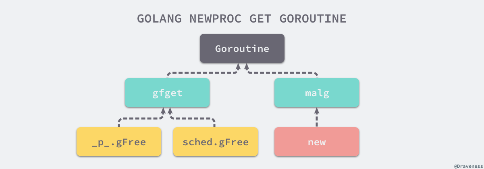

## 调度器

[原文](https://draveness.me/golang/docs/part3-runtime/ch06-concurrency/golang-goroutine/)

线程是操作系统调度时的最基本单元，而 Linux 在调度器并不区分进程和线程的调度，它们在不同操作系统上也有不同的实现，但是在大多数的实现中线程都属于进程。

多个线程可以属于同一个进程并共享内存空间。因为多线程不需要创建新的虚拟内存空间，所以它们也不需要内存管理单元处理上下文的切换，线程之间的通信也正是基于共享的内存进行的，与重量级的进程相比，线程显得比较轻量。

虽然线程比较轻量，但是在调度时也有比较大的额外开销。每个线程会都占用 1M 以上的内存空间，在切换线程时不止会消耗较多的内存，恢复寄存器中的内容还需要向操作系统申请或者销毁资源，每一次线程上下文的切换都需要消耗 ~1us 左右的时间，但是 Go 调度器对 Goroutine 的上下文切换约为 ~0.2us，减少了 80% 的额外开销。


Go 语言的调度器通过使用与 CPU 数量相等的线程减少线程频繁切换的内存开销，同时在每一个线程上执行额外开销更低的 Goroutine 来降低操作系统和硬件的负载。

### 设计原理

调度器经过几个大版本的迭代才有今天的优异性能，历史上几个不同版本的调度器引入了不同的改进，也存在着不同的缺陷:

- 单线程调度器 · [0.x](https://github.com/golang/go/blob/96824000ed89d13665f6f24ddc10b3bf812e7f47/src/runtime/proc.c)
  - 只包含 40 多行代码；
  - 程序中只能存在一个活跃线程，由 G-M 模型组成；
  
- 多线程调度器 · [1.0](https://github.com/golang/go/blob/go1.0.1/src/pkg/runtime/proc.c)
  - 允许运行多线程的程序；
  - 全局锁导致竞争严重；
- 任务窃取调度器 · [1.1](https://github.com/golang/go/blob/779c45a50700bda0f6ec98429720802e6c1624e8/src/pkg/runtime/proc.c)
  - 引入了处理器 P，构成了目前的 **G-M-P** 模型；
  - 在处理器 P 的基础上实现了基于**工作窃取**的调度器；
  - 在某些情况下，Goroutine 不会让出线程，进而造成饥饿问题；
  - 时间过长的垃圾回收（Stop-the-world，STW）会导致程序长时间无法工作；
- 抢占式调度器 · [1.2](https://github.com/golang/go/blob/go1.2/src/pkg/runtime/proc.c) ~ 至今
  - 基于协作的抢占式调度器 - 1.2 ~ 1.13
    - 通过编译器在函数调用时插入**抢占检查**指令，在函数调用时检查当前 Goroutine 是否发起了抢占请求，实现基于协作的抢占式调度；
    - Goroutine 可能会因为垃圾回收和循环长时间占用资源导致程序暂停；
  - 基于信号的抢占式调度器 - 1.14 ~ 至今
    - 实现**基于信号的真抢占式调度**；
    - 垃圾回收在扫描栈时会触发抢占调度；
    - 抢占的时间点不够多，还不能覆盖全部的边缘情况；
- 非均匀存储访问调度器 · 提案
  - 对运行时的各种资源进行分区；
  - 实现非常复杂，到今天还没有提上日程；

#### 单线程调度器

0.x 版本调度器只包含表示 Goroutine 的 G 和表示线程的 M 两种结构，全局也只有一个线程。可以在 [clean up scheduler](https://github.com/golang/go/commit/96824000ed89d13665f6f24ddc10b3bf812e7f47) 提交中找到单线程调度器的源代码，在这时 Go 语言的调度器还是由 C 语言实现的，调度函数 [`runtime.scheduler:9682400`](https://draveness.me/golang/tree/runtime.scheduler:9682400) 也只包含 40 多行代码 ：

```c
static void scheduler(void) {
	G* gp;
	lock(&sched);

	if(gosave(&m->sched)){
		lock(&sched);
		gp = m->curg;
		switch(gp->status){
		case Grunnable:
		case Grunning:
			gp->status = Grunnable;
			gput(gp);
			break;
		...
		}
		notewakeup(&gp->stopped);
	}

	gp = nextgandunlock();
	noteclear(&gp->stopped);
	gp->status = Grunning;
	m->curg = gp;
	g = gp;
	gogo(&gp->sched);
}
```

该函数会遵循如下的过程调度 Goroutine：

1. 获取调度器的全局锁；
2. 调用 [`runtime.gosave:9682400`](https://draveness.me/golang/tree/runtime.gosave:9682400) 保存栈寄存器和程序计数器；
3. 调用 [`runtime.nextgandunlock:9682400`](https://draveness.me/golang/tree/runtime.nextgandunlock:9682400) 获取下一个需要运行的 Goroutine 并解锁调度器；
4. 修改全局线程 `m` 上要执行的 Goroutine；
5. 调用 [`runtime.gogo:9682400`](https://draveness.me/golang/tree/runtime.gogo:9682400) 函数运行最新的 Goroutine；

虽然这个单线程调度器的唯一优点就是**能运行**，但是这次提交已经包含了 G 和 M 两个重要的数据结构，也建立了 Go 语言调度器的框架。

#### 多线程调度器

Go 语言在 1.0 版本正式发布时就支持了多线程的调度器，我们可以在 [`pkg/runtime/proc.c`](https://github.com/golang/go/blob/go1.0.1/src/pkg/runtime/proc.c) 文件中找到 1.0.1 版本的调度器，多线程版本的调度函数 [`runtime.schedule:go1.0.1`](https://draveness.me/golang/tree/runtime.schedule:go1.0.1) 包含 70 多行代码，我们在这里保留了该函数的核心逻辑：

```c
static void schedule(G *gp) {
	schedlock();
	if(gp != nil) {
		gp->m = nil;
		uint32 v = runtime·xadd(&runtime·sched.atomic, -1<<mcpuShift);
		if(atomic_mcpu(v) > maxgomaxprocs)
			runtime·throw("negative mcpu in scheduler");

		switch(gp->status){
		case Grunning:
			gp->status = Grunnable;
			gput(gp);
			break;
		case ...:
		}
	} else {
		...
	}
	gp = nextgandunlock();
	gp->status = Grunning;
	m->curg = gp;
	gp->m = m;
	runtime·gogo(&gp->sched, 0);
}
```

因为我们的程序中可能同时存在多个活跃线程，所以多线程调度器引入了 `GOMAXPROCS` 变量帮助我们灵活控制程序中的最大处理器数，即活跃线程数。

多线程调度器的主要问题是调度时的锁竞争会严重浪费资源，[Scalable Go Scheduler Design Doc](http://golang.org/s/go11sched) 中对调度器做的性能测试发现 14% 的时间都花费在 [`runtime.futex:go1.0.1`](https://draveness.me/golang/tree/runtime.futex:go1.0.1) 上[3](https://draveness.me/golang/docs/part3-runtime/ch06-concurrency/golang-goroutine/#fn:3)，该调度器有以下问题需要解决：

1. 调度器和锁是全局资源，所有的调度状态都是中心化存储的，锁竞争问题严重；
2. 线程需要经常互相传递可运行的 Goroutine，引入了大量的延迟；
3. 每个线程都需要处理内存缓存，导致大量的内存占用并影响数据局部性；
4. 系统调用频繁阻塞和解除阻塞正在运行的线程，增加了额外开销；

这里的全局锁问题和 Linux 操作系统调度器在早期遇到的问题比较相似，解决的方案也都大同小异。

#### 任务窃取调度器

2012 年 Google 的工程师 Dmitry Vyukov 在 [Scalable Go Scheduler Design Doc](http://golang.org/s/go11sched) 中指出了现有多线程调度器的问题并在多线程调度器上提出了两个改进的手段：

1. 在当前的 G-M 模型中引入了处理器 P，增加中间层；
2. 在处理器 P 的基础上实现基于工作窃取的调度器；

基于任务窃取的 Go 语言调度器使用了沿用至今的 G-M-P 模型，可以在 [runtime: improved scheduler](https://github.com/golang/go/commit/779c45a50700bda0f6ec98429720802e6c1624e8) 提交中找到任务窃取调度器刚被实现时的[源代码](https://github.com/golang/go/blob/779c45a50700bda0f6ec98429720802e6c1624e8/src/pkg/runtime/proc.c)，调度器的 [`runtime.schedule:779c45a`](https://draveness.me/golang/tree/runtime.schedule:779c45a) 在这个版本的调度器中反而更简单了：

```go
static void schedule(void) {
    G *gp;
 top:
    if(runtime·gcwaiting) {
        gcstopm();
        goto top;
    }

    gp = runqget(m->p);
    if(gp == nil)
        gp = findrunnable();

    ...

    execute(gp);
}
```

1. 如果当前运行时在等待垃圾回收，调用 [`runtime.gcstopm:779c45a`](https://draveness.me/golang/tree/runtime.gcstopm:779c45a) 函数；
2. 调用 [`runtime.runqget:779c45a`](https://draveness.me/golang/tree/runtime.runqget:779c45a) 和 [`runtime.findrunnable:779c45a`](https://draveness.me/golang/tree/runtime.findrunnable:779c45a) 从本地或者全局的运行队列中获取待执行的 Goroutine；
3. 调用 [`runtime.execute:779c45a`](https://draveness.me/golang/tree/runtime.execute:779c45a) 在当前线程 M 上运行 Goroutine；

当前处理器本地的运行队列中不包含 Goroutine 时，调用 [`runtime.findrunnable:779c45a`](https://draveness.me/golang/tree/runtime.findrunnable:779c45a) 会触发工作窃取，从其它的处理器的队列中随机获取一些 Goroutine。

运行时 G-M-P 模型中引入的处理器 P 是线程和 Goroutine 的中间层，我们从它的结构体中就能看到处理器与 M 和 G 的关系：

```c
struct P {
	Lock;

	uint32	status;
	P*	link;
	uint32	tick;
	M*	m;
	MCache*	mcache;

	G**	runq;
	int32	runqhead;
	int32	runqtail;
	int32	runqsize;

	G*	gfree;
	int32	gfreecnt;
};
```

处理器持有一个由可运行的 Goroutine 组成的环形的运行队列 `runq`，还反向持有一个线程。调度器在调度时会从处理器的队列中选择队列头的 Goroutine 放到线程 M 上执行。

> G-M-P 模型


基于工作窃取的多线程调度器将每一个线程绑定到了独立的 CPU 上，这些线程会被不同处理器管理，不同的处理器通过工作窃取对任务进行再分配实现任务的平衡，也能提升调度器和 Go 语言程序的整体性能，今天所有的 Go 语言服务都受益于这一改动。

#### 抢占式调度器

对 Go 语言并发模型的修改提升了调度器的性能，但是 1.1 版本中的调度器仍然不支持抢占式调度，程序只能依靠 Goroutine 主动让出 CPU 资源才能触发调度。Go 语言的调度器在 1.2 版本中引入基于协作的抢占式调度解决下面的问题：

- 某些 Goroutine 可以长时间占用线程，造成其它 Goroutine 的饥饿；
- 垃圾回收需要暂停整个程序（Stop-the-world，STW），最长可能需要几分钟的时间，导致整个程序无法工作；

1.2 版本的抢占式调度虽然能够缓解这个问题，但是它实现的抢占式调度是基于协作的，在之后很长的一段时间里 Go 语言的调度器都有一些无法被抢占的边缘情况，例如：for 循环或者垃圾回收长时间占用线程，这些问题中的一部分直到 1.14 才被基于信号的抢占式调度解决。

##### **基于协作的抢占式调度**

我们可以在 [`pkg/runtime/proc.c`](https://github.com/golang/go/blob/go1.2/src/pkg/runtime/proc.c) 文件中找到引入基于协作的抢占式调度后的调度器。Go 语言会在分段栈的机制上实现抢占调度，利用编译器在分段栈上插入的函数，所有 Goroutine 在函数调用时都有机会进入运行时检查是否需要执行抢占。

归纳出基于协作的抢占式调度的工作原理：

1. 编译器会在调用函数前插入 [`runtime.morestack`](https://draveness.me/golang/tree/runtime.morestack)；
2. Go 语言运行时会在垃圾回收暂停程序、系统监控发现 Goroutine 运行超过 10ms 时发出抢占请求 `StackPreempt`；
3. 当发生函数调用时，可能会执行编译器插入的 [`runtime.morestack`](https://draveness.me/golang/tree/runtime.morestack)，它调用的 [`runtime.newstack`](https://draveness.me/golang/tree/runtime.newstack) 会检查 Goroutine 的 `stackguard0` 字段是否为  `StackPreempt`；
4. 如果 `stackguard0` 是 `StackPreempt`，就会触发抢占让出当前线程；

这种实现方式虽然增加了运行时的复杂度，但是实现相对简单，也没有带来过多的额外开销，总体来看还是比较成功的实现，也在 Go 语言中使用了 10 几个版本。因为这里的抢占是通过编译器插入函数实现的，还是需要函数调用作为入口才能触发抢占，所以这是一种**协作式的抢占式调度**。

##### **基于信号的抢占式调度**

基于协作的抢占式调度虽然实现巧妙，但是并不完备。

Go 语言在 1.14 版本中实现了非协作的抢占式调度。

目前的抢占式调度也只会在垃圾回收扫描任务时触发，梳理一下抢占式调度过程：

1. 程序启动时，在 [`runtime.sighandler`](https://draveness.me/golang/tree/runtime.sighandler) 中注册 `SIGURG` 信号的处理函数 [`runtime.doSigPreempt`](https://draveness.me/golang/tree/runtime.doSigPreempt)；
2. 在触发垃圾回收的栈扫描时会调用 [`runtime.suspendG`](https://draveness.me/golang/tree/runtime.suspendG) 挂起 Goroutine，该函数会执行下面的逻辑：
   1. 将 `_Grunning` 状态的 Goroutine 标记成可以被抢占，即将 `preemptStop` 设置成 `true`；
   2. 调用 [`runtime.preemptM`](https://draveness.me/golang/tree/runtime.preemptM) 触发抢占；
3. [`runtime.preemptM`](https://draveness.me/golang/tree/runtime.preemptM) 会调用 [`runtime.signalM`](https://draveness.me/golang/tree/runtime.signalM) 向线程发送信号 `SIGURG`；
4. 操作系统会中断正在运行的线程并执行预先注册的信号处理函数 [`runtime.doSigPreempt`](https://draveness.me/golang/tree/runtime.doSigPreempt)；
5. [`runtime.doSigPreempt`](https://draveness.me/golang/tree/runtime.doSigPreempt) 函数会处理抢占信号，获取当前的 SP 和 PC 寄存器并调用 [`runtime.sigctxt.pushCall`](https://draveness.me/golang/tree/runtime.sigctxt.pushCall)；
6. [`runtime.sigctxt.pushCall`](https://draveness.me/golang/tree/runtime.sigctxt.pushCall) 会修改寄存器并在程序回到用户态时执行 [`runtime.asyncPreempt`](https://draveness.me/golang/tree/runtime.asyncPreempt)；
7. 汇编指令 [`runtime.asyncPreempt`](https://draveness.me/golang/tree/runtime.asyncPreempt) 会调用运行时函数 [`runtime.asyncPreempt2`](https://draveness.me/golang/tree/runtime.asyncPreempt2)；
8. [`runtime.asyncPreempt2`](https://draveness.me/golang/tree/runtime.asyncPreempt2) 会调用 [`runtime.preemptPark`](https://draveness.me/golang/tree/runtime.preemptPark)；
9. [`runtime.preemptPark`](https://draveness.me/golang/tree/runtime.preemptPark) 会修改当前 Goroutine 的状态到 `_Gpreempted` 并调用 [`runtime.schedule`](https://draveness.me/golang/tree/runtime.schedule) 让当前函数陷入休眠并让出线程，调度器会选择其它的 Goroutine 继续执行；

上述 9 个步骤展示了基于信号的抢占式调度的执行过程。

提案根据以下的四个原因选择 `SIGURG` 作为触发异步抢占的信号[7](https://draveness.me/golang/docs/part3-runtime/ch06-concurrency/golang-goroutine/#fn:7)；

1. 该信号需要被调试器透传；
2. 该信号不会被内部的 libc 库使用并拦截；
3. 该信号可以随意出现并且不触发任何后果；
4. 需要处理多个平台上的不同信号；

STW 和栈扫描是一个可以抢占的安全点（Safe-points），所以 Go 语言会在这里先加入抢占功能。。基于信号的抢占式调度只解决了垃圾回收和栈扫描时存在的问题，它到目前为止没有解决所有问题。

#### 非均匀内存访问调度器

非均匀内存访问（Non-uniform memory access，NUMA）调度器现在只是 Go 语言的提案。该提案的原理就是通过拆分全局资源，让各个处理器能够就近获取，减少锁竞争并增加数据的局部性。

在目前的运行时中，线程、处理器、网络轮询器、运行队列、全局内存分配器状态、内存分配缓存和垃圾收集器都是全局资源。运行时没有保证本地化，也不清楚系统的拓扑结构，部分结构可以提供一定的局部性，但是从全局来看没有这种保证。



如上图所示，堆栈、全局运行队列和线程池会按照 NUMA 节点进行分区，网络轮询器和计时器会由单独的处理器持有。这种方式虽然能够利用局部性提高调度器的性能，但是本身的实现过于复杂，所以 Go 语言团队还没有着手实现这一提案。

### 数据结构

运行时调度器的三个重要组成部分 — 线程 M、Goroutine G 和处理器 P：



1. G — 表示 Goroutine，它是一个待执行的任务；
2. M — 表示操作系统的线程，它由操作系统的调度器调度和管理；
3. P — 表示处理器，它可以被看做运行在线程上的本地调度器；

#### G

Goroutine 是 Go 语言调度器中待执行的任务，它在运行时调度器中的地位与线程在操作系统中差不多，但是它占用了更小的内存空间，也降低了上下文切换的开销。

Goroutine 只存在于 Go 语言的运行时，它是 Go 语言在用户态提供的线程，作为一种粒度更细的资源调度单元。

Goroutine 在 Go 语言运行时使用私有结构体 [`runtime.g`](https://draveness.me/golang/tree/runtime.g) 表示。

 [`runtime.g`](https://draveness.me/golang/tree/runtime.g)与栈相关的两个字段：

```go
type g struct {
	// Stack parameters.
	// stack describes the actual stack memory: [stack.lo, stack.hi).
	// stackguard0 is the stack pointer compared in the Go stack growth prologue.
	// It is stack.lo+StackGuard normally, but can be StackPreempt to trigger a preemption.
	// stackguard1 is the stack pointer compared in the C stack growth prologue.
	// It is stack.lo+StackGuard on g0 and gsignal stacks.
	// It is ~0 on other goroutine stacks, to trigger a call to morestackc (and crash).
  stack       stack   // offset known to runtime/cgo
	stackguard0 uintptr // offset known to liblink
	stackguard1 uintptr // offset known to liblink
}
```

其中 `stack` 字段描述了当前 Goroutine 的栈内存范围 [stack.lo, stack.hi)，另一个字段 `stackguard0` 可以用于调度器抢占式调度。除了 `stackguard0` 之外，Goroutine 中还包含另外三个与抢占密切相关的字段：

```go
type g struct {
	preempt       bool // 抢占信号, preemption signal, duplicates stackguard0 = stackpreempt
	preemptStop   bool // 抢占时将状态修改成 `_Gpreempted`, transition to _Gpreempted on preemption; otherwise, just deschedule
	preemptShrink bool // 在同步安全点收缩栈, shrink stack at synchronous safe point
}
```

Goroutine 与 `defer` 和 `panic` 也有千丝万缕的联系，每一个 Goroutine 上都持有两个分别存储 `defer` 和 `panic` 对应结构体的链表：

```go
type g struct {
	_panic       *_panic // 最内侧的 panic 结构体, innermost panic - offset known to liblink
	_defer       *_defer // 最内侧的延迟函数结构体,  innermost defer
}
```

最后，再节选一些作者认为比较有趣或者重要的字段：

```go
type g struct {
	m              *m 		// current m; offset known to arm liblink
	sched          gobuf
	atomicstatus   uint32
	goid           int64
}
```

- `m` — 当前 Goroutine 占用的线程，可能为空；
- `atomicstatus` — Goroutine 的状态；
- `sched` — 存储 Goroutine 的调度相关的数据；
- `goid` — Goroutine 的 ID，该字段对开发者不可见，Go 团队认为引入 ID 会让部分 Goroutine 变得更特殊，从而限制语言的并发能力；

上述四个字段中，需要展开介绍 `sched` 字段的 [`runtime.gobuf`](https://draveness.me/golang/tree/runtime.gobuf) 结构体中包含哪些内容：

```go
type gobuf struct {
	// The offsets of sp, pc, and g are known to (hard-coded in) libmach.
	//
	// ctxt is unusual with respect to GC: it may be a
	// heap-allocated funcval, so GC needs to track it, but it
	// needs to be set and cleared from assembly, where it's
	// difficult to have write barriers. However, ctxt is really a
	// saved, live register, and we only ever exchange it between
	// the real register and the gobuf. Hence, we treat it as a
	// root during stack scanning, which means assembly that saves
	// and restores it doesn't need write barriers. It's still
	// typed as a pointer so that any other writes from Go get
	// write barriers.
	sp   uintptr
	pc   uintptr
	g    guintptr
	ret  sys.Uintreg
	...
}
```

- `sp` — 栈指针；
- `pc` — 程序计数器；
- `g` — 持有 [`runtime.gobuf`](https://draveness.me/golang/tree/runtime.gobuf) 的 Goroutine；
- `ret` — 系统调用的返回值；

这些内容会在调度器保存或者恢复上下文的时候用到，其中的栈指针和程序计数器会用来存储或者恢复寄存器中的值，改变程序即将执行的代码。

结构体 [`runtime.g`](https://draveness.me/golang/tree/runtime.g) 的 `atomicstatus` 字段存储了当前 Goroutine 的状态。除了几个已经不被使用的以及与 GC 相关的状态之外，Goroutine 可能处于以下 9 种状态：

| 状态          | 描述                                                         |
| ------------- | ------------------------------------------------------------ |
| `_Gidle`      | 刚刚被分配并且还没有被初始化                                 |
| `_Grunnable`  | 没有执行代码，没有栈的所有权，存储在运行队列中               |
| `_Grunning`   | 可以执行代码，拥有栈的所有权，被赋予了内核线程 M 和处理器 P  |
| `_Gsyscall`   | 正在执行系统调用，拥有栈的所有权，没有执行用户代码，被赋予了内核线程 M 但是不在运行队列上 |
| `_Gwaiting`   | 由于运行时而被阻塞，没有执行用户代码并且不在运行队列上，但是可能存在于 Channel 的等待队列上 |
| `_Gdead`      | 没有被使用，没有执行代码，可能有分配的栈                     |
| `_Gcopystack` | 栈正在被拷贝，没有执行代码，不在运行队列上                   |
| `_Gpreempted` | 由于抢占而被阻塞，没有执行用户代码并且不在运行队列上，等待唤醒 |
| `_Gscan`      | GC 正在扫描栈空间，没有执行代码，可以与其他状态同时存在      |

上述状态中比较常见是 `_Grunnable`、`_Grunning`、`_Gsyscall`、`_Gwaiting` 和 `_Gpreempted` 五个状态。

虽然 Goroutine 在运行时中定义的状态非常多而且复杂，但是我们可以将这些不同的状态聚合成三种：等待中、可运行、运行中，运行期间会在这三种状态来回切换：

- 等待中：Goroutine 正在等待某些条件满足，例如：系统调用结束等，包括 `_Gwaiting`、`_Gsyscall` 和 `_Gpreempted` 几个状态；
- 可运行：Goroutine 已经准备就绪，可以在线程运行，如果当前程序中有非常多的 Goroutine，每个 Goroutine 就可能会等待更多的时间，即 `_Grunnable`；
- 运行中：Goroutine 正在某个线程上运行，即 `_Grunning`；


#### M

Go 语言并发模型中的 M 是操作系统线程。调度器最多可以创建 10000 个线程，但是其中大多数的线程都不会执行用户代码（可能陷入系统调用），最多只会有 `GOMAXPROCS` 个活跃线程能够正常运行。

在默认情况下，运行时会将 `GOMAXPROCS` 设置成当前机器的核数，我们也可以在程序中使用 [`runtime.GOMAXPROCS`](https://draveness.me/golang/tree/runtime.GOMAXPROCS) 来改变最大的活跃线程数。

在默认情况下，一个四核机器会创建四个活跃的操作系统线程，每一个线程都对应一个运行时中的 [`runtime.m`](https://draveness.me/golang/tree/runtime.m) 结构体。

在大多数情况下，我们都会使用 Go 的默认设置，也就是线程数等于 CPU 数，默认的设置不会频繁触发操作系统的线程调度和上下文切换，所有的调度都会发生在用户态，由 Go 语言调度器触发，能够减少很多额外开销。

Go 语言会使用私有结构体 [`runtime.m`](https://draveness.me/golang/tree/runtime.m) 表示操作系统线程，这个结构体也包含了几十个字段，这里先来了解几个与 Goroutine 相关的字段：

```go
type m struct {
	g0   *g	// goroutine with scheduling stack
	curg *g	// current running goroutine
	...
}
```

其中 g0 是持有调度栈的 Goroutine，`curg` 是在当前线程上运行的用户 Goroutine，这也是操作系统线程唯一关心的两个 Goroutine。


g0 是一个运行时中比较特殊的 Goroutine，它会深度参与运行时的调度过程，包括 Goroutine 的创建、大内存分配和 CGO 函数的执行。

[`runtime.m`](https://draveness.me/golang/tree/runtime.m) 结构体中还存在三个与处理器相关的字段，它们分别表示正在运行代码的处理器 `p`、暂存的处理器 `nextp` 和执行系统调用之前使用线程的处理器 `oldp`：

```go
type m struct {
	p             puintptr	// attached p for executing go code (nil if not executing go code)
	nextp         puintptr
	oldp          puintptr	// the p that was attached before executing a syscall
}
```

#### P

调度器中的处理器 P 是线程和 Goroutine 的中间层，它能提供线程需要的上下文环境，也会负责调度线程上的等待队列，通过处理器 P 的调度，每一个内核线程都能够执行多个 Goroutine，它能在 Goroutine 进行一些 I/O 操作时及时让出计算资源，提高线程的利用率。

因为调度器在启动时就会创建 `GOMAXPROCS` 个处理器，所以 Go 语言程序的处理器数量一定会等于 `GOMAXPROCS`，这些处理器会绑定到不同的内核线程上。

[`runtime.p`](https://draveness.me/golang/tree/runtime.p) 是处理器的运行时表示，作为调度器的内部实现，它包含的字段也非常多，其中包括与性能追踪、垃圾回收和计时器相关的字段，这些字段也非常重要，我们这里主要关注处理器中的线程和运行队列：

```go
type p struct {
	m           muintptr // back-link to associated m (nil if idle)

	// Queue of runnable goroutines. Accessed without lock.
	runqhead uint32
	runqtail uint32
	runq     [256]guintptr
	// runnext, if non-nil, is a runnable G that was ready'd by
	// the current G and should be run next instead of what's in
	// runq if there's time remaining in the running G's time
	// slice. It will inherit the time left in the current time
	// slice. If a set of goroutines is locked in a
	// communicate-and-wait pattern, this schedules that set as a
	// unit and eliminates the (potentially large) scheduling
	// latency that otherwise arises from adding the ready'd
	// goroutines to the end of the run queue.
	runnext guintptr
	...
}
```

反向存储的线程维护着线程与处理器之间的关系，而 `runqhead`、`runqtail` 和 `runq` 三个字段表示处理器持有的运行队列，其中存储着待执行的 Goroutine 列表，`runnext` 中是线程下一个需要执行的 Goroutine。

[`runtime.p`](https://draveness.me/golang/tree/runtime.p) 结构体中的状态 `status` 字段会是以下五种中的一种：

| 状态        | 描述                                                         |
| ----------- | ------------------------------------------------------------ |
| `_Pidle`    | 处理器没有运行用户代码或者调度器，被空闲队列或者改变其状态的结构持有，运行队列为空 |
| `_Prunning` | 被线程 M 持有，并且正在执行用户代码或者调度器                |
| `_Psyscall` | 没有执行用户代码，当前线程陷入系统调用                       |
| `_Pgcstop`  | 被线程 M 持有，当前处理器由于垃圾回收被停止                  |
| `_Pdead`    | 当前处理器已经不被使用                                       |

### 调度器启动

运行时通过 [`runtime.schedinit`](https://draveness.me/golang/tree/runtime.schedinit) 初始化调度器：

```go
// The bootstrap sequence is:
//
//	call osinit
//	call schedinit
//	make & queue new G
//	call runtime·mstart
//
// The new G calls runtime·main.
func schedinit() {
	// raceinit must be the first call to race detector.
	// In particular, it must be done before mallocinit below calls racemapshadow.
	_g_ := getg()
	...

	sched.maxmcount = 10000

	...
	sched.lastpoll = uint64(nanotime())
	procs := ncpu
	if n, ok := atoi32(gogetenv("GOMAXPROCS")); ok && n > 0 {
		procs = n
	}
	if procresize(procs) != nil {
		throw("unknown runnable goroutine during bootstrap")
	}
}
```

在调度器初始函数执行的过程中会将 `maxmcount` 设置成 10000，这也就是一个 Go 语言程序能够创建的最大线程数，虽然最多可以创建 10000 个线程，但是可以同时运行的线程还是由 `GOMAXPROCS` 变量控制。

从环境变量 `GOMAXPROCS` 获取了程序能够同时运行的最大处理器数之后就会调用 [`runtime.procresize`](https://draveness.me/golang/tree/runtime.procresize) 更新程序中处理器的数量，在这时整个程序不会执行任何用户 Goroutine，调度器也会进入锁定状态，[`runtime.procresize`](https://draveness.me/golang/tree/runtime.procresize) 的执行过程如下：

1. 如果全局变量 `allp` 切片中的处理器数量少于期望数量，会对切片进行扩容；
2. 使用 `new` 创建新的处理器结构体并调用 [`runtime.p.init`](https://draveness.me/golang/tree/runtime.p.init) 初始化刚刚扩容的处理器；
3. 通过指针将线程 m0 和处理器 `allp[0]` 绑定到一起；
4. 调用 [`runtime.p.destroy`](https://draveness.me/golang/tree/runtime.p.destroy) 释放不再使用的处理器结构；
5. 通过截断改变全局变量 `allp` 的长度保证与期望处理器数量相等；
6. 将除 `allp[0]` 之外的处理器 P 全部设置成 `_Pidle` 并加入到全局的空闲队列中；

调用 [`runtime.procresize`](https://draveness.me/golang/tree/runtime.procresize) 是调度器启动的最后一步，在这一步过后调度器会完成相应数量处理器的启动，等待用户创建运行新的 Goroutine 并为 Goroutine 调度处理器资源。

### 创建 Goroutine

想要启动一个新的 Goroutine 来执行任务时，我们需要使用 Go 语言的 `go` 关键字，编译器会通过 [`cmd/compile/internal/gc.state.stmt`](https://draveness.me/golang/tree/cmd/compile/internal/gc.state.stmt) 和 [`cmd/compile/internal/gc.state.call`](https://draveness.me/golang/tree/cmd/compile/internal/gc.state.call) 两个方法将该关键字转换成 [`runtime.newproc`](https://draveness.me/golang/tree/runtime.newproc) 函数调用：

```go
// Calls the function n using the specified call type.
// Returns the address of the return value (or nil if none).
func (s *state) call(n *Node, k callKind) *ssa.Value {
	if k == callDeferStack {
		...
	} else {
		switch {
		case k == callGo:
			call = s.newValue1A(ssa.OpStaticCall, types.TypeMem, newproc, s.mem())
		default:
		}
	}
	...
}
```

[`runtime.newproc`](https://draveness.me/golang/tree/runtime.newproc) 的入参是参数大小和表示函数的指针 `funcval`，它会获取 Goroutine 以及调用方的程序计数器，然后调用 [`runtime.newproc1`](https://draveness.me/golang/tree/runtime.newproc1) 函数获取新的 Goroutine 结构体、将其加入处理器的运行队列并在满足条件时调用 [`runtime.wakep`](https://draveness.me/golang/tree/runtime.wakep) 唤醒新的处理执行 Goroutine：

```go
// Create a new g running fn with siz bytes of arguments.
// Put it on the queue of g's waiting to run.
// The compiler turns a go statement into a call to this.
//
// The stack layout of this call is unusual: it assumes that the
// arguments to pass to fn are on the stack sequentially immediately
// after &fn. Hence, they are logically part of newproc's argument
// frame, even though they don't appear in its signature (and can't
// because their types differ between call sites).
//
// This must be nosplit because this stack layout means there are
// untyped arguments in newproc's argument frame. Stack copies won't
// be able to adjust them and stack splits won't be able to copy them.
//
//go:nosplit
func newproc(siz int32, fn *funcval) {
	argp := add(unsafe.Pointer(&fn), sys.PtrSize)
	gp := getg()
	pc := getcallerpc()
	systemstack(func() {
		newg := newproc1(fn, argp, siz, gp, pc)

		_p_ := getg().m.p.ptr()
		runqput(_p_, newg, true)

		if mainStarted {
			wakep()
		}
	})
}
```

[`runtime.newproc1`](https://draveness.me/golang/tree/runtime.newproc1) 会根据传入参数初始化一个 `g` 结构体，我们可以将该函数分成以下几个部分介绍它的实现：

1. 获取或者创建新的 Goroutine 结构体；
2. 将传入的参数移到 Goroutine 的栈上；
3. 更新 Goroutine 调度相关的属性；

首先是 Goroutine 结构体的创建过程：

```go
// Create a new g in state _Grunnable, starting at fn, with narg bytes
// of arguments starting at argp. callerpc is the address of the go
// statement that created this. The caller is responsible for adding
// the new g to the scheduler.
//
// This must run on the system stack because it's the continuation of
// newproc, which cannot split the stack.
//
//go:systemstack
func newproc1(fn *funcval, argp unsafe.Pointer, narg int32, callergp *g, callerpc uintptr) *g {
	_g_ := getg()
	siz := narg
	siz = (siz + 7) &^ 7

	_p_ := _g_.m.p.ptr()
	newg := gfget(_p_)
	if newg == nil {
		newg = malg(_StackMin)
		casgstatus(newg, _Gidle, _Gdead)
		allgadd(newg)  // publishes with a g->status of Gdead so GC scanner doesn't look at uninitialized stack.
	}
	...
```

上述代码会先从处理器的 `gFree` 列表中查找空闲的 Goroutine，如果不存在空闲的 Goroutine，会通过 [`runtime.malg`](https://draveness.me/golang/tree/runtime.malg) 创建一个栈大小足够的新结构体。

> 看起来 [_StackMin](https://github.com/golang/go/blob/41d8e61a6b9d8f9db912626eb2bbc535e929fefc/src/runtime/stack.go#L72) 会定义成2k的常量，也就是说新创建的goroutine都会有一个大小为2K的栈。

接下来，我们会调用 [`runtime.memmove`](https://draveness.me/golang/tree/runtime.memmove) 将 `fn` 函数的所有参数拷贝到栈上，`argp` 和 `narg` 分别是参数的内存空间和大小，我们在该方法中会将参数对应的内存空间整块拷贝到栈上：

```go
...
	totalSize := 4*sys.RegSize + uintptr(siz) + sys.MinFrameSize 	// extra space in case of reads slightly beyond frame
	totalSize += -totalSize & (sys.SpAlign - 1)										// align to spAlign
	sp := newg.stack.hi - totalSize
	spArg := sp
	if narg > 0 {
		memmove(unsafe.Pointer(spArg), argp, uintptr(narg))
	}
	...
```

拷贝了栈上的参数之后，[`runtime.newproc1`](https://draveness.me/golang/tree/runtime.newproc1) 会设置新的 Goroutine 结构体的参数，包括栈指针、程序计数器并更新其状态到 `_Grunnable` 并返回：

```go
	...
	memclrNoHeapPointers(unsafe.Pointer(&newg.sched), unsafe.Sizeof(newg.sched))
	newg.sched.sp = sp
	newg.stktopsp = sp
	newg.sched.pc = funcPC(goexit) + sys.PCQuantum
	newg.sched.g = guintptr(unsafe.Pointer(newg))
	gostartcallfn(&newg.sched, fn)
	newg.gopc = callerpc
	newg.startpc = fn.fn
	casgstatus(newg, _Gdead, _Grunnable)
	newg.goid = int64(_p_.goidcache)
	_p_.goidcache++
	return newg
}
```

在分析 [`runtime.newproc`](https://draveness.me/golang/tree/runtime.newproc) 的过程中，保留了主干省略了用于获取结构体的 [`runtime.gfget`](https://draveness.me/golang/tree/runtime.gfget)、[`runtime.malg`](https://draveness.me/golang/tree/runtime.malg)、将 Goroutine 加入运行队列的 [`runtime.runqput`](https://draveness.me/golang/tree/runtime.runqput) 以及设置调度信息的过程，下面会依次分析这些函数。

#### 初始化结构体

[`runtime.gfget`](https://draveness.me/golang/tree/runtime.gfget) 通过两种不同的方式获取新的 [`runtime.g`](https://draveness.me/golang/tree/runtime.g)：

1. 从 Goroutine 所在处理器的 `gFree` 列表或者调度器的 `sched.gFree` 列表中获取 [`runtime.g`](https://draveness.me/golang/tree/runtime.g)；
2. 调用 [`runtime.malg`](https://draveness.me/golang/tree/runtime.malg) 生成一个新的 [`runtime.g`](https://draveness.me/golang/tree/runtime.g) 并将结构体追加到全局的 Goroutine 列表 `allgs` 中。



[`runtime.gfget`](https://draveness.me/golang/tree/runtime.gfget) 中包含两部分逻辑，它会根据处理器中 `gFree` 列表中 Goroutine 的数量做出不同的决策：

1. 当处理器的 Goroutine 列表为空时，会将调度器持有的空闲 Goroutine 转移到当前处理器上，直到 `gFree` 列表中的 Goroutine 数量达到 32；
2. 当处理器的 Goroutine 数量充足时，会从列表头部返回一个新的 Goroutine；

```go
// Get from gfree list.
// If local list is empty, grab a batch from global list.
func gfget(_p_ *p) *g {
retry:
	if _p_.gFree.empty() && (!sched.gFree.stack.empty() || !sched.gFree.noStack.empty()) {
    // Move a batch of free Gs to the P.
		for _p_.gFree.n < 32 {
      // Prefer Gs with stacks.
			gp := sched.gFree.stack.pop()
			if gp == nil {
				gp = sched.gFree.noStack.pop()
				if gp == nil {
					break
				}
			}
			_p_.gFree.push(gp)
		}
		goto retry
	}
	gp := _p_.gFree.pop()
	if gp == nil {
		return nil
	}
	return gp
}
```

当调度器的 `gFree` 和处理器的 `gFree` 列表都不存在结构体时，运行时会调用 [`runtime.malg`](https://draveness.me/golang/tree/runtime.malg) 初始化新的 [`runtime.g`](https://draveness.me/golang/tree/runtime.g) 结构，如果申请的堆栈大小大于 0，这里会通过 [`runtime.stackalloc`](https://draveness.me/golang/tree/runtime.stackalloc) 分配 2KB 的栈空间：

```go
// Allocate a new g, with a stack big enough for stacksize bytes.
func malg(stacksize int32) *g {
	newg := new(g)
	if stacksize >= 0 {
		stacksize = round2(_StackSystem + stacksize)
		newg.stack = stackalloc(uint32(stacksize))
		newg.stackguard0 = newg.stack.lo + _StackGuard
		newg.stackguard1 = ^uintptr(0)
	}
	return newg
}
```

[`runtime.malg`](https://draveness.me/golang/tree/runtime.malg) 返回的 Goroutine 会存储到全局变量 `allgs` 中。

简单总结一下，[`runtime.newproc1`](https://draveness.me/golang/tree/runtime.newproc1) 会从处理器或者调度器的缓存中获取新的结构体，也可以调用 [`runtime.malg`](https://draveness.me/golang/tree/runtime.malg) 函数创建。

#### 运行队列

[`runtime.runqput`](https://draveness.me/golang/tree/runtime.runqput) 会将 Goroutine 放到运行队列上，这既可能是全局的运行队列，也可能是处理器本地的运行队列：

```go
// runqput tries to put g on the local runnable queue.
// If next is false, runqput adds g to the tail of the runnable queue.
// If next is true, runqput puts g in the _p_.runnext slot.
// If the run queue is full, runnext puts g on the global queue.
// Executed only by the owner P.
func runqput(_p_ *p, gp *g, next bool) {
	if next {
	retryNext:
		oldnext := _p_.runnext
		if !_p_.runnext.cas(oldnext, guintptr(unsafe.Pointer(gp))) {
			goto retryNext
		}
		if oldnext == 0 {
			return
		}
		// Kick the old runnext out to the regular run queue.
		gp = oldnext.ptr()
	}
retry:
	h := atomic.LoadAcq(&_p_.runqhead)	// load-acquire, synchronize with consumers
	t := _p_.runqtail
	if t-h < uint32(len(_p_.runq)) {
		_p_.runq[t%uint32(len(_p_.runq))].set(gp)
		atomic.StoreRel(&_p_.runqtail, t+1)	// store-release, makes the item available for consumption
		return
	}
	if runqputslow(_p_, gp, h, t) {
		return
	}
	// the queue is not full, now the put above must succeed
	goto retry
}
```

1. 当 `next` 为 `true` 时，将 Goroutine 设置到处理器的 `runnext` 作为下一个处理器执行的任务；
2. 当 `next` 为 `false` 并且本地运行队列还有剩余空间时，将 Goroutine 加入处理器持有的本地运行队列；
3. 当处理器的本地运行队列已经没有剩余空间时就会把本地队列中的一部分 Goroutine 和待加入的 Goroutine 通过 [`runtime.runqputslow`](https://draveness.me/golang/tree/runtime.runqputslow) 添加到调度器持有的全局运行队列上；

处理器本地的运行队列是一个使用数组构成的环形链表，它最多可以存储 256 个待执行任务。


Go 语言有两个运行队列，其中一个是处理器本地的运行队列，另一个是调度器持有的全局运行队列，只有在本地运行队列没有剩余空间时才会使用全局队列。

#### 调度信息

运行时通过[newproc1](https://github.com/golang/go/blob/41d8e61a6b9d8f9db912626eb2bbc535e929fefc/src/runtime/proc.go#L3925)创建 Goroutine 时会通过下面的代码设置调度相关的信息，前两行代码会分别将程序计数器和 Goroutine 设置成 [`runtime.goexit`](https://draveness.me/golang/tree/runtime.goexit) 和新创建 Goroutine 运行的函数：

```go
...
	newg.sched.pc = funcPC(goexit) + sys.PCQuantum	// +PCQuantum so that previous instruction is in same function
	newg.sched.g = guintptr(unsafe.Pointer(newg))
	gostartcallfn(&newg.sched, fn)
	...
```

上述调度信息 `sched` 不是初始化后的 Goroutine 的最终结果，它还需要经过 [`runtime.gostartcallfn`](https://draveness.me/golang/tree/runtime.gostartcallfn) 和 [`runtime.gostartcall`](https://draveness.me/golang/tree/runtime.gostartcall) 的处理：

```go
// adjust Gobuf as if it executed a call to fn
// and then did an immediate gosave.
func gostartcallfn(gobuf *gobuf, fv *funcval) {
	gostartcall(gobuf, unsafe.Pointer(fv.fn), unsafe.Pointer(fv))
}

// adjust Gobuf as if it executed a call to fn with context ctxt
// and then did an immediate gosave.
func gostartcall(buf *gobuf, fn, ctxt unsafe.Pointer) {
	sp := buf.sp
	if sys.RegSize > sys.PtrSize {
		sp -= sys.PtrSize
		*(*uintptr)(unsafe.Pointer(sp)) = 0
	}
	sp -= sys.PtrSize
	*(*uintptr)(unsafe.Pointer(sp)) = buf.pc
	buf.sp = sp
	buf.pc = uintptr(fn)
	buf.ctxt = ctxt
}
```

调度信息的 `sp` 中存储了 [`runtime.goexit`](https://draveness.me/golang/tree/runtime.goexit) 函数的程序计数器，而 `pc` 中存储了传入函数的程序计数器。`pc` 寄存器的作用就是存储程序接下来运行的位置，所以 `pc` 的使用比较好理解，但是 `sp` 中存储的 [`runtime.goexit`](https://draveness.me/golang/tree/runtime.goexit) 会让人感到困惑，我们需要配合下面的调度循环来理解它的作用。

### 调度循环

调度器启动之后，Go 语言运行时会调用 [`runtime.mstart`](https://draveness.me/golang/tree/runtime.mstart) 以及 [`runtime.mstart1`](https://draveness.me/golang/tree/runtime.mstart1)，前者会初始化 g0 的 `stackguard0` 和 `stackguard1` 字段，后者会初始化线程并调用 [`runtime.schedule`](https://draveness.me/golang/tree/runtime.schedule) 进入调度循环：

```go
// One round of scheduler: find a runnable goroutine and execute it.
// Never returns.
func schedule() {
	_g_ := getg()

top:
	var gp *g
	var inheritTime bool

	if gp == nil {
		// Check the global runnable queue once in a while to ensure fairness.
		// Otherwise two goroutines can completely occupy the local runqueue
		// by constantly respawning each other.
		if _g_.m.p.ptr().schedtick%61 == 0 && sched.runqsize > 0 {
			lock(&sched.lock)
			gp = globrunqget(_g_.m.p.ptr(), 1)
			unlock(&sched.lock)
		}
	}
	if gp == nil {
		gp, inheritTime = runqget(_g_.m.p.ptr())
 		// We can see gp != nil here even if the M is spinning,
		// if checkTimers added a local goroutine via goready.
	}
	if gp == nil {
		gp, inheritTime = findrunnable()
	}

	execute(gp, inheritTime)
}
```

[`runtime.schedule`](https://draveness.me/golang/tree/runtime.schedule) 函数会从下面几个地方查找待执行的 Goroutine：

1. 为了保证公平，当全局运行队列中有待执行的 Goroutine 时，通过 `schedtick` 保证有一定几率会从全局的运行队列中查找对应的 Goroutine；
2. 从处理器本地的运行队列中查找待执行的 Goroutine；
3. 如果前两种方法都没有找到 Goroutine，会通过 [`runtime.findrunnable`](https://draveness.me/golang/tree/runtime.findrunnable) 进行阻塞地查找 Goroutine；

[`runtime.findrunnable`](https://draveness.me/golang/tree/runtime.findrunnable) 的实现非常复杂，这个 300 多行的函数通过以下的过程获取可运行的 Goroutine：

1. 从本地运行队列、全局运行队列中查找；
2. 从网络轮询器中查找是否有 Goroutine 等待运行；
3. 通过 [`runtime.runqsteal`](https://draveness.me/golang/tree/runtime.runqsteal) 尝试从其他随机的处理器中窃取待运行的 Goroutine，该函数还可能窃取处理器的计时器；

因为函数的实现过于复杂，上述的执行过程是经过简化的，总而言之，当前函数一定会返回一个可执行的 Goroutine，如果当前不存在就会阻塞等待。

接下来由 [`runtime.execute`](https://draveness.me/golang/tree/runtime.execute) 执行获取的 Goroutine，做好准备工作后，它会通过 [`runtime.gogo`](https://draveness.me/golang/tree/runtime.gogo) 将 Goroutine 调度到当前线程上。

```go
// Schedules gp to run on the current M.
// If inheritTime is true, gp inherits the remaining time in the
// current time slice. Otherwise, it starts a new time slice.
// Never returns.
//
// Write barriers are allowed because this is called immediately after
// acquiring a P in several places.
//
//go:yeswritebarrierrec
func execute(gp *g, inheritTime bool) {
	_g_ := getg()

	// Assign gp.m before entering _Grunning so running Gs have an
	// M.
	_g_.m.curg = gp
	gp.m = _g_.m
	casgstatus(gp, _Grunnable, _Grunning)
	gp.waitsince = 0
	gp.preempt = false
	gp.stackguard0 = gp.stack.lo + _StackGuard
	if !inheritTime {
		_g_.m.p.ptr().schedtick++
	}

	gogo(&gp.sched)
}
```

[`runtime.gogo`](https://draveness.me/golang/tree/runtime.gogo) 在不同处理器架构上的实现都不同，但是也都大同小异，下面是该函数在 386 架构上的实现：

```go
// void gogo(Gobuf*)
// restore state from Gobuf; longjmp
TEXT runtime·gogo(SB), NOSPLIT, $8-4
	MOVL buf+0(FP), BX     // 获取调度信息
	MOVL gobuf_g(BX), DX
	MOVL 0(DX), CX         // 保证 Goroutine 不为空
	get_tls(CX)
	MOVL DX, g(CX)
	MOVL gobuf_sp(BX), SP  // 将 runtime.goexit 函数的 PC 恢复到 SP 中
	MOVL gobuf_ret(BX), AX
	MOVL gobuf_ctxt(BX), DX
	MOVL $0, gobuf_sp(BX)		// clear to help garbage collector
	MOVL $0, gobuf_ret(BX)
	MOVL $0, gobuf_ctxt(BX)
	MOVL gobuf_pc(BX), BX  // 获取待执行函数的程序计数器
	JMP  BX                // 开始执行
```

它从 [`runtime.gobuf`](https://draveness.me/golang/tree/runtime.gobuf) 中取出了 [`runtime.goexit`](https://draveness.me/golang/tree/runtime.goexit) 的程序计数器和待执行函数的程序计数器，其中：

- [`runtime.goexit`](https://draveness.me/golang/tree/runtime.goexit) 的程序计数器被放到了栈 SP 上；
- 待执行函数的程序计数器被放到了寄存器 BX 上；

正常的函数调用都会使用 `CALL` 指令，该指令会将调用方的返回地址加入栈寄存器 SP 中，然后跳转到目标函数；当目标函数返回后，会从栈中查找调用的地址并跳转回调用方继续执行剩下的代码。

[`runtime.gogo`](https://draveness.me/golang/tree/runtime.gogo) 就利用了 Go 语言的调用惯例成功模拟这一调用过程，通过以下几个关键指令模拟 `CALL` 的过程：

```go
	MOVL gobuf_sp(BX), SP  // 将 runtime.goexit 函数的 PC 恢复到 SP 中
	MOVL gobuf_pc(BX), BX  // 获取待执行函数的程序计数器
	JMP  BX                // 开始执行
```


**图 6-36 runtime.gogo 栈内存**

当 Goroutine 中运行的函数返回时，程序会跳转到 [`runtime.goexit`](https://draveness.me/golang/tree/runtime.goexit) 所在位置执行该函数：

```go
// The top-most function running on a goroutine
// returns to goexit+PCQuantum.
TEXT runtime·goexit(SB),NOSPLIT,$0-0
	CALL	runtime·goexit1(SB)	// does not return

func goexit1() {
	mcall(goexit0)
}
```

经过一系列复杂的函数调用，我们最终在当前线程的 g0 的栈上调用 [`runtime.goexit0`](https://draveness.me/golang/tree/runtime.goexit0) 函数，该函数会将 Goroutine 转换会 `_Gdead` 状态、清理其中的字段、移除 Goroutine 和线程的关联并调用 [`runtime.gfput`](https://draveness.me/golang/tree/runtime.gfput) 重新加入处理器的 Goroutine 空闲列表 `gFree`

```go
// goexit continuation on g0.
func goexit0(gp *g) {
	_g_ := getg()

	casgstatus(gp, _Grunning, _Gdead)
	gp.m = nil
	...
	gp.param = nil
	gp.labels = nil
	gp.timer = nil

	dropg()
	gfput(_g_.m.p.ptr(), gp)
	schedule()
}
```

在最后 [`runtime.goexit0`](https://draveness.me/golang/tree/runtime.goexit0) 会重新调用 [`runtime.schedule`](https://draveness.me/golang/tree/runtime.schedule) 触发新一轮的 Goroutine 调度，Go 语言中的运行时调度循环会从 [`runtime.schedule`](https://draveness.me/golang/tree/runtime.schedule) 开始，最终又回到 [`runtime.schedule`](https://draveness.me/golang/tree/runtime.schedule)，我们可以认为调度循环永远都不会返回。


这里介绍的是 Goroutine 正常执行并退出的逻辑，实际情况会复杂得多，多数情况下 Goroutine 在执行的过程中都会经历协作式或者抢占式调度，它会让出线程的使用权等待调度器的唤醒。

### 触发调度

调度器的 [`runtime.schedule`](https://draveness.me/golang/tree/runtime.schedule) 会重新选择 Goroutine 在线程上执行，所以我们只要找到该函数的调用方就能找到所有触发调度的时间点，经过分析和整理，我们能得到如下的树形结构：


除了上图中可能触发调度的时间点，运行时还会在线程启动 [`runtime.mstart`](https://draveness.me/golang/tree/runtime.mstart) 和 Goroutine 执行结束 [`runtime.goexit0`](https://draveness.me/golang/tree/runtime.goexit0) 触发调度。重点介绍运行时触发调度的几个路径：

1. 主动挂起 — [`runtime.gopark`](https://draveness.me/golang/tree/runtime.gopark) -> [`runtime.park_m`](https://draveness.me/golang/tree/runtime.park_m)
2. 系统调用 — [`runtime.exitsyscall`](https://draveness.me/golang/tree/runtime.exitsyscall) -> [`runtime.exitsyscall0`](https://draveness.me/golang/tree/runtime.exitsyscall0)
3. 协作式调度 — [`runtime.Gosched`](https://draveness.me/golang/tree/runtime.Gosched) -> [`runtime.gosched_m`](https://draveness.me/golang/tree/runtime.gosched_m) -> [`runtime.goschedImpl`](https://draveness.me/golang/tree/runtime.goschedImpl)
4. 系统监控 — [`runtime.sysmon`](https://draveness.me/golang/tree/runtime.sysmon) -> [`runtime.retake`](https://draveness.me/golang/tree/runtime.retake) -> [`runtime.preemptone`](https://draveness.me/golang/tree/runtime.preemptone)

#### 主动挂起

[`runtime.gopark`](https://draveness.me/golang/tree/runtime.gopark) 是触发调度最常见的方法，该函数会将当前 Goroutine 暂停，被暂停的任务不会放回运行队列：

```go
// Puts the current goroutine into a waiting state and calls unlockf on the
// system stack.
//
// If unlockf returns false, the goroutine is resumed.
//
// unlockf must not access this G's stack, as it may be moved between
// the call to gopark and the call to unlockf.
//
// Note that because unlockf is called after putting the G into a waiting
// state, the G may have already been readied by the time unlockf is called
// unless there is external synchronization preventing the G from being
// readied. If unlockf returns false, it must guarantee that the G cannot be
// externally readied.
//
// Reason explains why the goroutine has been parked. It is displayed in stack
// traces and heap dumps. Reasons should be unique and descriptive. Do not
// re-use reasons, add new ones.
func gopark(unlockf func(*g, unsafe.Pointer) bool, lock unsafe.Pointer, reason waitReason, traceEv byte, traceskip int) {
	mp := acquirem()
	gp := mp.curg
	mp.waitlock = lock
	mp.waitunlockf = unlockf
	gp.waitreason = reason
	mp.waittraceev = traceEv
	mp.waittraceskip = traceskip
	releasem(mp)
	// can't do anything that might move the G between Ms here.
	mcall(park_m)
}
```

上述会通过 [`runtime.mcall`](https://draveness.me/golang/tree/runtime.mcall) 切换到 g0 的栈上调用 [`runtime.park_m`](https://draveness.me/golang/tree/runtime.park_m)：

```go
// park continuation on g0.
func park_m(gp *g) {
	_g_ := getg()

	casgstatus(gp, _Grunning, _Gwaiting)
	dropg()

	schedule()
}
```

[`runtime.park_m`](https://draveness.me/golang/tree/runtime.park_m) 会将当前 Goroutine 的状态从 `_Grunning` 切换至 `_Gwaiting`，调用 [`runtime.dropg`](https://draveness.me/golang/tree/runtime.dropg) 移除线程和 Goroutine 之间的关联，在这之后就可以调用 [`runtime.schedule`](https://draveness.me/golang/tree/runtime.schedule) 触发新一轮的调度了。

当 Goroutine 等待的特定条件满足后，运行时会调用 [`runtime.goready`](https://draveness.me/golang/tree/runtime.goready) 将因为调用 [`runtime.gopark`](https://draveness.me/golang/tree/runtime.gopark) 而陷入休眠的 Goroutine 唤醒。

```go
func goready(gp *g, traceskip int) {
	systemstack(func() {
		ready(gp, traceskip, true)
	})
}

// Mark gp ready to run.
func ready(gp *g, traceskip int, next bool) {
	// Mark runnable.
	_g_ := getg()

	// status is Gwaiting or Gscanwaiting, make Grunnable and put on runq
	casgstatus(gp, _Gwaiting, _Grunnable)
	runqput(_g_.m.p.ptr(), gp, next)
	if atomic.Load(&sched.npidle) != 0 && atomic.Load(&sched.nmspinning) == 0 {
		wakep()
	}
}
```

[`runtime.ready`](https://draveness.me/golang/tree/runtime.ready) 会将准备就绪的 Goroutine 的状态切换至 `_Grunnable` 并将其加入处理器的运行队列中，等待调度器的调度。

#### 系统调用

系统调用也会触发运行时调度器的调度，为了处理特殊的系统调用，甚至在 Goroutine 中加入了 `_Gsyscall` 状态，Go 语言通过 [`syscall.Syscall`](https://draveness.me/golang/tree/syscall.Syscall) 和 [`syscall.RawSyscall`](https://draveness.me/golang/tree/syscall.RawSyscall) 等使用汇编语言编写的方法封装操作系统提供的所有系统调用，其中 [`syscall.Syscall`](https://draveness.me/golang/tree/syscall.Syscall) 的实现如下：

```go
//
// System calls for 386, Linux
//

// See ../runtime/sys_linux_386.s for the reason why we always use int 0x80
// instead of the glibc-specific "CALL 0x10(GS)".
#define INVOKE_SYSCALL	INT	$0x80

// func Syscall(trap uintptr, a1, a2, a3 uintptr) (r1, r2, err uintptr);
// Trap # in AX, args in BX CX DX SI DI, return in AX
TEXT ·Syscall(SB),NOSPLIT,$0-28
	CALL	runtime·entersyscall(SB)
	...
	INVOKE_SYSCALL
	...
	CALL	runtime·exitsyscall(SB)
	RET
ok:
	...
	CALL	runtime·exitsyscall(SB)
	RET
```

在通过汇编指令 `INVOKE_SYSCALL` 执行系统调用前后，上述函数会调用运行时的 [`runtime.entersyscall`](https://draveness.me/golang/tree/runtime.entersyscall) 和 [`runtime.exitsyscall`](https://draveness.me/golang/tree/runtime.exitsyscall)，正是这一层包装能够在陷入系统调用前触发运行时的准备和清理工作。


不过出于性能的考虑，如果这次系统调用不需要运行时参与，就会使用 [`syscall.RawSyscall`](https://draveness.me/golang/tree/syscall.RawSyscall) 简化这一过程，不再调用运行时函数。[这里](https://gist.github.com/draveness/50c88883f30fa99d548cf1163c98aeb1)包含 Go 语言对 Linux 386 架构上不同系统调用的分类，会按需决定是否需要运行时的参与。

|     系统调用     |    类型    |
| :--------------: | :--------: |
|     SYS_TIME     | RawSyscall |
| SYS_GETTIMEOFDAY | RawSyscall |
|  SYS_SETRLIMIT   | RawSyscall |
|  SYS_GETRLIMIT   | RawSyscall |
|  SYS_EPOLL_WAIT  |  Syscall   |
|        …         |     …      |

由于直接进行系统调用会阻塞当前的线程，所以只有可以立刻返回的系统调用才可能会被设置成 `RawSyscall` 类型，例如：`SYS_EPOLL_CREATE`、`SYS_EPOLL_WAIT`（超时时间为 0）、`SYS_TIME` 等。

##### 准备工作

[`runtime.entersyscall`](https://draveness.me/golang/tree/runtime.entersyscall) 会在获取当前程序计数器和栈位置之后调用 [`runtime.reentersyscall`](https://draveness.me/golang/tree/runtime.reentersyscall)，它会完成 Goroutine 进入系统调用前的准备工作：

```go
// The goroutine g is about to enter a system call.
// Record that it's not using the cpu anymore.
// This is called only from the go syscall library and cgocall,
// not from the low-level system calls used by the runtime.
//
// Entersyscall cannot split the stack: the gosave must
// make g->sched refer to the caller's stack segment, because
// entersyscall is going to return immediately after.
//
// Nothing entersyscall calls can split the stack either.
// We cannot safely move the stack during an active call to syscall,
// because we do not know which of the uintptr arguments are
// really pointers (back into the stack).
// In practice, this means that we make the fast path run through
// entersyscall doing no-split things, and the slow path has to use systemstack
// to run bigger things on the system stack.
//
// reentersyscall is the entry point used by cgo callbacks, where explicitly
// saved SP and PC are restored. This is needed when exitsyscall will be called
// from a function further up in the call stack than the parent, as g->syscallsp
// must always point to a valid stack frame. entersyscall below is the normal
// entry point for syscalls, which obtains the SP and PC from the caller.
//
// Syscall tracing:
// At the start of a syscall we emit traceGoSysCall to capture the stack trace.
// If the syscall does not block, that is it, we do not emit any other events.
// If the syscall blocks (that is, P is retaken), retaker emits traceGoSysBlock;
// when syscall returns we emit traceGoSysExit and when the goroutine starts running
// (potentially instantly, if exitsyscallfast returns true) we emit traceGoStart.
// To ensure that traceGoSysExit is emitted strictly after traceGoSysBlock,
// we remember current value of syscalltick in m (_g_.m.syscalltick = _g_.m.p.ptr().syscalltick),
// whoever emits traceGoSysBlock increments p.syscalltick afterwards;
// and we wait for the increment before emitting traceGoSysExit.
// Note that the increment is done even if tracing is not enabled,
// because tracing can be enabled in the middle of syscall. We don't want the wait to hang.
//
//go:nosplit
func reentersyscall(pc, sp uintptr) {
	_g_ := getg()
 
	// Disable preemption because during this function g is in Gsyscall status,
	// but can have inconsistent g->sched, do not let GC observe it.
	_g_.m.locks++
	// Entersyscall must not call any function that might split/grow the stack.
	// (See details in comment above.)
	// Catch calls that might, by replacing the stack guard with something that
	// will trip any stack check and leaving a flag to tell newstack to die.
	_g_.stackguard0 = stackPreempt
	_g_.throwsplit = true

	// Leave SP around for GC and traceback.
	save(pc, sp)
	_g_.syscallsp = sp
	_g_.syscallpc = pc
	casgstatus(_g_, _Grunning, _Gsyscall)

	_g_.m.syscalltick = _g_.m.p.ptr().syscalltick
	_g_.m.mcache = nil
	pp := _g_.m.p.ptr()
	pp.m = 0
	_g_.m.oldp.set(pp)
	_g_.m.p = 0
	atomic.Store(&pp.status, _Psyscall)
	if sched.gcwaiting != 0 {
		systemstack(entersyscall_gcwait)
		save(pc, sp)
	}
	_g_.m.locks--
}
```

1. 禁止线程上发生的抢占，防止出现内存不一致的问题；
2. 保证当前函数不会触发栈分裂或者增长；
3. 保存当前的程序计数器 PC 和栈指针 SP 中的内容；
4. 将 Goroutine 的状态更新至 `_Gsyscall`；
5. 将 Goroutine 的处理器和线程暂时分离并更新处理器的状态到 `_Psyscall`；
6. 释放当前线程上的锁；

需要注意的是 [`runtime.reentersyscall`](https://draveness.me/golang/tree/runtime.reentersyscall) 会使处理器和线程的分离，当前线程会陷入系统调用等待返回，在锁被释放后，会有其他 Goroutine 抢占处理器资源。

##### 恢复工作

当系统调用结束后，会调用退出系统调用的函数 [`runtime.exitsyscall`](https://draveness.me/golang/tree/runtime.exitsyscall) 为当前 Goroutine 重新分配资源，该函数有两个不同的执行路径：

1. 调用 [`runtime.exitsyscallfast`](https://draveness.me/golang/tree/runtime.exitsyscallfast)；
2. 切换至调度器的 Goroutine 并调用 [`runtime.exitsyscall0`](https://draveness.me/golang/tree/runtime.exitsyscall0)；

```go
// The goroutine g exited its system call.
// Arrange for it to run on a cpu again.
// This is called only from the go syscall library, not
// from the low-level system calls used by the runtime.
//
// Write barriers are not allowed because our P may have been stolen.
//
// This is exported via linkname to assembly in the syscall package.
//
//go:nosplit
//go:nowritebarrierrec
//go:linkname exitsyscall
func exitsyscall() {
	_g_ := getg()

	oldp := _g_.m.oldp.ptr()
	_g_.m.oldp = 0
	if exitsyscallfast(oldp) {
		// There's a cpu for us, so we can run.
		_g_.m.p.ptr().syscalltick++
		casgstatus(_g_, _Gsyscall, _Grunning)
		...

		return
	}

	// Call the scheduler.
	mcall(exitsyscall0)

	// Scheduler returned, so we're allowed to run now.
	// Delete the syscallsp information that we left for
	// the garbage collector during the system call.
	// Must wait until now because until gosched returns
	// we don't know for sure that the garbage collector
	// is not running.
	_g_.syscallsp = 0
	_g_.m.p.ptr().syscalltick++
	_g_.throwsplit = false
}
```

这两种不同的路径会分别通过不同的方法查找一个用于执行当前 Goroutine 处理器 P，快速路径 [`runtime.exitsyscallfast`](https://draveness.me/golang/tree/runtime.exitsyscallfast) 中包含两个不同的分支：

1. 如果 Goroutine 的原处理器处于 `_Psyscall` 状态，会直接调用 `wirep` 将 Goroutine 与处理器进行关联；
2. 如果调度器中存在闲置的处理器，会调用 [`runtime.acquirep`](https://draveness.me/golang/tree/runtime.acquirep) 使用闲置的处理器处理当前 Goroutine；

另一个相对较慢的路径 [`runtime.exitsyscall0`](https://draveness.me/golang/tree/runtime.exitsyscall0) 会将当前 Goroutine 切换至 `_Grunnable` 状态，并移除线程 M 和当前 Goroutine 的关联：

1. 当我们通过 [`runtime.pidleget`](https://draveness.me/golang/tree/runtime.pidleget) 获取到闲置的处理器时就会在该处理器上执行 Goroutine；
2. 在其它情况下，我们会将当前 Goroutine 放到全局的运行队列中，等待调度器的调度；

无论哪种情况，在这个函数中都会调用 [`runtime.schedule`](https://draveness.me/golang/tree/runtime.schedule) 触发调度器的调度。

#### 协作式调度

[`runtime.Gosched`](https://draveness.me/golang/tree/runtime.Gosched) 函数会主动让出处理器，允许其他 Goroutine 运行。该函数无法挂起 Goroutine，调度器可能会将当前 Goroutine 调度到其他线程上：

```go
// Gosched yields the processor, allowing other goroutines to run. It does not
// suspend the current goroutine, so execution resumes automatically.
func Gosched() {
	checkTimeouts()
	mcall(gosched_m)
}

// Gosched continuation on g0.
func gosched_m(gp *g) {
	goschedImpl(gp)
}

func goschedImpl(gp *g) {
	casgstatus(gp, _Grunning, _Grunnable)
	dropg()
	lock(&sched.lock)
	globrunqput(gp)
	unlock(&sched.lock)

	schedule()
}
```

经过连续几次跳转，我们最终在 g0 的栈上调用 [`runtime.goschedImpl`](https://draveness.me/golang/tree/runtime.goschedImpl)，运行时会更新 Goroutine 的状态到 `_Grunnable`，让出当前的处理器并将 Goroutine 重新放回全局队列，在最后，该函数会调用 [`runtime.schedule`](https://draveness.me/golang/tree/runtime.schedule) 触发调度。

### 线程管理

Go 语言的运行时会通过调度器改变线程的所有权，它也提供了 [`runtime.LockOSThread`](https://draveness.me/golang/tree/runtime.LockOSThread) 和 [`runtime.UnlockOSThread`](https://draveness.me/golang/tree/runtime.UnlockOSThread) 让我们有能力绑定 Goroutine 和线程完成一些比较特殊的操作。Goroutine 应该在调用操作系统服务或者依赖线程状态的非 Go 语言库时调用 [`runtime.LockOSThread`](https://draveness.me/golang/tree/runtime.LockOSThread) 函数，例如：C 语言图形库等。

[`runtime.LockOSThread`](https://draveness.me/golang/tree/runtime.LockOSThread) 会通过如下所示的代码绑定 Goroutine 和当前线程：

```go
// LockOSThread wires the calling goroutine to its current operating system thread.
// The calling goroutine will always execute in that thread,
// and no other goroutine will execute in it,
// until the calling goroutine has made as many calls to
// UnlockOSThread as to LockOSThread.
// If the calling goroutine exits without unlocking the thread,
// the thread will be terminated.
//
// All init functions are run on the startup thread. Calling LockOSThread
// from an init function will cause the main function to be invoked on
// that thread.
//
// A goroutine should call LockOSThread before calling OS services or
// non-Go library functions that depend on per-thread state.
func LockOSThread() {
	if atomic.Load(&newmHandoff.haveTemplateThread) == 0 && GOOS != "plan9" {
		// If we need to start a new thread from the locked
		// thread, we need the template thread. Start it now
		// while we're in a known-good state.
		startTemplateThread()
	}
	_g_ := getg()
	_g_.m.lockedExt++
	dolockOSThread()
}

// dolockOSThread is called by LockOSThread and lockOSThread below
// after they modify m.locked. Do not allow preemption during this call,
// or else the m might be different in this function than in the caller.
//go:nosplit
func dolockOSThread() {
	_g_ := getg()
	_g_.m.lockedg.set(_g_)
	_g_.lockedm.set(_g_.m)
}
```

[`runtime.dolockOSThread`](https://draveness.me/golang/tree/runtime.dolockOSThread) 会分别设置线程的 `lockedg` 字段和 Goroutine 的 `lockedm` 字段，这两行代码会绑定线程和 Goroutine。

当 Goroutine 完成了特定的操作之后，会调用以下函数 [`runtime.UnlockOSThread`](https://draveness.me/golang/tree/runtime.UnlockOSThread) 分离 Goroutine 和线程：

```go
// UnlockOSThread undoes an earlier call to LockOSThread.
// If this drops the number of active LockOSThread calls on the
// calling goroutine to zero, it unwires the calling goroutine from
// its fixed operating system thread.
// If there are no active LockOSThread calls, this is a no-op.
//
// Before calling UnlockOSThread, the caller must ensure that the OS
// thread is suitable for running other goroutines. If the caller made
// any permanent changes to the state of the thread that would affect
// other goroutines, it should not call this function and thus leave
// the goroutine locked to the OS thread until the goroutine (and
// hence the thread) exits.
func UnlockOSThread() {
	_g_ := getg()
	if _g_.m.lockedExt == 0 {
		return
	}
	_g_.m.lockedExt--
	dounlockOSThread()
}

func dounlockOSThread() {
	_g_ := getg()
	if _g_.m.lockedInt != 0 || _g_.m.lockedExt != 0 {
		return
	}
	_g_.m.lockedg = 0
	_g_.lockedm = 0
}
```

函数执行的过程与 [`runtime.LockOSThread`](https://draveness.me/golang/tree/runtime.LockOSThread) 正好相反。在多数的服务中，我们都用不到这一对函数，不过使用 CGO 或者经常与操作系统打交道的开发者可能会见到它们的身影。

#### 线程生命周期

Go 语言的运行时会通过 [`runtime.startm`](https://draveness.me/golang/tree/runtime.startm) 启动线程来执行处理器 P，如果我们在该函数中没能从闲置列表中获取到线程 M 就会调用 [`runtime.newm`](https://draveness.me/golang/tree/runtime.newm) 创建新的线程：

```go
// Create a new m. It will start off with a call to fn, or else the scheduler.
// fn needs to be static and not a heap allocated closure.
// May run with m.p==nil, so write barriers are not allowed.
//
// id is optional pre-allocated m ID. Omit by passing -1.
//go:nowritebarrierrec
func newm(fn func(), _p_ *p, id int64) {
	mp := allocm(_p_, fn, id)
	mp.nextp.set(_p_)
	mp.sigmask = initSigmask
	...
	newm1(mp)
}

func newm1(mp *m) {
	if iscgo {
		...
	}
	newosproc(mp)
}
```

创建新的线程需要使用如下所示的 [`runtime.newosproc`](https://draveness.me/golang/tree/runtime.newosproc)，该函数在 Linux 平台上会通过系统调用 `clone` 创建新的操作系统线程，它也是创建线程链路上距离操作系统最近的 Go 语言函数：

```go
// May run with m.p==nil, so write barriers are not allowed.
//go:nowritebarrier
func newosproc(mp *m) {
	stk := unsafe.Pointer(mp.g0.stack.hi)
	...
	ret := clone(cloneFlags, stk, unsafe.Pointer(mp), unsafe.Pointer(mp.g0), unsafe.Pointer(funcPC(mstart)))
	...
}
```

使用系统调用 `clone` 创建的线程会在线程主动调用 `exit`、或者传入的函数 [`runtime.mstart`](https://draveness.me/golang/tree/runtime.mstart) 返回会主动退出，[`runtime.mstart`](https://draveness.me/golang/tree/runtime.mstart) 会执行调用 [`runtime.newm`](https://draveness.me/golang/tree/runtime.newm) 时传入的匿名函数 `fn`，到这里也就完成了从线程创建到销毁的整个闭环。

### 延伸阅读

- [How Erlang does scheduling](http://jlouisramblings.blogspot.com/2013/01/how-erlang-does-scheduling.html)
- [Analysis of the Go runtime scheduler](http://www.cs.columbia.edu/~aho/cs6998/reports/12-12-11_DeshpandeSponslerWeiss_GO.pdf)
- [Go’s work-stealing scheduler](https://rakyll.org/scheduler/)
- [cmd/compile: insert scheduling checks on loop backedges](https://github.com/golang/go/commit/7f1ff65c3947b916cc4d0827fd8c1307d7efd7bf)
- [runtime: clean up async preemption loose ends](https://github.com/golang/go/issues/36365)
- [Proposal: Non-cooperative goroutine preemption](https://github.com/golang/proposal/blob/master/design/24543-non-cooperative-preemption.md)
- [Proposal: Conservative inner-frame scanning for non-cooperative goroutine preemption](https://github.com/golang/proposal/blob/master/design/24543/conservative-inner-frame.md)
- [NUMA-aware scheduler for Go](https://docs.google.com/document/u/0/d/1d3iI2QWURgDIsSR6G2275vMeQ_X7w-qxM2Vp7iGwwuM/pub)
- [The Go scheduler](http://morsmachine.dk/go-scheduler)
- [Why goroutines are not lightweight threads?](https://codeburst.io/why-goroutines-are-not-lightweight-threads-7c460c1f155f)
- [Scheduling In Go : Part I - OS Scheduler](https://www.ardanlabs.com/blog/2018/08/scheduling-in-go-part1.html)
- [Scheduling In Go : Part II - Go Scheduler](https://www.ardanlabs.com/blog/2018/08/scheduling-in-go-part2.html)
- [Scheduling In Go : Part III - Concurrency](https://www.ardanlabs.com/blog/2018/12/scheduling-in-go-part3.html)
- [System Calls Make the World Go Round](https://manybutfinite.com/post/system-calls/)
- [Linux Syscall Reference](https://syscalls.kernelgrok.com/)
- [Go: Concurrency & Scheduler Affinity](https://medium.com/a-journey-with-go/go-concurrency-scheduler-affinity-3b678f490488)
- [Go: g0, Special Goroutine](https://medium.com/a-journey-with-go/go-g0-special-goroutine-8c778c6704d8)
- [runtime: big performance penalty with runtime.LockOSThread #21827](https://github.com/golang/go/issues/21827)
- [runtime: don’t clear lockedExt on locked M when G exits](https://github.com/golang/go/commit/d0f8a7517ab0b33c8e3dd49294800dd6144e4cee)

### 参考链接

1. https://golang.design/under-the-hood/zh-cn/part2runtime/ch06sched/preemption/#gosched
2. https://draveness.me/golang/docs/part3-runtime/ch06-concurrency/golang-goroutine/
