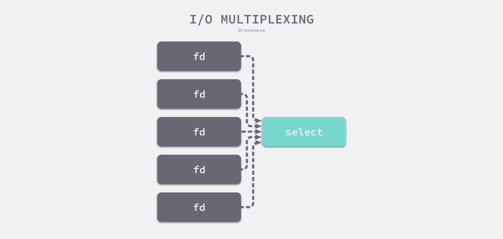
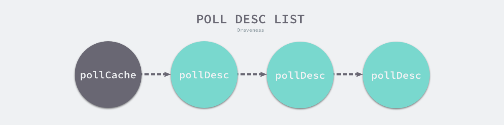
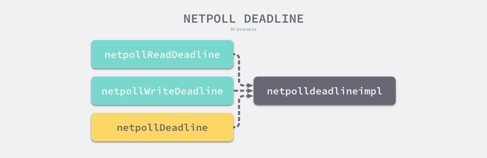

## 网络轮询器

[原文](https://draveness.me/golang/docs/part3-runtime/ch06-concurrency/golang-netpoller/)

大部分的服务都是 I/O 密集型的，应用程序会花费大量时间等待 I/O 操作的完成。网络轮询器是 Go 语言运行时用来处理 I/O 操作的关键组件，它使用了操作系统提供的 I/O 多路复用机制增强程序的并发处理能力。

### 设计原理

网络轮询器不仅用于监控网络 I/O，还能用于监控文件的 I/O，它利用了操作系统提供的 I/O 多路复用模型来提升 I/O 设备的利用率以及程序的性能。

#### I/O 模型

操作系统中包含阻塞 I/O、非阻塞 I/O、信号驱动 I/O 与异步 I/O 以及 I/O 多路复用五种 I/O 模型。

在 Unix 和类 Unix 操作系统中，文件描述符（File descriptor，FD）是用于访问文件或者其他 I/O 资源的抽象句柄，例如：管道或者网络套接字。而不同的 I/O 模型会使用不同的方式操作文件描述符。

##### 阻塞 I/O

阻塞 I/O 是最常见的 I/O 模型，在默认情况下，当我们通过 `read` 或者 `write` 等系统调用读写文件或者网络时，应用程序会被阻塞：

```c
ssize_t read(int fd, void *buf, size_t count);
ssize_t write(int fd, const void *buf, size_t nbytes);
```

当我们执行 `read` 系统调用时，应用程序会从用户态陷入内核态，内核会检查文件描述符是否可读；当文件描述符中存在数据时，操作系统内核会将准备好的数据拷贝给应用程序并交回控制权。

> 阻塞I/O模型


操作系统中多数的 I/O 操作都是如上所示的阻塞请求，一旦执行 I/O 操作，应用程序会陷入阻塞等待 I/O 操作的结束。

##### 非阻塞I/O

当进程把一个文件描述符设置成非阻塞时，执行 `read` 和 `write` 等 I/O 操作会立刻返回。在 C 语言中，我们可以使用如下所示的代码片段将一个文件描述符设置成非阻塞的：

```c
int flags = fcntl(fd, F_GETFL, 0);
fcntl(fd, F_SETFL, flags | O_NONBLOCK);
```

在上述代码中，最关键的就是系统调用 [`fcntl`](https://github.com/torvalds/linux/blob/f757165705e92db62f85a1ad287e9251d1f2cd82/fs/fcntl.c#L448) 和参数 `O_NONBLOCK`，[`fcntl`](https://github.com/torvalds/linux/blob/f757165705e92db62f85a1ad287e9251d1f2cd82/fs/fcntl.c#L448) 为我们提供了操作文件描述符的能力，我们可以通过它修改文件描述符的特性。当我们将文件描述符修改成非阻塞后，读写文件会经历以下流程：

> 非阻塞I/O模型


第一次从文件描述符中读取数据会触发系统调用并返回 `EAGAIN` 错误，`EAGAIN` 意味着该文件描述符还在等待缓冲区中的数据；随后，应用程序会不断轮询调用 `read` 直到它的返回值大于 0，这时应用程序就可以对读取操作系统缓冲区中的数据并进行操作。进程使用非阻塞的 I/O 操作时，可以在等待过程中执行其他任务，提高 CPU 的利用率。

##### I/O 多路复用

I/O 多路复用被用来处理同一个事件循环中的多个 I/O 事件。I/O 多路复用需要使用特定的系统调用，最常见的系统调用是 [`select`](https://github.com/torvalds/linux/blob/f757165705e92db62f85a1ad287e9251d1f2cd82/fs/select.c#L722)，该函数可以同时监听最多 1024 个文件描述符的可读或者可写状态：

```c
int select(int nfds, fd_set *restrict readfds, fd_set *restrict writefds, fd_set *restrict errorfds, struct timeval *restrict timeout);
```

除了标准的 [`select`](https://github.com/torvalds/linux/blob/f757165705e92db62f85a1ad287e9251d1f2cd82/fs/select.c#L722) 之外，操作系统中还提供了一个比较相似的 `poll` 函数，它使用链表存储文件描述符，摆脱了 1024 的数量上限。



多路复用函数会阻塞的监听一组文件描述符，当文件描述符的状态转变为可读或者可写时，`select` 会返回可读或者可写事件的个数，应用程序可以在输入的文件描述符中查找哪些可读或者可写，然后执行相应的操作。


I/O 多路复用模型是效率较高的 I/O 模型，它可以同时阻塞监听了一组文件描述符的状态。很多高性能的服务和应用程序都会使用这一模型来处理 I/O 操作，例如：Redis 和 Nginx 等。

#### 多模块

Go 语言在网络轮询器中使用 I/O 多路复用模型处理 I/O 操作，但是他没有选择最常见的系统调用 `select`。虽然 `select` 也可以提供 I/O 多路复用的能力，但是使用它有比较多的限制：

- 监听能力有限 — 最多只能监听 1024 个文件描述符；
- 内存拷贝开销大 — 需要维护一个较大的数据结构存储文件描述符，该结构需要拷贝到内核中；
- 时间复杂度 𝑂(𝑛)O(n) — 返回准备就绪的事件个数后，需要遍历所有的文件描述符；

为了提高 I/O 多路复用的性能，不同的操作系统也都实现了自己的 I/O 多路复用函数，例如：`epoll`、`kqueue` 和 `evport` 等。Go 语言为了提高在不同操作系统上的 I/O 操作性能，使用平台特定的函数实现了多个版本的网络轮询模块：

- [`src/runtime/netpoll_epoll.go`](https://github.com/golang/go/blob/master/src/runtime/netpoll_epoll.go)
- [`src/runtime/netpoll_kqueue.go`](https://github.com/golang/go/blob/master/src/runtime/netpoll_kqueue.go)
- [`src/runtime/netpoll_solaris.go`](https://github.com/golang/go/blob/master/src/runtime/netpoll_solaris.go)
- [`src/runtime/netpoll_windows.go`](https://github.com/golang/go/blob/master/src/runtime/netpoll_windows.go)
- [`src/runtime/netpoll_aix.go`](https://github.com/golang/go/blob/master/src/runtime/netpoll_aix.go)
- [`src/runtime/netpoll_fake.go`](https://github.com/golang/go/blob/master/src/runtime/netpoll_fake.go)

这些模块在不同平台上实现了相同的功能，构成了一个常见的树形结构。编译器在编译 Go 语言程序时，会根据目标平台选择树中特定的分支进行编译：


如果目标平台是 Linux，那么就会根据文件中的 `// +build linux` 编译指令选择 [`src/runtime/netpoll_epoll.go`](https://github.com/golang/go/blob/master/src/runtime/netpoll_epoll.go) 并使用 `epoll` 函数处理用户的 I/O 操作。

##### 接口

`epoll`、`kqueue`、`solaries` 等多路复用模块都要实现以下五个函数，这五个函数构成一个虚拟的接口：

```go
func netpollinit()
func netpollopen(fd uintptr, pd *pollDesc) int32
func netpoll(delta int64) gList
func netpollBreak()
func netpollIsPollDescriptor(fd uintptr) bool
```

上述函数在网络轮询器中分别扮演了不同的作用：

- [`runtime.netpollinit`](https://draveness.me/golang/tree/runtime.netpollinit) — 初始化网络轮询器，通过 [`sync.Once`](https://draveness.me/golang/tree/sync.Once) 和 `netpollInited` 变量保证函数只会调用一次；
- [`runtime.netpollopen`](https://draveness.me/golang/tree/runtime.netpollopen) — 监听文件描述符上的边缘触发事件，创建事件并加入监听；
- [`runtime.netpoll`](https://draveness.me/golang/tree/runtime.netpoll) — 轮询网络并返回一组已经准备就绪的 Goroutine，传入的参数会决定它的行为；
  - 如果参数小于 0，无限期等待文件描述符就绪；
  - 如果参数等于 0，非阻塞地轮询网络；
  - 如果参数大于 0，阻塞特定时间轮询网络；
- [`runtime.netpollBreak`](https://draveness.me/golang/tree/runtime.netpollBreak) — 唤醒网络轮询器，例如：计时器向前修改时间时会通过该函数中断网络轮询器；
- [`runtime.netpollIsPollDescriptor`](https://draveness.me/golang/tree/runtime.netpollIsPollDescriptor) — 判断文件描述符是否被轮询器使用；

### 数据结构

操作系统中 I/O 多路复用函数会监控文件描述符的可读或者可写，而 Go 语言网络轮询器会监听 [`runtime.pollDesc`](https://draveness.me/golang/tree/runtime.pollDesc) 结构体的状态，它会封装操作系统的文件描述符：

```go
type pollDesc struct {
	link *pollDesc

	lock    mutex
	fd      uintptr
	...
	rseq    uintptr
	rg      uintptr
	rt      timer
	rd      int64
	wseq    uintptr
	wg      uintptr
	wt      timer
	wd      int64
}
```

该结构体中包含用于监控可读和可写状态的变量，我们按照功能将它们分成以下四组：

- `rseq` 和 `wseq` — 表示文件描述符被重用或者计时器被重置；
- `rg` 和 `wg` — 表示二进制的信号量，可能为 `pdReady`、`pdWait`、等待文件描述符可读或者可写的 Goroutine 以及 `nil`；
- `rd` 和 `wd` — 等待文件描述符可读或者可写的截止日期；
- `rt` 和 `wt` — 用于等待文件描述符的计时器；

除了上述八个变量之外，该结构体中还保存了用于保护数据的互斥锁、文件描述符。[`runtime.pollDesc`](https://draveness.me/golang/tree/runtime.pollDesc) 结构体会使用 `link` 字段串联成链表存储在 [`runtime.pollCache`](https://draveness.me/golang/tree/runtime.pollCache) 中：

```go
type pollCache struct {
	lock  mutex
	first *pollDesc
}
```

[`runtime.pollCache`](https://draveness.me/golang/tree/runtime.pollCache) 是运行时包中的全局变量，该结构体中包含一个用于保护轮询数据的互斥锁和链表头：

> 轮询缓存链表



运行时会在第一次调用 [`runtime.pollCache.alloc`](https://draveness.me/golang/tree/runtime.pollCache.alloc) 方法时初始化总大小约为 4KB 的 [`runtime.pollDesc`](https://draveness.me/golang/tree/runtime.pollDesc) 结构体，[`runtime.persistentAlloc`](https://draveness.me/golang/tree/runtime.persistentAlloc) 会保证这些数据结构初始化在不会触发垃圾回收的内存中，让这些数据结构只能被内部的 `epoll` 和 `kqueue` 模块引用：

```go
func (c *pollCache) alloc() *pollDesc {
	lock(&c.lock)
	if c.first == nil {
		const pdSize = unsafe.Sizeof(pollDesc{})
		n := pollBlockSize / pdSize
		if n == 0 {
			n = 1
		}
		mem := persistentalloc(n*pdSize, 0, &memstats.other_sys)
		for i := uintptr(0); i < n; i++ {
			pd := (*pollDesc)(add(mem, i*pdSize))
			pd.link = c.first
			c.first = pd
		}
	}
	pd := c.first
	c.first = pd.link
	unlock(&c.lock)
	return pd
}
```

每次调用该结构体都会返回链表头还没有被使用的 [`runtime.pollDesc`](https://draveness.me/golang/tree/runtime.pollDesc)，这种批量初始化的做法能够增加网络轮询器的吞吐量。Go 语言运行时会调用 [`runtime.pollCache.free`](https://draveness.me/golang/tree/runtime.pollCache.free) 方法释放已经用完的 [`runtime.pollDesc`](https://draveness.me/golang/tree/runtime.pollDesc) 结构，它会直接将结构体插入链表的最前面：

```go
func (c *pollCache) free(pd *pollDesc) {
	lock(&c.lock)
	pd.link = c.first
	c.first = pd
	unlock(&c.lock)
}
```

上述方法没有重置 [`runtime.pollDesc`](https://draveness.me/golang/tree/runtime.pollDesc) 结构体中的字段，该结构体被重复利用时才会由 [`runtime.poll_runtime_pollOpen`](https://draveness.me/golang/tree/runtime.poll_runtime_pollOpen) 函数重置。

### 多路复用

网络轮询器实际上是对 I/O 多路复用技术的封装，本节将通过以下的三个过程分析网络轮询器的实现原理：

1. 网络轮询器的初始化；
2. 如何向网络轮询器加入待监控的任务；
3. 如何从网络轮询器获取触发的事件；

#### 初始化

因为文件 I/O、网络 I/O 以及计时器都依赖网络轮询器，所以 Go 语言会通过以下两条不同路径初始化网络轮询器：

1. [`internal/poll.pollDesc.init`](https://draveness.me/golang/tree/internal/poll.pollDesc.init) — 通过 [`net.netFD.init`](https://draveness.me/golang/tree/net.netFD.init) 和 [`os.newFile`](https://draveness.me/golang/tree/os.newFile) 初始化网络 I/O 和文件 I/O 的轮询信息时；
2. [`runtime.doaddtimer`](https://draveness.me/golang/tree/runtime.doaddtimer) — 向处理器中增加新的计时器时；

网络轮询器的初始化会使用 [`runtime.poll_runtime_pollServerInit`](https://draveness.me/golang/tree/runtime.poll_runtime_pollServerInit) 和 [`runtime.netpollGenericInit`](https://draveness.me/golang/tree/runtime.netpollGenericInit) 两个函数：

```go
func poll_runtime_pollServerInit() {
	netpollGenericInit()
}

func netpollGenericInit() {
	if atomic.Load(&netpollInited) == 0 {
		lock(&netpollInitLock)
		if netpollInited == 0 {
			netpollinit()
			atomic.Store(&netpollInited, 1)
		}
		unlock(&netpollInitLock)
	}
}
```

[`runtime.netpollGenericInit`](https://draveness.me/golang/tree/runtime.netpollGenericInit) 会调用平台上特定实现的 [`runtime.netpollinit`](https://draveness.me/golang/tree/runtime.netpollinit)，即 Linux 上的 `epoll`，它主要做了以下几件事情：

1. 是调用 `epollcreate1` 创建一个新的 `epoll` 文件描述符，这个文件描述符会在整个程序的生命周期中使用；
2. 通过 [`runtime.nonblockingPipe`](https://draveness.me/golang/tree/runtime.nonblockingPipe) 创建一个用于通信的管道；
3. 使用 `epollctl` 将用于读取数据的文件描述符打包成 `epollevent` 事件加入监听；

```go
var (
	epfd int32 = -1
	netpollBreakRd, netpollBreakWr uintptr
)

func netpollinit() {
	epfd = epollcreate1(_EPOLL_CLOEXEC)
	r, w, _ := nonblockingPipe()
	ev := epollevent{
		events: _EPOLLIN,
	}
	*(**uintptr)(unsafe.Pointer(&ev.data)) = &netpollBreakRd
	epollctl(epfd, _EPOLL_CTL_ADD, r, &ev)
	netpollBreakRd = uintptr(r)
	netpollBreakWr = uintptr(w)
}
```

初始化的管道为我们提供了中断多路复用等待文件描述符中事件的方法，[`runtime.netpollBreak`](https://draveness.me/golang/tree/runtime.netpollBreak) 会向管道中写入数据唤醒 `epoll`：

```go
func netpollBreak() {
	for {
		var b byte
		n := write(netpollBreakWr, unsafe.Pointer(&b), 1)
		if n == 1 {
			break
		}
		if n == -_EINTR {
			continue
		}
		if n == -_EAGAIN {
			return
		}
	}
}
```

因为目前的计时器由网络轮询器管理和触发，它能够让网络轮询器立刻返回并让运行时检查是否有需要触发的计时器。

#### 轮询事件

调用 [`internal/poll.pollDesc.init`](https://draveness.me/golang/tree/internal/poll.pollDesc.init) 初始化文件描述符时不止会初始化网络轮询器，还会通过 [`runtime.poll_runtime_pollOpen`](https://draveness.me/golang/tree/runtime.poll_runtime_pollOpen) 重置轮询信息 [`runtime.pollDesc`](https://draveness.me/golang/tree/runtime.pollDesc) 并调用 [`runtime.netpollopen`](https://draveness.me/golang/tree/runtime.netpollopen) 初始化轮询事件：

```go
func poll_runtime_pollOpen(fd uintptr) (*pollDesc, int) {
	pd := pollcache.alloc()
	lock(&pd.lock)
	if pd.wg != 0 && pd.wg != pdReady {
		throw("runtime: blocked write on free polldesc")
	}
	...
	pd.fd = fd
	pd.closing = false
	pd.everr = false
	...
	pd.wseq++
	pd.wg = 0
	pd.wd = 0
	unlock(&pd.lock)

	var errno int32
	errno = netpollopen(fd, pd)
	return pd, int(errno)
}
```

[`runtime.netpollopen`](https://draveness.me/golang/tree/runtime.netpollopen) 的实现非常简单，它会调用 `epollctl` 向全局的轮询文件描述符 `epfd` 中加入新的轮询事件监听文件描述符的可读和可写状态：

```go
func netpollopen(fd uintptr, pd *pollDesc) int32 {
	var ev epollevent
	ev.events = _EPOLLIN | _EPOLLOUT | _EPOLLRDHUP | _EPOLLET
	*(**pollDesc)(unsafe.Pointer(&ev.data)) = pd
	return -epollctl(epfd, _EPOLL_CTL_ADD, int32(fd), &ev)
}
```

从全局的 `epfd` 中删除待监听的文件描述符可以使用 [`runtime.netpollclose`](https://draveness.me/golang/tree/runtime.netpollclose)，因为该函数的实现与 [`runtime.netpollopen`](https://draveness.me/golang/tree/runtime.netpollopen) 比较相似，所以这里不展开分析了。

#### 事件循环

我们将从以下的两个部分介绍事件循环的实现原理：

- Goroutine 让出线程并等待读写事件；
- 多路复用等待读写事件的发生并返回；

上述过程连接了操作系统中的 I/O 多路复用机制和 Go 语言的运行时，在两个不同体系之间构建了桥梁，我们将分别介绍上述的两个过程。

##### 等待事件

当我们在文件描述符上执行读写操作时，如果文件描述符不可读或者不可写，当前 Goroutine 会执行 [`runtime.poll_runtime_pollWait`](https://draveness.me/golang/tree/runtime.poll_runtime_pollWait) 检查 [`runtime.pollDesc`](https://draveness.me/golang/tree/runtime.pollDesc) 的状态并调用 [`runtime.netpollblock`](https://draveness.me/golang/tree/runtime.netpollblock) 等待文件描述符的可读或者可写：

```go
func poll_runtime_pollWait(pd *pollDesc, mode int) int {
	...
	for !netpollblock(pd, int32(mode), false) {
		...
	}
	return 0
}

func netpollblock(pd *pollDesc, mode int32, waitio bool) bool {
	gpp := &pd.rg
	if mode == 'w' {
		gpp = &pd.wg
	}
	...
	if waitio || netpollcheckerr(pd, mode) == 0 {
		gopark(netpollblockcommit, unsafe.Pointer(gpp), waitReasonIOWait, traceEvGoBlockNet, 5)
	}
	...
}
```

[`runtime.netpollblock`](https://draveness.me/golang/tree/runtime.netpollblock) 是 Goroutine 等待 I/O 事件的关键函数，它会使用运行时提供的 [`runtime.gopark`](https://draveness.me/golang/tree/runtime.gopark) 让出当前线程，将 Goroutine 转换到休眠状态并等待运行时的唤醒。

##### 轮询等待

Go 语言的运行时会在调度或者系统监控中调用 [`runtime.netpoll`](https://draveness.me/golang/tree/runtime.netpoll) 轮询网络，该函数的执行过程可以分成以下几个部分：

1. 根据传入的 `delay` 计算 `epoll` 系统调用需要等待的时间；
2. 调用 `epollwait` 等待可读或者可写事件的发生；
3. 在循环中依次处理 `epollevent` 事件；

因为传入 `delay` 的单位是纳秒，下面这段代码会将纳秒转换成毫秒：

```go
func netpoll(delay int64) gList {
	var waitms int32
	if delay < 0 {
		waitms = -1
	} else if delay == 0 {
		waitms = 0
	} else if delay < 1e6 {
		waitms = 1
	} else if delay < 1e15 {
		waitms = int32(delay / 1e6)
	} else {
		waitms = 1e9
	}
```

计算了需要等待的时间之后，[`runtime.netpoll`](https://draveness.me/golang/tree/runtime.netpoll) 会执行 `epollwait` 等待文件描述符转换成可读或者可写，如果该函数返回了负值，可能会返回空的 Goroutine 列表或者重新调用 `epollwait` 陷入等待：

```go
	var events [128]epollevent
retry:
	n := epollwait(epfd, &events[0], int32(len(events)), waitms)
	if n < 0 {
		if waitms > 0 {
			return gList{}
		}
		goto retry
	}
```

当 `epollwait` 系统调用返回的值大于 0 时，意味着被监控的文件描述符出现了待处理的事件，我们在如下所示的循环中会依次处理这些事件：

```go
	var toRun gList
	for i := int32(0); i < n; i++ {
		ev := &events[i]
		if *(**uintptr)(unsafe.Pointer(&ev.data)) == &netpollBreakRd {
			...
			continue
		}

		var mode int32
		if ev.events&(_EPOLLIN|_EPOLLRDHUP|_EPOLLHUP|_EPOLLERR) != 0 {
			mode += 'r'
		}
		...
		if mode != 0 {
			pd := *(**pollDesc)(unsafe.Pointer(&ev.data))
			pd.everr = false
			netpollready(&toRun, pd, mode)
		}
	}
	return toRun
}
```

处理的事件总共包含两种，一种是调用 [`runtime.netpollBreak`](https://draveness.me/golang/tree/runtime.netpollBreak) 触发的事件，该函数的作用是中断网络轮询器；另一种是其他文件描述符的正常读写事件，对于这些事件，我们会交给 [`runtime.netpollready`](https://draveness.me/golang/tree/runtime.netpollready) 处理：

```go
func netpollready(toRun *gList, pd *pollDesc, mode int32) {
	var rg, wg *g
	...
	if mode == 'w' || mode == 'r'+'w' {
		wg = netpollunblock(pd, 'w', true)
	}
	...
	if wg != nil {
		toRun.push(wg)
	}
}
```

[`runtime.netpollunblock`](https://draveness.me/golang/tree/runtime.netpollunblock) 会在读写事件发生时，将 [`runtime.pollDesc`](https://draveness.me/golang/tree/runtime.pollDesc) 中的读或者写信号量转换成 `pdReady` 并返回其中存储的 Goroutine；如果返回的 Goroutine 不会为空，那么运行时会将该 Goroutine 会加入 `toRun` 列表，并将列表中的全部 Goroutine 加入运行队列并等待调度器的调度。

[`runtime.netpoll`](https://draveness.me/golang/tree/runtime.netpoll) 返回的 Goroutine 列表都会被 [`runtime.injectglist`](https://draveness.me/golang/tree/runtime.injectglist) 注入到处理器或者全局的运行队列上。因为系统监控 Goroutine 直接运行在线程上，所以它获取的 Goroutine 列表会直接加入全局的运行队列，其他 Goroutine 获取的列表都会加入 Goroutine 所在处理器的运行队列上。

#### 截止日期

网络轮询器和计时器的关系非常紧密，这不仅仅是因为网络轮询器负责计时器的唤醒，还因为文件和网络 I/O 的截止日期也由网络轮询器负责处理。截止日期在 I/O 操作中，尤其是网络调用中很关键，网络请求存在很高的不确定因素，我们需要设置一个截止日期保证程序的正常运行，这时需要用到网络轮询器中的 [`runtime.poll_runtime_pollSetDeadline`](https://draveness.me/golang/tree/runtime.poll_runtime_pollSetDeadline)：

```go
func poll_runtime_pollSetDeadline(pd *pollDesc, d int64, mode int) {
	rd0, wd0 := pd.rd, pd.wd
	if d > 0 {
		d += nanotime()
	}
	pd.rd = d
	...
	if pd.rt.f == nil {
		if pd.rd > 0 {
			pd.rt.f = netpollReadDeadline
			pd.rt.arg = pd
			pd.rt.seq = pd.rseq
			resettimer(&pd.rt, pd.rd)
		}
	} else if pd.rd != rd0 {
		pd.rseq++
		if pd.rd > 0 {
			modtimer(&pd.rt, pd.rd, 0, rtf, pd, pd.rseq)
		} else {
			deltimer(&pd.rt)
			pd.rt.f = nil
		}
	}
```

该函数会先使用截止日期计算出过期的时间点，然后根据 [`runtime.pollDesc`](https://draveness.me/golang/tree/runtime.pollDesc) 的状态做出以下不同的处理：

1. 如果结构体中的计时器没有设置执行的函数时，该函数会设置计时器到期后执行的函数、传入的参数并调用 [`runtime.resettimer`](https://draveness.me/golang/tree/runtime.resettimer) 重置计时器；
2. 如果结构体的读截止日期已经被改变，我们会根据新的截止日期做出不同的处理：
   1. 如果新的截止日期大于 0，调用 [`runtime.modtimer`](https://draveness.me/golang/tree/runtime.modtimer) 修改计时器；
   2. 如果新的截止日期小于 0，调用 [`runtime.deltimer`](https://draveness.me/golang/tree/runtime.deltimer) 删除计时器；

在 [`runtime.poll_runtime_pollSetDeadline`](https://draveness.me/golang/tree/runtime.poll_runtime_pollSetDeadline) 的最后，会重新检查轮询信息中存储的截止日期：

```go
	var rg *g
	if pd.rd < 0 {
		if pd.rd < 0 {
			rg = netpollunblock(pd, 'r', false)
		}
		...
	}
	if rg != nil {
		netpollgoready(rg, 3)
	}
	...
}
```

如果截止日期小于 0，上述代码会调用 [`runtime.netpollgoready`](https://draveness.me/golang/tree/runtime.netpollgoready) 直接唤醒对应的 Goroutine。

在 [`runtime.poll_runtime_pollSetDeadline`](https://draveness.me/golang/tree/runtime.poll_runtime_pollSetDeadline) 中直接调用 [`runtime.netpollgoready`](https://draveness.me/golang/tree/runtime.netpollgoready) 是相对比较特殊的情况。在正常情况下，运行时都会在计时器到期时调用 [`runtime.netpollDeadline`](https://draveness.me/golang/tree/runtime.netpollDeadline)、[`runtime.netpollReadDeadline`](https://draveness.me/golang/tree/runtime.netpollReadDeadline) 和 [`runtime.netpollWriteDeadline`](https://draveness.me/golang/tree/runtime.netpollWriteDeadline) 三个函数：



上述三个函数都会通过 [`runtime.netpolldeadlineimpl`](https://draveness.me/golang/tree/runtime.netpolldeadlineimpl) 调用 [`runtime.netpollgoready`](https://draveness.me/golang/tree/runtime.netpollgoready) 直接唤醒相应的 Goroutine:

```go
func netpolldeadlineimpl(pd *pollDesc, seq uintptr, read, write bool) {
	currentSeq := pd.rseq
	if !read {
		currentSeq = pd.wseq
	}
	if seq != currentSeq {
		return
	}
	var rg *g
	if read {
		pd.rd = -1
		atomic.StorepNoWB(unsafe.Pointer(&pd.rt.f), nil)
		rg = netpollunblock(pd, 'r', false)
	}
	...
	if rg != nil {
		netpollgoready(rg, 0)
	}
	...
}
```

Goroutine 在被唤醒之后会意识到当前的 I/O 操作已经超时，可以根据需要选择重试请求或者中止调用。

### 小结

网络轮询器并不是由运行时中的某一个线程独立运行的，运行时的调度器和系统调用都会通过 [`runtime.netpoll`](https://draveness.me/golang/tree/runtime.netpoll) 与网络轮询器交换消息，获取待执行的 Goroutine 列表，并将待执行的 Goroutine 加入运行队列等待处理。

所有的文件 I/O、网络 I/O 和计时器都是由网络轮询器管理的，它是 Go 语言运行时重要的组成部分。

