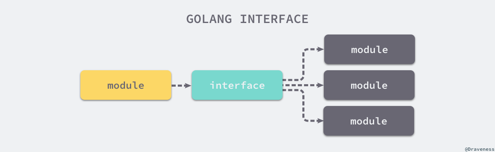

## 接口

[原文](https://draveness.me/golang/docs/part2-foundation/ch04-basic/golang-interface/)

### 概述

在计算机科学中，接口是计算机系统中多个组件共享的边界，不同的组件能够在边界上交换信息。如下图所示，接口的本质是引入一个新的中间层，调用方可以通过接口与具体实现分离，解除上下游的耦合，上层的模块不再需要依赖下层的具体模块，只需要依赖一个约定好的接口。



**图 4-5 上下游通过接口解耦**

这种面向接口的编程方式有着非常强大的生命力，无论是在框架还是操作系统中我们都能够找到接口的身影。可移植操作系统接口（Portable Operating System Interface，POSIX)就是一个典型的例子，它定义了应用程序接口和命令行等标准，为计算机软件带来了可移植性 — 只要操作系统实现了 POSIX，计算机软件就可以直接在不同操作系统上运行。

人能够同时处理的信息非常有限，定义良好的接口能够隔离底层的实现，让我们将重点放在当前的代码片段中。SQL 就是接口的一个例子，当我们使用 SQL 语句查询数据时，其实不需要关心底层数据库的具体实现，我们只在乎 SQL 返回的结果是否符合预期。

#### 隐式接口

定义接口需要使用 `interface` 关键字，在接口中我们只能定义方法签名，不能包含成员变量，一个常见的 Go 语言接口是这样的：

```go
type error interface {
	Error() string
}
```

如果一个类型需要实现 `error` 接口，那么它只需要实现 `Error() string` 方法，下面的 `RPCError` 结构体就是 `error` 接口的一个实现：

```go
type RPCError struct {
	Code    int64
	Message string
}

func (e *RPCError) Error() string {
	return fmt.Sprintf("%s, code=%d", e.Message, e.Code)
}
```

Go 语言中**接口的实现都是隐式的**，我们只需要实现 `Error() string` 方法就实现了 `error` 接口。

我们使用上述 `RPCError` 结构体时并不关心它实现了哪些接口，Go 语言只会在传递参数、返回参数以及变量赋值时才会对某个类型是否实现接口进行检查。

从类型检查的过程来看，编译器仅在需要时才检查类型，类型实现接口时只需要实现接口中的全部方法，不需要像 Java 等编程语言中一样显式声明。

#### 类型

接口也是 Go 语言中的一种类型，它能够出现在变量的定义、函数的入参和返回值中并对它们进行约束，不过 Go 语言中有两种略微不同的接口，一种是带有一组方法的接口，另一种是不带任何方法的 `interface{}`：


**图 4-7 Go 语言中的两种接口**

Go 语言使用 [`runtime.iface`](https://draveness.me/golang/tree/runtime.iface) 表示第一种接口，使用 [`runtime.eface`](https://draveness.me/golang/tree/runtime.eface) 表示第二种不包含任何方法的接口 `interface{}`，两种接口虽然都使用 `interface` 声明，但是由于后者在 Go 语言中很常见，所以在实现时使用了特殊的类型。

需要注意的是，与 C 语言中的 `void *` 不同，`interface{}` 类型**不是任意类型**。如果我们将类型转换成了 `interface{}` 类型，变量在运行期间的类型也会发生变化，获取变量类型时会得到 `interface{}`。

```go
package main

func main() {
	type Test struct{}
	v := Test{}
	Print(v)
}

func Print(v interface{}) {
	println(v)
}
```

上述函数不接受任意类型的参数，只接受 `interface{}` 类型的值，在调用 `Print` 函数时会对参数 `v` 进行类型转换，将原来的 `Test` 类型转换成 `interface{}` 类型，本节会在后面介绍类型转换的实现原理。

#### 指针和接口

