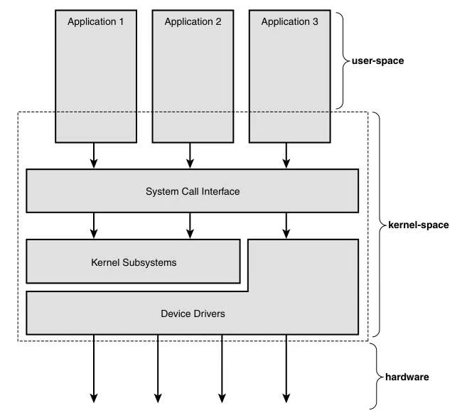

[toc]

## 1 Introduction to the Linux Kernel

The original elegant design of the Unix system, along with the years of innovation and evolutionary improvement that followed, has resulted in a powerful, robust, and stable operating system.A handful of characteristics of Unix are at the core of its strength. First, **Unix is simple**:Whereas some operating systems implement thousands of system calls and have unclear design goals, Unix systems implement only hundreds of system calls and have a straightforward, even basic, design. Second, in Unix, **everything is a file**.2 This simpli-fies the manipulation of data and devices into a set of core system calls: open(), read(),write(), lseek(), and close().Third, the Unix kernel and related system utilities are written in C—a property that gives Unix its amazing portability to diverse hardware architectures and accessibility to a wide range of developers. Fourth, Unix has **fast process creation time** and the unique fork() system call. Finally, **Unix provides simple yet robust interprocess communication (IPC)** primitives that, when coupled with the fast process creation time, enable the creation of simple programs that do one thing and do it well.These single-purpose programs can be strung together to accomplish tasks of increasing com-plexity. Unix systems thus exhibit clean layering, with a strong separation between policy and mechanism.

Unix 系统最初简洁优雅的设计，历经多年的创新与渐进式优化，最终演变成为一套功能强大、稳定可靠的操作系统。Unix 的优势源于其多项核心特性：

其一，**设计简洁**。部分操作系统实现了数千个系统调用，且设计目标模糊，而 Unix 系统仅实现了数百个系统调用，采用直观且基础的设计思路。

其二，**万物皆文件**。这一设计将数据与设备的操作，简化为对一组核心系统调用的使用，即`open()`、`read()`、`write()`、`lseek()`和`close()`。

其三，Unix 内核及相关系统工具均采用 C 语言编写，这一特性赋予了 Unix 出色的可移植性，使其能够适配各类硬件架构，同时也便于广大开发者参与开发。

其四，**高效的进程创建机制**。Unix 具备快速的进程创建速度，且拥有独有的`fork()`系统调用。

其五，**简洁可靠的进程间通信能力**。Unix 提供了简洁而可靠的进程间通信（IPC）原语，结合其快速的进程创建特性，开发者能够编写出专注完成单一任务且精益求精的轻量程序。这些单一功能程序可以灵活组合，完成复杂度更高的任务。

由此，Unix 系统形成了**清晰的分层架构**，实现了策略与机制的明确分离。

### Along Came Linux: Introduction to Linux

**Linux 的诞生：Linux 系统简介**

Linux is a Unix-like system, but it is not Unix.That is, although Linux borrows many ideas from Unix and implements the Unix API (as defined by POSIX and the Single Unix Specification), it is not a direct descendant of the Unix source code like other Unix systems.Where desired, it has deviated from the path taken by other implementations, but it has not forsaken the general design goals of Unix or broken standardized application interfaces.

Linux 是一套**类 Unix 系统**，但并非严格意义上的 Unix 系统。也就是说，尽管 Linux 借鉴了 Unix 的诸多设计理念，且实现了符合 POSIX 标准与《单一 Unix 规范》的 Unix 应用程序接口（API），但它与其他 Unix 系统不同，并非 Unix 源代码的直接衍生版本。在有实际需求的场景下，Linux 在部分实现路径上与其他同类系统有所不同，但它既没有摒弃 Unix 的总体设计目标，也没有破坏标准化的应用程序接口。

### Overview of Operating Systems and Kernels

**操作系统与内核概述**

modern systems with protected memory management units, the kernel typically resides in an elevated system state compared to normal user applications.This includes a protected memory space and full access to the hardware.This system state and memory space is col-lectively referred to as kernel-space. Conversely, user applications execute in user-space.They see a subset of the machine’s available resources and can perform certain system functions, directly access hardware, access memory outside of that allotted them by the kernel, or otherwise misbehave.When executing kernel code, the system is in kernel-space execut-ing in **kernel mode**.When running a regular process, the system is in user-space executing in **user mode**.

在配备**保护内存管理单元**的现代系统中，内核通常运行在相较于普通用户应用程序更高的特权系统状态下。该状态包含一块受保护的内存空间，且内核拥有对硬件的完全访问权限。这种系统状态与内存空间，统称为**内核空间**。与之相对，用户应用程序运行在**用户空间**中，它们只能访问计算机可用资源的子集，无法直接访问硬件、不能访问内核分配给它们之外的内存区域，也不会出现其他异常行为。当系统执行内核代码时，就处于运行在内核空间的**内核态**；当系统运行普通进程时，则处于运行在用户空间的**用户态**。

Applications running on the system communicate with the kernel via system calls (see Figure 1.1).An application typically calls functions in a library—for example, the C library—that in turn rely on the system call interface to instruct the kernel to carry out tasks on the application’s behalf. Some library calls provide many features not found in the system call, and thus, calling into the kernel is just one step in an otherwise large func-tion. For example, consider the familiar printf() function. It provides formatting and buffering of the data; only one step in its work is invoking write() to write the data to the console. Conversely, some library calls have a one-to-one relationship with the kernel. For example, the open() library function does little except call the open() system call. Still other C library functions, such as strcpy(), should (one hopes) make no direct use of the kernel at all.When an application executes a system call, we say that the kernel is executing on behalf of the application. Furthermore, the application is said to be executing a system call in kernel-space, and the kernel is running in process context.This relationship— that applications call into the kernel via the system call interface—is the fundamental man-ner in which applications get work done.

运行在系统上的应用程序，通过**系统调用**与内核进行交互（见图 1.1）。应用程序通常会调用类库中的函数 —— 例如 C 标准库函数，这些函数继而通过系统调用接口，指示内核代表应用程序完成相应任务。部分库函数会提供许多系统调用不具备的功能，因此，调用内核仅仅是这类复杂函数执行过程中的一个步骤。以常用的`printf()`函数为例，它会实现数据格式化和缓冲功能，而调用`write()`系统调用将数据输出到控制台，只是其工作流程中的一步而已。与之相反，有些库函数与内核系统调用是一一对应的关系。例如`open()`库函数，其功能几乎就是直接调用`open()`系统调用。还有一些 C 标准库函数，例如`strcpy()`，我们自然也期望它们完全不会直接调用内核。当应用程序执行系统调用时，我们称内核正在**代表应用程序**执行操作。此外，此时应用程序处于内核空间中执行系统调用，而内核则运行在**进程上下文**环境下。应用程序通过系统调用接口调用内核，这一关系正是应用程序完成各项任务的基本方式。

The kernel also manages the system’s hardware. Nearly all architectures, including all systems that Linux supports, provide the concept of **interrupts**. When hardware wants to communicate with the system, it issues an interrupt that literally interrupts the processor, which in turn interrupts the kernel.A number identifies interrupts and the kernel uses this number to execute a specific **interrupt handler to process** and respond to the interrupt. For example, as you type, the keyboard controller issues an interrupt to let the system know that there is new data in the keyboard buffer.The kernel notes the interrupt num-ber of the incoming interrupt and executes the correct interrupt handler.The interrupt handler processes the keyboard data and lets the keyboard controller know it is ready for more data.To provide synchronization, the kernel can disable interrupts—either all inter-rupts or just one specific interrupt number. In many operating systems, including Linux, the interrupt handlers do not run in a process context. Instead, they run in a special interrupt context that is not associated with any process.This special context exists solely to let an interrupt handler quickly respond to an interrupt, and then exit.

内核还负责管理系统的硬件资源。几乎所有硬件架构（包括 Linux 支持的全部架构）都实现了**中断**机制。当硬件设备需要与系统通信时，会触发一个中断信号，直接中断处理器的当前工作，进而让内核进入中断处理流程。每个中断都有对应的编号，内核会根据该编号执行特定的**中断处理程序**，对中断请求进行处理和响应。例如，当你敲击键盘时，键盘控制器会触发一个中断，告知系统键盘缓冲区中出现了新的输入数据。内核识别到该中断的编号后，会调用对应的中断处理程序。中断处理程序会读取并处理键盘输入数据，随后向键盘控制器发送就绪信号，告知其可以接收新的输入。为了实现同步控制，内核可以关闭中断功能 —— 既可以关闭所有中断，也可以只屏蔽某个特定编号的中断。在包括 Linux 在内的多数操作系统中，中断处理程序并非运行在进程上下文，而是运行在一种特殊的**中断上下文**中，该上下文不关联任何进程。设计这种特殊上下文的唯一目的，是让中断处理程序能够快速响应中断请求，处理完成后立即退出。

These contexts represent the breadth of the kernel’s activities. In fact, in Linux, we can generalize that each processor is doing exactly one of three things at any given moment:

- In **user-space**, executing user code in a process
- In **kernel-space**, in process context, executing on behalf of a specific process
- In **kernel-space**, in interrupt context, not associated with a process, handling an interrupt

上述这些上下文涵盖了内核的全部运行场景。事实上，在 Linux 系统中，我们可以总结得出：任意时刻，每个处理器都必然处于以下三种状态之一：

1. 运行在**用户空间**，在某个进程中执行用户代码
2. 运行在**内核空间**，处于进程上下文，代表某个特定进程执行操作
3. 运行在**内核空间**，处于中断上下文，不关联任何进程，正在处理中断请求

This list is inclusive. Even corner cases fit into one of these three activities: For exam-ple, when idle, it turns out that the kernel is executing an idle process in process context in the kernel.

这一分类覆盖了所有情况，即便是一些特殊场景也不例外。例如，当系统处于空闲状态时，内核实际上是在进程上下文中执行一个**空闲进程**。

### Linux Versus Classic Unix Kernels

**Linux 内核与传统 Unix 内核的对比**

Linux is a **monolithic kernel**; that is, the Linux kernel executes in a single address space entirely in kernel mode. Linux, however, borrows much of the good from microkernels: Linux boasts a modular design, the capability to preempt itself (called **kernel preemption**), support for kernel threads, and the capability to dynamically load separate binaries (kernel modules) into the kernel image. Conversely, Linux has none of the performance-sapping features that curse microkernel design: Everything runs in kernel mode, with direct function invocation— not message passing—the modus of communication. Nonetheless, Linux is modular, threaded, and the kernel itself is schedulable. Pragmatism wins again.

Linux 属于**单体内核**，也就是说，整个 Linux 内核在单一地址空间内运行，且全程处于内核态。不过，Linux 借鉴了微内核设计的诸多优点：它采用模块化架构，支持**内核抢占**机制，能够管理内核线程，还可以将独立的二进制文件（**内核模块**）动态加载到内核镜像中。与此同时，Linux 完全没有微内核设计中那些会导致性能损耗的特性：所有内核组件均运行在内核态，组件间通过直接的函数调用而非消息传递机制进行通信。尽管如此，Linux 依然具备模块化、支持线程化、内核自身可被调度的特性。这正是实用主义设计理念的又一次胜利。