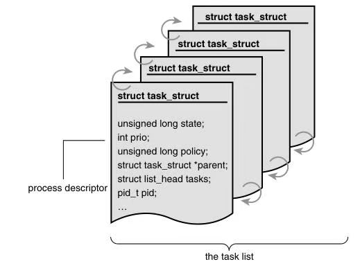
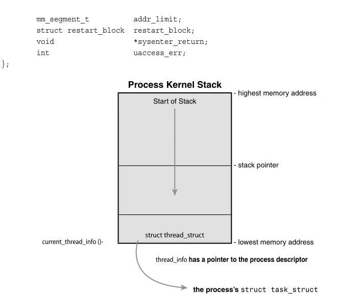
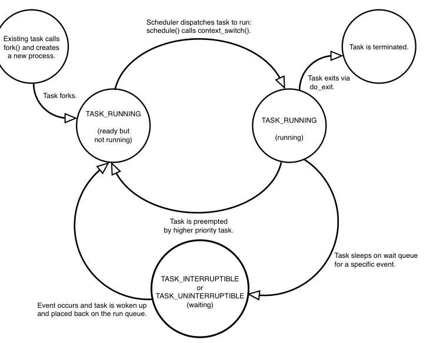
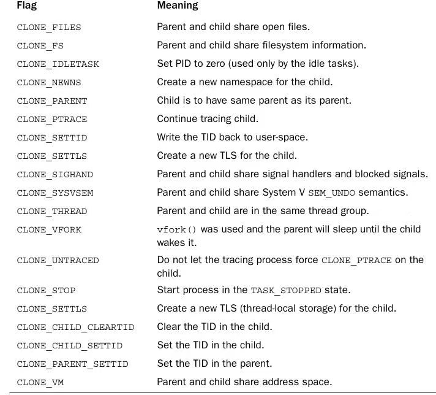

[toc]

## 3 Process Management

**The Process** A process is a program (object code stored on some media) in the midst of execution. Processes are, however, more than just the executing program code (often called the text section in Unix).They also include a set of resources such as open files and pending signals, internal kernel data, processor state, a memory address space with one or more memory mappings, one or more threads of execution, and a data section containing global variables. Processes, in effect, are the living result of running program code.The kernel needs to manage all these details efficiently and transparently.

**进程**指的是处于执行过程中的程序（存储在某种介质上的目标代码）。但进程的范畴并不仅仅局限于正在执行的程序代码（在 Unix 系统中通常被称为**代码段**），它还包含一系列资源，例如打开的文件、待处理的信号、内核内部数据、处理器状态、带有一个或多个内存映射的内存地址空间、一个或多个执行线程，以及存放全局变量的数据段。实际上，进程就是程序代码运行起来后的动态产物。内核需要高效且透明地管理好上述所有细节。

**Threads of execution**, often shortened to threads, are the objects of activity within the process. Each thread includes a unique program counter, process stack, and set of proces-sor registers.The kernel schedules individual threads, not processes. In traditional Unix systems, each process consists of one thread. In modern systems, however, multithreaded programs—those that consist of more than one thread—are common.As you will see later, Linux has a unique implementation of threads: It **does not differentiate between threads and processes**.To Linux, a thread is just a special kind of process.

**执行线程**（通常简称为线程）是进程内的活动实体。每个线程都拥有唯一的程序计数器、进程栈，以及一组处理器寄存器。内核调度的对象是独立的线程，而非进程。在传统的 Unix 系统中，一个进程只包含一个线程。但在现代操作系统中，多线程程序 —— 即包含多个线程的程序 —— 已经十分常见。后续内容会提到，Linux 对线程采用了一种独特的实现方式：它**并不区分线程和进程**。在 Linux 看来，线程只不过是一种特殊的进程而已。

On modern operating systems, processes provide two virtualizations: **a virtualized processor** and **virtual memory**.The virtual processor gives the process the illusion that it alone monopolizes the system, despite possibly sharing the processor among hundreds of other processes. Chapter 4,“Process Scheduling,” discusses this virtualization.Virtual memory lets the process allocate and manage memory as if it alone owned all the mem-ory in the system.Virtual memory is covered in Chapter 12,“Memory Management.”

在现代操作系统中，进程实现了两种虚拟化能力：**虚拟处理器**与**虚拟内存**。虚拟处理器会让进程产生一种独占整个系统的错觉，即便它可能需要和数百个其他进程共享处理器资源。本书第 4 章《进程调度》会详细讲解这种虚拟化机制。虚拟内存则允许进程像独占系统所有内存资源一样，自由地分配和管理内存。虚拟内存的相关内容会在本书第 12 章《内存管理》中介绍。

Interestingly, note that threads **share the virtual memory abstraction**, whereas each receives its own virtualized processor.

值得注意的是，线程之间会**共享虚拟内存**这一抽象资源，而每个线程则各自拥有专属的虚拟处理器。

A program itself is not a process; a **process is an active program and related resources**.

程序本身并非进程；**进程是处于活动状态的程序及相关资源的集合**。

Indeed, two or more processes can exist that are executing the same program. In fact, two or more processes can exist that share various resources, such as open files or an address space.

事实上，可以存在两个或多个执行同一程序的进程。不仅如此，多个进程还可以共享各类资源，例如打开的文件或地址空间。

A process begins its life when, not surprisingly, it is created. In Linux, this occurs by means of the fork() system call, which creates a new process by duplicating an existing one.The process that calls fork() is the **parent**, whereas the new process is the **child**. The parent resumes execution and the child starts execution at the same place: where the call to fork() returns.The fork() system call returns from the kernel twice: once in the par-ent process and again in the newborn child.

进程的生命周期始于其被创建之时。在 Linux 系统中，进程的创建是通过 `fork()` 系统调用完成的 —— 该调用通过复制一个已有进程来创建新进程。发起 `fork()` 调用的进程被称为**父进程**，新创建的进程则被称为**子进程**。父进程会恢复执行，而子进程则从 `fork()` 调用的返回处开始执行。`fork()` 系统调用会从内核返回两次：一次返回到父进程中，另一次返回到新创建的子进程中。

Often, immediately after a fork it is desirable to execute a new, different program.The exec() family of function calls creates a new address space and loads a new program into it. In contemporary Linux kernels, fork() is actually implemented via the clone() sys-tem call, which is discussed in a following section.

通常情况下，在调用 `fork()` 之后，我们会希望立即执行一个全新的程序。`exec()` 系列函数调用会创建新的地址空间，并将新程序加载到该空间中。在现代 Linux 内核中，`fork()` 实际上是通过 `clone()` 系统调用来实现的，这一点会在后续章节中详细介绍。

Finally, a program exits via the exit() system call.This function terminates the process and frees all its resources.A parent process can inquire about the status of a terminated child via the wait4()1 system call, which enables a process to wait for the termination of a specific process.When a process exits, it is placed into a special zombie state that repre-sents terminated processes until the parent calls wait() or waitpid().

进程最终会通过 `exit()` 系统调用退出。该函数会终止进程，并释放其占用的所有资源。父进程可以通过 `wait4()`¹ 系统调用查询已终止子进程的状态，这个调用能让一个进程等待某个特定进程终止。当进程退出后，会进入一种特殊的**僵尸状态**，该状态会一直持续到父进程调用 `wait()` 或 `waitpid()` 为止，专门用来表征已终止的进程。

**Process Descriptor and the Task Structure**

进程描述符与任务结构体

 The kernel stores the list of processes in a circular doubly linked list called the task list.

内核将所有进程的列表存储在一个名为**任务列表**的双向循环链表中。

Each element in the task list is a **process descriptor** of the type struct task_struct, which is defined in .The process descriptor contains all the information about a specific process.

任务列表中的每个元素都是一个 `struct task_struct` 类型的**进程描述符**，该结构体定义在头文件 `<linux/sched.h>` 中。进程描述符包含了某个特定进程的所有相关信息。

The task_struct is a relatively large data structure, at around 1.7kilobytes on a 32-bit machine.This size, however, is quite smallconsidering that the structure contains all the information that thekernel has and needs about a process.The process descriptorcontains the data that describes the executing program—open files, theprocess’s address space, pending signals, the process’s state, andmuch more (see Figure 3.1).

`task_struct` 结构体是一个相对较大的数据结构，在 32 位机器上大小约为 1.7 千字节。不过，考虑到该结构体包含了内核所持有的、以及管理进程所需的全部信息，这个体积其实并不算大。进程描述符中存储着描述正在执行的程序的各类数据 —— 包括打开的文件、进程地址空间、待处理信号、进程状态等（见图 3.1）。



#### **Allocating the Process Descriptor**

**进程描述符的分配**

The task_struct structure isallocated via the **slab allocator** to provide object reuse and cachecoloring (see Chapter 12). Prior to the 2.6 kernel series, struct     task_struct was stored at the end of the kernel stack of eachprocess.This allowed architectures with few registers, such as x86,to calculate the location of the process descriptor via the stackpointer without using an extra register to store the location.Withthe process descriptor now dynamically created via the slaballocator, a new structure, struct thread_info, was cre-ated thatagain lives at the bottom of the stack (for stacks that grow down)and at the top of the stack (for stacks that grow up).3 See Figure3.2.

`task_struct` 结构体通过 **slab 分配器**进行分配，以此实现对象复用与缓存着色（详见第 12 章）。在 2.6 内核系列发布之前，`struct task_struct` 结构体被存储在每个进程的内核栈末端。这一设计使得像 x86 这类寄存器数量较少的架构，能够通过栈指针计算出进程描述符的位置，而无需额外占用一个寄存器来存储该位置信息。由于现在进程描述符改为通过 slab 分配器动态创建，内核新引入了一个 `struct thread_info` 结构体。该结构体依旧驻留在栈的末端（适用于栈向下增长的架构）或栈的顶端（适用于栈向上增长的架构）[3]（见图 3.2）。



> Figure 3.2 The process descriptor and kernel stack.

The thread_info structure is defined on x86 in <asm/thread_info.h> as 

```c
struct thread_info {
    struct task_struct *task;
    struct exec_domain *exec_domain;
    __u32flags;
    __u32 status;
    __u32 cpu;
    int preempt_count;
```

Each task’s thread_info structure is allocated at the end of its stack.The task element of the structure is a pointer to the task’sactual task_struct.

每个任务的 `thread_info` 结构体都分配在其栈的末端。该结构体中的 `task` 成员是一个指针，指向该任务对应的实际 `task_struct` 结构体。

#### **Process State** 

The state field of the process descriptor describesthe current condition of the process (see Figure 3.3). Each processon the system is in exactly one of five different states.This value isrepresented by one of five flags:

- TASK_RUNNING—The process is runnable; it is either currentlyrunning or on a run-queue waiting to run (runqueues are discussed in Chapter 4).This is the only possible state for a processexecuting in user-space; it can also apply to a process in kernel-space that is actively running.
- TASK_INTERRUPTIBLE—The process is sleeping (that is, it isblocked), waiting for some condition to exist.When this condition exists, the kernel setsthe process’s state to TASK_RUNNING.The process also awakesprematurely and becomes runnable if it receives a signal.
- TASK_UNINTERRUPTIBLE—This state is identical to TASK_INTERRUPTIBLE except that it does not wake up and become runnable if it receives a signal.This is used in situations where the process must wait without interruption or when the event is expected to occur quite quickly. Because the task does not respond to signals in this state, TASK_UNINTERRUPTIBLE is less often used than TASK_INTERRUPTIBLE.5
- __TASK_TRACED—The process is being traced by another process, such as a debug-ger, via ptrace.
- __TASK_STOPPED—Process execution has stopped; the task is not running nor is it eligible to run.This occurs if the task receives the SIGSTOP, SIGTSTP, SIGTTIN, or SIGTTOU signal or if it receives any signal while it is being debugged.

进程描述符中的 `state` 字段用于描述进程的当前状态（见图 3.3）。系统中的每个进程，在任一时刻都必然处于五种不同状态中的一种。该字段的值由以下五个标志位之一表示：

- **TASK_RUNNING**—— 进程处于可运行状态；它要么正在运行，要么处于运行队列中等待调度执行（运行队列的相关内容详见第 4 章）。这是用户空间进程执行时唯一可能的状态，同时也适用于在内核空间中正在活跃运行的进程。
- **TASK_INTERRUPTIBLE**—— 进程处于睡眠状态（即被阻塞），正在等待某个条件达成。当该条件满足时，内核会将进程状态设置为 `TASK_RUNNING`。此外，若进程收到信号，也会被提前唤醒并转为可运行状态。
- **TASK_UNINTERRUPTIBLE**—— 该状态与 `TASK_INTERRUPTIBLE` 基本一致，区别在于处于该状态的进程即使收到信号，也不会被唤醒并转为可运行状态。该状态适用于进程必须不受干扰地等待某个事件，或者等待的事件预计会很快发生的场景。由于处于此状态的进程不会响应信号，因此 `TASK_UNINTERRUPTIBLE` 的使用频率低于 `TASK_INTERRUPTIBLE`[5]。
- **__TASK_TRACED**—— 进程正被另一个进程跟踪，例如调试器通过 `ptrace` 工具实现的跟踪功能。
- **__TASK_STOPPED**—— 进程的执行已暂停；此时进程既没有运行，也不具备运行资格。当进程接收到 `SIGSTOP`、`SIGTSTP`、`SIGTTIN` 或 `SIGTTOU` 信号时，或者在被调试期间接收到任意信号时，都会进入该状态。

### 



#### Process Context

One of the most important parts of a process isthe executing program code.This code is read in from anexecutable file and executed within the program’s address space.Normal program execution occurs in user-space.When a programexecutes a system call (see Chapter 5,“System Calls”) or triggersan exception, it enters kernel-space.At this point, the kernel is saidto be “executing on behalf of the process” and is in process context.When in process context, the current macro is valid.6 Uponexiting the kernel, the process resumes execution in user-space,unless a higher-priority process has become runnable in theinterim, in which case the scheduler is invoked to select the higherpriority process.

进程最为核心的组成部分之一，是正在执行的程序代码。这段代码从可执行文件中加载，并在程序的地址空间内运行。程序的常规执行过程发生在**用户空间**。当程序执行系统调用（详见第 5 章《系统调用》）或触发异常时，会进入**内核空间**。此时，我们称内核正 “代表该进程执行操作”，且处于**进程上下文**。在进程上下文环境中，`current`宏是有效的 [6]。退出内核后，进程会回到用户空间继续执行；但如果在此期间有更高优先级的进程转为可运行状态，调度器就会被唤醒，进而选择该高优先级进程执行。

System calls and exception handlers are well-defined interfacesinto the kernel.A process can begin executing in kernel-space only through one ofthese interfaces—all access to the kernel is through theseinterfaces.

系统调用与异常处理程序，是进入内核的**定义明确的接口**。进程只能通过这些接口中的某一个，进入内核空间执行代码 —— 对内核的所有访问，都需经由这些接口完成。

####  The Process Family Tree

A distinct hierarchy exists between processes in Unix systems, and Linux is no exception. All processes are descendants of the init process, whose PID is one.The kernel starts init in the last step of the boot process.The init process, in turn, reads the system initscripts and executes more programs, eventually completing the boot process.

Unix 系统中的进程之间存在**清晰的层级结构**，Linux 也不例外。所有进程都是 init 进程的子进程，该进程的进程 ID（PID）为 1。内核会在系统启动过程的最后一步启动 init 进程。随后，init 进程会读取系统初始化脚本并执行更多程序，最终完成整个系统启动流程。

Every process on the system has exactly one parent. Likewise, every process has zero or more children. Processes that are all direct children of the same parent are called siblings. The relationship between processes is stored in the process descriptor. Each task_struct has a pointer to the parent’s task_struct, named parent, and a list of children, named children. Consequently, given the current process, it is possible to obtain the process descriptor of its parent with the following code:

系统中的每个进程都有且仅有一个父进程。同样，每个进程可以拥有零个或多个子进程。拥有同一个父进程的所有直接子进程被称为**兄弟进程**。进程之间的这种关系存储在进程描述符中：每个`task_struct`结构体都包含一个指向其父进程`task_struct`的指针（名为`parent`），以及一个存储其子进程的链表（名为`children`）。因此，给定当前进程，我们可以通过以下代码获取其父进程的进程描述符：

```c
struct task_struct *my_parent = current->parent;
```

Similarly, it is possible to iterate over a process’s children with

```c
struct task_struct *task; 
struct list_head list;
list_for_each(list, &current->children) {
    task = list_entry(list, struct task_struct, sibling); /* task now points to one of current’s children */
}

```


### Process Creation

Process CreationProcess creation in Unix is unique. Mostoperating systems implement a **spawn** mechanism to create a new process in a new address space, read in an executable, and begin executing it. Unix takes the unusual approach of separating thesesteps into two distinct functions: fork()and exec().7 The first, fork(),creates a child process that is a copy of the current task. It differsfrom the parent only in its PID (which is unique), its PPID (parent’sPID, which is set to the original process), and certain resources andstatistics, such as pending signals, which are not inherited.Thesecond function, exec(), loads a new executable into the addressspace and begins executing it.The combination offork()followed byexec()is similar to the single function most operating systemsprovide.

Unix 系统中的进程创建机制独树一帜。大多数操作系统会实现一种**生成（spawn）机制**：创建一个位于新地址空间的新进程，载入可执行文件并开始执行。而 Unix 采用了一种非常规的设计，将这些步骤拆分为两个独立的函数：`fork()`和`exec()`⁷。其中，第一个函数`fork()`会创建一个与当前任务完全相同的子进程，它与父进程的唯一区别仅在于：唯一的进程 ID（PID）、父进程 ID（PPID，会被设为原进程的 PID），以及部分不会被继承的资源和统计信息（例如待处理信号）。第二个函数`exec()`则会将一个新的可执行文件载入地址空间，并开始执行该文件。`fork()`与`exec()`的组合使用，效果等同于大多数操作系统提供的单一进程创建函数。

#### Copy-on-Write

**写时复制**

Traditionally, upon fork(), all resources owned bythe parent are duplicated and the copy is given to the child.Thisapproach is naive and inefficient in that it copies much data thatmight otherwise be shared.Worse still, if the new process were toimmediately execute a new image, all that copying would go towaste. In Linux, fork() is imple-mented through the use of copy-on-write pages. **Copy-on-write (or COW)** is a technique to delay oraltogether prevent copying of the data. Rather than duplicate theprocess address space, the parent and the child can share a singlecopy.

传统上，调用`fork()`后，父进程拥有的所有资源都会被复制一份并分配给子进程。这种方式既简单又低效 —— 它会复制大量本可共享的数据。更糟糕的是，如果新进程立即执行新的程序镜像，所有的复制操作都会沦为无用功。在 Linux 中，`fork()`是通过**写时复制（Copy-on-Write，COW）页面** 机制实现的。写时复制是一种延迟甚至完全避免数据复制的技术：父进程和子进程无需各自拥有独立的进程地址空间副本，而是可以共享同一副本。

The data, however, is marked in such a way that if it is written to, aduplicate is made and each process receives a unique copy. Consequently, theduplication of resources occurs only when they are written; untilthen, they are shared read-only.This technique delays the copyingof each page in the address space until it is actually written to. Inthe case that the pages are never written—for example, if exec() iscalled immediately afterfork()—they never need to be copied.

不过，这些共享数据会被做特殊标记：当任一进程尝试写入该数据时，系统会为其创建一份数据副本，让父、子进程各自持有独立的副本。因此，资源的复制操作仅在写入时才会发生；在此之前，所有进程都以只读方式共享这些资源。这种技术会将地址空间中每个页面的复制操作延迟到该页面被实际写入时执行。如果这些页面始终未被写入（例如`fork()`调用后立即执行`exec()`），那么它们就永远不需要被复制。

The only overhead incurred by fork() is the duplication of theparent’s page tables and the creation of a unique process descriptor for the child. In thecommon case that a process executes a new executable imageimmediately after forking, this optimization pre-vents the wastedcopying of large amounts of data (with the address space, easilytens of megabytes).This is an important optimization because theUnix philosophy encourages quick process execution.

`fork()`调用仅会产生两项开销：复制父进程的页表，以及为子进程创建唯一的进程描述符。在 “进程 fork 后立即执行新可执行文件” 这一常见场景下，该优化避免了大量数据（地址空间中的数据动辄数十兆字节）的无效复制。这是一项至关重要的优化，因为 Unix 的设计理念本身就鼓励快速的进程执行。

#### Forking

Linux implements fork() via the clone() system call.This calltakes a series of flags that specify which resources, if any, theparent and child process should share. (See “The LinuxImplementation of Threads” section later in this chapter for moreabout the flags.) Thefork(), vfork(), and __clone() library calls allinvoke the clone() system call with the requisite flags.The clone()system call, in turn, calls do_fork().

Linux 通过 `clone()` 系统调用来实现 `fork()`。该调用接收一系列标志位，这些标志位用于指定父进程和子进程需要共享哪些资源（若有）。（关于这些标志位的更多信息，可参见本章后续的 “Linux 线程的实现” 一节。）`fork()`、`vfork()` 和 `__clone()` 库函数都会携带所需的标志位调用 `clone()` 系统调用，而 `clone()` 系统调用又会进一步调用 `do_fork()` 函数。

The bulk of the work in forking is handled by do_fork(), which isdefined in       kernel/fork.c.This function calls copy_process() and then starts theprocess running. The interesting work is done by copy_process():

1.  It calls dup_task_struct(), which creates a new kernel stack,thread_info struc-ture, and task_struct for the new process.Thenew values are identical to those of the current task.At this point,the child and parent process descriptors are identical.
2.  It then checks that the new child will not exceed the resourcelimits on the num-ber of processes for the current user.
3. The child needs to differentiate itself from its parent.Variousmembers of the process descriptor are cleared or set to initialvalues. Members of the process descriptor not inherited areprimarily statistically information.The bulk of the val-ues intask_struct remain unchanged.
4.  The child’s state is set to TASK_UNINTERRUPTIBLE to ensurethat it does not yet run.
5. copy_process() calls copy_flags() to update the flags member of the task_struct.The PF_SUPERPRIV flag, which denotes whether a task used super-user privileges, is cleared.The PF_FORKNOEXEC flag,which denotes a process that has not called exec(), is set.
6. It calls alloc_pid() to assign an available PID to the new task.
7. Depending on the flags passed to clone(), copy_process() eitherduplicates or shares open files, filesystem information, signal handlers, processaddress space, and namespace.These resources are typicallyshared between threads in a given process; otherwise they areunique and thus copied here.
8. Finally, copy_process() cleans up and returns to the caller apointer to the new child.

进程forking的核心工作由 `do_fork()` 函数处理（该函数定义在 `kernel/fork.c` 文件中）。此函数会调用 `copy_process()` 完成核心的进程复制工作，随后启动新进程运行。`copy_process()` 函数承担了最关键的处理逻辑，具体步骤如下：

1. 调用 `dup_task_struct()` 函数，为新进程创建全新的内核栈、`thread_info` 结构体和 `task_struct` 结构体。这些新创建的结构的值与当前进程（父进程）完全一致，此时子进程和父进程的进程描述符是完全相同的。
2. 检查新创建的子进程是否会超出当前用户的进程数量资源限制。
3. 将子进程与父进程区分开来：清空进程描述符中的部分成员，或为其设置初始值。进程描述符中不被继承的成员主要是统计类信息，而 `task_struct` 中的大部分值仍保持与父进程一致。
4. 将子进程的状态设置为 `TASK_UNINTERRUPTIBLE`（不可中断睡眠态），确保它暂时不会被调度运行。
5. `copy_process()` 调用 `copy_flags()` 函数更新 `task_struct` 中的 `flags` 成员：清空 `PF_SUPERPRIV` 标志位（该标志位用于标识进程是否使用过超级用户权限）；设置 `PF_FORKNOEXEC` 标志位（该标志位用于标识进程尚未调用过 `exec()` 函数）。
6. 调用 `alloc_pid()` 函数，为新进程分配一个可用的进程 ID（PID）。
7. 根据传递给 `clone()` 的标志位，`copy_process()` 会选择复制或共享父进程的打开文件、文件系统信息、信号处理程序、进程地址空间以及命名空间等资源。这些资源在同一进程内的线程之间通常是共享的；若未指定共享，则为子进程创建独有的副本。
8. 最后，`copy_process()` 完成清理工作，并向调用者返回指向新创建子进程的指针。

Back in do_fork(), if copy_process() returns successfully, the newchild is woken up and run. Deliberately, the kernel runs the childprocess first.8 In the common case of the child simply callingexec() immediately, this eliminates any copy-on-write overheadthat would occur if the parent ran first and began writing to the  address space.

回到 `do_fork()` 函数中，若 `copy_process()` 调用成功返回，新创建的子进程会被唤醒并投入运行。内核会特意优先调度子进程执行⁸—— 在子进程创建后立即调用 `exec()` 的常见场景下，这种设计能避免因父进程先运行并写入地址空间而产生的写时复制（COW）开销。

### The Linux Implementation of Threads

Threads are a popularmodern programming abstraction.They provide multiple threads ofexecution within the same program in a shared memory address     space.They can also share open files and other resources.Threadsenable concurrent programming and, on multi-ple processorsystems, true parallelism.

线程是一种被广泛应用的现代编程抽象。它能在**共享内存地址空间**中，为同一个程序提供多条执行线程，同时还可以共享打开的文件及其他资源。线程既支持**并发编程**，也能在多处理器系统上实现真正的并行执行。

Linux has a unique implementation of threads.To the Linux kernel,there is no concept of a thread. Linux implements all threads asstandard processes.The Linux kernel does not provide any special scheduling semantics or datastructures to represent threads. Instead, a thread is merely aprocess that shares certain resources with other processes. Eachthread has a unique task_struct and appears to the kernel as anormal process— threads just happen to share resources, such asan address space, with other processes.

Linux 对线程的实现方式十分独特。在 Linux 内核中，**并不存在 “线程” 这一概念**—— 所有线程都被实现为标准进程。内核没有为线程提供任何专用的调度语义或数据结构，从内核视角来看，线程只不过是与其他进程共享部分资源的特殊进程而已。每个线程都拥有独立的 `task_struct` 结构体，在内核中表现为一个普通进程；**线程的特殊性仅在于，它会与其他进程共享地址空间等特定资源。**

This approach to threads contrasts greatly with operating systemssuch as Microsoft Windows or Sun Solaris, which have explicit kernel support for threads (and sometimes call threads lightweight processes).Thename “lightweight process” sums up the difference in philosophiesbetween Linux and other systems.To these other operating systems, threads are an abstraction to provide a lighter, quickerexecution unit than the heavy process.To Linux, threads are simplya manner of sharing resources between processes (which arealready quite lightweight).10 For example, assume you have aprocess that consists of four threads. On systems with explicitthread support, one process descriptor might exist that, in turn,points to the four different threads.The process descriptordescribes the shared resources, such as an address space or openfiles.The threads then describe the resources they alone possess.Conversely, in Linux, there are simply four processes and thus fournormal task_struct structures.The four processes are set up toshare certain resources. The result is quite elegant.

这种线程实现方式，与微软 Windows、Sun Solaris 等操作系统形成了鲜明对比。这类系统的内核会**显式支持线程**（有时也将线程称为 “轻量级进程”）。“轻量级进程” 这个名称，恰好概括了 Linux 与其他系统在设计理念上的差异。在这些系统中，线程是一种轻量化的抽象概念，目的是提供比 “重量级进程” 更轻量、更高效的执行单元；而在 Linux 中，线程只是进程间共享资源的一种实现方式（Linux 中的进程本身已经足够轻量）¹⁰。举个例子：假设一个程序包含四条线程。在支持显式线程的系统中，通常会存在一个进程描述符，该描述符再指向四个不同的线程。进程描述符负责管理地址空间、打开的文件等共享资源，而每个线程则管理自身独有的资源。反观 Linux 系统，这一程序会被直接实现为四个进程，对应四个普通的 `task_struct` 结构体，只是这四个进程被配置为共享特定资源。这种设计方式简洁精妙，极具巧思。

#### Creating Threads

Threads are created the same as normal tasks,with the exception that the clone() system call is passed flagscorresponding to the specific resources to be shared:

线程的创建流程与普通任务（进程）基本一致，唯一的区别是调用`clone()`系统调用时，需要传入一组标志位，用以指定新进程与父进程需要共享的特定资源：

```c
clone(CLONE_VM | CLONE_FS | CLONE_FILES | CLONE_SIGHAND,0);
```

The previous code results in behavior identical to a normal fork(),except that the address space, filesystem resources, file descriptors, and signalhandlers are shared. In other words, the new task and its parent arewhat are popularly called threads.

上述代码的执行效果与普通`fork()`类似，但新进程会与父进程共享地址空间、文件系统资源、文件描述符以及信号处理程序。换句话说，这个新创建的任务与其父进程就是我们通常所说的**线程**。

In contrast, a normal fork() can be implemented as

相比之下，普通的`fork()`可以通过以下方式实现：

```c
clone(SIGCHLD, 0);
```

And vfork() is implemented as

而`vfork()`的实现方式为：

```c
clone(CLONE_VFORK | CLONE_VM | SIGCHLD, 0);
```

The flags provided to clone() help specify the behavior of the newprocess and detail what resources the parent and child willshare.Table 3.1 lists the clone flags, which are defined in<linux/sched.h>, and their effect.

传递给`clone()`的标志位用于明确新进程的行为特性，并详细指定父子进程需要共享的资源。表 3.1 列出了定义在`<linux/sched.h>`头文件中的`clone`标志位及其作用。



#### Kernel Threads

It is often useful for the kernel to perform someoperations in the background.The kernel accomplishes this via **kernel threads**—standard processes that exist solely in kernel-space.The significant difference between kernel threads and normalprocesses is that kernel threads do not have an address space.(Their mm pointer, which points at their address space, is NULL.) 

内核常常需要在后台执行一些操作，而这一需求正是通过**内核线程（Kernel Threads）** 实现的 —— **内核线程是仅存在于内核空间的标准进程**。它与普通进程最显著的区别在于：内核线程**没有地址空间**（其指向地址空间的`mm`指针值为 NULL）。

They operate only in kernel-space and do not context switch intouser-space. Kernel threads, however, are schedulable andpreemptable, the same as normal processes.

内核线程仅在内核空间运行，不会切换到用户空间执行；但和普通进程一样，内核线程具备可调度性与可抢占性。

Linux delegates several tasks to kernel threads, most notably the flush tasks and the ksoftirqd task.You can see the kernel threads on your Linux systemby running the command ps -ef.There are a lot of them! Kernelthreads are created on system boot by other kernel threads. Indeed, a kernel thread can be created only by another kernel thread.The kernel handles this automatically by forking all new kernel threads off of the kthreadd kernel process.

Linux 会将多个核心任务交由内核线程处理，其中最具代表性的是刷新任务（flush tasks）和`ksoftirqd`任务。你可以在 Linux 系统中执行`ps -ef`命令查看内核线程 —— 通常会看到数量不少的内核线程！内核线程在系统启动时由其他内核线程创建，且**只有内核线程能够创建新的内核线程**。内核会自动完成这一创建流程：所有新内核线程均从`kthreadd`内核进程fork而来。

The interface, declared in<linux/kthread.h>, for spawning a new kernel thread from an existing one is

从已有内核线程创建新内核线程的接口声明在`<linux/kthread.h>`头文件中，函数定义如下：

```c
struct task_struct *kthread_create(int (*threadfn)(void *data), void*data, const char namefmt[​], ...)
```

The new task is created via the clone() system call by the kthreadkernel process.The new process will run the threadfn function,which is passed the data argument.The process will be namednamefmt, which takes printf-style formatting arguments in the vari-able argument list.The process is created in an unrunnable state; itwill not start running until explicitly woken up viawake_up_process().A process can be created and made runnablewith a single function, kthread_run():

新任务由`kthread`内核进程通过`clone()`系统调用创建。新进程会执行`threadfn`函数（`data`作为参数传入），进程名称由`namefmt`指定（支持`printf`风格的格式化参数，参数通过可变参数列表传入）。新进程创建后处于**不可运行状态**，必须通过`wake_up_process()`显式唤醒才会开始执行。

也可以通过单个函数`kthread_run()`完成 “创建进程 + 设为可运行状态” 的操作：

```c
struct task_struct *kthread_run(int (*threadfn)(void *data), void*data, const char namefmt[], ...)
```

This routine, implemented as a macro, simply calls bothkthread_create() and wake_up_process():

该函数以宏的形式实现，本质上是依次调用`kthread_create()`和`wake_up_process()`：

```c
#define kthread_run(threadfn, data, namefmt, ...) \
({ \
	struct task_struct *k; \
	k = kthread_create(threadfn, data, namefmt, ## __VA_ARGS__); \ 
	if(!IS_ERR(k)) \
    	wake_up_process(k); 
	\k; 
\})
```

When started, a kernel thread continues to exist until it callsdo_exit() or another part of the kernel calls kthread_stop(), passing in the address of thetask_struct struc-ture returned by kthread_create():

内核线程启动后会持续存在，直到它主动调用`do_exit()`退出，或内核其他模块调用`kthread_stop()`（传入`kthread_create()`返回的`task_struct`结构体地址）终止它：

```c
int kthread_stop(struct task_struct *k)
```

### Process Termination

It is sad, but eventually processes mustdie.When a process terminates, the kernel releases the resourcesowned by the process and notifies the child’s parent of its demise.

虽有些遗憾，但进程终究难逃终止的命运。当进程终止时，内核会释放该进程占用的所有资源，并将其终止的消息通知给其父进程。

Generally, process destruction is **self-induced**. It occurs when theprocess calls the exit() system call, either explicitly when it is ready to terminate orimplicitly on returnfrom the main subroutine of any program. (Thatis, the C compiler places a call to exit()after main() returns.) Aprocess can also terminate involuntarily.This occurs when the process receives a signal or exception it cannot handle or ignore.Regardless of how a process terminates, the bulk of the work ishandled by do_exit(), defined inkernel/exit.c, which completes anumber of chores:

1. It sets the PF_EXITING flag in the flags member of thetask_struct.
2. It calls del_timer_sync() to remove any kernel timers. Uponreturn, it is guaran-teed that no timer is queued and that no timerhandler is running.
3.  If BSD process accounting is enabled, do_exit() calls acct_update_integrals() to write out accounting information.
4.  It calls exit_mm() to release the mm_struct held by this process.If no other process is using this address space—that it, if the address space is notshared—the kernel then destroys it.
5. It calls exit_sem(). If the process is queued waiting for an IPC  semaphore, it is dequeued here.
6.  It then calls exit_files() and exit_fs() to decrement the usagecount of objects related to file descriptors and filesystem data, respectively. If eitherusage counts reach zero, the object is no longer in use by anyprocess, and it is destroyed.
7.  It sets the task’s exit code, stored in the exit_code member of the task_struct, to the code provided by exit() or whatever kernel mechanism forcedthe termina-tion.The exit code is stored here for optional retrievalby the parent.
8.  It calls exit_notify() to send signals to the task’s parent,reparents any of the task’s children to another thread in their thread group or the init process,and sets the task’s exit state, stored in exit_state in the task_structstructure, toEXIT_ZOMBIE.
9.  do_exit() calls schedule() to switch to a new process (seeChapter 4). Because the process is now not schedulable, this is the last code the taskwill ever execute.do_exit() never returns.

通常情况下，进程的销毁是**主动触发**的：当进程调用`exit()`系统调用时，终止流程便会启动 —— 这种调用既可以是进程准备终止时的显式调用，也可以是程序主函数（main）返回时的隐式调用（C 编译器会在`main()`函数返回后自动插入`exit()`调用）。进程也可能**被动终止**：当进程收到无法处理或忽略的信号 / 异常时，就会被迫终止。无论进程以何种方式终止，其核心清理工作都由定义在`kernel/exit.c`中的`do_exit()`函数处理，该函数会完成以下一系列操作：

1. 在`task_struct`结构体的`flags`成员中设置`PF_EXITING`标志位，标记进程正在退出。
2. 调用`del_timer_sync()`移除该进程关联的所有内核定时器。该函数返回后，可确保没有定时器处于排队状态，也没有定时器处理程序正在运行。
3. 若启用了 BSD 进程记账（process accounting）功能，`do_exit()`会调用`acct_update_integrals()`写入进程记账信息。
4. 调用`exit_mm()`释放进程持有的`mm_struct`结构体（地址空间描述符）。如果没有其他进程共享该地址空间（即地址空间未被共享），内核会销毁该地址空间。
5. 调用`exit_sem()`：若该进程正排队等待某个 IPC 信号量，此时会将其从等待队列中移除。
6. 调用`exit_files()`和`exit_fs()`，分别对文件描述符、文件系统数据相关对象的引用计数做减 1 操作。若任一对象的引用计数降至 0，说明没有进程再使用该对象，内核会销毁该对象。
7. 将进程的退出码（由`exit()`传入，或由强制终止进程的内核机制生成）存入`task_struct`的`exit_code`成员中，父进程可按需读取该退出码。
8. 调用`exit_notify()`：向该进程的父进程发送信号；将该进程的所有子进程重新归属到其线程组中的另一个线程，或`init`进程；并将`task_struct`中`exit_state`成员标记为`EXIT_ZOMBIE`（僵尸状态）。
9. `do_exit()`调用`schedule()`切换到新的进程执行（详见第 4 章）。由于此时该进程已不可调度，这是它最后执行的一段代码 ——`do_exit()`函数永远不会返回。

At this point, all objects associated with the task (assuming thetask was the sole user) are freed.The task is not runnable (and no longer has an address space in     which to run) and is in the EXIT_ZOMBIE exit state.The only memory itoccupies is its kernel stack, thethread_info structure, and the task_structstructure.The task exists solely to provide information to its parent.After theparent retrieves the information, or notifies the kernel that it is uninterested,the remaining memory held by the process is freed and returned to thesystem for use.

至此，与该进程关联的所有对象（假设该进程是唯一使用者）均已释放。进程处于不可调度状态（也不再有可运行的地址空间），且退出状态为`EXIT_ZOMBIE`（僵尸态）。此时它仅占用三类内存：内核栈、`thread_info`结构体和`task_struct`结构体。进程保留这些资源的唯一目的，是为父进程提供自身的终止信息。当父进程读取完这些信息，或通知内核无需关注这些信息后，进程占用的剩余内存会被彻底释放，归还给系统供后续使用。

#### Removing the Process Descriptor

After do_exit() completes, the processdescriptor for the terminated process still exists, but the process is a **zombie** and is unable to run.As discussed, this enables the system to obtaininformation about a child process after it has terminated. Consequently, theacts of cleaning up after a process and removing its process descriptor areseparate.After the par-ent has obtained information on its terminated child,or signified to the kernel that it does not care, the child’s task_struct is deallocated.

在 `do_exit()` 执行完成之后，被终止进程的**进程描述符（process descriptor）**仍然存在，但该进程已经成为一个**僵尸进程（zombie）**，并且无法再运行。如前所述，这样的设计使得系统能够在子进程终止之后，仍然获取该子进程的相关信息。因此，**进程的清理（cleanup）与进程描述符的移除是两个相互独立的阶段**。在父进程已经获取了其已终止子进程的信息，或者已经向内核表明它并不关心这些信息之后，子进程对应的 `task_struct` 才会被释放。

The wait() family of functions are implemented via a single (and complicated)system call, wait4().The standard behavior is to suspend execution of thecalling task until one of its children exits, at which time the function returnswith the PID of the exited child. Additionally, a pointer is provided to thefunction that on return holds the exit code of the terminated child.

`wait()` 系列函数是通过一个统一（且相当复杂）的系统调用 `wait4()` 实现的。其标准行为是：**挂起调用该函数的任务的执行，直到其某个子进程退出**；当子进程退出时，函数返回，并返回已退出子进程的 PID。
 此外，该函数还接收一个指针参数，用于在返回时保存已终止子进程的**退出码（exit code）**。

When it is time to finally deallocate the process descriptor, release_task() is invoked. It does the following:

1.  It calls `__exit_signal()`, which calls `__unhash_process()`, which in turns calls detach_pid() to remove the process from the pidhash and remove theprocess from the task list.
1.  `__exit_signal()` releases any remaining resources used by the now deadprocess and finalizes statistics and bookkeeping.
1.  If the task was the last member of a thread group, and the leader is azombie, then release_task() notifies the zombie leader’s parent.
1.  release_task() calls put_task_struct() to free the pages containing the process’s kernel stack and thread_info structure and deallocate the slabcache con-taining the task_struct.

当最终需要释放进程描述符时，会调用 `release_task()`。该函数执行如下操作：

1. 调用 `__exit_signal()`，后者会调用 `__unhash_process()`，而 `__unhash_process()` 又会调用 `detach_pid()`，将该进程从 **PID 哈希表** 中移除，并将其从 **进程链表（task list）** 中删除。
2. `__exit_signal()` 释放该已死亡进程仍然占用的任何资源，并完成相关统计信息和账目记录的最终处理。
3. 如果该任务是其线程组中的最后一个成员，并且线程组的 leader 仍然是一个僵尸进程，那么 `release_task()` 会通知该僵尸 leader 的父进程。
4. `release_task()` 调用 `put_task_struct()`，释放包含该进程**内核栈（kernel stack）和 `thread_info` 结构**的页面，并释放保存 `task_struct` 的 slab 缓存。

At this point, the process descriptor and all resources belonging solely to theprocess have been freed.

至此，**进程描述符以及所有仅属于该进程的资源都已被完全释放**。

#### The Dilemma of the Parentless Task

If a parent exits before its children,some mechanism must exist to reparent any child tasks to a new process, orelse parentless terminated processes would forever remain zombies, wasting    system memory.The solution is to reparent a task’s children on exit to eitheranother process in the current thread group or, if that fails, the init process.

如果父进程先于其子进程退出，系统必须有一套机制将这些子进程重新归属给新的父进程；否则，这些失去父进程的终止进程会永远以僵尸态存在，造成系统内存的浪费。解决方案是：在进程退出时，将其所有子进程重新归属给当前线程组中的另一个进程；若当前线程组中无可用进程，则将子进程归属给`init`进程。

do_exit()calls exit_notify(), which calls forget_original_parent(), which, inturn, callsfind_new_reaper() to perform the reparenting:

`do_exit()`会调用`exit_notify()`，后者进一步调用`forget_original_parent()`，而`forget_original_parent()`又会调用`find_new_reaper()`来完成这一重归属操作：

```c
static struct task_struct *find_new_reaper(struct task_struct *father)
{
    struct pid_namespace *pid_ns = task_active_pid_ns(father);
    struct task_struct *thread;

    thread = father;
    while_each_thread(father, thread) {
        if (thread->flags & PF_EXITING)
            continue;
        
        if (unlikely(pid_ns->child_reaper == father))
            pid_ns->child_reaper = thread;
        
        return thread;
    }

    if (unlikely(pid_ns->child_reaper == father)) {
        write_unlock_irq(&tasklist_lock);
        
        if (unlikely(pid_ns == &init_pid_ns))
            panic("Attempted to kill init!");
        
        zap_pid_ns_processes(pid_ns);
        write_lock_irq(&tasklist_lock);

        /*
         * We can not clear ->child_reaper or leave it alone.
         * There may by stealth EXIT_DEAD tasks on ->children,
         * forget_original_parent() must move them somewhere.
         */
        pid_ns->child_reaper = init_pid_ns.child_reaper;
    }

    return pid_ns->child_reaper;
}
```

This code attempts to find and return another task in the process’s threadgroup. If another task is not in the thread group, it finds and returns the init process.Now that a suitable new parent for the children is found, each child needs tobe located and repar-ented to reaper:

这段代码会尝试查找并返回当前进程所属线程组中的另一个任务；若线程组中无其他任务，则查找并返回`init`进程。找到子进程合适的新父进程（`reaper`）后，需要遍历定位每个子进程，并将其重新归属给这个`reaper`进程：

```c
reaper = find_new_reaper(father);

list_for_each_entry_safe(p, n, &father->children, sibling) {
    p->real_parent = reaper;

    if (p->parent == father) {
        BUG_ON(p->ptrace);
        p->parent = p->real_parent;
    }

    reparent_thread(p, father);
}
```

ptrace_exit_finish() is then called to do the same reparenting but to a list of ptraced children:

随后会调用`ptrace_exit_finish()`，对处于`ptrace`跟踪状态的子进程列表执行同样的重归属操作：

```c
void exit_ptrace(struct task_struct *tracer)
{
    struct task_struct *p, *n;
    LIST_HEAD(ptrace_dead);

    write_lock_irq(&tasklist_lock);
    list_for_each_entry_safe(p, n, &tracer->ptraced, ptrace_entry) {
        if (__ptrace_detach(tracer, p))
            list_add(&p->ptrace_entry, &ptrace_dead);
    }
    write_unlock_irq(&tasklist_lock);

    BUG_ON(!list_empty(&tracer->ptraced));

    list_for_each_entry_safe(p, n, &ptrace_dead, ptrace_entry) {
        list_del_init(&p->ptrace_entry);
        release_task(p);
    }
}
```

The rationale behind having both a child list and a ptraced list is interesting;it is a new feature in the 2.6 kernel.When a task is ptraced, it is temporarilyreparented to the debug-ging process.When the task’s parent exits,however, it must be reparented along with its other siblings. In previouskernels, this resulted in a loop over every process in the system looking forchildren.The solution is simply to keep a separate list of a process’s childrenbeing ptraced—reducing the search for one’s children from every process tojust two rela-tively small lists.

同时维护 “子进程列表（child list）” 和 “ptrace 跟踪列表（ptraced list）” 的设计思路颇具巧思 —— 这是 2.6 版本内核引入的新特性。当一个任务被`ptrace`跟踪时，它会被临时重归属给调试进程；但当该任务的原父进程退出时，它必须和其他兄弟进程一起被重新归属。在早期内核版本中，实现这一逻辑需要遍历系统中的所有进程来查找子进程；而新方案只需为进程维护一个独立的 “被 ptrace 跟踪的子进程列表”，这使得查找子进程的范围从 “系统所有进程” 缩减为 “两个相对较小的列表”。

With the process successfully reparented, there is no risk of stray zombieprocesses.The init process routinely calls wait() on its children, cleaning up any zombiesassigned to it.

通过将进程成功重归属，就不会出现 “孤立僵尸进程” 的问题。`init`进程会定期对其子进程调用`wait()`函数，清理所有归属到它名下的僵尸进程。


