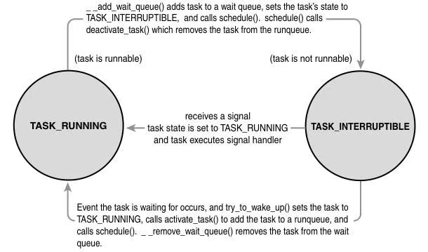

[toc]

## 4 Process Scheduling

The process scheduler decides which process runs, when, and for howlong.The process scheduler (or simply the scheduler, to which it is often shortened)divides the finite resource of processor time between the runnable processeson a system.The scheduler is the basis of a multitasking operating systemsuch as Linux. By deciding which process runs next, the scheduler isresponsible for best utilizing the system and giving users the impression thatmultiple processes are executing simultaneously.

进程调度器负责决定**哪个进程运行、何时运行以及运行多长时间**。进程调度器（通常简称为**调度器**）会在系统的可运行进程之间，分配有限的处理器时间资源。调度器是 Linux 这类**多任务操作系统**的核心基础。通过决策下一个待运行的进程，调度器能够最大限度地利用系统资源，并且让用户产生**多个进程在同时执行**的错觉。

The idea behind the scheduler is simple.To best utilize processor time,assuming there are runnable processes, a process should always be running.If there are more runnable processes than processors in a system, someprocesses will not be running at a given moment.These processes arewaiting to run. Deciding which process runs next, given a set of runnableprocesses, is the fundamental decision that the scheduler must make.

进程调度器的设计理念十分简单：在存在可运行进程的前提下，应当保证**始终有进程处于运行状态**。如果系统中可运行进程的数量多于处理器的数量，那么在某个时刻，部分进程会无法获得运行机会，进入**等待运行**的状态。在给定一组可运行进程的情况下，决定下一个运行的进程，是进程调度器必须做出的核心决策。

### Multitasking

A multitasking operating system is one that can simultaneouslyinterleave execution of more than one process. On single processormachines, this gives the illusion of multiple processes running concurrently.On multiprocessor machines, such functionality enables processes toactually run concurrently, in parallel, on different processors. On either typeof machine, it also enables many processes to block or sleep, not actuallyexecuting until work is available.These processes, although in memory, are          not runnable. Instead, such processes utilize the kernel to wait until someevent (keyboard input, network data, pas-sage of time, and so on) occurs.Consequently, a modern Linux system can have many processes in memorybut, say, only one in a runnable state.

多任务操作系统指的是能够**同时交错执行多个进程**的操作系统。在单处理器设备中，这种机制会营造出**多个进程并发运行**的错觉；在多处理器设备中，该功能则能让进程真正在不同处理器上并行执行。无论在哪种设备上，多任务机制还支持大量进程进入阻塞或睡眠状态 —— 这些进程不会实际执行，而是等待任务就绪后再运行。这类进程虽然驻留在内存中，但**并非处于可运行状态**，而是通过内核等待特定事件的触发（例如键盘输入、网络数据到达、定时时间结束等）。因此，一个现代 Linux 系统的内存中可能存在大量进程，但某一时刻可能只有一个进程处于可运行状态。

Multitasking operating systems come in two flavors: cooperative multitasking and preemptive multitasking. Linux, like all Unix variants and most modernoperating systems, implements preemptive multitasking. In preemptivemultitasking, the scheduler decides when a process is to cease running anda new process is to begin running.The act of involuntarily suspending a running process is called **preemption**. The time aprocess runs before it is preempted is usually predetermined, and it is called the **timeslice** of the process. The timeslice, in effect, gives each runnableprocess a slice of the processor’s time. Manag-ing the timeslice enables thescheduler to make global scheduling decisions for the sys-tem. It alsoprevents any one process from monopolizing the processor. On manymodern operating systems, the timeslice is dynamically calculated as afunction of process behavior and configurable system policy.As we shall see,Linux’s unique “fair” scheduler does not employ timeslices per se, tointeresting effect.

多任务操作系统分为两种类型：**协作式多任务**与**抢占式多任务**。Linux 与所有 Unix 衍生系统及大多数现代操作系统一样，采用的是抢占式多任务机制。在抢占式多任务模式下，由调度器决定进程何时停止运行、新进程何时开始运行。这种**强制暂停正在运行的进程**的操作被称为**抢占**。进程在被抢占前的持续运行时间通常是预先设定好的，这段时间被称为进程的**时间片**。实际上，时间片就是为每个可运行进程分配的一段处理器时间。通过管理时间片，调度器能够对系统全局的调度策略做出决策，同时也能避免单个进程独占处理器资源。在许多现代操作系统中，时间片的长度会根据进程的行为特征和可配置的系统策略动态计算。我们后续会讲到，Linux 独特的 “公平调度器” 并没有严格采用传统意义上的时间片机制，这一设计带来了十分有趣的调度效果。

Conversely, in cooperative multitasking, a process does not stop runninguntil it voluntary decides to do so.The act of a process voluntarilysuspending itself is called yielding. Ideally, processes yield often, giving eachrunnable process a decent chunk of the processor, but the operating system            cannot enforce this.The shortcomings of this approach are manifest: Thescheduler cannot make global decisions regarding how long processes run;processes can monopolize the processor for longer than the user desires;and a hung process that never yields can potentially bring down the entiresystem.Thankfully, most operating sys-tems designed in the last twodecades employ preemptive multitasking, with Mac OS 9 (and earlier) andWindows 3.1 (and earlier) being the most notable (and embarrassing)exceptions. Of course, Unix has sported preemptive multitasking since itsinception.

与之相对，在协作式多任务模式下，进程**只有在主动选择暂停时才会停止运行**。进程主动暂停自身的操作被称为**主动让出**。理想情况下，进程会频繁主动让出处理器资源，确保每个可运行进程都能获得足够的处理器时间，但操作系统无法强制进程这么做。这种模式的缺陷十分明显：调度器无法对进程的运行时长做出全局决策；进程可能会超出用户预期的时长占用处理器；而一个陷入死循环、从不主动让出资源的进程，甚至可能导致整个系统崩溃。幸好，过去二十年间设计的大多数操作系统都采用了抢占式多任务机制，只有 Mac OS 9（及更早版本）和 Windows 3.1（及更早版本）是最典型（也最受诟病）的例外。当然，Unix 从诞生之初就已经支持抢占式多任务机制。

### Policy

Policy is the behavior of the scheduler that determines what runswhen.A scheduler’s policy often determines the overall feel of a system andis responsible for optimally utiliz-ing processor time.Therefore, it is veryimportant.

**调度策略**指的是调度器决定 “何时运行哪个进程” 的行为准则。调度器的策略往往决定了系统的整体运行体验，同时承担着优化处理器时间利用率的职责，因此它的设计至关重要。

#### I/O-Bound Versus Processor-Bound Processes

Processes can be classifiedas either **I/O-bound or processor-bound**.The former is character-ized as aprocess that spends much of its time submitting and waiting on I/Orequests. Consequently, such a process is runnable for only short durations,because it eventually blocks waiting on more I/O. (Here, by I/O, we meanany type of blockable resource, such as keyboard input or network I/O, andnot just disk I/O.) Most graphical user inter-face (GUI) applications, forexample, are I/O-bound, even if they never read from or write to the disk,because they spend most of their time waiting on user interaction via thekeyboard and mouse.

进程可分为两类：**I/O 密集型进程**与**CPU 密集型进程**。 前者的特点是，会将大量时间用于提交 I/O 请求和等待 I/O 响应。因此这类进程的可运行状态持续时间很短，最终总会因等待更多 I/O 操作而进入阻塞状态。（此处的 I/O 指代所有可触发阻塞的资源，包括键盘输入、网络 I/O 等，而非单指磁盘 I/O）。例如，大多数图形用户界面（GUI）应用都属于 I/O 密集型进程 —— 即便它们从不进行磁盘读写，也会将大部分时间用于等待用户通过键盘和鼠标发起的交互操作。

Conversely, processor-bound processes spend much of their time executingcode.They tend to run until they are preempted because they do not blockon I/O requests very often. Because they are not I/O-driven, however,system response does not dictate that the scheduler run them often.Ascheduler policy for processor-bound processes, there-fore, tends to runsuch processes less frequently but for longer durations.The ultimate exampleof a processor-bound process is one executing an infinite loop. Morepalatable examples include programs that perform a lot of mathematicalcalculations, such as ssh-keygen or MATLAB.

与之相反，**CPU 密集型进程**会把大量时间消耗在代码执行上。这类进程通常会一直运行直到被抢占，因为它们很少会因 I/O 请求而阻塞。不过由于这类进程的运行不依赖 I/O 驱动，系统响应性并不要求调度器频繁调度它们执行。因此针对 CPU 密集型进程的调度策略，往往是降低调度频率、延长单次运行时长。CPU 密集型进程的极端案例是执行无限循环的程序；更常见的例子则是需要执行大量数学运算的程序，比如`ssh-keygen`或 MATLAB。

Of course, these classifications are not mutually exclusive. Processes canexhibit both behaviors simultaneously:The X Window server, for example, is both processor and I/O-intense. Other processes can be I/O-bound but dive into periods of intense processor action.A good example of this is a word processor, which normally sits waiting for key presses but at any moment might peg the processor in a rabid fit of spell checking or macro calculation.

当然，这两种分类并非互斥，一个进程可能同时表现出两种特性。例如，X Window 服务器既是 CPU 密集型、也是 I/O 密集型进程。还有些进程平时属于 I/O 密集型，但会间歇性进入 CPU 高负荷状态 —— 文字处理软件就是典型例子：它通常处于等待用户按键的状态，但随时可能因执行拼写检查或宏运算而占用大量处理器资源。

The scheduling policy in a system must attempt to satisfy two conflicting goals: fast process response time (low latency) and maximal system utilization (high throughput).To satisfy these at-odds requirements, schedulers often employ complexalgorithms to deter-mine the most worthwhile process to run while notcompromising fairness to other, lower priority, processes.The schedulerpolicy in Unix systems tends to explicitly favor I/O-bound processes, thusproviding good process response time. Linux, aiming to pro-vide goodinteractive response and desktop performance, optimizes for processresponse (low latency), thus favoring I/O-bound processes over processor-bound processors.As we will see, this is done in a creative manner that doesnot neglect processor-bound processes.

系统的调度策略需要努力平衡两个相互冲突的目标：**快速的进程响应时间（低延迟）**与**最大化的系统资源利用率（高吞吐量）**。为了协调这两个矛盾的需求，调度器通常会采用复杂算法，在确保对低优先级进程公平性的前提下，筛选出 “最值得运行” 的进程。Unix 系统的调度策略通常会**明确优先调度 I/O 密集型进程**，以此保障良好的进程响应时间。Linux 系统则以提供流畅的交互响应和桌面性能为目标，针对**低延迟的进程响应速度做了优化**，因此也会优先调度 I/O 密集型进程，而非 CPU 密集型进程。后续我们会看到，Linux 采用了一种极具创新性的实现方式，在优先保障 I/O 密集型进程的同时，也不会忽视 CPU 密集型进程的运行需求。

#### Process Priority

PriorityA common type of scheduling algorithm is priority-basedscheduling.The goal is to rank processes based on their worth and need forprocessor time.The general idea, which isn’t exactly implemented on Linux,is that processes with a higher priority run before those with a lower priority,whereas processes with the same priority are scheduled round-robin (oneafter the next, repeating). On some systems, processes with a higher priority also receive a longer timeslice.The runnable process with timeslice remainingand the highest priority always runs. Both the user and the system can set aprocess’s priority to influence the scheduling behavior of the system.

基于优先级的调度是一种常用的调度算法，其设计目标是根据进程的重要程度和对处理器时间的需求，为进程划分优先级等级。理想情况下，高优先级进程会优先于低优先级进程运行；而优先级相同的进程，则会采用**轮转调度**的方式依次执行（即按顺序循环调度，周而复始）。在部分系统中，高优先级进程还会被分配更长的时间片。在任意时刻，**拥有剩余时间片且优先级最高的可运行进程**会始终获得处理器的执行权。用户和系统都可以通过设置进程优先级，来影响系统的调度行为。

The Linux kernel implements two separate priority ranges.The first is the nice value, a number from –20 to +19 with a default of 0. Larger nice valuescorrespond to a lower priority—you are being “nice” to the other processeson the system. Processes with a lower nice value (higher priority) receive alarger proportion of the system’s processor compared to processes with ahigher nice value (lower priority). Nice values are the stan-dard priority rangeused in all Unix systems, although different Unix systems apply them indifferent ways, reflective of their individual scheduling algorithms. In otherUnix-based systems, such as Mac OS X, the nice value is a control over theabsolute timeslice allotted to a process; in Linux, it is a control over theproportion of timeslice.You can see a list of the processes on your system and their respective nice values (under the column marked NI) with the command ps -el.

Linux 内核实现了两套独立的优先级范围：1 **nice 值**. 取值范围为 **-20 到 +19**，默认值为 0。nice 值的大小与进程优先级成反比 ——nice 值越大，进程优先级越低；nice 值越小，进程优先级越高。nice 值的命名寓意在于：数值越大代表进程 “对其他进程越友好”，愿意主动让出更多处理器资源。优先级更高（nice 值更小）的进程，会比优先级更低（nice 值更大）的进程获得更多的系统处理器时间占比。nice 值是所有 Unix 系统通用的标准优先级范围，但不同 Unix 系统对其的具体应用方式有所不同，这也体现了各自调度算法的差异。例如在 Mac OS X 等 Unix 衍生系统中，nice 值用于控制分配给进程的**绝对时间片长度**；而在 Linux 中，nice 值则用于控制进程获得的**时间片比例**。

你可以通过执行以下命令，查看系统中所有进程及其对应的 nice 值（对应输出结果的`NI`列）：

```sh
ps -el
```

The second range is the real-time priority.The values are configurable, butby default range from 0 to 99, inclusive. Opposite from nice values, higher real-timepriority values correspond to a greater priority.All real-time processes are ata higher priority than nor-mal processes; that is, the real-time priority andnice value are in disjoint value spaces. Linux implements real-time prioritiesin accordance with the relevant Unix standards, specifically POSIX.1b.Allmodern Unix systems implement a similar scheme.You can see a list of theprocesses on your system and their respective real-time priority (under the  column marked RTPRIO) with the command

**实时优先级** 取值范围可配置，默认区间为 **0 到 99**。与 nice 值相反，实时优先级的数值与进程优先级成正比 —— 数值越大，进程优先级越高。所有实时进程的优先级都高于普通进程，也就是说，实时优先级和 nice 值处于**互不重叠的取值区间**。Linux 对实时优先级的实现，遵循了相关的 Unix 标准，尤其是**POSIX.1b**标准，这也是大多数现代 Unix 系统采用的相似方案。你可以通过执行以下命令，查看系统中进程的实时优先级（对应输出结果的`RTPRIO`列）：

```sh
ps -eo state,uid,pid,ppid,rtprio,time,comm
```

A value of “-” means the process is not real-time.

若输出结果中该列的值为`-`，则表示对应进程并非实时进程。

#### Timeslice

The timeslice2 is the numeric value that represents how long atask can run until it is pre-empted.The scheduler policy must dictate adefault timeslice, which is not a trivial exer-cise.Too long a timeslice causesthe system to have poor interactive performance; the system will no longerfeel as if applications are concurrently executed.Too short a times-licecauses significant amounts of processor time to be wasted on the overheadof switch-ing processes because a significant percentage of the system’stime is spent switching from one process with a short timeslice to the next.Furthermore, the conflicting goals of I/O-bound versus processor-boundprocesses again arise: I/O-bound processes do not need longer timeslices(although they do like to run often), whereas processor-bound processescrave long timeslices (to keep their caches hot).

**时间片** 是一个数值，用于表示一个任务能够持续运行多久后会被抢占。调度器策略必须明确一个默认的时间片长度，但这绝非一项简单的工作。时间片过长会导致系统的交互性能变差，用户将不再能感受到程序是在并发执行；时间片过短则会因进程切换的开销，浪费大量处理器时间 —— 此时系统的很大一部分时间都会消耗在 “从一个短时间片进程切换到下一个短时间片进程” 的操作上。此外，I/O 密集型进程与 CPU 密集型进程的需求矛盾再次凸显：I/O 密集型进程并不需要长时时间片（但它们希望被频繁调度），而 CPU 密集型进程则迫切需要长时时间片（以此维持缓存的热状态）。

With this argument, it would seem that any long timeslice would result inpoor inter-active performance. In many operating systems, this observationis taken to heart, and the default timeslice is rather low—for example, 10milliseconds. Linux’s CFS scheduler, however, does not directly assigntimeslices to processes. Instead, in a novel approach, CFS assigns processes a proportion of the processor. On Linux, therefore, the amount of proces-sortime that a process receives is a function of the load of the system.Thisassigned pro-portion is further affected by each process’s nice value.Thenice value acts as a weight, changing the proportion of the processor timeeach process receives. Processes with higher nice values (a lower priority)receive a deflationary weight, yielding them a smaller proportion of theprocessor; processes with smaller nice values (a higher priority) receive aninflationary weight, netting them a larger proportion of the processor.

从这个角度来看，似乎任何长时时间片都会导致糟糕的交互性能。许多操作系统也正是基于这一点，将默认时间片设置得相当短，例如 10 毫秒。但 Linux 的**完全公平调度器（Completely Fair Scheduler，CFS）** 却并未采用直接为进程分配时间片的设计。它采用了一种创新方案：不为进程分配固定时间片，而是为进程分配**处理器的使用比例**。因此在 Linux 系统中，一个进程能获得的处理器时间，是由系统负载情况决定的。这种分配的比例还会进一步受到每个进程 nice 值的影响：nice 值在这里扮演了权重的角色，直接改变进程能获取的处理器时间占比。nice 值越大（优先级越低）的进程，会被赋予**权重衰减**的效果，最终获得的处理器时间占比更小；nice 值越小（优先级越高）的进程，则会得到**权重提升**的效果，从而获得更大的处理器时间占比。

As mentioned, the Linux operating system is preemptive.When a processenters the runnable state, it becomes eligible to run. In most operating systems,whether the process runs immediately, preempting the currently runningprocess, is a function of the process’s priority and available timeslice. InLinux, under the new CFS scheduler, the decision is a function of how muchof a proportion of the processor the newly runnable processor hasconsumed. If it has consumed a smaller proportion of the processor than thecurrently executing process, it runs immediately, preempting the currentprocess. If not, it is sched-uled to run at a later time.

前文提到，Linux 是一个支持抢占的操作系统。当一个进程进入可运行状态时，它就具备了被调度执行的资格。在大多数操作系统中，该进程能否立即抢占当前运行的进程，取决于自身的优先级和剩余时间片。但在 Linux 的 CFS 调度器机制下，这个决策的依据变为：**新可运行进程已消耗的处理器时间占比**。如果它的消耗占比低于当前正在执行的进程，就会立即抢占当前进程并开始运行；反之，则会被调度到后续时间再执行。

### The Linux Scheduling Algorithm

In the previous sections, we discussed process scheduling in the abstract, with only occa-sional mention of how Linux applies a given concept to reality.With the foundation of scheduling now built, we can dive into Linux’s process scheduler.

在前面的章节中，我们从抽象层面讨论了进程调度的相关内容，仅偶尔提及 Linux 是如何将这些理论概念落地实现的。现在我们已经搭建好调度机制的理论基础，接下来可以深入剖析 Linux 的进程调度器了。

#### Scheduler Classes

The Linux scheduler is **modular**, enabling different algorithms to schedule different types of processes.This modularity is called **scheduler classes**. Scheduler classes enable different, pluggable algorithms to coexist, scheduling their own types of processes. Each scheduler class has a priority.The base scheduler code, which is defined inkernel/sched.c, iterates over each scheduler class in order of priority.Thehighest priority scheduler class that has a runnable process wins, selectingwho runs next.

Linux 调度器采用**模块化设计**，支持不同的算法调度不同类型的进程，这种模块化架构被称为**调度器类**。调度器类允许多种可插拔的调度算法共存，各自负责调度特定类型的进程。每个调度器类都有对应的优先级，定义在 `kernel/sched.c` 中的基础调度器代码，会按照优先级从高到低的顺序遍历所有调度器类，拥有可运行进程的最高优先级调度器类将胜出，由它决定下一个运行的进程。

The Completely Fair Scheduler (CFS) is the registered scheduler class for normal processes, called SCHED_NORMAL in Linux (and SCHED_OTHER in POSIX).CFS is defined in kernel/sched_fair.c.The rest of this section discusses theCFS algorithm and is ger-mane to any Linux kernel since 2.6.23.We discussthe scheduler class for real-time processes in a later section.

**完全公平调度器（Completely Fair Scheduler，CFS）** 是负责调度普通进程的注册调度器类，在 Linux 中这类进程对应的调度策略为 `SCHED_NORMAL`（在 POSIX 标准中称为 `SCHED_OTHER`）。CFS 的实现代码位于 `kernel/sched_fair.c` 文件中。本节后续内容将围绕 CFS 算法展开，这些内容适用于 **2.6.23 及以上版本的所有 Linux 内核**。我们会在后续章节中讨论用于调度实时进程的调度器类。

**Process Scheduling in Unix Systems**

To discuss fair scheduling, we mustfirst describe how traditional Unix systems schedule processes.As mentionedin the previous section, modern process schedulers have two commonconcepts: process priority and timeslice.Timeslice is how long a processruns; processes start with some default timeslice. Processes with a higherpriority run more fre-quently and (on many systems) receive a highertimeslice. On Unix, the priority is exported to user-space in the form of nicevalues.

要讲解公平调度机制，我们首先需要描述传统 Unix 系统的进程调度方式。正如上一节所述，现代进程调度器普遍包含两个核心概念：**进程优先级**与**时间片**。时间片决定了一个进程的单次持续运行时长，进程启动时会被分配一个默认时间片。优先级更高的进程会被更频繁地调度，并且在许多系统中还会被分配更长的时间片。在 Unix 系统中，进程优先级通过 `nice` 值的形式暴露给用户空间。

This sounds simple, but in practice it leads to several pathologicalproblems, which we now discuss.

这套机制听起来简单易懂，但在实际应用中却会引发诸多问题，接下来我们逐一分析：

First, mapping nice values onto timeslices requires a decision about what absolute timeslice to allot each nice value.This leads to suboptimal switchingbehavior. For exam-ple, let’s assume we assign processes of the defaultnice value (zero) a timeslice of 100 mil-liseconds and processes at thehighest nice value (+20, the lowest priority) a timeslice of 5 milliseconds.Further, let’s assume one of each of these processes is runnable. Ourdefault-priority process thus receives 20⁄21 (100 out of 105 milliseconds) ofthe processor, whereas our low priority process receives 1/21 (5 out of 105milliseconds) of the processor.We could have used any numbers for thisexample, but we assume this allotment is optimal since we chose it. Now,what happens if we run exactly two low priority processes? We’d expectthey each receive 50% of the processor, which they do. But they each enjoythe processor for only 5 milliseconds at a time (5 out of 10 millisecondseach)! That is, instead of context switching twice every 105 milliseconds, wenow context switch twice every 10 milliseconds. Conversely, if we have twonormal priority processes, each again receives the correct 50% of theprocessor, but in 100 millisecond increments. Neither of these timesliceallotments are necessarily ideal; each is simply a byproduct of a given nicevalue to timeslice mapping coupled with a specific runnable process prioritymix. Indeed, given that high nice value (low priority) processes tend to bebackground, processor-intensive tasks, while normal priority processes tendto be foreground user tasks, this timeslice allotment is exactly backwardfrom ideal!

**1 将 nice 值映射为时间片的固有缺陷**

要把 `nice` 值转化为具体的时间片长度，就必须为每个 `nice` 值设定对应的绝对时间片，这种设计会导致进程切换行为陷入非最优状态。

举个例子：假设我们为默认 `nice` 值（0）的进程分配 100 毫秒的时间片，为最高 `nice` 值（+20，对应最低优先级）的进程分配 5 毫秒的时间片。此时系统中恰好各有一个这两类优先级的可运行进程。

那么默认优先级进程将占用 2120（即 100 毫秒占总时间 105 毫秒的比例）的处理器时间，而低优先级进程仅占用 211（5 毫秒占 105 毫秒的比例）的处理器时间。这个分配比例在当前场景下可以视为是最优的。

但如果系统中恰好有两个低优先级进程呢？我们预期它们会各占 50% 的处理器时间，实际也确实如此，但问题在于它们每次只能运行 5 毫秒（两个进程合计占用 10 毫秒）。这意味着进程上下文切换的频率从原来的每 105 毫秒 2 次，骤增为每 10 毫秒 2 次。

反过来，如果系统中有两个默认优先级进程，它们同样会各占 50% 的处理器时间，但每次运行时长可达 100 毫秒。

这两种时间片分配方式都算不上理想，它们只是 `nice` 值与时间片的映射规则，结合特定可运行进程优先级组合后产生的必然结果。更关键的是，高 `nice` 值（低优先级）进程通常是后台 CPU 密集型任务，而默认优先级进程往往是前台用户交互任务，这种时间片分配方式与理想的调度需求完全背道而驰。

A second problem concerns relative nice values and again the nice value totimeslice mapping. Say we have two processes, each a single nice value apart. First,  let’s assume they are at nice values 0 and 1.This might map (and indeed did in the O(1) scheduler) to timeslices of 100 and 95 milliseconds,respectively.These two values are nearly identical, and thus the difference here between a single nice value is small. Now, instead, let’s assume our two processes are at nice values of 18 and 19.This now maps to timeslices of 10 and 5 milliseconds, respectively—the former receiving twice the processortime as the latter! Because nice values are most commonly used in relativeterms (as the system call accepts an increment, not an absolute value), thisbehavior means that “nicing down a process by one” has wildly differenteffects depending on the starting nice value.

**2 相对 nice 值的非线性映射问题**

这个问题同样源于 `nice` 值到时间片的映射机制。假设存在两个进程，它们的 `nice` 值仅相差 1。

第一种情况：两个进程的 `nice` 值分别为 0 和 1。在 O (1) 调度器时代，它们对应的时间片可能分别是 100 毫秒和 95 毫秒，二者几乎没有差距，这意味着 `nice` 值相差 1 带来的优先级差异微乎其微。

第二种情况：两个进程的 `nice` 值分别为 18 和 19，对应的时间片可能分别是 10 毫秒和 5 毫秒 —— 前者获得的处理器时间是后者的两倍！

由于 `nice` 值的调整在实际使用中大多是**相对操作**（系统调用支持的是增量调整，而非直接设置绝对值），这就导致了一个问题：**将进程的 nice 值调低 1 个单位**这个操作，最终产生的效果会因进程的初始 `nice` 值不同而天差地别。

Third, if performing a nice value to timeslice mapping, we need the ability to assign an absolute timeslice.This absolute value must be measured in terms thekernel can meas-ure. In most operating systems, this means the timeslicemust be some integer multiple of the timer tick. (See Chapter 11,“Timers andTime Management,” for a discussion on time.) This introduces severalproblems. First, the minimum timeslice has a floor of the period of the timertick, which might be as high as 10 milliseconds or as low as 1 mil-lisecond.Second, the system timer limits the difference between two timeslices;successive nice values might map to timeslices as much as 10 milliseconds or as little as 1 millisec-ond apart. Finally, timeslices change with differenttimer ticks. (If this paragraph’s discus-sion of timer ticks is foreign, reread itafter reading Chapter 11.This is only one motivation behind CFS.)

**3 时间片与时钟滴答的强耦合问题**

若要实现 `nice` 值到时间片的映射，就必须使用内核可度量的单位来定义绝对时间片长度。在大多数操作系统中，这意味着时间片必须是**时钟滴答（timer tick）** 的整数倍（时钟滴答的相关内容详见第 11 章《定时器与时间管理》）。这种耦合关系会引发一系列问题：

- 时间片的最小值受限于时钟滴答周期，该周期可能高达 10 毫秒，也可能低至 1 毫秒；

- 相邻 `nice` 值对应的时间片差异，同样受时钟滴答周期的限制，差距可能是 10 毫秒，也可能仅为 1 毫秒；

- 时钟滴答周期的变化会直接导致时间片长度发生改变。

  > 注：如果对本节关于时钟滴答的内容感到陌生，可以先阅读第 11 章后再回头理解。这一点正是促使 CFS 调度器诞生的动因之一。

The fourth and final problem concerns handling process wake up in apriority-based might want to give freshly woken-up tasks a priority boost by allowing themto run immediately, even if their timeslice was expired.Although this improvesinteractive performance in many, if not most, situations, it also opens thedoor to pathological cases where certain sleep/wake up use cases can game the scheduler into providing one process an unfair amount of processortime, at the expense of the rest of the system.

**4 基于优先级的进程唤醒机制缺陷**

最后一个问题出在进程唤醒的处理逻辑上。在基于优先级的调度器中，通常会给刚被唤醒的进程提供**优先级提升**的优待 —— 即便它的时间片已经耗尽，也允许其立即运行。

这种机制在多数场景下能提升交互性能，但也存在漏洞：某些进程可以通过反复执行 “睡眠 - 唤醒” 的操作，操纵调度器为自己分配远超公平比例的处理器时间，进而损害系统中其他进程的运行效率。

Most of these problems are solvable by making substantial but notparadigm-shifting changes to the old-school Unix scheduler. For example, making nice valuesgeometric instead of additive solves the second problem.And mapping nicevalues to timeslices using a measurement decoupled from the timer ticksolves the third problem. But such solu-tions belie the true problem, which isthat assigning absolute timeslices yields a constant switching rate butvariable fairness.The approach taken by CFS is a radical (for processschedulers) rethinking of timeslice allotment: Do away with timeslicescompletely and assign each process a proportion of the processor. CFS thusyields constant fairness but a variable switching rate.

上述这些问题，大部分都可以通过对传统 Unix 调度器进行大幅修改（而非颠覆式重构）来解决。例如，将 `nice` 值的映射关系从线性改为几何关系，就能解决第二个问题；采用与时钟滴答解耦的度量单位来实现 `nice` 值到时间片的映射，就能解决第三个问题。但这些修修补补的方案，并没有触及问题的本质 ——**分配绝对时间片的调度方式，能保证固定的进程切换频率，却无法保障调度的公平性**。

CFS 调度器采取了一种在进程调度领域堪称激进的新思路：**彻底摒弃时间片机制，转而给每个进程分配处理器的使用比例**。这样一来，CFS 能够保障调度的公平性恒定不变，而进程切换频率则可以根据系统负载动态调整。

#### Fair Scheduling

CFS is based on a simple concept: Model processs cheduling as if the system had an ideal, perfectly multitasking processor. In such a system, each process would receive 1/n of the processor’s time,where n is the number of runnable processes, and we’d schedule them forinfinitely small durations, so that in any measurable period we’d have run alln processes for the same amount of time.As an example, assume we havetwo processes. In the stan-dard Unix model, we might run one process for 5milliseconds and then another process for 5 milliseconds.While running, eachprocess would receive 100% of the processor. In an ideal, perfectlymultitasking processor, we would run both processes simultaneously for 10milliseconds, each at 50% power.This latter model is called perfectmultitasking.

完全公平调度器（CFS）的设计基于一个简单的理念：**将系统的处理器模拟为一台理想的完美多任务处理器**。在这种理想模型中，若系统中有 `n` 个可运行进程，每个进程都能获得 1/n 的处理器时间占比；同时，调度器会以无限短的时长为单位轮转调度这些进程，这样一来，在任意可测量的时间周期内，所有 `n` 个进程的实际运行时间都完全相同。举个例子，假设系统中有两个进程。在标准 Unix 调度模型中，调度器可能会让一个进程运行 5 毫秒，再切换到另一个进程运行 5 毫秒。在各自的运行时段内，进程会独占 100% 的处理器资源。而在理想的完美多任务处理器模型中，两个进程可以**同时运行 10 毫秒**，且每个进程都能获得 50% 的处理器算力。这种调度模式被称为**完美多任务**。

Of course, such a model is also impractical, because it is not possible on asingle processor to literally run multiple processes simultaneously. Moreover, it isnot efficient to run processes for infinitely small durations.That is, there is aswitching cost to preempting one process for another: the overhead ofswapping one process for another and the effects on caches, forexample.Thus, although we’d like to run processes for very small durations,CFS is mindful of the overhead and performance hit in doing so. Instead,CFS will run each process for some amount of time, round-robin, selecting next the process that has run the least. Rather than assign each process atimeslice, CFS calculates how long a process should run as a function of thetotal number of runnable processes. Instead of using the nice value tocalculate a timeslice, CFS uses the nice value to weight the proportion ofprocessor a process is to receive: Higher valued (lower priority) processes            receive a fractional weight relative to the default nice value, whereas lowervalued (higher priority) processes receive a larger weight.

显然，这种理想模型在现实中并不具备可行性 —— 在单处理器硬件上，根本不可能真正意义上同时运行多个进程。此外，以无限短的时长调度进程也缺乏效率。原因在于，抢占一个进程去执行另一个进程存在**切换开销**：例如，进程切换产生的额外开销，以及对缓存造成的影响。

因此，尽管我们期望以极短的时长调度进程，CFS 仍会充分考虑这种调度方式带来的开销与性能损耗。作为替代方案，CFS 会以轮转方式让每个进程运行一段时长，且每次都会选择**累计运行时间最短**的进程作为下一个调度对象。CFS 不会为每个进程分配固定的时间片，而是根据系统中可运行进程的总数，来计算每个进程应运行的时长。同时，CFS 不会利用 nice 值去计算时间片长度，而是通过 nice 值来调整进程可获取的处理器时间占比权重：nice 值越高（优先级越低）的进程，相较于默认 nice 值，获得的占比权重会更低；而 nice 值越低（优先级越高）的进程，获得的占比权重则会更高。

Each process then runs for a “timeslice” proportional to its weight dividedby the total weight of all runnable threads.To calculate the actual timeslice,CFS sets a target for its approximation of the “infinitely small” schedulingduration in perfect multitasking.This target is called the **targeted latency**. Smaller targets yield better interactivity and a closer approximation toperfect multitasking, at the expense of higher switching costs and thusworse overall throughput. Let’s assume the targeted latency is 20milliseconds and we have two runnable tasks at the same priority.Regardless of those task’s priority, each will run for 10 milliseconds before      preempting in favor of the other. If we have four tasks at the same priority,each will run for 5 milliseconds. If there are 20 tasks, each will run for 1millisecond.

如此一来，每个进程的运行 “时间片” 时长，与其权重占所有可运行线程总权重的比例成正比。

为了计算出实际的时间片长度，CFS 会为自身设定一个目标值，以此来近似模拟完美多任务调度模型中 “无限短” 的调度时长。这个目标值被称为**目标延迟**。目标延迟越小，系统的交互性能就越好，也越接近完美多任务的调度效果，但其代价是更高的进程切换开销，进而导致整体吞吐量下降。

举个例子，假设目标延迟为 20 毫秒，且系统中有两个优先级相同的可运行任务。无论这些任务的优先级具体是多少，每个任务都会运行 10 毫秒，之后便会被抢占，切换至另一个任务执行。若系统中有四个优先级相同的任务，则每个任务的运行时长为 5 毫秒；若有 20 个任务，则每个任务仅运行 1 毫秒。

Note as the number of runnable tasks approaches infinity, the proportion ofallotted processor and the assigned timeslice approaches zero.As this will eventuallyresult in unacceptable switching costs, CFS imposes a floor on the timesliceassigned to each process.This floor is called the **minimum granularity**. Bydefault it is 1 millisecond.Thus, even as the number of runnable processesapproaches infinity, each will run for at least 1 millisecond, to ensure there isa ceiling on the incurred switching costs. (Astute readers will note that CFSis thus not perfectly fair when the number of processes grows so large that the calculated proportion is floored by the minimum granularity.This is true.Although modifications to fair queuing exist to improve upon this fairness,CFS was explicitly designed to make this trade-off. In the common case ofonly a handful of runnable processes, CFS is perfectly fair.)

需要注意的是，当可运行任务的数量趋近于无穷大时，每个进程分得的处理器时间占比，以及被分配到的时间片时长，都会趋近于零。而这最终会引发难以接受的切换开销，因此 CFS 为进程的时间片设置了一个下限，这个下限被称为**最小粒度**。其默认值为 1 毫秒。

由此，即便可运行进程的数量趋近于无穷多，每个进程每次至少也能运行 1 毫秒，以此限制由此产生的切换开销上限。（细心的读者可能会发现，当进程数量多到一定程度，导致计算出的时间片占比被最小粒度限制时，CFS 就无法实现绝对公平了。事实的确如此。尽管存在一些基于公平队列的改进方案可以优化这种公平性，但 CFS 在设计时就明确做出了这种取舍 —— 在常见的 “仅存在少量可运行进程” 的场景下，CFS 能够实现完全公平的调度。）

Put generally, the proportion of processor time that any process receives isdetermined only by the relative difference in niceness between it and theother runnable processes. The nice values, instead of yielding additiveincreases to timeslices, yield geometric differ-ences.The absolute timesliceallotted any nice value is not an absolute number, but a given proportion ofthe processor. CFS is called a fair scheduler because it gives each process afair share—a proportion—of the processor’s time.As mentioned, note thatCFS isn’t perfectly fair, because it only approximates perfect multitasking,but it can place a lower bound on latency of n for n runnable processes onthe unfairness.

总的来说，任意进程获得的处理器时间占比，**仅由该进程与其他可运行进程之间的 nice 值相对差异决定**。nice 值不会使时间片呈现线性增长的变化，而是会带来**几何级的差异**。为任一 nice 值分配的绝对时间片并非固定数值，而是处理器资源的一个特定占比。

CFS 之所以被称为**公平调度器**，是因为它会为每个进程分配公平的处理器时间份额 —— 也就是一个固定的占比。正如前文所述，需要注意的是，CFS 并非绝对公平：它只是对完美多任务调度模型进行近似实现，但对于存在 `n` 个可运行进程的场景，CFS 能够通过这种近似方式，为调度延迟设置下限，从而限制调度机制的不公平性。

### The Linux Scheduling Implementation

 ImplementationWith the discussion of the motivationfor and logic of CFS behind us, we can now explore CFS’s actualimplementation, which lives in kernel/sched_fair.c. Specifically, we discussfour components of CFS:

- Time Accounting
-  Process Selection
- The Scheduler Entry Point
-  Sleeping and Waking Up

在厘清 CFS 的设计动因与核心逻辑之后，我们接下来可以探究它的具体实现方案 ——CFS 的实现代码位于内核文件 `kernel/sched_fair.c` 中。具体而言，我们将围绕 CFS 的四个核心组件展开讨论：

- 时间记账（Time Accounting）
- 进程选择（Process Selection）
- 调度器入口点（The Scheduler Entry Point）
- 睡眠与唤醒（Sleeping and Waking Up）

#### Time Accounting

All process schedulers must account for the time that aprocess runs. Most Unix systems do so, as discussed earlier, by assigningeach process a timeslice. On each tick of the system clock, the timeslice isdecremented by the tick period.When the timeslice reaches zero, the processis preempted in favor of another runnable process with a nonzero timeslice.

所有进程调度器都必须**统计进程的运行时长**。正如前文所述，大多数 Unix 系统会通过为每个进程分配时间片的方式来实现这一点：系统时钟每产生一次滴答中断，进程的剩余时间片就会按时钟周期递减；当时间片耗尽为零时，该进程会被抢占，调度器会转而调度其他**时间片未耗尽**的可运行进程。

**The Scheduler Entity Structure**

CFS does not have the notion of a timeslice,but it must still keep account for the time that each process runs, because itneeds to ensure that each process runs only for its fair share of theprocessor. CFS uses the scheduler entity structure, struct sched_entity,defined in <linux/sched.h>, to keep track of process accounting:

CFS 调度器并没有 “时间片” 的概念，但它同样需要记录每个进程的运行时长 —— 这是保障每个进程都能获得公平的处理器时间份额的前提。CFS 借助**调度实体结构体**（`struct sched_entity`）来实现进程运行时间的统计功能，该结构体定义在头文件 `<linux/sched.h>` 中。

```c
struct sched_entity {
    struct load_weight load;          /* 进程的负载权重（与nice值相关） */
    struct rb_node run_node;          /* 红黑树节点，用于CFS可运行队列 */
    struct list_head group_node;      /* 链表节点，用于调度组 */
    unsigned int on_rq;               /* 标记是否在可运行队列上 */

    u64 exec_start;                   /* 进程本次运行的开始时间 */
    u64 sum_exec_runtime;             /* 进程累计运行时间 */
    u64 vruntime;                     /* 虚拟运行时间（CFS核心，决定调度顺序） */
    u64 prev_sum_exec_runtime;        /* 上一次的累计运行时间 */
    u64 last_wakeup;                  /* 最后一次被唤醒的时间 */
    u64 avg_overlap;                  /* 平均重叠时间（调度统计） */
    u64 nr_migrations;                /* 进程迁移次数 */
    u64 start_runtime;                /* 运行时间起始值 */
    u64 avg_wakeup;                   /* 平均唤醒时间（调度统计） */

    /* many stat variables elided, enabled only if CONFIG_SCHEDSTATS is set */
};
```

The scheduler entity structure is embedded in the process descriptor, struct task_stuct, as a member variable named se.We discussed the processdescriptor in Chapter 3,“Process Management.”

调度实体结构体以名为 `se` 的成员变量形式**嵌入**在进程描述符（`struct task_stuct`）中。我们已在第 3 章《进程管理》中讨论过进程描述符的相关内容。

**The Virtual Runtime**

The vruntime variable stores the virtual runtime of aprocess, which is the actual runtime (the amount of time spent running)normalized (or weighted) by the number of runnable processes.The virtualruntime’s units are nanoseconds and therefore vruntime is decou-pled fromthe timer tick.The virtual runtime is used to help us approximate the “idealmultitasking processor” that CFS is modeling.With such an ideal processor,we wouldn’t need vruntime, because all runnable processes would perfectlymultitask.That is, on an ideal processor, the virtual runtime of all processesof the same priority would be identi-cal—all tasks would have received anequal, fair share of the processor. Because processors are not capable ofperfect multitasking and we must run each process in succession, CFS usesvruntime to account for how long a process has run and thus how muchlonger it ought to run.

`vruntime` 变量用于存储进程的**虚拟运行时间**，它是进程的实际运行时长（即真正占用处理器的时间）经过**可运行进程数量归一化（或加权）** 后得到的数值。虚拟运行时间的单位是纳秒，因此 `vruntime` 与时钟滴答（timer tick）完全解耦。

虚拟运行时间的核心作用，是帮助 CFS 逼近其模拟的 “理想多任务处理器” 模型：在理想处理器中，所有可运行进程能实现完美的多任务并发，因此无需 `vruntime`—— 所有相同优先级进程的虚拟运行时间都会完全一致，即每个任务都能获得均等、公平的处理器时间份额。

但现实中的处理器无法实现完美多任务，必须依次调度每个进程执行，因此 CFS 借助 `vruntime` 统计进程已运行的时长，进而判断该进程还应获得多长的运行时间，以此保障调度公平性。

The function update_curr(), defined in kernel/sched_fair.c, manages this accounting:

定义在 `kernel/sched_fair.c` 文件中的 `update_curr()` 函数负责管理这一运行时间统计工作：

```c
static void update_curr(struct cfs_rq *cfs_rq)
{
    struct sched_entity *curr = cfs_rq->curr;
    u64 now = rq_of(cfs_rq)->clock;
    unsigned long delta_exec;

    if (unlikely(!curr))
        return;

    /*
     * Get the amount of time the current task was running
     * since the last time we changed load (this cannot
     * overflow on 32 bits):
     */
    delta_exec = (unsigned long)(now - curr->exec_start);
    if (!delta_exec)
        return;

    __update_curr(cfs_rq, curr, delta_exec);
    curr->exec_start = now;

    if (entity_is_task(curr)) {
        struct task_struct *curtask = task_of(curr);

        trace_sched_stat_runtime(curtask, delta_exec, curr->vruntime);
        cpuacct_charge(curtask, delta_exec);
        account_group_exec_runtime(curtask, delta_exec);
    }
}

```

update_curr() calculates the execution time of the current process andstores that value in delta_exec. It then passes that runtime to __update_curr(), whichweights the time by the number of runnable processes.The current process’svruntime is then incre-mented by the weighted value:

update_curr () 会计算当前进程的执行时长，并将该值存入 `delta_exec` 变量中。随后，它会把这个运行时长传递给 __update_curr () 函数 —— 该函数会根据**可运行进程的数量**对这一时长进行加权计算，最终将加权后的数值累加到当前进程的 `vruntime`（虚拟运行时间）中：

```c
/*
 * Update the current task’s runtime statistics. Skip current tasks that
 * are not in our scheduling class.
 */
static inline void __update_curr(struct cfs_rq *cfs_rq, struct sched_entity *curr,
                                 unsigned long delta_exec)
{
    unsigned long delta_exec_weighted;

    schedstat_set(curr->exec_max, max((u64)delta_exec, curr->exec_max));
    curr->sum_exec_runtime += delta_exec;
    schedstat_add(cfs_rq, exec_clock, delta_exec);

    delta_exec_weighted = calc_delta_fair(delta_exec, curr);
    curr->vruntime += delta_exec_weighted;

    update_min_vruntime(cfs_rq);
}
```

update_curr() is invoked periodically by the system timer and also whenever process becomes runnable or blocks, becoming unrunnable. In this manner,vruntime is an accurate measure of the runtime of a given process and anindicator of what process should run next.

update_curr () 会由系统定时器**周期性调用**，同时，每当有进程进入可运行状态，或因发生阻塞而变为不可运行状态时，该函数也会被触发执行。通过这种方式，`vruntime` 既能精准度量某个进程的实际运行时长，也成为了调度器决定**下一个应运行哪个进程**的核心依据。

#### Process Selection

In the last section, we discussed how vruntime on an ideal,perfectly multitasking proces-sor would be identical among all runnableprocesses. In reality, we cannot perfectly multi-task, so CFS attempts tobalance a process’s virtual runtime with a simple rule:When CFS is decidingwhat process to run next, it picks the process with the smallestvruntime.This is, in fact, the core of CFS’s scheduling algorithm: **Pick the task with the smallest vruntime**.That’s it! The rest of this subsectiondescribes how the selection of the processwith the smallest vruntime is implemented.

在上一节中，我们提到：在理想的完美多任务处理器中，所有可运行进程的虚拟运行时间（`vruntime`）都是完全相同的。但在现实中，我们无法实现真正的完美多任务调度，因此 CFS 调度器通过一条简单的规则来平衡进程的虚拟运行时间：**当 CFS 决定下一个要运行的进程时，它会选择虚拟运行时间最小的那个进程**。

这正是 CFS 调度算法的核心逻辑：选择虚拟运行时间最小的任务。仅此而已！本节后续内容将介绍，CFS 是如何实现 “选取虚拟运行时间最小的进程” 这一核心操作的。

CFS uses a red-black tree to manage the list of runnable processes andefficiently find the process with the smallest vruntime.A red-black tree, called an rbtree inLinux, is a type of self-balancing binary search tree.We discuss self-balancing binary search trees in general and red-black trees in particular inChapter 6. For now, if you are unfamiliar, you need to know only that red-black trees are a data structure that store nodes of arbitrary data, iden-tified by a specific key, and that they enable efficient search for a given key.(Specifically, obtaining a node identified by a given key is logarithmic in timeas a function of total nodes in the tree.)

CFS 采用**红黑树**（Linux 中称其为 rbtree）来管理可运行进程列表，并通过这种数据结构高效地查找虚拟运行时间最小的进程。红黑树是一种自平衡二叉查找树，关于自平衡二叉查找树的通用原理以及红黑树的具体特性，我们会在第 6 章展开讨论。如果你目前对红黑树不熟悉，只需了解这一点即可：红黑树是一种可以存储任意类型数据节点的数据结构，每个节点都由一个特定的**键值**来标识，借助红黑树可以高效地根据键值查找目标节点（具体来说，在红黑树中查找指定键值节点的时间复杂度，与树中节点总数呈对数关系）。

**Picking the Next Task**

Let’s start with the assumption that we have a red-black tree populated with every runnable process in the system where thekey for each node is the runnable process’s vir-tual runtime.We’ll look athow we build that tree in a moment, but for now let’s assume we have it.Given this tree, the process that CFS wants to run next, which is the processwith the smallest vruntime, is the leftmost node in the tree.That is, if youfollow the tree from the root down through the left child, and continuemoving to the left until you reach a leaf node, you find the process with thesmallest vruntime. (Again, if you are unfamiliar with binary search trees,don’t worry. Just know that this process is efficient.) CFS’s processselection algorithm is thus summed up as “run the process represented bythe leftmost node in the rbtree.”The function that performs this selection is__pick_next_entity(), defined in kernel/sched_fair.c:

我们先做一个前提假设：系统中所有的可运行进程都已被存入一棵红黑树中，树中每个节点的键值就是对应进程的虚拟运行时间。我们稍后会介绍这棵红黑树的构建方式，现在先假设它已经存在。

在这样一棵红黑树中，CFS 要找的 “虚拟运行时间最小的进程”，恰好对应红黑树的**最左节点**。也就是说，从根节点出发，沿着左子节点一路向下遍历，直到抵达叶子节点，最终找到的这个节点，对应的就是虚拟运行时间最小的进程。（再次说明：如果你不熟悉二叉查找树，不必纠结于具体原理，只需知道这种查找方式非常高效即可。）

因此，CFS 的进程选择逻辑可以总结为一句话：**运行红黑树最左节点所代表的进程**。

负责实现这一选择逻辑的函数是 `__pick_next_entity()`，它定义在文件 `kernel/sched_fair.c` 中。

```c
static struct sched_entity *__pick_next_entity(struct cfs_rq *cfs_rq)
{
    struct rb_node *left = cfs_rq->rb_leftmost;

    /* 红黑树无节点（无待调度进程），返回NULL */
    if (!left)
        return NULL;

    /* 从红黑树最左节点（vruntime最小）获取对应的sched_entity */
    return rb_entry(left, struct sched_entity, run_node);
}
```

Note that __pick_next_entity() does not actually traverse the tree to find theleft-most node, because the value is cached by rb_leftmost.Although it isefficient to walk the tree to find the leftmost node—O(height of tree), whichis O(log N) for N nodes if the tree is balanced—it is even easier to cache theleftmost node.The return value from this function is the process that CFSnext runs. If the function returns NULL, there is no leftmost node, and thusno nodes in the tree. In that case, there are no runnable processes, and CFS schedules the idle task.

需要注意的是，函数 `__pick_next_entity()` 并不会实际遍历红黑树去查找最左节点，因为该节点已经由 `rb_leftmost` 变量做了缓存。

尽管遍历红黑树查找最左节点的操作本身已经很高效 —— 时间复杂度为 **O (树的高度)**，对于一棵包含 `N` 个节点的平衡树来说，这个复杂度等价于 **O(log N)**，但直接缓存最左节点显然是更简便的方式。

该函数的返回值就是 CFS 下一个要调度运行的进程。如果函数返回 `NULL`，则说明红黑树中不存在最左节点，即树中没有任何节点。这种情况下，系统中没有可运行的进程，CFS 就会调度**空闲任务**（idle task）运行。

**Adding Processes to the Tree**

Now let’s look at how CFS adds processes tothe rbtree and caches the leftmost node. This would occur when a processbecomes runnable (wakes up) or is first created viafork(), as discussed inChapter 3.Adding processes to the tree is performed byenqueue_entity():

接下来我们看看 CFS 是如何将进程加入红黑树，同时缓存最左节点的。当进程进入可运行状态（被唤醒），或者通过 `fork()` 系统调用被首次创建时（相关内容已在第 3 章讨论），就会触发这一操作。

向红黑树中添加进程的具体操作，由函数 `enqueue_entity()` 完成：

```c
static void enqueue_entity(struct cfs_rq *cfs_rq, struct sched_entity *se, int flags)
{
    /*
     * Update the normalized vruntime before updating min_vruntime
     * through calling update_curr().
     */
    if (!(flags & ENQUEUE_WAKEUP) || (flags & ENQUEUE_MIGRATE))
        se->vruntime += cfs_rq->min_vruntime;

    /* Update run-time statistics of the 'current'. */
    update_curr(cfs_rq);

    account_entity_enqueue(cfs_rq, se);

    if (flags & ENQUEUE_WAKEUP) {
        place_entity(cfs_rq, se, 0);
        enqueue_sleeper(cfs_rq, se);
    }

    update_stats_enqueue(cfs_rq, se);
    check_spread(cfs_rq, se);

    if (se != cfs_rq->curr)
        __enqueue_entity(cfs_rq, se);
}
```

This function updates the runtime and other statistics and then invokes __enqueue_entity() to perform the actual heavy lifting of inserting the entryinto the red-black tree:

该函数会先更新进程的运行时长及其他统计信息，随后调用 `__enqueue_entity()` 函数，由后者来执行**将调度实体插入红黑树的核心操作**。

```c
/*
 * Enqueue an entity into the rb-tree:
 */
static void __enqueue_entity(struct cfs_rq *cfs_rq, struct sched_entity *se)
{
    struct rb_node **link = &cfs_rq->tasks_timeline.rb_node;
    struct rb_node *parent = NULL;
    struct sched_entity *entry;
    s64 key = entity_key(cfs_rq, se);
    int leftmost = 1;

    /* Find the right place in the rbtree: */
    while (*link) {
        parent = *link;
        entry = rb_entry(parent, struct sched_entity, run_node);

        /*
         * We dont care about collisions. Nodes with
         * the same key stay together.
         */
        if (key < entity_key(cfs_rq, entry)) {
            link = &parent->rb_left;
        } else {
            link = &parent->rb_right;
            leftmost = 0;
        }
    }

    /*
     * Maintain a cache of leftmost tree entries (it is frequently
     * used):
     */
    if (leftmost)
        cfs_rq->rb_leftmost = &se->run_node;

    rb_link_node(&se->run_node, parent, link);
    rb_insert_color(&se->run_node, &cfs_rq->tasks_timeline);
}
```

Let’s look at this function.The body of the while() loop traverses the tree insearch of a matching key, which is the inserted process’s vruntime. Per therules of the balanced tree, it moves to the left child if the key is smaller thanthe current node’s key and to the right child if the key is larger. If it evermoves to the right, even once, it knows the inserted process cannot be thenew leftmost node, and it sets leftmost to zero. If it moves only to the left,leftmost remains one, and we have a new leftmost node and can update thecache by setting rb_leftmost to the inserted process.The loop terminateswhen we compare ourselves to a node that has no child in the direction wemove; link is thenNULL and the loop terminates.When out of the loop, thefunction calls rb_link_node()on the parent node, making the inserted processthe new child.The functionrb_insert_color() updates the self-balancingproperties of the tree; we discuss the col-oring in Chapter 6.

我们来分析一下这个函数的逻辑：

while () 循环体会遍历红黑树，寻找待插入进程的插入位置（循环匹配的键值即为待插入进程的虚拟运行时间 `vruntime`）。遵循平衡树的规则：若待插入键值小于当前节点的键值，则向左侧子节点移动；若大于，则向右侧子节点移动。

只要向右侧子节点移动过一次（哪怕只有一次），就说明待插入进程**不可能**成为新的最左节点，此时会将 `leftmost` 置为 0；如果遍历全程只向左侧子节点移动，`leftmost` 会保持为 1—— 这意味着该待插入进程就是新的最左节点，只需将 `rb_leftmost` 赋值为该进程对应的节点，即可完成最左节点的缓存更新。

当遍历到某个节点（该节点在我们要移动的方向上没有子节点）时，循环便会终止（此时 `link` 变量会变为 NULL，循环结束）。退出循环后，函数会调用 `rb_link_node()`，将待插入进程挂载为父节点的新子节点；随后调用 `rb_insert_color()` 函数，更新红黑树的自平衡特性（关于红黑树的颜色规则，我们会在第 6 章详细讨论）。

**Removing Processes from the Tree**

Finally, let’s look at how CFS removesprocesses from the red-black tree.This happens when a process blocks(becomes unrunnable) or terminates (ceases to exist):

最后，我们来看 CFS 如何将进程从红黑树中移除：

当进程进入阻塞状态（变为不可运行）或终止（彻底消亡）时，就会触发这一操作：

```c
static void dequeue_entity(struct cfs_rq *cfs_rq, struct sched_entity *se, int sleep)
{
    /* Update run-time statistics of the 'current'. */
    update_curr(cfs_rq);

    update_stats_dequeue(cfs_rq, se);
    clear_buddies(cfs_rq, se);

    if (se != cfs_rq->curr)
        __dequeue_entity(cfs_rq, se);

    account_entity_dequeue(cfs_rq, se);
    update_min_vruntime(cfs_rq);

    /*
     * Normalize the entity after updating the min_vruntime because the
     * update can refer to the ->curr item and we need to reflect this
     * movement in our normalized position.
     */
    if (!sleep)
        se->vruntime -= cfs_rq->min_vruntime;
}
```

As with adding a process to the red-black tree, the real work is performedby a helper function, __dequeue_entity():

与向红黑树中添加进程的逻辑一致，移除进程的核心操作同样由辅助函数 `__dequeue_entity()` 完成：

```c
static void __dequeue_entity(struct cfs_rq *cfs_rq, struct sched_entity *se)
{
    /* 若待移除的是红黑树最左节点，需更新rb_leftmost缓存 */
    if (cfs_rq->rb_leftmost == &se->run_node) {
        struct rb_node *next_node;

        next_node = rb_next(&se->run_node);
        cfs_rq->rb_leftmost = next_node;
    }

    /* 从红黑树中删除该调度实体的节点 */
    rb_erase(&se->run_node, &cfs_rq->tasks_timeline);
}
```

Removing a process from the tree is much simpler because the rbtreeimplementation provides the rb_erase() function that performs all thework.The rest of this function updates the rb_leftmost cache. If the process-to-remove is the leftmost node, the function invokes rb_next() to find what would be the next node in an in-ordertraversal. This is what will be the leftmost node when the current leftmostnode is removed.

从红黑树中移除进程的逻辑要简单得多 —— 因为红黑树的底层实现已经提供了 `rb_erase()` 函数，该函数会包揽移除节点的所有核心工作。`__dequeue_entity()` 函数剩余的逻辑仅用于更新 `rb_leftmost` 缓存：若待移除的进程恰好是红黑树的最左节点，函数会调用 `rb_next()` 找到该节点在**中序遍历**中的后继节点，而这个后继节点，正是当前最左节点被移除后新的最左节点。

#### The Scheduler Entry Point

The main entry point into the process schedule isthe function schedule(), defined inkernel/sched.c.This is the function thatthe rest of the kernel uses to invoke the process scheduler, deciding whichprocess to run and then running it. schedule() is generic with respect toscheduler classes.That is, it finds the highest priority scheduler class with arunnable process and asks it what to run next. Given that, it should be nosurprise thatschedule() is simple.The only important part of the function—which is otherwise too uninteresting to reproduce here—is its invocation ofpick_next_task(), also defined inkernel/sched.c.The pick_next_task()function goes through each scheduler class, starting with the highestpriority, and selects the highest priority process in the highest priority class:

进程调度的主入口是定义在`kernel/sched.c`中的`schedule()`函数，内核的其他所有模块均通过调用该函数触发进程调度流程，由它决定下一个要运行的进程并完成实际的调度执行。`schedule()`函数针对各类调度类做了**通用化设计**：它的核心逻辑就是找到存在可运行进程的**最高优先级调度类**，再交由该调度类确定具体要运行的下一个进程。正因如此，`schedule()`函数的实现其实十分简洁 —— 该函数中唯一的核心逻辑，就是调用同样定义在`kernel/sched.c`中的`pick_next_task()`函数，其余代码并无太多值得展开的细节。

```c
/* Pick up the highest-prio task: */
static inline struct task_struct *pick_next_task(struct rq *rq)
{
    const struct sched_class *class;
    struct task_struct *p;

    /*
     * Optimization: we know that if all tasks are in
     * the fair class we can call that function directly:
     */
    if (likely(rq->nr_running == rq->cfs.nr_running)) {
        p = fair_sched_class.pick_next_task(rq);
        if (likely(p))
            return p;
    }

    class = sched_class_highest;
    for (;;) {
        p = class->pick_next_task(rq);
        if (p)
            return p;

        /*
         * Will never be NULL as the idle class always
         * returns a non-NULL p:
         */
        class = class->next;
    }
}
```

Note the optimization at the beginning of the function. Because CFS is thescheduler class for normal processes, and most systems run mostly normalprocesses, there is a small hack to quickly select the next CFS-providedprocess if the number of runnable processes is equal to the number of CFSrunnable processes (which suggests that all runnable processes are providedby CFS).

需要注意`pick_next_task()`函数开头的一处优化设计：CFS 是面向普通进程的调度类，而系统的运行负载大多由普通进程构成，因此当系统中**可运行进程的总数**等于**CFS 调度类下的可运行进程数**时（这一条件意味着当前所有可运行进程都归 CFS 管理），函数会通过一处简易优化直接选出 CFS 调度类的下一个待运行进程，无需执行后续的遍历逻辑。

The core of the function is the for() loop, which iterates over each class inpriority order, starting with the highest priority class. Each class implements thepick_next_task() function, which returns a pointer to its next runnableprocess or, if there is not one, NULL.The first class to return a non-NULLvalue has selected the next runnable process. CFS’s implementation ofpick_next_task() callspick_next_entity(), which in turn calls the__pick_next_entity() function that we discussed in the previous section.

`pick_next_task()`函数的核心是一个循环：函数会按**优先级从高到低**的顺序遍历所有调度类，且遍历从最高优先级的调度类开始。每个调度类都实现了专属的`pick_next_task()`方法，该方法会返回其调度类内下一个可运行进程的指针；若该调度类无可用的可运行进程，则返回`NULL`。**第一个返回非`NULL`结果的调度类**，其所选中的进程就是系统下一个要运行的进程。而 CFS 调度类对`pick_next_task()`方法的实现，会调用`pick_next_entity()`函数，该函数又会进一步调用我们在上一节中讲解过的`__pick_next_entity()`函数。

#### Sleeping and Waking Up

Tasks that are sleeping (blocked) are in a special **nonrunnable state**.This is important because without this special state, thescheduler would select tasks that did not want to run or, worse, sleepingwould have to be implemented as busy looping.A task sleeps for a number ofreasons, but always while it is waiting for some event.The event can be aspec-ified amount of time, more data from a file I/O, or another hardwareevent.A task can also involuntarily go to sleep when it tries to obtain acontended semaphore in the kernel (this is covered in Chapter 9,“AnIntroduction to Kernel Synchronization”).A common reason to sleep is fileI/O—for example, the task issued a read() request on a file, which needs tobe read in from disk.As another example, the task could be waiting forkeyboard input.Whatever the case, the kernel behavior is the same:The taskmarks itself as sleeping, puts itself on a wait queue, removes itself from thered-black tree of runnable, and callsschedule() to select a new process toexecute.Waking back up is the inverse:The task is set as runnable, removed               from the wait queue, and added back to the red-black tree.

处于睡眠状态（阻塞状态）的任务会进入一种特殊的**不可运行状态**。这一点至关重要，因为如果没有这种特殊状态，调度器可能会选中那些并不准备运行的任务；更糟糕的是，睡眠功能只能通过**忙循环**的方式来实现（持续占用 CPU 检查条件，造成资源浪费）。

任务进入睡眠状态的原因有很多，但本质上都是在等待某个事件的发生。这类事件可以是一段指定时长的流逝、文件 I/O 操作返回更多数据，或是其他硬件事件。此外，当任务试图获取内核中一个被竞争的信号量时，也可能会被迫进入睡眠状态（相关内容将在第 9 章《内核同步入门》中展开讲解）。文件 I/O 操作是引发睡眠的常见场景 —— 例如，任务对某个文件发起了`read()`请求，而该文件的数据需要从磁盘中读取加载。再比如，任务可能在等待键盘输入。

无论何种场景，内核的处理流程都是一致的：任务会先将自身标记为睡眠状态，然后把自己加入对应的等待队列，再从可运行进程的红黑树中移除自身，最后调用`schedule()`函数触发调度，让内核选择一个新的进程来执行。而唤醒过程则是上述步骤的逆操作：任务被设置为可运行状态，从等待队列中移除，再重新加入到可运行进程的红黑树中。

As discussed in the previous chapter, two states are associated withsleeping, TASK_INTERRUPTIBLE and TASK_UNINTERRUPTIBLE.They differ only inthat tasks in theTASK_UNINTERRUPTIBLE state ignore signals, whereastasks in the TASK_INTERRUPTIBLEstate wake up prematurely and respondto a signal if one is issued. Both types of sleeping tasks sit on a wait queue, waiting for an event to occur, and are not runnable.

正如上一章所述，有两种状态与睡眠相关：`TASK_INTERRUPTIBLE`（可中断睡眠）和`TASK_UNINTERRUPTIBLE`（不可中断睡眠）。这两种状态的唯一区别在于：处于`TASK_UNINTERRUPTIBLE`状态的任务会忽略所有信号，而处于`TASK_INTERRUPTIBLE`状态的任务如果收到外部信号，会被提前唤醒并对该信号做出响应。这两种睡眠状态下的任务都会挂载在某个等待队列上，等待对应事件的发生，且均处于不可运行状态。

**Wait Queues**

Sleeping is handled via **wait queues**.A wait queue is a simplelist of processes waiting for an event to occur.Wait queues are representedin the kernel by `wake_queue_head_t`. Wait queues are created statically via DECLARE_WAITQUEUE() or dynamically viainit_waitqueue_head(). Processes put themselves on a wait queue and mark themselves notrunnable.When the event associated with the wait queue occurs, theprocesses on the queue are awakened. It is important to implement sleepingand waking correctly, to avoid race conditions.

内核通过**等待队列**来实现进程的睡眠功能。等待队列是一个简单的链表，其中存放着所有等待某个特定事件发生的进程。在内核中，等待队列由`wait_queue_head_t`类型来表示.

等待队列有两种创建方式：通过`DECLARE_WAITQUEUE()`宏**静态创建**，或通过`init_waitqueue_head()`函数**动态创建**。进程会将自身加入等待队列，并将自己标记为不可运行状态；当等待队列对应的事件发生时，队列中的所有进程都会被唤醒。

Some simple interfaces for sleeping used to be in wide use.These interfaces,however, have races: It is possible to go to sleep after the conditionbecomes true. In that case, the task might sleep indefinitely.Therefore, therecommended method for sleeping in the ker-nel is a bit more complicated:

正确实现睡眠与唤醒逻辑至关重要，这能有效避免**竞态条件**（多个进程并发操作导致的逻辑错误）的产生。

过去，内核中有一些简单的睡眠接口被广泛使用。然而，这些接口存在竞态问题：进程有可能在**等待条件已经满足之后**，才进入睡眠状态。这种情况下，该进程可能会陷入无限睡眠（永远无法被唤醒）。因此，内核中推荐的睡眠实现方法会相对复杂一些：

```c
/* 'q' is the wait queue we wish to sleep on */
DEFINE_WAIT(wait);

add_wait_queue(q, &wait);

while (!condition) {  /* condition is the event that we are waiting for */
    prepare_to_wait(&q, &wait, TASK_INTERRUPTIBLE);

    if (signal_pending(current))
        /* handle signal - 处理待处理信号（如信号中断睡眠） */
        ;

    schedule();
}

finish_wait(&q, &wait);
```

The task performs the following steps to add itself to a wait queue:

1. Creates a wait queue entry via the macro DEFINE_WAIT().
2. Adds itself to a wait queue via add_wait_queue().This wait queue awakens the process when the condition for which it is waiting occurs. Of course, thereneeds to be code elsewhere that calls wake_up() on the queue when theevent actually does occur.
3. Calls prepare_to_wait() to change the process state to either TASK_INTERRUPTIBLE or TASK_UNINTERRUPTIBLE.This function also addsthe task back to the wait queue if necessary, which is needed on subsequentiterations of the loop.
4.  If the state is set to TASK_INTERRUPTIBLE, a signal wakes the processup.This is called a spurious wake up (a wake-up not caused by the occurrence of theevent). So check and handle signals.
5. When the task awakens, it again checks whether the condition is true. If it is, it exits the loop. Otherwise, it again calls schedule() and repeats.
6. Now that the condition is true, the task sets itself to TASK_RUNNING andremoves itself from the wait queue via finish_wait().

任务会通过以下六个步骤将自身加入等待队列：

1. 通过 `DEFINE_WAIT()` 宏创建一个**等待队列项**。
2. 通过 `add_wait_queue()` 函数将自身加入某个等待队列。当该任务等待的条件满足（事件发生）时，这个等待队列会负责唤醒该进程。当然，当目标事件实际发生时，内核其他位置必须存在对应的代码，用于调用该队列上的 `wake_up()` 函数（完成唤醒操作）。
3. 调用 `prepare_to_wait()` 函数，将进程状态切换为 `TASK_INTERRUPTIBLE`（可中断睡眠）或 `TASK_UNINTERRUPTIBLE`（不可中断睡眠）。如果后续循环迭代需要，该函数还会在必要时将任务重新加入等待队列（这是循环等待逻辑中不可或缺的一步）。
4. 若进程状态被设置为 `TASK_INTERRUPTIBLE`，则信号会唤醒该进程 —— 这种唤醒被称为**虚假唤醒**（即并非由目标事件发生所触发的唤醒）。因此，此时需要检查并处理信号（避免虚假唤醒影响流程）。
5. 当进程被唤醒后，会再次检查等待的条件是否已经满足。如果满足，就退出循环；如果不满足，则再次调用 `schedule()` 函数放弃 CPU，重复整个等待流程。
6. 现在等待条件已经满足，任务将自身状态设置为 `TASK_RUNNING`（可运行状态），并通过 `finish_wait()` 函数将自身从等待队列中移除。

If the condition occurs before the task goes to sleep, the loop terminates,and the task does not erroneously go to sleep. Note that kernel code often has to performvarious other tasks in the body of the loop. For example, it might need torelease locks before calling schedule() and reacquire them after or react to other events.

如果等待条件在任务进入睡眠**之前**就已经满足，循环会直接终止，任务不会错误地进入睡眠状态。需要注意的是，内核代码通常还需要在循环体内执行各种其他操作 —— 例如，在调用 `schedule()` 之前释放持有的锁，唤醒后重新获取锁，或是响应其他各类事件。

The function inotify_read() in fs/notify/inotify/inotify_user.c, which handles reading from the inotify file descriptor, is a straightforward exampleof using wait queues:

定义在文件 `fs/notify/inotify/inotify_user.c` 中的 `inotify_read()` 函数，负责处理从 inotify 文件描述符中读取数据的操作，它是一个**直观易懂的等待队列使用示例**。

```c
static ssize_t inotify_read(struct file *file, char __user *buf, size_t count, loff_t *pos)
{
    struct fsnotify_group *group;
    struct fsnotify_event *kevent;
    char __user *start;
    int ret;

    DEFINE_WAIT(wait);

    start = buf;
    group = file->private_data;

    while (1) {
        prepare_to_wait(&group->notification_waitq, &wait, TASK_INTERRUPTIBLE);

        mutex_lock(&group->notification_mutex);
        kevent = get_one_event(group, count);
        mutex_unlock(&group->notification_mutex);

        if (kevent) {
            ret = PTR_ERR(kevent);
            if (IS_ERR(kevent))
                break;

            ret = copy_event_to_user(group, kevent, buf);
            fsnotify_put_event(kevent);
            if (ret < 0)
                break;

            buf += ret;
            count -= ret;
            continue;
        }

        ret = -EAGAIN;
        if (file->f_flags & O_NONBLOCK)
            break;

        ret = -EINTR;
        if (signal_pending(current))
            break;

        if (start != buf)
            break;

        schedule();
    }

    finish_wait(&group->notification_waitq, &wait);

    if (start != buf && ret != -EFAULT)
        ret = buf - start;

    return ret;
}                                                                                   
```

This function follows the pattern laid out in our example.The main differenceis that  it checks for the condition in the body of the while() loop, instead of in thewhile()statement itself.This is because checking the condition iscomplicated and requires grab-bing locks.The loop is terminated via break.

这个函数遵循了我们之前示例中展示的等待队列使用模式，主要区别在于：它并非在 `while()` 语句的条件判断部分检查等待条件，而是在 `while()` 循环体内完成条件检查。这是因为该函数的条件检查逻辑较为复杂，且需要**获取锁**来保证并发安全。整个循环通过 `break` 语句来终止执行。

**Waking Up**

Waking is handled via wake_up(), which wakes up all the taskswaiting on the given wait queue. It calls try_to_wake_up(), which sets thetask’s state to TASK_RUNNING, callsenqueue_task() to add the task to thered-black tree, and sets need_resched if the awakened task’s priority ishigher than the priority of the current task.The code that causes the event tooccur typically calls wake_up() itself. For example, when data arrives fromthe hard disk, the VFS calls wake_up() on the wait queue that holds theprocesses waiting for the data.

进程的唤醒操作由 `wake_up()` 函数处理，该函数会唤醒等待在指定等待队列上的**所有进程**。在 `wake_up()` 内部，会调用 `try_to_wake_up()` 函数，完成以下核心操作：

1. 将进程的状态设置为 `TASK_RUNNING`（可运行状态）；
2. 调用 `enqueue_task()` 函数，将该进程重新加入可运行进程的红黑树；
3. 如果被唤醒进程的优先级高于当前运行进程的优先级，会设置 `need_resched` 标志（触发后续的进程调度）。

通常，**引发目标事件发生的代码会主动调用 `wake_up()` 函数**。例如，当硬盘上的数据读取完成并送达内核后，虚拟文件系统（VFS）会调用对应等待队列上的 `wake_up()` 函数，唤醒所有等待该批数据的进程。

 An important note about sleeping is that there are spurious wake-ups. Jus tbecause a task is awakened does not mean that the event for which the task is waitinghas occurred; sleeping should always be handled in a loop that ensures thatthe condition for which the task is waiting has indeed occurred. Figure 4.1depicts the relationship between each scheduler state.

关于进程睡眠，有一个重要的注意点：**存在虚假唤醒的情况**。进程被唤醒，并不代表它所等待的事件已经发生 —— 因此，处理睡眠逻辑时，**必须始终使用循环结构**，在每次唤醒后重新检查等待条件，确保目标事件确实已经发生后，再退出睡眠流程。图 4.1 描绘了各个调度状态之间的关联关系。


