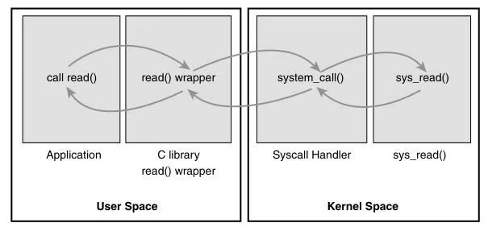

[toc]

## 05 System Calls

In any modern operating system, the kernel provides a set of interfaces by whichprocesses running in user-space can interact with the system.These interfaces giveappli-cations controlled access to hardware, a mechanism with which to create newprocesses and communicate with existing ones, and the capability to request otheroperating system resources.The interfaces act as the messengers between applicationsand the kernel, with the applications issuing various requests and the kernel fulfillingthem (or returning an error).The existence of these interfaces, and the fact thatapplications are not free to directly do whatever they want, is key to providing a stablesystem.

在任何现代操作系统中，内核都会提供一套接口，供运行在用户空间的进程与系统进行交互。这些接口为应用程序赋予了**受管控的硬件访问权限**，提供了创建新进程、与已有进程通信的机制，还让应用程序具备了申请其他操作系统资源的能力。

这些接口充当应用程序与内核之间的通信媒介：应用程序发起各类请求，由内核完成请求处理（或返回错误信息）。**这些接口的存在，加之应用程序无法随意直接执行各类操作的设计**，是保障系统稳定性的核心关键。

### Communicating with the Kernel

System calls provide a layer between the hardware anduser-space processes.This layer serves three primary purposes. First, it provides anabstracted hardware interface for user-space.When reading or writing from a file, forexample, applications are not concerned with the type of disk, media, or even the typeof filesystem on which the file resides. Sec-ond, system calls ensure system security and stability.With the kernel acting as a middle-man between system resources and user-space, the kernel can arbitrate access based on permissions, users, and other criteria. For example, this arbitration prevents applications from incorrectly using hardware, stealing other processes’ resources, or otherwise doing harm to the system.Finally, a single common layer between user-space and the rest of the system allows for the virtualized system provided to processes, discussed in Chapter 3, “Process Management.” If applications were free to access system resources without the kernel’s knowledge, it would be nearly impossible to implement multitasking and virtual memory,and certainly impossible to do so with stability and security. In Linux, **system calls are the only means user-space has of interfacing with the kernel**; they are the only legal entry point into the kernel other than exceptions and traps. Indeed, other interfaces,such as device files or /proc, are ultimately accessed via system calls. Interestingly,Linux implements far fewer system calls than most systems.1This chapter addresses the roleand implementation of system calls in Linux.

系统调用在硬件与用户空间进程之间构建了一层**中间层**，该中间层主要实现三大核心功能：

第一，为用户空间提供**抽象的硬件接口**。例如，应用程序对文件执行读写操作时，无需关心文件所在的磁盘类型、存储介质，甚至无需关心文件所属的文件系统类型。

第二，保障系统的安全性与稳定性。内核作为系统资源与用户空间之间的中介，会基于权限、用户身份及其他判定条件，对资源的访问行为进行仲裁。比如，这种仲裁机制能防止应用程序错误操作硬件、抢占其他进程的资源，或是以其他方式对系统造成损害。

第三，用户空间与系统其他部分之间的这一**统一公共中间层**，为进程提供了虚拟化的系统运行环境（相关内容将在第 3 章「进程管理」中展开讲解）。若应用程序可绕开内核、随意访问系统资源，多任务处理和虚拟内存的实现将变得几乎不可能，更无从谈起在保障稳定性和安全性的前提下实现这些功能。

在 Linux 系统中，**系统调用是用户空间与内核交互的唯一方式**；它也是除**异常和陷阱**之外，进入内核态的唯一合法入口。事实上，其他各类系统接口（如设备文件、/proc 伪文件系统），最终也都是通过系统调用来实现访问的。值得一提的是，Linux 实现的系统调用数量，远少于大多数其他操作系统。本章将详细讲解 Linux 系统中系统调用的作用与具体实现机制。

### System Call Handler

It is not possible for user-space applications to execute kernelcode directly.They cannot simply make a function call to a method existing in kernel-space because the kernel exists in a protected memory space. If applications coulddirectly read and write to the kernel’s address space, system security and stabilitywould be nonexistent.

用户空间的应用程序**无法直接执行内核代码**。它们不能简单地对内核空间中存在的方法发起函数调用，因为内核运行在受保护的内存空间中。倘若应用程序可直接对内核的地址空间进行读写操作，系统的安全性与稳定性将无从谈起。

Instead, user-space applications must somehow signal to the kernel that they want to execute a system call and have the system switch to kernel mode, where the system callcan be executed in kernel-space by the kernel on behalf of the application.

相反，用户空间的应用程序必须通过某种方式**向内核发出信号**，表明自身希望执行系统调用，并让系统切换至**内核态**；唯有在内核态下，内核才能代表应用程序，在内核空间中执行该系统调用。

The mechanism to signal the kernel is a **software interrupt**: Incur an exception, and the system will switch to kernel mode and execute the exception handler.The exception     handler, in this case, is actually the system call handler.The defined software interrupton x86 is interrupt number 128, which is incurred via the int $0x80 instruction. It triggersa switch to kernel mode and the execution of exception vector 128, which is the systemcall handler.The system call handler is the aptly named function system_call(). It isarchitecture-dependent; on x86-64 it is implemented in assembly in entry_64.S.6

向内核发送该信号的机制是**软中断**：应用程序触发一次异常，系统便会切换至内核态，并执行对应的异常处理程序。而在这种场景下，该异常处理程序实际上就是**系统调用处理程序**。在 x86 架构中，系统定义的软中断为 128 号中断，可通过`int $0x80`指令触发。该指令会触发系统切至内核态，并执行 128 号异常向量对应的处理逻辑 —— 也就是系统调用处理程序。

系统调用处理程序对应的是一个恰如其名的函数：`system_call()`。该函数的实现**与硬件架构相关**：在 x86-64 架构中，它由汇编语言编写，实现于`entry_64.S`文件中。

Recently, x86 processors added a feature known as sysenter.This feature provides afaster, more specialized way of trapping into a kernel to execute a system call thanusing the intinterrupt instruction. Support for this feature was quickly added to thekernel. Regardless of how the system call handler is invoked, however, the importantnotion is that somehow user-space causes an exception or trap to enter the kernel.

近期，x86 处理器新增了一项名为`sysenter`的特性。相比使用`int`中断指令，该特性提供了一种**更快、更专用**的方式，让程序陷入内核以执行系统调用。Linux 内核也迅速对该特性提供了支持。不过，无论系统调用处理程序以何种方式被调用，核心要点始终不变：用户空间需通过某种方式触发一次异常或陷阱，以此完成向内核态的切入。

#### Denoting the Correct System Call

**指定待执行的系统调用**

CallSimply entering kernel-space alone is not sufficientbecause multiple system calls exist, all of which enter the kernel in the same manner.Thus, the system call number must be passed into the kernel. On x86, thesyscall number is fed to the kernel via the eax regis-ter. Before causing the trap intothe kernel, user-space sticks in eax the number corre-sponding to the desired systemcall.The system call handler then reads the value fromeax. Other architectures dosomething similar.

仅仅切入内核态是远远不够的 —— 因为系统中存在多个系统调用，且所有系统调用的内核切入方式完全相同。因此，**必须将系统调用号传入内核**，以此标识要执行的具体系统调用。

在 x86 架构中，系统调用号通过**eax 寄存器**传递给内核：用户态程序在触发内核陷阱前，会将目标系统调用对应的编号写入 eax 寄存器，后续系统调用处理程序只需从 eax 寄存器中读取该值，即可确定要执行的系统调用。其他硬件架构也采用类似的实现方式。

#### Parameter Passing

In addition to the system call number, most syscalls require that oneor more parameters be passed to them. Somehow, user-space must relay theparameters to the kernel during the trap.The easiest way to do this is via the samemeans that the syscall number is passed: The parameters are stored in registers. Onx86-32, the registers ebx, ecx, edx, esi, andedi contain, in order, the first fivearguments. In the unlikely case of six or more argu-ments, a single register is used tohold a pointer to user-space where all the parameters are stored.

除系统调用号外，大多数系统调用还需要传入一个或多个参数。用户态程序需在触发内核陷阱的同时，将这些参数传递给内核。实现这一需求最简便的方式，与传递系统调用号的方式一致：**将参数存储在寄存器中**。

在 x86-32 架构中，寄存器 ebx、ecx、edx、esi、edi 会**按顺序**存放前五个系统调用参数；极少出现需要传入六个及以上参数的情况，若有此需求，会使用单个寄存器存储一个**指向用户空间的指针**，所有待传参数均存放于该指针指向的用户空间内存区域中。

The return value is sent to user-space also via register. On x86, it is written into the eax register.

系统调用的**返回值**同样通过寄存器传递给用户态：在 x86 架构中，内核会将返回值写入 eax 寄存器，用户态程序从该寄存器中读取即可。

Remember the Unix motto:“Providemechanism, not policy.”

请记住 Unix 的经典格言：**“提供机制，而非策略。”**

### System Call Context

As discussed in Chapter 3, the kernel is in process context during the execution of a sys-tem call.The current pointer points to the current task, which is the process that issued the syscall.

正如第 3 章所述，**内核在执行系统调用的过程中处于进程上下文**，此时`current`指针指向当前任务，也就是发起该系统调用的进程。

In process context, the kernel is capable of sleeping (for example, if the system call blocks on a call or explicitly calls schedule()) and is fully preemptible.These two points are important. First, the capability to sleep means that system calls can make use of the majority of the kernel’s functionality.As we will see in Chapter 7,“Interrupts and Interrupt Handlers,” the capability to sleep greatly simplifies kernel programming.7 Thefact that process context is preemptible implies that, like user-space, the current taskmay be preempted by another task. Because the new task may then execute the samesystem call, care must be exercised to ensure that system calls are reentrant. Of course,this is the same concern that symmetrical multiprocessing introduces. Synchronizingreentrancy is covered in Chapter 9,“An Introduction to Kernel Synchronization,” andChapter 10, “Kernel Synchronization Methods.”

在进程上下文中，内核能够**进入睡眠状态**（例如，当系统调用在某个操作中发生阻塞，或显式调用`schedule()`函数时），且该上下文**完全可被抢占**。这两个特性至关重要：其一，支持睡眠意味着系统调用可以调用内核的绝大多数功能。我们将在第 7 章《中断与中断处理程序》中看到，睡眠能力极大地简化了内核的编程实现；其二，进程上下文可被抢占，意味着当前任务与用户空间进程一样，有可能被其他任务抢占。而新被调度执行的任务也可能调用同一个系统调用，因此**必须谨慎处理，以确保系统调用具备可重入性**。当然，这一问题与对称多处理（SMP）技术带来的问题本质相同。关于可重入性的同步保障，将在第 9 章《内核同步入门》和第 10 章《内核同步方法》中详细讲解。

When the system call returns, control continues in system_call(), which ultimately switches to user-space and continues the execution of the user process.

当系统调用执行完毕并返回时，程序的执行流程会回到`system_call()`函数中，该函数最终会完成内核态到用户态的切换，让发起调用的用户进程继续执行。

