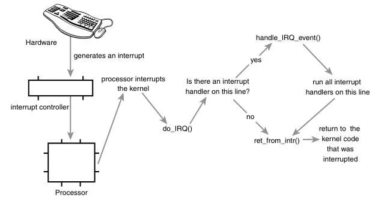

[toc]

## 07 Interrupts and Interrupt Handlers

A core responsibility of any operating system kernel is managing thehardware con-nected to the machine—hard drives and Blu-ray discs,keyboards and mice, 3D processors and wireless radios.To meet thisresponsibility, the kernel needs to communicate with the machine’s individualdevices. Given that processors can be orders of magnitudes faster than thehardware they talk to, it is not ideal for the kernel to issue a request andwait for a response from the significantly slower hardware. Instead, becausethe hardware is com-paratively slow to respond, the kernel must be free togo and handle other work, dealing with the hardware only after thathardware has actually completed its work.

任何操作系统内核的核心职责之一，是管理与机器相连的各类硬件 —— 硬盘驱动器、蓝光光盘、键盘、鼠标、3D 处理器以及无线网卡等。为履行这一职责，内核需要与机器上的各个设备进行通信。

处理器的运行速度比其通信的硬件快数个数量级，因此内核发出请求后，等待速度慢得多的硬件响应，这种方式并不理想。相反，由于硬件响应速度相对较慢，内核必须能够自由地去处理其他工作，仅在硬件实际完成工作后，再对其进行处理。

How can the processor work with hardware without impacting the machine’soverall performance? One answer to this question is polling. Periodically, the kernelcan check the status of the hardware in the system and respond accordingly.Polling incurs overhead, however, because it must occur repeatedlyregardless of whether the hardware is active or ready.A better solution is toprovide a mechanism for the hardware to signal to the kernel when attentionis needed.This mechanism is called an interrupt. In this chapter, we discuss interrupts and how the kernel responds to them, with special functions called **interrupt handlers**.

处理器如何在不影响机器整体性能的前提下与硬件协同工作？解决这一问题的方案之一是**轮询**。内核会周期性地检查系统中硬件的状态，并据此做出响应。然而，轮询会产生开销，因为无论硬件是否处于活动或就绪状态，轮询都必须反复进行。

更优的方案是提供一种机制，让硬件在需要内核关注时，主动向内核发送信号。这种机制被称为**中断**。本章中，我们将讨论中断，以及内核如何通过名为**中断处理程序**的特殊函数来响应中断。

###  Interrupts

Interrupts enable hardware to signal to the processor. Forexample, as you type, the key-board controller (the hardware device thatmanages the keyboard) issues an electrical sig-nal to the processor to alertthe operating system to newly available key presses.These electrical signalsare interrupts.The processor receives the interrupt and signals the operating system to enable the operating system to respond to the new data.Hardware devices generate interrupts asynchronously with respect to theprocessor clock—they can occur at any time. Consequently, the kernel canbe interrupted at any time to process interrupts.

中断使硬件能够向处理器发送信号。例如，当你敲击键盘时，键盘控制器（管理键盘的硬件设备）会向处理器发出电信号，提醒操作系统有新的按键输入。这些电信号就是中断。处理器接收到中断后，会向操作系统发送信号，使其能够对新数据做出响应。

硬件设备产生中断的时机与处理器时钟是**异步**的 —— 中断可能在任意时刻发生。因此，内核随时可能被中断，转而处理中断。

An interrupt is physically produced by electronic signals originating fromhardware devices and directed into input pins on an interrupt controller, a simple chipthat multiplexes multiple interrupt lines into a single line to the processor. Uponreceiving an inter-rupt, the interrupt controller sends a signal to theprocessor.The processor detects this sig-nal and interrupts its currentexecution to handle the interrupt.The processor can then notify the operatingsystem that an interrupt has occurred, and the operating system can handlethe interrupt appropriately.

中断在物理上由硬件设备产生的电信号生成，这些信号被送入**中断控制器**的输入引脚。中断控制器是一种简单的芯片，它将多条中断线复用到一条通往处理器的线路上。中断控制器接收到中断后，会向处理器发送信号。处理器检测到该信号后，会中断当前的执行流程，转而处理中断。随后，处理器会通知操作系统发生了中断，操作系统便能对中断进行恰当的处理。

Different devices can be associated with different interrupts by means of aunique value associated with each interrupt.This way, interrupts from the keyboardare distinct from interrupts from the hard drive.This enables the operatingsystem to differentiate between interrupts and to know which hardwaredevice caused which interrupt. In turn, the operating system can service eachinterrupt with its corresponding handler.

通过为每个中断分配一个唯一的标识值，不同的设备可以关联到不同的中断。这样一来，来自键盘的中断就与来自硬盘的中断区分开来。这使得操作系统能够区分不同的中断，并知晓是哪个硬件设备引发了该中断。进而，操作系统可以通过对应的处理程序来为每个中断提供服务。

These interrupt values are often called interrupt request (IRQ) lines. EachIRQ line is assigned a numeric value—for example, on the classic PC, IRQ zero is thetimer inter-rupt and IRQ one is the keyboard interrupt. Not all interruptnumbers, however, are so rigidly defined. Interrupts associated with deviceson the PCI bus, for example, generally are dynamically assigned. Other non-PC architectures have similar dynamic assignments for interrupt values.Theimportant notion is that a specific interrupt is associated with a specificdevice, and the kernel knows this.The hardware then issues interrupts to get the kernel’s attention: Hey, I have new key presses waiting! Read andprocess these bad boys!

这些中断标识值通常被称为**中断请求（IRQ）线**。每条 IRQ 线都被分配了一个数值 —— 例如，在经典的 PC 架构中，IRQ 0 是定时器中断，IRQ 1 是键盘中断。不过，并非所有的中断号都有如此严格的固定定义。比如，与 PCI 总线上的设备相关联的中断，通常是动态分配的。其他非 PC 架构也会对中断值进行类似的动态分配。核心要点是：一个特定的中断会与一个特定的设备相关联，而内核知晓这种对应关系。随后，硬件会通过发出中断来引起内核的注意：“嘿，我这里有新的按键输入待处理！快来读取并处理这些数据！”

**Exceptions**

In OS texts, exceptions are often discussed at the same time as interrupts.Unlike inter-rupts, exceptions occur synchronously with respect to theprocessor clock. Indeed, they are often called synchronous interrupts.Exceptions are produced by the processor while execut-ing instructionseither in response to a programming error (for example, divide by zero) orabnormal conditions that must be handled by the kernel (for example, a pagefault). Because many processor architectures handle exceptions in a similarmanner to interrupts, the kernel infrastructure for handling the two is similar.Much of the discussion of interrupts (asynchronous interrupts generated byhardware) in this chapter also pertains to exceptions (synchronous interruptsgenerated by the processor).

在操作系统教材中，**异常（exceptions）** 通常与中断一同被讨论。与中断不同，异常的发生与处理器时钟**同步**。实际上，它们常被称为**同步中断**。

异常是处理器在执行指令时产生的，要么是响应编程错误（例如除零错误），要么是响应必须由内核处理的异常情况（例如缺页异常）。由于许多处理器架构处理异常的方式与处理中断类似，因此内核中处理二者的底层机制也相近。本章中关于中断（由硬件产生的异步中断）的大部分讨论，同样适用于异常（由处理器产生的同步中断）。

You are already familiar with one exception: In the previous chapter, you sawhow system calls on the x86 architecture are implemented by the issuanceof a software interrupt, which traps into the kernel and causes execution ofa special system call handler. Inter-rupts work in a similar way, you will see,except hardware—not software—issues interrupts.

你已经熟悉一种异常：在上一章中，你了解到 x86 架构上的系统调用是通过触发软件中断实现的，该中断会**陷入内核**，并触发一个专用的系统调用处理程序执行。你会发现，中断的工作方式与此类似，区别仅在于中断是由**硬件**而非软件触发的。

### Interrupt Handlers

The function the kernel runs in response to a specific interrupt is called an **interrupt handler** or **interrupt service routine (ISR)**. Eachdevice that generates interrupts has an associated interrupt handler. Forexample, one function handles interrupts from the system timer, whereasanother function handles interrupts generated by the keyboard.The interrupthandler for a device is part of the device’s driver—the kernel code thatmanages the device.

内核为响应特定中断而运行的函数，称为**中断处理程序（interrupt handler）**或**中断服务例程（ISR，Interrupt Service Routine）**。每个产生中断的设备都有对应的中断处理程序。例如，有一个函数处理系统定时器的中断，另一个函数处理键盘产生的中断。设备的中断处理程序是该设备驱动程序的一部分 —— 驱动程序是管理该设备的内核代码。

In Linux, interrupt handlers are normal C functions.They match a specific prototype, which enables the kernel to pass the handler information in a standard way, but otherwise they are ordinary functions.What differentiates interrupt handlers from otherkernel func-tions is that the kernel invokes them in response to interruptsand that they run in a spe-cial context (discussed later in this chapter)called interrupt context.This special context is occasionally called atomiccontext because, as we shall see, code executing in this context is unable to block. In this book, we will use the term interrupt context.

在 Linux 中，中断处理程序是普通的 C 函数。它们符合特定的函数原型，这使得内核能够以标准方式向处理程序传递信息，除此之外，它们就是普通的函数。中断处理程序与其他内核函数的区别在于：内核会响应中断来调用它们，并且它们运行在一种特殊的上下文（本章后续会讨论）中，这种上下文称为**中断上下文（interrupt context）**。这种特殊的上下文有时也被称为**原子上下文（atomic context）**，因为我们将会看到，在这种上下文中执行的代码无法阻塞。本书中，我们将使用 “中断上下文” 这一术语。

Because an interrupt can occur at any time, an interrupt handler can, in turn,be exe-cuted at any time. It is imperative that the handler runs quickly, toresume execution of the interrupted code as soon as possible.Therefore,while it is important to the hardware that the operating system services theinterrupt without delay, it is also important to the rest of the system that the interrupt handler executes in as short a period as possible.

由于中断可以在任何时刻发生，中断处理程序也因此可以在任何时刻被执行。处理程序必须快速运行，以便尽快恢复被中断代码的执行。因此，对硬件而言，操作系统及时响应中断至关重要；而对系统的其他部分而言，中断处理程序的执行时间尽可能短也同样重要。

At the very least, an interrupt handler’s job is to acknowledge the interrupt’sreceipt to the hardware: Hey, hardware, I hear ya; now get back to work!Often, however, interrupt han-dlers have a large amount of work to perform.For example, consider the interrupt handler for a network device. On top ofresponding to the hardware, the interrupt handler needs to copy networkingpackets from the hardware into memory, process them, and push thepackets down to the appropriate protocol stack or application. Obviously,this can be a lot of work, especially with today’s gigabit and 10-gigabitEthernet cards.

最基本的，中断处理程序的工作是向硬件确认已收到中断：“嘿，硬件，我收到了，你可以继续工作了！” 但通常情况下，中断处理程序需要完成大量工作。例如，以网络设备的中断处理程序为例。除了响应硬件之外，中断处理程序还需要将网络数据包从硬件复制到内存，处理这些数据包，并将其传递给对应的协议栈或应用程序。显然，这可能是一项繁重的工作，尤其是在如今的千兆和万兆以太网卡场景下。


### Top Halves Versus Bottom Halves

These two goals—that an interrupt handlerexecute quickly and perform a large amount of work—clearly conflict withone another. Because of these competing goals, the pro-cessing ofinterrupts is split into two parts, or halves.The interrupt handler is the tophalf. The top half is run immediately upon receipt of the interrupt andperforms only the work that is time-critical, such as acknowledging receiptof the interrupt or resetting the hardware.Work that can be performed lateris deferred until the bottom half.The bottom half runs in the future, at a moreconvenient time, with all interrupts enabled. Linux pro-vides variousmechanisms for implementing bottom halves, and they are all discussed inChapter 8,“Bottom Halves and Deferring Work.”

中断处理程序既要快速执行，又要完成大量工作，这两个目标显然相互矛盾。由于这两个目标相互冲突，中断的处理过程被分成两部分，即**上半部分**和**下半部分**。

中断处理程序本身就是上半部分。上半部分在接收到中断后立即执行，仅完成那些**时间关键**的工作，例如确认已收到中断信号，或对硬件进行复位。那些可以稍后执行的工作，则被推迟到下半部分处理。下半部分会在未来某个更合适的时机运行，并且运行时所有中断都是开启的。Linux 提供了多种实现下半部分的机制，这些机制将在第 8 章 “下半部分与工作推迟” 中详细讨论。

Let’s look at an example of the top-half/bottom-half dichotomy, using our old friend, the network card.When network cards receive packets from thenetwork, they need to alert the kernel of their availability.They want and needto do this immediately, to opti-mize network throughput and latency andavoid timeouts.Thus, they immediately issue an interrupt: Hey, kernel, I havesome fresh packets here! The kernel responds by executing the networkcard’s registered interrupt.

我们以老朋友**网卡**为例，看看上半部分与下半部分的分工。当网卡从网络接收到数据包时，需要通知内核数据包已就绪。为了优化网络吞吐量和延迟、避免超时，网卡需要**立即**发出通知。因此，它会立刻触发一个中断：“嘿，内核，我这里有新的数据包！” 内核响应中断，执行网卡注册的中断处理程序。

The interrupt runs, acknowledges the hardware, copies the new networkingpackets into main memory, and readies the network card for more packets.Thesejobs are the important, time-critical, and hardware-specific work.The kernelgenerally needs to quickly copy the networking packet into main memorybecause the network data buffer on the networking card is fixed andminiscule in size, particularly compared to main memory. Delays in copyingthe packets can result in a buffer overrun, with incoming packets overwhelming the networking card’s buffer and thus packets being dropped. After the networking data is safely in the main memory, the interrupt’s job is done, and it can return control of the system to whatever code was interrupted when theinterrupt was generated.The rest of the processing and handling of thepackets occurs later, in the bot-tom half. In this chapter, we look at the tophalf; in the next chapter, we study the bottom.

中断处理程序开始运行，向硬件确认中断，将新的网络数据包复制到主内存，并让网卡准备好接收更多数据包。这些工作是重要、时间关键且与硬件强相关的。内核之所以需要快速将数据包复制到主内存，是因为网卡上的网络数据缓冲区大小固定且极小，远小于主内存。复制数据包的延迟会导致**缓冲区溢出**—— 涌入的数据包超出网卡缓冲区容量，最终导致数据包丢失。

当网络数据安全存入主内存后，中断处理程序的工作就完成了，它可以将系统控制权交还给中断发生时被打断的代码。数据包的其余处理工作，会在稍后由下半部分完成。本章我们聚焦上半部分，下一章将深入研究下半部分。

### Interrupt Context

When executing an interrupt handler, the kernel is ininterrupt context. Recall that process context is the mode of operation thekernel is in while it is executing on behalf of a process—for example,executing a system call or running a kernel thread. In process con-text, thecurrent macro points to the associated task. Furthermore, because aprocess is coupled to the kernel in process context, process context cansleep or otherwise invoke the scheduler.

执行中断处理程序时，内核处于**中断上下文**。回顾一下，**进程上下文**是内核代表进程执行操作时所处的运行模式 —— 例如，执行系统调用或运行内核线程时。在进程上下文中，`current`宏指向对应的任务。此外，由于进程在进程上下文中与内核耦合，因此进程上下文可以休眠，或者以其他方式调用调度器。

Interrupt context, on the other hand, is not associated with a process.The current macro is not relevant (although it points to the interrupted process).Withouta backing process, interrupt context cannot sleep—how would it everreschedule? Therefore, you cannot call certain functions from interruptcontext. If a function sleeps, you cannot use it from your interrupt handler—this limits the functions that one can call from an interrupt handler.

另一方面，中断上下文与进程无关。`current`宏在此场景下不具备实际意义（尽管它指向被中断的进程）。由于中断上下文没有对应的进程作为支撑，因此它无法休眠 —— 毕竟休眠后该如何重新调度呢？因此，你不能从中断上下文中调用某些特定函数。如果一个函数会导致休眠，那么就不能在中断处理程序中使用它 —— 这限制了可从中断处理程序调用的函数范围。

Interrupt context is time-critical because the interrupt handler interruptsother code.

中断上下文具有**时间敏感性**，因为中断处理程序会打断其他代码的执行。

Code should be quick and simple. Busy looping is possible, butdiscouraged.This is an important point; always keep in mind that yourinterrupt handler has interrupted other code (possibly even another interrupt        handler on a different line!). Because of this asyn-chronous nature, it isimperative that all interrupt handlers be as quick and as simple aspossible.As much as possible, work should be pushed out from the interrupthandler and performed in a bottom half, which runs at a more convenienttime.

代码应当简洁高效。忙等待循环虽然可行，但并不推荐使用。这一点至关重要：始终要记住，你的中断处理程序打断了其他代码的执行（甚至可能是另一个处理器上的中断处理程序！）。正因为这种异步特性，所有中断处理程序都必须尽可能简洁、高效。应将尽可能多的工作从中断处理程序中剥离出来，放到**下半部（bottom half）** 中执行，下半部会在更合适的时机运行。

The setup of an interrupt handler’s stacks is a configuration option.Historically, inter-rupt handlers did not receive their own stacks. Instead,they would share the stack of the process that they interrupted.1 The kernelstack is two pages in size; typically, that is 8KB on 32-bit architectures and16KB on 64-bit architectures. Because in this setup interrupt handlers sharethe stack, they must be exceptionally frugal with what data they allocatethere. Of course, the kernel stack is limited to begin with, so all kernel codeshould be cautious.

中断处理程序栈的设置是一个配置项。历史上，中断处理程序并没有专属的栈，而是共享被其打断的进程的栈 ¹。内核栈的大小为两个页面：通常在 32 位架构上是 8KB，在 64 位架构上是 16KB。在这种设置下，由于中断处理程序共享栈空间，它们必须极其节省地使用栈上分配的数据。当然，内核栈本身的容量就有限，因此所有内核代码都应谨慎使用栈空间。

Early in the 2.6 kernel process, an option was added to reduce the stack sizefrom two pages down to one, providing only a 4KB stack on 32-bit systems.Thisreduced memory pressure because every process on the system previouslyneeded two pages of contiguous, nonswappable kernel memory.To cope withthe reduced stack size, interrupt handlers were given their own stack, onestack per processor, one page in size.This stack is referred to as theinterrupt stack.Although the total size of the interrupt stack is half that ofthe original shared stack, the average stack space available is greaterbecause interrupt handlers get the full page of memory to themselves.

在 2.6 版本内核的开发初期，新增了一项配置项，将内核栈的大小从两个页面缩减为一个 —— 这使得 32 位系统上的内核栈仅为 4KB。这一改动降低了内存压力，因为在此之前，系统中的每个进程都需要占用两个连续的、不可交换的内核内存页面。为了适配缩减后的栈大小，内核为中断处理程序分配了专属的栈：每个处理器对应一个栈，大小为一个页面。这种栈被称为**中断栈（interrupt stack）**。尽管中断栈的总大小仅为原先共享栈的一半，但实际可用的平均栈空间反而更大 —— 因为中断处理程序可以独占整个页面的内存。

Your interrupt handler should not care what stack setup is in use or what thesize of the kernel stack is.Always use an absolute minimum amount of stack space.

你的中断处理程序不应依赖于当前的栈配置，也无需关注内核栈的具体大小。始终应使用尽可能少的栈空间。

### Implementing Interrupt Handlers

Perhaps not surprising, the implementationof the interrupt handling system in Linux is architecture-dependent.Theimplementation depends on the processor, the type of inter-rupt controllerused, and the design of the architecture and machine.

不足为奇的是，Linux 中中断处理系统的实现**与架构相关**。其具体实现取决于处理器类型、所使用的中断控制器类型，以及架构和整机的设计方案。



> Figure 7.1 is a diagram of the path an interrupt takes through hardware andthe kernel.

A device issues an interrupt by sending an electric signal over its bus to theinterrupt controller. If the interrupt line is enabled (they can be masked out), theinterrupt con-troller sends the interrupt to the processor. In mostarchitectures, this is accomplished by an electrical signal sent over a specialpin to the processor. Unless interrupts are disabled in the processor (whichcan also happen), the processor immediately stops what it is doing, disables      the interrupt system, and jumps to a predefined location in memory andexecutes the code located there.This predefined point is set up by the kerneland is the entry point for interrupt handlers.

设备通过其总线向中断控制器发送电信号来触发中断。若该中断线处于启用状态（中断线可被屏蔽），中断控制器会将中断信号转发给处理器。在大多数架构中，这一过程是通过向处理器的专用引脚发送电信号实现的。除非处理器中禁用了中断（这种情况也可能发生），否则处理器会立即停止当前正在执行的操作，禁用中断系统，并跳转到内存中一个预定义的位置，执行该位置上的代码。这个预定义的位置由内核预先设置，是中断处理程序的入口点。

The interrupt’s journey in the kernel begins at this predefined entry point,just as system calls enter the kernel through a predefined exception handler. Foreach interrupt line, the processor jumps to a unique location in memory andexecutes the code located there. In this manner, the kernel knows the IRQnumber of the incoming interrupt. The initial entry point simply saves thisvalue and stores the current register values (which belong to the interruptedtask) on the stack; then the kernel calls do_IRQ(). From here onward, most ofthe interrupt handling code is written in C; however, it is still architecture-dependent.

中断在内核中的处理流程便从这个预定义入口点开始 —— 这与系统调用通过预定义的异常处理程序进入内核的方式类似。对于每条中断线，处理器都会跳转到内存中一个唯一的位置并执行该位置的代码。通过这种方式，内核就能获知到来的中断对应的 IRQ 号。初始入口点会先保存该 IRQ 号，并将当前寄存器的值（属于被中断的任务）压入栈中；随后内核调用 do_IRQ () 函数。从这一步开始，中断处理的大部分代码由 C 语言编写，但仍与架构相关。

### Interrupt Control

The Linux kernel implements a family of interfaces formanipulating the state of inter-rupts on a machine.These interfaces enableyou to disable the interrupt system for the current processor or mask out aninterrupt line for the entire machine.These routines are all architecture-dependent and can be found in <asm/system.h> and <asm/irq.h>. See Table7.2, later in this chapter, for a complete listing of the interfaces.

Linux 内核实现了一组用于操控整机中断状态的接口。这些接口支持禁用当前处理器的中断系统，或对整机屏蔽某一条中断线。这些例程均与架构相关，可在头文件 `<asm/system.h>` 和 `<asm/irq.h>` 中找到。本章后文的表 7.2 列出了这些接口的完整清单。

Reasons to control the interrupt system generally boil down to needing toprovide synchronization. By disabling interrupts, you can guarantee that an interrupthandler will not preempt your current code. Moreover, disabling interruptsalso disables kernel pre-emption. Neither disabling interrupt delivery nordisabling kernel preemption provides any protection from concurrent accessfrom another processor, however. Because Linux supports multiple           processors, kernel code more generally needs to obtain some sort of lock toprevent another processor from accessing shared data simultaneously.Theselocks are often obtained in conjunction with disabling local interrupts.Thelock provides pro-tection against concurrent access from another processor,whereas disabling interrupts provides protection against concurrent accessfrom a possible interrupt handler. Chapters 9 and 10 discuss the variousproblems of synchronization and their solutions. Neverthe-less,understanding the kernel interrupt control interfaces is important.

控制中断系统的核心目的归根结底是为了实现**同步**。禁用中断后，可确保中断处理程序不会抢占当前代码的执行；此外，禁用中断也会同时禁用内核抢占机制。但需注意，无论是禁用中断交付，还是禁用内核抢占，都无法阻止其他处理器对共享数据的并发访问。由于 Linux 支持多处理器架构，内核代码通常需要获取某种锁机制，以防止其他处理器同时访问共享数据。这类锁的获取通常会与禁用本地处理器的中断配合使用：锁用于防范其他处理器的并发访问，而禁用中断则用于防范潜在的中断处理程序的并发访问。第 9 章和第 10 章会详细讨论各类同步问题及其解决方案。尽管如此，理解内核中断控制接口仍至关重要。

…

#### Status of the Interrupt System

SystemIt is often useful to know the state of theinterrupt system (for example, whether inter-rupts are enabled or disabled)or whether you are currently executing in interrupt context.

了解中断系统的状态（例如中断是否启用 / 禁用），或是当前是否在中断上下文中执行，往往十分关键。

The macro irqs_disabled(), defined in <asm/system.h>, returns nonzero if the interrupt system on the local processor is disabled. Otherwise, it returns zero.

宏 `irqs_disabled()` 定义于 `<asm/system.h>`，若**本地处理器**的中断系统处于禁用状态，该宏返回非零值；否则返回零。

Two macros, defined in <linux/hardirq.h>, provide an interface to check theker-nel’s current context.They are

在 `<linux/hardirq.h>` 中定义了两个用于检查内核当前上下文的宏，分别是 `in_interrupt()` 和 `in_irq()`：

```c
in_interrupt()
in_irq()
```

The most useful is the first: It returns nonzero if the kernel is performing any type of interrupt handling.This includes either executing an interrupt handler or abottom half handler.The macro in_irq() returns nonzero only if the kernel isspecifically executing an interrupt handler.

其中最常用的是 `in_interrupt()`：若内核正在执行任意类型的中断处理（包括中断处理程序或下半部处理程序），该宏返回非零值。而宏 `in_irq()` 仅在内核**明确执行中断处理程序（上半部）** 时返回非零值。

More often, you want to check whether you are in process context.That is,you want to ensure you are not in interrupt context.This is often the case becausecode wants to do something that can only be done from process context,such as sleep. If in_interrupt()returns zero, the kernel is in process context.

通常，你需要检查自己是否处于进程上下文 —— 也就是确保当前**不处于中断上下文**。这种需求十分常见，因为有些操作（例如休眠）只能在进程上下文中执行。若 `in_interrupt()` 返回零，则说明内核正处于进程上下文。

### Conclusion

This chapter looked at interrupts, a hardware resource used bydevices to asynchro-nously signal the processor. Interrupts, in effect, areused by hardware to interrupt the operating system.

本章探讨了 “中断” 这一硬件资源：设备通过中断向处理器发送异步信号，本质上是硬件用来 “打断” 操作系统执行流程的机制。

Most modern hardware uses interrupts to communicate with operatingsystems.The device driver that manages a given piece of hardware registers an interrupthandler to respond to and process interrupts issued from their associatedhardware.Work performed in interrupts includes acknowledging and resettinghardware, copying data from the device to main memory and vice versa,processing hardware requests, and sending out new hardware requests.

大多数现代硬件通过中断与操作系统通信。管理特定硬件的设备驱动会注册一个中断处理程序，以响应并处理其关联硬件发出的中断。中断处理的工作包括：确认并重置硬件、将数据从设备拷贝至主存（或反向拷贝）、处理硬件请求，以及下发新的硬件请求。

The kernel provides interfaces for registering and unregistering interrupthandlers, dis-abling interrupts, masking out interrupt lines, and checking thestatus of the interrupt sys-tem.Table 7.2 provided an overview of many ofthese functions.

内核提供了一系列接口，用于注册 / 注销中断处理程序、禁用中断、屏蔽中断线，以及检查中断系统的状态。表 7.2 概述了其中大部分函数。

Because interrupts interrupt other executing code (processes, the kernelitself, and even other interrupt handlers), they must execute quickly. Often, however,there is a lot of work to do.To balance the large amount of work with theneed for quick execution, the kernel divides the work of processinginterrupts into two halves.The interrupt handler, the top half, was discussedin this chapter.The next chapter looks at the bottom half.

由于中断会打断其他正在执行的代码（进程、内核本身，甚至其他中断处理程序），因此中断处理必须尽可能快速。但实际场景中，中断相关的待处理工作往往较多。为了平衡 “大量待处理工作” 与 “快速执行” 的需求，内核将中断处理拆分为两部分：本章讨论的是作为 “上半部” 的中断处理程序，下一章将介绍 “下半部”。


