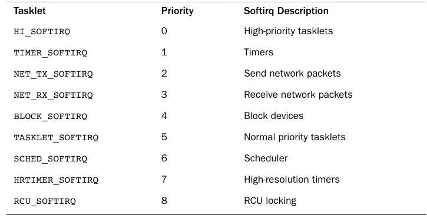

## 08 Bottom Halves andDeferring Work

The previous chapter discussed interrupt handlers, the kernel mechanism fordealing with hardware interrupts. Interrupt handlers are an important—indeed, required—part of any operating system. Due to various limitations,however, interrupt handlers can form only the first half of any interruptprocessing solution.These limitations include

- nterrupt handlers run asynchronously and thus interrupt other, potentially important, code, including other interrupt handlers.Therefore, to avoid stalling the    inter-rupted code for too long, interrupt handlers need to run as quickly aspossible.
- Interrupt handlers run with the current interrupt level disabled at best (if IRQF_DISABLED is unset), and at worst (if IRQF_DISABLED is set) with allinterrupts on the current processor disabled.As disabling interrupts preventshardware from communicating with the operating systems, interrupt handlersneed to run as quickly as possible.
-  Interrupt handlers are often timing-critical because they deal withhardware.
- Interrupt handlers do not run in process context; therefore, they cannotblock.This limits what they can do.

上一章讨论了**中断处理程序**—— 内核用于处理硬件中断的机制。中断处理程序是任何操作系统中至关重要（甚至是必不可少）的组成部分。但受多种限制影响，中断处理程序只能作为中断处理方案的**上半部**。这些限制包括：

- 中断处理程序**异步执行**，因此会打断其他可能很重要的代码（包括其他中断处理程序）。为避免被打断的代码被阻塞过久，中断处理程序必须尽可能快速地执行。
- 中断处理程序运行时，最优情况下（未设置 `IRQF_DISABLED`）当前中断级会被禁用，最坏情况下（设置了 `IRQF_DISABLED`）**当前处理器上所有中断都会被禁用**。由于禁用中断会阻断硬件与操作系统的通信，因此中断处理程序必须尽快执行完毕。
- 中断处理程序往往与硬件直接交互，因此**对时序要求严格**。
- 中断处理程序**不运行在进程上下文**中，因此**不能阻塞**。这极大限制了它能执行的操作。

It should now be evident that interrupt handlers are only a piece of thesolution to managing hardware interrupts. Operating systems certainly need a quick,asynchronous, simple mechanism for immediately responding to hardwareand performing any time-critical actions. Interrupt handlers serve thisfunction well; but other, less critical work can and should be deferred to alater point when interrupts are enabled.

现在不难看出，中断处理程序只是硬件中断管理方案的一部分。操作系统确实需要一种快速、异步、简洁的机制，用于立即响应硬件并完成所有**对时间敏感的操作**，中断处理程序很好地承担了这一角色；但其他**非紧急工作**，可以且应当被推迟到中断重新启用后的某个时机再处理。

Consequently, managing interrupts is divided into two parts, or halves.The first part, interrupt handlers (top halves), are executed by the kernel asynchronously in immediate response to a hardware interrupt, as discussed in the previous chapter.This chapter looks at the second part of the interrupt solution, bottom halves.

因此，中断处理被划分为两个部分（或称两个半部）。

第一部分是**中断处理程序（上半部）**，由内核异步执行，用于立即响应硬件中断，这部分内容已在上一章讨论。

本章将介绍中断处理方案的第二部分：**下半部**。

### Bottom Halves

The job of bottom halves is to perform any interrupt-relatedwork not performed by the interrupt handler. In an ideal world, this is nearlyall the work because you want the interrupt handler to perform as little work(and in turn be as fast) as possible. By offload-ing as much work as possibleto the bottom half, the interrupt handler can return control of the system towhatever it interrupted as quickly as possible.

下半部的职责，是完成中断处理程序中未做完的、与中断相关的工作。在理想情况下，下半部会承担**几乎全部工作**，因为我们希望中断处理程序只做尽可能少的事，从而执行得尽可能快。通过把尽可能多的工作卸载到下半部，中断处理程序就能尽快把系统控制权交还给被它中断的代码。

Nonetheless, the interrupt handler must perform some of the work. Forexample, the interrupt handler almost assuredly needs to acknowledge to the hardwarethe receipt of the interrupt. It may need to copy data to or from thehardware.This work is timing-sensitive, so it makes sense to perform it inthe interrupt handler.

尽管如此，仍有一部分工作必须由中断处理程序完成。例如，中断处理程序几乎必然需要**向硬件应答中断已收到**；它也可能需要与硬件之间进行数据拷贝。这类工作对**时序敏感**，因此放在中断处理程序中执行是合理的。

Almost anything else is fair game for performing in the bottom half. Forexample, if you copy data from the hardware into memory in the top half, it certainlymakes sense to process it in the bottom half. Unfortunately, no hard and fastrules exist about what work to perform where—the decision is left entirely upto the device-driver author.Although no arrangement is illegal, anarrangement can certainly be suboptimal. Remember, inter-rupt handlers runasynchronously, with at least the current interrupt line disabled. Mini-mizingtheir duration is important.Although it is not always clear how to divide thework between the top and bottom half, a couple of useful tips help:

-  If the work is time sensitive, perform it in the interrupt handler.
-  If the work is related to the hardware, perform it in the interrupt handler.
- If the work needs to ensure that another interrupt (particularly the sameinterrupt) does not interrupt it, perform it in the interrupt handler.
- For everything else, consider performing the work in the bottom half.

几乎除此之外的所有工作，都适合放在下半部完成。例如，如果你在上半部把数据从硬件读到内存，那么对这些数据的后续处理，就非常适合放到下半部。遗憾的是，**哪些工作该放在哪里执行并没有硬性规则**，决定权完全交给设备驱动开发者。虽然没有哪种划分方式是非法的，但不合理的划分显然会导致性能变差。请记住：中断处理程序是异步执行的，且运行时至少会屏蔽当前中断线，**尽可能缩短它的执行时间至关重要**。尽管如何在上半部与下半部之间划分工作并不总是很明确，但下面几条实用原则可以参考：

- 如果工作**对时间敏感**，放在中断处理程序中执行。
- 如果工作**与硬件直接相关**，放在中断处理程序中执行。
- 如果需要确保该工作**不会被其他中断（尤其是同一中断）打断**，放在中断处理程序中执行。
- 除此之外的所有工作，都可以考虑放在下半部执行。

#### Why Bottom Halves?

It is crucial to understand why to defer work, and whenexactly to defer it.You want to limit the amount of work you perform in aninterrupt handler because interrupt handlers run with the current interruptline disabled on all processors.Worse, handlers that register withIRQF_DISABLED run with all interrupt lines disabled on the local processor,plus the current interrupt line disabled on all processors. Minimizing the timespent with inter-rupts disabled is important for system response andperformance.Add to this the fact that interrupt handlers run asynchronouslywith respect to other code—even other interrupt handlers—and it is clearthat you should work to minimize how long interrupt handlers run. Processingincoming network traffic should not prevent the kernel’s receipt of key-strokes.The solution is to defer some of the work until later.

理解**为何要推迟工作**，以及**究竟何时推迟**，这一点至关重要。我们需要限制在中断处理程序中完成的工作量，因为中断处理程序运行时，**所有处理器**上的**当前中断线**都会被屏蔽。更糟糕的是，使用 `IRQF_DISABLED` 注册的处理程序，会在**本地处理器**上屏蔽**全部中断线**，同时还会在所有处理器上屏蔽当前中断线。尽可能缩短中断被屏蔽的时间，对系统响应性和性能至关重要。除此之外，中断处理程序相对于其他代码（甚至其他中断处理程序）都是**异步运行**的，因此显然应当尽量缩短中断处理程序的执行时间。处理 incoming 网络流量，不应该阻塞内核接收键盘输入。解决方案就是把一部分工作推迟到后面再做。

But when is “later?”The important thing to realize is that later is often simply not now. 

但 “后面” 究竟是什么时候？需要明白的关键点是：**“后面” 往往只是 “不是现在” 而已**。

The point of a bottom half is not to do work at some specific point in thefuture, but sim-ply to defer work until any point in the future when thesystem is less busy and interrupts are again enabled. Often, bottom halvesrun immediately after the interrupt returns.The key is that they run with allinterrupts enabled.

下半部的意义，并不是要在未来某个精确时间点执行工作，而只是**把工作推迟到未来任意一个系统没那么繁忙、并且中断已重新启用的时机**。很多时候，下半部会在中断处理程序返回后**立刻执行**。核心区别在于：它们运行时**所有中断都是开启状态**。

Linux is not alone in separating the processing of hardware interrupts intotwo parts; most operating systems do so.The top half is quick and simple and runs with some or all interrupts disabled.The bottom half (however it is implemented)runs later with all interrupts enabled.This design keeps system latency lowby running with interrupts disabled for as little time as necessary.

并非只有 Linux 会把硬件中断处理拆成两部分，大多数操作系统都是这么做的。**上半部**快速、简单，运行时会屏蔽部分或全部中断；**下半部**（无论具体如何实现）会在稍后运行，且运行时**所有中断都已启用**。这种设计通过把中断屏蔽时间压缩到最短必需时长，从而维持较低的系统延迟。

#### A World of Bottom Halves

Unlike the top half, which is implemented entirelyvia the interrupt handler, multiple mechanisms are available for implementinga bottom half.These mechanisms are different interfaces and subsystemsthat enable you to implement bottom halves.Whereas the pre-vious chapterlooked at just a single way of implementing interrupt handlers, this chapterlooks at multiple methods of implementing bottom halves. Over the course ofLinux’s history, there have been many bottom-half mechanisms. Confusingly,some of these mechanisms have similar or even dumb names. It requires aspecial type of programmer to name bottom halves.

与完全通过中断处理程序实现的上半部不同，**下半部**有多种实现机制可供选择。这些机制是不同的接口与子系统，用于完成下半部的功能。上一章只讨论了实现中断处理程序（上半部）的唯一方式，而本章会介绍实现下半部的多种方法。在 Linux 的发展历程中，曾出现过许多种下半部机制。令人困惑的是，其中一些机制的名称相近甚至很不直观，给下半部命名确实需要特别的思路。

This chapter discusses both the design and implementation of the bottom-half mecha-nisms that exist in 2.6.We also discuss how to use them in thekernel code you write.The old, but long since removed, bottom-halfmechanisms are historically significant, and so they are mentioned whenrelevant.

本章会讨论 **2.6 内核**中现存的各类下半部机制的设计与实现，也会介绍如何在内核代码中使用它们。一些早已被移除的旧式下半部机制仍具有历史参考意义，因此在相关地方会简要提及。

**The Original “Bottom Half”**

最初的 “Bottom Half”（BH 机制）

In the beginning, Linux provided only the“bottom half” for implementing bottom halves.This name was logicalbecause at the time that was the only means available for deferringwork.The infrastructure was also known as BH, which is what we will call itto avoid confusion with the generic term bottom half.The BH interface wassimple, like most things in those good old days. It provided a staticallycreated list of 32 bottom halves for the entire system.The top half couldmark whether the bottom half would run by setting a bit in a 32-bit integer.Each BH was globally synchronized. No two could run at the same time, evenon different processors.This was easy to use, yet inflexible; a simple  approach, yet a bottleneck.

早期 Linux 只提供一种名为 **bottom half** 的机制来实现延后工作。这个名字在当时很合理，因为它是唯一的延后工作手段。这套基础架构也被简称为 **BH**，为了避免与通用概念 “下半部（bottom half）” 混淆，后文统一称其为 **BH 机制**。

和早年大多数设计一样，BH 接口非常简单：系统全局静态定义了包含 **32 个下半部**的列表。上半部可以通过设置一个 32 位整数中的对应比特位，来标记对应的下半部是否需要执行。

所有 BH 都是**全局同步**的：即使在不同处理器上，也不可能同时运行两个 BH。这种方式易用但缺乏弹性，实现简单，却成为了性能瓶颈。

**Task Queues**

Later on, the kernel developers introduced task queues both as a method of deferring work and as a replacement for the BH mechanism.Thekernel defined a family of queues. Each queue contained a linked list offunctions to call.The queued functions were run at certain times, dependingon which queue they were in. Drivers could register their bot-tom halves inthe appropriate queue.This worked fairly well, but it was still too inflexibletoreplace the BH interface entirely. It also was not lightweight enough forperformance-critical subsystems, such as networking.

后来，内核开发者引入了**任务队列（task queues）**，既作为延后工作的一种方式，也作为 BH 机制的替代方案。

内核定义了一组队列，每个队列包含一个待调用函数的链表。队列中的函数会在特定时机执行，具体取决于所属队列的类型。驱动可以将自己的下半部注册到合适的队列中。

这套机制工作得还算不错，但灵活性仍然不足，无法完全替代 BH 接口；同时，它也不够轻量，难以满足网络等对性能敏感的子系统需求。

**Softirqs and Tasklets**

During the 2.3 development series, the kerneldevelopers introduced softirqs and tasklets. With the exception ofcompatibility with existing drivers, softirqs and tasklets could com-pletelyreplace the BH interface.1 Softirqs are a set of statically defined bottomhalves that can run simultaneously on any processor; even two of the sametype can run concur-rently.Tasklets, which have an awful and confusingname,2 are flexible, dynamically cre-ated bottom halves built on top ofsoftirqs.Two different tasklets can run concurrently on different processors,but two of the same type of tasklet cannot run simultaneously.Thus, taskletsare a good trade-off between performance and ease of use. For mostbottom-half processing, the tasklet is sufficient. Softirqs are useful whenperformance is critical, such as with networking. Using softirqs requiresmore care, however, because two of the same softirq can run at the sametime. In addition, softirqs must be registered statically at com-pile time.Conversely, code can dynamically register tasklets.

在 2.3 开发版系列中，内核开发者引入了**软中断（softirqs）**与**小任务（tasklets）**。除了为保持对现有驱动的兼容性外，软中断和小任务完全可以取代原有的 BH 接口。

软中断是一组**静态定义**的下半部机制，可以在任意处理器上**并发执行**；即便是**同一类型**的两个软中断，也能同时运行。

小任务（tasklets）这个名字起得糟糕又容易混淆，它是构建在软中断之上、支持**动态创建**的灵活下半部机制。**不同类型**的小任务可以在不同处理器上并发执行，但**同一类型**的两个小任务无法同时运行。

因此，小任务在性能与易用性之间做了很好的权衡。对于绝大多数下半部处理场景，小任务都足够使用。而软中断则适用于**对性能要求极高**的场景（例如网络子系统）。不过，使用软中断需要更加谨慎，因为同一类型的两个软中断可能并行执行。此外，软中断必须在**编译期静态注册**；与之相对，代码可以在运行时动态注册小任务。

To further confound the issue, some people refer to all bottom halves as software interrupts or softirqs. In other words, they call both the softirqmechanism and bottom halves in general softirqs. Ignore those people.Theyrun with the same crowd that named the BH and tasklet mechanisms.

更让人混淆的是，有些人把所有下半部都统称为 “软件中断” 或 “软中断”。换句话说，他们既把软中断机制叫作 softirq，也把通用意义上的下半部都叫作 softirq。别理这些人，他们和当年给 BH、小任务起名的那拨人是一路的。

While developing the 2.5 kernel, the BH interface was finally tossed to thecurb     because all BH users were converted to the other bottom-half interfaces.Additionally, the task queue interface was replaced by the **work queue** interface.Work queues are a simple yet useful method of queuingwork to later be performed in process context.We get to them later.

在开发 2.5 内核时，BH 接口终于被彻底废弃，因为所有原 BH 用户都已迁移到其他下半部接口。与此同时，任务队列（task queue）接口也被**工作队列（work queue）**接口取代。工作队列是一种简单实用的机制，可将工作排队，延后在**进程上下文**中执行。我们稍后会讲到它。

Consequently, today 2.6 has three bottom-half mechanisms in the kernel:softirqs, tasklets, and work queues.The old BH and task queue interfaces arebut mere memories.

因此，如今的 2.6 内核中存在三种下半部机制：**软中断、小任务、工作队列**。旧的 BH 与任务队列接口，都已成为历史。

**Kernel Timers**

Another mechanism for deferring work is kernel timers. Unlike themechanisms discussed in the chapter thus far, timers defer work for aspecified amount of time. That is, although the tools discussed in thischapter are useful to defer work to any time but now, you use timers to defer work until at least a specific time has elapsed.

另一种用于延后工作的机制是**内核定时器**。与本章目前所讨论的机制不同，定时器会将工作延后**指定的时长**再执行。也就是说，本章介绍的这些工具只适合把工作推迟到 “不是现在” 的任意时刻，而定时器则是用来把工作推迟到**至少经过一段确定时间之后**再运行。

Therefore, timers have different uses than the general mechanismsdiscussed in this chap-ter. A full discussion of timers is given in Chapter 11,“Timers and Time Management.”

因此，定时器的使用场景，与本章介绍的通用延后机制并不相同。关于定时器的完整讲解，会在第 11 章《定时器与时间管理》中详细展开。

Bottom half is a generic operating system term referring to the deferredportion of interrupt processing, so named because it represents the second, or bottom,half of the interrupt processing solution. In Linux, the term currently has thismeaning, too.All the kernel’s mechanisms for deferring work are “bottomhalves.” Some people also confus-ingly call all bottom halves “softirqs.”

**下半部（bottom half）** 是操作系统领域的通用术语，特指中断处理流程中被延后执行的部分；之所以如此命名，是因为它代表了中断处理方案的第二个、也就是**下半**部分。在 Linux 中，该术语目前也沿用这一含义：内核中所有用于**延后工作**的机制，都统称为 “下半部”。部分人还会混淆地将所有下半部都称作 “软中断（softirqs）”。

Bottom half also refers to the original deferred work mechanism inLinux.This mech-anism is also known as a BH, so we call it by that namenow and leave the former as a generic description.The BH mechanism was deprecated a while back and fully removed in the 2.5 development kernelseries.

`bottom half` 也曾专指 Linux 早期的原始延后工作机制，该机制也被简称为 **BH**。因此我们现在用 **BH** 代指这一旧实现，而将 “下半部” 保留为通用概念。BH 机制早已被标记为废弃，并在 2.5 开发版内核系列中被彻底移除。

Currently, three methods exist for deferring work: softirqs, tasklets, and workqueues. 

目前，Linux 内核中有三种实现延后工作的机制：**软中断（softirqs）、小任务（tasklets）和工作队列（work queues）**。

Tasklets are built on softirqs and work queues are their ownsubsystem.

其中，小任务基于软中断实现，而工作队列则是独立的子系统。

### Softirqs

The place to start this discussion of the actual bottom half methodsis with softirqs. Softirqs are rarely used directly; tasklets are a much morecommon form of bottom half. Nonetheless, because tasklets are built onsoftirqs, we cover them first.The softirq code lives in the file kernel/softirq.cin the kernel source tree.

要开始讨论实际的**下半部（bottom half）** 实现机制，首先要从**软中断（softirq）** 讲起。软中断很少被直接使用；**任务小例（tasklet）** 是更常见的下半部形式。尽管如此，由于任务小例是基于软中断构建的，我们仍先讲解软中断。

软中断相关代码位于内核源码树的 `kernel/softirq.c` 文件中。

#### Implementing Softirqs

Softirqs are statically allocated at compile time. Unlike tasklets, you cannot dynamically register and destroy softirqs. Softirqs arerepresented by the softirq_action structure, which is defined in<linux/interrupt.h>:

软中断在**编译时静态分配**。与任务小例不同，你无法动态注册或销毁软中断。

软中断由 `softirq_action` 结构体表示，该结构体定义在 `<linux/interrupt.h>` 头文件中：

```c
struct softirq_action {
    void (*action)(struct softirq_action *);
};
```

A 32-entry array of this structure is declared in kernel/softirq.c:

该结构体的一个**32 项数组**在 `kernel/softirq.c` 中声明：

```c
static struct softirq_action softirq_vec[NR_SOFTIRQS];
```

Each registered softirq consumes one entry in the array. Consequently, there are  NR_SOFTIRQS registered softirqs.The number of registered softirqs isstatically determined at compile time and cannot be changeddynamically.The kernel enforces a limit of 32 registered softirqs; in thecurrent kernel, however, only nine exist.

每个已注册的软中断占用数组中的一项。因此，系统中共有 `NR_SOFTIRQS` 个已注册软中断。已注册软中断的数量在编译时静态确定，**无法动态修改**。

内核强制限制最多注册 32 个软中断；但在当前内核版本中，实际只实现了 9 个。

```c
void softirq_handler(struct softirq_action *)
```

When the kernel runs a softirq handler, it executes this action function with apointer to the corresponding softirq_action structure as its lone argument.For example, ifmy_softirq pointed to an entry in the softirq_vec array, thekernel would invoke the softirq handler function as

当内核执行软中断处理函数时，会以**指向对应 `softirq_action` 结构体的指针**作为唯一参数，调用其 `action` 函数。

例如，若 `my_softirq` 指向 `softirq_vec` 数组中的某一项，内核会以如下形式调用该软中断处理函数：

```c
my_softirq->action(my_softirq);
```

It seems a bit odd that the kernel passes the entire structure to the softirqhandler.This trick enables future additions to the structure without requiringa change in every softirq handler.

内核将整个结构体传给软中断处理函数，这一做法看似有些奇怪。但这种设计可以在未来向结构体中新增字段时，**无需修改每一个软中断处理函数**。

A softirq never preempts another softirq.The only event that can preempt asoftirq is an interrupt handler.Another softirq—even the same one—can run on anotherprocessor, however.

一个软中断**不会抢占另一个软中断**。唯一能够抢占软中断的事件是**中断处理函数（硬中断）**。

不过，另一个软中断（甚至是同一个软中断）可以在**其他处理器**上并行运行。

#### Executing Softirqs

A registered softirq must be marked before it willexecute.This is called raising the softirq. Usually, an interrupt handler marksits softirq for execution before returning.Then, at a suitable time, the softirqruns. Pending softirqs are checked for and executed in the fol-lowingplaces:

- In the return from hardware interrupt code path
- In the ksoftirqd kernel thread
- In any code that explicitly checks for and executes pending softirqs, suchas the net-working subsystem

已注册的软中断必须先被**标记**（mark）后才会执行，这个操作称为**触发软中断（raising the softirq）**。通常，中断处理函数会在返回前标记其对应的软中断，使其进入待执行状态；随后，内核会在合适的时机执行该软中断。待处理（pending）软中断的检查与执行会发生在以下场景：

- 硬件中断处理完成后的**返回代码路径**中
- ksoftirqd 内核线程中
- 显式检查并执行待处理软中断的代码中（例如网络子系统）

Regardless of the method of invocation, softirq execution occurs in`__do_softirq()`, which is invoked by do_softirq().The function is quite simple.If there are pending softirqs, `__do_softirq()` loops over each one, invoking its handler. Let’s lookat a simplified variant of the important part of `__do_softirq()`:

无论通过哪种方式触发，软中断的执行最终都会进入 `__do_softirq()` 函数（该函数由 `do_softirq()` 调用）。这个函数的逻辑十分简洁：若存在待处理软中断，`__do_softirq()` 会遍历所有待处理项并调用其对应的处理函数。下面是 `__do_softirq()` 核心逻辑的简化版本：

```c
u32 pending;

// 获取本地软中断待处理位图
pending = local_softirq_pending();

if (pending) {
    struct softirq_action *h;

    /* reset the pending bitmask */
    set_softirq_pending(0);

    h = softirq_vec;
    do {
        if (pending & 1) {
            h->action(h);
        }
        h++;
        pending >>= 1;
    } while (pending);
}                                                 
```

This snippet is the heart of softirq processing. It checks for, and executes,any pending softirqs. Specifically

1.  It sets the pending local variable to the value returned by the local_softirq_pending() macro.This is a 32-bit mask of pending softirqs—ifbitn is set, the nth softirq is pending.
2. Now that the pending bitmask of softirqs is saved, it clears the actualbitmask.
3. The pointer h is set to the first entry in the softirq_vec.
4.  If the first bit in pending is set, h->action(h) is called.
5. The pointer h is incremented by one so that it now points to the secondentry in the softirq_vec array.
6.  The bitmask pending is right-shifted by one.This tosses the first bit awayand moves all other bits one place to the right. Consequently, the second bitis now the first (and so on).
7. The pointer h now points to the second entry in the array, and the pending bit-mask now has the second bit as the first. Repeat the previous steps.
8. Continue repeating until pending is zero, at which point there are no morepend-ing softirqs and the work is done. Note, this check is sufficient toensure h always points to a valid entry in softirq_vec because pending has atmost 32 set bits and thus this loop executes at most 32 times.

这段代码片段是软中断处理的核心，它负责检查并执行所有待处理的软中断。具体执行流程如下：

1. 将局部变量 `pending` 赋值为 `local_softirq_pending()` 宏的返回值。该值是一个**32 位的待处理软中断掩码**—— 若第 n 位被置 1，则表示第 n 个软中断处于待处理状态。
2. 保存好软中断的待处理位掩码后，清空内核中实际的软中断待处理位掩码（避免重复执行）。
3. 将指针 `h` 指向 `softirq_vec` 数组的第一个元素。
4. 若 `pending` 的第 1 位为 1，则调用 `h->action(h)`（执行该软中断的处理函数）。
5. 将指针 `h` 自增 1，使其指向 `softirq_vec` 数组的第二个元素。
6. 将位掩码 `pending` 右移 1 位 —— 这会丢弃原第 1 位，并将其余所有位向右移动一位（原第 2 位变为新第 1 位，以此类推）。
7. 此时指针 `h` 已指向数组第二个元素，`pending` 的第 1 位对应原第 2 位，重复上述步骤（4-6）。
8. 持续循环直至 `pending` 变为 0（无待处理软中断），此时处理完成。需注意：该检查机制可确保 `h` 始终指向 `softirq_vec` 的有效项 —— 因为 `pending` 最多有 32 位被置 1，所以循环最多执行 32 次。

#### Using Softirqs

Softirqs are reserved for the most timing-critical andimportant bottom-half processing on the system. Currently, only twosubsystems—networking and block devices—directly usesoftirqs.Additionally, kernel timers and tasklets are built on top of softirqs. Ifyou add a new softirq, you normally want to ask yourself why using a taskletis insufficient.Tasklets are dynamically created and are simpler to usebecause of their weaker locking require-ments, and they still perform quitewell. Nonetheless, for timing-critical applications that can do their ownlocking in an efficient way, softirqs might be the correct solution.

软中断是为系统中**时序要求最严苛、最重要**的下半部（bottom-half）处理场景保留的机制。目前，只有两个子系统会**直接使用**软中断：网络子系统与块设备子系统。除此之外，内核定时器与 tasklet 也都是构建在软中断之上的。如果你打算新增一种软中断，通常需要先自问：使用 tasklet 为何无法满足需求？

tasklet 支持动态创建，且由于其加锁约束更宽松，使用起来更为简单，同时性能依然十分出色。尽管如此，对于那些能够以高效方式自行实现加锁的**强时序敏感场景**，软中断仍可能是正确的选择。

**Assigning an Index**

You declare softirqs statically at compile time via anenum in <linux/interrupt.h>.The kernel uses this index, which starts at zero,as a relative priority. Softirqs with the lowest numerical priority executebefore those with a higher numerical priority.

Creating a new softirq includes adding a new entry to this enum.Whenadding a new softirq, you might not want to simply add your entry to the end of the list, asyou would elsewhere. Instead, you need to insert the new entry depending onthe priority you want to give it. By convention, HI_SOFTIRQ is always the firstand RCU_SOFTIRQ is always the last entry.A new entry likely belongs inbetween BLOCK_SOFTIRQ and TASKLET_SOFTIRQ. Table 8.2 contains a listof the existing softirq types.

你需要在**编译阶段**，通过 `<linux/interrupt.h>` 中的一个枚举类型**静态声明**软中断。内核使用这个从 0 开始的索引值作为**相对优先级**：数值越小的软中断，优先级越高，会优先执行。

创建新软中断的步骤之一，就是向该枚举添加新条目。添加新软中断时，**不应像普通代码那样简单追加到列表末尾**，而应根据你期望的优先级将其插入到合适位置。按照内核惯例，`HI_SOFTIRQ` 永远是第一个枚举值，`RCU_SOFTIRQ` 永远是最后一个。新条目通常适合插入在 `BLOCK_SOFTIRQ` 与 `TASKLET_SOFTIRQ` 之间。表 8.2 列出了系统中现有的软中断类型。



The softirq handlers run with interrupts enabled and cannot sleep.While ahandler runs, softirqs on the current processor are disabled.Another processor,however, can exe-cute other softirqs. If the same softirq is raised againwhile it is executing, another proces-sor can run it simultaneously.Thismeans that any shared data—even global data used only within the softirqhandler—needs proper locking (as discussed in the next two chapters). Thisis an important point, and it is the reason tasklets are usually preferred.Simply pre-venting your softirqs from running concurrently is not ideal. If asoftirq obtained a lock to prevent another instance of itself from runningsimultaneously, there would be no reason to use a softirq. Consequently,most softirq handlers resort to per-processor data (data unique to eachprocessor and thus not requiring locking) and other tricks to avoid explicitlocking and provide excellent scalability.

软中断处理函数运行时**中断处于开启状态**，且**不可睡眠**。当某个处理函数正在运行时，**当前处理器**上的所有软中断都会被禁用；但**其他处理器**仍可执行其他类型的软中断。如果同一个软中断在执行过程中被再次触发，另一个处理器可以**同时运行它的新实例**。

这意味着：所有共享数据 —— 哪怕是仅在软中断处理函数内部使用的全局数据 —— 都必须**正确加锁保护**（后续两章会详细说明）。这一点至关重要，也是内核开发中**通常优先选用 tasklet** 的核心原因。

单纯通过加锁阻止同一个软中断的多个实例并发运行，并非合理的设计：如果一个软中断需要靠加锁避免自身并发，那使用软中断就失去了意义。因此，绝大多数软中断处理函数都会采用**每处理器数据（per-processor /percpu data）**（每个处理器独有、无需加锁的数据）等设计技巧，避免显式加锁，从而实现极佳的可扩展能力。

The raison d’être to softirqs is scalability. If you do not need to scale toinfinitely many processors, then use a tasklet.Tasklets are essentially softirqs in which multiple instances of the same handler cannot run concurrently on multipleprocessors.

**软中断存在的核心价值，就是可扩展性**。如果你不需要支持大量处理器的高并发扩展，那么直接使用 tasklet 即可。tasklet 本质上就是**同一处理函数的多个实例，不允许在多个处理器上并发执行**的软中断。

Softirqs are most often raised from within interrupt handlers. In the case of interrupt handlers, the interrupt handler performs the basic hardware-related work,raises the softirq, and then exits.When processing interrupts, the kernel invokes do_softirq().The softirq then runs and picks up where the interrupt handler left off. In this example, the “top half” and “bottom half” naming should make sense.

软中断最常**在中断处理函数内部被触发**。典型流程如下：中断处理函数完成最基础的硬件相关工作，触发对应的软中断，随后立即退出。在中断处理流程中，内核会调用 `do_softirq()`，软中断随之执行，并承接中断处理函数遗留下来的后续工作。通过这个例子，“上半部（top half）” 与 “下半部（bottom half）” 的命名逻辑也就一目了然了。

### Tasklets

Tasklets are a bottom-half mechanism built on top of softirqs.Asmentioned, they have nothing to do with tasks.Tasklets are similar in natureand behavior to softirqs; however, they have a simpler interface and relaxedlocking rules.

任务小体（Tasklets）是构建在软中断（softirqs）之上的一种下半部（bottom-half）机制。如前文所述，它与 “任务（tasks）” 毫无关联。任务小体在特性和行为上与软中断相似，但它拥有更简洁的接口，且锁定规则更为宽松。

As a device driver author, the decision whether to use softirqs versustasklets is simple:

作为设备驱动开发者，选择使用软中断还是任务小体的判断标准很简单：

You almost always want to use tasklets.As we saw in the previous section,you can (almost) count on one hand the users of softirqs. Softirqs arerequired only for high-frequency and highly threaded uses.Tasklets, on theother hand, see much greater use. Tasklets work just fine for the vastmajority of cases and are very easy to use.

你几乎都应该选择使用任务小体。正如我们在上一节中看到的，软中断的使用者屈指可数（一只手就能数过来）。软中断仅适用于高频且高并发的使用场景。而任务小体的应用则广泛得多 —— 它能满足绝大多数场景的需求，且使用起来极为简便。

#### Implementing Tasklets

Because tasklets are implemented on top of softirqs, they are softirqs.As discussed, tasklets are represented by two softirqs:HI_SOFTIRQ and TASKLET_SOFTIRQ.The only difference in these types isthat the HI_SOFTIRQ-based tasklets run prior to the TASKLET_SOFTIRQ-based tasklets.

由于任务小体是基于软中断实现的，因此它本质上也是软中断。前文提到，任务小体由两种软中断承载：`HI_SOFTIRQ`（高优先级软中断）和`TASKLET_SOFTIRQ`（任务小体软中断）。这两种类型的唯一区别是：基于`HI_SOFTIRQ`的任务小体会优先于基于`TASKLET_SOFTIRQ`的任务小体执行。

The Tasklet StructureTasklets are represented by the tasklet_structstructure. Each structure represents a unique tasklet.The structure isdeclared in <linux/interrupt.h>:

任务小体由`tasklet_struct`结构体表示。每个该类型的结构体对应一个独立的任务小体。该结构体在头文件`<linux/interrupt.h>`中声明：

```c
/* Linux内核软中断 - 任务小体（tasklet）结构体定义 */
struct tasklet_struct {
    struct tasklet_struct *next;  /* 链表中的下一个任务小体 */
    unsigned long state;          /* 任务小体的状态 */
    atomic_t count;               /* 引用计数器（原子类型，防止并发访问） */
    void (*func)(unsigned long);  /* 任务小体的处理函数（函数指针） */
    unsigned long data;           /* 传递给处理函数的参数 */
};
```

The func member is the tasklet handler (the equivalent of action to a softirq)and receives data as its sole argument.

`func` 成员是任务小体的处理函数（相当于软中断的 `action` 函数），它仅接收 `data` 作为唯一参数。

The state member is exactly zero, TASKLET_STATE_SCHED, orTASKLET_STATE_RUN.

`state` 成员的取值只能是 0、`TASKLET_STATE_SCHED` 或 `TASKLET_STATE_RUN`。

TASKLET_STATE_SCHED denotes a tasklet that is scheduled to run, andTASKLET_STATE_RUN denotes a tasklet that is running.As anoptimization,TASKLET_STATE_RUN is used only on multiprocessor machinesbecause a uniprocessor machine always knows whether the tasklet isrunning. (It is either the currently executing code, or not.)The count field isused as a reference count for the tasklet. If it is nonzero, the tasklet isdisabled and cannot run; if it is zero, the tasklet is enabled and can run ifmarked pending.

`TASKLET_STATE_SCHED` 表示该任务小体已被调度待执行，而 `TASKLET_STATE_RUN` 表示该任务小体正在运行。作为一种优化设计，`TASKLET_STATE_RUN` 仅在多处理器机器上使用 —— 因为单处理器机器总能明确知晓任务小体是否正在运行（要么是当前正在执行的代码，要么就没有运行）。`count` 字段用作任务小体的引用计数器：若其值非零，任务小体处于禁用状态且无法运行；若其值为零，任务小体处于启用状态，且只要被标记为挂起（pending）就可以运行。

#### Scheduling Tasklets

Scheduled tasklets (the equivalent of raised softirqs)5are stored in two per-processor struc-tures: tasklet_vec (for regulartasklets) and tasklet_hi_vec (for high-priority tasklets). Both of thesestructures are linked lists of tasklet_struct structures. Eachtasklet_structstructure in the list represents a different tasklet.

已调度的任务小体（相当于已触发的软中断）会被存储在两个**每处理器（per-processor）** 结构体中：`tasklet_vec`（用于普通任务小体）和`tasklet_hi_vec`（用于高优先级任务小体）。这两个结构体均为`tasklet_struct`结构体组成的链表，链表中的每个`tasklet_struct`结构体对应一个独立的任务小体。

Tasklets are scheduled via the tasklet_schedule() and tasklet_hi_schedule() functions, which receive a pointer to the tasklet’s tasklet_struct as their loneargu-ment. Each function ensures that the provided tasklet is not yet      scheduled and then calls__tasklet_schedule() and __tasklet_hi_schedule() asappropriate.The two func-tions are similar. (The difference is that one usesTASKLET_SOFTIRQ and one usesHI_SOFTIRQ.) Writing and using tasklets iscovered in the next section. Now, let’s look at the steps tasklet_schedule()undertakes:

1. Check whether the tasklet’s state is TASKLET_STATE_SCHED. If it is, thetasklet is already scheduled to run and the function can immediately return.
2. Call __tasklet_schedule().
3. Save the state of the interrupt system, and then disable localinterrupts.This ensures that nothing on this processor will mess with the tasklet code whiletasklet_schedule() is manipulating the tasklets.
4. Add the tasklet to be scheduled to the head of the tasklet_vec or tasklet_hi_vec linked list, which is unique to each processor in the system.
5. Raise the TASKLET_SOFTIRQ or HI_SOFTIRQ softirq, so do_softirq()executes this tasklet in the near future.
6. Restore interrupts to their previous state and return.

任务小体通过`tasklet_schedule()`和`tasklet_hi_schedule()`函数完成调度，这两个函数仅接收一个参数 —— 指向该任务小体`tasklet_struct`结构体的指针。每个函数都会先检查待调度的任务小体是否已处于调度状态，确认未调度后，再分别调用`__tasklet_schedule()`和`__tasklet_hi_schedule()`（二者逻辑相似，核心区别是前者关联`TASKLET_SOFTIRQ`软中断，后者关联`HI_SOFTIRQ`软中断）。任务小体的编写与使用方法将在下一节讲解，接下来我们先梳理`tasklet_schedule()`的执行步骤：

1. 检查任务小体的`state`字段是否为`TASKLET_STATE_SCHED`。若为该值，说明任务小体已被调度待执行，函数可直接返回。
2. 调用`__tasklet_schedule()`函数。
3. 保存当前中断系统的状态，随后**禁用本地中断**。这一步能确保在`tasklet_schedule()`操作任务小体期间，当前处理器上的其他逻辑不会干扰任务小体相关代码的执行。
4. 将待调度的任务小体添加到`tasklet_vec`（普通任务小体）或`tasklet_hi_vec`（高优先级任务小体）链表的表头 —— 这两个链表在系统中每个处理器都有独立的实例。
5. 触发`TASKLET_SOFTIRQ`或`HI_SOFTIRQ`软中断，使`do_softirq()`函数能在近期执行该任务小体。
6. 恢复中断系统至之前的状态，函数返回。

At the next earliest convenience, do_softirq() is run as discussed in theprevious sec-tion. Because most tasklets and softirqs are marked pending ininterrupt handlers,do_softirq() most likely runs when the last interruptreturns. BecauseTASKLET_SOFTIRQ or HI_SOFTIRQ is now raised,do_softirq() executes the associated handlers.These handlers,tasklet_action() and tasklet_hi_action(), are the heart of tasklet processing.Let’s look at the steps these handlers perform:

1. Disable local interrupt delivery (there is no need to first save their statebecause the     code here is always called as a softirq handler and interrupts are always enabled) and retrieve the tasklet_vec or tasklet_hi_vec list for this processor.
2.  Clear the list for this processor by setting it equal to NULL.
3. Enable local interrupt delivery.Again, there is no need to restore them totheir pre-vious state because this function knows that they were alwaysoriginally enabled.
4. Loop over each pending tasklet in the retrieved list.
5. If this is a multiprocessing machine, check whether the tasklet is runningon another processor by checking the TASKLET_STATE_RUN flag. If it iscurrently run-ning, do not execute it now and skip to the next pendingtasklet. (Recall that only one tasklet of a given type may run concurrently.)
6. If the tasklet is not currently running, set the TASKLET_STATE_RUN flag,so another processor will not run it.
7.  Check for a zero count value, to ensure that the tasklet is not disabled. Ifthe tasklet is disabled, skip it and go to the next pending tasklet.
8.  We now know that the tasklet is not running elsewhere, is marked asrunning so it   will not start running elsewhere, and has a zero count value. Run the tasklethandler.
9. After the tasklet runs, clear the TASKLET_STATE_RUN flag in thetasklet’s state field.
10.  Repeat for the next pending tasklet, until there are no more scheduledtasklets waiting to run.

在接下来的第一个合适时机，`do_softirq()`函数会按上一节所述逻辑执行。由于绝大多数任务小体和软中断的 “挂起” 标记都是在中断处理函数中设置的，因此`do_softirq()`最常在上一个中断处理完成返回时运行。此时`TASKLET_SOFTIRQ`或`HI_SOFTIRQ`已被触发，`do_softirq()`会执行对应的处理函数 ——`tasklet_action()`和`tasklet_hi_action()`，这两个函数是任务小体处理逻辑的核心。以下是它们的执行步骤：

1. 禁用本地中断交付（无需先保存中断状态，因为这段代码始终作为软中断处理函数被调用，而软中断执行时中断始终是开启的），并获取当前处理器对应的`tasklet_vec`或`tasklet_hi_vec`链表。
2. 将当前处理器的该链表置为`NULL`，清空待处理的任务小体列表。
3. 启用本地中断交付。同样无需恢复至之前的状态，因为该函数明确知道中断原本就是开启的。
4. 遍历获取到的链表中所有待执行的任务小体。
5. 若运行在多处理器机器上，通过检查`TASKLET_STATE_RUN`标志位，判断该任务小体是否正在其他处理器上运行。若正在运行，则不立即执行，跳过该任务小体处理下一个。（需注意：同一类型的任务小体仅允许一个实例并发执行。）
6. 若该任务小体当前未运行，则设置`TASKLET_STATE_RUN`标志位，防止其他处理器执行该任务小体。
7. 检查`count`字段是否为 0，确保任务小体未被禁用。若任务小体处于禁用状态，跳过该任务小体处理下一个。
8. 此时可确认：该任务小体未在其他处理器运行、已标记为 “运行中” 以避免被其他处理器启动、且`count`值为 0（已启用）。调用该任务小体的处理函数。
9. 任务小体处理函数执行完成后，清空其`state`字段中的`TASKLET_STATE_RUN`标志位。
10. 重复步骤 4-9，直至链表中无待执行的已调度任务小体。

The implementation of tasklets is simple, but rather clever.As you saw, alltasklets are multiplexed on top of two softirqs, HI_SOFTIRQ andTASKLET_SOFTIRQ.When a tasklet is scheduled, the kernel raises one ofthese softirqs.These softirqs, in turn, are handled by special functions thatthen run any scheduled tasklets.The special functions ensure that only onetasklet of a given type runs at the same time. (But other tasklets can run simulta-neously.) All this complexity is then hidden behind a clean andsimple interface.

任务小体的实现逻辑简洁却颇具巧思。如前文所述，所有任务小体都复用到两个软中断（`HI_SOFTIRQ`和`TASKLET_SOFTIRQ`）之上：当任务小体被调度时，内核会触发对应的软中断；而这些软中断又由专用函数处理，进而执行所有已调度的任务小体。这些专用函数能保证 “同一类型的任务小体仅一个实例同时运行”（但不同类型的任务小体可并行执行）。所有这些复杂的底层逻辑，最终都被封装在简洁易用的接口之下，对上层开发者透明。

