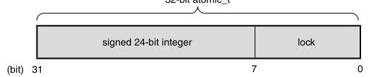
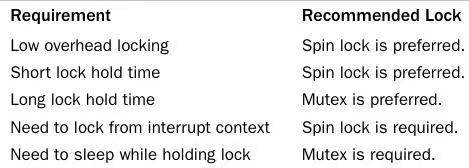
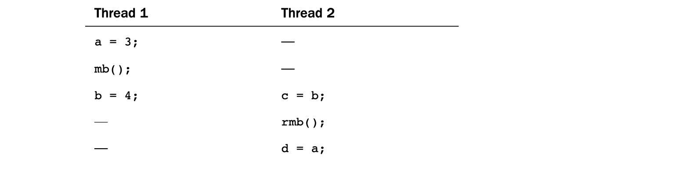
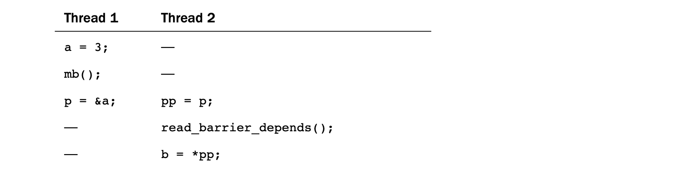

[toc]

## 10 Kernel Synchronization Methods

The previous chapter discussed the sources of and solutions to race conditions.Thank-fully, the Linux kernel provides a family of synchronization methods.The Linux kernel’ssynchronization methods enable developers to write efficient and race-free code.Thischapter discusses these methods and their interfaces, behavior, and use.

上一章讨论了竞争条件的来源以及解决方法。幸运的是，Linux 内核提供了一整套同步机制。这些同步机制使开发者能够编写高效且无竞争条件的代码。本章将讨论这些方法及其接口、行为以及使用方式。

### Atomic Operations

We start our discussion of synchronization methods with atomicoperations because they are the foundation on which other synchronization methods arebuilt. Atomic operations provide instructions that execute atomically—withoutinterruption. Just as the atom was originally thought to be an indivisible particle, atomicoperators are indivisible instruc-tions. For example, as discussed in the previouschapter, an atomic increment can read and increment a variable by one in a singleindivisible and uninterruptible step. 

我们从原子操作开始讨论同步机制，因为它们是构建其他同步方法的基础。原子操作提供的是**以原子方式执行的指令——即在执行过程中不会被中断的指令**。正如“原子”一词最初被认为是不可分割的粒子一样，原子操作也是不可分割的指令。

例如，在上一章中提到，原子自增操作可以在一个不可分割、不可中断的步骤中完成对变量的读取并加一。

It is never possible for the two atomic oper-ations to occur on the same variable concurrently.Therefore, it is not possible for thein-crements to race.

对于同一个变量，不可能同时发生两个原子操作。因此，不会出现自增操作之间的竞争条件。

The kernel provides two sets of interfaces for atomic operations—one that operates onintegers and another that operates on individual bits.These interfaces are implemented    on every architecture that Linux supports. Most architectures contain instructions thatpro-vide atomic versions of simple arithmetic operations. Other architectures, lackingdirect atomic operations, provide an operation to lock the memory bus for a singleoperation, thus guaranteeing that another memory-affecting operation cannot occursimultaneously.

内核为原子操作提供了两套接口：一套用于整数类型，另一套用于单个位（bit）。这些接口在 Linux 支持的所有体系结构上都有实现。大多数体系结构都包含能够提供简单算术运算原子版本的指令。而在一些缺乏直接原子指令的体系结构上，则会提供一种机制，在执行某个操作时锁住内存总线，从而保证在同一时间内不会有其他影响内存的操作发生。

#### Atomic Integer Operations

The atomic integer methods operate on a special data type,atomic_t.This special type is used, as opposed to having the functions work directly onthe C int type, for several rea-sons. First, having the atomic functions accept only theatomic_t type ensures that the atomic operations are used only with these special types.Likewise, it also ensures that the data types are not passed to any nonatomic functions.Indeed, what good would atomic operations be if they were not consistently used on thedata? Next, the use of atomic_tensures the compiler does not (erroneously but cleverly)optimize access to the value—it is important the atomic operations receive the correctmemory address and not an alias. Finally, use of atomic_t can hide any architecture-specific differences in its implementa-tion.The atomic_t type is defined in<linux/types.h>:

原子整数操作作用于一种特殊的数据类型——**atomic_t**。之所以使用这种特殊类型，而不是让函数直接操作 C 语言的 `int` 类型，有以下几个原因。

首先，让原子函数只接受 `atomic_t` 类型，可以确保原子操作仅用于这些特殊类型的数据。同样，这也可以确保这些数据类型不会被传递给非原子函数。确实，如果对同一数据不能始终如一地使用原子操作，那原子操作还有什么意义呢？

其次，使用 `atomic_t` 可以防止编译器（虽然是“聪明的”，但在这里可能是错误地）对该值的访问进行优化。必须保证原子操作获得的是**正确的内存地址**，而不是某种别名（alias）。

最后，使用 `atomic_t` 还可以隐藏不同体系结构在实现上的差异。

`atomic_t` 类型定义在 `<linux/types.h>` 中：

```c
typedef struct {
    volatile int counter;
} atomic_t;
```

Despite being an integer, and thus 32 bits on all the machines that Linux supports, de-velopers and their code once had to assume that an atomic_t was no larger than 24 bitsin size.The SPARC port in Linux has an odd implementation of atomic operations:A lockwas embedded in the lower 8 bits of the 32-bit int (it looked like Figure 10.1).The lockwas used to protect concurrent access to the atomic type because the SPARC archi-tecture lacks appropriate support at the instruction level. Consequently, only 24 usablebits were available on SPARC machines.Although code that assumed that the full 32-bitrange existed would work on other machines; it would have failed in strange and subtle ways on SPARC machines—and that is just rude. Recently, clever hacks have allowedSPARC to provide a fully usable 32-bit atomic_t, and this limitation is no more.

尽管它本质上是一个整数，因此在 Linux 支持的所有机器上都是 32 位的，但过去开发者及其代码不得不假设 `atomic_t` 实际可用的位数不超过 24 位。

这是因为 Linux 在 SPARC 架构上的实现方式比较特殊：在 32 位的 `int` 类型中，低 8 位被嵌入了一个锁（如图 10.1 所示）。这个锁用于保护对该原子类型的并发访问，因为 SPARC 架构在指令层面缺乏适当的支持。因此，在 SPARC 机器上实际上只有 24 位是可用的。

虽然假设完整 32 位范围的代码在其他机器上可以正常工作，但在 SPARC 上却会以奇怪而隐蔽的方式出错——这可不太友好。

最近，通过一些巧妙的技巧，SPARC 已经能够提供完整可用的 32 位 `atomic_t`，这个限制也就不再存在了。



The declarations needed to use the atomic integer operations are in <asm/atomic.h>.

使用原子整数操作所需的声明位于 `<asm/atomic.h>` 中。

Some architectures provide additional methods that are unique to that architecture, butall architectures provide at least a minimum set of operations that are used throughoutthe kernel.When you write kernel code, you can ensure that these operations arecorrectly implemented on all architectures.

某些体系结构还提供特定于该架构的额外方法，但所有架构至少都会提供一组最基本的操作，这些操作在整个内核中都会使用。因此，当你编写内核代码时，可以确保这些操作在所有体系结构上都被正确实现。

Defining an atomic_t is done in the usual manner. Optionally, you can set it to an initial value:

```c
atomic_t v; /* define v */
atomic_t u = ATOMIC_INIT(0); /* define u and initialize it to zero */
```

Operations are all simple:

```c
atomic_set(&v, 4); /* v = 4 (atomically) */
atomic_add(2, &v); /* v = v + 2 = 6(atomically) */
atomic_inc(&v); /* v = v + 1 = 7 (atomically) */
```

If you ever need to convert an atomic_t to an int, use atomic_read():

```c
printk(“%d\n”, atomic_read(&v)); /* will print “7” */
```

A common use of the atomic integer operations is to implement counters. Protecting asole counter with a complex locking scheme is overkill, so instead developers useatomic_inc() and atomic_dec(), which are much lighter in weight.

原子整数操作最常见的用途是实现计数器。为单个计数器引入复杂的锁机制实属小题大做，因此开发者会转而使用 `atomic_inc()`（原子自增）和 `atomic_dec()`（原子自减）—— 这类操作的开销要轻量得多。

Another use of the atomic integer operators is atomically performing an operation andtesting the result.A common example is the atomic decrement and test:

原子整数操作的另一类用途是**原子化地执行操作并测试结果**。一个典型案例是 “原子减一并测试”：

```c
int atomic_dec_and_test(atomic_t *v)
```

This function decrements by one the given atomic value. If the result is zero, it returnstrue; otherwise, it returns false.

该函数会将传入的原子值减一；若减一后的结果为 0，则返回真（true），否则返回假（false）。

The atomic operations are typically implemented as inline functions with inline as-sembly. In the case where a specific function is inherently atomic, the given function isusually just a macro. For example, on most architectures, a word-sized read is alwaysatomic.That is, a read of a single word cannot complete in the middle of a write to thatword.The read always returns the word in a consistent state, either before or after the write completes, but never in the middle. Consequently, atomic_read() is usually just amacro returning the integer value of the atomic_t:

原子操作通常以**内嵌汇编的内联函数**形式实现。而对于本身就具备原子性的特定操作，其对应的函数往往仅为一个宏。例如，在大多数处理器架构下，**字长读取操作**天生是原子的 —— 也就是说，对单个字（word）的读取，绝不会在该字的写入过程中中途完成。读取操作返回的始终是处于 “一致状态” 的字值：要么是写入完成前的状态，要么是写入完成后的状态，绝不会是写入中途的中间状态。因此，`atomic_read()` 通常仅为一个宏，作用是直接返回 `atomic_t` 类型变量的整数值。

```c
/*** atomic_read - read atomic variable* 
@v: pointer of type atomic_t** Atomically readsthe value of @v.*/
static inline int atomic_read(const atomic_t *v) {
    return v->counter;
}
```

**Atomicity Versus Ordering**

The preceding discussion on atomic reading begs a discussion on the differences   between atomicity and ordering. As discussed, a word-sized read always occursatomically. It never in-terleaves with a write to the same word; the read always returnsthe word in a consistent state—perhaps before the write completes, perhaps after, butnever during. For example, if an integer is initially 42 and then set to 365, a read on theinteger always returns 42 or 365 and never some commingling of the two values. We call this atomicity.

前文关于原子读取的讨论，自然引出了对**原子性（atomicity）** 与**顺序性（ordering）** 差异的探讨。如前文所述，字长读取操作始终是原子的：它绝不会与对同一个字的写入操作交错执行，读取返回的字值始终处于一致状态 —— 可能是写入完成前的状态，也可能是写入完成后的状态，但绝不会是写入过程中的中间状态。

举个例子：若一个整数初始值为 42，随后被设为 365，那么对该整数的读取操作只会返回 42 或 365，绝不会出现两个数值混合的中间值。这就是我们所说的**原子性**。

Your code, however, might have more stringent requirements than this: Perhaps yourequire that the read always occurs before the pending write. This type of requirementis not atomic-ity, but ordering. Atomicity ensures that instructions occur withoutinterruption and that they complete either in their entirety or not at all. Ordering, on theother hand, ensures that the desired, relative ordering of two or more instructions—evenif they are to occur in separate threads of execution or even separate processors—is preserved.

但你的代码可能有更严格的要求：比如你需要确保读取操作始终发生在待执行的写入操作之前。这类要求无关原子性，而是**顺序性**。

- 原子性保证指令无中断执行，且要么完整执行完毕，要么完全不执行；
- 而顺序性则保证：即便两条或多条指令运行在不同的执行线程（甚至不同处理器）上，它们之间期望的相对执行顺序也能得到维持。

The atomic operations discussed in this section guarantee only atomicity. Ordering is en-forced via barrier operations, which we discuss later in this chapter.

本节讨论的原子操作**仅能保证原子性**，而顺序性需要通过**屏障操作（barrier operations）** 来强制保障（本章后续会详细讲解屏障操作）。

In your code, it is usually preferred to choose atomic operations over more compli-cated locking mechanisms. On most architectures, one or two atomic operations incur less overhead and less cache-line thrashing than a more complicated synchronization method.As with any performance-sensitive code, however, testing multiple approaches is always smart.

在代码实现中，相较于复杂的锁机制，通常优先选择原子操作。在大多数处理器架构下，一两次原子操作带来的开销，以及 “缓存行颠簸（cache-line thrashing）” 问题，都远少于复杂的同步方法。不过对于任何性能敏感型代码，测试多种实现方案始终是明智的做法。

#### 64-Bit Atomic Operations

With the rising prevalence of 64-bit architectures, it is nosurprise that the Linux kernel developers augmented the 32-bit atomic_t type with a64-bit variant, atomic64_t. For portability, the size of atomic_t cannot change betweenarchitectures, so atomic_t is 32-bit even on 64-bit architectures. Instead, theatomic64_t type provides a 64-bit atomic integer that functions otherwise identical toits 32-bit brother. Usage is exactly the same, except that the usable range of theinteger is 64, rather than 32, bits. Nearly all the classic 32-bit atomic operations areimplemented in 64-bit variants; they are prefixed with atomic64 in lieu of atomic.Table10.2 is a full listing of the standard operations; some archi-tectures implement more,but they are not portable.As with atomic_t, the atomic64_ttype is just a simple wrapperaround an integer, this type a long:

随着 64 位架构的日益普及，Linux 内核开发者为 32 位的`atomic_t`类型补充了 64 位变体`atomic64_t`，这并不令人意外。

为了保证可移植性，`atomic_t`的大小在不同架构间不能改变，因此**即便在 64 位架构上，`atomic_t`依然是 32 位**。

而`atomic64_t`类型则提供了 64 位的原子整数，其功能与 32 位版本完全一致。用法也完全相同，唯一区别是整数的有效范围是 64 位而非 32 位。

几乎所有经典的 32 位原子操作都有对应的 64 位版本；这些 64 位操作以`atomic64_`为前缀，替代了原来的`atomic_`。

表 10.2 列出了全部标准操作；部分架构会实现更多操作，但这些扩展操作不具备可移植性。

和`atomic_t`一样，`atomic64_t`类型也只是对整数的简单封装，只不过它封装的是长整型（long）。

All 64-bit architectures provide atomic64_t and a family of arithmetic functions to operate on it. Most 32-bit architectures do not, however, support atomic64_t—x86-32is a notable exception. For portability between all Linux’s supported architectures,develop-ers should use the 32-bit atomic_t type.The 64-bit atomic64_t is reserved forcode that is both architecture-specific and that requires 64-bits.

所有 64 位架构都提供`atomic64_t`以及一系列操作它的算术函数。

但**大多数 32 位架构并不支持`atomic64_t`**——x86-32 是个值得注意的例外。

为了在 Linux 所支持的**所有架构**间保证可移植性，开发者应当使用 32 位的`atomic_t`类型。

64 位的`atomic64_t`仅用于**既和特定架构相关、又需要 64 位长度**的代码场景。

#### Atomic Bitwise Operations

In addition to atomic integer operations, the kernel alsoprovides a family of functions that operate at the bit level. Not surprisingly, they arearchitecture-specific and defined in<asm/bitops.h>.

除原子整数操作外，内核还提供了一系列**位级操作函数**。不出所料，这些函数是架构相关的，定义在 `<asm/bitops.h>` 头文件中。

What might be surprising is that the bitwise functions operate on generic memory ad-dresses.The arguments are a pointer and a bit number. Bit zero is the least significantbit of the given address. On 32-bit machines, bit 31 is the most significant bit, and bit32 is the least significant bit of the following word.There are no limitations on the bitnumber supplied; although, most uses of the functions provide a word and,consequently, a bit number between 0 and 31 on 32-bit machines and 0 and 63 on 64-bit machines.

但令人意外的是，这些位操作函数可作用于**通用内存地址**：函数的参数为一个指针和一个位编号。其中，第 0 位对应给定地址指向数据的**最低有效位（LSB）**；在 32 位机器上，第 31 位是最高有效位（MSB），而第 32 位则对应下一个内存字（word）的最低有效位。

传入的位编号**没有硬性限制**，不过在实际使用中，大多数场景都是针对单个内存字进行操作：因此 32 位机器上常用的位编号范围是 0~31，64 位机器上则是 0~63。

Because the functions operate on a generic pointer, there is no equivalent of the atomic integer’s atomic_t type. Instead, you can work with a pointer to whatever datayou want. Consider an example:

由于这类函数作用于通用指针，因此不存在类似原子整数操作中 `atomic_t` 这样的专属类型。相反，你可以直接使用指向**任意数据**的指针来调用这些函数。来看一个示例：

```c
unsigned long word = 0;
set_bit(0, &word); /* bit zero is now set (atomically) */
set_bit(1, &word); /* bit one isnow set (atomically) */
printk(“%ul\n”, word); /* will print “3” */
clear_bit(1, &word); /*bit one is now unset (atomically) */
change_bit(0, &word); /* bit zero is flipped; now it isunset (atomically) */
/* atomically sets bit zero and returns the previous value (zero) */
if (test_and_set_bit(0,&word)) {
    /* never true ... */
}
/* the following is legal; you can mix atomic bit instructions with normal C */
word = 7;
```

Conveniently, nonatomic versions of all the bitwise functions are also provided.They behave identically to their atomic siblings, except they do not guarantee atomicity, and their names are prefixed with double underscores. For example, the nonatomic form oftest_bit() is __test_bit(). If you do not require atomicity (say, for example, because a lock already protects your data), these variants of the bitwise functions might be faster.

值得一提的是，内核还提供了所有位操作函数的**非原子版本**。这些函数的行为与对应的原子版本完全一致，唯一区别是不保证原子性，且函数名以双下划线（`__`）为前缀。例如，`test_bit()` 的非原子版本是 `__test_bit()`。如果你的场景不需要原子性（比如数据已由锁保护），使用这些非原子位操作函数可能会更快。

**What the Heck Is a Nonatomic Bit Operation?**

On first glance, the concept of a nonatomic bit operation might not make any sense.Only a single bit is involved; thus, there is no possibility of inconsistency. If one of theoperations succeeds, what else could matter? Sure, ordering might be important, but weare talking about atomicity here. At the end of the day, if the bit has a value provided byany of the in-structions, we should be good to go, right?

乍一看，“非原子位操作” 这个概念似乎毫无意义。操作仅涉及单个比特位，因此按理说不存在数据不一致的可能 —— 只要其中一个操作成功了，还会有什么问题呢？当然，指令顺序或许很重要，但我们这里讨论的是原子性。说到底，只要比特位最终的值是任意一条指令设定的结果，似乎就没问题了，对吧？

Let’s jump back to just what atomicity means. Atomicity requires that either instructionssucceed in their entirety, uninterrupted, or instructions fail to execute at all. Therefore, ifyou issue two atomic bit operations, you expect two operations to succeed. After bothopera-tions complete, the bit needs to have the value as specified by the secondoperation. More-over, however, at some point in time prior to the final operation, the bitneeds to hold the value as specified by the first operation. Put more generally, realatomicity requires that all intermediate states be correctly realized.

我们不妨回头再明确一下**原子性的定义**：原子性要求指令要么完整、无中断地执行成功，要么完全不执行。因此，如果你发起两次原子位操作，预期的结果是两次操作都成功执行。两次操作全部完成后，比特位的值应与第二次操作的设定一致；而更关键的是，在最后一次操作执行前的某个时刻，比特位必须持有第一次操作设定的值。更通俗地说，真正的原子性要求**所有中间状态都能被正确呈现**。

For example, assume you issue two atomic bit operations: Initially set the bit and then          clear the bit. Without atomic operations, the bit might end up cleared, but it might neverhave been set. The set operation could occur simultaneously with the clear operationand fail. The clear operation would succeed, and the bit would emerge cleared asintended. With atomic operations, however, the set would actually occur—there wouldbe a moment in time when a read would show the bit as set—and then the clear wouldexecute and the bit would be zero.

举个例子：假设你执行两次原子位操作 —— 先置位某比特位，再清零该比特位。如果使用非原子操作，该比特位最终可能确实是清零状态，但它可能从未被成功置位过：置位操作可能与清零操作同时执行并失败，而清零操作成功执行，最终比特位如预期般清零。但如果使用原子操作，置位操作会**真正执行**（在某个时间点读取该比特位时，它会显示为置位状态），之后清零操作执行，比特位最终变为 0。

This behavior can be important, especially when ordering comes into play or whendealing with hardware registers.

这种行为可能至关重要，尤其是在涉及指令顺序，或操作硬件寄存器的场景中。

The kernel also provides routines to find the first set (or unset) bit starting at a given address:

内核还提供了从指定地址开始查找**第一个置位（或未置位）比特位**的函数：

```c
int find_first_bit(unsigned long *addr, unsigned int size)
int find_first_zero_bit(unsignedlong *addr, unsigned int size)
```

Both functions take a pointer as their first argument and the number of bits in total tosearch as their second.They return the bit number of the first set or first unset bit,respec-tively. If your code is searching only a word, the routines __ffs() and ffz(), whichtake a single parameter of the word in which to search, are optimal.

这两个函数的第一个参数是指向待查找内存的指针，第二个参数是需要查找的总比特位数；它们分别返回第一个置位比特位、第一个未置位比特位的编号。如果你的代码仅需在单个内存字（word）中查找，使用 `__ffs()` 和 `ffz()` 函数会更高效 —— 这两个函数仅接收一个参数，即待查找的内存字。

Unlike the atomic integer operations, code typically has no choice whether to use thebitwise operations—they are the only portable way to set a specific bit.The onlyquestion is whether to use the atomic or nonatomic variants. If your code is inherentlysafe from race conditions, you can use the nonatomic versions, which might be fasterdepending on the architecture.

与原子整数操作不同，在使用位操作函数时，代码通常没有其他选择 —— 它们是操作指定比特位的唯一可移植方式。唯一需要决策的是：使用原子版本还是非原子版本。如果你的代码本身不存在竞态条件风险，可使用非原子版本（具体是否更快取决于硬件架构）。

### Spin Locks

Although it would be nice if every critical region consisted of code that didnothing more complicated than incrementing a variable, reality is much crueler. In reallife, critical re-gions can span multiple functions. For example, it is often the case thatdata must be re-moved from one structure, formatted and parsed, and added toanother structure.This entire operation must occur atomically; it must not be possible for other code to readfrom or write to either structure before the update is completed. Because simple atomicoperations are clearly incapable of providing the needed protection in such a complexsce-nario, a more general method of synchronization is needed: locks.

尽管如果每个临界区都只包含变量自增这类简单代码会十分理想，但现实却残酷得多。在实际场景中，临界区往往会跨越多个函数。例如，常见的需求是将数据从一个数据结构中取出，经格式化、解析后，再插入另一个数据结构。**整个操作必须原子性完成**：在更新结束前，其他代码绝不能对这两个数据结构执行读写操作。显然，简单的原子操作无法在这种复杂场景下提供所需保护，因此需要一种更通用的同步方案：**锁**。

The most common lock in the Linux kernel is the **spin lock**.A spin lock is a lock that can be held by at most one thread of execution. If a thread of execution attempts toac-quire a spin lock while it is already held, which is called contended, the thread busyloops— spins—waiting for the lock to become available. If the lock is not contended, thethread can immediately acquire the lock and continue.The spinning prevents more thanone thread of execution from entering the critical region at any one time.The same lockcan be used in multiple locations, so all access to a given data structure, for example,can be protected and synchronized.

Linux 内核中最常用的锁是**自旋锁（spin lock）**。自旋锁是一种**同一时刻最多只能被一个执行单元持有**的锁。若一个执行单元尝试获取已被占用的自旋锁（这种情况称为**锁竞争**），该执行单元会进入**忙循环（自旋）**，持续等待锁释放；若锁无竞争，执行单元可直接获取锁并继续执行。自旋机制保证了同一时刻不会有多个执行单元进入临界区。同一个自旋锁可在多处使用，从而能统一保护并同步对某一数据结构的所有访问。

The fact that a contended spin lock causes threads to spin (essentially wastingprocessor time) while waiting for the lock to become available is salient.This behavior isthe point of the spin lock. It is not wise to hold a spin lock for a long time.This is thenature of the spin lock: a lightweight single-holder lock that should be held for shortdurations.An al-ternative behavior when the lock is contended is to put the currentthread to sleep and wake it up when it becomes available.Then the processor can go offand execute other code.This incurs a bit of overhead—most notably the two contextswitches required to switch out of and back into the blocking thread, which is certainlya lot more code than the handful of lines used to implement a spin lock.Therefore, it iswise to hold spin locks for less than the duration of two context switches. Becausemost of us have better things to do than measure context switches, just try to hold thelock for as little time as possible.1

自旋锁在竞争时会让线程自旋等待（本质上是浪费处理器时间），这是它的核心特性，也正是自旋锁的设计本意。**长时间持有自旋锁是不可取的**。自旋锁的本质是：一种轻量级独占锁，仅应**短时间持有**。

锁竞争时的另一种方案是：让当前线程休眠，锁可用时再唤醒，处理器便可去执行其他代码。但这种方式会产生开销 —— 最关键的是需要**两次上下文切换**（将阻塞线程切出、再切回），这部分开销远大于实现自旋锁的少量代码。因此，持有自旋锁的时长应**短于两次上下文切换的耗时**。我们无需刻意测量上下文切换时间，只需记住：**尽量最短时间持有锁**。

Later in this chapter we discuss semaphores, which provide a lock that makes thewaiting thread sleep, rather than spin, when contended.

本章后续会介绍**信号量（semaphores）**，它是一种锁竞争时让等待线程休眠、而非自旋的锁机制。

#### Spin Lock Methods

Spin locks are architecture-dependent and implemented inassembly.The architecture-dependent code is defined in <asm/spinlock.h>.The actualusable interfaces are defined in <linux/spinlock.h>.The basic use of a spin lock is

自旋锁是**架构相关**的，且通过汇编语言实现。与架构相关的代码定义在头文件 `<asm/spinlock.h>` 中，而实际可调用的接口则定义在 `<linux/spinlock.h>` 中。自旋锁的基本使用方式如下：

```c
DEFINE_SPINLOCK(mr_lock);
spin_lock(&mr_lock); /* critical region ... */
spin_unlock(&mr_lock);
```

The lock can be held simultaneously by at most only one thread of execution. Conse-quently, only one thread is allowed in the critical region at a time.This provides theneeded protection from concurrency on multiprocessing machines. On uniprocessorma-chines, the locks compile away and do not exist; they simply act as markers todisable and enable kernel preemption. If kernel preempt is turned off, the locks compileaway entirely.

同一时刻最多只能有一个执行单元持有该锁。因此，任何时候都仅允许一个线程进入临界区。这为多处理器机器上的并发操作提供了所需的保护。在单处理器机器上，这些锁会被**编译优化掉**（不复存在）；它们仅作为标记，用于禁用和启用内核抢占。若内核抢占功能已关闭，这些锁则会被完全编译移除。

Warning: Spin Locks Are Not Recursive!

**警告：自旋锁不支持递归！**

Unlike spin lock implementations in other operating systems and threading libraries, theLinux kernel’s spin locks are not recursive. This means that if you attempt to acquire alock you already hold, you will spin, waiting for yourself to release the lock. But becauseyou are busy spinning, you will never release the lock and you will deadlock. Be careful!

与其他操作系统和线程库中的自旋锁实现不同，Linux 内核的自旋锁**不具备递归特性**。这意味着，若你尝试获取一个已由自己持有的自旋锁，线程会进入自旋状态，等待自身释放该锁。但由于线程正处于忙自旋状态，永远不会释放锁，最终导致**死锁**。务必小心！

Spin locks can be used in interrupt handlers, whereas semaphores cannot be used be-cause they sleep. If a lock is used in an interrupt handler, you must also disable localinter-rupts (interrupt requests on the current processor) before obtaining the lock.Otherwise, it is possible for an interrupt handler to interrupt kernel code while the lockis held and at-tempt to reacquire the lock.The interrupt handler spins, waiting for thelock to become available.The lock holder, however, does not run until the interrupthandler completes. This is an example of the double-acquire deadlock discussed in theprevious chapter. Note that you need to disable interrupts only on the current processor.If an interrupt occurs on a different processor, and it spins on the same lock, it does notprevent the lock holder (which is on a different processor) from eventually releasing thelock.

自旋锁可用于中断处理程序中，而信号量则不行 —— 因为信号量会触发休眠。如果某个锁要在中断处理程序中使用，那么在获取该锁之前，必须先禁用**本地中断**（即当前处理器上的中断请求）。否则可能出现以下场景：内核代码持有锁期间，被中断处理程序打断，而该中断处理程序又尝试获取同一把锁。此时中断处理程序会自旋等待锁释放，但持有锁的内核代码要等到中断处理程序执行完毕后才能继续运行。这正是前一章讨论的 “重复获取锁导致死锁” 的典型案例。注意，只需禁用**当前处理器**上的中断即可：若中断发生在其他处理器上，且该处理器也自旋等待同一把锁，并不会阻碍持有锁的执行单元（位于另一处理器）最终释放锁。

The kernel provides an interface that conveniently disables interrupts and acquires thelock. Usage is

内核提供了一套便捷的接口，可一次性完成 “禁用中断 + 获取锁” 的操作，使用方式如下：

```c
DEFINE_SPINLOCK(mr_lock); unsigned long flags;
spin_lock_irqsave(&mr_lock, flags); /* critical region ... */
spin_unlock_irqrestore(&mr_lock, flags);
```

The routine spin_lock_irqsave()saves the current state of interrupts, disables them locally, and then obtains the given lock. Conversely, spin_unlock_irqrestore()unlocks the given lock and returns interrupts to their previous state.This way, if interrupts were initially disabled, your code would not erroneously enable them, but instead keep them disabled. Note that the flags variable is seemingly passed by value.This is because the lock routines are implemented partially as macros.

`spin_lock_irqsave()` 函数会先保存当前的中断状态，禁用本地中断，然后获取指定的锁。反之，`spin_unlock_irqrestore()` 会释放指定的锁，并将中断恢复到之前的状态。这样一来，若中断原本就是禁用状态，代码不会错误地启用中断，而是保持其禁用状态。注意，`flags` 变量表面上是**按值传递**的 —— 这是因为锁相关的接口部分以宏的形式实现。

On uniprocessor systems, the previous example must still disable interrupts to prevent an interrupt handler from accessing the shared data, but the lock mechanism is compiled away.The lock and unlock also disable and enable kernel preemption,respectively.

在单处理器系统中，上述示例仍需禁用中断（防止中断处理程序访问共享数据），但锁机制本身会被编译优化掉。此外，加锁和解锁操作还会分别禁用和启用内核抢占。

**What Do I Lock?**

It is important that each lock is clearly associated with what it is locking. Moreimportant, you should protect data and not code. Despite the examples in this chapterexplaining the importance of protecting the critical sections, it is the actual data insidethat needs protec-tion and not the code.

明确每个锁与其保护对象的关联至关重要。更核心的是，你应当**保护数据而非代码**。尽管本章中的示例都在阐释保护临界区的重要性，但真正需要保护的是临界区内的实际数据，而非代码本身。

Big Fat Rule: Locks that simply wrap code regions are hard to understand and prone torace conditions. Lock data, not code.

**核心铁律**：仅简单包裹代码段的锁不仅难以理解，还极易引发竞态条件（race conditions）。**要锁定数据，而非锁定代码**。

Rather than lock code, always associate your shared data with a specific lock. Forexample, “the struct foo is locked by foo_lock.” Whenever you access shared data,make sure it is safe. Most likely, this means obtaining the appropriate lock beforemanipulating the data and releasing the lock when finished.

永远不要锁定代码，而是将共享数据与特定的锁绑定。例如，“结构体 foo 由 foo_lock 锁保护”。每当你访问共享数据时，务必确保操作是安全的。最稳妥的做法通常是：在操作数据前获取对应的锁，操作完成后释放该锁。

If you always know before the fact that interrupts are initially enabled, there is no needto restore their previous state.You can unconditionally enable them on unlock. In those cases, spin_lock_irq() and spin_unlock_irq() are optimal:

如果你能提前确定中断初始状态为启用，那么就无需恢复其中断之前的状态，可在解锁时无条件启用中断。这种场景下，使用 `spin_lock_irq()` 和 `spin_unlock_irq()` 是最优选择：

```c
DEFINE_SPINLOCK(mr_lock);
spin_lock_irq(&mr_lock); /* critical section ... */
spin_unlock_irq(&mr_lock);
```

As the kernel grows in size and complexity, it is increasingly hard to ensure that interrupts are always enabled in any given code path in the kernel. Use ofspin_lock_irq()therefore is not recommended. If you do use it, you had better be posi-tive that interrupts were originally on or people will be upset when they expect interruptsto be off but find them on!

随着内核规模和复杂度的持续增长，要确保内核中任意代码路径下的中断始终处于启用状态变得愈发困难。因此，**不推荐使用 spin_lock_irq ()**。若你执意使用该函数，必须百分百确认中断原本就是启用状态；否则，当用户预期中断处于禁用状态却发现其被启用时，将会引发严重问题！

#### Spin Locks and Bottom Halves

As discussed in Chapter 8,“Bottom Halves and DeferringWork,” certain locking precau-tions must be taken when working with bottomhalves.The function spin_lock_bh()obtains the given lock and disables all bottomhalves.The function spin_unlock_bh()performs the inverse.

正如第 8 章《底半部与延迟工作》中所讨论的，在处理底半部时必须采取特定的锁保护措施。`spin_lock_bh()`函数会获取指定的锁，并禁用所有底半部；`spin_unlock_bh()`函数则执行反向操作（释放锁并重新启用底半部）。

Because a bottom half might preempt process context code, if data is shared between a bottom-half process context, you must protect the data in process context with both a lock and the disabling of bottom halves. Likewise, because an interrupt handler might preempt a bottom half, if data is shared between an interrupt handler and a bottom half,you must both obtain the appropriate lock and disable interrupts.

由于底半部可能会抢占进程上下文代码，若底半部与进程上下文之间共享数据，则必须同时通过**锁**和**禁用底半部**的方式，保护进程上下文中的该数据。同理，由于中断处理程序可能会抢占底半部，若中断处理程序与底半部之间共享数据，则必须同时获取对应锁并禁用中断。

Recall that two tasklets of the same type do not ever run simultaneously.Thus, there isno need to protect data used only within a single type of tasklet. If the data is sharedbe-tween two different tasklets, however, you must obtain a normal spin lock beforeaccess-ing the data in the bottom half.You do not need to disable bottom halvesbecause a tasklet never preempts another running tasklet on the same processor.

需注意：同一类型的两个 tasklet（小任务）永远不会同时运行。因此，仅在单一类型 tasklet 内部使用的数据无需额外保护。但如果数据在两个不同类型的 tasklet 之间共享，则在底半部中访问该数据前，必须获取一个普通自旋锁。无需禁用底半部 —— 因为 tasklet 不会抢占同一处理器上正在运行的其他 tasklet。

With softirqs, regardless of whether it is the same softirq type, if data is shared by softirqs, it must be protected with a lock. Recall that softirqs, even two of the sametype, might run simultaneously on multiple processors in the system.A softirq neverpreempts another softirq running on the same processor, however, so disabling bottomhalves is not needed.

对于 softirq（软中断），无论是否为同一类型的软中断，若软中断之间共享数据，都必须使用锁保护。需注意：即使是两个同一类型的软中断，也可能在系统的多个处理器上同时运行。不过，软中断不会抢占同一处理器上正在运行的其他软中断，因此无需禁用底半部。

### Reader-Writer Spin Locks

Sometimes, lock usage can be clearly divided into reader andwriter paths. For example, consider a list that is both updated and searched.When thelist is updated (written to), it is important that no other threads of executionconcurrently write to or read from the list. Writing demands mutual exclusion. On theother hand, when the list is searched (read from), it is only important that nothing else  writes to the list. Multiple concurrent readers are safe so long as there are nowriters.The task list’s access patterns (discussed in Chapter 3,“Process Management”)fit this description. Not surprisingly, a reader-writer spin lock protects the task list.

有时，锁的使用场景可以清晰地划分为**读路径**与**写路径**。例如，考虑一个既需要更新又需要查询的列表：当对列表进行更新（写操作）时，必须确保没有其他执行单元同时对该列表进行读写操作 —— 写操作要求完全互斥；而当对列表进行查询（读操作）时，仅需确保没有其他执行单元对其进行写操作即可：只要没有写操作，多个执行单元并发读取是安全的。任务列表（在第 3 章《进程管理》中讨论）的访问模式就符合这种场景，因此它由读写自旋锁保护，这也不足为奇。

When a data structure is neatly split into reader/writer or consumer/producer usage patterns, it makes sense to use a locking mechanism that provides similar semantics.Tosatisfy this use, the Linux kernel provides reader-writer spin locks. Reader-writer spinlocks provide separate reader and writer variants of the lock. One or more readers canconcurrently hold the reader lock.The writer lock, conversely, can be held by at mostone writer with no concurrent readers. Reader/writer locks are sometimes calledshared/exclusive or concurrent/exclusive locks because the lock is available in a shared(for readers) and an exclusive (for writers) form.

当一个数据结构的访问模式可以清晰划分为读 / 写或消费者 / 生产者模式时，使用语义匹配的锁机制是合理的。为满足这种需求，Linux 内核提供了**读写自旋锁（reader-writer spin lock）**。读写自旋锁提供了读锁和写锁两种独立的锁变体：

- 一个或多个读执行单元可以同时持有读锁；
- 写锁最多只能被一个写执行单元持有，且持有写锁时不允许任何读执行单元持有读锁。

读写锁有时也被称为共享 / 排他锁（shared/exclusive lock）**或**并发 / 排他锁（concurrent/exclusive lock），因为它提供了共享模式（供读执行单元使用）和排他模式（供写执行单元使用）两种形式。

Usage is similar to spin locks.The reader-writer spin lock is initialized via

读写自旋锁的使用方式与普通自旋锁类似：初始化读写自旋锁：

```c
DEFINE_RWLOCK(mr_rwlock);
```

Then, in the reader code path:

读代码路径中使用：

```c
read_lock(&mr_rwlock);
/* critical section (read only) ... */
read_unlock(&mr_rwlock);
```

Finally, in the writer code path:

写代码路径中使用：

```c
write_lock(&mr_rwlock);
/* critical section (read and write) ... */
write_unlock(&mr_lock);
```

Normally, the readers and writers are in entirely separate code paths, such as in this example.

通常，读路径和写路径会处于完全独立的代码分支中，就像这个示例一样。

Note that you cannot “upgrade” a read lock to a write lock. For example, consider this  code snippet:

注意，你无法将读锁 “升级” 为写锁。例如，考虑以下代码片段：

```c
read_lock(&mr_rwlock);
write_lock(&mr_rwlock);
```

Executing these two functions as shown will deadlock, as the write lock spins, waitingfor all readers to release the shared lock—including yourself. If you ever need to write,obtain the write lock from the start. If the line between your readers and writers is mud-dled, it might be an indication that you do not need to use reader-writer locks. In thatcase, a normal spin lock is optimal.

执行上述代码会导致死锁：写锁会进入自旋状态，等待所有读执行单元释放共享锁 —— 而当前执行单元本身就持有读锁，因此永远无法满足条件。如果你需要执行写操作，应从一开始就获取写锁。如果你的读路径和写路径边界模糊，这可能意味着你不需要使用读写锁，此时普通自旋锁是更优的选择。

It is safe for multiple readers to obtain the same lock. In fact, it is safe for the same thread to recursively obtain the same read lock.This lends itself to a useful and commonoptimization. If you have only readers in interrupt handlers but no writers, you can mixthe use of the “interrupt disabling” locks.You can use read_lock() instead ofread_lock_irqsave() for reader protection.You still need to disable interrupts for writeaccess, à la write_lock_irqsave(), otherwise a reader in an interrupt could deadlock onthe held write lock. 

多个读执行单元获取同一读锁是安全的，实际上，同一执行单元递归获取同一读锁也是安全的。这一点可以用于一个实用且常见的优化：如果你的中断处理程序中只有读操作，没有写操作，那么可以混合使用 “禁用中断” 类的锁：

- 读操作可以使用`read_lock()`而非`read_lock_irqsave()`来保护；
- 但写操作仍需使用`write_lock_irqsave()`来禁用中断，否则中断处理程序中的读操作可能会因等待已持有的写锁而死锁。

A final important consideration in using the Linux reader-writer spin locks is that theyfavor readers over writers. If the read lock is held and a writer is waiting for exclusiveac-cess, readers that attempt to acquire the lock continue to succeed.The spinningwriter does not acquire the lock until all readers release the lock.Therefore, a sufficientnumber of readers can starve pending writers.This is important to keep in mind whendesigning your locking. Sometimes this behavior is beneficial; sometimes it iscatastrophic.

使用 Linux 读写自旋锁时，最后一个需要重点注意的点是：**它是读优先的**。如果读锁已被持有，且有写执行单元在等待排他访问，此时尝试获取读锁的新读执行单元仍会成功获取锁；自旋等待的写执行单元必须等到所有读执行单元都释放读锁后，才能获取写锁。因此，足够多的读执行单元可能会导致等待的写执行单元被 “饿死”。在设计锁机制时，必须牢记这一点：这种行为有时是有益的，但有时可能会引发严重问题。

Spin locks provide a quick and simple lock.The spinning behavior is optimal for shorthold times and code that cannot sleep (interrupt handlers, for example). In cases wherethe sleep time might be long or you potentially need to sleep while holding the lock, thesemaphore is a solution.

自旋锁提供了一种快速、简单的锁机制，其自旋行为适合**持有锁时间短、且不能睡眠的代码**（例如中断处理程序）。如果持有锁的时间可能很长，或者持有锁期间可能需要睡眠，那么信号量是更合适的解决方案。

### Semaphores

Semaphores in Linux are sleeping locks.When a task attempts to acquire asemaphore that is unavailable, the semaphore places the task onto a wait queue andputs the task to sleep.The processor is then free to execute other code.When thesemaphore becomes available, one of the tasks on the wait queue is awakened so thatit can then acquire the semaphore.

Linux 中的信号量是**睡眠锁**。当一个任务尝试获取不可用的信号量时，信号量会将该任务放入等待队列，并让任务进入睡眠状态。此时处理器可以空闲出来执行其他代码；当信号量变为可用状态时，等待队列中的一个任务会被唤醒，以便它获取该信号量。

Let’s jump back to the door and key analogy.When a person reaches the door, he can grab the key and enter the room.The big difference lies in what happens when anotherdude reaches the door and the key is not available. In this case, instead of spinning, thefel-low puts his name on a list and takes a number.When the person inside the roomleaves, he checks the list at the door. If anyone’s name is on the list, he goes over tothe first name and gives him a playful jab in the chest, waking him up and allowing himto enter the room. In this manner, the key (read: semaphore) continues to ensure thatthere is only one person (read: thread of execution) inside the room (read: criticalregion) at one time. This provides better processor utilization than spin locks becausethere is no time spent busy looping, but semaphores have much greater overhead thanspin locks. Life is always a trade-off.

我们回到 “门与钥匙” 的类比：当一个人走到门口时，他可以拿起钥匙进入房间。最大的区别在于，当另一个人走到门口但钥匙不可用时，会发生什么 —— 这个人不会原地打转（自旋），而是把自己的名字写在名单上并取一个号码。当房间里的人离开时，他会查看门口的名单；如果名单上有人的名字，他会走到第一个名字对应的人身边，轻轻拍醒他并让他进入房间。

通过这种方式，钥匙（即信号量）始终确保同一时间只有一个人（即执行单元）在房间里（即临界区）。这比自旋锁的处理器利用率更高，因为没有时间浪费在忙循环上，但信号量的开销比自旋锁大得多 —— 这永远是一种权衡。

You can draw some interesting conclusions from the sleeping behavior of semaphores:

- Because the contending tasks sleep while waiting for the lock to become available, semaphores are well suited to locks that are held for a long time.
- Because a thread of execution sleeps on lock contention, semaphores must be obtained only in process context because interrupt context is not schedulable.
- You can (although you might not want to) sleep while holding a semaphore because you will not deadlock when another process acquires the same semaphore. (It willjust go to sleep and eventually let you continue.)
- You cannot hold a spin lock while you acquire a semaphore, because you might have to sleep while waiting for the semaphore, and you cannot sleep while holding aspin lock.

从信号量的睡眠特性中，我们可以得出几个关键结论：

1. 由于竞争锁的任务会在等待锁可用时进入睡眠状态，因此信号量非常适合**长时间持有**的锁场景。
2. 由于执行单元在锁竞争时会睡眠，因此信号量只能在**进程上下文**中获取 —— 因为中断上下文是不可调度的，无法进入睡眠状态。
3. 你可以（虽然不建议）在持有信号量时进入睡眠状态，因为当另一个进程获取同一个信号量时，你不会死锁（该进程只会进入睡眠，最终会让你继续执行）。
4. 你不能在持有自旋锁的同时获取信号量 —— 因为等待信号量时可能需要睡眠，而持有自旋锁时绝对不能睡眠。

These facts highlight the uses of semaphores versus spin locks. In most uses of sema-phores, there is little choice as to what lock to use. If your code needs to sleep, which isoften the case when synchronizing with user-space, semaphores are the sole solution. Itis often easier, if not necessary, to use semaphores because they allow you theflexibility of sleeping.When you do have a choice, the decision between semaphore andspin lock should be based on lock hold time. Ideally, all your locks should be held asbriefly as pos-sible.With semaphores, however, longer lock hold times are moreacceptable.Additionally, unlike spin locks, semaphores do not disable kernel preemptionand, consequently, code holding a semaphore can be preempted.This meanssemaphores do not adversely affect scheduling latency.

这些事实凸显了**信号量**与**自旋锁**在使用场景上的差异。在信号量的绝大多数应用场景中，并没有太多选择锁类型的余地。如果代码需要休眠（这在与用户态进行同步时是很常见的情况），信号量是唯一的解决方案。即便不是必须，使用信号量通常也更简便，因为它提供了休眠的灵活性。

当确实存在选择空间时，信号量与自旋锁的取舍应基于**锁的持有时间**。理想情况下，所有锁的持有时间都应尽可能短。但对于信号量而言，更长的锁持有时间是可以接受的。此外，与自旋锁不同，信号量不会禁用**内核抢占**，因此持有信号量的代码可以被抢占，这意味着信号量不会对调度延迟产生负面影响。

#### Counting and Binary Semaphores

A final useful feature of semaphores is that they can allow for an arbitrary number of si-multaneous lock holders.Whereas spin locks permit at most one task to hold the lock at a time, the number of permissible simultaneous holders of semaphores can be set at declara-tion time.This value is called the usage count or simply the count.The most common value is to allow, like spin locks, only one lock holder at a time. In this case, the count is equal to one, and the semaphore is called either a binary semaphore (because it is either held by one task or not held at all)or a mutex (because it enforces mutual exclusion).Alterna-tively, the count can be initialized to a nonzero value greater than one. In this case, the semaphore is called a counting semaphore, and it enables at most count holders of the lock at a time.Counting semaphores are not used to enforce mutual exclusion because they en-able multiple threads of execution in the critical region at once. Instead, they are used to enforce limits in certain code.They are not used much in the kernel. If you use a sema-phore, you almost assuredly want to use a mutex (a semaphore with a count of one).

信号量最后一个实用特性是：它允许多个任务**同时持有锁**，数量可任意指定。自旋锁同一时间最多只允许一个任务持有锁，而信号量允许的同时持锁任务数可在声明时设定，这个值被称为**使用计数**，简称**计数**。

最常见的取值是和自旋锁一样，同一时间仅允许一个任务持有锁。这种情况下计数值为 1，该信号量被称为**二进制信号量**（因为它要么被一个任务持有，要么未被持有），也被称为**互斥锁（mutex）**（因为它实现了互斥访问）。

反之，若计数初始化为大于 1 的非零值，该信号量即为**计数信号量**，它允许最多「计数」个任务同时持有锁。计数信号量**不用于实现互斥**（因为它允许多个执行线程同时进入临界区），而是用于对特定代码的执行做限制。这类信号量在内核中使用较少，实际使用信号量时，几乎都需要用**互斥锁**（即计数为 1 的信号量）。

Semaphores were formalized by Edsger Wybe Dijkstra3 in 1968 as a generalized lock-ing mechanism.A semaphore supports two atomic operations, P() and V(), named afterthe Dutch word Proberen, to test (literally, to probe), and the Dutch word Verhogen, toin-crement. Later systems called these methods down() and up(), respectively, and sodoes Linux.The down() method is used to acquire a semaphore by decrementing thecount by one. If the new count is zero or greater, the lock is acquired and the task canenter the critical region. If the count is negative, the task is placed on a wait queue, andthe proces-sor moves on to something else.These names are used as verbs:You down asemaphore to acquire it.The up() method is used to release a semaphore uponcompletion of a critical region.This is called upping the semaphore.The methodincrements the count value; if the semaphore’s wait queue is not empty, one of thewaiting tasks is awakened and allowed to acquire the semaphore.

信号量由艾兹格・W・迪杰斯特拉（Edsger Wybe Dijkstra）在 1968 年正式提出，是一种通用的锁机制。信号量支持两个原子操作：`P()` 和 `V()`。名称源自荷兰语：

- **Proberen**：测试（字面意为 “探测”）
- **Verhogen**：增加

后续系统将这两个操作分别命名为 `down()` 和 `up()`，Linux 也沿用了这一命名。

- **`down()` 操作**：用于获取信号量，会将计数值减 1。

  若新的计数值 ≥ 0，代表成功获取锁，任务可进入临界区；

  若计数值为负，任务会被加入**等待队列**，处理器转而执行其他任务。

  可以把这些名称当作动词：**执行 down 操作** 就是获取信号量。

- **`up()` 操作**：用于临界区执行完毕后**释放信号量**，称为**执行 up 操作**。

  该操作会将计数值加 1；若信号量的等待队列非空，会唤醒其中一个等待任务，使其能够获取信号量。

#### Creating and Initializing Semaphores

The semaphore implementation is architecture-dependent and defined in<asm/semaphore.h>.The struct semaphore type representssemaphores. Statically de-clared semaphores are created via the following, where name is the variable’s name andcount is the usage count of the semaphore:

信号量的实现与处理器架构相关，其定义位于头文件 `<asm/semaphore.h>` 中。`struct semaphore` 类型用于表示信号量。静态声明的信号量可通过以下方式创建（其中 `name` 为变量名，`count` 为信号量的使用计数）：

```c
struct semaphore name;
sema_init(&name, count);
```

As a shortcut to create the more common mutex, use the following, where, again, name is the variable name of the binary semaphore:

若要创建更常用的互斥锁（一种特殊的信号量），可使用如下快捷方式（`name` 仍为该二进制信号量的变量名）：

```c
static DECLARE_MUTEX(name);
```

More frequently, semaphores are created dynamically, often as part of a larger structure.

在实际开发中，信号量更常被**动态创建**，且往往作为更大结构体的一部分存在。

In this case, to initialize a dynamically created semaphore to which you have only anindi-rect pointer reference, just call sema_init(), where sem is a pointer and count is theus-age count of the semaphore:

这种场景下，若要初始化一个仅能通过间接指针引用的动态创建信号量，直接调用 `sema_init()` 即可（其中 `sem` 为指向信号量的指针，`count` 为信号量的使用计数）：

```c
sema_init(sem, count);
```

   Similarly, to initialize a dynamically created mutex, you can use

同理，初始化动态创建的互斥锁可使用：

```c
init_MUTEX(sem);
```

I do not know why the “mutex” in init_MUTEX() is capitalized or why the “init” comes first here but second in sema_init(). I suspect that after you read Chapter 8, theinconsistency is not surprising.

我并不清楚为何 `init_MUTEX()` 中的 “mutex” 是大写形式，也不理解为何此处是 “init” 在前，而 `sema_init()` 中却是 “init” 在后。不过我猜，当你读完第 8 章后，就不会对这种命名不一致的情况感到意外了。

#### Using Semaphores

The function down_interruptible() attempts to acquire the givensemaphore. If the semaphore is unavailable, it places the calling process to sleep in theTASK_INTERRUPTIBLEstate. Recall from Chapter 3 that this process state implies thata task can be awakened with a signal, which is generally a good thing. If the taskreceives a signal while waiting for the semaphore, it is awakened anddown_interruptible() returns -EINTR.Alterna-tively, the function down() places the taskin the TASK_UNINTERRUPTIBLE state when it sleeps.You most likely do not want thisbecause the process waiting for the semaphore does not respond to signals.Therefore,use of down_interruptible() is much more common (and correct) than down().Yes, again,the naming is not ideal.

函数 `down_interruptible()` 用于尝试获取指定的信号量：

若信号量不可用，该函数会将调用进程置于 `TASK_INTERRUPTIBLE`（可中断睡眠）状态。回顾第 3 章的内容可知，此进程状态意味着任务可被信号唤醒 —— 这通常是符合预期的行为。如果任务在等待信号量期间收到信号，它会被唤醒，且 `down_interruptible()` 会返回错误码 `-EINTR`。

与之相对，函数 `down()` 在让进程休眠时，会将其置于 `TASK_UNINTERRUPTIBLE`（不可中断睡眠）状态。你大概率不希望使用这个函数，因为处于该状态的进程在等待信号量时不会响应任何信号。因此，`down_interruptible()` 的使用远比 `down()` 普遍（且更符合规范）。没错，这些命名方式依旧算不上直观。

You can use down_trylock() to try to acquire the given semaphore without blocking.

你也可以使用 `down_trylock()` 尝试获取信号量，且**不会阻塞进程**：

If the semaphore is already held, the function immediately returns nonzero. Otherwise, itreturns zero and you successfully hold the lock.

若信号量已被持有，该函数会立即返回非零值；反之则返回零，表示你已成功获取锁。

To release a given semaphore, call up(). Consider an example:

释放指定信号量需调用 `up()` 函数。请看示例：

```c
/* define and declare a semaphore, named mr_sem, with a count of one */
static DECLARE_MUTEX(mr_sem);
/* attempt to acquire the semaphore ... */
if (down_interruptible(&mr_sem)) {
    /* signal received, semaphore not acquired ... */
}
/* critical region ... */
/* release the given semaphore */
up(&mr_sem);
```

### Reader-Writer Semaphores

Semaphores, like spin locks, also come in a reader-writerflavor.The situations where reader-writer semaphores are preferred over standardsemaphores are the same as with reader-writer spin locks versus standard spin locks.

信号量和自旋锁一样，也提供**读写**版本。选用读写信号量而非普通信号量的场景，与读写自旋锁和普通自旋锁的选用场景完全相同。

Reader-writer semaphores are represented by the struct rw_semaphore type, which is declared in <linux/rwsem.h>. Statically declared reader-writer semaphores arecreated via the following, where name is the declared name of the new semaphore:

读写信号量由 `struct rw_semaphore` 类型表示，该类型定义在 `<linux/rwsem.h>` 头文件中。静态声明的读写信号量可通过如下方式创建，其中 `name` 是新信号量的变量名：

```c
static DECLARE_RWSEM(name);
```

Reader-writer semaphores created dynamically are initialized via

动态创建的读写信号量通过以下函数初始化：

```c
init_rwsem(struct rw_semaphore *sem)
```

All reader-writer semaphores are mutexes—that is, their usage count is one—although they enforce mutual exclusion only for writers, not readers.Any number of readers can concurrently hold the read lock, so long as there are no writers. Conversely, only a sole writer (with no readers) can acquire the write variant of the lock.All reader-writer locks use uninterruptible sleep, so there is only one version of each down(). For example:

所有读写信号量本质上都是互斥量 —— 即它们的使用计数为 1—— 只不过它们**只对写者强制互斥，对读者不互斥**。只要没有写者，任意数量的读者都可以同时持有读锁；反过来，只有一个写者（且此时没有任何读者）才能获取写锁。所有读写信号量都使用**不可中断睡眠**，因此每种 `down()` 操作都只有一个版本。示例如下：

```c
static DECLARE_RWSEM(mr_rwsem);
/* attempt to acquire the semaphore for reading ... */
down_read(&mr_rwsem);
/* critical region (read only) ... */
/* release the semaphore */
up_read(&mr_rwsem);
/* ... */
/* attempt to acquire the semaphore for writing ... */
down_write(&mr_rwsem);
/* critical region (read and write) ... */
/* release the semaphore */
up_write(&mr_sem);
```

As with semaphores, implementations of down_read_trylock() and down_write_trylock() are provided. Each has one parameter: a pointer to a reader-writersemaphore.They both return nonzero if the lock is successfully acquired and zero if it iscurrently contended. Be careful: For admittedly no good reason, this is the opposite ofnormal semaphore behavior!

和普通信号量一样，内核也提供了 `down_read_trylock()` 和 `down_write_trylock()`。它们都只有一个参数：指向读写信号量的指针。**成功获取锁返回非零值，锁被争用时返回 0**。注意：这和普通信号量的返回值规则是**完全相反**的，原因不明。

Reader-writer semaphores have a unique method that their reader-writer spin lock cousins do not have: downgrade_write().This function atomically converts an acquiredwrite lock to a read lock.

读写信号量有一个读写自旋锁不具备的特有方法：`downgrade_write()`。该函数可以**原子地**把已经持有的写锁**降级**为读锁。

Reader-writer semaphores, as spin locks of the same nature, should not be used unlessa clear separation exists between write paths and read paths in your code. Supportingthe reader-writer mechanisms has a cost, and it is worthwhile only if your code naturallysplits along a reader/writer boundary.

和同类型的自旋锁一样，除非代码里**读路径和写路径有明确区分**，否则不建议使用读写信号量。支持读写机制是有开销的，只有当你的代码天然就是读写分离的，用它才划算。

### Mutexes

Until recently, the only sleeping lock in the kernel was the semaphore. Mostusers of sem-aphores instantiated a semaphore with a count of one and treated themas a mutual exclusion lock—a sleeping version of the spin lock. Unfortunately,semaphores are rather generic and do not impose many usage constraints.This makesthem useful for managing exclu-sive access in obscure situations, such as complicateddances between the kernel and user-space. But it also means that simpler locking isharder to do, and the lack of enforced rules makes any sort of automated debugging orconstraint enforcement impossible. Seeking a simpler sleeping lock, the kernel developers introduced the mutex.Yes, as you are now ac-customed to, that is aconfusing name. Let’s clarify.The term “mutex” is a generic name to refer to anysleeping lock that enforces mutual exclusion, such as a semaphore with a us-age countof one. In recent Linux kernels, the proper noun “mutex” is now also a specific type ofsleeping lock that implements mutual exclusion.That is, a mutex is a mutex.

直到不久前，内核中唯一的**睡眠锁（sleeping lock）** 仍是信号量。大多数信号量使用者都会将其计数初始化为 1，并把它当作**互斥锁（mutual exclusion lock）** 使用 —— 也就是自旋锁的 “睡眠版本”。但遗憾的是，信号量的设计过于通用，并未施加太多使用约束：这让它能应对一些特殊场景下的排他性访问管理（比如内核与用户态之间复杂的同步交互），但也导致简单的加锁操作变得繁琐；同时，由于缺乏强制的规则约束，任何形式的自动化调试或约束校验都无法实现。

为了寻求更简洁的睡眠锁，内核开发者引入了 `mutex`。没错，正如你现在已经习惯的，这个命名相当容易混淆。我们来厘清一下：

“mutex” 本是**通用术语**，指代任何实现互斥的睡眠锁（比如计数为 1 的信号量）；而在新版 Linux 内核中，专有名词 “mutex” 又特指一种**具体的睡眠锁类型**—— 即专门实现互斥功能的锁。也就是说，如今的 mutex 既是 “互斥锁” 这个通用概念的体现，也是一种内核专属的锁类型。

The mutex is represented by struct mutex. It behaves similar to a semaphore with a count of one, but it has a simpler interface, more efficient performance, and additionalconstraints on its use.To statically define a mutex, you do:

mutex 由 `struct mutex` 类型表示，其行为与计数为 1 的信号量类似，但接口更简洁、性能更高效，且对使用方式施加了额外约束。

静态定义一个 mutex 的方式如下：

```c
DEFINE_MUTEX(name);
```

To dynamically initialize a mutex, you call

动态初始化 mutex 则调用：

```c
mutex_init(&mutex);
```

Locking and unlocking the mutex is easy:

mutex 的加锁和解锁操作十分简单：

```c
mutex_lock(&mutex);
/* critical region ... */
mutex_unlock(&mutex);
```

That is it! Simpler than a semaphore and without the need to manage usage counts.

仅此而已！比信号量更简单，且无需手动管理使用计数。

The simplicity and efficiency of the mutex comes from the additional constraints it imposes on its users over and above what the semaphore requires. Unlike a semaphore,which implements the most basic of behavior in accordance with Dijkstra’s original de-sign, the mutex has a stricter, narrower use case:

- Only one task can hold the mutex at a time.That is, the usage count on a mutex is always one.
- Whoever locked a mutex must unlock it.That is, you cannot lock a mutex in one context and then unlock it in another.This means that the mutex isn’t suitable for morecomplicated synchronizations between kernel and user-space. Most use cases,however, cleanly lock and unlock from the same context.
-  Recursive locks and unlocks are not allowed.That is, you cannot recursively acquire the same mutex, and you cannot unlock an unlocked mutex.
- A process cannot exit while holding a mutex.
- A mutex cannot be acquired by an interrupt handler or bottom half, even with mutex_trylock().
- A mutex can be managed only via the official API: It must be initialized via the methods described in this section and cannot be copied, hand initialized, or reinitialized.

mutex 的简洁与高效，源于它在信号量的基础上对使用者施加了更多约束。信号量仅遵循迪杰斯特拉的原始设计，实现最基础的功能；而 mutex 的使用场景更严格、更单一，具体约束如下：

- 同一时间只能有一个任务持有 mutex。即 mutex 的使用计数始终为 1。
- 谁加的锁，必须由谁解锁。不能在一个上下文（context）中加锁，却在另一个上下文中解锁。这意味着 mutex 不适用于内核与用户态之间更复杂的同步场景，但绝大多数场景下，加锁和解锁都能在同一个上下文中完成。
- 禁止递归加锁 / 解锁。不能递归获取同一个 mutex，也不能对未加锁的 mutex 执行解锁操作。
- 进程持有 mutex 期间不允许退出。
- 中断处理程序（interrupt handler）或下半部（bottom half）无法获取 mutex，即便调用 `mutex_trylock()` 也不行。
- mutex 只能通过官方 API 管理：必须使用本节所述方法初始化，禁止拷贝、手动初始化或重新初始化。

Perhaps the most useful aspect of the new struct mutex is that, via a special debuggingmode, the kernel can programmatically check for and warn about violations of theseconstraints.When the kernel configuration option CONFIG_DEBUG_MUTEXES is enabled, a multitude of debugging checks ensure that these (and other) constraints are alwaysupheld.This enables you and other users of the mutex to guarantee a regimented, simpleusage pattern.

新版 `struct mutex` 最实用的特性或许在于：通过特殊的调试模式，内核可程序化地检测并告警上述约束的违规行为。当启用内核配置项 `CONFIG_DEBUG_MUTEXES` 时，大量调试检查机制会确保这些（及其他）约束始终被遵守。这能让你和其他 mutex 使用者始终遵循规范、简洁的使用模式。

#### Semaphores Versus Mutexes

Mutexes and semaphores are similar. Having both in thekernel is confusing.Thankfully, the formula dictating which to use is quite simple: Unlessone of mutex’s additional con-straints prevent you from using them, prefer the newmutex type to semaphores.When writing new code, only specific, often low-level, usesneed a semaphore. Start with a mu-tex and move to a semaphore only if you run intoone of their constraints and have no other alternative.

互斥锁（mutex）与信号量（semaphore）十分相似，内核中同时存在这两种锁很容易让人混淆。好在二者的选用规则非常简单：**除非互斥锁的额外约束导致你无法使用它，否则都应优先选用新版的互斥锁，而非信号量**。

编写新代码时，只有特定的、通常是底层的使用场景才需要信号量。应当以互斥锁为首选，仅当碰到互斥锁的约束限制、且没有其他替代方案时，再改用信号量。

#### Spin Locks Versus Mutexes

Knowing when to use a spin lock versus a mutex (orsemaphore) is important to writing optimal code. In many cases, however, there is littlechoice. Only a spin lock can be used in interrupt context, whereas only a mutex can be held while a task sleeps.Table 10.8 re-views the requirements that dictate which lock touse.

明确何时使用自旋锁、何时使用互斥锁（或信号量），对编写高性能代码至关重要。但在很多情况下，其实并没有多少选择空间：

**只有自旋锁可以用于中断上下文，而只有互斥锁可以在任务休眠时被持有**。

表 10.8 总结了决定选用哪种锁的各项约束条件。



### Completion Variables

Using completion variables is an easy way to synchronize betweentwo tasks in the kernel when one task needs to signal to the other that an event hasoccurred. One task waits on the completion variable while another task performs somework.When the other task has completed the work, it uses the completion variable towake up any waiting tasks. If you think this sounds like a semaphore, you are right—theidea is much the same. In fact, completion variables merely provide a simple solution toa problem whose answer is oth-erwise semaphores. For example, the vfork() system calluses completion variables to wake up the parent process when the child process execsor exits.

在内核中，当一个任务需要向另一个任务发出 “某事件已发生” 的信号时，使用完成量（completion variables）是实现两个任务间同步的简便方法。一个任务等待该完成量，而另一个任务执行相关工作；当执行工作的任务完成操作后，会通过这个完成量唤醒所有处于等待状态的任务。如果你觉得这听起来和信号量（semaphore）很像，那你的判断是对的 —— 二者的设计思路几乎一致。事实上，完成量只是为这类原本需借助信号量解决的问题提供了一种更简洁的方案。例如，vfork () 系统调用就利用完成量，在子进程执行 exec（程序替换）或退出时唤醒父进程。

Completion variables are represented by the struct completion type, which is de-fined in <linux/completion.h>.A statically created completion variable is created and initialized via

完成量由`struct completion`类型表示，该类型定义在头文件`<linux/completion.h>`中。静态创建的完成量可通过以下方式完成创建与初始化：

```c
DECLARE_COMPLETION(mr_comp);
```

A dynamically created completion variable is initialized via init_completion(). On a givencompletion variable, the tasks that want to wait call wait_for_completion().After the event has occurred, calling complete() signals all waitingtasks to wake up.

动态创建的完成量则需通过`init_completion()`函数完成初始化。针对某个特定的完成量，需要等待事件的任务会调用`wait_for_completion()`；当目标事件发生后，调用`complete()`函数即可发出信号，唤醒所有等待该完成量的任务。

A common usage is to have a completion variable dynamically created as a member of adata structure. Kernel code waiting for the initialization of the data structure callswait_for_completion().When the initialization is complete, the waiting tasks are awak-ened via a call to completion().

完成量的一种常见用法是：将其作为数据结构的成员动态创建。等待该数据结构完成初始化的内核代码会调用`wait_for_completion()`进入等待；当数据结构初始化完成后，通过调用`complete()`唤醒所有等待的任务。

### Sequential Locks

The sequential lock, generally shortened to seq lock, is a newer typeof lock introduced in the 2.6 kernel. It provides a simple mechanism for reading andwriting shared data. It works by maintaining a sequence counter.Whenever the data inquestion is written to, a lock is obtained and a sequence number is incremented. Priorto and after reading the data, the sequence number is read. If the values are the same,a write did not begin in the middle of the read. Further, if the values are even, a write isnot underway. (Grabbing the write lock makes the value odd, whereas releasing it makesit even because the lock starts at zero.)

顺序锁（通常简写为 seq 锁）是 Linux 2.6 内核中引入的一种较新的锁类型。它为共享数据的读写提供了一套简洁的机制，其核心原理是维护一个序列计数器。每当对目标数据执行写入操作时，会先获取锁并将序列计数器加 1。在读取数据的**前后**，都会读取序列计数器的值：如果两次值一致，说明读取过程中没有发生写入；此外，如果值为**偶数**，则代表当前没有写入操作正在执行。（获取写锁会让序列值变为奇数，释放写锁则恢复为偶数，这是因为锁的初始值为 0。）

To define a seq lock:

定义 seq 锁的方式如下：

```c
seqlock_t mr_seq_lock = DEFINE_SEQLOCK(mr_seq_lock);
```

The write path is then

对应的写操作流程为：

```c
write_seqlock(&mr_seq_lock); /* write lock is obtained... */
write_sequnlock(&mr_seq_lock);
```

This looks like normal spin lock code.The oddness comes in with the read path, which isquite a bit different:

这段代码看起来和普通自旋锁的写法一致，seq 锁的特殊之处体现在**读操作流程**上，二者差异十分明显：

```c
unsigned long seq; 
do {
    seq = read_seqbegin(&mr_seq_lock);
    /* read data here ... */
} while (read_seqretry(&mr_seq_lock, seq));
```

Seq locks are useful to provide a lightweight and scalable lock for use with many read-ers and a few writers. Seq locks, however, favor writers over readers.An acquisition ofthe write lock always succeeds as long as there are no other writers. Readers do notaffect the write lock, as is the case with reader-writer spin locks and semaphores.Furthermore, pending writers continually cause the read loop (the previous example) torepeat, until there are no longer any writers holding the lock.

seq 锁是一种轻量、可扩展的锁，适用于**读多写少**的场景。不过 seq 锁的设计会**优先保障写者**，而非读者。只要没有其他写者，写锁的获取就一定能成功；读者不会影响写锁的获取，这一点和读写自旋锁、信号量的特性一致。此外，只要存在等待的写者，读操作的循环（如上例）就会不断重试，直到没有写者持有该锁。

Seq locks are ideal when your locking needs meet most or all these requirements:

- Your data has a lot of readers.
- Your data has few writers.
- Although few in number, you want to favor writers over readers and never allow readers to starve writers.
- Your data is simple, such as a simple structure or even a single integer that, for whatever reason, cannot be made atomic.

当你的加锁需求满足以下**全部或绝大部分条件**时，seq 锁是理想选择：

- 数据存在大量读者
- 数据的写者数量极少
- 即便写者很少，也希望优先保障写者，绝不允许读者阻塞写者
- 数据结构简单，比如简单的结构体，甚至只是单个整型变量，但出于某些原因无法将其设计为原子变量

A prominent user of the seq lock is jiffies, the variable that stores a Linux machine’s uptime (see Chapter 11,“Timers and Time Management”). Jiffies holds a 64-bit count of the number of clock ticks since the machine booted. On machines that cannot atomi-cally read the full 64-bit jiffies_64 variable, get_jiffies_64() is implemented using seqlocks:

seq 锁的一个典型使用者是 **jiffies**—— 这个变量用于记录 Linux 机器的运行时间（详见第 11 章《定时器与时间管理》）。jiffies 以 64 位数值，记录自系统启动以来的时钟节拍数。在无法原子读取完整 64 位 `jiffies_64` 变量的机器上，`get_jiffies_64()` 函数就是通过 seq 锁实现的：

```c
u64 get_jiffies_64(void) {
    unsigned long seq;
    u64 ret;
    do {
        seq = read_seqbegin(&xtime_lock);
        ret = jiffies_64;
    } while (read_seqretry(&xtime_lock, seq)); 
    return ret;
}
```

Updating jiffies during the timer interrupt, in turns, grabs the write variant of the seq lock:

而在定时器中断中更新 jiffies 时，则会使用 seq 锁的写操作接口：

```c
write_seqlock(&xtime_lock);
jiffies_64 += 1;
write_sequnlock(&xtime_lock);
```

For a deeper discussion on jiffies and kernel time keeping, see Chapter 11 and the files kernel/timer.c and kernel/time/tick-common.c in the kernel source tree.

想要更深入地了解 jiffies 与内核时间管理机制，可以参考第 11 章，以及内核源码中的 `kernel/timer.c` 和 `kernel/time/tick-common.c` 文件。

### Preemption Disabling

Because the kernel is preemptive, a process in the kernel can stoprunning at any instant to enable a process of higher priority to run.This means a taskcan begin running in the same critical region as a task that was preempted.To preventthis, the kernel preemption code uses spin locks as markers of nonpreemptive regions.If a spin lock is held, the kernel is not preemptive. Because the concurrency issues withkernel preemption and SMP are the same, and the kernel is already SMP-safe; thissimple change makes the kernel pre-empt-safe, too.

因为内核是可抢占的，内核中的进程可以在任意时刻停止运行，以便让更高优先级的进程执行。这意味着一个任务可能会进入被抢占任务所在的同一个临界区开始运行。为避免这种情况，内核抢占代码将自旋锁用作**不可抢占区域**的标记。只要持有自旋锁，内核就不会被抢占。由于内核抢占与 SMP（对称多处理器）面临的并发问题一致，且内核本身已经是 SMP 安全的，这一简单改动也让内核具备了**抢占安全**性。

Or so we hope. In reality, some situations do not require a spin lock, but do need ker-nel preemption disabled.The most frequent of these situations is per-processor data. Ifthe data is unique to each processor, there might be no need to protect it with a lockbecause only that one processor can access the data. If no spin locks are held, thekernel is pre-emptive, and it would be possible for a newly scheduled task to access this same variable, as shown here:

至少我们希望如此。但在实际场景中，有些情况并不需要自旋锁，却需要禁用内核抢占。这类场景里最常见的就是**每处理器数据（per-processor data）**。如果数据是每个处理器独有的，就无需用锁保护，因为只有该处理器能访问这些数据。可如果此时没有持有任何自旋锁，内核就是可抢占的，新调度的任务就有可能访问同一个变量，过程如下：

task A manipulates per-processor variable foo, which is not protected by a lock task Ais preempted task B is scheduled task B manipulates variable foo task B completes

task A is rescheduled task A continues manipulating variable foo

任务 A 操作未加锁的每处理器变量 foo

任务 A 被抢占

任务 B 被调度执行

任务 B 操作变量 foo

任务 B 执行完毕

任务 A 被重新调度

任务 A 继续操作变量 foo

Consequently, even if this were a uniprocessor computer, the variable could be ac-cessed pseudo-concurrently by multiple processes. Normally, this variable would requirea spin lock (to prevent true concurrency on multiprocessing machines). If this were aper-processor variable, however, it might not require a lock.

如此一来，即便在单处理器计算机上，该变量也会被多个进程以**伪并发**的方式访问。通常这类变量需要自旋锁保护（以避免多处理器上的真正并发），但如果是每处理器变量，则可能不需要加锁。

To solve this, kernel preemption can be disabled via preempt_disable().The call is    nestable; you can call it any number of times. For each call, a corresponding call topreempt_enable() is required.The final corresponding call to preempt_enable() reen-ables preemption. For example:

为解决这个问题，可以通过 `preempt_disable()` 禁用内核抢占。该调用是**可嵌套**的，可以多次调用；每调用一次，就需要对应调用一次 `preempt_enable()`。只有最后一次配对的 `preempt_enable()` 才会重新启用抢占。例如：

```c
preempt_disable();
/* preemption is disabled ... */
preempt_enable();
```

The preemption count stores the number of held locks and preempt_disable() calls.

**抢占计数（preemption count）** 会记录当前持有的锁数量与 `preempt_disable()` 的调用次数。

If the number is zero, the kernel is preemptive. If the value is one or greater, the kernelis not preemptive.This count is incredibly useful—it is a great way to do atomicity andsleep debugging.The function preempt_count() returns this value. 

如果该值为 0，内核就是可抢占的；如果大于等于 1，内核则不可抢占。这个计数非常有用，是实现原子性操作和睡眠调试的重要手段。函数 `preempt_count()` 会返回该计数值。

As a cleaner solution to per-processor data issues, you can obtain the processor number (which presumably is used to index into the per-processor data) via get_cpu().This function disables kernel preemption prior to returning the current processor number:

针对每处理器数据的问题，更简洁的方案是通过 `get_cpu()` 获取处理器编号（该编号通常用于索引每处理器数据）。该函数会在返回当前处理器编号前，先禁用内核抢占：

```c
int cpu;
/* disable kernel preemption and set “cpu” to the current processor */
cpu = get_cpu();
/* manipulate per-processor data ... */
/* reenable kernel preemption, “cpu” can change and so is no longer valid */
put_cpu();
```

### Ordering and Barriers

When dealing with synchronization between multiple processorsor with hardware de-vices, it is sometimes a requirement that memory-reads (loads)and memory-writes (stores) issue in the order specified in your program code.Whentalking with hardware, you often need to ensure that a given read occurs before anotherread or write.Addition-ally, on symmetrical multiprocessing systems, it might beimportant for writes to appear in the order that your code issues them (usually to ensuresubsequent reads see the data in the same order). Complicating these issues is the factthat both the compiler and the processor can reorder reads and writes4 forperformance reasons.Thankfully, all processors that do reorder reads or writes providemachine instructions to enforce ordering require-ments. It is also possible to instructthe compiler not to reorder instructions around a given point.These instructions arecalled barriers.

在处理多处理器之间或与硬件设备之间的同步问题时，有时会要求内存读（加载）和内存写（存储）操作严格按照程序代码指定的顺序执行。与硬件交互时，你经常需要确保某一次读操作发生在另一次读或写操作之前。此外，在对称多处理器系统中，保证写操作按照代码发出的顺序生效（通常是为了确保后续的读操作能按相同顺序看到数据）也十分重要。让这些问题变得复杂的是，编译器和处理器都会出于性能考虑对读写操作进行重排。值得庆幸的是，所有会重排读写操作的处理器都提供了强制顺序约束的机器指令，我们也可以通过指令告知编译器不要在指定位置对指令进行重排。这类指令被称为**屏障（barriers）**。

Essentially, on some processors the following code may allow the processor to store thenew value in b before it stores the new value in a:

在某些处理器上，下面这段代码在执行时，处理器**有可能**会先把新值存入变量 `b`，再存入变量 `a`：

```c
a = 1;
b = 2;
```

Both the compiler and processor see no relation between a and b.The compiler wouldperform this reordering at compile time; the reordering would be static, and theresulting object code would simply set b before a.The processor, however, couldperform the re-ordering dynamically during execution by fetching and dispatchingseemingly unrelated instructions in whatever order it feels is best.The vast majority ofthe time, such reorder-ing is optimal because there is no apparent relation between aand b. Sometimes the pro-grammer knows best, though.

编译器和处理器都无法感知到 `a` 和 `b` 之间存在关联。编译器会在编译时完成这种重排，属于静态重排，生成的目标代码会直接先给 `b` 赋值，再给 `a` 赋值。而处理器则会在执行期间动态重排，以它认为最优的顺序取指和执行这些看似无关的指令。绝大多数情况下，这种重排都是最优的，因为 `a` 和 `b` 之间没有明显关联。但有些时候，程序员比编译器和处理器更清楚实际需求。

Although the previous example might be reordered, the processor would never reorderwrites such as the following because there is clearly a data dependency between a andb:

尽管上面的例子可能被重排，但处理器永远不会对下面这类写操作进行重排，因为 `a` 和 `b` 之间存在明确的数据依赖：

```c
a = 1;
b = a;
```

Neither the compiler nor the processor, however, knows about code in other contexts.

然而，编译器和处理器都无法感知到**其他上下文**中的代码逻辑。

Occasionally, it is important that writes are seen by other code and the outside world inthe specific order you intend.This is often the case with hardware devices but is alsocommon on multiprocessing machines.

有些场景下，必须保证写操作按照你期望的特定顺序被其他代码和外部设备感知，与硬件设备交互时通常如此，在多处理器机器上也很常见。

The rmb() method provides a read memory barrier. It ensures that no loads are re- ordered across the rmb() call.That is, no loads prior to the call will be reordered to after the call, and no loads after the call will be reordered to before the call.

`rmb()` 函数提供**读内存屏障**。它确保所有加载操作不会跨越 `rmb()` 调用被重排。也就是说，调用前的加载操作不会被重排到调用之后，调用后的加载操作也不会被重排到调用之前。

The wmb() method provides a write barrier. It functions in the same manner as rmb(), but with respect to stores instead of loads—it ensures no stores are reordered across the barrier.

`wmb()` 函数提供**写内存屏障**。它的作用与 `rmb()` 相同，只是作用对象是存储操作而非加载操作 —— 它确保所有存储操作不会跨越该屏障被重排。

The mb() call provides both a read barrier and a write barrier. No loads *or* stores will be reordered across a call to mb(). It is provided because a single instruction (often the same instruction used by rmb()) can provide both the load and store barrier.

`mb()` 调用同时提供读屏障和写屏障。所有加载**或**存储操作都不会跨越 `mb()` 调用被重排。提供该接口是因为单条指令（通常与 `rmb()` 使用的指令相同）就可以同时实现加载和存储屏障。

A variant of rmb(), read_barrier_depends(), provides a read barrier but *only for loads on which subsequent loads depend*.All reads prior to the barrier are guaranteed to complete before any reads after the barrier that depend on the reads prior to the barrier. Got it? Basically, it enforces a read barrier, similar to rmb(), but only for certain reads—those that depend on each other. On some architectures, read_barrier_depends() is much quicker than rmb() because it is not needed and is, thus, a *noop*.

`rmb()` 的一个变体 `read_barrier_depends()`，是**仅针对存在依赖关系的后续加载操作**的读屏障。屏障之前的所有读操作，都会保证在屏障之后**依赖于前者**的读操作开始前完成。简单来说，它和 `rmb()` 类似，也是强制读屏障，但只作用于特定的、存在相互依赖关系的读操作。在某些架构上，`read_barrier_depends()` 比 `rmb()` 快得多，因为这些架构并不需要它，因此它只是一个空操作。

Let’s consider an example using mb() and rmb().The initial value of a is one, and the initial value of b is two.

我们来看一个使用 `mb()` 和 `rmb()` 的例子。变量 `a` 初始值为 1，变量 `b` 初始值为 2。



Without using the memory barriers, on some processors it is possible for c to receive the new value of b, whereas d receives the old value of a. For example, c could equalfour (what you’d expect), yet d could equal one (not what you’d expect). Using the mb()en-sured that a and b were written in the intended order, whereas the rmb() insured c  and dwere read in the intended order.

如果不使用内存屏障，在某些处理器上，可能会出现变量 `c` 拿到了 `b` 的新值，而变量 `d` 却拿到了 `a` 的旧值的情况。例如，`c` 可能等于 4（符合预期），但 `d` 却等于 1（不符合预期）。使用 `mb()` 可以保证 `a` 和 `b` 按预期顺序写入，而 `rmb()` 则保证 `c` 和 `d` 按预期顺序读取。

This sort of reordering occurs because modern processors dispatch and commit in-structions out of order, to optimize use of their pipelines.What can end up happening inthe previous example is that the instructions associated with the loads of b and a occurout of order.The rmb()and wmb() functions correspond to instructions that tell theprocessor to commit any pending load or store instructions, respectively, beforecontinuing.

这种重排之所以会发生，是因为现代处理器为了优化流水线利用率，会乱序派发和提交指令。在上面的例子中，最终可能导致读取 `b` 和 `a` 的相关指令乱序执行。`rmb()` 和 `wmb()` 函数对应的指令会分别告知处理器，在继续执行前，先完成所有待处理的加载或存储指令。

Let’s look at a similar example, but one that uses read_barrier_depends() instead of rmb(). In this example, initially a is one, b is two, and p is &b.

我们再看一个类似的例子，不过这里用 `read_barrier_depends()` 代替 `rmb()`。在这个例子中，初始值：`a = 1`，`b = 2`，`p = &b`。



Again, without memory barriers, it would be possible for b to be set to pp before pp was set to p.The read_barrier_depends(), however, provides a sufficient barrier be- cause the load of *pp depends on the load of p. It would also be sufficient to use rmb() here, but because the reads are data dependent, we can use the potentially faster read_barrier_depends(). Note that in either case, the mb() is required to enforce the intended load/store ordering in the left thread.

同样，如果不使用内存屏障，可能会出现 `pp` 被赋值为 `p` 之前，`b` 就先被赋值为 `*pp` 的情况。而 `read_barrier_depends()` 在这里就足以充当有效屏障，因为对 `*pp` 的读取依赖于对 `p` 的读取。这里使用 `rmb()` 也可以，但因为读操作存在数据依赖，我们可以使用性能可能更高的 `read_barrier_depends()`。注意无论使用哪种，左侧线程中都必须用 `mb()` 来保证预期的加载 / 存储顺序。

The macros smp_rmb(), smp_wmb(), smp_mb(), and smp_read_barrier_depends() provide a useful optimization. On SMP kernels they are defined as the usual memory barriers, whereas on UP kernels they are defined only as a compiler barrier.You can use these SMP variants when the ordering constraints are specific to SMP systems.

宏 `smp_rmb()`、`smp_wmb()`、`smp_mb()` 和 `smp_read_barrier_depends()` 提供了实用的优化。在 SMP 内核中，它们被定义为普通的内存屏障；而在 UP（单处理器）内核中，它们仅被定义为编译器屏障。当顺序约束仅针对 SMP 系统时，可以使用这些 SMP 变体。

The barrier() method prevents the compiler from optimizing loads or stores across the call.The compiler knows not to rearrange stores and loads in ways that would change the effect of the C code and existing data dependencies. It does not have knowledge, however, of events that can occur outside the current context. For example, the compiler cannot know about interrupts that might read the same data you are writing. For this rea- son, you might want to ensure a store is issued before a load, for example.The previous memory barriers also function as compiler barriers, but a compiler barrier is much lighter in weight than a memory barrier. Indeed, a compiler barrier is practically free, because it simply prevents the compiler from *possibly* rearranging things.

`barrier()` 函数会阻止编译器跨越该调用对加载或存储操作进行优化。编译器知道不能以改变 C 代码效果和现有数据依赖的方式重排读写操作，但它无法感知当前上下文之外可能发生的事件。例如，编译器不知道中断程序可能会读取你正在写入的数据。出于这个原因，你可能需要确保某一次存储操作先于某一次加载操作执行。前面提到的内存屏障同时也能作为编译器屏障，但编译器屏障比内存屏障轻量得多。实际上，编译器屏障几乎没有开销，因为它只是阻止编译器**可能**进行的指令重排。

Note that the actual effects of the barriers vary for each architecture. For example, if amachine does not perform out-of-order stores (for example, Intel x86 processors donot), wmb() does nothing.You can use the appropriate memory barrier for the worstcase (that is, the weakest ordering processor) and your code will compile optimally foryour architecture.

需注意，内存屏障的实际作用会因处理器架构的不同而有所差异。例如，若某类处理器不执行乱序存储操作（比如英特尔 x86 处理器就不会这么做），那么 `wmb()` 不会产生任何作用。你只需针对最坏情况（即内存顺序约束最弱的处理器）使用对应的内存屏障，代码就会针对目标架构编译出最优的结果。
