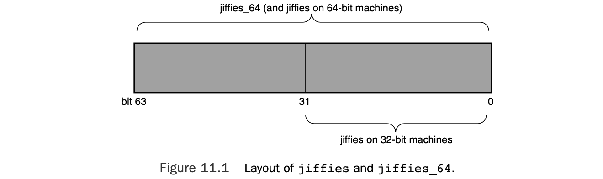

## 11 Timers and Time Management

The passing of time is important to the kernel.A large number of kernel functions aretime-driven, as opposed to event-driven.1 Some of these functions are periodic, suchas balancing the scheduler runqueues or refreshing the screen.They occur on a fixedsched-ule, such as 100 times per second.The kernel schedules other functions, such asdelayed disk I/O, at a relative time in the future. For example, the kernel might schedulework for 500 milliseconds from now. Finally, the kernel must also manage the systemuptime and the current date and time.

时间的流逝对内核至关重要。内核的大量功能都是**时间驱动**的，而非事件驱动。其中一部分功能是周期性执行的，例如平衡调度器运行队列、刷新屏幕等，它们会以固定的频率运行，比如每秒 100 次。内核还会在未来某个相对时间点调度另一些任务，例如延迟磁盘 I/O。举个例子，内核可以把一项工作安排在 500 毫秒之后执行。最后，内核还必须管理系统运行时间、当前日期和时钟。

Note the differences between relative and absolute time. Scheduling an event for 5 seconds in the future requires no concept of the absolute time—only the relative time(for example, 5 seconds from now). Conversely, managing the current time of dayrequires the kernel to understand not just the passing of time but also some absolutemeasurement of it. Both of these concepts are crucial to the management of time.

注意**相对时间**与**绝对时间**的区别。将一个事件安排在 5 秒后执行，不需要绝对时间的概念，只需要相对时间即可（也就是从现在起再过 5 秒）。相反，管理当前时刻，不仅要求内核知道时间的流逝，还需要某种绝对的计量方式。这两种概念对时间管理都至关重要。

Moreover, the implementation differs between how events that occur periodically andevents the kernel schedules for a fixed point in the future are handled. Events that occurperiodically—say, every 10 milliseconds—are driven by the system timer.The systemtimer is a programmable piece of hardware that issues an interrupt at a fixedfrequency.The in-terrupt handler for this timer—called the timer interrupt—updates thesystem time and performs periodic work.The system timer and its timer interrupt arecentral to Linux and a large focus of this chapter.

此外，**周期性事件**与**内核在未来固定时间点调度的事件**，二者的实现方式也不相同。周期性事件 —— 比如每 10 毫秒发生一次 —— 由**系统定时器**驱动。系统定时器是一块可编程硬件，会以固定频率产生中断。该定时器的中断处理程序被称为**定时器中断**，它负责更新系统时间，并执行周期性工作。系统定时器及其定时器中断是 Linux 的核心机制，也是本章的重点内容之一。

The other focus of this chapter is dynamic timers, the facility used to schedule events that run once after a specified time has elapsed. For example, the floppy device driveruses a timer to shut off the floppy drive motor after a specified period of inactivity.Thekernel can create and destroy timers dynamically.This chapter covers the kernelimplementation of dynamic timers, and the interface available for their use in your code.

本章的另一个重点是**动态定时器**，这是一种用于将事件调度到指定时间后**只执行一次**的机制。例如，软驱设备驱动会使用一个定时器，在设备空闲一段时间后关闭软驱电机。内核可以动态地创建和销毁定时器。本章会讲解内核中动态定时器的实现，以及在代码中使用它们的接口。

### Kernel Notion of Time

Certainly, the concept of time to a computer is a bit obscure.Indeed, the kernel must work with the system’s hardware to comprehend and managetime.The hardware pro-vides a system timer that the kernel uses to gauge the passingof time.This system timer works off of an electronic time source, such as a digital clockor the frequency of the processor.The system timer goes off (often called hitting orpopping) at a preprogrammed frequency, called the tick rate.When the system timergoes off, it issues an interrupt that the kernel handles via a special interrupt handler.

当然，时间这个概念对于计算机而言有些抽象。

实际上，内核必须与系统硬件协同工作，才能理解并管理时间。硬件会提供一个**系统定时器**，内核依靠它来计量时间的流逝。这个系统定时器基于电子时间源工作，比如数字时钟或处理器的主频。

系统定时器会以预先设定好的频率（称为**节拍率**）触发（通常称作命中或弹出）。当系统定时器触发时，会产生一个中断，内核通过专门的中断处理程序来处理该中断。

Because the kernel knows the preprogrammed tick rate, it knows the time between any two successive timer interrupts.This period is called a tick and is equal to 1/(tickrate) seconds.This is how the kernel keeps track of both wall time and system uptime.Wall time—the actual time of day—is important to user-space applications.The kernelkeeps track of it simply because the kernel controls the timer interrupt.A family of sys-tem calls provides the date and time of day to user-space.The system uptime—therelative time since the system booted—is useful to both kernel-space and user-space.Alot of code must be aware of the passing of time.The difference between two uptimereadings— now and then—is a simple measure of this relativity.

由于内核知晓预先设定的节拍率，因此它能知道任意两次连续定时器中断之间的时间间隔。这段时长被称为**节拍**，等于 1 / 节拍率 秒。内核正是通过这种方式来维护**墙上时间**和**系统运行时间**。

墙上时间（即实际的当日时间）对用户空间应用程序至关重要，内核之所以维护它，仅仅是因为内核控制着定时器中断。一系列系统调用会向用户空间提供日期和当日时间。

系统运行时间（即系统启动以来的相对时长）对内核空间和用户空间都很有用。大量代码都需要感知时间的流逝，两次系统运行时间读数（当前时间与过去某一时间）的差值，就是对这种相对时间的简单计量。

The timer interrupt is important to the management of the operating system.A large number of kernel functions live and die by the passing of time. Some of the work exe-cuted periodically by the timer interrupt includes

- Updating the system uptime
- Updating the time of day
- On an SMP system, ensuring that the scheduler runqueues are balanced and, if not, balancing them (as discussed in Chapter 4,“Process Scheduling”)
- Running any dynamic timers that have expired
- Updating resource usage and processor time statistics

定时器中断对操作系统的管理至关重要。大量内核功能的执行都依赖于时间的流逝。定时器中断会周期性执行的部分工作包括：

- 更新系统运行时间
- 更新当日时间
- 在对称多处理器（SMP）系统中，确保调度器运行队列处于均衡状态，若不均衡则进行均衡处理（详见第 4 章《进程调度》）
- 运行所有已到期的动态定时器
- 更新资源使用情况与处理器时间统计

Some of this work occurs on *every* timer interrupt—that is, the work is carried out with the frequency of the tick rate. Other functions execute periodically but only every *n* timer interrupts.That is, these functions occur at some fraction of the tick rate.The sec- tion “The Timer Interrupt Handler” looks at the timer interrupt handler.

这些工作中，一部分会在**每次**定时器中断时执行 —— 即以节拍率的频率运行。另一些功能则周期性执行，但仅每隔 n 次定时器中断才运行一次，也就是说，这些功能的执行频率是节拍率的若干分之一。“定时器中断处理程序” 一节会对定时器中断处理程序进行介绍。

### The Tick Rate: HZ

The frequency of the system timer (the tick rate) is programmed onsystem boot based on a static preprocessor define, HZ.The value of HZ differs for eachsupported architecture. On some supported architectures, it even differs betweenmachine types.

系统定时器的频率（即节拍率），是在系统启动时基于静态预处理器定义 `HZ` 完成配置的。`HZ` 的取值因支持的架构而异，在部分架构上，甚至不同机器类型的 `HZ` 值也不相同。

The kernel defines the value in <asm/param.h>.The tick rate has a frequency of HZ hertz and a period of 1/HZ seconds. For example, by default the x86 architecture defines HZ to be 100.Therefore, the timer interrupt on i386 has a frequency of 100HZ and occurs 100 times per second (every one-hundredth of a second, which is every 10 milliseconds). Other common values for HZ are 250 and 1000, corresponding to periods of 4ms and 1ms, respectively.Table 11.1 is a complete listing of the supported architectures and their defined tick rates.

内核在 `<asm/param.h>` 头文件中定义了该值。节拍率的频率为 `HZ` 赫兹，周期为 1/`HZ` 秒。例如，x86 架构默认将 `HZ` 定义为 100，因此 i386 架构下的定时器中断频率为 100 赫兹，每秒触发 100 次（即每 1/100 秒，也就是每 10 毫秒触发一次）。`HZ` 其他常见取值还有 250 和 1000，分别对应 4 毫秒和 1 毫秒的中断周期。表 11.1 完整列出了所有支持的架构及其定义的节拍率。

When writing kernel code, never assume that HZ has any given value.This is not a common mistake these days because so many architectures have varying tick rates. In the past, however, Alpha was the only architecture with a tick rate not equal to 100Hz, and it was common to see code incorrectly hard-code the value 100 when the HZ value should have been used. Examples of using HZ in kernel code are shown later.

编写内核代码时，**切勿假定 `HZ` 为某个固定值**。如今这已不是常见错误，因为众多架构的节拍率各不相同。但在过去，Alpha 是唯一节拍率不等于 100Hz 的架构，当时代码中经常出现本应使用 `HZ` 宏，却错误地将数值 100 硬编码的问题。后续会展示 `HZ` 在内核代码中的使用示例。

The frequency of the timer interrupt is important.As you already saw,the timer inter- rupt performs a lot of work. Indeed, the kernel’s entire notion of time derives from the periodicity of the system timer. Picking the right value, like a successful relationship, is all about compromise.

定时器中断的频率至关重要。如前文所述，定时器中断会执行大量工作，事实上，内核整个时间概念都源于系统定时器的周期性。选择合适的 `HZ` 值，就像一段成功的关系，关键在于**权衡**。

#### The Ideal HZ Value

Starting with the initial version of Linux, the i386 architecture hashad a timer interrupt frequency of 100 Hz. During the 2.5 development series, however,the frequency was raised to 1000 Hz and was (as such things are)controversial.Although the frequency is again 100 Hz, it is now a configuration option,allowing users to compile a kernel with a custom HZ value. Because so much of thesystem is dependent on the timer interrupt, changing its frequency has a reasonableimpact on the system. Of course, there are pros and cons to larger versus smaller HZvalues.

从 Linux 最初版本开始，i386 架构的定时器中断频率就一直是 100 Hz。

然而在 2.5 开发版系列中，该频率被提升到了 1000 Hz，这一改动（这类改动向来如此）也引发了争议。

尽管现在频率又回到了 100 Hz，但它已经变成一个**可配置选项**，允许用户在编译内核时自定义 HZ 值。

由于系统中大量逻辑都依赖定时器中断，修改其频率会对系统产生明显影响。当然，HZ 值设大或设小，各有利弊。

Increasing the tick rate means the timer interrupt runs more frequently. Consequently,the work it performs occurs more often.This has the following benefits:

- The timer interrupt has a higher resolution and, consequently, all timed events have a higher resolution.
- The accuracy of timed events improves.

提高节拍率意味着定时器中断触发得更频繁，相应地，它所执行的工作也会更频繁地运行。这会带来以下好处：

- 定时器中断的分辨率更高，因此所有定时事件的分辨率也更高。
- 定时事件的精确度得到提升。

The resolution increases by the same factor as the tick rate increases. For example, the granularity of timers with HZ=100 is 10 milliseconds. In other words, all periodic events occur along the timer interrupt’s 10 millisecond period and no finer *precision*2 is guaran- teed.With HZ=1000, however, resolution is 1 millisecond—10 times finer.Although kernel code can create timers with 1-millisecond resolution, there is no guarantee the precision afforded with HZ=100 is sufficient to execute the timer on anything better than 10-mil- lisecond intervals.

分辨率的提升倍数，与节拍率的提升倍数一致。例如，HZ=100 时，定时器的粒度是 10 毫秒。也就是说，所有周期性事件都只能按照定时器中断 10 毫秒的周期来触发，无法保证更精细的精度。而在 HZ=1000 时，分辨率为 1 毫秒，精度高了 10 倍。尽管内核代码可以创建分辨率为 1 毫秒的定时器，但在 HZ=100 的前提下，并不能保证定时器能以优于 10 毫秒的间隔来执行。

Likewise, accuracy improves in the same manner. Assuming the kernel starts timers at random times, the average timer is off by half the period of the timer interrupt because timers might expire at any time, but are executed only on occurrences of the timer inter- rupt. For example, with HZ=100, the average event occurs +/– 5 milliseconds off from the desired time.Thus, error is 5 milliseconds on average.With HZ=1000, the average error drops to 0.5 milliseconds—a tenfold improvement.

同样，定时精度也以同样的方式提升。假设内核在随机时间启动定时器，定时器的平均误差约为定时器中断周期的一半 ——因为定时器可能在任意时刻到期，但只会在定时器中断发生时才被执行。例如，HZ=100 时，事件平均会比预期时间偏差 ±5 毫秒，平均误差为 5 毫秒。而 HZ=1000 时，平均误差降到 0.5 毫秒，精度提升了 10 倍。

#### Advantages with a Larger HZ

This higher resolution and greater accuracy provides multiple advantages:

- Kernel timers execute with finer resolution and increased accuracy. (This provides a large number of improvements, one of which is the following.)
- System calls such as poll()and select()that optionally employ a timeout value execute with improved precision.
- Measurements, such as resource usage or the system uptime, are recorded with a finer resolution.
- Process preemption occurs more accurately.

更高的时间分辨率与精确度，带来了诸多优势：

- 内核定时器能以更精细的分辨率、更高的精确度运行。（这一改进带来了大量优化，下文便是其中之一。）
- 诸如 `poll()`、`select()` 这类支持设置超时时间的系统调用，执行精度得到提升。
- 资源使用率、系统运行时间等统计数据，会以更高的分辨率被记录。
- 进程抢占的触发更加精准。

Some of the most readily noticeable performance benefits come from the improved precision of poll() and select() timeouts.The improvement might be quite large; an application that makes heavy use of these system calls might waste a great deal of time waiting for the timer interrupt, when, in fact, the timeout has actually expired. Remember, the average error (that is, potentially wasted time) is half the period of the timer interrupt.

其中最直观的性能收益，来自 `poll()` 和 `select()` 超时精度的改善。这种提升可能非常显著：大量使用这类系统调用的应用，原本常常会在超时实际已到期后，还白白等待定时器中断触发。要记住，平均误差（也就是潜在被浪费的时间）等于定时器中断周期的一半。

Another benefit of a higher tick rate is the greater accuracy in process preemption, which results in decreased scheduling latency. Recall from Chapter 4 that the timer inter- rupt is responsible for decrementing the running process’s timeslice count.When the count reaches zero, need_resched is set and the kernel runs the scheduler as soon as pos- sible. Now assume a given process is running and has 2 milliseconds of its timeslice re- maining. In 2 milliseconds, the scheduler *should* preempt the running process and begin executing a new process. Unfortunately, this event does not occur until the next timer in- terrupt,which might not be in 2 milliseconds.At worst the next timer interrupt might be 1/HZ of a second away! With HZ=100, a process can get nearly 10 extra milliseconds to run. Of course, this all balances out and fairness is preserved, because all tasks receive the same imprecision in scheduling—but that is not the issue.The problem stems from the la- tency created by the delayed preemption. If the to-be-scheduled task had something time-sensitive to do, such as refill an audio buffer, the delay might not be acceptable. In- creasing the tick rate to 1000Hz lowers the worst-case scheduling overrun to just 1 mil- lisecond, and the average-case overrun to just 0.5 milliseconds.

更高节拍率的另一项好处，是**进程抢占**的精确度更高，进而降低**调度延迟**。回顾第 4 章的内容：定时器中断负责递减当前运行进程的时间片计数。当计数归零时，内核会设置 `need_resched` 标志，并尽快运行调度器。

假设某个进程正在运行，其时间片还剩 2 毫秒。理论上，2 毫秒后调度器就应当抢占该进程，开始执行新进程。但遗憾的是，这一操作必须等到下一次定时器中断才会发生，而下一次中断未必会在 2 毫秒后到来。最糟糕的情况下，下一次定时器中断可能要等 1/HZ 秒才会触发！

在 HZ=100 时，一个进程可能会多运行近 10 毫秒。当然，从全局来看这种偏差会相互抵消，调度的公平性依然能保证 —— 因为所有任务都会面临同样的调度精度问题，但这不是问题的核心。真正的麻烦来自**延迟抢占带来的调度时延**。如果待调度的任务是时间敏感型工作，比如填充音频缓冲区，这种延迟就无法接受。

将节拍率提升到 1000Hz 后，调度超时的最坏情况仅为 1 毫秒，平均超时误差也只有 0.5 毫秒。

#### Disadvantages with a Larger **HZ**

Now, there must be *some* downside to increasing the tick rate, or it would have been 1000Hz (or even higher) to start. Indeed, there is one large issue: A higher tick rate im- plies more frequent timer interrupts, which implies higher overhead, because the proces- sor must spend more time executing the timer interrupt handler.The higher the tick rate, the more time the processor spends executing the timer interrupt.This adds up to not just less processor time available for other work, but also a more frequent thrashing of the processor’s cache and increase in power consumption.The issue of the overhead’s impact is debatable.A move from HZ=100 to HZ=1000 clearly brings with it ten times greater overhead. However, how substantial is the overhead to begin with? The final agreement is that, at least on modern systems, HZ=1000 does not create unacceptable overhead and the move to a 1000Hz timer has not hurt performance too much. Nevertheless, it is possible in 2.6 to compile the kernel with a different value for HZ.3

那么，提高时钟节拍率必然存在**某些**弊端，否则系统一开始就会采用 1000Hz（甚至更高）的节拍率。事实上，确实存在一个核心问题：更高的节拍率意味着更频繁的定时器中断，进而带来更高的开销 —— 因为处理器需要花费更多时间执行定时器中断处理程序。

节拍率越高，处理器用于执行定时器中断的时间就越多。这最终导致的不仅是处理器可用于其他任务的时间减少，还会造成处理器缓存更频繁的抖动，同时增加功耗。

这种开销带来的影响究竟有多大，其实存在争议。将内核参数 HZ 从 100 调整为 1000，显然会使开销增加 10 倍。但问题是，这种开销本身的量级究竟如何？业界最终的共识是：至少在现代系统上，将 HZ 设为 1000 并不会产生无法接受的开销，切换到 1000Hz 的时钟节拍也不会对性能造成太大影响。尽管如此，在 Linux 2.6 内核中，仍可以通过编译配置为 HZ 指定不同的数值。

>**A Tickless OS**

> You might wonder whether an operating system even needs a fixed timer interrupt. Although that has been the norm for 40 years, with nearly all general-purpose operating systems em- ploying a timer interrupt similar to the system described in this chapter, the Linux kernel sup- ports an option known as a *tickless operation*. When a kernel is built with the CONFIG_HZ configuration option set, the system dynamically schedules the timer interrupt in accordance with pending timers. Instead of firing the timer interrupt every, say, 1ms, the interrupt is dy- namically scheduled and rescheduled as needed. If the next timer is set to go off in 3ms, the timer interrupt fires in 3ms. After that, if there is no work for 50ms, the kernel resched- ules the interrupt to go off in 50ms.
>
> 你可能会好奇，操作系统是否真的需要固定的定时器中断。尽管近 40 年来这都是行业惯例 —— 几乎所有通用操作系统都采用了与本章所述机制类似的定时器中断 —— 但 Linux 内核提供了一种名为 ** 无时钟节拍运行（tickless operation）** 的可选特性。当内核通过 `CONFIG_HZ` 配置项编译启用该特性后，系统会根据待处理的定时器动态调度定时器中断。不再是每隔固定时长（例如 1 毫秒）触发一次定时器中断，而是根据需求动态调度与重新调度中断。如果下一个定时器将在 3 毫秒后触发，那么定时器中断就会在 3 毫秒后产生；在此之后，如果 50 毫秒内没有任务需要处理，内核就会将中断重新调度到 50 毫秒后触发。

> The reduction in overhead is welcome, but the real gain is in power savings, particular on an idle system. On a standard tick-based system, the kernel needs to service timer interrupts, even during idle periods. With a tickless system, moments of idleness are not interrupted by unnecessary time interrupts, reducing system power consumption. Whether the idle period is 200 milliseconds or 200 seconds, over time the gains add up to tangible power savings.
>
> 开销的降低固然是好事，但该特性真正的优势在于**节省功耗**，尤其是在系统空闲时。在传统的基于时钟节拍的系统中，即便处于空闲状态，内核仍需要处理定时器中断。而在无时钟节拍系统中，空闲时段不会被不必要的定时器中断打断，从而降低了系统功耗。无论空闲时长是 200 毫秒还是 200 秒，长期累积下来，都能实现实实在在的功耗节省。

### Jiffies

The global variable jiffies holds the number of ticks that have occurred since the sys- tem booted. On boot, the kernel initializes the variable to zero, and it is incremented by one during each timer interrupt.Thus, because there are HZ timer interrupts in a second, there are HZ jiffies in a second.The system uptime is therefore jiffies/HZ seconds.What actually happens is slightly more complicated:The kernel initializes jiffies to a special initial value, causing the variable to overflow more often, catching bugs.When the actual value of jiffies is sought, this “offset” is first subtracted.

全局变量 `jiffies` 记录了自系统启动以来发生的时钟滴答（tick）总数。系统启动时，内核会将该变量初始化为 0，并且每次定时器中断发生时，该变量的值加 1。因此，由于每秒会产生 `HZ` 次定时器中断，那么每秒就会累积 `HZ` 个 `jiffies` 计数。系统的运行时间（uptime）也就等于 `jiffies/HZ` 秒。不过实际实现会稍复杂一些：内核会将 `jiffies` 初始化为一个特殊的初始值，这会让该变量更频繁地发生溢出，以此来发现潜在的程序漏洞。当需要获取 `jiffies` 的实际值时，会先减去这个 “偏移量”。

The jiffies variable is declared in <linux/jiffies.h> as

`jiffies` 变量在 `<linux/jiffies.h>` 头文件中声明为：

```c
extern unsigned long volatile jiffies;
```

In the next section, we look at its actual definition, which is a bit peculiar. For now, let’s look at some sample kernel code.The following expression converts from seconds to a unit of jiffies:

在下一节中，我们会介绍它的实际定义（写法稍显特殊）。现在，先来看一些内核代码示例。以下表达式用于将秒数转换为以 `jiffies` 为单位的数值：

```c
(seconds * HZ)
```

Likewise, this expression converts from jiffies to seconds:

同理，以下表达式用于将 `jiffies` 数值转换为秒数：

```c
(jiffies / HZ)
```

The former, converting from seconds to ticks, is more common. For example, code of- ten needs to set a value for some time in the future, for example:

前者（秒数转时钟滴答数）的使用场景更为常见。例如，代码经常需要设置一个未来某个时间点的数值，示例如下：

```c
unsigned long time_stamp = jiffies;  /* now */
unsigned long next_tick = jiffies + 1;  /* one tick from now */
unsigned long later = jiffies + 5*HZ;  /* five seconds from now */
unsigned long fraction = jiffies + HZ / 10; /* a tenth of a second from now */
```

Converting from ticks to seconds is typically reserved for communicating with user- space, as the kernel itself rarely cares about any sort of absolute time.

将时钟滴答数转换为秒数的操作，通常仅用于与用户空间交互 —— 内核自身极少关注任何形式的绝对时间。

Note that the jiffies variable is prototyped as unsigned long and that storing it in anything else is incorrect.

需要注意的是，`jiffies` 变量被声明为 `unsigned long` 类型，将其存储到其他类型的变量中都是错误的做法。

#### Internal Representation of Jiffies

The jiffies variable has always been an unsigned long, and therefore 32 bits in size on 32-bit architectures and 64-bits on 64-bit architectures.With a tick rate of 100, a 32-bit jiffies variable would overflow in about 497 days.With HZ increased to 1000, however, that overflow now occurs in just 49.7 days! If jiffies were stored in a 64-bit variable on all architectures, then for any reasonable HZ value the jiffies variable would never over- flow in anyone’s lifetime.

`jiffies` 变量始终被定义为 `unsigned long` 类型，因此在 32 位架构下其长度为 32 位，在 64 位架构下为 64 位。若时钟滴答频率（tick rate）为 100，一个 32 位的 `jiffies` 变量大约会在 497 天后发生溢出；但当 `HZ` 提升至 1000 时，溢出仅需 49.7 天即可发生！如果在所有架构下都将 `jiffies` 存储为 64 位变量，那么对于任何合理的 `HZ` 值而言，`jiffies` 变量在人的有生之年都绝不会发生溢出。

For performance and historical reasons—mainly compatibility with existing kernel code—the kernel developers wanted to keep jiffies an unsigned long. Some smart thinking and a little linker magic saved that day.

出于性能和历史原因（主要是为了兼容现有内核代码），内核开发者希望保留 `jiffies` 为 `unsigned long` 类型。而一套巧妙的设计思路加上一点链接器技巧，解决了这一难题。

As you previously saw, jiffies is defined as an unsigned long:

正如你之前所见，`jiffies` 被定义为 `unsigned long` 类型：

```c
extern unsigned long volatile jiffies;
```

A second variable is also defined in <linux/jiffies.h>:

`<linux/jiffies.h>` 中还定义了第二个变量：

```c
extern u64 jiffies_64;
```

The ld(1) script used to link the main kernel image (arch/x86/kernel/vmlinux. lds.S on x86) then *overlays* the jiffies variable over the start of the jiffies_64 variable:

随后，用于链接内核主镜像的 ld (1) 脚本（在 x86 架构下对应 `arch/x86/kernel/vmlinux.lds.S`）会将 `jiffies` 变量**映射**到 `jiffies_64` 变量的起始位置：

```c
jiffies = jiffies_64;
```

Thus, jiffies is the lower 32 bits of the full 64-bit jiffies_64 variable. Code can continue to access the jiffies variable exactly as before. Because most code uses jiffies simply to measure elapses in time, most code cares about only the lower 32 bits. The time management code uses the entire 64 bits, however, and thus prevents overflow of the full 64-bit value. Figure 11.1 shows the layout of jiffies and jiffies_64.

因此，`jiffies` 实际是完整 64 位变量 `jiffies_64` 的低 32 位。代码仍可完全按照原有方式访问 `jiffies` 变量 —— 由于大多数代码仅用 `jiffies` 衡量时间间隔，因此通常只关心其低 32 位；而时间管理相关代码会使用完整的 64 位值，从而避免了整个 64 位数值的溢出。图 11.1 展示了 `jiffies` 与 `jiffies_64` 的内存布局。



Code that accesses jiffies simply reads the lower 32 bits of jiffies_64.The func- tion get_jiffies_64() can be used to read the full 64-bit value.4 Such a need is rare; consequently, most code simply continues to read the lower 32 bits directly via the jiffies variable.

访问 `jiffies` 的代码本质上是读取 `jiffies_64` 的低 32 位。若需要读取完整的 64 位值，可调用 `get_jiffies_64()` 函数⁴。这种需求其实很少见，因此绝大多数代码仍直接通过 `jiffies` 变量读取低 32 位。

On 64-bit architectures, jiffies_64 and jiffies refer to the same thing. Code can either read jiffies or call get_jiffies_64() as both actions have the same effect.

在 64 位架构下，`jiffies_64` 和 `jiffies` 指向同一个对象：代码无论是读取 `jiffies` 还是调用 `get_jiffies_64()`，效果完全相同。

#### Jiffies Wraparound

The jiffies variable, like any C integer, experiences *overflow* when its value is increased beyond its maximum storage limit. For a 32-bit unsigned integer, the maximum value is 2^32 – 1.Thus, a possible 4294967295 timer ticks can occur before the tick count over- flows.When the tick count is equal to this maximum and it is incremented, it wraps around to zero.

`jiffies` 变量与所有 C 语言整型变量一样，当数值增加到超出其最大存储范围时会发生**溢出（overflow）**。对于 32 位无符号整型，最大值为 2³² – 1（即 4294967295）。因此，在时钟滴答计数溢出前，最多可累计 4294967295 次定时器滴答；当计数达到该最大值并继续自增时，数值会**回绕（wraparound）** 至 0。

Look at an example of a wraparound:

来看一个回绕导致问题的示例：

```c
unsigned long timeout = jiffies + HZ/2; /* timeout in 0.5s */
/* do some work ... */
/* then see whether we took too long */
if (timeout > jiffies) {
	/* we did not time out, good ... */ 
} else {
	/* we timed out, error ... */
}
```

The intention of this code snippet is to set a timeout for some time in the future—for one half second from now, in this example.The code then proceeds to perform some work, presumably poking hardware and waiting for a response.When done, if the whole ordeal took longer than the timeout, the code handles the error as appropriate.

这段代码的意图是设置一个未来的超时时间（本例中为当前时刻的 0.5 秒后），随后执行一些操作（通常是操作硬件并等待响应）。操作完成后，若整个过程耗时超过设定的超时时间，代码会进行相应的错误处理。

Multiple potential overflow issues are here, but let’s study one of them: Consider what happens if jiffies wrapped back to zero after setting timeout.Then the first conditional would fail because the jiffies value would be smaller than timeout despite logically being larger. Conceptually, the jiffies value should be a large number—larger than timeout. Because it overflowed its maximum value, however, it is now a small value— perhaps only a handful of ticks over zero. Because of the wraparound, the results of the if statement are switched.Whoops!

这段代码存在多个潜在的溢出问题，我们重点分析其中一个：假设在设置 `timeout` 后，`jiffies` 的值回绕到了 0。此时尽管从逻辑上 `jiffies` 应大于 `timeout`，但由于数值回绕，`jiffies` 实际是一个远小于 `timeout` 的值（可能仅比 0 大几个滴答），导致第一个条件判断结果错误 —— 原本应触发超时逻辑，却判定为 “未超时”。这就因数值回绕颠倒了 `if` 语句的执行逻辑，引发错误！

Thankfully, the kernel provides four macros for comparing tick counts that correctly handle wraparound in the tick count.They are in <linux/jiffies.h>. Listed here are simplified versions of the macros:

幸运的是，内核提供了四个用于比较时钟滴答计数的宏，可正确处理计数回绕问题。这些宏定义在 `<linux/jiffies.h>` 中，以下是其简化版本：

```c
#define time_after(unknown, known) ((long)(known) - (long)(unknown) < 0)
#define time_before(unknown, known) ((long)(unknown) - (long)(known) < 0)
#define time_after_eq(unknown, known) ((long)(unknown) - (long)(known) >= 0)
#define time_before_eq(unknown, known) ((long)(known) - (long)(unknown) >= 0)
```

The unknown parameter is typically jiffies and the known parameter is the value against which you want to compare.

其中，`unknown` 参数通常传入 `jiffies`，`known` 参数传入需要对比的参考值。

The time_after(unknown, known) macro returns true if time unknown is after time known; otherwise, it returns false.The time_before(unknown, known) macro returns true if time unknown is before time known; otherwise, it returns false.The final two macros per- form identically to the first two, except they also return true if the parameters are equal.

`time_after(unknown, known)`：若 `unknown` 代表的时间晚于 `known`，返回真；否则返回假。

`time_before(unknown, known)`：若 `unknown` 代表的时间早于 `known`，返回真；否则返回假。

后两个宏（`time_after_eq`/`time_before_eq`）逻辑与前两个一致，区别是当两个参数相等时也会返回真。

The timer-wraparound-safe version of the previous example would look like this:

使用这些 “防时钟回绕” 宏改写后的示例代码如下：

```c
unsigned long timeout = jiffies + HZ/2;
/* ... */
if (time_before(jiffies, timeout)) {
	/* we did not time out, good ... */ 
} else {
	/* timeout in 0.5s */
}
```

If you are curious as to why these macros prevent errors because of wraparound, try various values for the two parameters.Then assume one parameter wrapped to zero and see what happens.

如果你好奇这些宏为何能避免回绕导致的错误，可以尝试给两个参数代入不同值（包括其中一个参数回绕到 0 的情况），观察计算结果即可明白原理。

#### User-Space and HZ

In kernels earlier than 2.6, changing the value of HZ resulted inuser-space anomalies.This happened because values were exported to user-space inunits of ticks-per-second.As these interfaces became permanent, applications grew torely on a specific value of HZ. Consequently, changing HZ would scale various exportedvalues by some constant—with-out user-space knowing! Uptime would read 20 hourswhen it was in fact two!

在 2.6 版本之前的内核中，修改 HZ 的值会导致用户空间出现异常。出现该问题的原因是，内核会以**每秒时钟滴答数（ticks-per-second）** 为单位将数值暴露给用户空间。随着这些接口成为永久性接口，应用程序逐渐依赖 HZ 的特定值。因此，修改 HZ 会导致所有对外暴露的数值按某个常量缩放 —— 而用户空间对此完全不知情！比如系统实际运行了 2 小时，但运行时间（Uptime）却会显示为 20 小时。

To prevent such problems, the kernel needs to scale all exported jiffies values. It does this by defining USER_HZ, which is the HZ value that user-space expects. On x86,be-cause HZ was historically 100, USER_HZ is 100.The function jiffies_to_clock_t(), de-fined in kernel/time.c, is then used to scale a tick count in terms of HZ to a tick count       in terms of USER_HZ.The expression used depends on whether USER_HZ and HZ areinte-ger multiples of themselves and whether USER_HZ is less than or equal to HZ. Ifboth those conditions are true, and for most systems they usually are, the expression israther simple:

为避免此类问题，内核需要对所有向外暴露的 jiffies（时钟滴答数）值进行缩放处理。内核通过定义 `USER_HZ` 实现这一目的，`USER_HZ` 是用户空间预期的 HZ 基准值。在 x86 架构上，由于历史上 HZ 的值固定为 100，因此 `USER_HZ` 也被设定为 100。随后，内核会使用定义在 `kernel/time.c` 文件中的 `jiffies_to_clock_t()` 函数，将以 HZ 为单位的时钟滴答数转换为以 `USER_HZ` 为单位的时钟滴答数。该函数使用的计算公式取决于两个条件：`USER_HZ` 和 HZ 是否为彼此的整数倍，以及 `USER_HZ` 是否小于或等于 HZ。对于绝大多数系统而言，这两个条件通常都成立，此时计算公式会非常简单：

```c
return x / (HZ / USER_HZ);
```

A more complicated algorithm is used if the values are not integer multiples. Finally, thefunction jiffies_64_to_clock_t() is provided to convert a 64-bit jiffies value from HZ to USER_HZ units.

若这两个值并非整数倍关系，则会采用更复杂的算法。最终，内核还提供了 `jiffies_64_to_clock_t()` 函数，用于将 64 位的 jiffies 值从 HZ 单位转换为 `USER_HZ` 单位。

These functions are used anywhere a value in ticks-per-seconds needs to be exported to user-space. Following is an example:

凡是需要将 “每秒时钟滴答数” 相关值暴露给用户空间的场景，都会用到这些函数。以下是一个示例：

```c
unsigned long start;
unsigned long total_time;

start = jiffies;
/* do some work ... */
total_time = jiffies - start;
printk(“That took %lu ticks\n”, jiffies_to_clock_t(total_time));
```

User-space expects the previous value as if HZ=USER_HZ. If they are not equivalent, the macro scales as needed and everyone is happy. Of course, this example is silly: It would make more sense to print the message in seconds, not ticks. For example:

用户空间会默认认为上述代码中的数值是基于 `HZ=USER_HZ` 得出的。若两者不相等，该宏会自动按需求缩放，从而保证逻辑正常。当然，这个示例仅作演示：实际开发中，将信息以 “秒” 为单位打印会比 “时钟滴答数” 更合理。例如：

```c
printk(“That took %lu seconds\n”, total_time / HZ);
```

### Hardware Clocks and Timers

Architectures provide two hardware devices to help with time keeping: the system timer, which we have been discussing, and the real-time clock.The actual behavior and implementation of these devices varies between different machines, but the general purpose and design is about the same for each.

各种硬件架构会提供两种硬件设备来辅助计时：一种是我们前面一直在讨论的**系统定时器**，另一种是**实时时钟**。这些设备的具体行为和实现方式在不同机器上有所差异，但它们的通用用途和设计思路基本一致。

#### Real-Time Clock

The real-time clock (RTC) provides a nonvolatile device for storing the system time. The RTC continues to keep track of time even when the system is off by way of a small battery typically included on the system board. On the PC architecture, the RTC and the CMOS are integrated, and a single battery keeps the RTC running and the BIOS settings preserved.

实时时钟（RTC）是一个用于保存系统时间的**非易失性设备**。即使系统断电，RTC 也能依靠主板上通常自带的一颗小电池继续计时。在 PC 架构中，RTC 与 CMOS 集成在一起，同一颗电池既维持 RTC 运行，也保存 BIOS 设置。

On boot, the kernel reads the RTC and uses it to initialize the wall time, which is stored in the xtime variable.The kernel does not typically read the value again; however, some supported architectures, such as x86, periodically save the current wall time back to the RTC. Nonetheless, the real time clock’s primary importance is only during boot, when the xtime variable is initialized.

系统启动时，内核会读取 RTC，并使用它来初始化**墙上时间（wall time）**，该时间保存在 `xtime` 变量中。内核通常不会再次读取该值；不过，在一些受支持的架构（如 x86）上，会周期性地将当前墙上时间回写到 RTC 中。尽管如此，实时时钟最主要的作用仅在启动阶段，即初始化 `xtime` 变量时。

#### System Timer

The system timer serves a much more important (and frequent) role in the kernel’s time- keeping.The idea behind the system timer, regardless of architecture, is the same—to provide a mechanism for driving an interrupt at a periodic rate. Some architectures implement this via an electronic clock that oscillates at a programmable frequency. Other systems provide a decrementer:A counter is set to some initial value and decrements at a fixed rate until the counter reaches zero.When the counter reaches zero, an interrupt is triggered. In any case, the effect is the same.

系统定时器在内核计时中扮演着更为重要、也更为频繁的角色。无论何种架构，系统定时器的核心设计思想都是相同的：**提供一种机制，以固定的周期频率触发中断**。部分架构通过一个可按可编程频率振荡的电子时钟来实现；另一些系统则使用**递减计数器**：先将计数器设置为某个初始值，然后以固定速率递减，当计数值减到 0 时，就会触发一次中断。无论采用哪种方式，最终效果都是一样的。

On x86, the primary system timer is the programmable interrupt timer (PIT).The PIT exists on all PC machines and has been driving interrupts since the days of DOS.The kernel programs the PIT on boot to drive the system timer interrupt (interrupt zero) at HZ frequency. It is a simple device with limited functionality, but it gets the job done. Other x86 time sources include the local APIC timer and the processor’s time stamp counter (TSC).

在 x86 架构上，主系统定时器是**可编程间隔定时器（PIT）**。PIT 存在于所有 PC 机中，从 DOS 时代就已用于触发中断。内核在启动时对 PIT 进行编程，使其以 HZ 频率触发系统定时器中断（0 号中断）。这是一个功能有限的简单设备，但足以完成任务。x86 上的其他时钟源还包括本地 APIC 定时器和处理器的**时间戳计数器（TSC）**。

### The Timer Interrupt Handler

Now that we have an understanding of HZ, jiffies, and what the system timer’s role is, let’s look at the actual implementation of the timer interrupt handler.The timer interrupt is broken into two pieces: an architecture-dependent and an architecture-independent routine.

现在我们已经理解了 HZ、jiffies 以及系统定时器的作用，接下来看一看定时器中断处理函数的具体实现。定时器中断被分为两部分：**与体系结构相关**的例程和**与体系结构无关**的例程。

The architecture-dependent routine is registered as the interrupt handler for the sys-tem timer and, thus, runs when the timer interrupt hits. Its exact job depends on thegiven architecture, of course, but most handlers perform at least the following work:

- Obtain the xtime_lock lock, which protects access to jiffies_64 and the wall time value, xtime.
- Acknowledge or reset the system timer as required.
- Periodically save the updated wall time to the real time clock.
- Call the architecture-independent timer routine,tick_periodic().

与体系结构相关的例程会被注册为系统定时器的中断处理函数，因此在定时器中断触发时运行。当然，它的具体工作取决于对应的体系结构，但大多数处理函数至少会完成以下任务：

- 获取 `xtime_lock` 锁，该锁用于保护对 `jiffies_64` 和墙上时间 `xtime` 的访问。
- 根据需要确认中断或复位系统定时器。
- 周期性地将更新后的墙上时间保存到实时时钟（RTC）中。
- 调用与体系结构无关的定时器例程 `tick_periodic()`。

The architecture-independent routine, tick_periodic(), performs much more work:

- Increment the jiffies_64 count by one. (This is safe, even on 32-bit architectures, because the xtime_lock lock was previously obtained.)
- Update resource usages, such as consumed system and user time, for the currently running process.
- Run any dynamic timers that have expired (discussed in the following section). n Execute scheduler_tick(), as discussed in Chapter 4.
- Update the wall time, which is stored in xtime.
- Calculate the infamous load average.

与体系结构无关的例程 `tick_periodic()` 要完成的工作则多得多：

- 将 `jiffies_64` 计数加 1。（即使在 32 位体系结构上这也是安全的，因为之前已经获取了 `xtime_lock` 锁。）
- 更新当前运行进程的资源使用情况，例如已消耗的系统时间和用户时间。
- 运行所有已到期的动态定时器（下一节会介绍）。
- 执行 `scheduler_tick()`，这在第 4 章中已经讨论过。
- 更新保存在 `xtime` 中的墙上时间。
- 计算大家熟知的系统平均负载（load average）。

The routine is simple because other functions handle most of the work:

这个例程的实现十分简洁，因为大部分工作都由其他函数来处理：

```c
static void tick_periodic(int cpu) {
    if (tick_do_timer_cpu == cpu) { 
        write_seqlock(&xtime_lock);
        /* Keep track of the next tick event */
        tick_next_period = ktime_add(tick_next_period, tick_period);
        do_timer(1); 
        write_sequnlock(&xtime_lock);
    }
    update_process_times(user_mode(get_irq_regs()));
    profile_tick(CPU_PROFILING);
}
```

Most of the important work is enabled in do_timer()and update_process_times().

大部分核心工作由 `do_timer()` 和 `update_process_times()` 完成：

The former is responsible for actually performing the increment to jiffies_64:

它负责对 `jiffies_64` 执行实际的递增操作：

```c
void do_timer(unsigned long ticks)
{
    jiffies_64 += ticks;
    update_wall_time();
    calc_global_load();
}
```

The function update_wall_time(), as its name suggests, updates the wall time in ac- cordance with the elapsed ticks, whereas calc_global_load() updates the system’s load average statistics.

其中 `update_wall_time()` 如其名称所示，会根据流逝的时钟滴答数更新**墙上时间**；而 `calc_global_load()` 则负责更新系统的平均负载统计信息。

When do_timer() ultimately returns, update_process_times() is invoked to update various statistics that a tick has elapsed, noting via user_tick whether it occurred in user-space or kernel-space:

当 `do_timer()` 执行完毕返回后，内核会调用 `update_process_times()`，用于更新时钟滴答流逝相关的各类统计信息，并通过 `user_tick` 参数标记本次滴答发生在**用户空间**还是**内核空间**：

```c
void update_process_times(int user_tick) {
	struct task_struct *p = current;
    int cpu = smp_processor_id();
	/* Note: this timer irq context must be accounted for as well. */
    account_process_tick(p, user_tick);
	run_local_timers();
	rcu_check_callbacks(cpu, user_tick);
	printk_tick();
    scheduler_tick();
    run_posix_cpu_timers(p);
}
```

Recall from tick_periodic() that the value of user_tick is set by looking at the system’s registers:

在 `tick_periodic()` 中，`user_tick` 的值是通过读取系统寄存器获取的：

```c
update_process_times(user_mode(get_irq_regs()));
```

The account_process_tick()function does the actual updating of the process’s times:

`account_process_tick()` 函数负责完成进程时间的实际统计工作：

```c
void account_process_tick(struct task_struct *p, int user_tick)
{
    cputime_t one_jiffy_scaled = cputime_to_scaled(cputime_one_jiffy);
    struct rq *rq = this_rq();
    if (user_tick)
		account_user_time(p, cputime_one_jiffy, one_jiffy_scaled);
	else if ((p != rq->idle) || (irq_count() != HARDIRQ_OFFSET))
        account_system_time(p, HARDIRQ_OFFSET, cputime_one_jiffy, one_jiffy_scaled);
    else
        account_idle_time(cputime_one_jiffy);
}
```

You might realize that this approach implies that the kernel credits a process for run- ning the *entire* previous tick in whatever mode the processor was in when the timer inter- rupt occurred. In reality, the process might have entered and exited kernel mode many times during the last tick. In fact, the process might not even have been the only process running in the last tick! This granular process accounting is classic Unix, and without much more complex accounting, this is the best the kernel can provide. It is also another reason for a higher frequency tick rate.

你可能会发现，这种统计方式的特点是：**内核会将上一个完整时钟滴答的运行时间，全部计入 “定时器中断发生时处理器所处模式对应的进程”**。但实际情况是，在上一个时钟滴答期间，进程可能多次进入和退出内核模式；甚至，上一个时钟滴答期间运行的可能不只是这一个进程！这种粗粒度的进程统计是经典 Unix 的设计，在不引入更复杂统计逻辑的情况下，这是内核能提供的最优方案 —— 这也是为什么需要更高时钟滴答频率的原因之一。

Next, the run_local_timers() function marks a softirq (see Chapter 8, “Bottom Halves and DeferringWork”) to handle the execution of any expired timers.Timers are covered in a following section,“Timers.”

`run_local_timers()` 函数会触发一个**软中断**（详见第 8 章 “下半部与延迟工作”），用于处理所有已到期的定时器。定时器的相关内容会在后续 “定时器” 一节中介绍。

Finally, the scheduler_tick() function decrements the currently running process’s timeslice and sets need_resched if needed. On SMP machines, it also balances the per- processor runqueues as needed.This is discussed in Chapter 4.

`scheduler_tick()` 函数会递减当前运行进程的**时间片**，并在需要时设置 `need_resched` 调度标志。在 SMP（多处理器）机器上，它还会根据需要平衡各处理器的运行队列，这部分内容会在第 4 章中讨论。

The tick_periodic() function returns to the original architecture-dependent interrupt handler, which performs any needed cleanup, releases the xtime_lock lock, and fi- nally returns.

`tick_periodic()` 函数执行完毕后，会返回到最初的**体系结构相关中断处理函数**，该函数会完成必要的清理工作、释放 `xtime_lock` 锁，最终返回。

All this occurs every 1/HZ of a second.That is potentially *100* or *1,000* times per sec- ond on an x86 machine!

以上所有操作每 `1/HZ` 秒就会执行一次 —— 在 x86 机器上，这意味着每秒可能执行 100 次（当 `HZ=100` 时）或 1000 次（当 `HZ=1000` 时）！

### The Time of Day

The current time of day (the wall time) is defined in kernel/time/timekeeping.c: 

系统的当前实际时间（墙上时间）在内核源码 `kernel/time/timekeeping.c` 中定义：

```c
struct timespec xtime;
```

The timespec data structure is defined in <linux/time.h> as:

`timespec` 数据结构在 `<linux/time.h>` 中定义如下：

```c
struct timespec {
	__kernel_time_t tv_sec; /* seconds */
    long tv_nsec; /* nanoseconds */
};
```

The xtime.tv_sec value stores the number of seconds that have elapsed since January 1, 1970 (UTC).This date is called the *epoch*. Most Unix systems base their notion of the current wall time as relative to this epoch.The xtime.v_nsec value stores the number of nanoseconds that have elapsed in the last second.

`xtime.tv_sec` 存储的是自协调世界时（UTC）1970 年 1 月 1 日以来所经过的秒数。这个日期被称为**纪元（epoch）**。大多数类 Unix 系统的当前实际时间，都是基于该纪元进行计算的。`xtime.tv_nsec` 则存储当前秒内已流逝的纳秒数。

Reading or writing the xtime variable requires the xtime_lock lock, which is *not* a normal spinlock but a *seqlock*. Chapter 10,“Kernel Synchronization Methods,” discusses seqlocks.

对 `xtime` 变量的读写操作需要借助 `xtime_lock` 锁，该锁并非普通的自旋锁，而是**顺序锁（seqlock）**。第 10 章《内核同步方法》会对顺序锁进行讲解。

To update xtime, a write seqlock is required:

更新 `xtime` 时需要获取顺序锁的写权限：

```c
write_seqlock(&xtime_lock);
/* update xtime ... */
write_sequnlock(&xtime_lock);
```

Reading xtime requires the use of the read_seqbegin() and read_seqretry() functions:

读取 `xtime` 则需要使用 `read_seqbegin()` 和 `read_seqretry()` 函数：

```c
unsigned long seq;
do {
    unsigned long lost;
    seq = read_seqbegin(&xtime_lock);
    usec = timer->get_offset();
    lost = jiffies - wall_jiffies;
    if (lost)
    	usec += lost * (1000000 / HZ);
    sec = xtime.tv_sec;
	usec += (xtime.tv_nsec / 1000);
} while (read_seqretry(&xtime_lock, seq));
```

This loop repeats until the reader is assured that it read the data without an interven- ing write. If the timer interrupt occurred and updated xtime during the loop, the re- turned sequence number is invalid and the loop repeats.

该循环会重复执行，直到读取操作确认在读取数据期间没有发生写入操作。如果在循环执行过程中发生了时钟中断并更新了 `xtime`，返回的序列号会失效，循环便会重新执行。

The primary user-space interface for retrieving the wall time is gettimeofday(), which is implemented as sys_gettimeofday() in kernel/time.c:

用户空间获取实际时间的主要接口是 `gettimeofday()`，该函数在内核 `kernel/time.c` 中以 `sys_gettimeofday()` 的形式实现：

```c
asmlinkage long sys_gettimeofday(struct timeval *tv, struct timezone *tz)
{
    if (likely(tv)) {
		struct timeval ktv;
		do_gettimeofday(&ktv);
		if (copy_to_user(tv, &ktv, sizeof(ktv)))
			return -EFAULT;
	}
	if (unlikely(tz)) {
		if (copy_to_user(tz, &sys_tz, sizeof(sys_tz)))
            return -EFAULT;
	}
	return 0;
}
```

If the user provided a non-NULL tv value, the architecture-dependent do_gettimeofday() is called.This function primarily performs the xtime read loop pre- viously discussed. Likewise, if tz is non-NULL, the system time zone (stored in sys_tz) is returned to the user. If there were errors copying the wall time or time zone back to user-space, the function returns -EFAULT. Otherwise, it returns zero for success.

如果用户传入的 `tv` 指针非空，内核会调用与架构相关的 `do_gettimeofday()` 函数。该函数主要执行前面介绍的 `xtime` 读取循环逻辑。同理，如果 `tz` 指针非空，内核会将系统时区（存储在 `sys_tz` 中）返回给用户空间。若将实际时间或时区拷贝回用户空间时出错，函数会返回 `-EFAULT`；执行成功则返回 0。

The kernel also implements the time()5 system call, but gettimeofday()largely su- persedes it.The C library also provides other wall time–related library calls, such as ftime()and ctime().

内核同样实现了 `time()` 系统调用，但该调用基本已被 `gettimeofday()` 取代。C 标准库还提供了其他与实际时间相关的库函数，例如 `ftime()` 和 `ctime()`。

The settimeofday() system call sets the wall time to the specified value. It requires the CAP_SYS_TIME capability.

`settimeofday()` 系统调用用于将实际时间设置为指定值，执行该调用需要具备 `CAP_SYS_TIME` 权限。

Other than updating xtime, the kernel does not make nearly as frequent use of the current wall time as user-space does. One notable exception is in the filesystem code, which stores various timestamps (accessed, modified, and so on) in inodes.

除了更新 `xtime` 之外，内核对当前实际时间的使用频率远低于用户空间。一个典型的例外是文件系统代码，它会在索引节点（inode）中存储各类时间戳（访问时间、修改时间等）。

### Timers

*Timers*—sometimes called *dynamic timers* or *kernel timers*—are essential for managing the flow of time in kernel code. Kernel code often needs to delay execution of some function until a later time. In previous chapters, we looked at using the bottom-half mechanisms, which are great for deferring work until later. Unfortunately, the definition of *later* is in- tentionally quite vague.The purpose of bottom halves is not so much to *delay work*, but simply to *not do the work now*.What we need is a tool for delaying work a specified amount of time—certainly no less, and with hope, not much longer.The solution is kernel timers.

**定时器**（有时也称作**动态定时器**或**内核定时器**）是在内核代码中管理时间流程的核心机制。内核代码经常需要将某个函数的执行推迟到之后的某个时刻。

在前面的章节中，我们介绍过**下半部（bottom-half）机制**，它非常适合把工作推迟到后面再做。但遗憾的是，“后面” 这个定义本身是刻意模糊的。

下半部的目的，与其说是**延时执行**工作，不如说只是**现在先不做**这件事。而我们真正需要的，是一个能把工作**精确延时指定时长**的工具 —— 延时至少不短于指定时间，并且最好也不会久太多。

这个解决方案，就是**内核定时器**。

A timer is easy to use.You perform some initial setup, specify an expiration time, spec- ify a function to execute upon said expiration, and activate the timer.The given function runs after the timer expires.Timers are *not* cyclic.The timer is destroyed after it expires. This is one reason for the *dynamic* nomenclature:Timers are constantly created and de- stroyed, and there is no limit on the number of timers.Timers are popular throughout the entire kernel.

定时器的使用很简单：先做一些初始化设置，指定**超时时间**，指定超时后要执行的函数，然后激活定时器即可。指定的函数会在定时器超时后运行。

定时器**不是**周期性的：超时之后，定时器就会被销毁。这也是它被称为 “动态” 的原因之一：定时器会被不断创建和销毁，且数量没有限制。定时器在整个内核中都被大量使用。

#### Using Timers

Timers are represented by struct timer_list, which is defined in <linux/timer.h>:

定时器由 `struct timer_list` 结构体表示，该结构体定义在 `<linux/timer.h>` 头文件中：

```c
struct timer_list {
    struct list_head entry; /* entry in linked list of timers */
    unsigned long expires; /* expiration value, in jiffies */
    void (*function)(unsigned long); /* the timer handler function */
    unsigned long data; /* lone argument to the handler */
    struct tvec_t_base_s *base; /* internal timer field, do not touch */
};
```

Fortunately, the usage of timers requires little understanding of this data structure.Toy- ing with it is discouraged to keep code forward compatible with changes.The kernel pro- vides a family of timer-related interfaces to make timer management easy. Everything is declared in <linux/timer.h>. Most of the actual implementation is in kernel/timer.c.

幸运的是，使用定时器并不需要深入理解这个结构体的细节。为了让代码在内核变更时保持向前兼容，不建议直接手动修改结构体成员。内核提供了一套定时器相关接口，方便进行定时器管理。所有相关声明都在 `<linux/timer.h>` 中，绝大部分具体实现则位于 `kernel/timer.c`。

The first step in creating a timer is defining it:

创建定时器的第一步是定义它：

```c
struct timer_list my_timer;
```

Next, the timer’s internal values must be initialized.This is done via a helper function and must be done prior to calling *any* timer management functions on the timer:

接下来必须初始化定时器的内部成员。这一步要通过辅助函数完成，并且**必须**在对该定时器调用任何管理函数之前执行：

```c
init_timer(&my_timer);
```

Now you fill out the remaining values as required:

然后按需要填写剩余成员：

```c
my_timer.expires = jiffies + delay; /* timer expires in delay ticks */
my_timer.data = 0; /* zero is passed to the timer handler */
my_timer.function = my_function;  /* function to run when timer expires */
```

The my_timer.expires value specifies the timeout value in absolute ticks.When the current jiffies count is equal to or greater than my_timer.expires, the handler func- tion my_timer.function is run with the lone argument of my_timer.data. As you can see from the timer_list definition, the function must match this prototype:

`my_timer.expires` 以**绝对节拍数**指定超时时间。当系统当前的 `jiffies` 计数大于或等于 `my_timer.expires` 时，处理函数 `my_timer.function` 就会以 `my_timer.data` 作为唯一参数被执行。从 `timer_list` 的定义可以看出，函数必须匹配如下原型：

```c
void my_timer_function(unsigned long data);
```

The data parameter enables you to register multiple timers with the same handler, and differentiate between them via the argument. If you do not need the argument, you can simply pass zero (or any other value).

`data` 参数可以让多个定时器使用同一个处理函数，并通过参数区分不同定时器。如果不需要参数，直接传 0（或其他任意值）即可。

Finally, you activate the timer:

最后，激活定时器：

```c
add_timer(&my_timer);
```

And, voila, the timer is off and running! Note the significance of the expired value. The kernel runs the timer handler when the current tick count is *equal to or greater than* the specified expiration.Although the kernel guarantees to run no timer handler *prior* to the timer’s expiration, there may be a delay in running the timer.Typically, timers are run fairly close to their expiration; however, they might be delayed until the first timer tick af- ter their expiration. Consequently, timers cannot be used to implement any sort of hard real-time processing.

这样，定时器就启动并开始运行了！需要注意超时值的含义：内核会在当前时钟节拍数**大于或等于**指定超时值时执行定时器处理函数。尽管内核保证绝不会在定时器超时前执行处理函数，但实际执行时仍可能存在延迟。通常，定时器会在接近超时时刻触发，但也可能被推迟到超时后的第一个时钟节拍才运行。因此，定时器**不能**用来实现任何形式的硬实时处理。

Sometimes you might need to modify the expiration of an already active timer.The ker- nel implements a function, mod_timer(), which changes the expiration of a given timer:

有时你需要修改一个已经激活的定时器的超时时间。内核提供了 `mod_timer()` 函数，用于修改指定定时器的超时值：

```c
mod_timer(&my_timer, jiffies + new_delay); /* new expiration */
```

The mod_timer() function can operate on timers that are initialized but not active, too. If the timer is inactive, mod_timer() activates it.The function returns zero if the timer were inactive and one if the timer were active. In either case, upon return from mod_timer(), the timer is activated and set to the new expiration.

`mod_timer()` 也可以用于已经初始化但尚未激活的定时器。如果定时器未激活，`mod_timer()` 会将其激活。函数返回 0 表示定时器原本未激活，返回 1 表示原本已激活。无论哪种情况，`mod_timer()` 返回后，定时器都会被激活并使用新的超时时间。

If you need to deactivate a timer prior to its expiration, use the del_timer() function:

如果需要在定时器超时前将其停用，可以使用 `del_timer()` 函数：

```c
del_timer(&my_timer);
```

The function works on both active and inactive timers. If the timer is already inactive, the function returns zero; otherwise, the function returns one. Note that you do *not* need to call this for timers that have expired because they are automatically deactivated.

该函数对已激活和未激活的定时器都有效。如果定时器原本就未激活，函数返回 0；否则返回 1。注意：已经超时的定时器会自动失效，无需再调用该函数。

A potential race condition that must be guarded against exists when deleting timers. When del_timer() returns, it guarantees only that the timer is no longer active (that is, that it will not be executed in the future). On a multiprocessing machine, however, the timer handler might already be executing on another processor.To deactivate the timer and wait until a potentially executing handler for the timer exits, use del_timer_sync():

删除定时器时，必须防范一种潜在的竞态条件。`del_timer()` 返回时，只保证定时器不再处于激活状态（即后续不会再被执行）。但在多处理器机器上，定时器处理函数可能已经在另一个 CPU 上运行。若要停用定时器，并**等待**可能正在其他 CPU 上执行的处理函数退出，需使用 `del_timer_sync()`：

```c
del_timer_sync(&my_timer);
```

Unlike del_timer(), del_timer_sync() cannot be used from interrupt context.

与 `del_timer()` 不同，`del_timer_sync()` 不能在中断上下文中使用。

#### Timer Race Conditions

Because timers run asynchronously with respect to the currently executing code, several potential race conditions exist. First, never do the following as a substitute for a mere mod_timer(), because this is unsafe on multiprocessing machines:

由于定时器的运行与当前正在执行的代码是异步的，因此存在若干潜在的**竞态条件**。首先，绝对不要用以下方式替代单纯的 `mod_timer()` 调用 —— 这种写法在多处理器机器上是不安全的：

```c
del_timer(my_timer)
my_timer->expires = jiffies + new_delay;
add_timer(my_timer);
```

Second, in almost all cases, you should use del_timer_sync() over del_timer(). Otherwise, you cannot assume the timer is not currently running, and that is why you made the call in the first place! Imagine if, after deleting the timer, the code went on to free or otherwise manipulate resources used by the timer handler.Therefore, the synchronous version is preferred.

其次，在几乎所有场景下，都应优先使用 `del_timer_sync()` 而非 `del_timer()`。否则，你无法确保定时器当前没有在运行 —— 而这恰恰是你最初要调用删除函数的原因！试想，如果删除定时器后，代码紧接着释放或操作定时器处理函数所使用的资源，会引发怎样的问题。因此，同步版本的删除函数是更优选择。

Finally, you must make sure to protect any shared data used in the timer handler func- tion.The kernel runs the function asynchronously with respect to other code. Data with a timer should be protected as discussed in Chapters 8 and 9,“An Introduction to Kernel Synchronization.”

最后，你必须做好定时器处理函数中所有**共享数据**的保护工作。内核会异步地执行该函数（与其他代码的执行互不阻塞）。与定时器相关的共享数据，应按照《第 8 章和第 9 章 —— 内核同步入门》中所讲的方法进行保护。

#### Timer Implementation

The kernel executes timers in bottom-half context, as softirqs, after the timer interrupt completes.The timer interrupt handler runs update_process_times(), which calls run_local_timers():

内核在定时器中断处理完成后，会以内半部（bottom-half）上下文（具体表现为软中断）执行定时器逻辑。定时器中断处理函数会调用 `update_process_times()`，而该函数又会进一步调用 `run_local_timers()`：

```c
void run_local_timers(void) {
	hrtimer_run_queues();
    raise_softirq(TIMER_SOFTIRQ); /* raise the timer softirq */
    softlockup_tick();
}
```

The TIMER_SOFTIRQ softirq is handled by run_timer_softirq().This function runs all the expired timers (if any) on the current processor.

`TIMER_SOFTIRQ` 软中断由 `run_timer_softirq()` 函数处理。该函数会执行当前处理器上所有已超时的定时器（若存在）。

Timers are stored in a linked list. However, it would be unwieldy for the kernel to ei- ther constantly traverse the entire list looking for expired timers, or keep the list sorted by expiration value; the insertion and deletion of timers would then become expensive. In- stead, the kernel partitions timers into five groups based on their expiration value.Timers move down through the groups as their expiration time draws closer.The partitioning ensures that, in most executions of the timer softirq, the kernel has to do little work to find the expired timers. Consequently, the timer management code is efficient.

定时器本质上存储在链表中，但对内核来说，有两种方式都极不实用：一是持续遍历整个链表查找已超时的定时器，二是始终按超时值对链表排序 —— 这会导致定时器的插入和删除操作开销剧增。因此内核采取了另一种策略：根据定时器的超时值将其划分为五个分组，随着超时时间逐渐临近，定时器会逐级向下归入对应的分组。这种分组机制确保了，在定时器软中断的绝大多数执行场景下，内核只需执行少量操作就能找到已超时的定时器，最终让定时器管理代码保持高效。

### Delaying Execution

Often, kernel code (especially drivers) needs a way to delay execution for some time without using timers or a bottom-half mechanism.This is usually to enable hardware time to complete a given task.The time is typically quite short. For example, the specifications for a network card might list the time to change Ethernet modes as two microseconds. After setting the desired speed, the driver should wait at least the two microseconds be-ore continuing.

内核代码（尤其是驱动程序）常常需要一种无需借助定时器或下半部机制就能延迟执行的方法。这种需求通常是为了给硬件留出完成特定任务的时间，且延迟时长一般都很短。例如，某款网卡的技术规格中可能注明，切换以太网工作模式需要 2 微秒时间 —— 驱动程序在设置好期望的速率后，必须等待至少 2 微秒才能继续执行后续逻辑。

The kernel provides a number of solutions, depending on the semantics of the delay. The solutions have different characteristics. Some hog the processor while delaying— effectively preventing—the accomplishment of any real work. Other solutions do not hog the processor but offer no guarantee that your code will resume in exactly the required time.6

内核针对不同语义的延迟需求提供了多种解决方案，这些方案各有特点：有些方案在延迟期间会占用处理器（相当于阻塞了所有实际工作的执行），而另一些方案不会占用处理器，但无法保证代码能恰好在要求的时间点恢复执行。<sup>6</sup>

#### Busy Looping

The simplest solution to implement (although rarely the optimal solution) is *busy waiting* or *busy looping*.This technique works only when the time you want to delay is some inte- ger multiple of the tick rate or precision is not important.

实现最简单的方案（尽管几乎从不是最优方案）是**忙等待（busy waiting）** 或**忙循环（busy looping）**。这种技术仅适用于两种场景：要么延迟时长是时钟节拍率的整数倍，要么对延迟精度要求不高。

The idea is simple: Spin in a loop until the desired number of clock ticks pass. For example

其原理很简单：在循环中自旋，直到指定数量的时钟节拍流逝。例如：

```c
unsigned long timeout = jiffies + 10; /* ten ticks */
while (time_before(jiffies, timeout));
```

The loop continues until jiffies is larger than delay, which occurs only after 10 clock ticks have passed. On x86 with HZ equal to 1,000, this results in a wait of 10 mil- liseconds. Similarly

这个循环会一直执行，直到 `jiffies` 的值大于 `timeout`—— 这一状态只有在 10 个时钟节拍流逝后才会出现。在 `HZ` 值为 1000 的 x86 架构系统中，这意味着等待 10 毫秒。类似地：

```c
unsigned long delay = jiffies + 2*HZ; /* two seconds */
while (time_before(jiffies, delay)) ;
```

This spins until 2*HZ clock ticks has passed, which is always two seconds regardless of the clock rate.

这段代码会自旋等待 `2*HZ` 个时钟节拍流逝，无论系统的时钟节拍率是多少，这段等待时间始终是 2 秒。

This approach is not nice to the rest of the system.While your code waits, the processor is tied up spinning in a silly loop—no useful work is accomplished!You rarely want to take this brain-dead approach, and it is shown here because it is a clear and simple method for delaying execution.You might also encounter it in someone else’s not-so-pretty code.

这种方式对系统其他部分极不友好：在你的代码等待期间，处理器会被这个无意义的循环死死占用，无法完成任何有用的工作！你应当尽量避免使用这种 “无脑” 的方案，此处介绍它只是因为这是一种直观且简单的延迟执行方法 —— 你也可能在别人写得不够规范的代码中见到这种写法。

A better solution would be to reschedule your process to allow the processor to ac- complish other work while your code waits:

一种更优的方案是在等待期间重新调度进程，让处理器能去处理其他工作：

```c
unsigned long delay = jiffies + 5*HZ;
while (time_before(jiffies, delay)) 
    cond_resched();
```

The call to cond_resched()schedules a new process, but only if need_resched is set. In other words, this solution conditionally invokes the scheduler only if there is some more important task to run. Note that because this approach invokes the scheduler, you cannot make use of it from an interrupt handler—only from process context.All these approaches are best used from process context, because interrupt handlers should execute as quickly as possible. (And busy looping does not help accomplish that goal!) Further- more, delaying execution in any manner, if at all possible, should not occur while a lock is held or interrupts are disabled.

`cond_resched()` 函数会触发新进程的调度，但仅当 `need_resched` 标志位被置位时才会生效。换句话说，这个方案只会在存在更重要的任务需要执行时，才会条件性地调用调度器。需要注意的是，由于该方案会调用调度器，因此它无法在中断上下文中使用 —— 仅能在进程上下文中生效。上述所有延迟方案都建议在进程上下文中使用，因为中断处理程序本应尽可能快速执行（而忙循环显然与此目标背道而驰）。此外，只要有可能，就绝对不要在持有锁或关闭中断的情况下以任何方式延迟执行。

C aficionados might wonder what guarantee is given that the previous loops even work.The C compiler is usually free to perform a given load only once. Normally, no as- surance is given that the jiffies variable in the loop’s conditional statement is even re- loaded on each loop iteration.The kernel requires, however, that jiffies be reread on each iteration, as the value is incremented elsewhere: in the timer interrupt. Indeed, this is why the variable is marked volatile in <linux/jiffies.h>.The volatile keyword instructs the compiler to reload the variable on each access from main memory and never alias the variable’s value in a register, guaranteeing that the previous loop completes as expected.

熟悉 C 语言的开发者可能会疑惑：如何保证上述循环能正常工作？C 编译器通常会对变量的加载做优化，可能只加载一次。正常情况下，无法保证循环条件语句中的 `jiffies` 变量会在每次循环迭代时都重新加载。但内核要求 `jiffies` 必须在每次迭代时重新读取 —— 因为该变量的值会在其他地方（定时器中断中）被递增。这也是为什么 `<linux/jiffies.h>` 中会将该变量标记为 `volatile`：`volatile` 关键字会指示编译器，每次访问该变量时都从主存重新加载，且绝不将变量值暂存到寄存器中，从而保证上述循环能按预期执行。

#### Small Delays

Sometimes, kernel code (again, usually drivers) requires short (smaller than a clock tick) and rather precise delays.This is often to synchronize with hardware, which again usually lists some minimum time for an activity to complete—often less than a millisecond. It would be impossible to use jiffies-based delays, as in the previous examples, for such a short wait.With a timer interrupt of 100Hz, the clock tick is a rather large 10 millisec- onds! Even with a 1,000Hz timer interrupt,the clock tick is still one millisecond.An- other solution is clearly necessary for smaller, more precise delays.

有时，内核代码（同样以驱动程序居多）需要实现**短时长（小于一个时钟节拍）且精度要求较高**的延迟。这种需求通常是为了与硬件同步 —— 硬件规格中往往会标注某项操作完成所需的最短时间，而这个时间通常小于 1 毫秒。对于如此短的等待时间，前文示例中基于 jiffies 的延迟方式完全不可行：如果定时器中断频率是 100Hz，单个时钟节拍长达 10 毫秒；即便中断频率提升到 1000Hz，时钟节拍仍有 1 毫秒。显然，要实现更短、更精准的延迟，需要另一种解决方案。

Thankfully, the kernel provides three functions for microsecond, nanosecond, and mil- lisecond delays, defined in <linux/delay.h> and <asm/delay.h>, which do not use jiffies:

幸运的是，内核提供了三个专门用于微秒、纳秒和毫秒级延迟的函数（无需依赖 jiffies），它们定义在 `<linux/delay.h>` 和 `<asm/delay.h>` 头文件中：

```c
void udelay(unsigned long usecs)
void ndelay(unsigned long nsecs)
void mdelay(unsigned long msecs)
```

The former function delays execution by busy looping for the specified number of *microseconds*.The latter function delays execution for the specified number of *milliseconds*.

`udelay()` 函数通过**忙循环**的方式将执行流程延迟指定的**微秒数**；`mdelay()` 函数则延迟指定的**毫秒数**。

Recall one second equals 1,000 milliseconds, which equals 1,000,000 microseconds. Us- age is trivial:

回顾时间单位换算：1 秒 = 1000 毫秒 = 1000000 微秒。这些函数的使用方式非常简单：

```c
udelay(150); /* delay for 150 μs */
```

The udelay() function is implemented as a loop that knows how many iterations can be executed in a given period of time.The mdelay() function is then implemented in terms of udelay(). Because the kernel knows how many loops the processor can com- plete in a second (see the sidebar on BogoMIPS), the udelay() function simply scales that value to the correct number of loop iterations for the given delay.

`udelay()` 的实现原理是一个循环 —— 内核预先知晓处理器在单位时间内可执行的循环迭代次数，据此计算出对应延迟时长所需的迭代次数，再通过自旋循环完成延迟。而 `mdelay()` 本质上是基于 `udelay()` 实现的（即把毫秒数换算成微秒数后调用 udelay）。内核会通过 BogoMIPS（见侧边栏说明）计算出处理器每秒能完成的循环次数，`udelay()` 只需将这个基准值按比例换算，就能得到对应延迟时长所需的循环迭代次数。

The udelay() function should be called only for small delays because larger delays on fast machines might result in overflow. As a rule, do not use udelay() for delays more than one millisecond in duration. For longer durations, mdelay() works fine. Like the other busy waiting solutions for delaying execution, neither of these functions (especially mdelay(), because it is used for such long delays) should be used unless absolutely needed. Remember that it is rude to busy loop with locks held or interrupts disabled be- cause system response and performance will be adversely affected. If you require precise delays, however, these calls are your best bet.Typical uses of these busy waiting functions delay for a small amount of time, usually in the microsecond range.

`udelay()` 仅应用于**短延迟场景**：在高性能处理器上，若延迟时长过大，可能导致数值溢出。通常的使用准则是：延迟超过 1 毫秒时，不要使用 `udelay()`，改用 `mdelay()` 即可稳定工作。与其他基于忙循环的延迟方案一样，除非绝对必要，否则应避免使用这两个函数（尤其是 `mdelay()`，因为它用于更长的延迟）。要记住：持有锁或关闭中断时进行忙循环是极不恰当的 —— 这会严重影响系统响应速度和整体性能。但如果你的场景确实需要高精度延迟，这些函数是最佳选择。这类忙循环延迟函数的典型使用场景，都是延迟极短的时间（通常在微秒级别）。

#### schedule_timeout()

A more optimal method of delaying execution is to use schedule_timeout().This call puts your task to sleep until at least the specified time has elapsed.There is no guarantee that the sleep duration will be *exactly* the specified time—only that the duration is at least as long as specified.When the specified time has elapsed, the kernel wakes the task up and places it back on the runqueue. Usage is easy:

一种更优的延迟执行方法是使用 `schedule_timeout()`。该调用会将当前任务置于睡眠状态，直到至少等待指定的时长。需要注意的是，无法保证睡眠时长**恰好**等于指定时间 —— 只能保证实际睡眠时长不少于指定值。当指定时间到期后，内核会唤醒该任务，并将其重新加入运行队列（runqueue）。使用方式十分简单：

```c
/* set task’s state to interruptible sleep */
set_current_state(TASK_INTERRUPTIBLE);

/* take a nap and wake up in “s” seconds */
schedule_timeout(s * HZ);
```

The lone parameter is the desired relative timeout, in jiffies.This example puts the task in interruptible sleep for s seconds. Because the task is marked TASK_INTERRUPTIBLE, it wakes up prematurely if it receives a signal. If the code does not want to process signals, you can use TASK_UNINTERRUPTIBLE instead.The task must be in one of these two states before schedule_timeout() is called or else the task will not go to sleep.

该函数的唯一参数是期望的**相对超时时间**（单位为 jiffies）。上述示例会让任务进入可中断睡眠状态并持续 s 秒。由于任务被标记为 `TASK_INTERRUPTIBLE`，若收到信号，它会被提前唤醒。如果代码不需要处理信号，可以改用 `TASK_UNINTERRUPTIBLE`。**必须**在调用 `schedule_timeout()` 前将任务设置为这两种状态之一，否则任务无法进入睡眠。

Note that because schedule_timeout() invokes the scheduler, code that calls it must be capable of sleeping. See Chapters 8 and 9 for discussions on atomicity and sleeping. In short, you must be in process context and must not hold a lock.

需要注意的是，由于 `schedule_timeout()` 会调用调度器，调用该函数的代码必须具备 “可睡眠” 的条件（即代码执行上下文允许睡眠）。关于原子性和睡眠的详细说明可参考第 8 章和第 9 章。简而言之，调用该函数时必须处于**进程上下文**，且不能持有任何锁。

**schedule_timeout() Implementation**

The schedule_timeout() function is fairly straightforward. Indeed, it is a simple applica- tion of kernel timers, so let’s take a look at it:

`schedule_timeout()` 函数的实现逻辑相当直观。事实上，它就是内核定时器的一个简单应用，接下来我们分析其实现：

```c
signed long schedule_timeout(signed long timeout) {
    timer_t timer; unsigned long expire;
    switch (timeout)
    {
    case MAX_SCHEDULE_TIMEOUT:
    	schedule();
    	goto out; 
    default:
    	if (timeout < 0) {
            printk(KERN_ERR “schedule_timeout: wrong timeout “
                   “value %lx from %p\n”, timeout,
                   __builtin_return_address(0));
			current->state = TASK_RUNNING; 
            goto out;
        }
    }
    
    expire = timeout + jiffies;
    init_timer(&timer);
    
    timer.expires = expire;
	timer.data = (unsigned long) current;
    timer.function = process_timeout;
    
	add_timer(&timer);
    schedule();
    del_timer_sync(&timer);
    
	timeout = expire - jiffies;
    
out:
	return timeout < 0 ? 0 : timeout;
}
```

The function creates a timer with the original name timer and sets it to expire in timeout clock ticks in the future. It sets the timer to execute the process_timeout() function when the timer expires. It then enables the timer and calls schedule(). Because the task is supposedly marked TASK_INTERRUPTIBLE or TASK_UNINTERRUPTIBLE, the scheduler does *not* run the task, but instead picks a new one.

该函数会创建一个名为 `timer` 的定时器，并将其超时时间设置为未来 `timeout` 个时钟节拍。同时配置定时器，使其超时后执行 `process_timeout()` 函数。随后启用该定时器并调用 `schedule()`。由于任务在此之前理应被标记为 `TASK_INTERRUPTIBLE` 或 `TASK_UNINTERRUPTIBLE` 状态，调度器**不会**继续运行该任务，而是选择一个新的任务执行。

When the timer expires, it runs process_timeout():

当定时器超时时，会执行 `process_timeout()` 函数：

```c
void process_timeout(unsigned long data)
{
    wake_up_process((task_t *) data);
}
```

This function puts the task in the TASK_RUNNING state and places it back on the runqueue.

这个函数会将目标任务置为 `TASK_RUNNING` 状态，并将其重新加入运行队列。

When the task reschedules, it returns to where it left off in schedule_timeout() (right after the call to schedule()). In case the task was awakened prematurely (if a signal was received), the timer is destroyed.The function then returns the time slept.

当该任务被重新调度执行时，会回到 `schedule_timeout()` 中 `schedule()` 调用后的位置继续执行。若任务被提前唤醒（比如接收到信号），定时器会被销毁。最终该函数返回任务实际的睡眠时长。

The code in the switch() statement is for special cases and is not part of the general usage of the function.The MAX_SCHEDULE_TIMEOUT check enables a task to sleep indefi- nitely. In that case, no timer is set (because there is no bound on the sleep duration), and the scheduler is immediately invoked. If you do this, you must have another method of waking your task up!

switch 语句中的代码用于处理特殊情况，并非该函数的常规使用逻辑。对 `MAX_SCHEDULE_TIMEOUT` 的检查逻辑允许任务**无限期睡眠**—— 这种情况下不会设置定时器（因为睡眠时长无上限），而是直接调用调度器。若采用这种方式，你必须通过其他方法唤醒任务！

**Sleeping on a Wait Queue, with a Timeout**

Chapter 4 looked at how process context code in the kernel can place itself on a wait queue to wait for a specific event and then invoke the scheduler to select a new task. Elsewhere, when the event finally occurs, wake_up() is called, and the tasks sleeping on the wait queue are awakened and can continue running.

第 4 章曾介绍过，内核中的进程上下文代码可将自身加入等待队列，以等待某个特定事件发生，随后调用调度器选择新任务执行。当该事件最终发生时，其他地方的代码会调用 `wake_up()`，唤醒在等待队列上睡眠的任务，使其得以继续运行。

Sometimes it is desirable to wait for a specific event *or* wait for a specified time to elapse—whichever comes first. In those cases, code might simply call schedule_timeout() instead of schedule() after placing itself on a wait queue.The task wakes up when the desired event occurs or the specified time elapses.The code needs to check *why* it woke up—it might be because of the event occurring, the time elapsing, or a received signal—and continue as appropriate.

有时我们希望 “等待特定事件发生”**或**“等待指定时长到期”—— 以先发生者为准。这种场景下，代码在将自身加入等待队列后，可调用 `schedule_timeout()` 而非 `schedule()`。任务会在 “目标事件发生”“指定时长到期” 任一条件满足时被唤醒。代码需要检查唤醒原因（可能是事件发生、超时到期，或是接收到信号），并据此执行相应逻辑。
