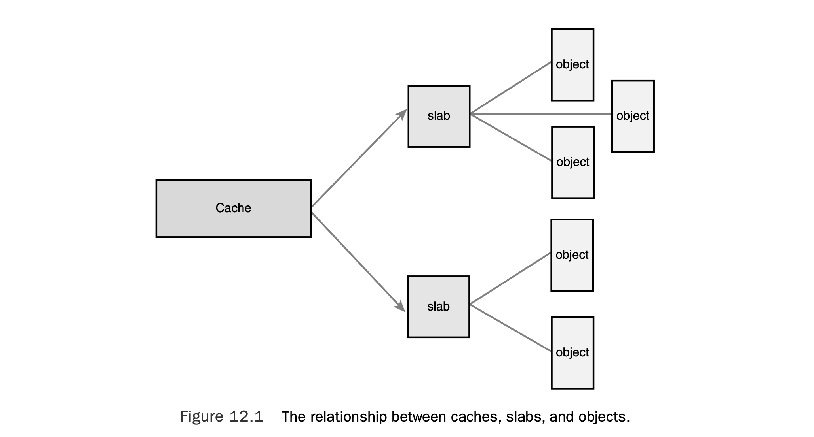
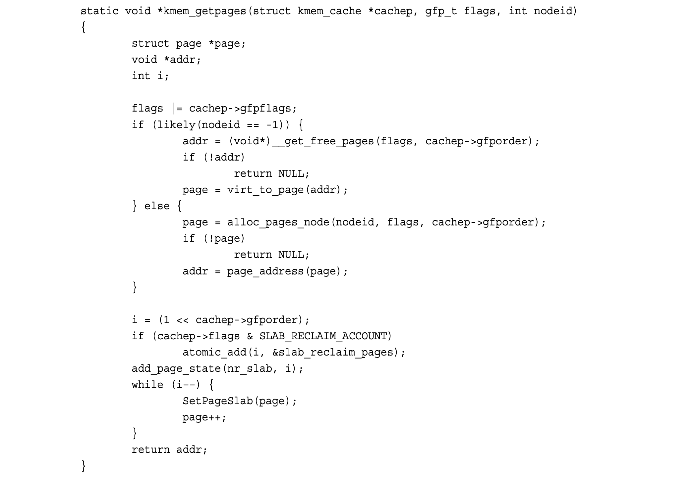

## 12 Memory Management

Memory allocation inside the kernel is not as easy as memory allocation outside the kernel. Simply put, the kernel lacks luxuries enjoyed by user-space. Unlike user-space, the kernel is not always afforded the capability to easily allocate memory. For example, the kernel cannot easily deal with memory allocation errors, and the kernel often cannot sleep. Because of these limitations, and the need for a lightweight memory allocation scheme, getting hold of memory in the kernel is more complicated than in user-space. This is not to say that, from a programmer’s point of view, kernel memory allocations are difficult—just different.

内核中的内存分配远不如用户空间的内存分配简单。简而言之，内核缺少用户空间所拥有的诸多便利条件。与用户空间不同，内核并非总能轻松获得内存分配的能力 —— 例如，内核难以妥善处理内存分配失败的情况，且内核代码往往无法进入睡眠状态。受这些限制，再加上对轻量级内存分配方案的需求，内核中获取内存的过程比用户空间更为复杂。但这并非意味着从程序员的角度来看，内核内存分配操作本身很难 —— 只是实现方式不同而已。

This chapter discusses the methods used to obtain memory inside the kernel. Before you can delve into the actual allocation interfaces, however, you need to understand how the kernel handles memory.

本章将介绍内核中获取内存的各类方法。不过，在深入学习具体的分配接口之前，你需要先理解内核是如何管理内存的。

### Pages

The kernel treats physical pages as the basic unit of memory management.Although the processor’s smallest addressable unit is a byte or a word, the memory management unit (MMU, the hardware that manages memory and performs virtual to physical address translations) typically deals in pages.Therefore, the MMU maintains the system’s page tables with page-sized granularity (hence their name). In terms of virtual memory, pages are the smallest unit that matters.

内核将**物理页面（physical pages）** 视为内存管理的基本单位。尽管处理器可寻址的最小单位是字节或字，但内存管理单元（MMU，即负责管理内存并完成虚拟地址到物理地址转换的硬件）通常以 “页面” 为单位进行处理。因此，MMU 会以页面大小为粒度维护系统的页表（这也是 “页表” 名称的由来）。在虚拟内存层面，页面是具备实际意义的最小管理单位。

As you can see in Chapter 19,“Portability,”each architecture defines its own page size. Many architectures even support multiple page sizes. Most 32-bit architectures have 4KB pages, whereas most 64-bit architectures have 8KB pages.This implies that on a machine with 4KB pages and 1GB of memory, physical memory is divided into 262,144 distinct pages.

正如你在《第 19 章 可移植性》中所见，每种处理器架构都定义了自身的页面大小，许多架构甚至支持多种页面尺寸。大多数 32 位架构采用 4KB 的页面大小，而大多数 64 位架构则使用 8KB 页面。这意味着，在一台配备 4KB 页面大小、1GB 物理内存的机器上，物理内存会被划分为 262,144 个独立的页面。

The kernel represents *every* physical page on the system with a struct page structure. This structure is defined in <linux/mm_types.h>. I’ve simplified the definition, removing two confusing unions that do not help color our discussion of the basics:

内核使用 `struct page` 结构体来表示系统中的**每一个**物理页面。该结构体定义在 `<linux/mm_types.h>` 头文件中。为简化说明，我对结构体定义做了精简，移除了两个容易造成混淆的联合体 —— 它们对理解基础概念并无帮助：

```c
struct page {
	unsigned long flags;
    atomic_t _count;
    atomic_t _mapcount;
    unsigned long private;
    struct address_space*mapping;
    pgoff_t index;
    struct list_head lru;
    void *virtual;
}
```

Let’s look at the important fields.The flags field stores the status of the page. Such flags include whether the page is dirty or whether it is locked in memory. Bit flags repre- sent the various values, so at least 32 different flags are simultaneously available.The flag values are defined in <linux/page-flags.h>.

我们来看其中的关键字段：

`flags` 字段用于存储页面的状态，例如页面是否为 “脏页”（数据已修改但未写回磁盘）、是否被锁定在内存中。这些状态以**位标志（bit flags）** 的形式存储，因此至少可同时表示 32 种不同的状态。`flags` 的具体取值定义在 `<linux/page-flags.h>` 中。

The _count field stores the usage count of the page—that is, how many references there are to this page.When this count reaches negative one, no one is using the page, and it becomes available for use in a new allocation. Kernel code should not check this field directly but instead use the function page_count(), which takes a page structure as its sole parameter.Although internally _count is negative one when the page is free, page_count() returns zero to indicate free and a positive nonzero integer when the page is in use. A page may be used by the page cache (in which case the mapping field points to the address_space object associated with this page), as private data (pointed at by private), or as a mapping in a process’s page table.

`_count` 字段存储页面的**使用计数（usage count）** —— 即该页面被引用的次数。当该计数值变为 - 1 时，说明暂无任何进程使用该页面，此时它可被分配给新的使用场景。内核代码**不应直接检查该字段**，而应调用 `page_count()` 函数（该函数仅接收一个 `page` 结构体指针作为参数）。尽管在内部实现中，空闲页面的 `_count` 值为 - 1，但 `page_count()` 函数会返回 0 表示页面空闲，返回正整数表示页面正在被使用。页面的使用场景包括：作为页缓存（此时 `mapping` 字段指向与该页面关联的 `address_space` 对象）、作为私有数据（由 `private` 字段指向），或作为某进程页表中的映射页。

The virtual field is the page’s virtual address. Normally, this is simply the address of the page in virtual memory. Some memory (called high memory) is not permanently mapped in the kernel’s address space. In that case, this field is NULL, and the page must be dynamically mapped if needed.We discuss high memory shortly.

`virtual` 字段存储页面的虚拟地址。通常情况下，该值就是页面在虚拟内存中的地址。但有一部分内存（称为 “高端内存”，high memory）并不会被永久映射到内核地址空间中，这类页面的 `virtual` 字段会被设为 NULL，若需要访问则必须进行动态映射。我们稍后会详细讨论高端内存。

The important point to understand is that the page structure is associated with physical pages, not virtual pages.Therefore, what the structure describes is transient at best. Even if the data contained in the page continues to exist, it might not always be associ- ated with the same page structure because of swapping and so on.The kernel uses this data structure to describe the associated physical page.The data structure’s goal is to describe physical memory, not the data contained therein.

需要重点理解的是，`page` 结构体关联的是**物理页面**，而非虚拟页面。因此，该结构体所描述的对象本质上是临时性的。即便页面中的数据依然存在，由于内存交换（swapping）等机制，这些数据也未必始终与同一个 `page` 结构体绑定。

内核用这个结构体来描述对应的物理页面，它的设计目标是描述**物理内存本身**，而非页面中存储的数据。

The kernel uses this structure to keep track of all the pages in the system, because the kernel needs to know whether a page is free (that is, if the page is not allocated). If a page is not free, the kernel needs to know who owns the page. Possible owners include user-space processes, dynamically allocated kernel data, static kernel code, the page cache, and so on.

内核借助该结构体追踪系统中的所有页面，因为内核需要知道一个页面是否处于空闲状态（即未被分配）。如果页面非空闲，内核还需要知道该页面的归属者。可能的归属者包括：用户空间进程、动态分配的内核数据、静态内核代码、页缓存等。

Developers are often surprised that an instance of this structure is allocated for each physical page in the system.They think,“*What a lot of memory wasted!”* Let’s look at just how bad (or good) the space consumption is from all these pages. Assume struct page consumes 40 bytes of memory, the system has 8KB physical pages, and the system has 4GB of physical memory. In that case, there are about 524,288 pages and page structures on the system.The page structures consume 20MB: perhaps a surprisingly large number in absolute terms, but only a small fraction of a percent relative to the system’s 4GB—not too high a cost for managing all the system’s physical pages.

开发者往往会惊讶于系统会为**每一个物理页面**都分配一个该结构体的实例，他们会想：“这得浪费多少内存啊！”

我们来算一算这些结构体实际的空间开销到底有多大。假设 `struct page` 占用 40 字节，系统物理页大小为 8KB，总物理内存为 4GB。

在这种配置下，系统共有约 524,288 个页面和对应数量的 `page` 结构体，这些结构体总共只占用约 20MB 内存。

从绝对数值看或许不算小，但相对于 4GB 系统内存只占不到 0.5%，用来管理整个系统的物理页面，这个代价并不算高。

### Zones

Because of hardware limitations, the kernel cannot treat all pages as identical. Some pages, because of their physical address in memory, cannot be used for certain tasks. Because of this limitation, the kernel divides pages into different *zones*.The kernel uses the zones to group pages of similar properties. In particular, Linux has to deal with two shortcomings of hardware with respect to memory addressing:

- Some hardware devices can perform DMA (direct memory access) to only certain memory addresses.
- Some architectures can physically addressing larger amounts of memory than they can virtually address. Consequently, some memory is not permanently mapped into the kernel address space.

由于硬件限制，内核无法将所有页面视作完全相同的个体。部分页面因其物理内存地址的特殊性，不能用于某些特定任务。

受此限制，内核将页面划分为不同的**内存域（zones）**，通过内存域把属性相近的页面归为一组进行管理。具体来说，Linux 必须应对硬件在内存寻址上的两处短板：

- 部分硬件设备**仅能对特定内存地址**执行 DMA（直接内存访问）。
- 部分架构的**物理寻址能力大于虚拟寻址能力**，导致一部分内存无法被永久映射到内核地址空间。

Because of these constraints, Linux has four primary memory zones:

- ZONE_DMA—This zone contains pages that can undergo DMA.
- ZONE_DMA32—Like ZOME_DMA, this zone contains pages that can undergo DMA. Unlike ZONE_DMA, these pages are accessible only by 32-bit devices. On some archi- tectures, this zone is a larger subset of memory.
- ZONE_NORMAL—This zone contains normal, regularly mapped, pages.
- ZONE_HIGHMEM—This zone contains “high memory,” which are pages not permanently mapped into the kernel’s address space.

基于这些约束，Linux 定义了四个主要内存域：

- **ZONE_DMA**：该内存域包含可用于 DMA 的页面。
- **ZONE_DMA32**：与 ZONE_DMA 类似，同样存放可用于 DMA 的页面；区别是该区域的页面仅支持 32 位设备访问，在部分架构中，该区域覆盖的内存范围更大。
- **ZONE_NORMAL**：该内存域包含常规、可直接映射的普通页面。
- **ZONE_HIGHMEM**：该内存域包含**高端内存**，即不会被永久映射到内核地址空间的页面。

These zones, and two other, less notable ones, are defined in <linux/mmzone.h>.

这些内存域，以及另外两个不那么常用的内存域，都定义在 `<linux/mmzone.h>` 中。

The actual use and layout of the memory zones is architecture-dependent. For exam- ple, some architectures have no problem performing DMA into any memory address. In those architectures, ZONE_DMA is empty and ZONE_NORMAL is used for allocations regardless of their use.As a counterexample, on the x86 architecture, ISA devices cannot perform DMA into the full 32-bit address space1 because ISA devices can access only the first 16MB of physical memory. Consequently, ZONE_DMA on x86 consists of all memory in the range 0MB–16MB.

内存域的实际用途和布局**与硬件架构相关**。

例如，部分架构可以对任意内存地址执行 DMA，这类架构中 ZONE_DMA 为空，所有分配无论用途都走 ZONE_NORMAL。

反例则是 x86 架构：ISA 设备无法对整个 32 位地址空间做 DMA¹，因为 ISA 设备只能访问物理内存的前 16MB。因此 x86 上的 ZONE_DMA 对应 0MB～16MB 这段物理内存。

ZONE_HIGHMEM works in the same regard.What an architecture can and cannot directly map varies. On 32-bit x86 systems, ZONE_HIGHMEM is all memory above the physical 896MB mark. On other architectures, ZONE_HIGHMEM is empty because all memory is directly mapped.The memory contained in ZONE_HIGHMEM is called *high memory*.2 The rest of the system’s memory is called *low memory*.

ZONE_HIGHMEM 的规则同理：不同架构能 / 不能直接映射的内存范围各不相同。在 32 位 x86 系统上，ZONE_HIGHMEM 是物理地址 **896MB 以上**的所有内存；在其他架构上，所有内存都可直接映射，因此 ZONE_HIGHMEM 为空。ZONE_HIGHMEM 里的内存称为**高端内存**²，系统其余内存称为**低端内存**。

ZONE_NORMAL tends to be whatever is left over after the previous two zones claim their requisite shares. On x86, for example, ZONE_NORMAL is all physical memory from 16MB to 896MB. On other (more fortunate) architectures, ZONE_NORMAL is all available memory.

ZONE_NORMAL 一般是前面两个区域分完后**剩下的部分**。以 x86 为例：ZONE_NORMAL 是 16MB～896MB 的物理内存。在其他（条件更优的）架构上，ZONE_NORMAL 就是全部可用内存。

Linux partitions the system’s pages into zones to have a pooling in place to satisfy allo- cations as needed. For example, having a ZONE_DMA pool gives the kernel the capability to satisfy memory allocations needed for DMA. If such memory is needed, the kernel can simply pull the required number of pages from ZONE_DMA. Note that the zones do not have any physical relevance but are simply logical groupings used by the kernel to keep track of pages.

Linux 会将系统的物理页划分为不同**内存区域（zone）**，以此构建内存池，按需满足各类内存分配需求。例如，专门维护 ZONE_DMA 内存池，能让内核满足 DMA 操作所需的内存分配；当需要这类内存时，内核只需从 ZONE_DMA 中取出所需数量的物理页即可。需要注意的是，这些内存区域**并非物理层面的划分**，而只是内核用于管理、追踪物理页的**逻辑分组**。

Although some allocations may require pages from a particular zone, other allocations may pull from multiple zones. For example, although an allocation for DMA-able mem- ory must originate from ZONE_DMA, a normal allocation can come from ZONE_DMA or ZONE_NORMAL but not both; allocations cannot cross zone boundaries.The kernel prefers to satisfy normal allocations from the normal zone, of course, to save the pages in ZONE_DMA for allocations that need it. But if push comes to shove (say, if memory should get low), the kernel can dip its fingers in whatever zone is available and suitable.

尽管部分内存分配要求必须从指定区域获取物理页，但另一些分配则可从多个区域中选取。例如，可用于 DMA 的内存分配必须取自 ZONE_DMA；而普通内存分配可以从 ZONE_DMA 或 ZONE_NORMAL 中获取，但**不能同时从两个区域分配**—— 内存分配不允许跨区域边界。内核自然会优先从普通区域（ZONE_NORMAL）满足普通分配请求，以此保留 ZONE_DMA 中的页，专供真正需要它的分配使用。但在迫不得已的情况下（比如内存紧张时），内核也会从所有可用且合适的内存区域中分配页。

Not all architectures define all zones. For example, a 64-bit architecture such as Intel’s x86-64 can fully map and handle 64-bits of memory.Thus, x86-64 has no ZONE_HIGHMEM and all physical memory is contained within ZONE_DMA and ZONE_NORMAL.

并非所有硬件架构都定义了全部内存区域。例如，Intel x86-64 这类 64 位架构能够完整映射并管理 64 位地址空间的全部内存，因此 x86-64 架构不存在 ZONE_HIGHMEM 区域，所有物理内存都归属于 ZONE_DMA 和 ZONE_NORMAL。

Each zone is represented by struct zone, which is defined in <linux/mmzone.h>:

```c
struct zone {
    unsigned long watermark[NR_WMARK];
    unsigned longlowmem_reserve[MAX_NR_ZONES];
    struct per_cpu_pageset pageset[NR_CPUS];
    spinlock_t lock;
	struct free_area free_area[MAX_ORDER]
    spinlock_t lru_lock;
    struct zone_lru {
		struct list_head list;
        unsigned long nr_saved_scan;
    } lru[NR_LRU_LISTS];
    struct zone_reclaim_stat reclaim_stat;
    unsigned long pages_scanned;
    unsigned long flags;
    atomic_long_t vm_stat[NR_VM_ZONE_STAT_ITEMS];
    int prev_priority;
    unsigned int inactive_ratio;
    wait_queue_head_t *wait_table;
    unsigned long wait_table_hash_nr_entries;
    unsigned long wait_table_bits;
    struct pglist_data *zone_pgdat;
    unsigned long zone_start_pfn;
    unsigned long spanned_pages;
    unsigned long present_pages;
    const char *name;
};
```

The structure is big, but only three zones are in the system and, thus, only three of these structures. Let’s look at the more important fields.

这个结构体体积较大，但系统中只存在**三个内存区域**，因此也只会有**三个该结构体实例**。下面我们来看其中比较重要的字段。

The lock field is a spin lock that protects the structure from concurrent access. Note that it protects just the structure and not all the pages that reside in the zone.A specific lock does not protect individual pages, although parts of the kernel may lock the data that happens to reside in said pages.

`lock` 字段是一个**自旋锁**，用于保护该结构体不被并发访问。注意它只保护结构体本身，而不保护该区域内的所有物理页。这个锁并不保护单个物理页，尽管内核的某些部分可能会对恰好存放在这些页里的数据加锁。

The watermark array holds the minimum, low, and high watermarks for this zone.The kernel uses watermarks to set benchmarks for suitable per-zone memory consumption, varying its aggressiveness as the watermarks vary vis-à-vis free memory.

`watermark` 数组保存了该区域的**最小、低、高三条水位线**。内核使用这些水位线为每个区域设定合适的内存消耗基准，并根据空闲内存与水位线的相对情况，调整内存回收与分配的激进程度。

The name field is, unsurprisingly, a NULL-terminated string representing the name of this zone.The kernel initializes this value during boot in mm/page_alloc.c, and the three zones are given the names DMA, Normal, and HighMem.

顾名思义，`name` 字段是一个以 `NULL` 结尾的字符串，表示该区域的名称。内核在启动过程中通过 `mm/page_alloc.c` 对其进行初始化，三个区域的名称分别为：DMA、Normal 和 HighMem。

### Getting Pages

Now with an understanding of how the kernel manages memory—via pages, zones, and so on—let’s look at the interfaces the kernel implements to enable you to allocate and free memory within the kernel. 

在理解了内核如何通过物理页、内存区域（zone）等机制管理内存后，接下来我们看看内核实现的、用于在内核态分配和释放内存的接口。

The kernel provides one low-level mechanism for requesting memory, along with sev- eral interfaces to access it.All these interfaces allocate memory with page-sized granular- ity and are declared in <linux/gfp.h>.The core function is

内核提供了一套底层的内存申请机制，以及多个访问该机制的接口。所有这些接口均**以物理页为粒度**分配内存，且都声明在 `<linux/gfp.h>` 头文件中。其核心函数为：

```c
struct page * alloc_pages(gfp_t gfp_mask, unsigned int order)
```

This allocates $2^{order}$ (that is,1 << order) contiguous physical pages and returns a pointer to the first page’s page structure; on error it returns NULL.We look at the gfp_t type and gfp_mask parameter in a later section.You can convert a given page to its logical address with the function

该函数会分配 2order（即 `1 << order`）个连续的物理页，并返回指向第一个物理页对应的 `page` 结构体的指针；若分配失败，则返回 `NULL`。我们将在后续章节中详细介绍 `gfp_t` 类型与 `gfp_mask` 参数。你可以通过以下函数将一个给定的物理页转换为其对应的逻辑地址：

```c
void * page_address(struct page *page)
```

This returns a pointer to the logical address where the given physical page currently resides. If you have no need for the actual struct page, you can call

该函数返回指向 “给定物理页当前映射到的逻辑地址” 的指针。若你无需操作实际的 `struct page` 结构体，可调用如下函数：

```c
unsigned long __get_free_pages(gfp_t gfp_mask, unsigned int order)
```

This function works the same as alloc_pages(), except that it directly returns the logical address of the first requested page. Because the pages are contiguous, the other pages simply follow from the first.

此函数的功能与 `alloc_pages()` 完全一致，区别仅在于它会直接返回所申请的第一个物理页的逻辑地址。由于这些物理页是连续的，其余页面的地址可直接从第一个页面的地址顺延得到。

If you need only one page, two functions are implemented as wrappers to save you a bit of typing:

若你仅需分配一个物理页，内核提供了两个封装函数以简化代码编写：

```c
struct page * alloc_page(gfp_t gfp_mask)
unsigned long __get_free_page(gfp_t gfp_mask)
```

These functions work the same as their brethren but pass zero for the order ($2^0$ = one page).

这两个函数的功能与对应的原生函数（`alloc_pages`/`__get_free_pages`）完全相同，只是会将 `order` 参数固定传入 0（20=1，即仅分配一个物理页）。

#### Getting Zeroed Pages

If you need the returned page filled with zeros, use the function

若你需要返回的页面被填充为零值，可使用如下函数：

```c
unsigned long get_zeroed_page(unsigned int gfp_mask)
```

This function works the same as __get_free_page(), except that the allocated page is then zero-filled—every bit of every byte is unset.This is useful for pages given to user- space because the random garbage in an allocated page is not so random; it might contain sensitive data.All data must be zeroed or otherwise cleaned before it is returned to user- space to ensure system security is not compromised.

该函数的功能与 `__get_free_page()` 完全一致，区别仅在于其会将分配到的页面**全量清零**—— 即字节的每一位都被置为 0。这一特性在向用户空间交付页面时尤为重要：因为分配页面中残留的 “随机” 数据并非真的随机，可能包含敏感信息。为确保系统安全不被破坏，所有数据在返回给用户空间前，都必须清零或做其他清理处理。

#### Freeing Pages

A family of functions enables you to free allocated pages when you no longer need them:

内核提供了一组函数，用于释放不再需要的已分配页面：

```c
void __free_pages(struct page *page, unsigned int order)
void free_pages(unsigned long addr, unsigned int order)
void free_page(unsigned long addr)
```

You must be careful to free only pages you allocate. Passing the wrong struct page or address, or the incorrect order, can result in corruption. Remember, the kernel trusts itself. Unlike with user-space, the kernel will happily hang itself if you ask it.

你必须格外小心，仅释放由自己分配的页面。若传入错误的 `struct page` 指针、内存地址，或错误的 `order` 阶数，都可能导致**内存损坏**。要记住，内核完全信任自身代码 —— 与用户空间不同，只要你发出错误指令，内核会毫不迟疑地导致自身挂死。

Let’s look at an example. Here, we want to allocate eight pages:

我们来看一个示例：以下代码旨在分配 8 个页面（注：23=8，因此 order 传 3）：

```c
unsigned long page;

page = __get_free_pages(GFP_KERNEL, 3);
if (!page) {
	/* insufficient memory: you must handle this error! */
    return –ENOMEM;
}
/* ‘page’ is now the address of the first of eight contiguous pages ... */
```

And here we free the eight pages, after we are done using them:

在使用完这 8 个页面后，我们通过以下代码释放它们：

```c
free_pages(page, 3);

/*
 * our pages are now freed and we should no
 * longer access the address stored in ‘page’
 */
```

The GFP_KERNEL parameter is an example of a gfp_mask flag. It is discussed shortly.

上述代码中的 `GFP_KERNEL` 是 `gfp_mask` 标志的一个示例，我们稍后会详细讲解。

Make note of the error checking after the call to__get_free_pages().A kernel allo- cation *can* fail, and your code *must* check for and handle such errors.This might mean unwinding everything you have done thus far. It therefore often makes sense to allocate your memory at the start of the routine to make handling the error easier. Otherwise, by the time you attempt to allocate memory, it may be rather hard to bail out.

请注意 `__get_free_pages()` 调用后的**错误检查逻辑**：内核态的内存分配**有可能失败**，你的代码**必须**检查并处理这类错误。这可能意味着要回滚此前已完成的所有操作，因此在函数开头就分配内存通常是更合理的做法 —— 这样能让错误处理更简单；否则，若等到执行到业务逻辑中途再尝试分配内存，此时要安全退出（bail out）会变得非常困难。

These low-level page functions are useful when you need page-sized chunks of physi- cally contiguous pages, especially if you need exactly a single page or two. For more gen- eral byte-sized allocations, the kernel provides kmalloc().

这类底层的页面分配函数，适用于需要**按页大小分配的物理连续内存块**的场景（尤其是仅需分配 1~2 个页面时）。而对于更通用的、按字节粒度的内存分配需求，内核提供了 `kmalloc()` 函数。

### **kmalloc()**

The kmalloc() function’s operation is similar to that of user-space’s familiar malloc() routine, with the exception of the additional flags parameter.The kmalloc() function is a simple interface for obtaining kernel memory in byte-sized chunks. If you need whole pages, the previously discussed interfaces might be a better choice. For most kernel alloca- tions, however, kmalloc() is the preferred interface.

The function is declared in <linux/slab.h>:

```c
void * kmalloc(size_t size, gfp_t flags)
```

The function returns a pointer to a region of memory that is at *least* size bytes in length.3 The region of memory allocated is physically contiguous. On error, it returns NULL. Kernel allocations always succeed, unless an insufficient amount of memory is available.Thus, you must check for NULL after all calls to kmalloc() and handle the error appropriately.

Let’s look at an example.Assume you need to dynamically allocate enough room for a fictional dog structure:

```c
struct dog *p;

p = kmalloc(sizeof(struct dog), GFP_KERNEL); 
if (!p)
	/* handle error ... */
```

If the kmalloc() call succeeds, p now points to a block of memory that is at least the requested size.The GFP_KERNEL flag specifies the behavior of the memory allocator while trying to obtain the memory to return to the caller of kmalloc().

#### **kfree()**

The counterpart to kmalloc() is kfree(), which is declared in <linux/slab.h>:

与 `kmalloc()` 对应的内存释放函数是 `kfree()`，该函数声明在 `<linux/slab.h>` 头文件中：

```c
void kfree(const void *ptr)
```

The kfree() method frees a block of memory previously allocated with kmalloc(). Do not call this function on memory not previously allocated with kmalloc(), or on memory that has already been freed. Doing so is a bug, resulting in bad behavior such as freeing memory belonging to another part of the kernel.As in user-space,be careful to balance your allocations with your deallocations to prevent memory leaks and other bugs. Note that calling kfree(NULL) is explicitly checked for and safe.

`kfree()` 用于释放此前通过 `kmalloc()` 分配的内存块。**切勿**对非 `kmalloc()` 分配的内存、或已被释放的内存调用该函数 —— 此类操作属于程序错误，会引发诸如释放内核其他模块内存等严重异常行为。与用户空间编程规则一致，你需要确保内存的分配与释放操作一一匹配，以防止内存泄漏及其他内存错误。需要注意的是，调用 `kfree(NULL)` 是内核显式做了合法性检查的操作，因此是安全的。

Let’s look at an example of allocating memory in an interrupt handler. In this exam- ple, an interrupt handler wants to allocate a buffer to hold incoming data.The preproces- sor macro BUF_SIZE is the size in bytes of this desired buffer, which is presumably larger than just a couple of bytes.

我们来看一个在**中断处理函数**中分配内存的示例：在这个场景下，中断处理函数需要分配一个缓冲区来存放接收到的数据。预处理宏 `BUF_SIZE` 定义了该缓冲区的字节大小，其值通常远大于几个字节。

```c
char *buf;
buf = kmalloc(BUF_SIZE, GFP_ATOMIC); 
if (!buf)
	/* error allocating memory ! */
```

Later, when you no longer need the memory, do not forget to free it:

后续当你不再需要这块内存时，切记释放它：

```c
kfree(buf);
```

### **vmalloc()**

The vmalloc() function works in a similar fashion to kmalloc(), except it allocates memory that is only virtually contiguous and not necessarily physically contiguous.This is how a user-space allocation function works:The pages returned by malloc() are con- tiguous within the virtual address space of the processor, but there is no guarantee that they are actually contiguous in physical RAM.The kmalloc() function guarantees that the pages are physically contiguous (and virtually contiguous).The vmalloc() function ensures only that the pages are contiguous within the virtual address space. It does this by allocating potentially noncontiguous chunks of physical memory and “fixing up” the page tables to map the memory into a contiguous chunk of the logical address space.

`vmalloc()` 函数的工作方式与 `kmalloc()` 类似，区别在于它分配的内存**仅保证虚拟地址连续**，而不保证物理地址连续。这正是用户空间内存分配函数的工作机制：`malloc()` 返回的页面在处理器的虚拟地址空间中是连续的，但无法保证其在物理内存（RAM）中实际连续；`kmalloc()` 则能保证页面在物理地址上连续（同时虚拟地址也连续）；而 `vmalloc()` 仅确保页面在虚拟地址空间中连续 —— 它的实现方式是：先分配若干物理上可能不连续的内存块，再通过 “修正页表” 的方式，将这些内存映射到逻辑地址空间中一段连续的区域。

For the most part, only hardware devices require physically contiguous memory allo- cations. On many architectures, hardware devices live on the other side of the memory management unit and, thus, do not understand virtual addresses. Consequently, any regions of memory that hardware devices work with must exist as a physically contiguous block and not merely a virtually contiguous one. Blocks of memory used only by soft- ware—for example, process-related buffers—are fine using memory that is only virtually contiguous. In your programming, you never know the difference. All memory appears to the kernel as logically contiguous.

在绝大多数场景下，只有硬件设备才要求分配**物理连续的内存**。在许多架构中，硬件设备处于内存管理单元（MMU）的 “另一侧”，因此无法识别虚拟地址；正因如此，硬件设备操作的任何内存区域都必须是物理上连续的块，而非仅虚拟连续的块。而仅由软件使用的内存块（例如进程相关的缓冲区），使用仅虚拟连续的内存完全可行 —— 在编程过程中，你甚至不会感知到这种差异，因为所有内存在内核视角下都呈现为逻辑连续的形态。

Despite the fact that physically contiguous memory is required in only certain cases, most kernel code uses kmalloc() and not vmalloc() to obtain memory. Primarily, this is for performance.The vmalloc() function, to make nonphysically contiguous pages con- tiguous in the virtual address space, must specifically set up the page table entries.Worse, pages obtained via vmalloc() must be mapped by their individual pages (because they are not physically contiguous), which results in much greater TLB4 thrashing than you see when directly mapped memory is used. Because of these concerns, vmalloc() is used only when absolutely necessary—typically, to obtain large regions of memory. For exam- ple, when modules are dynamically inserted into the kernel, they are loaded into memory created via vmalloc().

尽管仅在特定场景下才需要物理连续内存，但绝大多数内核代码仍使用 `kmalloc()` 而非 `vmalloc()` 来获取内存，这主要是出于**性能考量**。`vmalloc()` 要让物理不连续的页面在虚拟地址空间中连续，必须专门构建页表项；更糟的是，通过 `vmalloc()` 获取的页面需要按单个页面分别映射（因为物理上不连续），这会导致 TLB（快表）抖动的问题远严重于直接映射内存的场景。因此，`vmalloc()` 仅在绝对必要时才会被使用 —— 通常是为了分配**大段内存区域**。例如，当内核模块被动态插入内核时，其加载的内存空间就是通过 `vmalloc()` 分配的。

The vmalloc() function is declared in <linux/vmalloc.h> and defined in mm/vmalloc.c. Usage is identical to user-space’s malloc():

`vmalloc()` 函数声明于 `<linux/vmalloc.h>` 头文件，定义在 `mm/vmalloc.c` 源码文件中，使用方式与用户空间的 `malloc()` 完全一致：

```c
void * vmalloc(unsigned long size)
```

The function returns a pointer to at least size bytes of virtually contiguous memory. On error, the function returns NULL.The function might sleep and thus cannot be called from interrupt context or other situations in which blocking is not permissible.

该函数返回一个指针，指向至少 `size` 字节的虚拟连续内存；若分配失败，则返回 `NULL`。该函数可能会进入睡眠状态，因此**不能在中断上下文**或其他不允许阻塞的场景中调用。

To free an allocation obtained via vmalloc(), use

要释放通过 `vmalloc()` 分配的内存，需使用：

```c
void vfree(const void *addr)
```

This function frees the block of memory beginning at addr that was previously allo- cated via vmalloc().The function can also sleep and, thus, cannot be called from inter- rupt context. It has no return value.

此函数用于释放从 `addr` 开始、此前通过 `vmalloc()` 分配的内存块。该函数同样可能进入睡眠状态，因此也不能在中断上下文中调用，且无返回值。

Usage of these functions is simple:

这类函数的使用方式十分简单：

```c
char *buf;
buf = vmalloc(16 * PAGE_SIZE); /* get 16 pages */
if (!buf)
	/* error! failed to allocate memory */
/*
* buf now points to at least a 16*PAGE_SIZE bytes * of virtually contiguous block of memory
*/
```

After you finish with the memory, make sure to free it by using

当你不再使用该内存时，务必通过以下方式释放：

```c
vfree(buf);
```

### Slab Layer

Allocating and freeing data structures is one of the most common operations inside any kernel.To facilitate frequent allocations and deallocations of data, programmers often introduce *free lists*. A free list contains a block of available, already allocated, data structures. When code requires a new instance of a data structure, it can grab one of the structures off the free list rather than allocate the sufficient amount of memory and set it up for the data structure. Later, when the data structure is no longer needed, it is returned to the free list instead of deallocated. In this sense, the free list acts as an object cache, caching a fre- quently used *type* of object.

分配和释放数据结构，是任何内核内部最常见的操作之一。为了方便对数据进行频繁的分配与回收，程序员通常会引入**空闲链表（free list）**。空闲链表中维护着一批已经分配好、可供使用的数据结构块。当代码需要一个新的数据结构实例时，可以直接从空闲链表中取一个结构使用，而不必重新分配足够大小的内存并初始化该数据结构；后续当这个数据结构不再需要时，也会被放回空闲链表，而非直接释放内存。从这个意义上说，空闲链表相当于一种**对象缓存**，对某一类高频使用的对象进行缓存复用。

One of the main problems with free lists in the kernel is that there exists no global control.When available memory is low, there is no way for the kernel to communicate to every free list that it should shrink the sizes of its cache to free up memory.The ker- nel has no understanding of the random free lists at all.To remedy this, and to consoli- date code, the Linux kernel provides the slab layer (also called the slab allocator).The slab layer acts as a generic data structure-caching layer.

内核中空闲链表的一个核心问题是**缺乏全局管控**。当系统可用内存紧张时，内核无法通知所有空闲链表收缩缓存规模以释放内存 —— 内核对这些零散的空闲链表完全没有感知。为解决这一问题，同时统一相关代码实现，Linux 内核提供了 **slab 层（也称作 slab 分配器）**。slab 层是一个通用的数据结构缓存层。

The concept of a slab allocator was first implemented in Sun Microsystem’s SunOS 5.4 operating system.5 The Linux data structure caching layer shares the same name and basic design.

slab 分配器的设计最早由 Sun Microsystems 在其 SunOS 5.4 操作系统中实现。Linux 的数据结构缓存层沿用了相同的名称与基础设计思想。

The slab layer attempts to leverage several basic tenets:

- Frequently used data structures tend to be allocated and freed often, so cache them.
- Frequent allocation and deallocation can result in memory fragmentation (the inability to find large contiguous chunks of available memory).To prevent this, the cached free lists are arranged contiguously. Because freed data structures return to the free list, there is no resulting fragmentation.
- The free list provides improved performance during frequent allocation and deallo- cation because a freed object can be immediately returned to the next allocation.
- If the allocator is aware of concepts such as object size, page size, and total cache size, it can make more intelligent decisions.
- If part of the cache is made per-processor (separate and unique to each processor on the system), allocations and frees can be performed without an SMP lock.
- If the allocator is NUMA-aware, it can fulfill allocations from the same memory node as the requestor.
- Stored objects can be *colored* to prevent multiple objects from mapping to the same cache lines.

slab 层的设计依托以下几条核心原则：

- 高频使用的数据结构往往会被反复分配与释放，因此对其进行缓存。
- 频繁的分配与释放会导致**内存碎片**（即无法找到大块连续的可用内存）。为避免这一问题，缓存后的空闲链表以连续形式组织；由于释放后的数据结构会回到空闲链表，因此不会产生碎片。
- 空闲链表能提升频繁分配、释放场景下的性能，因为已释放的对象可以立刻被下一次分配复用。
- 如果分配器能感知对象大小、页面大小、总缓存大小等信息，就可以做出更合理的分配决策。
- 如果将部分缓存设计为**每处理器独享**（系统中每个 CPU 各有一份独立缓存），那么分配和释放操作就可以在**不加 SMP 锁**的情况下完成。
- 如果分配器具备 **NUMA 感知能力**，就可以从请求者所在的同一个内存节点完成分配。
- 可以对缓存中的对象进行**着色（coloring）**，避免多个对象映射到同一条 CPU 缓存行。

The slab layer in Linux was designed and implemented with these premises in mind.

Linux 内核的 slab 层，正是基于这些设计前提实现的。

#### Design of the Slab Layer

The slab layer divides different objects into groups called *caches*, each of which stores a different type of object.There is one cache per object type. For example, one cache is for process descriptors (a free list of task_struct structures), whereas another cache is for inode objects (struct inode). Interestingly, the kmalloc() interface is built on top of the slab layer, using a family of general purpose caches.

slab 层将不同的对象划分到称为 **缓存（cache）** 的组中，每个缓存专门存储一种类型的对象，**一种对象类型对应一个缓存**。例如，一个缓存用于存放进程描述符（即 `task_struct` 结构体的空闲链表），另一个缓存则用于存放索引节点对象（`struct inode`）。值得注意的是，`kmalloc()` 接口正是构建在 slab 层之上，依赖一组通用缓存实现。

The caches are then divided into *slabs* (hence the name of this subsystem).The slabs are composed of one or more physically contiguous pages.Typically, slabs are composed of only a single page. Each cache may consist of multiple slabs.

这些缓存又被进一步划分成**slab**（该子系统也因此得名）。slab 由一个或多个物理连续的页面组成，在绝大多数场景下，一个 slab 仅包含单个页面。每个缓存可以由多个 slab 构成。

Each slab contains some number of *objects*, which are the data structures being cached. Each slab is in one of three states: full, partial, or empty. A full slab has no free objects. (All objects in the slab are allocated.) An empty slab has no allocated objects. (All objects in the slab are free.) A partial slab has some allocated objects and some free objects.When some part of the kernel requests a new object, the request is satisfied from a partial slab, if one exists. Otherwise, the request is satisfied from an empty slab. If there exists no empty slab, one is created. Obviously, a full slab can never satisfy a request because it does not have any free objects.This strategy reduces fragmentation.

每个 slab 中包含若干个**对象（object）**，也就是被缓存的数据结构。每个 slab 始终处于三种状态之一：

- **满（full）**：无空闲对象，slab 内所有对象均已分配
- **空（empty）**：无已分配对象，slab 内所有对象均空闲
- **部分使用（partial）**：既有已分配对象，也有空闲对象

当内核需要申请新对象时，会**优先从 partial slab 分配**；若不存在，则从 empty slab 分配；若无空 slab，则新建一个 slab。full slab 因无空闲对象，永远无法满足分配请求。这种策略能够有效减少内存碎片。

Let’s look at the inode structure as an example, which is the in-memory representa- tion of a disk inode (see Chapter 13,“TheVirtual Filesystem”).These structures are fre- quently created and destroyed, so it makes sense to manage them via the slab allocator. Thus, struct inode is allocated from the inode_cachep cache. (Such a naming conven- tion is standard.) This cache is made up of one or more slabs—probably a lot of slabs because there are a lot of objects. Each slab contains as many struct inode objects as possible.When the kernel requests a new inode structure, the kernel returns a pointer to an already allocated, but unused structure from a partial slab or, if there is no partial slab, an empty slab.When the kernel is done using the inode object, the slab allocator marks the object as free. Figure 12.1 diagrams the relationship between caches, slabs, and objects.

我们以索引节点结构体 `struct inode` 为例，它是磁盘索引节点在内存中的表示（见第 13 章《虚拟文件系统》）。这类结构体创建和销毁极为频繁，非常适合通过 slab 分配器管理。因此，`struct inode` 从 `inode_cachep` 缓存中分配（这种命名方式是内核的标准规范）。该缓存由一个或多个 slab 组成 —— 由于对象数量庞大，通常会包含大量 slab。每个 slab 会尽可能容纳多个 `struct inode` 对象。当内核申请新的索引节点结构体时，会从 partial slab 中返回一个已分配但未使用的结构体指针；若没有 partial slab，则从 empty slab 中分配。当内核使用完索引节点对象后，slab 分配器会将该对象标记为空闲。图 12.1 展示了缓存、slab 与对象之间的关系。




Each cache is represented by a kmem_cache structure.This structure contains three lists—slabs_full, slabs_partial, and slabs_empty—stored inside a kmem_list3 structure, which is defined in mm/slab.c.These lists contain all the slabs associated with the cache.A slab descriptor,struct slab,represents each slab:

每个缓存由 `kmem_cache` 结构体表示。该结构体包含三个链表：`slabs_full`、`slabs_partial` 和 `slabs_empty`，这些链表封装在 `kmem_list3` 结构体中，定义于 `mm/slab.c`。链表包含了该缓存关联的所有 slab。每个 slab 由一个**slab 描述符** `struct slab` 表示：

```c
struct slab {
	struct list_head list; /* full, partial, or empty list */
	unsigned long colouroff; /* offset for the slab coloring */
    void *s_mem; /* first object in the slab */
    unsigned int inuse; /* allocated objects in the slab */
    kmem_bufctl_t free; /* first free object, if any */
};
```

Slab descriptors are allocated either outside the slab in a general cache or inside the slab itself, at the beginning.The descriptor is stored inside the slab if the total size of the slab is sufficiently small, or if internal slack space is sufficient to hold the descriptor.

slab 描述符既可以在 slab 外部的通用缓存中分配，也可以直接存放在 slab 起始位置的内部。如果 slab 总尺寸足够小，或内部冗余空间足以容纳描述符，就会将描述符存放在 slab 内部。

The slab allocator creates new slabs by interfacing with the low-level kernel page allo- cator via __get_free_pages():

slab 分配器通过调用内核底层页分配器的 `__get_free_pages()` 来创建新的 slab：



This function uses `__get_free_pages()` to allocate memory sufficient to hold the cache.The first parameter to this function points to the specific cache that needs more pages.The second parameter points to the flags given to ``__get_free_pages()``. Note how this value is binary OR’ed against another value.This adds default flags that the cache requires to the flags parameter.The power-of-two size of the allocation is stored in cachep->gfporder.The previous function is a bit more complicated than one might expect because code that makes the allocator NUMA-aware.When nodeid is not nega- tive one, the allocator attempts to fulfill the allocation from the same memory node that requested the allocation.This provides better performance on NUMA systems, in which accessing memory outside your node results in a performance penalty.

该函数使用 `__get_free_pages()` 分配足以承载缓存所需的内存。函数第一个参数指向需要申请更多页面的指定缓存；第二个参数是传递给 `__get_free_pages()` 的分配标志。注意该标志会与另一个值**按位或**，从而将缓存所需的默认标志合并进去。分配的页面数为 2 的幂次，其阶数存储在 `cachep->gfporder` 中。该函数的实际实现比预想更复杂，因为包含了**NUMA 感知**的相关代码。当 `nodeid` 不为 -1 时，分配器会尝试从发起请求的**同一内存节点**分配内存，这能显著提升 NUMA 系统的性能 —— 在 NUMA 架构中，访问非本地节点内存会带来性能损耗。

For educational purposes, we can ignore the NUMA-aware code and write a simple kmem_getpages():

为便于学习理解，我们忽略 NUMA 相关代码，写出简化版的 `kmem_getpages()`：

```c
static inline void * kmem_getpages(struct kmem_cache *cachep, gfp_t flags) {
    void *addr;
    flags |= cachep->gfpflags;
    addr = (void*) __get_free_pages(flags, cachep->gfporder);
    return addr;
}
```

Memory is then freed by kmem_freepages(), which calls free_pages() on the given cache’s pages. Of course, the point of the slab layer is to refrain from allocating and freeing pages. In turn, the slab layer invokes the page allocation function only when there does not exist any partial or empty slabs in a given cache.The freeing function is called only when available memory grows low and the system is attempting to free memory, or when a cache is explicitly destroyed.

内存的释放由 `kmem_freepages()` 完成，该函数会对指定缓存的页面调用 `free_pages()`。当然，slab 层的核心设计目标就是**尽量减少页面的频繁分配与释放**。相应地，只有当某个缓存中不存在任何 partial 或 empty slab 时，slab 层才会调用页面分配函数；而只有当系统内存紧张、需要回收内存，或是缓存被显式销毁时，才会调用页面释放函数。

The slab layer is managed on a per-cache basis through a simple interface, which is exported to the entire kernel.The interface enables the creation and destruction of new caches and the allocation and freeing of objects within the caches.The sophisticated man- agement of caches and the slabs within is entirely handled by the internals of the slab layer. After you create a cache, the slab layer works just like a specialized allocator for the specific type of object.

slab 层以**单个缓存为单位**，通过一套简洁的接口向整个内核提供服务。这套接口支持缓存的创建与销毁、缓存内对象的分配与释放。缓存及内部 slab 的复杂管理逻辑完全由 slab 层自身处理。一旦创建好缓存，slab 层就相当于一个针对特定对象类型的专用分配器。

#### Example of Using the Slab Allocator

Let’s look at a real-life example that uses the task_struct structure (the process descrip- tor).This code, in slightly more complicated form, is in kernel/fork.c.

我们以 `task_struct` 结构体（进程描述符）为例，看一个实际的使用场景。这段代码的完整版（逻辑稍复杂）位于 `kernel/fork.c` 中。

First, the kernel has a global variable that stores a pointer to the task_struct cache:

首先，内核定义了一个全局变量，用于存储指向 `task_struct` 缓存的指针：

```c
struct kmem_cache *task_struct_cachep;
```

During kernel initialization, in fork_init(), defined in kernel/fork.c, the cache is created:

在内核初始化阶段，会在 `fork_init()` 函数（定义于 `kernel/fork.c`）中创建该缓存：

```c
task_struct_cachep = kmem_cache_create(“task_struct”, 
                                       sizeof(struct task_struct),
									   ARCH_MIN_TASKALIGN,
                                       SLAB_PANIC | SLAB_NOTRACK,
                                       NULL);
```

This creates a cache named task_struct, which stores objects of type struct task_struct.The objects are created with an offset of ARCH_MIN_TASKALIGN bytes within the slab.This preprocessor definition is an architecture-specific value. It is usually defined as L1_CACHE_BYTES—the size in bytes of the L1 cache.There is no constructor. Note that the return value is not checked for NULL, which denotes failure, because the SLAB_PANIC flag was given. If the allocation fails, the slab allocator calls panic(). If you do not provide this flag, you must check the return! The SLAB_PANIC flag is used here because this is a requisite cache for system operation. (The machine is not much good without process descriptors.)

这行代码创建了一个名为 `task_struct` 的缓存，专门存储 `struct task_struct` 类型的对象。对象在 slab 内的起始偏移量为 `ARCH_MIN_TASKALIGN` 字节 —— 该预处理宏是**架构相关的取值**，通常被定义为 `L1_CACHE_BYTES`（即 CPU 一级缓存的字节大小）。此处未指定构造函数（最后一个参数为 NULL）。注意代码没有检查返回值是否为 NULL（NULL 表示创建失败），这是因为传入了 `SLAB_PANIC` 标志：若缓存创建失败，slab 分配器会直接调用 `panic()` 触发内核宕机。如果不传入该标志，**必须手动检查返回值**！这里使用 `SLAB_PANIC` 是因为该缓存是系统运行的核心依赖（没有进程描述符，系统基本无法工作）。

Each time a process calls fork(), a new process descriptor must be created (recall Chapter 3,“Process Management”).This is done in dup_task_struct(), which is called from do_fork():

每当进程调用 `fork()` 时，都需要创建一个新的进程描述符（回顾第 3 章《进程管理》）。这个操作在 `dup_task_struct()` 中完成（该函数由 `do_fork()` 调用）：

```c
struct task_struct *tsk;

tsk = kmem_cache_alloc(task_struct_cachep, GFP_KERNEL);
if (!tsk)
	return NULL;
```

After a task dies, if it has no children waiting on it, its process descriptor is freed and returned to the task_struct_cachep slab cache.This is done in free_task_struct() (in which tsk is the exiting task):

当一个任务退出，且没有子进程等待它时，其进程描述符会被释放并归还给 `task_struct_cachep` slab 缓存。这个操作在 `free_task_struct()` 中执行（其中 `tsk` 是即将退出的任务）：

```c
kmem_cache_free(task_struct_cachep, tsk);
```

Because process descriptors are part of the core kernel and always needed, the task_struct_cachep cache is never destroyed. If it were, however, you would destroy the cache via

由于进程描述符是内核核心组件且始终被需要，`task_struct_cachep` 缓存永远不会被销毁。但如果需要销毁这类缓存，可通过以下方式实现：

```c
int err;

err = kmem_cache_destroy(task_struct_cachep);
if (err)
	/* error destroying cache */
```

Easy enough? The slab layer handles all the low-level alignment, coloring, allocations, freeing, and reaping during low-memory conditions. If you frequently create many objects of the same type, consider using the slab cache. Definitely do not implement your own free list!

是不是很简单？slab 层会处理所有底层细节：内存对齐、缓存着色、内存分配与释放，以及内存紧张时的缓存回收。如果你的代码需要频繁创建大量同类型对象，建议使用 slab 缓存 ——**绝对不要自己实现空闲链表**！

### Statically Allocating on the Stack

In user-space, allocations such as some of the examples discussed thus far could have occurred on the stack because we knew the size of the allocation a priori. User-space is afforded the luxury of a large, dynamically growing stack, whereas the kernel has no such luxury—the kernel’s stack is small and fixed.When each process is given a small, fixed stack, memory consumption is minimized, and the kernel need not burden itself with stack management code.

在用户空间中，像前文讨论的部分示例那样的内存分配操作本可以在栈上完成 —— 因为我们**事先知道分配的大小**。用户空间得以享有 “大尺寸且可动态增长的栈” 这一便利，而内核却没有这样的条件：内核栈不仅尺寸小，且大小固定。为每个进程分配小而固定的栈，既能将内存消耗降至最低，也能让内核不必为栈管理代码额外负担。

The size of the per-process kernel stacks depends on both the architecture and a com- pile-time option. Historically, the kernel stack has been two pages per process.This is usu- ally 8KB for 32-bit architectures and 16KB for 64-bit architectures because they usually have 4KB and 8KB pages, respectively.

每个进程的内核栈大小取决于两个因素：硬件架构与编译期选项。从历史实现来看，内核栈通常为每个进程分配两个页面的空间：对于 32 位架构，这一大小通常是 8KB（因其页面大小一般为 4KB）；对于 64 位架构则为 16KB（因其页面大小一般为 8KB）。

#### Single-Page Kernel Stacks

Early in the 2.6 kernel series, however, an option was introduced to move to single-page kernel stacks.When enabled, each process is given only a single page—4KB on 32-bit architectures and 8KB on 64-bit architectures.This was done for two reasons. First, it results in a page with less memory consumption per process. Second and most important is that as uptime increases, it becomes increasingly hard to find two physically contiguous unallocated pages. Physical memory becomes fragmented, and the resulting VM pressure from allocating a single new process is expensive.

不过在 2.6 内核系列的早期，内核引入了一个选项，将内核栈改为**单页大小**。启用该选项后，每个进程只会分配一页内核栈 ——32 位架构下为 4KB，64 位架构下为 8KB。

这么做主要有两个原因：第一，能降低每个进程的内存消耗；第二，也是更重要的一点：随着系统运行时间变长，想要找到**两个物理连续的空闲页面**会变得越来越困难。物理内存会产生碎片，而为一个新进程分配双页内存所带来的虚拟内存压力，开销会非常大。

There is one more complication. Keep with me:We have almost grasped the entire universe of knowledge with respect to kernel stacks. Now, each process’s entire call chain has to fit in its kernel stack. Historically, however, interrupt handlers also used the kernel stack of the process they interrupted, thus they too had to fit.This was efficient and sim- ple, but it placed even tighter constraints on the already meager kernel stack.When the stack moved to only a single page, interrupt handlers no longer fit.

还有一个复杂的问题。耐心听我说：关于内核栈的知识，我们马上就要全部掌握了。

现在，每个进程的整个调用链都必须能放进它的内核栈里。而在以前，中断处理程序还会**复用被中断进程的内核栈**，所以它们也得挤在这个栈里。这种做法高效又简单，却让本就很小的内核栈空间更加紧张。当内核栈缩成单页后，中断处理程序就再也放不下了。

To rectify this problem, the kernel developers implemented a new feature: interrupt stacks. Interrupt stacks provide a single per-processor stack used for interrupt handlers. With this option, interrupt handlers no longer share the kernel stack of the interrupted process. Instead, they use their own stacks.This consumes only a single page per processor.

为解决这个问题，内核开发者实现了一项新特性：**中断栈**。

中断栈会为每个处理器提供一个独立的栈，专门给中断处理程序使用。启用这个选项后，中断处理程序不再共享被中断进程的内核栈，而是使用自己的栈。这只会为每个处理器消耗一页内存。

To summarize, kernel stacks are either one or two pages, depending on compile-time configuration options.The stack can therefore range from 4KB to 16KB. Historically, interrupt handlers shared the stack of the interrupted process.When single page stacks are enabled, interrupt handlers are given their own stacks. In any case, unbounded recursion and alloca() are obviously not allowed.

总而言之，内核栈的大小是一页或两页，具体取决于编译时配置，因此栈空间大小在 4KB 到 16KB 之间。

以前，中断处理程序共享被中断进程的栈；启用单页内核栈后，中断处理程序会拥有专属的栈。无论哪种情况，**无限递归**和 `alloca()` 显然都是不允许的。

Okay. Got it?

#### Playing Fair on the Stack

In any given function, you must keep stack usage to a minimum.There is no hard and fast rule, but you should keep the sum of all local (that is, automatic) variables in a particular function to a maximum of a couple hundred bytes. Performing a large static allocation on the stack, such as of a large array or structure, is dangerous. Otherwise, stack allocations are performed in the kernel just as in user-space. Stack overflows occur silently and will undoubtedly result in problems. Because the kernel does not make any effort to manage the stack, when the stack overflows, the excess data simply spills into whatever exists at the tail end of the stack.The first thing to eat it is the thread_info structure. (Recall from Chapter 3 that this structure is allocated at the end of each process’s kernel stack.) Beyond the stack, any kernel data might lurk. At best, the machine will crash when the stack overflows. At worst, the overflow will silently corrupt data.

在任意函数中，你都必须**尽量减小栈的使用量**。虽然没有硬性规定，但你应当把单个函数里所有局部（自动）变量的总大小控制在最多几百字节。在栈上进行大量的静态分配（比如定义大数组或大结构体）是**危险**的。除此之外，内核中的栈分配方式与用户空间基本一致。**栈溢出是静默发生的**，并且几乎一定会引发问题。因为内核不会对栈做任何管理，当栈溢出时，超出的数据会直接覆盖栈末尾的内容。**最先被覆盖的就是 thread_info 结构体**（回顾第 3 章：该结构分配在每个进程内核栈的末尾）。栈之外还可能存在各种内核数据。栈溢出最好的结果是系统直接崩溃，最坏的结果则是**无声地破坏数据**。

Therefore, it is wise to use a dynamic allocation scheme, such as one of those previ- ously discussed in this chapter for any large memory allocations.

因此，对于任何较大的内存分配，明智的做法是使用**动态分配机制**，例如本章前面介绍的那些分配方式。

### High Memory Mappings

By definition, pages in high memory might not be permanently mapped into the kernel’s address space.Thus, pages obtained via alloc_pages() with the __GFP_HIGHMEM flag might not have a logical address.

按照定义，**高端内存（high memory）** 中的页面并不会被永久映射到内核地址空间。因此，通过 `alloc_pages()` 并携带 `__GFP_HIGHMEM` 标志分配得到的页面，可能并不具备对应的逻辑地址。

On the x86 architecture, all physical memory beyond the 896MB mark is high mem- ory and is not permanently or automatically mapped into the kernel’s address space, despite x86 processors being capable of physically addressing up to 4GB (64GB with PAE6) of physical RAM. After they are allocated, these pages must be mapped into the kernel’s logical address space. On x86, pages in high memory are mapped somewhere between the 3GB and 4GB mark.

在 x86 架构中，物理内存中超出 **896MB** 的部分都属于高端内存，这部分内存不会被永久或自动映射到内核地址空间 —— 尽管 x86 处理器的物理寻址能力最高可达 4GB（开启 PAE 时为 64GB）。

这类页面在分配之后，必须被映射到内核的逻辑地址空间。在 x86 上，高端内存页面会被映射到 **3GB～4GB** 之间的地址区间。

#### Permanent Mappings

To map a given page structure into the kernel’s address space, use this function, declared in <linux/highmem.h>:

要将指定的 `page` 结构体映射到内核地址空间，可使用声明在 `<linux/highmem.h>` 中的函数：

```c
void *kmap(struct page *page)
```

This function works on either high or low memory. If the page structure belongs to a page in low memory, the page’s virtual address is simply returned. If the page resides in high memory, a permanent mapping is created and the address is returned.The function may sleep, so kmap() works only in process context.

该函数适用于**高端内存和低端内存**页面：若 `page` 结构体对应低端内存页面，会直接返回该页面的虚拟地址；若页面位于高端内存，则会创建一个永久映射并返回映射后的地址。该函数可能进入睡眠状态，因此 `kmap()` 仅能在**进程上下文**中使用。

Because the number of permanent mappings are limited (if not, we would not be in this mess and could just permanently map all memory), high memory should be unmapped when no longer needed.This is done via the following function, which unmaps the given page:

由于永久映射的数量是有限的（否则我们就不会面临高端内存的管理难题，只需将所有内存永久映射即可），高端内存页面在不再需要时必须解除映射。解除指定页面映射的函数如下：

```c
void kunmap(struct page *page)
```

#### Temporary Mappings

For times when a mapping must be created but the current context cannot sleep, the ker- nel provides *temporary mappings* (which are also called *atomic mappings*).These are a set of reserved mappings that can hold a temporary mapping.The kernel can atomically map a high memory page into one of these reserved mappings. Consequently, a temporary map- ping can be used in places that cannot sleep, such as interrupt handlers, because obtaining the mapping never blocks.

当需要创建映射但当前上下文**无法睡眠**时（如中断处理场景），内核提供了**临时映射（也称作原子映射）**。这类映射是一组预预留的映射空间，内核可通过原子操作将高端内存页面映射到其中一个预留位置。因此，临时映射可用于无法阻塞的场景（如中断处理函数），因为获取映射的过程永远不会阻塞。

Setting up a temporary mapping is done via

创建临时映射的函数为：

```c
void *kmap_atomic(struct page *page, enum km_type type)
```

The type parameter is one of the following enumerations, which describe the purpose of the temporary mapping.They are defined in <asm-generic/kmap_types.h>:

`type` 参数是下述枚举类型之一，用于标识临时映射的用途（定义在 `<asm-generic/kmap_types.h>`）：

```c
enum km_type {
    KM_BOUNCE_READ,
	KM_SKB_SUNRPC_DATA,
    KM_SKB_DATA_SOFTIRQ,
    KM_USER0,
	KM_USER1,
    KM_BIO_SRC_IRQ,
    KM_BIO_DST_IRQ,
    KM_PTE0,
	KM_PTE1,
    KM_PTE2,
    KM_IRQ0,
	KM_IRQ1,
    KM_SOFTIRQ0,
    KM_SOFTIRQ1,
    KM_SYNC_ICACHE,
    KM_SYNC_DCACHE,
    KM_UML_USERCOPY,
    KM_IRQ_PTE,
    KM_NMI,
    KM_NMI_PTE,
    KM_TYPE_NR
};
```

This function does not block and thus can be used in interrupt context and other places that cannot reschedule. It also disables kernel preemption, which is needed because the mappings are unique to each processor. (And a reschedule might change which task is running on which processor.)

该函数**不会阻塞**，因此可用于中断上下文及其他无法重新调度的场景；同时它会**禁用内核抢占**—— 这是必要的，因为临时映射是每个处理器独有的（重新调度可能改变处理器上运行的任务，导致映射错乱）。

The mapping is undone via

解除临时映射的函数为：

```c
void kunmap_atomic(void *kvaddr, enum km_type type)
```

This function also does not block. In many architectures it does not do anything at all except enable kernel preemption, because a temporary mapping is valid only until the next temporary mapping.Thus, the kernel can just “forget about” the kmap_atomic() mapping, and kunmap_atomic() does not need to do anything special.The next atomic mapping then simply overwrites the previous one.

该函数同样不会阻塞。在许多架构中，它除了启用内核抢占外无其他操作 —— 因为临时映射的有效期仅到**下一次临时映射创建前**，内核只需 “覆盖” 旧映射即可，`kunmap_atomic()` 无需执行额外的解除操作，下一次原子映射会直接覆盖前一次的映射关系。

### Per-CPU Allocations

Modern SMP-capable operating systems use per-CPU data—data that is unique to a given processor—extensively.Typically, per-CPU data is stored in an array. Each item in the array corresponds to a possible processor on the system.The current processor num- ber indexes this array, which is how the 2.4 kernel handles per-CPU data. Nothing is wrong with this approach, so plenty of 2.6 kernel code still uses it.You declare the data as

支持 SMP（对称多处理）的现代操作系统会**大量使用每 CPU 数据（per-CPU data）**—— 即每个处理器独有的数据。通常，每 CPU 数据会存储在一个数组中：数组的每个元素对应系统中一个可能的处理器，通过当前处理器编号作为数组下标访问数据。这是 2.4 内核处理每 CPU 数据的方式，该方法本身并无问题，因此大量 2.6 内核代码仍在沿用。你可按如下方式声明这类数据：

```c
unsigned long my_percpu[NR_CPUS];
```

Then you access it as

随后按如下方式访问该数据：

```c
int cpu;
cpu = get_cpu(); /* get current processor and disable kernel preemption */
my_percpu[cpu]++; /* ... or whatever */
printk(“my_percpu on cpu=%d is %lu\n”, cpu, my_percpu[cpu]);
put_cpu(); /* enable kernel preemption */
```

Note that no lock is required because this data is unique to the current processor. If no processor touches this data except the current, no concurrency concerns exist, and the current processor can safely access the data without lock.

注意，访问这类数据**无需加锁**：因为该数据是当前处理器独有的，只要除当前处理器外无其他处理器访问，就不存在并发问题，当前处理器可安全地无锁操作。

Kernel preemption is the only concern with per-CPU data. Kernel preemption poses two problems, listed here:

- If your code is preempted and reschedules on another processor, the cpu variable is no longer valid because it points to the wrong processor. (In general, code cannot sleep after obtaining the current processor.)
- If another task preempts your code, it can concurrently access my_percpu on the *same* processor, which is a race condition.

内核抢占是处理每 CPU 数据时**唯一需要关注**的问题，它会引发两个问题：

- 若代码被抢占并重新调度到其他处理器运行，`cpu` 变量会失效（因为它指向的是原处理器，而非当前运行的处理器）。（通常，获取当前处理器编号后，代码不能进入睡眠状态。）
- 若另一个任务抢占了当前代码，可能在**同一个**处理器上并发访问 `my_percpu`，从而引发竞态条件。

Any fears are unwarranted, however, because the call get_cpu(), on top of returning the current processor number, also disables kernel preemption.The corresponding call to put_cpu() enables kernel preemption. Note that if you use a call to smp_processor_id() to get the current processor number, kernel preemption is not dis- abled; always use the aforementioned methods to remain safe.

不过无需担心：调用 `get_cpu()` 除了返回当前处理器编号外，还会**禁用内核抢占**；对应的 `put_cpu()` 调用则会重新启用内核抢占。需要注意的是，若你使用 `smp_processor_id()` 获取当前处理器编号，内核抢占**不会被禁用**；为保证安全，应始终使用前文所述的 `get_cpu()`/`put_cpu()` 方法。

### The New **percpu** Interface

The 2.6 kernel introduced a new interface, known as *percpu*, for creating and manipulat- ing per-CPU data.This interface generalizes the previous example. Creation and manipu- lation of per-CPU data is simplified with this new approach.

2.6 内核引入了一套名为 **percpu** 的新接口，专门用于创建和操作每 CPU 数据。这套接口把前面的做法做了通用化封装，让每 CPU 数据的创建和使用变得更简单。

The previously discussed method of creating and accessing per-CPU data is still valid and accepted.This new interface, however, grew out of the needs for a simpler and more powerful method for manipulating per-CPU data on large symmetrical multiprocessing computers.

前面讲的手动数组方式依然合法、也仍在被大量使用。但这套新接口，是为了在大型对称多处理（SMP）机器上，提供一种**更简洁、更强大**的每 CPU 数据操作方法。

The header <linux/percpu.h> declares all the routines.You can find the actual defini- tions there, in mm/slab.c, and in <asm/percpu.h>.

相关函数都声明在 `<linux/percpu.h>` 中。具体实现可以在该头文件、`mm/slab.c` 以及 `<asm/percpu.h>` 中找到。

#### Per-CPU Data at Compile-Time

Defining a per-CPU variable at compile time is quite easy:

在编译阶段定义一个 per-CPU 变量非常简单：

```c
DEFINE_PER_CPU(type, name);
```

This creates an instance of a variable of type type, named name, for each processor on the system. If you need a declaration of the variable elsewhere, to avoid compile warn- ings, the following macro is your friend:

它会为系统里的每个处理器，都创建一个类型为 `type`、名字为 `name` 的变量。

如果你需要在别的文件里声明这个变量以避免编译警告，可以用这个宏：

```c
DECLARE_PER_CPU(type, name);
```

You can manipulate the variables with the get_cpu_var() and put_cpu_var() rou- tines.A call to get_cpu_var() returns an lvalue for the given variable on the current processor. It also disables preemption, which put_cpu_var() correspondingly enables.

可以用 `get_cpu_var()` 和 `put_cpu_var()` 来操作变量：

`get_cpu_var()` 返回当前处理器上该变量的**左值**，同时**禁用内核抢占**；`put_cpu_var()` 则会重新启用抢占。

```c
get_cpu_var(name)++; /* increment name on this processor */
put_cpu_var(name); /* done; enable kernel preemption */
```

You can obtain the value of *another* processor’s per-CPU data, too:

你也可以直接访问**另一个 CPU** 的 per-CPU 数据：

```c
per_cpu(name, cpu)++; /* increment name on the given processor */
```

You need to be careful with this approach because per_cpu() neither disables kernel preemption nor provides any sort of locking mechanism.The lockless nature of per-CPU data exists only if the current processor is the only manipulator of the data. If other processors touch other processors’ data, you need locks. Be careful. Chapter 9,“An Intro- duction to Kernel Synchronization,” and Chapter 10,“Kernel Synchronization Methods,” discuss locking.

这种用法要特别小心：`per_cpu()`**既不禁用内核抢占，也不加任何锁**。

每 CPU 数据之所以能无锁，前提是：**只有当前 CPU 在修改它自己的数据**。如果让别的 CPU 去修改数据，就必须加锁。这一点要格外注意。第 9 章《内核同步简介》和第 10 章《内核同步方法》会详细讲锁。

Another subtle note:These compile-time per-CPU examples do not work for modules because the linker actually creates them in a unique executable section (for the curi- ous, .data.percpu). If you need to access per-CPU data from modules, or if you need to create such data dynamically, there is hope.

还有一个细节：这些**编译期**定义的 per-CPU 变量**不能直接用于内核模块**，因为链接器会把它们放到一个专门的可执行段中（感兴趣的话，段名叫 `.data.percpu`）。

如果你需要在模块里用 per-CPU 数据，或者需要**动态**创建 per-CPU 数据，内核也提供了对应的方法。

#### Per-CPU Data at Runtime

The kernel implements a dynamic allocator, similar to kmalloc(), for creating per-CPU data.This routine creates an instance of the requested memory for each processor on the systems.The prototypes are in <linux/percpu.h>:

内核实现了一套类似 `kmalloc()` 的动态分配器，专门用于创建每 CPU 数据。该机制会为系统中的**每个处理器**都创建一份请求内存的实例。相关函数原型声明在 `<linux/percpu.h>` 中：

```c
void *alloc_percpu(type); /* a macro */
void *__alloc_percpu(size_t size, size_t align);
void free_percpu(const void *);
```

The alloc_percpu() macro allocates one instance of an object of the given type for every processor on the system. It is a wrapper around __alloc_percpu(), which takes the actual number of bytes to allocate as a parameter and the number of bytes on which to align the allocation.The alloc_percpu() macro aligns the allocation on a byte boundary that is the natural alignment of the given type. Such alignment is the usual behavior. For example,

`alloc_percpu()` 宏会为系统中的每个处理器，各分配一个指定类型（`type`）的对象实例。它是 `__alloc_percpu()` 的封装函数 ——`__alloc_percpu()` 接收两个参数：实际要分配的字节数（`size`），以及分配内存的对齐字节数（`align`）。`alloc_percpu()` 宏会按指定类型的**自然对齐**规则，将内存对齐到对应字节边界（这是常规的对齐行为）。例如：

```c
struct rabid_cheetah = alloc_percpu(struct rabid_cheetah);
```

is the same as

```c
struct rabid_cheetah = __alloc_percpu(sizeof (struct rabid_cheetah), 
                                      __alignof__ (struct rabid_cheetah));
```

The `__alignof__` construct is a gcc feature that returns the required (or recom- mended, in the case of weird architectures with no alignment requirements) alignment in bytes for a given type or lvalue. Its syntax is just like that of sizeof. For example, the fol- lowing would return four on x86:

`__alignof__` 是 GCC 的专属特性，用于返回指定类型 / 左值所需的对齐字节数（对于无对齐要求的特殊架构，返回推荐对齐值）。其语法与 `sizeof` 完全一致：例如在 x86 架构下，下述代码会返回 4：

```c
__alignof__ (unsigned long)
```

When given an lvalue, the return value is the largest alignment that the lvalue might have. For example, an lvalue inside a structure could have a greater alignment requirement than if an instance of the same type were created outside of the structure, because of structure alignment requirements. Issues of alignment are further discussed in Chapter 19.

若传入左值，`__alignof__` 会返回该左值可能的**最大对齐要求**。比如，结构体内部的某个左值，其对齐要求可能比该类型在结构体外部单独定义时更高 —— 这是由结构体对齐规则决定的。对齐相关问题会在第 19 章进一步讨论。

A corresponding call to free_percpu() frees the given data on all processors.

调用对应的 `free_percpu()` 函数，会释放所有处理器上的该份数据。

A call to alloc_percpu()or __alloc_percpu() returns a pointer, which is used to indirectly reference the dynamically created per-CPU data.The kernel provides two macros to make this easy:

`alloc_percpu()` 或 `__alloc_percpu()` 的返回值是一个指针，需通过内核提供的专用宏间接访问这份动态创建的每 CPU 数据：

```c
get_cpu_var(ptr); /* return a void pointer to this processor’s copy of ptr */
put_cpu_var(ptr); /* done; enable kernel preemption */
```

The get_cpu_var()macro returns a pointer to the specific instance of the current processor’s data. It also disables kernel preemption, which a call to put_cpu_var()then enables.

`get_cpu_var()` 宏返回指向当前处理器专属数据实例的指针，同时禁用内核抢占；`put_cpu_var()` 则会重新启用内核抢占。

Let’s look at a full example of using these functions. Of course, this example is a bit silly because you would normally allocate the memory once (perhaps in some initializa- tion function), use it in various places, and free it once (perhaps in some shutdown func- tion). Nevertheless, this example should make usage quite clear:

以下是完整的使用示例（注：实际场景中通常只会分配一次内存，如在初始化函数中；在多处使用；最后释放一次，如在退出函数中 —— 该示例仅为清晰展示用法）：

```c
void *percpu_ptr;
unsigned long *foo;

percpu_ptr = alloc_percpu(unsigned long);
if (!ptr)
	/* error allocating memory .. */
    
foo = get_cpu_var(percpu_ptr); 
/* manipulate foo .. */
put_cpu_var(percpu_ptr);
```

### Reasons for Using Per-CPU Data

There are several benefits to using per-CPU data.The first is the reduction in locking requirements. Depending on the semantics by which processors access the per-CPU data, you might not need any locking at all. Keep in mind that the *“only this processor accesses this data”* rule is only a programming convention.You need to ensure that the local processor accesses only its unique data. Nothing stops you from cheating.

使用每 CPU 数据有不少好处：第一，**降低了对锁的依赖**。

根据处理器访问每 CPU 数据的逻辑，你往往**完全不需要加锁**。但要记住：“**只有本处理器访问这份数据**” 只是一个编程约定，并没有硬件强制。你必须自己保证：当前处理器只访问它自己那份专属数据，没有机制会阻止你违规访问。

Second, per-CPU data greatly reduces cache invalidation.This occurs as processors try to keep their caches in sync. If one processor manipulates data held in another processor’s cache, that processor must flush or otherwise update its cache. Constant cache invalidation is called *thrashing the cache* and wreaks havoc on system performance.The use of per-CPU data keeps cache effects to a minimum because processors ideally access only their own data.The *percpu* interface cache-aligns all data to ensure that accessing one processor’s data does not bring in another processor’s data on the same cache line.

第二，**极大减少缓存失效**。

缓存失效发生在多个处理器需要保持缓存一致时：如果一个处理器修改了另一个处理器缓存里的数据，另一个处理器就必须刷新或更新缓存。频繁的缓存失效叫作**缓存抖动（cache thrashing）**，会严重破坏系统性能。

使用每 CPU 数据可以把缓存影响降到最低，因为理想情况下每个处理器只访问自己的数据。`percpu` 接口还会对所有数据做**缓存行对齐**，确保访问一个 CPU 的数据时，不会把另一个 CPU 的数据拉到同一条缓存行里。

Consequently, the use of per-CPU data often removes (or at least minimizes) the need for locking.The only safety requirement for the use of per-CPU data is disabling kernel preemption, which is much cheaper than locking, and the interface does so automatically. Per-CPU data can safely be used from either interrupt or process context. Note, however, that you cannot sleep in the middle of accessing per-CPU data (or else you might end up on a different processor).

因此，使用每 CPU 数据通常**可以去掉（或至少大幅减少）锁**。

使用每 CPU 数据唯一的安全要求是：**禁用内核抢占**。这比加锁代价小得多，而且接口会自动帮你做。每 CPU 数据可以在**中断上下文**和**进程上下文**中安全使用。但要注意：**在访问每 CPU 数据的中间不能睡眠**，否则你可能被调度到别的处理器上，数据就错了。

No one is currently required to use the new per-CPU interface. Doing things manu- ally (with an array as originally discussed) is fine, as long as you disable kernel preemp- tion.The new interface, however, is much easier to use and might gain additional optimizations in the future. If you do decide to use per-CPU data in your kernel code, consider the new interface. One caveat *against* its use is that it is not backward compatible with earlier kernels.

目前并没有强制要求使用这套新的每 CPU 接口。用老办法手动实现（比如用数组）也完全没问题，只要你记得禁用内核抢占。

但新接口用起来更简单，未来也可能得到更多优化。如果你打算在内核代码里用每 CPU 数据，推荐使用新接口。唯一需要注意的是：**它不兼容更老的内核版本**。

### Picking an Allocation Method

With myriad allocations methods and approaches, it is not always obvious how to get at memory in the kernel—but it sure is important! If you need contiguous physical pages, use one of the low-level page allocators or kmalloc().This is the standard manner of allocating memory from within the kernel, and most likely, how you will allocate most of your memory. Recall that the two most common flags given to these functions are GFP_ATOMIC and GFP_KERNEL. Specify the GFP_ATOMIC flag to perform a high priority allocation that will not sleep.This is a requirement of interrupt handlers and other pieces of code that cannot sleep. Code that can sleep, such as process context code that does not hold a spin lock, should use GFP_KERNEL.This flag specifies an allocation that can sleep, if needed, to obtain the requested memory.

内核提供了**各式各样的内存分配方法**，如何在内核中正确获取内存并非总是一目了然，但这件事却至关重要！

如果你需要**物理上连续的页面**，可以使用底层页分配器或 `kmalloc()`。这是内核中最标准的内存分配方式，也是你实现大部分功能时会用到的分配方式。

记住，传给这些函数的两个最常用标志是：

- `GFP_ATOMIC`：用于高优先级分配，**不会睡眠**。这是中断处理函数及其他无法阻塞的代码所必需的。
- `GFP_KERNEL`：用于可以睡眠的代码，比如不持有自旋锁的进程上下文代码。该标志表示在需要时可以通过睡眠来获取请求的内存。

If you want to allocate from high memory, use alloc_pages().The alloc_pages() function returns a struct page and not a pointer to a logical address. Because high memory might not be mapped, the only way to access it might be via the corresponding struct page structure.To obtain an actual pointer, use kmap() to map the high memory into the kernel’s logical address space.

如果你需要从**高端内存**分配内存，应使用 `alloc_pages()`。`alloc_pages()` 返回的是 `struct page` 结构体，而非逻辑地址指针。因为高端内存可能并未映射，访问它的唯一方式是通过对应的 `struct page`。若要得到实际可用的指针，需使用 `kmap()` 将高端内存映射到内核的逻辑地址空间。

If you do not need physically contiguous pages—only virtually contiguous—use vmalloc(), although bear in mind the slight performance hit taken with vmalloc() over kmalloc().The vmalloc() function allocates kernel memory that is virtually contiguous but not, per se, physically contiguous. It performs this feat much as user-space allocations do, by mapping chunks of physical memory into a contiguous logical address space.

如果你**不需要物理连续的页面，只需要虚拟地址连续**，可以使用 `vmalloc()`，但要注意，`vmalloc()` 的性能略逊于 `kmalloc()`。

`vmalloc()` 分配的是**虚拟地址连续、但物理地址不一定连续**的内核内存，其实现方式与用户空间分配类似：将多块物理内存映射到一段连续的逻辑地址空间。

If you are creating and destroying many large data structures, consider setting up a slab cache.The slab layer maintains a per-processor object cache (a free list), which might greatly enhance object allocation and deallocation performance. Rather than frequently allocate and free memory, the slab layer stores a cache of already allocated objects for you. When you need a new chunk of memory to hold your data structure, the slab layer often does not need to allocate more memory and instead simply can return an object from the cache.

如果你需要**频繁创建和销毁大量大型数据结构**，可以考虑建立 **slab 缓存**。

slab 层维护了每处理器对象缓存（即空闲链表），可以大幅提升对象分配与释放的性能。

slab 层不会频繁分配和释放内存，而是预先缓存一批已分配好的对象。

当你需要一块新内存来存放数据结构时，slab 层通常无需再向底层申请内存，直接从缓存中返回一个对象即可。
