[toc]

## 13 The Virtual Filesystem

The *Virtual Filesystem* (sometimes called the *Virtual File Switch* or more commonly sim- ply the *VFS*) is the subsystem of the kernel that implements the file and filesystem-related interfaces provided to user-space programs.All filesystems rely on theVFS to enable them not only to coexist, but also to interoperate.This enables programs to use standard Unix system calls to read and write to different filesystems, even on different media, as shown in Figure 13.1.

**虚拟文件系统**（有时也称作**虚拟文件切换器**，更常见的简称是 **VFS**）是内核中的一个子系统，它实现了向用户空间程序提供的文件与文件系统相关接口。所有文件系统都依赖 VFS，不仅能够共存，还能互相操作。这使得程序可以使用标准的 Unix 系统调用，对不同文件系统（甚至位于不同介质上）进行读写操作，如图 13.1 所示。

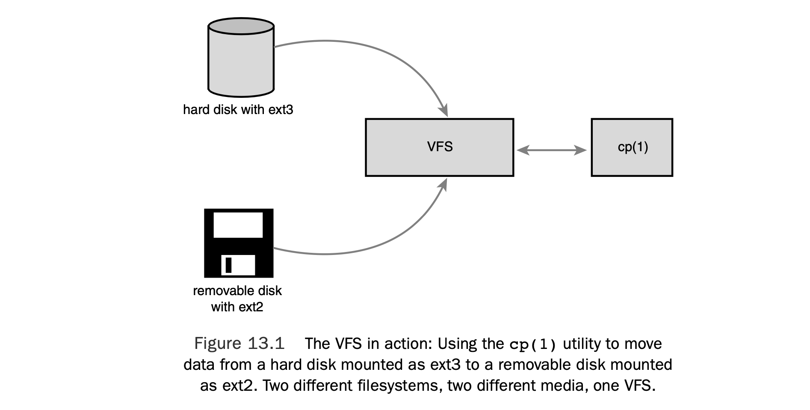

### Common Filesystem Interface

The VFS is the glue that enables system calls such as open(), read(), and write()to work regardless of the filesystem or underlying physical medium.These days, that might not sound novel—we have long been taking such a feature for granted—but it is a non-trivial feat for such generic system calls to work across many diverse filesystems and vary- ing media. More so, the system calls work *between* these different filesystems and media— we can use standard system calls to copy or move files from one filesystem to another. In older operating systems, such as DOS, this would never have worked; any access to a non- native filesystem required special tools. It is only because modern operating systems, such as Linux, abstract access to the filesystems via a virtual interface that such interoperation and generic access is possible.

VFS 是一种**粘合层**，它让 `open()`、`read()`、`write()` 这类系统调用能够正常工作，而不管底层是什么文件系统或物理介质。如今听起来这可能不算什么新奇特性 —— 我们早已对此习以为常 —— 但要让这些通用系统调用能在各式各样的文件系统和介质上工作，本身就是一项很不简单的技术。更进一步，这些系统调用还能**在不同文件系统和介质之间**工作：我们可以用标准系统调用在不同文件系统间复制或移动文件。

在早期操作系统（如 DOS）中，这是完全做不到的；任何对非原生文件系统的访问都需要专用工具。正是因为 Linux 这类现代操作系统通过**虚拟接口**抽象了对文件系统的访问，才实现了这种互操作与通用访问能力。

New filesystems and new varieties of storage media can find their way into Linux, and programs need not be rewritten or even recompiled. In this chapter, we will discuss the VFS, which provides the abstraction allowing myriad filesystems to behave as one. In the next chapter, we will discuss the block I/O layer, which allows various storage devices— CD to Blu-ray discs to hard drives to CompactFlash.Together, theVFS and the block I/O layer provide the abstractions, interfaces, and glue that allow user-space programs to issue generic system calls to access files via a uniform naming policy on any filesystem, which itself exists on any storage medium.

新的文件系统和新类型的存储介质可以不断加入 Linux，而应用程序既不需要重写，甚至也不需要重新编译。

本章我们会讨论 VFS—— 它提供了一层抽象，让形形色色的文件系统表现得如同一个整体。

下一章我们会讨论**块 I/O 层**，它支持各种存储设备：从 CD、蓝光光盘、硬盘到 CF 闪存。

VFS 与块 I/O 层一起，提供了必要的抽象、接口与粘合逻辑，让用户空间程序可以通过通用系统调用，在**任意文件系统、任意存储介质**上，以统一的命名策略访问文件。

### Filesystem Abstraction Layer

Such a generic interface for any type of filesystem is feasible only because the kernel implements an abstraction layer around its low-level filesystem interface.This abstraction layer enables Linux to support different filesystems, even if they differ in supported fea- tures or behavior.This is possible because theVFS provides a common file model that can represent any filesystem’s general feature set and behavior. Of course, it is biased toward Unix-style filesystems. (You see what constitutes a Unix-style filesystem later in this chap- ter.) Regardless, wildly differing filesystem types are still supportable in Linux, from DOS’s FAT to Windows’s NTFS to many Unix-style and Linux-specific filesystems.

之所以能为**各类文件系统**提供一套通用接口，完全是因为内核在底层文件系统接口之上实现了一个**抽象层**。这个抽象层让 Linux 能够支持各式各样的文件系统，即便它们在功能和行为上存在巨大差异。

这一切得以实现，是因为 **VFS** 提供了一套**通用文件模型**，足以表示任何文件系统的核心功能与行为。当然，这套模型会更偏向 **Unix 风格文件系统**（本章后面会介绍什么是 Unix 风格文件系统）。即便如此，Linux 依然能支持差异极大的文件系统：从 DOS 的 FAT、Windows 的 NTFS，到各类 Unix 风格和 Linux 专用文件系统。

The abstraction layer works by defining the basic conceptual interfaces and data struc- tures that all filesystems support.The filesystems mold their view of concepts such as “*this is how I open files*” and “*this is what a directory is to me*” to match the expectations of the VFS.The actual filesystem code hides the implementation details.To theVFS layer and the rest of the kernel, however, each filesystem looks the same.They all support notions such as files and directories, and they all support operations such as creating and deleting files.

抽象层的工作方式，是先定义好**所有文件系统都必须支持**的基本概念接口与数据结构。

每个具体文件系统再把自己的逻辑（比如 “我该如何打开文件”“目录对我来说是什么”）套入 VFS 的这套规范中。具体文件系统的代码会把底层实现细节隐藏起来。

但对 VFS 层和内核其他部分来说，**所有文件系统看起来都一模一样**：它们都有文件和目录的概念，都支持创建、删除文件等操作。

The result is a general abstraction layer that enables the kernel to support many types of filesystems easily and cleanly.The filesystems are programmed to provide the abstracted interfaces and data structures the VFS expects; in turn, the kernel easily works with any filesystem and the exported user-space interface seamlessly works on any filesystem.

最终形成的通用抽象层，让内核可以**简洁、轻松地支持多种文件系统**。

文件系统只需要按 VFS 的要求，实现对应的抽象接口和数据结构；内核就能无缝对接任意文件系统，同时向用户空间导出一套统一的接口。

In fact, nothing in the kernel needs to understand the underlying details of the filesys- tems, except the filesystems themselves. For example, consider a simple user-space pro- gram that does

事实上，内核中除了文件系统自身的代码外，其他部分**完全不需要理解底层文件系统的细节**。

举个例子，一段简单的用户空间程序：

```c
ret = write (fd, buf, len);
```

This system call writes the len bytes pointed to by buf into the current position in the file represented by the file descriptor fd.This system call is first handled by a generic sys_write() system call that determines the actual file writing method for the filesystem on which fd resides.The generic write system call then invokes this method, which is part of the filesystem implementation, to write the data to the media (or whatever this filesys- tem does on write). Figure 13.2 shows the flow from user-space’s write() call through the data arriving on the physical media. On one side of the system call is the genericVFS interface, providing the frontend to user-space; on the other side of the system call is the filesystem-specific backend, dealing with the implementation details.The rest of this chap- ter looks at how theVFS achieves this abstraction and provides its interfaces.

这个系统调用会把 `buf` 指向的 `len` 字节数据，写入文件描述符 `fd` 所对应文件的当前偏移位置。

该系统调用首先由通用的 `sys_write()` 处理，它会先判断 `fd` 所在的文件系统，找到该文件系统实际的写方法；然后调用这个属于文件系统实现的写方法，把数据写到存储介质上（或是该文件系统在写操作中要做的其他逻辑）。

图 13.2 展示了从用户空间调用 `write()`，到数据最终写入物理介质的完整流程。

系统调用的一侧是**通用 VFS 接口**，作为面向用户空间的**前端**；另一侧是**文件系统专属的后端实现**，负责处理底层细节。

本章后续内容会详细介绍 VFS 是如何实现这套抽象、并对外提供接口的。

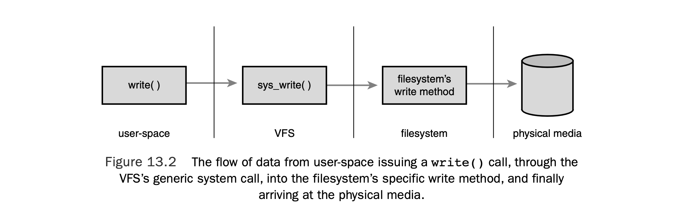

### Unix Filesystems

Historically, Unix has provided four basic filesystem-related abstractions: files, directory entries, inodes, and mount points.

从历史上看，Unix 提供了四种与文件系统相关的基本抽象：**文件**、**目录项**、**索引节点（inode）\**和\**挂载点**。

A *filesystem* is a hierarchical storage of data adhering to a specific structure. Filesystems contain files, directories, and associated control information.Typical operations performed on filesystems are creation, deletion, and mounting. In Unix, filesystems are mounted at a specific mount point in a global hierarchy known as a *namespace*.1 This enables all mounted filesystems to appear as entries in a single tree. Contrast this single, unified tree with the behavior of DOS and Windows, which break the file namespace up into drive letters, such as C:.This breaks the namespace up among device and partition boundaries, “leaking” hardware details into the filesystem abstraction. As this delineation may be arbi- trary and even confusing to the user, it is inferior to Linux’s unified namespace.

**文件系统**是遵循特定结构的层次化数据存储载体，包含文件、目录以及相关的管理信息。对文件系统的典型操作包括创建、删除和挂载。在 Unix 中，文件系统会挂载到一个被称为 **命名空间（namespace）** 的全局层次结构中的指定挂载点上。这使得所有已挂载的文件系统都能出现在同一棵目录树中。

与之形成对比的是 DOS 和 Windows 的设计：它们将文件命名空间按盘符（如 C:）拆分，把命名空间按设备和分区边界割裂，将硬件细节 “暴露” 到文件系统抽象层中。这种划分方式对用户而言既随意又容易混淆，远不如 Linux 的统一命名空间设计。

A *file* is an ordered string of bytes.The first byte marks the beginning of the file, and the last byte marks the end of the file. Each file is assigned a human-readable name for identification by both the system and the user.Typical file operations are read, write, create, and delete.The Unix concept of the file is in stark contrast to record-oriented filesystems, such as OpenVMS’s Files-11. Record-oriented filesystems provide a richer, more structured representation of files than Unix’s simple byte-stream abstraction, at the cost of simplicity and flexibility.

**文件**是有序的字节流，第一个字节是文件开头，最后一个字节是文件结尾。每个文件都有便于人类阅读的名称，供系统和用户标识使用。对文件的典型操作包括读、写、创建和删除。

Unix 的文件概念与面向记录的文件系统（如 OpenVMS 的 Files-11）截然不同。后者能提供比 Unix 简单的字节流抽象更丰富、更结构化的文件表示，但牺牲了简洁性和灵活性。

Files are organized in directories.A *directory* is analogous to a folder and usually con- tains related files. Directories can also contain other directories, called subdirectories. In this fashion, directories may be nested to form paths. Each component of a path is called a *directory entry*. A path example is /home/wolfman/butter—the root directory /, the direc- tories home and wolfman, and the file butter are all directory entries, called *dentries*. In Unix, directories are actually normal files that simply list the files contained therein. Because a directory is a file to theVFS,the same operations performed on files can be performed on directories.

文件被组织在**目录**中。目录类似于文件夹，通常存放相关的文件；目录也可以包含其他目录（即子目录），通过这种嵌套方式形成路径。路径中的每一个组成部分都称为**目录项（directory entry）**。

例如路径 `/home/wolfman/butter` 中：根目录 `/`、目录 `home` 和 `wolfman`、文件 `butter` 都是目录项，也常简称为 **dentry**。

在 Unix 中，目录本质上就是普通文件，只不过内容是其所包含的文件列表。对 VFS 而言目录也是文件，因此适用于文件的操作同样适用于目录。

Unix systems separate the concept of a file from any associated information about it, such as access permissions, size, owner, creation time, and so on.This information is some- times called *file metadata* (that is, data about the file’s data) and is stored in a separate data structure from the file, called the *inode*.This name is short for *index node*, although these days the term *inode* is much more ubiquitous.

Unix 系统将**文件本身**与文件的关联信息（访问权限、大小、所有者、创建时间等）分离开。这些信息被称为**文件元数据（metadata）**，即描述文件数据的数据，存储在与文件分离的数据结构中，这个结构就是 **inode（索引节点）**。inode 是 index node 的缩写，如今已是内核中通用的术语。

All this information is tied together with the filesystem’s own control information, which is stored in the *superblock*.The superblock is a data structure containing information about the filesystem as a whole. Sometimes the collective data is referred to as *filesystem metadata*. Filesystem metadata includes information about both the individual files and the filesystem as a whole.

所有这些信息，再加上文件系统自身的管理信息，都存储在**超级块（superblock）**中。超级块是描述整个文件系统全局信息的数据结构。这些整体信息有时被统称为**文件系统元数据**，既包含单个文件的元数据，也包含文件系统的全局元数据。

Traditionally, Unix filesystems implement these notions as part of their physical on- disk layout. For example, file information is stored as an inode in a separate block on the disk; directories are files; control information is stored centrally in a superblock, and so on.The Unix file concepts are *physically mapped* on to the storage medium.The Linux VFS is designed to work with filesystems that understand and implement such concepts. Non-Unix filesystems, such as FAT or NTFS, still work in Linux, but their filesystem code must provide the appearance of these concepts. For example, even if a filesystem does not support distinct inodes, it must assemble the inode data structure in memory as if it did. Or if a filesystem treats directories as a special object, to the VFS they must repre- sent directories as mere files. Often, this involves some special processing done on-the-fly by the non-Unix filesystems to cope with the Unix paradigm and the requirements of the VFS. Such filesystems still work, however, and the overhead is not unreasonable.

传统的 Unix 文件系统会将这些概念直接映射到物理磁盘布局上：例如文件信息以 inode 形式存放在磁盘的独立块中；目录就是普通文件；管理信息集中存放在超级块中等。Unix 的文件概念会**物理映射**到存储介质上。

Linux VFS 的设计初衷就是适配这类实现了 Unix 概念的文件系统。FAT、NTFS 等非 Unix 文件系统也能在 Linux 中工作，但它们的文件系统代码必须**模拟出**这些 Unix 概念。

例如，即便某个文件系统本身没有独立的 inode，也必须在内存中构造出 inode 结构体；如果某个文件系统把目录当作特殊对象，也必须在 VFS 层面把它伪装成普通文件。

通常，非 Unix 文件系统需要通过一些**实时处理**来适配 Unix 范式和 VFS 的要求，但依然可以正常工作，且带来的额外开销并不大。

### VFS Objects and Their Data Structures

TheVFS is object-oriented.2 A family of data structures represents the common file model.These data structures are akin to objects. Because the kernel is programmed strictly in C, without the benefit of a language directly supporting object-oriented para- digms, the data structures are represented as C structures.The structures contain both data and pointers to filesystem-implemented functions that operate on the data.

VFS 是**面向对象**的。一系列数据结构共同表示了通用文件模型，这些数据结构就相当于对象。由于内核完全使用 C 语言开发，没有语言层面直接支持面向对象的特性，因此这些 “对象” 都以 C 结构体的形式实现。结构体中既包含数据，也包含指向由具体文件系统实现、用于操作这些数据的函数指针。

The four primary object types of theVFS are

- The *superblock* object, which represents a specific mounted filesystem.
- The *inode* object, which represents a specific file.
- The *dentry* object, which represents a directory entry, which is a single component of a path.
- The *file* object, which represents an open file as associated with a process.

VFS 有**四种核心对象类型**：

- **超级块（superblock）对象**：表示一个已挂载的具体文件系统。
- **索引节点（inode）对象**：表示一个具体的文件。
- **目录项（dentry）对象**：表示一个目录项，也就是路径中的一个分量。
- **文件（file）对象**：表示一个与进程关联的已打开文件。

Note that because theVFS treats directories as normal files,there is not a specific directory object. Recall from earlier in this chapter that a dentry represents a component in a path, which might include a regular file. In other words, a dentry is not the same as a directory, but a directory is just another kind of file. Got it?

注意：由于 VFS 把目录当作普通文件对待，因此**没有专门的 “目录对象”**。前面章节提到过，dentry 表示路径中的一个分量，它也可能是一个普通文件。

换句话说：**dentry 不等于目录**，目录只是另一种类型的文件。明白这一点了吗？

An *operations* object is contained within each of these primary objects.These objects describe the methods that the kernel invokes against the primary objects:

- The super_operations object, which contains the methods that the kernel can invoke on a specific filesystem, such as write_inode() and sync_fs()
- The inode_operations object, which contains the methods that the kernel can invoke on a specific file, such as create() and link()
- The dentry_operations object, which contains the methods that the kernel can invoke on a specific directory entry, such as d_compare() and d_delete()
- The file_operations object, which contains the methods that a process can invoke on an open file, such as read() and write()

每个核心对象内部都包含一个**操作对象（operations object）**。这些对象定义了内核可以对核心对象执行的方法：

- `super_operations` 对象：包含内核可对特定文件系统执行的方法，如 `write_inode()`、`sync_fs()`。
- `inode_operations` 对象：包含内核可对特定文件执行的方法，如 `create()`、`link()`。
- `dentry_operations` 对象：包含内核可对特定目录项执行的方法，如 `d_compare()`、`d_delete()`。
- `file_operations` 对象：包含进程可对已打开文件执行的方法，如 `read()`、`write()`。

The operations objects are implemented as a structure of pointers to functions that operate on the parent object. For many methods, the objects can inherit a generic func- tion if basic functionality is sufficient. Otherwise, the specific instance of the particular filesystem fills in the pointers with its own filesystem-specific methods.

这些操作对象以**函数指针结构体**的形式实现，用于操作其所属的主对象。

对于很多通用方法，如果基础功能足够，这些对象可以直接使用通用函数；否则，具体文件系统的实例会用自己的文件系统专属方法来填充这些指针。

Again, note that *objects* refer to structures—not explicit class types, such as those in C++ or Java.These structures, however, represent specific instances of an object, their associated data, and methods to operate on themselves.They are very much objects.

再次强调：这里所说的 **“对象”** 指的是结构体，而不是 C++ 或 Java 中显式的类类型。

但这些结构体依然是真正意义上的对象：它们表示某个对象的具体实例、关联的数据，以及操作自身的方法。

TheVFS loves structures,and it is comprised of a couple more than the primary objects previously discussed. Each registered filesystem is represented by a file_system_type structure.This object describes the filesystem and its capabilities. Fur- thermore, each mount point is represented by the vfsmount structure.This structure con- tains information about the mount point, such as its location and mount flags.

VFS 大量使用结构体，除了上面提到的核心对象外，还有几个重要结构：

- 每个已注册的文件系统用 `file_system_type` 结构体表示，它描述了文件系统及其功能。
- 每个挂载点用 `vfsmount` 结构体表示，包含挂载点的位置、挂载标志等信息。

Finally, two per-process structures describe the filesystem and files associated with a process.They are, respectively, the fs_struct structure and the file structure.

最后，还有两个**每进程**结构体，用于描述与进程相关的文件系统和文件：

分别是 `fs_struct` 结构体和 `file_struct` 结构体。

The rest of this chapter discusses these objects and the role they play in implementing theVFS layer.

本章后续内容会详细讨论这些对象，以及它们在实现 VFS 层时所扮演的角色。

### The Superblock Object

The superblock object is implemented by each filesystem and is used to store information describing that specific filesystem.This object usually corresponds to the *filesystem superblock* or the *filesystem control block*, which is stored in a special sector on disk (hence the object’s name). Filesystems that are not disk-based (a virtual memory–based filesys- tem, such as *sysfs*, for example) generate the superblock on-the-fly and store it in memory.

**超级块对象**由每个文件系统各自实现，用于存放描述该文件系统的信息。

这个对象通常对应**文件系统超级块**或**文件系统控制块**，它们被存在磁盘上的特定扇区中（这也是 “超级块” 名字的来源）。

对于不基于磁盘的文件系统（比如基于虚拟内存的 `sysfs` 这类文件系统），超级块会**动态生成**并只保存在内存里。

The superblock object is represented by struct super_block and defined in <linux/fs.h>. Here is what it looks like, with comments describing each entry:

超级块对象用 `struct super_block` 表示，定义在 `<linux/fs.h>` 中。结构体大致如下（已附上注释说明各个成员）：

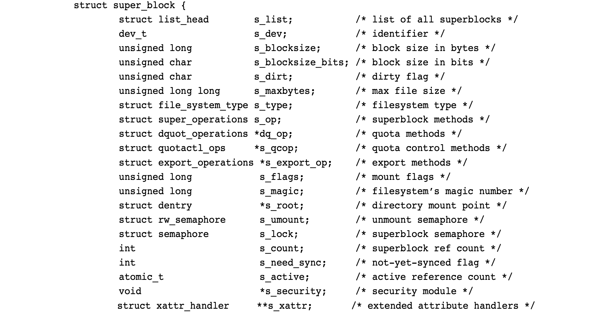

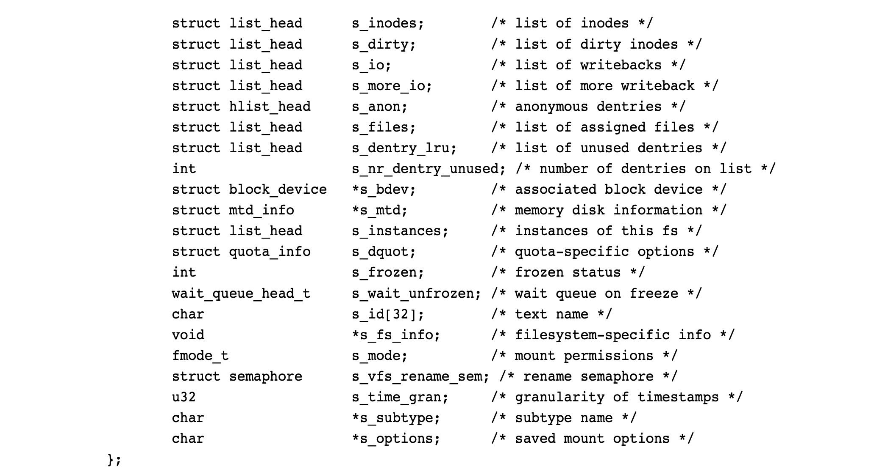

The code for creating, managing, and destroying superblock objects lives in fs/super.c. A superblock object is created and initialized via the alloc_super() func- tion.When mounted, a filesystem invokes this function, reads its superblock off of the disk, and fills in its superblock object.

创建、管理和销毁超级块对象的代码位于 `fs/super.c`。超级块对象通过 `alloc_super()` 函数创建并初始化。文件系统在挂载时，会调用这个函数，从磁盘读取超级块信息，然后填充自己的超级块对象。

### Superblock Operations

The most important item in the superblock object is s_op, which is a pointer to the superblock operations table.The superblock operations table is represented by struct super_operations and is defined in <linux/fs.h>. It looks like this:

超级块对象里最重要的成员是 **s_op**，它是一个指向**超级块操作表**的指针。超级块操作表由 `struct super_operations` 结构体表示，定义在 `<linux/fs.h>` 中，形式如下：

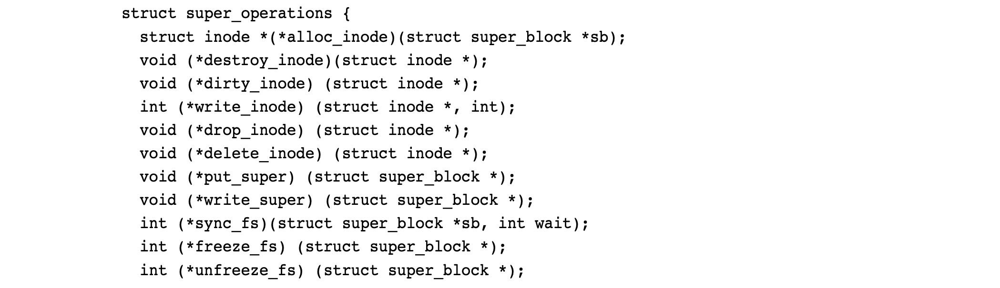

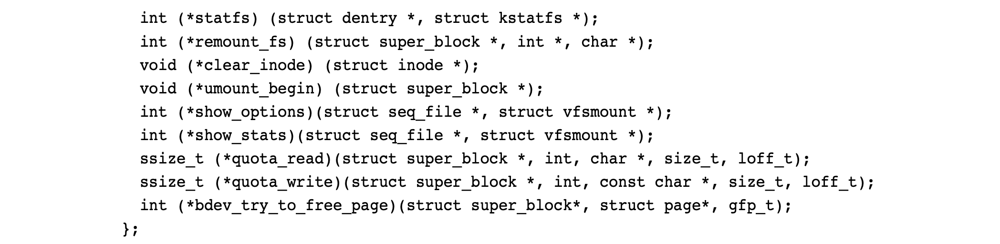

Each item in this structure is a pointer to a function that operates on a superblock object.The superblock operations perform low-level operations on the filesystem and its inodes.

该结构体里的每一项都是一个函数指针，指向用于操作超级块对象的函数。

超级块操作负责对文件系统及其索引节点执行底层操作。

When a filesystem needs to perform an operation on its superblock, it follows the pointers from its superblock object to the desired method. For example, if a filesystem wanted to write to its superblock, it would invoke

当一个文件系统需要对自身超级块执行某项操作时，就会通过超级块对象里的指针，找到对应的方法。

例如，如果文件系统需要把超级块写回磁盘，就会调用：

```c
sb->s_op->write_super(sb);
```

In this call, sb is a pointer to the filesystem’s superblock. Following that pointer into s_op yields the superblock operations table and ultimately the desired write_super() function, which is then invoked. Note how the write_super() call must be passed a superblock, despite the method being associated with one.This is because of the lack of object-oriented support in C. In C++, a call such as the following would suffice:

在这个调用里，`sb` 是指向该文件系统超级块的指针。通过这个指针找到 `s_op`，就能得到超级块操作表，最终定位并调用需要的 `write_super()` 函数。

注意：即便这个方法已经和超级块关联，调用 `write_super()` 时仍然**必须把超级块传进去**。

原因是：**C 语言本身不支持面向对象**。

在 C++ 里，只需要像下面这样调用就够了：

```c
sb.write_super();
```

In C, there is no way for the method to easily obtain its parent, so you have to pass it.

而在 C 里，方法没办法直接拿到它所属的 “对象”，所以必须显式传进去。

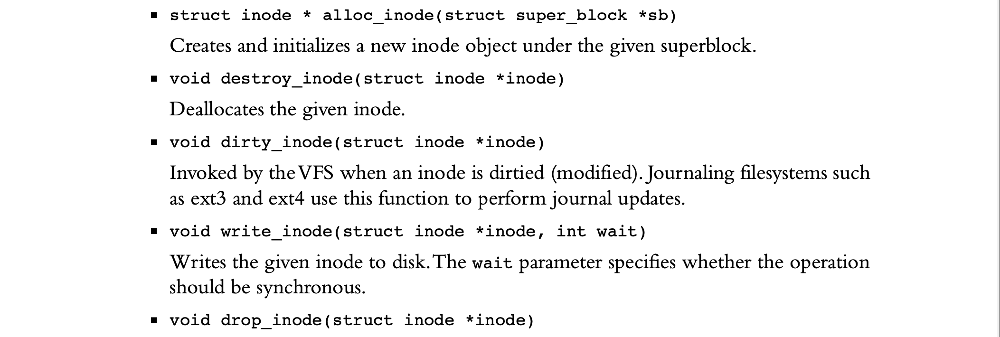

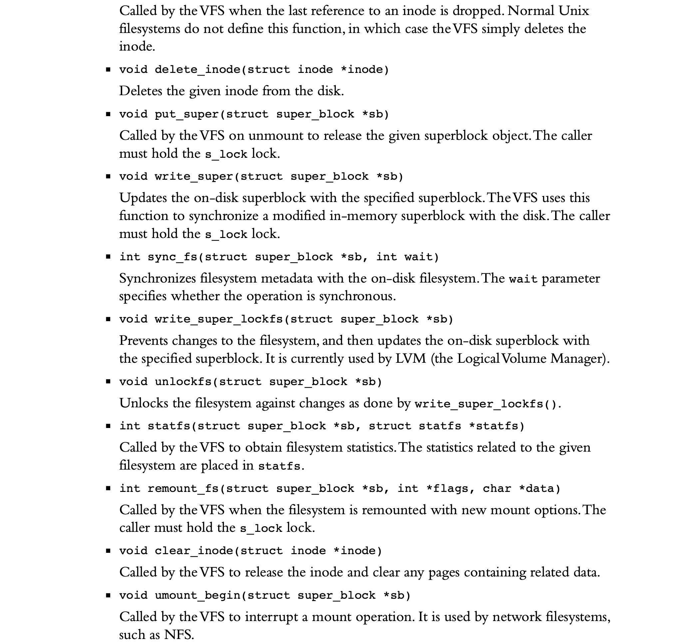

All these functions are invoked by theVFS,in process context.All except dirty_inode() may all block if needed.

所有这些函数都由 VFS 在**进程上下文**中调用。

除 `dirty_inode()` 外，其余函数在需要时都可以**阻塞**。

Some of these functions are optional; a specific filesystem can then set its value in the superblock operations structure to NULL. If the associated pointer is NULL, the VFS either calls a generic function or does nothing, depending on the operation.

这些函数中有一部分是**可选的**。某个具体文件系统可以把它在超级块操作结构体里对应的指针设为 `NULL`。如果对应的指针是 `NULL`，VFS 会根据操作的类型，要么调用一个通用函数，要么什么都不做。

### The Inode Object

The inode object represents all the information needed by the kernel to manipulate a file or directory. For Unix-style filesystems, this information is simply read from the on-disk inode. If a filesystem does not have inodes, however, the filesystem must obtain the infor- mation from wherever it is stored on the disk. Filesystems without inodes generally store file-specific information as part of the file; unlike Unix-style filesystems, they do not sepa- rate file data from its control information. Some modern filesystems do neither and store file metadata as part of an on-disk database.Whatever the case, the inode object is con- structed in memory in whatever manner is applicable to the filesystem.

索引节点对象（inode object）包含了内核操作文件或目录所需的全部信息。对于类 Unix 文件系统，这些信息直接从磁盘上的索引节点中读取。但如果某个文件系统本身没有索引节点，它就必须从磁盘上的相应存储位置获取这些信息。

没有索引节点的文件系统，通常会把文件专属信息和文件本身存放在一起；和类 Unix 文件系统不同，它们不会把文件数据和控制信息分开。一些现代文件系统则两种方式都不用，而是把文件元数据存放在磁盘上的数据库里。无论哪种情况，索引节点对象都会以适配对应文件系统的方式在内存中构建。

The inode object is represented by struct inode and is defined in <linux/fs.h>. Here is the structure, with comments describing each entry:

索引节点对象由 `struct inode` 结构体表示，定义在 `<linux/fs.h>` 中。下面是该结构体，并附带注释说明每个成员：

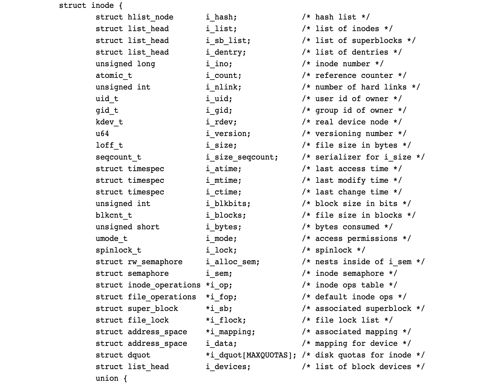

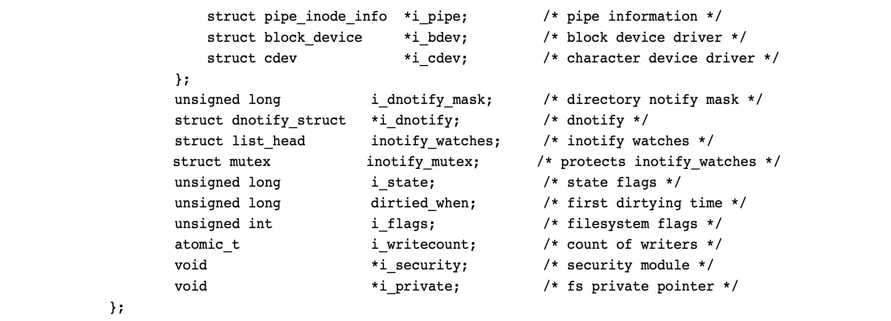

An inode represents each file on a filesystem, but the inode object is constructed in memory only as files are accessed.This includes special files, such as device files or pipes. Consequently, some of the entries in struct inode are related to these special files. For example, the i_pipe entry points to a named pipe data structure, i_bdev points to a block device structure, and i_cdev points to a character device structure.These three pointers are stored in a union because a given inode can represent only one of these (or none of them) at a time.

一个索引节点对应文件系统里的一个文件，但索引节点对象**只有在文件被访问时**才会在内存中创建，这也包括设备文件、管道等特殊文件。因此，`struct inode` 里的一些成员和这些特殊文件相关。

比如，`i_pipe` 指针指向命名管道的数据结构，`i_bdev` 指向块设备结构体，`i_cdev` 指向字符设备结构体。这三个指针放在一个**联合体**里，因为一个索引节点同一时间只能表示其中一种（或者都不表示）。

It might occur that a given filesystem does not support a property represented in the inode object. For example, some filesystems might not record an access timestamp. In that case, the filesystem is free to implement the feature however it sees fit; it can store zero for i_atime, make i_atime equal to i_mtime, update i_atime in memory but never flush it back to disk, or whatever else the filesystem implementer decides.

有可能某个文件系统并不支持索引节点对象里定义的某些属性。例如，有的文件系统不记录访问时间戳。这种情况下，文件系统可以按自己的方式实现：可以把 `i_atime` 存成 0，可以让 `i_atime` 等于 `i_mtime`，可以只在内存里更新 `i_atime` 但不回写到磁盘，或者采用文件系统实现者决定的其他任何方式。

### Inode Operations

As with the superblock operations, the inode_operations member is important. It describes the filesystem’s implemented functions that theVFS can invoke on an inode.As with the superblock, inode operations are invoked via

与超级块操作（superblock operations）类似，`inode_operations` 成员也至关重要。它描述了文件系统实现的、虚拟文件系统（VFS）可对索引节点（inode）调用的函数。和超级块操作的调用方式一致，索引节点操作的调用形式如下：

```c
i->i_op->truncate(i)
```

In this call, i is a reference to a particular inode. In this case, the truncate() operation defined by the filesystem on which i exists is called on the given inode.The inode_operations structure is defined in <linux/fs.h>:

在该调用中，`i` 是指向某个特定索引节点的引用。此场景下，会对指定的索引节点调用其所属文件系统定义的 `truncate()`（截断）操作。`inode_operations` 结构体定义在 `<linux/fs.h>` 头文件中：

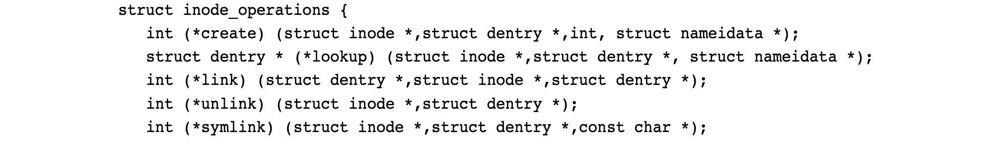

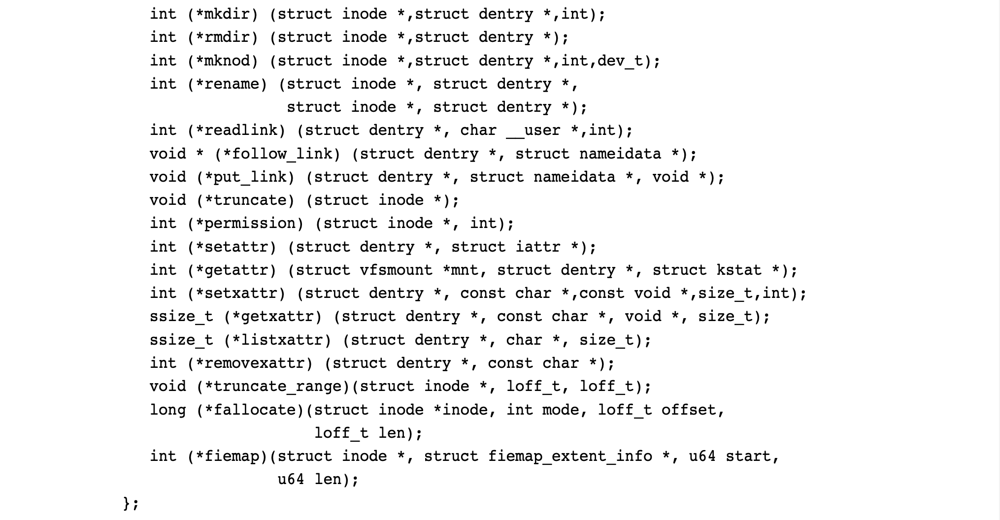

The following interfaces constitute the various functions that the VFS may perform, or ask a specific filesystem to perform, on a given inode:

以下接口涵盖了虚拟文件系统（VFS）可直接对指定索引节点执行的各类函数，或是 VFS 要求特定文件系统对指定索引节点执行的各类函数：

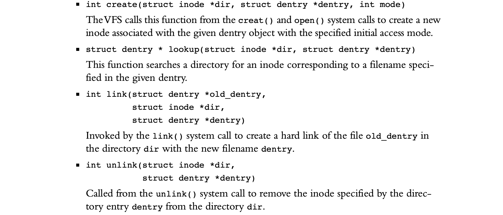

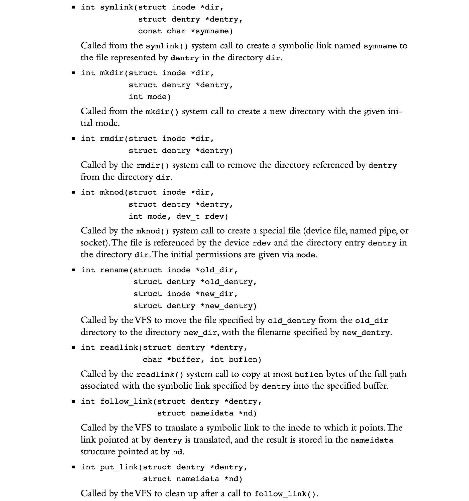

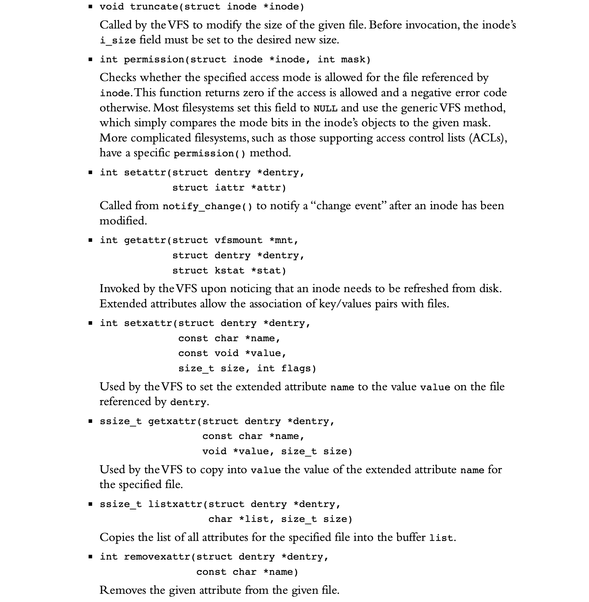

### The Dentry Object

As discussed, the VFS treats directories as a type of file. In the path /bin/vi, both bin and vi are files—bin being the special directory file and vi being a regular file. An inode object represents each of these components. Despite this useful unification, the VFS often needs to perform directory-specific operations, such as path name lookup. Path name lookup involves translating each component of a path, ensuring it is valid, and following it to the next component.

如前文所述，虚拟文件系统（VFS）将目录视为一类特殊的文件。以路径 `/bin/vi` 为例，`bin` 和 `vi` 均为文件 —— 其中 `bin` 是特殊的目录文件，`vi` 则是普通文件。路径中的每个组件都由一个索引节点（inode）对象表示。尽管这种统一设计十分实用，但 VFS 仍经常需要执行目录专属的操作（例如路径名查找）。路径名查找的过程包括解析路径中的每个组件、验证其有效性，并沿着该组件定位到下一个组件。

To facilitate this, the VFS employs the concept of a directory entry (dentry). A *dentry* is a specific component in a path. Using the previous example, /, bin, and vi are all dentry objects.The first two are directories and the last is a regular file.This is an important point: Dentry objects are *all* components in a path, including files. Resolving a path and walking its components is a nontrivial exercise, time-consuming and heavy on string operations, which are expensive to execute and cumbersome to code.The dentry object makes the whole process easier.

为简化这一过程，VFS 引入了**目录项（dentry）** 的概念。一个目录项（dentry）对应路径中的一个具体组件。沿用前述示例，`/`、`bin` 和 `vi` 均为目录项对象 —— 前两个是目录，最后一个是普通文件。这里需要强调：目录项对象涵盖路径中的**所有**组件，包括文件在内。解析路径并遍历其组件并非易事：该过程既耗时又涉及大量字符串操作，而字符串操作不仅执行开销大，编码也十分繁琐。目录项对象的引入让整个过程变得更为简便。

Dentries might also include mount points. In the path /mnt/cdrom/foo, the compo- nents /,mnt,cdrom, and foo are all dentry objects.TheVFS constructs dentry objects on- the-fly, as needed, when performing directory operations.

目录项也可能包含挂载点。以路径 `/mnt/cdrom/foo` 为例，`/`、`mnt`、`cdrom` 和 `foo` 均为目录项对象。VFS 在执行目录操作时，会根据需要**动态**创建目录项对象。

Dentry objects are represented by struct dentry and defined in <linux/dcache.h>. Here is the structure, with comments describing each member:

目录项对象由 `struct dentry` 结构体表示，定义在 `<linux/dcache.h>` 头文件中。以下是该结构体的定义，并附带注释说明每个成员：

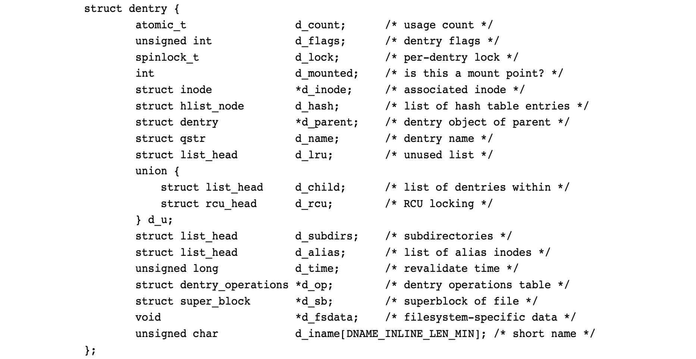

Unlike the previous two objects, the dentry object does not correspond to any sort of on-disk data structure.TheVFS creates it on-the-fly from a string representation of a path name. Because the dentry object is not physically stored on the disk, no flag in struct dentry specifies whether the object is modified (that is, whether it is dirty and needs to be written back to disk).

与前两种对象（超级块、索引节点）不同，目录项对象**并不对应磁盘上的任何数据结构**。VFS 根据路径名的字符串形式动态创建该对象。由于目录项对象并非物理存储在磁盘上，`struct dentry` 中也就没有用于标识对象是否被修改（即是否为 “脏” 状态、是否需要写回磁盘）的标志位。

#### Dentry State

A valid dentry object can be in one of three states: used, unused, or negative.

一个有效的目录项（dentry）对象可以处于三种状态之一：**已使用（used）**、**未使用（unused）** 或 **负状态（negative）**。

A used dentry corresponds to a valid inode (d_inode points to an associated inode) and indicates that there are one or more users of the object (d_count is positive).A used dentry is in use by the VFS and points to valid data and, thus, cannot be discarded.

**已使用目录项**对应一个有效的索引节点（`d_inode` 指向关联的索引节点），并且表明该对象存在一个或多个使用者（`d_count` 引用计数为正）。已使用的目录项正被 VFS 使用，指向有效数据，因此**不能被丢弃**。

An unused dentry corresponds to a valid inode (d_inode points to an inode), but the VFS is not currently using the dentry object (d_count is zero). Because the dentry object still points to a valid object, the dentry is kept around—cached—in case it is needed again. Because the dentry has not been destroyed prematurely, the dentry need not be re- created if it is needed in the future, and path name lookups can complete quicker than if the dentry was not cached. If it is necessary to reclaim memory, however, the dentry can be discarded because it is not in active use.

**未使用目录项** 同样对应有效的索引节点（`d_inode` 指向索引节点），但 VFS 当前并未使用该目录项对象（`d_count` 引用计数为 0）。由于目录项仍指向有效对象，内核会将其保留并**缓存**，以备再次使用。因为目录项没有被提前销毁，后续需要时不必重新创建，路径名查找会比无缓存时更快。不过，当需要回收内存时，该目录项可以被丢弃，因为它并未被活跃使用。

A negative dentry is not associated with a valid inode (d_inode is NULL) because either the inode was deleted or the path name was never correct to begin with.The dentry is kept around, however, so that future lookups are resolved quickly. For example, consider a daemon that continually tries to open and read a config file that is not present.The open() system calls continually returns ENOENT, but not until after the kernel constructs the path, walks the on-disk directory structure, and verifies the file’s inexistence. Because even this failed lookup is expensive, caching the “negative” results are worthwhile. Although a negative dentry is useful, it can be destroyed if memory is at a premium because nothing is actually using it.

**负状态目录项**不与任何有效的索引节点关联（`d_inode` 为 `NULL`），原因可能是索引节点已被删除，或是路径名本身从一开始就不合法。但内核仍会保留这类目录项，以便快速处理后续查找。举个例子：某个守护进程不断尝试打开并读取一个不存在的配置文件。`open()` 系统调用会持续返回 `ENOENT`（文件不存在），但在此之前，内核需要先构建路径、遍历磁盘目录结构、确认文件不存在。由于即便这种失败查找开销也很大，缓存这类 “负向” 结果是很有价值的。负状态目录项虽有用，但在内存紧张时也可以被销毁，因为没有任何实体实际使用它。

A dentry object can also be freed, sitting in the slab object cache, as discussed in the previous chapter. In that case, there is no valid reference to the dentry object in any VFS or any filesystem code.

如前一章所述，目录项对象也可以被释放，存放在 **slab 对象缓存** 中。这种情况下，VFS 或任何文件系统代码中，都不存在对该目录项对象的有效引用。

#### The Dentry Cache

After theVFS layer goes through the trouble of resolving each element in a path name into a dentry object and arriving at the end of the path, it would be quite wasteful to throw away all that work. Instead, the kernel caches dentry objects in the dentry cache or, simply, the *dcache*.

在虚拟文件系统（VFS）层费尽周折将路径名中的每个元素解析为目录项（dentry）对象，并遍历到路径末尾之后，如果将这些工作成果全部丢弃，将会是极大的浪费。因此，内核会将目录项对象缓存在 **目录项缓存（dentry cache）** 中，简称为 **dcache**。

The dentry cache consists of three parts:

- Lists of “used” dentries linked off their associated inode via the i_dentry field of the inode object. Because a given inode can have multiple links, there might be multiple dentry objects; consequently, a list is used.
- A doubly linked “least recently used” list of unused and negative dentry objects.The list is inserted at the head, such that entries toward the head of the list are newer than entries toward the tail.When the kernel must remove entries to reclaim mem- ory, the entries are removed from the tail; those are the oldest and presumably have the least chance of being used in the near future.
- A hash table and hashing function used to quickly resolve a given path into the associated dentry object.

目录项缓存由三部分组成：

- **已使用目录项链表**：通过索引节点对象中的 `i_dentry` 字段，挂接到其关联的索引节点上。由于一个索引节点可以存在多个硬链接，可能会对应多个目录项对象，因此使用链表来组织。
- **未使用与负状态目录项的双向 “最近最少使用”（LRU）链表**：新条目插入链表头部，因此越靠近头部的条目越新，越靠近尾部的条目越旧。当内核必须回收内存而需要删除条目时，会从链表尾部移除 —— 这些是最旧的条目，大概率在近期内不会再被使用。
- **哈希表与哈希函数**：用于快速将给定路径名解析为对应的目录项对象。

The hash table is represented by the dentry_hashtable array. Each element is a pointer to a list of dentries that hash to the same value.The size of this array depends on the amount of physical RAM in the system.

哈希表由 `dentry_hashtable` 数组表示。数组中的每个元素是一个指针，指向哈希值相同的一组目录项构成的链表。该数组的大小取决于系统中的物理内存容量。

The actual hash value is determined by d_hash().This enables filesystems to provide a unique hashing function.

实际的哈希值由 `d_hash()` 函数计算得出。这种设计允许文件系统提供自定义的哈希函数。

Hash table lookup is performed via d_lookup(). If a matching dentry object is found in the dcache, it is returned. On failure, NULL is returned.

哈希表的查找操作通过 `d_lookup()` 完成。如果在目录项缓存中找到匹配的目录项对象，则返回该对象；查找失败则返回 `NULL`。

As an example, assume that you are editing a source file in your home directory, /home/dracula/src/the_sun_sucks.c. Each time this file is accessed (for example, when you first open it, later save it, compile it, and so on), the VFS must follow each directory entry to resolve the full path:/,home,dracula,src,and finally the_sun_sucks.c.To avoid this time-consuming operation each time this path name is accessed, the VFS can first try to look up the path name in the dentry cache. If the lookup succeeds, the required final dentry object is obtained without serious effort. Conversely, if the dentry is not in the dentry cache, the VFS must manually resolve the path by walking the filesystem for each component of the path.After this task is completed,the kernel adds the dentry objects to the dcache to speed up any future lookups.

举个例子，假设你正在编辑家目录下的一个源文件：`/home/dracula/src/the_sun_sucks.c`。每次访问该文件时（例如首次打开、后续保存、编译等），VFS 都需要遍历各级目录项来解析完整路径：`/`、`home`、`dracula`、`src`，最后是 `the_sun_sucks.c`。为了避免每次访问路径名都执行这种耗时操作，VFS 会先尝试在目录项缓存中查找该路径名。如果查找命中，无需复杂操作就能获取所需的最终目录项对象。反之，如果该目录项不在缓存中，VFS 就必须遍历文件系统，逐个解析路径组件。完成解析后，内核会将这些目录项对象加入目录项缓存，以加快后续的查找速度。

The dcache also provides the front end to an inode cache, the *icache*. Inode objects that are associated with dentry objects are not freed because the dentry maintains a positive usage count over the inode.This enables dentry objects to pin inodes in memory.As long as the dentry is cached, the corresponding inodes are cached, too. Consequently, when a path name lookup succeeds from cache, as in the previous example, the associated inodes are already cached in memory.

目录项缓存同时也是 **索引节点缓存（inode cache，简称 icache）** 的前端。与目录项对象关联的索引节点对象不会被释放，因为目录项会对索引节点维持一个正的引用计数。这使得目录项对象可以将索引节点 “钉” 在内存中。只要目录项被缓存，对应的索引节点也会被缓存。因此，像上面的例子一样，当路径名查找从缓存中命中时，其关联的索引节点早已在内存中缓存。

Caching dentries and inodes is beneficial because file access exhibits both spatial and temporal locality. File access is temporal in that programs tend to access and reaccess the same files over and over.Thus when a file is accessed, there is a high probability that caching the associated dentries and inodes will result in a cache hit in the near future. File access is spatial in that programs tend to access multiple files in the same directory.Thus caching directories entries for one file have a high probability of a cache hit, as a related file is likely manipulated next.

缓存目录项与索引节点是十分有益的，因为文件访问存在**空间局部性**与**时间局部性**。

文件访问的**时间局部性**体现在：程序往往会反复访问同一个文件。因此，在访问一个文件时，将其关联的目录项与索引节点缓存起来，极有可能在不久后命中缓存。

文件访问的**空间局部性**体现在：程序往往会访问同一个目录下的多个文件。因此，缓存某个文件的目录项后，接下来操作相关文件时，也有很大概率命中缓存。

### Dentry Operations

The dentry_operations structure specifies the methods that the VFS invokes on directory entries on a given filesystem.

The dentry_operations structure is defined in <linux/dcache.h>:

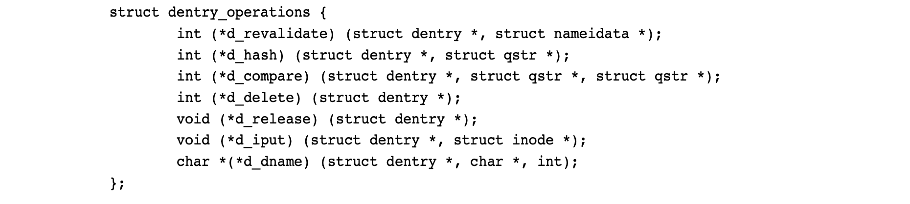

The methods are as follows:

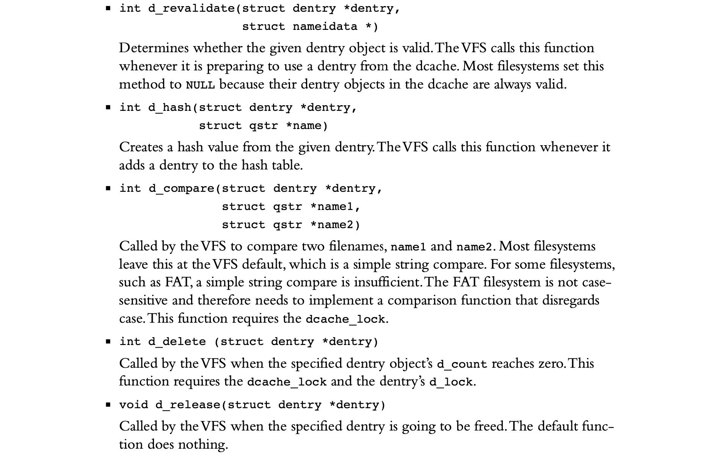


### The File Object

The final primaryVFS object that we shall look at is the file object.The file object is used to represent a file opened by a process.When we think of theVFS from the perspective of user-space, the file object is what readily comes to mind. Processes deal directly with files, not superblocks, inodes, or dentries. It is not surprising that the information in the file object is the most familiar (data such as access mode and current offset) or that the file operations are familiar system calls such as read() and write().

我们要介绍的最后一个核心 VFS 对象是**文件对象（file object）**。文件对象用于表示**进程已打开的文件**。从用户空间的视角理解 VFS 时，最先联想到的就是文件对象。进程直接操作的是文件，而非超级块、索引节点或目录项。因此，文件对象中存储的是我们最熟悉的信息（如访问模式、当前偏移量），文件操作也是我们熟知的`read()`、`write()`等系统调用，这也就不足为奇了。

The file object is the in-memory representation of an open file.The object (but not the physical file) is created in response to the open() system call and destroyed in response to the close() system call. All these file-related calls are actually methods defined in the file operations table. Because multiple processes can open and manipulate a file at the same time, there can be multiple file objects in existence for the same file.The file object merely represents a process’s view of an open file.The object points back to the dentry (which in turn points back to the inode) that actually represents the open file.The inode and dentry objects, of course, are unique.

文件对象是**已打开文件在内存中的表示**。该对象（而非物理文件）会响应`open()`系统调用而创建，响应`close()`系统调用而销毁。所有这些与文件相关的调用，实际上都是**文件操作表**中定义的方法。由于多个进程可同时打开并操作同一个文件，同一个文件可以对应多个文件对象。文件对象仅代表**进程对已打开文件的操作视角**，它会回指目录项对象（dentry），而目录项对象再回指实际表示该文件的索引节点对象（inode）。当然，索引节点和目录项对象是全局唯一的。

The file object is represented by struct file and is defined in <linux/fs.h>. Let’s look at the structure, again with comments added to describe each entry:

文件对象由`struct file`结构体表示，定义在`<linux/fs.h>`头文件中。我们来看该结构体，同样添加注释说明每个成员：

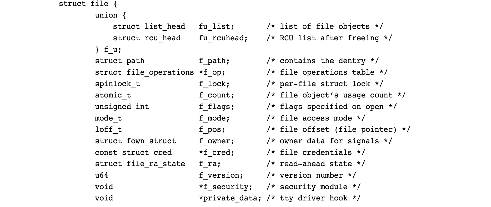


Similar to the dentry object, the file object does not actually correspond to any on- disk data.Therefore, no flag in the object represents whether the object is dirty and needs to be written back to disk.The file object does point to its associated dentry object via the f_dentry pointer.The dentry in turn points to the associated inode, which reflects whether the file itself is dirty.

与目录项对象类似，文件对象**并不对应磁盘上的任何实际数据结构**。因此，该对象中没有标识其是否为脏、是否需要写回磁盘的标志位。文件对象通过`f_dentry`指针指向其关联的目录项对象，而目录项对象又会指向对应的索引节点对象，由索引节点来记录文件本身是否为脏。

Filesystems can implement unique functions for each of these operations, or they can use a generic method if one exists.The generic methods tend to work fine on normal Unix-based filesystems.A filesystem is under no obligation to implement all these meth- ods—although not implementing the basics is silly—and can simply set the method to NULL if not interested.

Here are the individual operations:

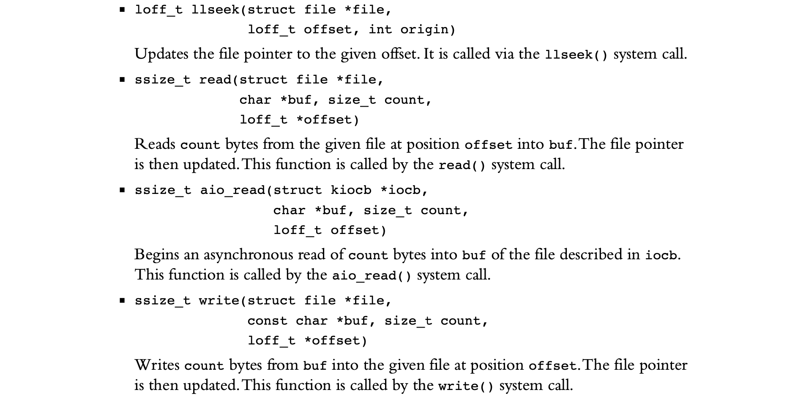

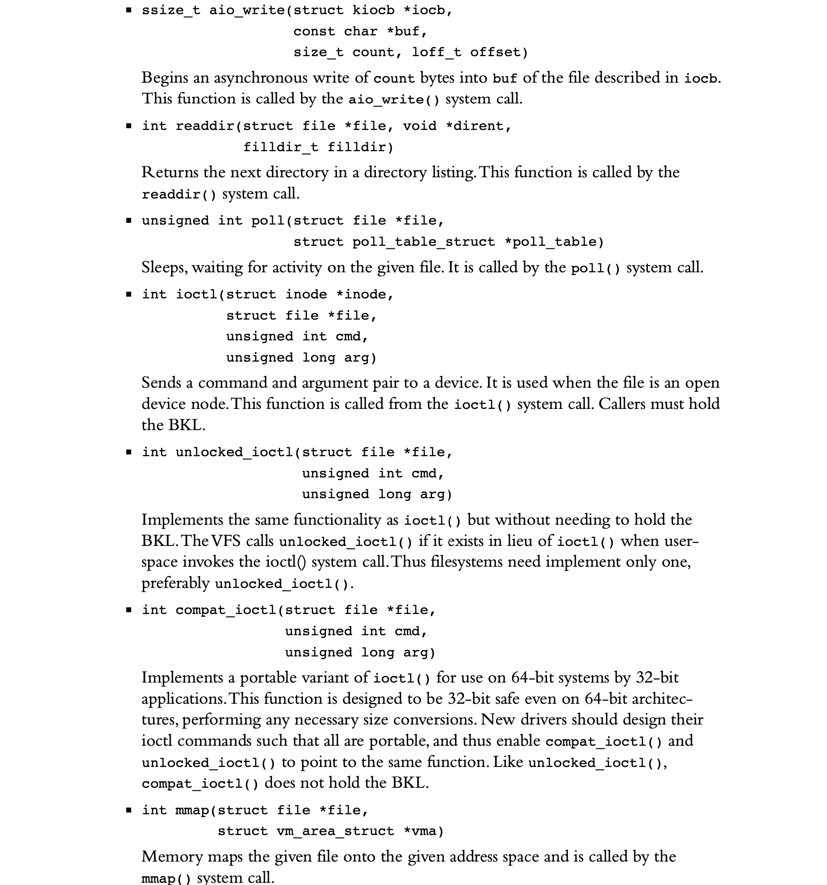

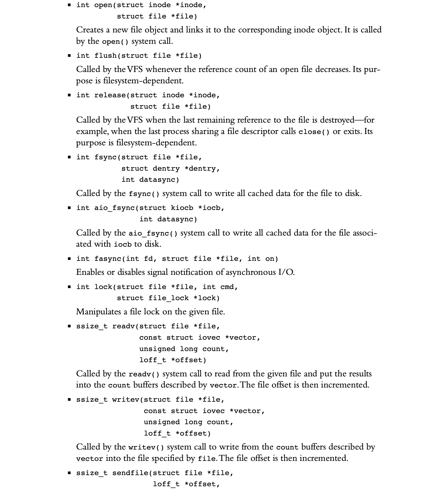

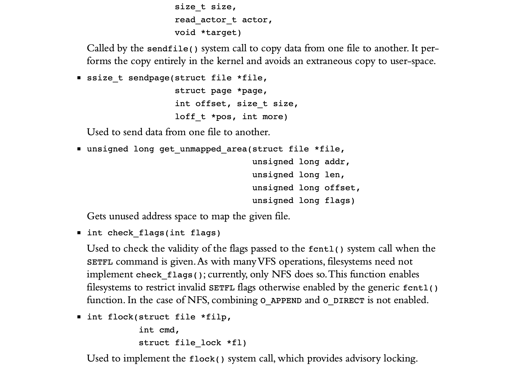

### Data Structures Associated with a Process

Each process on the system has its own list of open files, root filesystem, current working directory, mount points, and so on.Three data structures tie together theVFS layer and the processes on the system: files_struct, fs_struct, and namespace.

系统中的**每个进程**都有自己的一组打开文件列表、根文件系统、当前工作目录、挂载点等。
 有 **三个数据结构** 将 **VFS 层** 与系统中的进程关联起来： **files_struct、fs_struct 和 namespace**。

The files_struct is defined in <linux/fdtable.h>.This table’s address is pointed to by the files entry in the processor descriptor.All per-process information about open files and file descriptors is contained therein. Here it is, with comments:

`files_struct` 定义在 `<linux/fdtable.h>` 中。 该表的地址由进程描述符中的 `files` 成员指向。
 **进程中所有与打开文件和文件描述符相关的信息都包含在这个结构中。** 其定义如下（带注释）：


The array fd_array points to the list of open file objects. Because NR_OPEN_DEFAULT is equal to BITS_PER_LONG, which is 64 on a 64-bit architecture; this includes room for 64 file objects. If a process opens more than 64 file objects, the kernel allocates a new array and points the fdt pointer at it. In this fashion, access to a reasonable number of file objects is quick, taking place in a static array. If a process opens an abnormal number of files, the kernel can create a new array. If the majority of processes on a system opens more than 64 files, for optimum performance the administrator can increase the NR_OPEN_DEFAULT preprocessor macro to match.

`fd_array` 数组指向打开的文件对象列表。 因为 `NR_OPEN_DEFAULT` 等于 `BITS_PER_LONG`，在 64 位架构上是 64， 所以该数组默认可以容纳 **64 个文件对象**。

如果某个进程打开的文件对象超过 64 个， 内核就会分配一个新的数组，并让 `fdt` 指针指向这个新数组。

通过这种方式：

- **大多数进程**访问文件对象时都可以直接走静态数组，速度很快
- 如果某个进程打开了异常多的文件，内核也能动态扩展

如果系统中**大多数进程**打开的文件数都超过 64， 为了获得更好的性能，管理员可以调整 `NR_OPEN_DEFAULT` 这个预处理宏的值。

The second process-related structure is fs_struct, which contains filesystem informa- tion related to a process and is pointed at by the fs field in the process descriptor.The structure is defined in <linux/fs_struct.h>. Here it is, with comments:

第二个与进程相关的结构是 `fs_struct`， 它包含了与进程相关的文件系统信息， 由进程描述符中的 `fs` 成员指向。

该结构定义在 `<linux/fs_struct.h>` 中，如下（带注释）：


This structure holds the current working directory (pwd) and root directory of the current process.

这个结构保存了：

- 当前进程的**当前工作目录（pwd）**
- 当前进程的**根目录（root）**

The third and final structure is the namespace structure, which is defined in <linux/mnt_namespace.h> and pointed at by the mnt_namespace field in the process descriptor. Per-process namespaces were added to the 2.4 Linux kernel.They enable each process to have a unique view of the mounted filesystems on the system—not just a unique root directory, but an entirely unique filesystem hierarchy. Here is the structure, with the usual comments:

第三个也是最后一个结构是 **namespace 结构体**， 定义在 `<linux/mnt_namespace.h>` 中， 由进程描述符中的 `mnt_namespace` 成员指向。**按进程划分的命名空间**是在 Linux 2.4 内核中引入的。 它允许每个进程拥有**对系统挂载文件系统的独立视图** —— 不仅仅是不同的根目录，而是**一整套完全独立的文件系统层次结构**。

结构体如下：

```c
struct mnt_namespace {
	atomic_t count; /* usage count */
    struct vfsmount *root; /* root directory */
    struct list_head list; /* list of mount points */
    wait_queue_head_t poll; /* polling waitqueue */
    int event; /* event count */
};
```

The list member specifies a doubly linked list of the mounted filesystems that make up the namespace.

其中，`list` 成员是一个**双向链表**， 用于保存该命名空间中所有挂载的文件系统。

These data structures are linked from each process descriptor. For most processes, the process descriptor points to unique files_struct and fs_struct structures. For processes created with the clone flag CLONE_FILES or CLONE_FS, however, these structures are shared.3 Consequently, multiple process descriptors might point to the same files_struct or fs_struct structure.The count member of each structure provides a reference count to prevent destruction while a process is still using the structure.

这些数据结构与每个**进程描述符**相关联。对大多数进程而言，进程描述符指向各自独有的 `files_struct` 和 `fs_struct` 结构体。但通过携带 `CLONE_FILES` 或 `CLONE_FS` 标志的 `clone` 调用创建的进程，会**共享**这些结构体。因此，多个进程描述符可能指向同一个 `files_struct` 或 `fs_struct` 结构体。每个结构体中的 `count` 成员为其提供**引用计数**，避免在进程仍在使用该结构体时被释放。

The namespace structure works the other way around. By default, all processes share the same namespace. (That is, they all see the same filesystem hierarchy from the same mount table.) Only when the CLONE_NEWNS flag is specified during clone() is the process given a unique copy of the namespace structure. Because most processes do *not* provide this flag, all the processes inherit their parents’ namespaces. Consequently, on many sys- tems there is only one namespace, although the functionality is but a single CLONE_NEWNS flag away.

**命名空间（namespace）** 结构体的机制则相反。默认情况下，所有进程共享同一个命名空间（也就是说，它们从同一个挂载表中看到的是完全相同的文件系统层级）。只有在执行 `clone()` 时指定了 `CLONE_NEWNS` 标志，进程才会得到一份独有的命名空间结构体副本。由于绝大多数进程都不会指定该标志，所有进程都会继承父进程的命名空间。因此，很多系统里实际上只存在一个命名空间，而启用独立命名空间的功能，仅仅只差一个 `CLONE_NEWNS` 标志而已。
