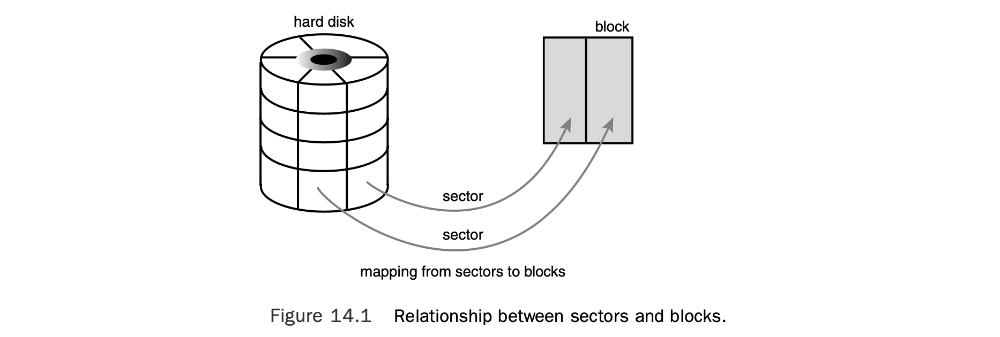
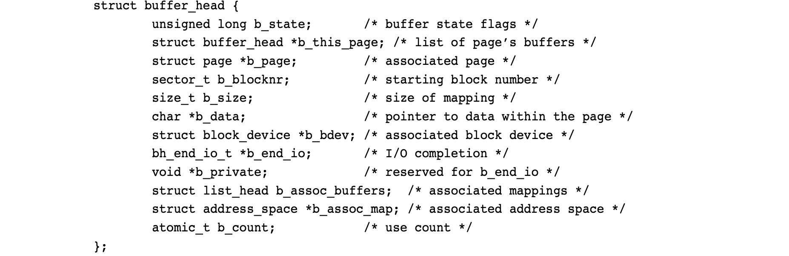
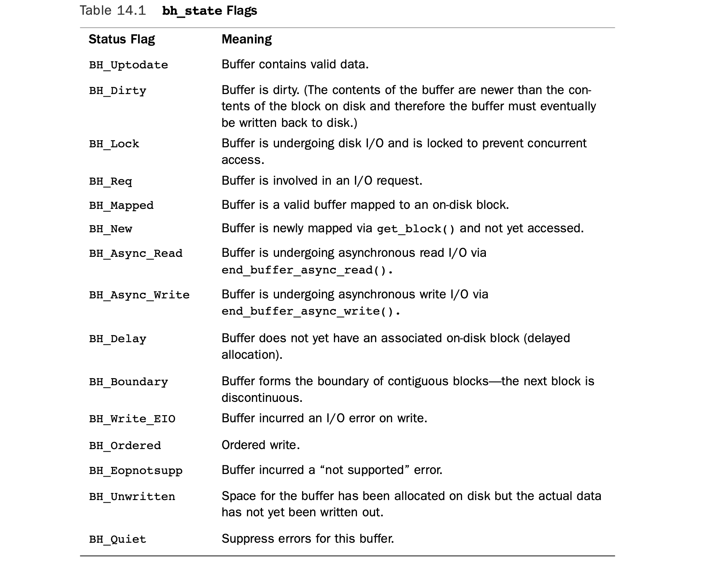
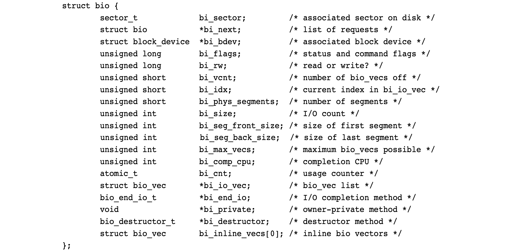
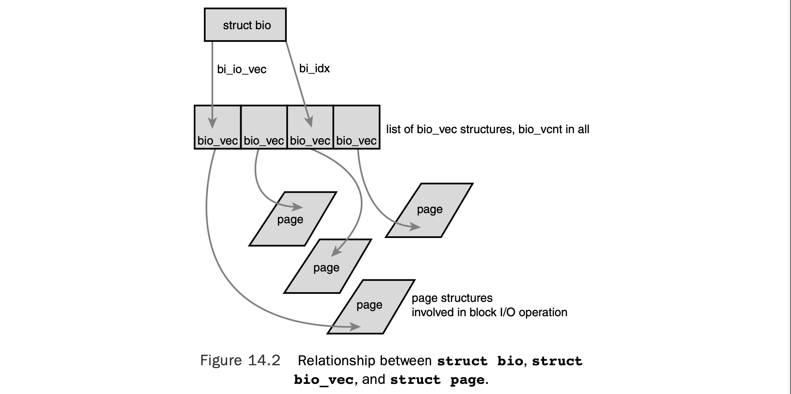
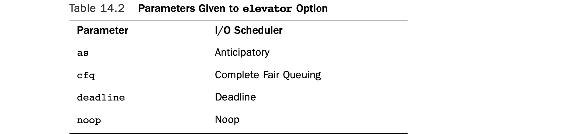

## 14 The Block I/O Layer

B*lock devices* are hardware devices distinguished by the random (that is, not necessarily sequential) access of fixed-size chunks of data.The fixed-size chunks of data are called *blocks*.The most common block device is a hard disk, but many other block devices exist, such as floppy drives, Blu-ray readers, and flash memory. Notice how these are all devices on which you mount a filesystem—filesystems are the lingua franca of block devices.

**块设备（block devices）** 是一类以**随机（即不必顺序）**方式访问固定大小数据块的硬件设备。这些固定大小的数据块称为**块（block）**。

最常见的块设备是硬盘，此外还有软盘驱动器、蓝光读取器、闪存等。可以注意到，这些都是可以用来**挂载文件系统**的设备 —— 文件系统是块设备的**通用交互方式**。

The other basic type of device is a *character device*. Character devices, or *char* devices, are accessed as a stream of sequential data, one byte after another. Example character devices are serial ports and keyboards. If the hardware device is accessed as a stream of data, it is implemented as a character device. On the other hand, if the device is accessed randomly (nonsequentially), it is a block device.

另一类基本设备是**字符设备（character device）**，简称 char 设备。字符设备以**顺序数据流**的形式被访问，一个字节接着一个字节。典型的字符设备有串口、键盘等。

如果硬件设备以数据流形式被访问，就会被实现为字符设备；反之，如果设备支持**随机（非顺序）访问**，则是块设备。

The difference comes down to whether the device accesses data randomly—in other words, whether the device can *seek* to one position from another. As an example, consider the keyboard.As a driver, the keyboard provides a stream of data. If you type *wolf*, the key- board driver returns a stream with those four letters in exactly that order. Reading the letters out of order, or reading any letter but the next one in the stream, makes little sense. The keyboard driver is thus a char device; the device provides a stream of characters that the user types onto the keyboard. Reading from the keyboard returns a stream first with *w*, then *o*, then *l*, and ultimately *f*. When no keystrokes are waiting, the stream is empty. A hard drive, conversely, is quite different.The hard drive’s driver might ask to read the con- tents of one arbitrary block and then read the contents of a different block; the blocks need not be consecutive. The hard disk’s data is accessed randomly, and not as a stream; therefore, the hard disk is a block device.

两者的区别归根结底在于：设备是否能**随机访问数据**—— 换句话说，设备能否从一个位置寻址（seek）到另一个位置。

举个例子：键盘。作为驱动，键盘提供的是一串数据流。如果你输入 `wolf`，键盘驱动会按顺序返回这 4 个字母。打乱顺序读取，或跳过下一个字符去读其他字符，都是没有意义的。因此键盘驱动是字符设备：它提供用户按键的字符流。从键盘读取时，会依次得到 `w`、`o`、`l`、`f`；没有按键时，数据流为空。

而硬盘则完全不同。硬盘驱动可以先读取任意一个块，再读取另一个完全不相邻的块。硬盘数据是随机访问，而非流式访问，因此硬盘是块设备。

Managing block devices in the kernel requires more care, preparation, and work than managing character devices. Character devices have only one position—the current one—whereas block devices must be able to navigate back and forth between any loca- tion on the media. Indeed, the kernel does not have to provide an entire subsystem dedi- cated to the management of character devices, but block devices receive exactly that. Such a subsystem is a necessity partly because of the complexity of block devices.A large reason, however, for such extensive support is that block devices are quite performance sensitive; getting every last drop out of your hard disk is much more important than squeezing an extra percent of speed out of your keyboard. Furthermore, as you will see, the complexity of block devices provides a lot of room for such optimizations.The topic of this chapter is how the kernel manages block devices and their requests.This part of the kernel is known as the *block I/O layer*. Interestingly, revamping the block I/O layer was the primary goal for the 2.5 development kernel.This chapter covers the all-new block I/O layer in the 2.6 kernel.

在内核中，管理块设备比管理字符设备需要更细致的准备与更多工作。字符设备只有一个位置 —— 当前位置；而块设备必须能在介质上的任意位置之间来回跳转。事实上，内核并不需要为字符设备单独提供一整套子系统，但块设备**确有专门的子系统**。之所以需要这套子系统，一部分原因是块设备本身更复杂；但更重要的原因是：**块设备对性能极其敏感**—— 把硬盘性能榨干，远比从键盘上多榨出百分之一的速度重要得多。而且你会看到，块设备的复杂性也为各种性能优化提供了空间。

本章的主题就是内核如何管理块设备及其 I/O 请求，内核中的这一部分被称为**块 I/O 层（block I/O layer）**。有意思的是，重构块 I/O 层正是内核 2.5 开发版的主要目标。本章将介绍 2.6 内核中全新的块 I/O 层。

### Anatomy of a Block Device

The smallest addressable unit on a block device is a *sector*. Sectors come in various powers of two, but 512 bytes is the most common size.The sector size is a physical property of the device, and the sector is the fundamental unit of all block devices—the device cannot address or operate on a unit smaller than the sector, although many block devices can operate on multiple sectors at one time. Most block devices have 512-byte sectors, although other sizes are common. For example, many CD-ROM discs have 2-kilobyte sectors.

块设备上**最小的可寻址单元**是**扇区（sector）**。扇区的大小通常是 2 的整数次幂，其中 **512 字节**是最常见的尺寸。

扇区大小是设备的**物理属性**，也是所有块设备的基本单元 —— 设备无法对比扇区更小的单元进行寻址或操作，尽管很多块设备可以一次操作多个扇区。大多数块设备使用 512 字节扇区，但也存在其他常见尺寸。例如，许多 CD-ROM 的扇区大小为 2KB。

Software has different goals and therefore imposes its own smallest logically addressable unit, which is the *block*.The block is an abstraction of the filesystem—filesystems can be accessed only in multiples of a block.Although the physical device is addressable at the sector level, the kernel performs all disk operations in terms of blocks. Because the device’s smallest addressable unit is the sector, the block size can be no smaller than the sector and must be a multiple of a sector. Furthermore, the kernel (as with hardware and the sector) needs the block to be a power of two.The kernel also requires that a block be no larger than the page size (see Chapter 12,“Memory Management,” and Chapter 19, “Portability”).1 Therefore, block sizes are a power-of-two multiple of the sector size and are not greater than the page size. Common block sizes are 512 bytes, 1 kilobyte, and 4 kilobytes.

软件有着不同的设计目标，因此会定义自己的**最小逻辑可寻址单元**，这就是**块（block）**。块是文件系统的一层抽象 —— 文件系统只能以**块的整数倍**进行访问。虽然物理设备可以按扇区寻址，但内核对磁盘的所有操作都以**块**为单位。由于设备的最小可寻址单元是扇区，因此**块的大小不能小于扇区，且必须是扇区的整数倍**。此外，内核（与硬件对扇区的要求一样）要求块的大小必须是 2 的整数次幂。

内核还要求块的大小**不能超过页大小（page size）**（见第 12 章《内存管理》和第 19 章《可移植性》）。因此，块的大小是扇区大小的 2 的整数次幂倍，且不大于页大小。常见的块大小为 512 字节、1KB 和 4KB。

Somewhat confusingly, some people refer to sectors and blocks with different names. Sectors, the smallest addressable unit to the device, are sometimes called “hard sectors” or “device blocks.” Meanwhile, blocks, the smallest addressable unit to the filesystem, are sometimes referred to as “filesystem blocks” or “I/O blocks.”This chapter continues to call the two notions *sectors* and *blocks*, but you should keep these other terms in mind. Figure 14.1 is a diagram of the relationship between sectors and buffers.

容易让人混淆的是，有些人会用不同的名称称呼扇区和块。

扇区是设备的最小可寻址单元，有时也被称作**硬扇区（hard sector）**或**设备块（device block）**。

而块是文件系统的最小可寻址单元，有时被称作**文件系统块（filesystem block）\**或\**I/O 块（I/O block）**。

本章仍统一使用**扇区**和**块**这两个术语，但你需要记住这些别名。图 14.1 是扇区与缓冲区之间关系的示意图。

Other terminology, at least with respect to hard disks, is common—terms such as *clusters*, *cylinders*, and *heads*.Those notions are specific only to certain block devices and, for the most part, are invisible to user-space software.The reason that the sector is important to the kernel is because all device I/O must be done in units of sectors. In turn, the higher-level concept used by the kernel—blocks—is built on top of sectors.

至少在硬盘相关语境中，还有一些常见术语 —— 比如**簇（cluster）**、**柱面（cylinder）**和**磁头（head）**。

这些概念只针对特定的块设备，在大多数情况下对用户空间软件是不可见的。扇区对内核之所以重要，是因为**所有设备 I/O 都必须以扇区为单位**完成。而内核使用的更高层概念 —— 块，正是建立在扇区之上的。



### Buffers and Buffer Heads

When a block is stored in memory—say, after a read or pending a write—it is stored in a *buffer*. Each buffer is associated with exactly one block.The buffer serves as the object that represents a disk block in memory. Recall that a block is composed of one or more sec- tors but is no more than a page in size.Therefore, a single page can hold one or more blocks in memory. Because the kernel requires some associated control information to accompany the data (such as from which block device and which specific block the buffer is), each buffer is associated with a descriptor.The descriptor is called a *buffer head* and is of type struct buffer_head.The buffer_head structure holds all the information that the kernel needs to manipulate buffers and is defined in <linux/buffer_head.h>.

当一个块被存入内存时（例如读取之后或待写入之前），它会被存储在**缓冲区（buffer）**中。每个缓冲区唯一对应一个块，缓冲区作为内存中表示磁盘块的对象。回顾前文可知，一个块由一个或多个扇区组成，且大小不会超过一页。因此，内存中的一页可以存放一个或多个块。由于内核需要伴随数据的关联控制信息（例如该缓冲区来自哪个块设备、哪个具体的块），每个缓冲区都对应一个描述符。该描述符称为**缓冲区头（buffer head）**，类型为 `struct buffer_head`。`buffer_head` 结构体保存了内核操作缓冲区所需的全部信息，定义在 `<linux/buffer_head.h>` 中。

Take a look at this structure, with comments describing each field:

下面是该结构体及各字段的注释说明：



The b_state field specifies the state of this particular buffer. It can be one or more of the flags in Table 14.1.The legal flags are stored in the bh_state_bits enumeration, which is defined in <linux/buffer_head.h>.

`b_state` 字段用于描述该缓冲区的状态，它可以是表 14.1 中的一个或多个标志位。合法的标志位定义在 `bh_state_bits` 枚举类型中，该枚举同样定义在 `<linux/buffer_head.h>` 里。



The bh_state_bits enumeration also contains as the last value in the list a BH_PrivateStart flag.This is not a valid state flag but instead corresponds to the first usable bit of which other code can make use.All bit values equal to and greater than BH_PrivateStart are not used by the block I/O layer proper, so these bits are safe to use by individual drivers who want to store information in the b_state field. Drivers can base the bit values of their internal flags off this flag and rest assured that they are not encroaching on an official bit used by the block I/O layer.

`bh_state_bits` 枚举的最后一个值是 `BH_PrivateStart` 标志。它并非有效的状态标志，而是作为其他代码可使用的第一个可用位。所有等于或大于 `BH_PrivateStart` 的位，块 I/O 层本身不会使用，因此驱动程序可以安全地将这些位用于在 `b_state` 字段中存储自定义信息。驱动程序可以基于该标志定义内部标志位，无需担心与块 I/O 层的官方位冲突。

The b_count field is the buffer’s usage count.The value is incremented and decre- mented by two inline functions, both of which are defined in <linux/buffer_head.h>:

`b_count` 字段是缓冲区的**引用计数**。该值通过两个内联函数进行增减操作，均定义在 `<linux/buffer_head.h>` 中：

```c
static inline void get_bh(struct buffer_head *bh) {
	atomic_inc(&bh->b_count);
}
static inline void put_bh(struct buffer_head *bh) {
	atomic_dec(&bh->b_count);
}
```

Before manipulating a buffer head, you must increment its reference count via get_bh() to ensure that the buffer head is not deallocated out from under you.When finished with the buffer head, decrement the reference count via put_bh().

在操作缓冲区头之前，必须通过 `get_bh()` 增加其引用计数，确保缓冲区头不会被意外释放；操作完成后，通过 `put_bh()` 减少引用计数。

The physical block on disk to which a given buffer corresponds is the b_blocknr-th logical block on the block device described by b_bdev.

一个缓冲区对应的磁盘物理块，是 `b_bdev` 所描述的块设备上的第 `b_blocknr` 个逻辑块。

The physical page in memory to which a given buffer corresponds is the page pointed to by b_page. More specifically, b_data is a pointer directly to the block (that exists somewhere in b_page), which is b_size bytes in length.Therefore, the block is located in memory starting at address b_data and ending at address (b_data + b_size).

缓冲区对应的内存物理页，是 `b_page` 指向的页。更具体地说，`b_data` 是直接指向该块（位于 `b_page` 中）的指针，块长度为 `b_size` 字节。因此，该块在内存中的起始地址为 `b_data`，结束地址为 `b_data + b_size`。

The purpose of a buffer head is to describe this mapping between the on-disk block and the physical in-memory buffer (which is a sequence of bytes on a specific page).Act- ing as a descriptor of this buffer-to-block mapping is the data structure’s only role in the kernel.

缓冲区头的作用，是描述 **磁盘块与内存中物理缓冲区（特定页上的一段字节）** 之间的映射关系。作为这种「缓冲区–块」映射的描述符，是该数据结构在内核中的唯一职责。

Before the 2.6 kernel, the buffer head was a much more important data structure: It was *the* unit of I/O in the kernel. Not only did the buffer head describe the disk-block- to-physical-page mapping, but it also acted as the container used for all block I/O.This had two primary problems.

在 2.6 内核之前，缓冲区头是极为重要的数据结构：它是内核中**I/O 的基本单元**。缓冲区头不仅描述磁盘块到物理页的映射，还作为所有块 I/O 操作的载体。这带来了两个主要问题：

 First, the buffer head was a large and unwieldy data structure (it has shrunken a bit nowadays), and it was neither clean nor simple to manipulate data in terms of buffer heads. Instead, the kernel prefers to work in terms of pages, which are simple and enable for greater performance.A large buffer head describing each individual buffer (which might be smaller than a page) was inefficient. Consequently, in the 2.6 ker- nel, much work has gone into making the kernel work directly with pages and address spaces instead of buffers. Some of this work is discussed in Chapter 16,“The Page Cache and Page Writeback,” where the address_space structure and the *pdflush* daemons are discussed.

第一，缓冲区头是一个庞大且笨重的数据结构（如今已有所精简），基于缓冲区头操作数据既不简洁也不简单。内核更倾向于以页为单位操作，页结构更简洁，性能也更高。用一个大的缓冲区头描述每个独立缓冲区（可能小于一页），效率很低。因此，2.6 内核做了大量优化，让内核直接与页和地址空间交互，而非缓冲区。相关内容会在第 16 章《页高速缓存与页回写》中讨论，包括 `address_space` 结构体和 `pdflush` 守护进程。

The second issue with buffer heads is that they describe only a single buffer.When used as the container for all I/O operations, the buffer head forces the kernel to break up potentially large block I/O operations (say, a write) into multiple buffer_head structures. This results in needless overhead and space consumption.

第二个问题是，缓冲区头只能描述**单个缓冲区**。如果将其作为所有 I/O 操作的载体，内核就必须把可能很大的块 I/O 操作（例如一次写入）拆分成多个 `buffer_head` 结构体，这会带来不必要的开销和空间消耗。

As a result, the primary goal of the 2.5 development kernel was to introduce a new, flexible, and lightweight container for block I/O operations.The result is the bio structure, which is discussed in the next section.

因此，2.5 开发版内核的主要目标之一，就是引入一种全新、灵活、轻量的块 I/O 操作载体。最终的成果就是 **`bio` 结构体**，我们将在下一节介绍。

### The **bio** Structure

The basic container for block I/O within the kernel is the bio structure, which is defined in <linux/bio.h>.This structure represents block I/O operations that are in flight (active) as a list of *segments*.A segment is a chunk of a buffer that is contiguous in mem- ory.Thus, individual buffers need not be contiguous in memory. By allowing the buffers to be described in chunks, the bio structure provides the capability for the kernel to per- form block I/O operations of even a single buffer from multiple locations in memory. Vector I/O such as this is called *scatter-gather I/O*.

内核中块 I/O 的**基本载体**是 `bio` 结构体，它定义在 `<linux/bio.h>` 中。该结构体以段（segment）**链表的形式，描述**正在进行（活跃）的块 I/O 操作。一个段，是内存中物理连续的一段缓冲区。因此，各个缓冲区在整体上**不必是连续的**。通过将缓冲区按段来描述，`bio` 结构体让内核可以对**来自内存多个不连续位置**的缓冲区，执行同一次块 I/O 操作。这样的向量 I/O 被称为**分散–聚合 I/O（scatter-gather I/O）**。

Here is struct bio, defined in <linux/bio.h>, with comments added for each field:

下面是定义在 `<linux/bio.h>` 中的 `struct bio`，并为每个字段添加了注释：



The primary purpose of a bio structure is to represent an in-flight block I/O operation.To this end, the majority of the fields in the structure are housekeeping related. The most important fields are bi_io_vec, bi_vcnt, and bi_idx. Figure 14.2 shows the relationship between the bio structure and its friends.

`bio` 结构体的核心用途，是表示一个**正在进行中的块 I/O 操作**。为此，结构体中大部分字段都用于**管理与维护**。其中最重要的字段是：

- `bi_io_vec`
- `bi_vcnt`
- `bi_idx`

图 14.2 展示了 `bio` 结构体及其相关结构之间的关系。



#### I/O vectors

The bi_io_vec field points to an array of bio_vec structures.These structures are used as lists of individual segments in this specific block I/O operation. Each bio_vec is treated as a vector of the form <page, offset, len>, which describes a specific segment: the physical page on which it lies, the location of the block as an offset into the page, and the length of the block starting from the given offset.The full array of these vectors describes the entire buffer.The bio_vec structure is defined in <linux/bio.h>:

`bi_io_vec` 字段指向一个 `bio_vec` 结构体数组。这些结构体用来表示本次块 I/O 操作中各个独立的段。每个 `bio_vec` 被当作一个 `<page, offset, len>` 形式的向量，用于描述一个具体的段：它所在的物理页、该段在页内的偏移，以及从该偏移开始的段长度。整个向量数组共同描述了完整的缓冲区。

`bio_vec` 结构体定义在 `<linux/bio.h>` 中：

```c
struct bio_vec {
	/* pointer to the physical page on which this buffer resides */
    struct page *bv_page;
    
	/* the length in bytes of this buffer */
    unsigned int bv_len;
    
	/* the byte offset within the page where the buffer resides */
    unsigned int bv_offset;
};
```

In each given block I/O operation, there are bi_vcnt vectors in the bio_vec array starting with bi_io_vec.As the block I/O operation is carried out, the bi_idx field is used to point to the current index into the array.

在一次给定的块 I/O 操作里，以 `bi_io_vec` 开头的 `bio_vec` 数组中共有 `bi_vcnt` 个向量。随着块 I/O 操作的执行，`bi_idx` 字段用来指向数组中当前处理到的索引。

In summary, each block I/O request is represented by a bio structure. Each request is composed of one or more blocks, which are stored in an array of bio_vec structures.

总而言之，每个块 I/O 请求都由一个 `bio` 结构体表示。每个请求由一个或多个块组成，这些块保存在 `bio_vec` 结构体数组中。

These structures act as vectors and describe each segment’s location in a physical page in memory.The first segment in the I/O operation is pointed to by b_io_vec. Each addi- tional segment follows after the first, for a total of bi_vcnt segments in the list. As the block I/O layer submits segments in the request, the bi_idx field is updated to point to the current segment.

这些结构体充当向量，描述每一段在内存物理页中的位置。I/O 操作中的第一个段由 `bi_io_vec` 指向，后续段依次排列，链表中总共有 `bi_vcnt` 个段。当块 I/O 层提交请求中的段时，`bi_idx` 字段会被更新，指向当前正在处理的段。

The bi_idx field is used to point to the current bio_vec in the list, which helps the block I/O layer keep track of partially completed block I/O operations.A more impor- tant usage, however, is to allow the splitting of bio structures.With this feature, drivers implementing a Redundant Array of Inexpensive Disks (RAID, a hard disk setup that enables single volumes to span multiple disks for performance and reliability purposes) can take a single bio structure, initially intended for a single device and split it among the multiple hard drives in the RAID array.All the RAID driver needs to do is copy the bio structure and update the bi_idx field to point to where the individual drive should start its operation.

`bi_idx` 字段用于指向链表中当前的 `bio_vec`，帮助块 I/O 层跟踪**部分完成**的块 I/O 操作。但它更重要的用途是**支持 bio 结构体的拆分**。借助这一特性，实现 **RAID（廉价磁盘冗余阵列）** 的驱动程序 ——RAID 是一种将单个卷跨多个磁盘以提升性能和可靠性的架构 —— 可以把原本发给单个设备的 `bio`，拆分到 RAID 阵列中的多块硬盘上处理。RAID 驱动只需要复制 `bio` 结构体，并更新 `bi_idx` 字段，让它指向对应硬盘应该开始处理的位置即可。

The bio structure maintains a usage count in the bi_cnt field.When this field reaches zero, the structure is destroyed and the backing memory is freed.The following two func- tions manage the usage counters for you.

`bio` 结构体在 `bi_cnt` 字段中维护引用计数。当该字段变为 0 时，结构体就会被销毁并释放占用的内存。下面两个函数用于管理引用计数：

```c
void bio_get(struct bio *bio)
void bio_put(struct bio *bio)
```

The former increments the usage count, whereas the latter decrements the usage count (and, if the count reaches zero, destroys the bio structure). Before manipulating an in-flight bio structure, be sure to increment its usage count to make sure it does not complete and deallocate out from under you.When you finish, decrement the usage count in turn.

前者递增引用计数，后者递减计数（如果计数变为 0，就销毁这个 `bio`）。在操作一个正在进行中的 `bio` 之前，务必先递增引用计数，避免它在你使用过程中就完成并被释放。使用完毕后，再相应地递减计数。

Finally, the bi_private field is a private field for the owner (that is, creator) of the structure.As a rule, you can read or write this field only if you allocated the bio structure.

最后，`bi_private` 是该结构体 **所有者（即创建者）** 的私有字段。通常规则是：只有你自己分配的 `bio`，才可以读写这个字段。

#### The Old Versus the New

The difference between buffer heads and the new bio structure is important.The bio structure represents an I/O operation, which may include one or more pages in memory. On the other hand, the buffer_head structure represents a single buffer, which describes a single block on the disk. Because buffer heads are tied to a single disk block in a single page, buffer heads result in the unnecessary dividing of requests into block-sized chunks, only to later reassemble them. Because the bio structure is lightweight, it can describe discontiguous blocks and does not unnecessarily split I/O operations.

缓冲区头与新的 `bio` 结构体之间的区别至关重要。

`bio` 结构体代表一个 **I/O 操作**，它可以对应内存中的**一个或多个物理页**。

而 `buffer_head` 结构体只代表**单个缓冲区**，用于描述磁盘上的**一个块**。

由于缓冲区头会绑定到**单个物理页中的单个磁盘块**，这会导致请求被不必要地拆分成块大小的片段，之后又需要重新组装。

而 `bio` 结构体是轻量级的，它可以描述**不连续的块**，不会无意义地拆分 I/O 操作。

Switching from struct buffer_head to struct bio provided other benefits, as well:

- The bio structure can easily represent high memory, because struct bio deals with only physical pages and not direct pointers.

- The bio structure can represent both normal page I/O and direct I/O (I/O opera- tions that do not go through the page cache—see Chapter 16,“The Page Cache and Page Writeback,” for a discussion on the page cache).

- The bio structure makes it easy to perform scatter-gather (vectored) block I/O operations, with the data involved in the operation originating from multiple physi- cal pages.

- The bio structure is much more lightweight than a buffer head because it contains only the minimum information needed to represent a block I/O operation and not unnecessary information related to the buffer itself.

从 `struct buffer_head` 切换到 `struct bio` 还带来了其他好处：

- `bio` 结构体可以轻松表示**高端内存**，因为它只操作物理页，而非直接指针。
- `bio` 结构体既可以表示普通的页 I/O，也可以表示**直接 I/O**（不经过页高速缓存的 I/O 操作，见第 16 章《页高速缓存与页回写》）。
- `bio` 结构体可以方便地执行**分散–聚合（向量）块 I/O** 操作，操作的数据可以来自多个物理页。
- `bio` 结构体比缓冲区头**轻量得多**，因为它只包含表示块 I/O 操作所需的最小信息，不包含与缓冲区本身相关的冗余信息。

The concept of buffer heads is still required, however; buffer heads function as descrip- tors, mapping disk blocks to pages.The bio structure does not contain any information about the state of a buffer—it is simply an array of vectors describing one or more seg- ments of data for a single block I/O operation, plus related information. In the current setup, the buffer_head structure is still needed to contain information about buffers while the bio structure describes in-flight I/O. Keeping the two structures separate enables each to remain as small as possible.

不过，缓冲区头的概念仍然是必需的：缓冲区头充当**描述符**，负责将磁盘块映射到内存页。`bio` 结构体不包含任何缓冲区状态信息 —— 它只是一个向量数组，描述一次块 I/O 操作中的一个或多个数据段，再加上一些相关信息。在当前内核架构中，仍然需要 `buffer_head` 结构体来保存缓冲区相关信息，而由 `bio` 结构体描述正在进行的 I/O。将这两种结构体分离，可以让它们各自保持尽可能小的体积。

### Request Queues

Block devices maintain *request queues* to store their pending block I/O requests.The request queue is represented by the request_queue structure and is defined in <linux/blkdev.h>.The request queue contains a doubly linked list of requests and asso- ciated control information. Requests are added to the queue by higher-level code in the kernel, such as filesystems. As long as the request queue is nonempty, the block device driver associated with the queue grabs the request from the head of the queue and sub- mits it to its associated block device. Each item in the queue’s request list is a single request, of type struct request.

块设备通过维护 **请求队列（request queue）** 来存放待处理的块 I/O 请求。请求队列由 `request_queue` 结构体表示，定义在 `<linux/blkdev.h>` 中。请求队列包含一个由请求组成的双向链表，以及相关的控制信息。内核中的上层代码（如文件系统）会将请求加入队列。只要请求队列非空，与该队列关联的块设备驱动就会从队列头部取出请求，并提交给对应的块设备。队列请求链表中的每一项都是一个单独的请求，类型为 `struct request`。

Individual requests on the queue are represented by struct request, which is also defined in <linux/blkdev.h>. Each request can be composed of more than one bio structure because individual requests can operate on multiple consecutive disk blocks. Note that although the blocks on the disk must be adjacent, the blocks in memory need not be; each bio structure can describe multiple segments (recall, segments are contiguous chunks of a block in memory) and the request can be composed of multiple bio structures.

队列中的单个请求由 `struct request` 表示，该结构体同样定义在 `<linux/blkdev.h>` 中。每个请求可以由**多个 `bio` 结构体**组成，因为单个请求可以操作多个**连续的磁盘块**。需要注意：尽管磁盘上的块必须是相邻的，但内存中的块不必连续；每个 `bio` 结构体可以描述多个段（回顾：段是内存中连续的块片段），而一个请求可以由多个 `bio` 结构体构成。

### I/O Schedulers

Simply sending out requests to the block devices in the order that the kernel issues them, as soon as it issues them, results in poor performance. One of the slowest operations in a modern computer is disk seeks. Each seek—positioning the hard disk’s head at the loca- tion of a specific block—takes many milliseconds. Minimizing seeks is absolutely crucial to the system’s performance.

如果内核一产生块设备 I/O 请求，就**按生成顺序立刻下发**给块设备，会导致性能极差。现代计算机中最慢的操作之一就是**磁盘寻道**。每次寻道 —— 将磁盘磁头定位到指定块的位置 —— 都需要耗费数毫秒。**尽可能减少寻道次数**，对系统性能至关重要。

Therefore, the kernel does not issue block I/O requests to the disk in the order they are received or as soon as they are received. Instead, it performs operations called *merging* and *sorting* to greatly improve the performance of the system as a whole.2 The subsystem of the kernel that performs these operations is called the *I/O scheduler*.

因此，内核并不会**收到请求就立刻下发**，也不会**按接收顺序**直接向磁盘发送块 I/O 请求。相反，它会执行名为 **合并（merging）**和**排序（sorting）** 的操作，从而大幅提升整个系统的性能。内核中负责这些操作的子系统，称为 **I/O 调度器（I/O scheduler）**。

The I/O scheduler divides the resource of disk I/O among the pending block I/O requests in the system. It does this through the merging and sorting of pending requests in the request queue.The I/O scheduler is not to be confused with the process scheduler (see Chapter 4, “Process Scheduling”), which divides the resource of the processor among the processes on the system.The two subsystems are similar in nature but not the same. Both the process scheduler and the I/O scheduler virtualize a resource among multiple objects. In the case of the process scheduler, the processor is virtualized and shared among the processes on the system.This provides the illusion of virtualization inherent in a mul- titasking and timesharing operating system, such as any Unix. On the other hand, the I/O scheduler virtualizes block devices among multiple outstanding block requests.This is done to minimize disk seeks and ensure optimum disk performance.

I/O 调度器在系统内所有待处理的块 I/O 请求之间，分配磁盘 I/O 资源。它通过对请求队列里的待处理请求进行**合并**和**排序**来实现这一点。不要把 I/O 调度器和**进程调度器**（见第 4 章《进程调度》）混淆：进程调度器在系统中的各个进程之间分配 CPU 资源。两个子系统原理相似，但并不相同。

进程调度器和 I/O 调度器都会在多个对象之间**虚拟化一种资源**：

- 进程调度器：把 CPU 虚拟化，在进程间共享，这是 Unix 这类多任务、分时操作系统的核心虚拟化机制。
- I/O 调度器：在多个未完成的块请求之间虚拟化块设备，目的是**最小化磁盘寻道**，保证磁盘性能最优。

#### The Job of an I/O Scheduler

An I/O scheduler works by managing a block device’s request queue. It decides the order of requests in the queue and at what time each request is dispatched to the block device. It manages the request queue with the goal of reducing seeks, which results in greater *global throughput*.The modifier“global”here is important.An I/O scheduler,very openly, is unfair to some requests at the expense of improving the *overall* performance of the system.

I/O 调度器通过管理块设备的请求队列来工作。它决定队列中请求的顺序，以及每个请求被下发到块设备的时机。管理请求队列的目标是减少寻道，从而提升**全局吞吐量**。这里的 “全局” 二字很重要。为了提升系统**整体**性能，I/O 调度器会明显对某些请求 “不公平”。

I/O schedulers perform two primary actions to minimize seeks: merging and sorting. Merging is the coalescing of two or more requests into one. Consider an example request that is submitted to the queue by a filesystem—say, to read a chunk of data from a file. (At this point, of course, everything occurs in terms of sectors and blocks and not files but presume that the requested blocks originate from a chunk of a file.) If a request is already in the queue to read from an adjacent sector on the disk (for example, an earlier chunk of the same file), the two requests can be merged into a single request operating on one or more adjacent on-disk sectors. By merging requests, the I/O scheduler reduces the over- head of multiple requests down to a single request. More important only a single com- mand needs to be issued to the disk and servicing the multiple requests can be done without seeking. Consequently, merging requests reduces overhead and minimizes seeks.

I/O 调度器主要通过两种操作来最小化磁盘寻道：**合并**与**排序**。

合并是将两个或多个 I/O 请求合并为一个。举个例子，文件系统向请求队列提交一个读请求，比如读取文件中的一段数据（当然，此时所有操作都是基于磁盘扇区和块，而非文件本身，这里暂且假设请求的块对应文件的某一段数据）。如果队列中已存在读取磁盘**相邻扇区**的请求（比如同一文件的前一段数据），这两个请求就可以合并成一个，作用于一个或多个连续的磁盘扇区。

通过请求合并，I/O 调度器将多个请求的开销简化为单个请求的开销。更关键的是，只需向磁盘下发一条指令，无需寻道即可完成多个请求的处理。因此，合并请求既能降低开销，又能最大限度减少磁盘寻道。

Now, assume your fictional read request is submitted to the request queue, but there is no read request to an adjacent sector.You therefore cannot merge this request with any other request. Now, you could simply stick this request onto the tail of the queue. But, what if there are other requests to a similar location on the disk? Would it not make sense to insert this new request into the queue at a spot near other requests operating on physically near sectors? In fact, I/O schedulers do exactly this.The entire request queue is kept sorted, sectorwise, so that all seeking activity along the queue moves (as much as possible) sequentially over the sectors of the hard disk.The goal is not just to minimize each indi- vidual seek but to minimize all seeking by keeping the disk head moving in a straight line.This is similar to the algorithm employed in elevators—elevators do not jump all over, wildly, from floor to floor. Instead, they try to move gracefully in a single direction. When the final floor is reached in one direction, the elevator can reverse course and move in the other direction. Because of this similarity, I/O schedulers (or sometimes just their sorting algorithm) are called *elevators*.

现在假设这个示例读请求提交到请求队列后，队列中没有对应相邻扇区的读请求，那么这个请求就无法与其他请求合并。你可以直接把它放到队列末尾，但如果队列里存在访问磁盘相近位置的其他请求，把这个新请求插入到访问物理相近扇区的请求附近，难道不是更合理吗？

事实上，I/O 调度器正是这么做的。整个请求队列会**按扇区地址排序**，让队列中的寻道操作尽可能沿着硬盘扇区顺序进行。其目标不只是减少单次寻道，更是通过让磁头沿直线移动，从整体上减少所有寻道开销。

这和电梯的调度算法十分相似：电梯不会毫无规律地在楼层间乱跳，而是平稳地沿一个方向运行，到达该方向的最顶层 / 最底层后再反向运行。正因这种相似性，I/O 调度器（有时仅指其排序算法）也被称作**电梯算法**。

#### The Linus Elevator

Now let’s look at some real-life I/O schedulers.The first I/O scheduler is called the *Linus Elevator*. (Yes, Linus has an elevator named after him!) It was the default I/O scheduler in 2.4. In 2.6, it was replaced by the following I/O schedulers that we will look at—how- ever, because this elevator is simpler than the subsequent ones, while performing many of the same functions, it serves as an excellent introduction.

现在我们来看看几种实际应用的 I/O 调度器。第一种 I/O 调度器叫作**Linus 电梯算法**（没错，真的有一个以 Linus 命名的电梯算法！）。它曾是 Linux 2.4 内核里的默认 I/O 调度器。到了 2.6 内核，它被我们接下来要讲的几款 I/O 调度器所取代 —— 不过，因为这款电梯算法比后来的实现更简单，同时又具备很多核心功能，所以非常适合用来入门讲解。

The Linus Elevator performs both merging and sorting.When a request is added to the queue, it is first checked against every other pending request to see whether it is a possible candidate for merging.The Linus Elevator I/O scheduler performs both *front* and *back merging*.The type of merging performed depends on the location of the existing adjacent request. If the new request immediately proceeds an existing request, it is front merged. Conversely, if the new request immediately precedes an existing request, it is back merged. Because of the way files are laid out (usually by increasing sector number) and the I/O operations performed in a typical workload (data is normally read from start to finish and not in reverse), front merging is rare compared to back merging. Nonethe-less, the Linus Elevator checks for and performs both types of merge.

Linus 电梯算法同时做**合并**和**排序**两件事。当一个新请求加入队列时，调度器会先把它和队列里所有正在等待的请求逐一比对，看能不能合并。Linus 电梯算法支持**向前合并**和**向后合并**，具体用哪种，取决于相邻请求的位置。

如果新请求紧跟在某个已有请求的后面，就叫**向前合并**；反过来，如果新请求正好在某个已有请求的前面，就叫**向后合并**。

由于文件在磁盘上的存放方式（通常是扇区号从小到大），加上常见业务的 I/O 模式（数据一般从头到尾读，而不是倒着读），向前合并的情况远少于向后合并。即便如此，Linus 电梯算法依然会检查并执行这两种合并。

If the merge attempt fails, a possible insertion point in the queue (a location in the queue where the new request fits sectorwise between the existing requests) is then sought. If one is found, the new request is inserted there. If a suitable location is not found, the request is added to the tail of the queue. Additionally, if an existing request is found in the queue that is older than a predefined threshold, the new request is added to the tail of the queue even if it can be insertion sorted elsewhere.This prevents many requests to nearby on-disk locations from indefinitely starving requests to other locations on the disk. Unfortunately, this “age” check is not efficient. It does not provide any real attempt to service requests in a given timeframe; it merely stops insertion-sorting requests after a suitable delay.This improves latency but can still lead to request starvation, which was the big must-fix of the 2.4 I/O scheduler.

如果合并失败，调度器就会在队列里找一个合适的插入点 —— 也就是新请求的扇区地址正好夹在队列里两个已有请求之间的位置。如果找到，就把新请求插进去；如果没找到，就把请求丢到队列末尾。

除此之外，如果队列里有某个请求已经等待超过了预设的时间阈值，那么即便新请求能按扇区插入，也会直接被放到队尾。这么做是为了防止大量访问磁盘相近区域的请求，把其他位置的请求 “饿死”，一直得不到处理。

可惜的是，这种 “按老化时间检查” 的机制效率并不高。它并没有真正保证请求在某个时间内被处理，只是在延迟足够大之后，就不再做插入排序了。这虽然能改善延迟，但依然可能出现请求饥饿的问题 —— 这也正是 Linux 2.4 的 I/O 调度器最需要解决的痛点。

In summary, when a request is added to the queue, four operations are possible. In order, they are

1. If a request to an adjacent on-disk sector is in the queue, the existing request and the new request merge into a single request.
2. If a request in the queue is sufficiently old, the new request is inserted at the tail of the queue to prevent starvation of the other, older, requests.
3. If a suitable location sector-wise is in the queue, the new request is inserted there. This keeps the queue sorted by physical location on disk.
4. Finally, if no such suitable insertion point exists, the request is inserted at the tail of the queue.

简单总结：一个新请求进入队列时，会按顺序尝试以下 4 种操作：

1. 如果队列里有访问磁盘相邻扇区的请求，就把新旧请求**合并**成一个。
2. 如果队列里有已经等得足够久的旧请求，就把新请求直接插到队尾，避免旧请求饥饿。
3. 如果在队列里找到按扇区地址排序合适的位置，就把新请求**插入**到那里，保证队列按磁盘物理位置有序。
4. 最后，如果实在找不到合适的插入点，就把请求放到队列**尾部**。

#### The Deadline I/O Scheduler

The Deadline I/O scheduler sought to prevent the starvation caused by the Linus Eleva- tor. In the interest of minimizing seeks, heavy disk I/O operations to one area of the disk can indefinitely starve request operations to another part of the disk. Indeed, a stream of requests to the same area of the disk can result in other far-off requests never being serv- iced.This starvation is unfair.

**Deadline I/O 调度器**旨在解决 Linus 电梯算法所引发的**请求饥饿**问题。为了最小化磁盘寻道，针对磁盘某一区域的大量密集 I/O 操作，可能会导致访问磁盘其他区域的请求被无限期阻塞、无法处理。事实上，持续涌向磁盘同一区域的请求流，甚至会让其他远端位置的请求永远得不到服务，这种饥饿现象是极不合理的。

Worse, the general issue of request starvation introduces a specific instance of the problem known as *writes starving reads*.Write operations can usually be committed to disk whenever the kernel gets around to them, entirely asynchronous with respect to the sub- mitting application. Read operations are quite different. Normally, when an application submits a read request, the application blocks until the request is fulfilled.That is, read requests occur synchronously with respect to the submitting application.Although system response is largely unaffected by write latency (the time required to commit a write request), read latency (the time required to commit a read request) is important.Write latency has little bearing on application performance,3 but an application must wait, twid- dling its thumbs, for the completion of each read request. Consequently, read latency is important to the performance of the system.

更糟糕的是，请求饥饿这一通用问题，会衍生出一个典型场景 ——**写请求饥饿读请求**。写操作通常可以在内核空闲时随时写入磁盘，与提交请求的应用程序完全**异步**。而读操作则截然不同：通常情况下，应用程序提交读请求后，会一直阻塞直到请求完成。也就是说，读请求与提交请求的应用程序是**同步**执行的。尽管系统响应基本不受写延迟（完成写请求所需的时间）影响，但**读延迟**（完成读请求所需的时间）却至关重要。写延迟对应用性能几乎无影响，但应用必须等待每个读请求完成才能继续运行。因此，读延迟直接决定了系统的整体性能表现。

Compounding the problem, read requests tend to be dependent on each other. For example, consider the reading of a large number of files. Each read occurs in small buffered chunks.The application does not start reading the next chunk (or the next file, for that matter) until the previous chunk is read from disk and returned to the application. Worse, both read and write operations require the reading of various metadata, such as inodes. Reading these blocks off the disk further serializes I/O. Consequently, if each read request is individually starved, the total delay to such applications compounds and can grow enormous. Recognizing that the asynchrony and interdependency of read requests results in a much stronger bearing of read latency on the performance of the system, the Deadline I/O scheduler implements several features to ensure that request starvation in general, and read starvation in specific, is minimized.

雪上加霜的是，读请求之间往往存在依赖关系。例如读取大量文件时，每次读取都会以小块缓冲的方式进行。应用必须等到上一个数据块从磁盘读取并返回后，才会开始读取下一个数据块（或下一个文件）。更糟的是，读、写操作都需要读取各类**元数据**（如索引节点 inode），从磁盘读取这些元数据块会进一步让 I/O 操作串行化。因此，如果每个读请求都被单独饥饿，这类应用的总延迟会不断叠加，最终变得极其巨大。Deadline I/O 调度器正是认识到读请求的同步性与依赖性，使得读延迟对系统性能的影响远大于写延迟，因此设计了多项机制，最大限度减少整体请求饥饿，尤其是**读请求饥饿**。

Note that reducing request starvation comes at a cost to global throughput. Even the Linus Elevator makes this compromise, albeit in a much milder manner.The Linus Eleva- tor could provide better overall throughput (via a greater minimization of seeks) if it *always* inserted requests into the queue sectorwise and never checked for old requests and reverted to insertion at the tail of the queue.Although minimizing seeks is important, indefinite starvation is not good either.The Deadline I/O scheduler, therefore, works harder to limit starvation while still providing good global throughput. Make no mistake: It is a tough act to provide request fairness, yet maximize global throughput.

需要注意的是，减少请求饥饿是以牺牲**全局吞吐量**为代价的。即便 Linus 电梯算法也做出了这种妥协，只是程度更温和。如果 Linus 电梯算法始终仅按扇区地址插入请求，不检查旧请求并将新请求插入队尾，理论上能通过进一步减少寻道获得更高的整体吞吐量。但最小化寻道固然重要，无限期的请求饥饿同样不可取。因此，Deadline I/O 调度器在保证良好全局吞吐量的同时，更严格地限制了请求饥饿。毋庸置疑，兼顾请求公平性与最大化全局吞吐量，是一项极具挑战的工作。

In the Deadline I/O scheduler, each request is associated with an expiration time. By default, the expiration time is 500 milliseconds in the future for read requests and 5 sec- onds in the future for write requests.The Deadline I/O scheduler operates similarly to the Linus Elevator in that it maintains a request queue sorted by physical location on disk. It calls this queue the *sorted queue*.When a new request is submitted to the sorted queue, the Deadline I/O scheduler performs merging and insertion like the Linus Elevator.4 The Deadline I/O scheduler also, however, inserts the request into a second queue that depends on the type of request. Read requests are sorted into a special read FIFO queue, and write requests are inserted into a special write FIFO queue.Although the normal queue is sorted by on-disk sector, these queues are kept FIFO. (Effectively, they are sorted by time.) Consequently, new requests are always added to the tail of the queue. Under normal operation, the Deadline I/O scheduler pulls requests from the head of the sorted queue into the dispatch queue.The dispatch queue is then fed to the disk drive.This results in minimal seeks.

在 Deadline I/O 调度器中，每个请求都会绑定一个**过期时间**。默认配置下，读请求的过期时间为 500 毫秒，写请求的过期时间为 5 秒。Deadline I/O 调度器的工作逻辑与 Linus 电梯算法类似，会维护一个按磁盘物理位置排序的请求队列，称之为**排序队列**。当新请求加入排序队列时，Deadline I/O 调度器会像 Linus 电梯算法一样执行请求合并与插入操作。除此之外，Deadline I/O 调度器还会根据请求类型，将请求插入第二个队列：读请求归入专用的**读 FIFO 队列**，写请求则插入专用的**写 FIFO 队列**。普通的排序队列按磁盘扇区排序，而这两个队列严格遵循 FIFO（先进先出）规则（本质上按请求提交时间排序），新请求永远添加到队尾。正常运行时，Deadline I/O 调度器从排序队列的队头取出请求，放入**派发队列**，再由派发队列将请求发送给磁盘驱动器，以此实现最小化寻道。

If the request at the head of either the write FIFO queue or the read FIFO queue expires (that is, if the current time becomes greater than the expiration time associated with the request), the Deadline I/O scheduler then begins servicing requests from the FIFO queue. In this manner, the Deadline I/O scheduler attempts to ensure that no request is outstanding longer than its expiration time. See Figure 14.3.

一旦读 FIFO 队列或写 FIFO 队列的队头请求过期（即当前时间超过该请求的过期时间），Deadline I/O 调度器就会转而处理对应 FIFO 队列中的请求。通过这种方式，Deadline I/O 调度器确保没有请求会超出其过期时间仍未处理（见图 14.3）。


Note that the Deadline I/O scheduler does not make any strict guarantees over request latency. It is capable, however, of generally committing requests on or before their expiration.This prevents request starvation. Because read requests are given a substantially smaller expiration value than write requests, the Deadline I/O scheduler also works to ensure that write requests do not starve read requests.This preference toward read requests provides minimized read latency.

需要说明的是，Deadline I/O 调度器并不对请求延迟提供严格的硬性保证，但通常能在请求过期前或过期时完成处理，从而避免请求饥饿。由于读请求的过期时间远短于写请求，该调度器还能有效避免写请求饥饿读请求，这种对读请求的优先处理，实现了读延迟的最小化。

The Deadline I/O scheduler lives in block/deadline-iosched.c.

Deadline I/O 调度器的源码位于 `block/deadline-iosched.c`。

#### The Anticipatory I/O Scheduler

Although the Deadline I/O scheduler does a great job minimizing read latency, it does so at the expense of global throughput. Consider a system undergoing heavy write activity. Every time a read request is submitted, the I/O scheduler quickly rushes to handle the read request.This results in the disk seeking over to where the read is, performing the read operation, and then seeking back to continue the ongoing write operation, repeating this little charade for each read request.The preference toward read requests is a good thing, but the resulting pair of seeks (one to the location of the read request and another back to the ongoing write) is detrimental to global disk throughput.The Anticipatory I/O scheduler aims to continue to provide excellent read latency, but also provide excellent global throughput.

尽管 Deadline I/O 调度器在最小化读延迟方面表现出色，但这是以牺牲**全局吞吐量**为代价的。设想一个处于大量写操作负载下的系统：每当有读请求提交，I/O 调度器就会立刻优先处理该读请求。这会导致磁盘磁头先寻道到读请求所在位置，执行读操作，然后再寻道回去继续之前的写操作，每个读请求都会重复这样的来回切换。优先处理读请求固然是好事，但由此产生的两次寻道（一次到读请求位置，一次返回写操作位置）会严重损害磁盘的全局吞吐量。**预期（Anticipatory）I/O 调度器**的设计目标，便是在继续提供优秀读延迟的同时，也能实现出色的全局吞吐量。

First, the Anticipatory I/O scheduler starts with the Deadline I/O scheduler as its base. Therefore, it is not entirely different.The Anticipatory I/O scheduler implements three queues (plus the dispatch queue) and expirations for each request, just like the Deadline I/O scheduler.The major change is the addition of an *anticipation heuristic*.

预期 I/O 调度器以 Deadline I/O 调度器为基础进行开发，因此二者并非完全不同。和 Deadline I/O 调度器一样，它也维护三个队列（外加一个派发队列），并为每个请求设置过期时间。其核心改进是新增了**预期启发式算法**。

The Anticipatory I/O scheduler attempts to minimize the seek storm that accompa- nies read requests issued during other disk I/O activity.When a read request is issued, it is handled as usual, within its usual expiration period.After the request is submitted, how- ever, the Anticipatory I/O scheduler does not immediately seek back and return to han- dling other requests. Instead, it does absolutely nothing for a few milliseconds. (The actual value is configurable; by default it is six milliseconds.) In those few milliseconds, there is a good chance that the application will submit another read request.Any requests issued to an adjacent area of the disk are immediately handled.After the waiting period elapses, the Anticipatory I/O scheduler seeks back to where it left off and continues handling the previous requests.

预期 I/O 调度器旨在最小化磁盘在处理其他 I/O 操作时，因读请求触发的**寻道风暴**。当一个读请求到达时，调度器会按常规方式、在其过期周期内完成处理。但在该请求处理完毕后，预期 I/O 调度器不会立刻寻道返回并继续处理其他请求，而是会**空闲等待几毫秒**（具体时长可配置，默认 6 毫秒）。在这短暂的等待期内，应用程序有很大概率会提交下一个读请求。任何针对磁盘相邻区域的请求，都会被立即处理。等待期结束后，调度器才会寻道回到之前中断的位置，继续处理原有请求。

It is important to note that the few milliseconds spent in *anticipation* for more requests are well worth it if they minimize even a modest percentage of the back-and-forth seek- ing that results from the servicing of read requests during other heavy requests. If an adja- cent I/O request is issued within the waiting period, the I/O scheduler just saved a pair of seeks. As more and more reads are issued to the same area of disk, many more seeks are prevented.

需要明确的是，只要能减少哪怕一小部分因穿插处理读请求而产生的来回寻道，花费这几毫秒的**预期等待**就是非常值得的。如果在等待期内有相邻的 I/O 请求提交，调度器就直接省去了两次寻道操作。当大量连续的读请求指向磁盘同一区域时，能避免的寻道次数会更多。

Of course, if no activity occurs within the waiting period, the Anticipatory I/O sched- uler loses, and a few milliseconds are wasted.The key to reaping maximum benefit from the Anticipatory I/O scheduler is correctly anticipating the actions of applications and filesystems.This is done via a set of statistics and associated heuristics.The Anticipatory I/O scheduler keeps track of per-process statistics pertaining to block I/O habits in hopes of correctly anticipating the actions of applications.With a sufficiently high percentage of correct anticipations, the Anticipatory I/O scheduler can greatly reduce the penalty of seeking to service read requests, while still providing the attention to such requests that system response requires.This enables the Anticipatory I/O scheduler to minimize read latency, while also minimizing the number and duration of seeks.This results in low sys- tem latency and high system throughput.

当然，如果等待期内没有任何新请求，预期 I/O 调度器的策略就会失效，白白浪费几毫秒。想要让预期 I/O 调度器发挥最大效益，关键在于**准确预判应用程序和文件系统的行为**，这是通过一系列统计数据与关联启发式规则实现的。预期 I/O 调度器会跟踪每个进程的块 I/O 行为统计信息，以期精准预判应用的后续操作。只要预判准确率足够高，预期 I/O 调度器就能大幅降低为处理读请求而产生的寻道开销，同时依旧保证读请求的响应速度，满足系统交互需求。这使得预期 I/O 调度器既能最小化读延迟，又能减少寻道的次数与时长，最终实现低系统延迟与高系统吞吐量。

The Anticipatory I/O scheduler lives in the file block/as-iosched.c in the kernel source tree. It performs well across most workloads. It is ideal for servers, although it performs poorly on certain uncommon but critical workloads involving seek-happy databases.

预期 I/O 调度器的源码位于内核源码树的 `block/as-iosched.c` 文件中。它在绝大多数工作负载下表现优异，是服务器场景的理想选择，不过在少数不常见但关键的、涉及**频繁寻道数据库**的负载中，其表现较差。

#### The Complete Fair Queuing I/O Scheduler

The Complete Fair Queuing (CFQ) I/O scheduler is an I/O scheduler designed for spe- cialized workloads, but that in practice actually provides good performance across multi- ple workloads. It is fundamentally different from the previous I/O schedulers that have been covered, however.

**完全公平队列（CFQ）I/O 调度器**是一款为特定工作负载设计的 I/O 调度器，但在实际应用中，它在多种负载场景下都能提供不错的性能。不过，它与前面介绍过的所有 I/O 调度器在设计思想上有着本质区别。

The CFQ I/O scheduler assigns incoming I/O requests to specific queues based on the process originating the I/O request. For example, I/O requests from process foo go in foo’s queues, and I/O requests from process bar go in bar’s queue.Within each queue, requests are coalesced with adjacent requests and insertion sorted.The queues are thus kept sorted sectorwise, as with the other I/O scheduler’s queues.The difference with the CFQ I/O scheduler is that there is one queue for each process submitting I/O.

CFQ I/O 调度器会根据**发起 I/O 请求的进程**，将新到来的 I/O 请求分配到专属队列中。例如，进程 foo 发出的 I/O 请求进入 foo 的队列，进程 bar 发出的 I/O 请求进入 bar 的队列。

在每个队列内部，请求会与相邻请求合并，并进行插入排序，因此队列同样会**按磁盘扇区地址保持有序**，这一点和其他 I/O 调度器的队列是一致的。CFQ 与它们的不同之处在于：**每个发起 I/O 的进程都拥有独立的队列**。

The CFQ I/O scheduler then services the queues round robin, plucking a config- urable number of requests (by default, four) from each queue before continuing on to the next.This provides fairness at a per-process level, assuring that each process receives a fair slice of the disk’s bandwidth.The intended workload is multimedia, in which such a fair algorithm can guarantee that, for example, an audio player can always refill its audio buffers from disk in time. In practice, however, the CFQ I/O scheduler performs well in many scenarios.

随后，CFQ I/O 调度器以轮询（round robin）方式处理这些队列：从每个队列中取出可配置数量的请求（默认为 4 个），再切换到下一个队列。这种设计实现了进程级别的公平性，保证每个进程都能分到公平的磁盘带宽份额。它的目标负载是**多媒体场景**—— 在这类场景中，公平算法可以确保音频播放器等应用总能及时从磁盘读取数据、填充音频缓冲区。而在实际使用中，CFQ I/O 调度器在很多场景下表现都很出色。

The Complete Fair Queuing I/O scheduler lives in block/cfq-iosched.c. It is rec- ommended for desktop workloads, although it performs reasonably well in nearly all workloads without any pathological corner cases. It is now the default I/O scheduler in Linux.

完全公平队列 I/O 调度器的源码位于内核源码树的 `block/cfq-iosched.c` 文件中。它**推荐用于桌面环境负载**，同时在几乎所有常见负载下都表现稳定，没有极端异常的退化场景。目前，CFQ 已是 Linux 系统中的**默认 I/O 调度器**。

#### The Noop I/O Scheduler

A fourth and final I/O scheduler is the Noop I/O scheduler, so named because it is basi- cally a noop—it does not do much.The Noop I/O scheduler does not perform sorting or any other form of seek-prevention whatsoever. In turn, it has no need to implement anything akin to the slick algorithms to minimize request latency that you saw in the pre- vious three I/O schedulers.

第四种也是最后一种 I/O 调度器，是**Noop（无操作）I/O 调度器**。它之所以叫这个名字，是因为它本质上就是一个**空操作**—— 几乎不做任何额外处理。

Noop I/O 调度器**不做排序**，也不采用任何其他形式的寻道优化手段。相应地，它也完全不需要实现前面三种 I/O 调度器里那些用来降低请求延迟的复杂算法。

The Noop I/O scheduler does perform merging, however, as its lone chore.When a new request is submitted to the queue, it is coalesced with any adjacent requests. Other than this operation, the Noop I/O Scheduler truly is a noop, merely maintaining the request queue in near-FIFO order, from which the block device driver can pluck requests.

不过，Noop I/O 调度器**唯一会做的事，就是请求合并**。

当一个新请求被加入队列时，它会和队列中相邻的请求进行合并。除此之外，Noop I/O 调度器就真的是 “啥也不干”，只是以 **接近先进先出（FIFO）** 的顺序维护请求队列，块设备驱动直接从中取请求即可。

The Noop I/O scheduler’s lack of hard work is with reason. It is intended for block devices that are truly random-access, such as flash memory cards. If a block device has lit- tle or no overhead associated with “seeking,” then there is no need for insertion sorting of incoming requests, and the Noop I/O scheduler is the ideal candidate.

Noop I/O 调度器这么 “偷懒” 是有道理的。

它是专门为**真正的随机访问块设备**设计的，比如闪存卡这类存储设备。如果一个块设备几乎没有 “寻道” 开销，那就完全没必要对请求做插入排序，这时 Noop I/O 调度器就是最理想的选择。

The Noop I/O scheduler lives in block/noop-iosched.c. It is intended only for ran- dom-access devices.

Noop I/O 调度器的源码位于内核源码树的 `block/noop-iosched.c` 文件中。它**只适用于随机访问设备**。

#### I/O Scheduler Selection

You have now seen four different I/O schedulers in the 2.6 kernel. Each of these I/O schedulers can be enabled and built into the kernel. By default, block devices use the Complete Fair Queuing I/O scheduler.This can be overridden via the boot-time option elevator=foo on the kernel command line, where foo is a valid and enabled I/O Sched- uler. See Table 14.2.

现在你已经了解了 2.6 内核中的四种不同 I/O 调度器。这些 I/O 调度器都可以被启用并编译进内核。

默认情况下，块设备使用**完全公平队列（CFQ）I/O 调度器**。你可以通过内核启动参数 `elevator=foo` 来覆盖默认设置，其中 `foo` 是一个合法且已启用的 I/O 调度器名称。参见表 14.2。



For example, the kernel command line option elevator=as would enable use of the Anticipatory I/O scheduler for all block devices, overriding the default Complete Fair Queuing scheduler.

例如，内核命令行参数 `elevator=as` 会让所有块设备使用**预期 I/O 调度器**，从而覆盖默认的完全公平队列调度器。


