[toc]

## 15 The Process Address Space

Chapter 12,“Memory Management,” looked at how the kernel manages physical mem- ory. In addition to managing its own memory, the kernel also has to manage the memory of user-space processes.This memory is called the *process address space*, which is the repre- sentation of memory given to each user-space process on the system. Linux is a virtual memory operating system, and thus the resource of memory is virtualized among the processes on the system.An individual process’s view of memory is as if it alone has full access to the system’s physical memory. More important, the address space of even a single process can be much larger than physical memory.This chapter discusses how the kernel manages the process address space.

第 12 章《内存管理》探讨了内核如何管理物理内存。内核除了管理自身内存外，还需负责管理用户空间进程的内存。这类内存被称为**进程地址空间**，是系统为每个用户空间进程提供的内存抽象表示。Linux 是虚拟内存操作系统，因此内存资源会在系统各进程间被虚拟化使用。在单个进程的视角里，它仿佛独占了系统的全部物理内存。更关键的是，单个进程的地址空间甚至可以远大于物理内存。本章将介绍内核如何管理进程地址空间。

### Address Spaces

The process address space consists of the virtual memory addressable by a process and the addresses within the virtual memory that the process is allowed to use. Each process is given a *flat* 32- or 64-bit address space, with the size depending on the architecture.The term *flat* denotes that the address space exists in a single range. (For example, a 32-bit address space extends from the address 0 to 4294967295.) Some operating systems pro- vide a *segmented address space*, with addresses existing not in a single linear range, but instead in multiple segments. Modern virtual memory operating systems generally have a flat memory model and not a segmented one. Normally, this flat address space is unique to each process.A memory address in one process’s address space is completely unrelated to that same memory address in another process’s address space. Both processes can have different data at the same address in their respective address spaces. Alternatively, processes can elect to share their address space with other processes.We know these processes as *threads*.

进程地址空间由进程可寻址的虚拟内存，以及虚拟内存中进程允许使用的地址构成。每个进程都会被分配一个**平坦**的 32 位或 64 位地址空间，空间大小取决于系统体系结构。**平坦**这一术语表示地址空间存在于**单一连续的地址范围**内（例如，32 位地址空间的地址范围为 0 到 4294967295）。部分操作系统提供**分段式地址空间**，地址并非分布在单一线性范围，而是划分在多个段中。现代虚拟内存操作系统通常采用平坦内存模型，而非分段模型。

通常情况下，每个进程的平坦地址空间都是独立的。一个进程地址空间中的某个内存地址，与另一个进程地址空间中的同一地址完全无关；两个进程可以在各自地址空间的相同地址处存放不同数据。此外，进程也可以选择与其他进程共享地址空间，这类进程我们称之为**线程**。

A memory address is a given value within the address space, such as 4021f000.This particular value identifies a specific byte in a process’s 32-bit address space.Although a process can address up to 4GB of memory (with a 32-bit address space), it doesn’t have permission to access all of it.The interesting part of the address space is the intervals of memory addresses, such as 08048000-0804c000, that the process has permission to access.These intervals of legal addresses are called *memory areas*.The process, through the kernel, can dynamically add and remove memory areas to its address space.

内存地址是地址空间内的一个具体数值，例如 4021f000，该数值唯一标识进程 32 位地址空间中的一个字节。即便 32 位地址空间下进程可寻址的内存上限为 4GB，进程也无权访问全部地址。地址空间的核心部分，是进程拥有访问权限的连续内存地址区间（例如 08048000-0804c000），这些合法的地址区间被称为**内存区域**。进程可通过内核，向自身地址空间动态添加或移除内存区域。

The process can access a memory address only in a valid memory area. Memory areas have associated permissions, such as readable, writable, and executable, that the associated process must respect. If a process accesses a memory address not in a valid memory area, or if it accesses a valid area in an invalid manner, the kernel kills the process with the dreaded “Segmentation Fault” message.

进程仅能访问**有效内存区域**内的内存地址。每个内存区域都关联着访问权限（如可读、可写、可执行），进程必须遵守这些权限约束。若进程访问了非有效内存区域的地址，或以非法方式访问有效内存区域，内核会终止该进程，并抛出常见的 **段错误（Segmentation Fault）** 提示。

Memory areas can contain all sorts of goodies, such as

- A memory map of the executable file’s code, called the *text section.*
- A memory map of the executable file’s initialized global variables, called the *data section.*
- A memory map of the zero page (a page consisting of all zeros, used for purposes such as this) containing uninitialized global variables, called the *bss section*.1
- A memory map of the zero page used for the process’s user-space stack. (Do not confuse this with the process’s kernel stack, which is separate and maintained and used by the kernel.)
- An additional text, data, and bss section for each shared library, such as the C library and dynamic linker, loaded into the process’s address space.
- Any memory mapped files.
- Any shared memory segments.
- Any anonymous memory mappings, such as those associated with malloc().2

内存区域可以包含各类内存数据，例如：

- 可执行文件代码的内存映射，称为**代码段（text section）**；
- 可执行文件已初始化全局变量的内存映射，称为**数据段（data section）**；
- 用于存放未初始化全局变量的零页（全为 0 的内存页）内存映射，称为**BSS 段（bss section）**；
- 进程用户态栈所使用的零页内存映射（注意与进程内核栈区分，内核栈独立存在，由内核维护和使用）；
- 加载到进程地址空间的每个共享库（如 C 标准库、动态链接器）对应的额外代码段、数据段和 BSS 段；
- 各类内存映射文件；
- 各类共享内存段；
- 各类匿名内存映射（例如与 `malloc()` 分配相关的内存映射）。

All valid addresses in the process address space exist in exactly one area; memory areas do not overlap.As you can see, there is a separate memory area for each different chunk of memory in a running process: the stack, object code, global variables, mapped file, and so on.

进程地址空间中的所有有效地址，都仅属于**唯一一个**内存区域，内存区域之间互不重叠。由此可见，运行中进程的每一类不同内存块（栈、目标代码、全局变量、映射文件等），都对应独立的内存区域。

### The Memory Descriptor

The kernel represents a process’s address space with a data structure called the *memory descriptor*.This structure contains all the information related to the process address space. The memory descriptor is represented by struct mm_struct and defined in <linux/mm_types.h>. Let’s look at the memory descriptor, with comments added describing each field:

内核使用一个名为 **内存描述符（memory descriptor）** 的数据结构来表示进程的地址空间，该结构包含了与进程地址空间相关的全部信息。内存描述符由 `mm_struct` 结构体表示，定义在 `<linux/mm_types.h>` 头文件中。下面我们来看内存描述符，并通过注释说明每个字段的作用：

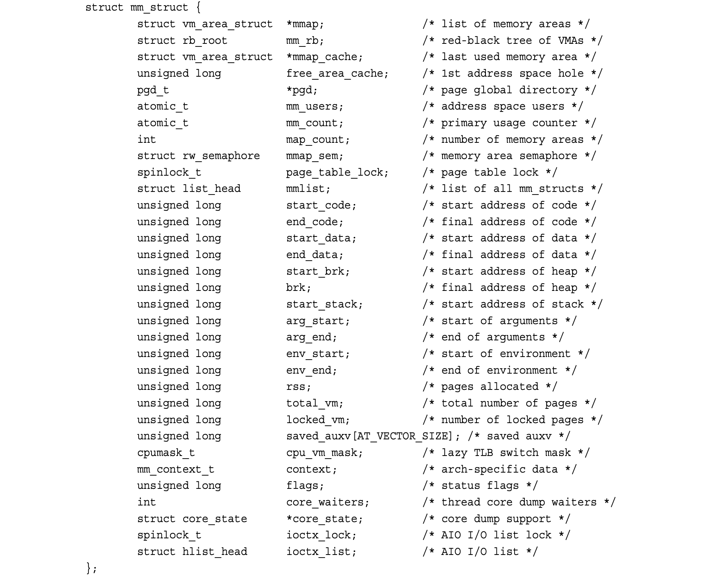

The mm_users field is the number of processes using this address space. For example, if two threads share this address space,mm_users is equal to two.The mm_count field is the primary reference count for the mm_struct.All mm_users equate to one increment of mm_count.Thus, in the previous example,mm_count is only one. If nine threads shared an address space, mm_users would be nine, but again mm_count would be only one. Only when mm_users reaches zero (when all threads using an address space exit) is mm_count decremented.When mm_count finally reaches zero, there are no remaining references to this mm_struct, and it is freed.When the kernel operates on an address space and needs to bump its associated reference count, the kernel increments mm_count. Having two coun- ters enables the kernel to differentiate between the main usage counter (mm_count) and the number of processes using the address space (mm_users).

`mm_users` 字段表示使用该地址空间的**进程数量**。例如，如果两个线程共享这个地址空间，`mm_users` 的值就等于 2。

`mm_count` 字段是 `mm_struct` 的**主引用计数**。所有的 `mm_users` 总共只让 `mm_count` 增加 1。因此，在上面的例子中，`mm_count` 只会是 1。如果有 9 个线程共享一个地址空间，`mm_users` 会是 9，但 `mm_count` 仍然只是 1。

只有当 `mm_users` 变为 0（即所有使用该地址空间的线程都退出）时，`mm_count` 才会减 1。当 `mm_count` 最终变为 0 时，说明没有任何地方再引用这个 `mm_struct`，它就会被释放。

当内核对某个地址空间进行操作，并且需要增加其关联的引用计数时，内核会增加 `mm_count`。使用这两个计数器，内核可以区分出**主使用计数器（mm_count）**和**实际使用该地址空间的进程数（mm_users）**。

The mmap and mm_rb fields are different data structures that contain the same thing: all the memory areas in this address space.The former stores them in a linked list, whereas the latter stores them in a red-black tree.A red-black tree is a type of binary tree;like all binary trees, searching for a given element is an O(log n) operation. For further discus- sion on red-black trees, see “Lists and Trees of Memory Areas,” later in this chapter.

`mmap` 和 `mm_rb` 是两个不同的数据结构，但它们保存的是同一份内容：该地址空间中的所有**内存区域**。前者以**链表**形式存储，后者则存储在**红黑树**中。红黑树是一种二叉树，和所有二叉树一样，查找指定元素的时间复杂度为 O (log n)。关于红黑树的更多说明，可参见本章后面的「内存区域的链表与树」一节。

Although the kernel would normally avoid the extra baggage of using two data struc- tures to organize the same data, the redundancy comes in handy here.The mmap data structure, as a linked list, allows for simple and efficient traversing of all elements. On the other hand, the mm_rb data structure, as a red-black tree, is more suitable to searching for a given element. Memory areas are discussed in more detail later in this chapter.The kernel isn’t duplicating the mm_struct structures; just the containing objects. Overlaying a linked list onto a tree, and using both to access the same set of data, is sometimes called a *threaded tree*.

虽然内核通常会避免用两种数据结构来组织同一份数据带来的额外开销，但在这里这种冗余设计非常实用。

`mmap` 作为链表结构，可以简单、高效地遍历所有元素；

而 `mm_rb` 作为红黑树结构，则更适合用来**查找指定元素**。

内存区域的细节会在本章后面详细讲解。

内核并不是在复制 `mm_struct` 本身，只是在复用它所包含的对象。将链表叠加在树上，并同时用两者访问同一组数据，这种结构有时被称为**链树（threaded tree）**。

All of the mm_struct structures are strung together in a doubly linked list via the mmlist field.The initial element in the list is the init_mm memory descriptor, which describes the address space of the init process.The list is protected from concurrent access via the mmlist_lock, which is defined in kernel/fork.c.

所有的 `mm_struct` 结构体通过 `mmlist` 字段串联成一个**双向链表**。链表的起始元素是 `init_mm` 内存描述符，它描述的是 init 进程的地址空间。该链表通过 `mmlist_lock` 锁来防止并发访问，该锁定义在 `kernel/fork.c` 中。

#### Allocating a Memory Descriptor

The memory descriptor associated with a given task is stored in the mm field of the task’s process descriptor. (The process descriptor is represented by the task_struct structure, defined in <linux/sched.h>.) Thus, current->mm is the current process’s memory descriptor.The copy_mm() function copies a parent’s memory descriptor to its child dur- ing fork().The mm_struct structure is allocated from the mm_cachep slab cache via the allocate_mm() macro in kernel/fork.c. Normally, each process receives a unique mm_struct and thus a unique process address space.

与特定任务关联的内存描述符存储在该任务**进程描述符**的 `mm` 字段中（进程描述符由 `task_struct` 结构体表示，定义于 `<linux/sched.h>` 头文件）。因此，`current->mm` 指向当前进程的内存描述符。在 `fork()` 系统调用的执行过程中，`copy_mm()` 函数会将父进程的内存描述符复制给子进程。`mm_struct` 结构体通过 `kernel/fork.c` 中的 `allocate_mm()` 宏，从 `mm_cachep` slab 缓存中分配。通常情况下，每个进程都会获得一个独立的 `mm_struct`，因此也拥有**独立的进程地址空间**。

Processes may elect to share their address spaces with their children by means of the CLONE_VM flag to clone().The process is then called a *thread*. Recall from Chapter 3, “Process Management,” that this is essentially the *only* difference between normal processes and so-called threads in Linux; the Linux kernel does not otherwise differentiate between them.Threads are regular processes to the kernel that merely share certain resources.

进程可以通过向 `clone()` 系统调用传入 `CLONE_VM` 标志，选择与子进程共享自身的地址空间。这类进程随后被称为**线程**。回顾第 3 章「进程管理」的内容：这是 Linux 系统中普通进程与所谓 “线程” 之间**唯一**的本质区别；除此之外，Linux 内核不会对二者做其他区分。对内核而言，线程就是普通的进程，只是它们会共享部分资源而已。

In the case that CLONE_VM is specified, allocate_mm() is *not* called, and the process’s mm field is set to point to the memory descriptor of its parent via this logic in copy_mm():

当指定了 `CLONE_VM` 标志时，`allocate_mm()` **不会**被调用，而是通过 `copy_mm()` 中的如下逻辑，将子进程的 `mm` 字段设置为指向父进程的内存描述符：

```c
if (clone_flags & CLONE_VM) {
    /*
	 * current is the parent process and
	 * tsk is the child process during a fork()
	 */
    atomic_inc(&current->mm->mm_users);
    tsk->mm = current->mm;
}
```

#### Destroying a Memory Descriptor

When the process associated with a specific address space exits, the exit_mm(), defined in kernel/exit.c, function is invoked.This function performs some housekeeping and updates some statistics. It then calls mmput(), which decrements the memory descriptor’s mm_users user counter. If the user count reaches zero, mmdrop() is called to decrement the mm_count usage counter. If *that* counter is finally zero, the free_mm() macro is invoked to return the mm_struct to the mm_cachep slab cache via kmem_cache_free(), because the memory descriptor does not have any users.

当与某个特定地址空间关联的进程退出时，定义在 `kernel/exit.c` 中的 `exit_mm()` 函数会被调用。

该函数会执行一些清理工作并更新相关统计信息，随后调用 `mmput()`，将内存描述符的 `mm_users` 用户计数减 1。

如果用户计数变为 0，就会调用 `mmdrop()`，将 `mm_count` 引用计数减 1。

如果**这个**计数最终也变为 0，就会调用 `free_mm()` 宏，通过 `kmem_cache_free()` 将 `mm_struct` 归还到 `mm_cachep` slab 缓存中 —— 因为此时该内存描述符已经没有任何使用者了。

#### The **mm_struct** and Kernel Threads

Kernel threads do not have a process address space and therefore do not have an associ- ated memory descriptor.Thus, the mm field of a kernel thread’s process descriptor is NULL. This is the *definition* of a kernel thread—processes that have no user context.

**内核线程（Kernel threads）没有进程地址空间，因此也就没有关联的内存描述符（memory descriptor）。因此，内核线程进程描述符中的 `mm` 字段为 `NULL`。这正是内核线程的“定义”——没有用户态上下文的进程。**

This lack of an address space is fine because kernel threads do not ever access any user- space memory. (Whose would they access?) Because kernel threads do not have any pages in user-space, they do not deserve their own memory descriptor and page tables. (Page tables are discussed later in the chapter.) Despite this, kernel threads need some of the data, such as the page tables, even to access kernel memory.To provide kernel threads the needed data, without wasting memory on a memory descriptor and page tables, or wast- ing processor cycles to switch to a new address space whenever a kernel thread begins running, kernel threads use the memory descriptor of whatever task ran previously.

没有地址空间并不会有问题，因为内核线程从不访问任何用户态内存。（它们能访问谁的用户空间呢？）由于内核线程在用户空间中没有任何页面，自然也就不需要为它们单独分配内存描述符和页表。（页表将在本章后面讨论。）

尽管如此，内核线程即使只是访问内核内存，也仍然需要一些数据结构，比如页表。为了在不浪费内存去为内核线程单独分配内存描述符和页表、也不浪费 CPU 周期在内核线程运行时切换地址空间的前提下，内核线程会**复用上一个运行任务的内存描述符**。

Whenever a process is scheduled, the process address space referenced by the process’s mm field is loaded.The active_mm field in the process descriptor is then updated to refer to the new address space. Kernel threads do not have an address space and mm is NULL. Therefore, when a kernel thread is scheduled, the kernel notices that mm is NULL and keeps the previous process’s address space loaded.The kernel then updates the active_mm field of the kernel thread’s process descriptor to refer to the previous process’s memory descriptor.The kernel thread can then use the previous process’s page tables as needed. Because kernel threads do not access user-space memory, they make use of only the information in the address space pertaining to kernel memory, which is the same for all processes.

当一个普通进程被调度运行时，内核会加载该进程 `mm` 字段所引用的进程地址空间，同时将进程描述符中的 `active_mm` 字段更新为指向新的地址空间。

而内核线程没有地址空间，`mm` 为 `NULL`。因此，当一个内核线程被调度运行时，内核发现它的 `mm` 是 `NULL`，就会**继续使用之前那个进程的地址空间**，并将内核线程进程描述符中的 `active_mm` 设置为指向前一个进程的内存描述符。

这样，内核线程就可以按需使用前一个进程的页表。由于内核线程并不会访问用户态内存，它们只使用地址空间中与内核内存相关的那部分映射，而这部分映射对于所有进程来说都是相同的。

### Virtual Memory Areas

The memory area structure, vm_area_struct, represents memory areas. It is defined in <linux/mm_types.h>. In the Linux kernel, memory areas are often called *virtual memory areas* (abbreviated *VMAs*).

**内存区域结构** `vm_area_struct` 用于表示内存区域，定义在 `<linux/mm_types.h>` 中。在 Linux 内核里，内存区域通常被称为**虚拟内存区域**（Virtual Memory Areas，缩写为 **VMAs**）。

The vm_area_struct structure describes a single memory area over a contiguous interval in a given address space.The kernel treats each memory area as a unique memory object. Each memory area possesses certain properties, such as permissions and a set of associated operations. In this manner, each VMA structure can represent different types of memory areas—for example, memory-mapped files or the process’s user-space stack.This is similar to the object-oriented approach taken by theVFS layer (see Chapter 13).Here’s the structure, with comments added describing each field:

`vm_area_struct` 结构体描述的是给定地址空间中一段连续地址区间上的**单个内存区域**。内核把每一个内存区域都当作一个独立的内存对象来管理。每个内存区域都有自身的属性，比如访问权限和一组相关操作函数。

通过这种方式，每个 VMA 结构体可以代表不同类型的内存区域 —— 例如内存映射文件，或是进程的用户态栈。这与虚拟文件系统（VFS）层采用的**面向对象思想**类似（见第 13 章）。

下面是该结构体的定义，并附带注释说明每个字段：

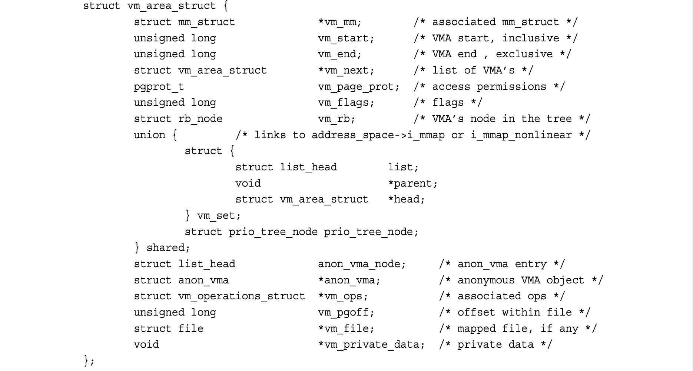

Recall that each memory descriptor is associated with a unique interval in the process’s address space.The vm_start field is the initial (lowest) address in the interval, and the vm_end field is the first byte after the final (highest) address in the interval.That is, vm_start is the inclusive start, and vm_end is the exclusive end of the memory interval. Thus, vm_end – vm_start is the length in bytes of the memory area, which exists over the interval [vm_start, vm_end). Intervals in different memory areas in the same address space cannot overlap.

前面提到，每个内存描述符对应进程地址空间里一段唯一的地址区间。`vm_start` 字段是这段区间的**起始（最低）地址**；`vm_end` 字段是这段区间**最后（最高）地址的下一个字节**。也就是说，`vm_start` 是**闭区间起点**，`vm_end` 是**开区间终点**。因此，`vm_end - vm_start` 就是该内存区域的字节长度，对应的地址区间为 `[vm_start, vm_end)`。同一地址空间中，不同内存区域的地址区间**不能重叠**。

The vm_mm field points to this VMA’s associated mm_struct. Note that each VMA is unique to the mm_struct with which it is associated.Therefore, even if two separate processes map the same file into their respective address spaces, each has a unique vm_area_struct to identify its unique memory area. Conversely, two threads that share an address space also share all the vm_area_struct structures therein.

`vm_mm` 字段指向该 VMA 所属的 `mm_struct`。注意：每个 VMA 都只归属于一个 `mm_struct`，是与之绑定的。因此，即便两个独立进程把同一个文件映射到各自的地址空间，它们也各自拥有一个唯一的 `vm_area_struct` 来标识自己的内存区域。反之，**共享同一个地址空间的两个线程，也会共享其中所有的 `vm_area_struct`**。

#### VMA Flags

The vm_flags field contains bit flags, defined in <linux/mm.h>, that specify the behavior of and provide information about the pages contained in the memory area. Unlike per- missions associated with a specific physical page, the VMA flags specify behavior for which the kernel is responsible, not the hardware. Furthermore, vm_flags contains infor- mation that relates to each page in the memory area, or the memory area as a whole, and not specific individual pages.Table 15.1 is a listing of the possible vm_flags values.

`vm_flags` 字段存放的是位标志，这些标志定义在 `<linux/mm.h>` 中，用于描述该内存区域所包含页面的行为，并提供相关信息。与特定物理页面上的硬件访问权限不同，**VMA 标志描述的是内核需要负责的行为，而非硬件层面的权限**。此外，`vm_flags` 中存放的是与该内存区域中**所有页面**或整个区域相关的信息，而非针对某一个单独页面。

表 15.1 列出了 `vm_flags` 可能的取值。

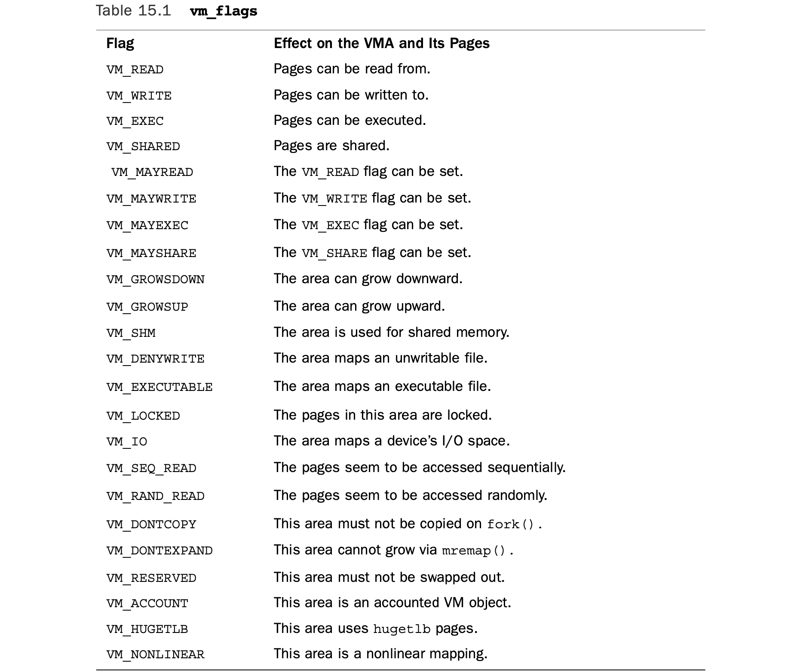

Let’s look at some of the more important and interesting flags in depth.The VM_READ, VM_WRITE, and VM_EXEC flags specify the usual read, write, and execute permissions for the pages *in this particular memory area*.They are combined as needed to form the appropriate access permissions that a process accessing this VMA must respect. For example, the object code for a process might be mapped with VM_READ and VM_EXEC but not VM_WRITE. On the other hand, the data section from an executable object would be mapped VM_READ and VM_WRITE, but VM_EXEC would make little sense. Meanwhile, a read-only memory mapped data file would be mapped with only the VM_READ flag.

我们来深入了解其中一些更重要、更常用的标志。`VM_READ`、`VM_WRITE` 和 `VM_EXEC` 标志指定了**该内存区域内页面**的常规读、写、执行权限。它们会根据需要组合，形成访问该 VMA 的进程必须遵守的访问权限。

例如，进程的目标代码可能被映射为 `VM_READ` 和 `VM_EXEC`，但不设置 `VM_WRITE`；而可执行文件的数据段则会被映射为 `VM_READ` 和 `VM_WRITE`，设置 `VM_EXEC` 则没有意义；只读的内存映射数据文件则只会设置 `VM_READ` 标志。

The VM_SHARED flag specifies whether the memory area contains a mapping that is shared among multiple processes. If the flag is set, it is intuitively called a *shared mapping*. If the flag is not set, only a single process can view this particular mapping, and it is called a *private mapping*.

`VM_SHARED` 标志用于指定该内存区域是否包含多个进程间共享的映射。如果设置该标志，称为**共享映射**；如果未设置，则只有单个进程可以访问该映射，称为**私有映射**。

The VM_IO flag specifies that this memory area is a mapping of a device’s I/O space. This field is typically set by device drivers when mmap() is called on their I/O space. It specifies, among other things, that the memory area must not be included in any process’s core dump.The VM_RESERVED flag specifies that the memory region must not be swapped out. It is also used by device driver mappings.

`VM_IO` 标志表示该内存区域是设备 I/O 空间的映射。该标志通常由设备驱动在对其 I/O 空间调用 `mmap()` 时设置，作用之一是指定该内存区域**不得**被包含在进程的核心转储（core dump）中。

`VM_RESERVED` 标志表示该内存区域**禁止被换出（swap out）**，同样也用于设备驱动的映射。

The VM_SEQ_READ flag provides a hint to the kernel that the application is performing sequential (that is, linear and contiguous) reads in this mapping.The kernel can then opt to increase the read-ahead performed on the backing file.The VM_RAND_READ flag speci- fies the exact opposite: that the application is performing relatively random (that is, not sequential) reads in this mapping.The kernel can then opt to decrease or altogether dis- able read-ahead on the backing file.These flags are set via the madvise() system call with the MADV_SEQUENTIAL and MADV_RANDOM flags, respectively. Read-ahead is the act of read- ing sequentially ahead of requested data, in hopes that the additional data will be needed soon. Such behavior is beneficial if applications are reading data sequentially. If data access patterns are random, however, read-ahead is not effective.

`VM_SEQ_READ` 标志向内核提示：应用程序正在对该映射进行**顺序读取**（线性、连续读取），内核可以据此增加对后备文件的**预读（read-ahead）**。

`VM_RAND_READ` 标志则相反：表示应用程序正在进行**随机读取**，内核可以减少或完全禁用预读。

这些标志分别通过 `madvise()` 系统调用的 `MADV_SEQUENTIAL` 和 `MADV_RANDOM` 参数设置。

预读是指在应用请求数据之前，提前顺序读取后续数据。如果应用是顺序访问，预读能提升效率；如果访问模式是随机的，预读则没有效果。

#### VMA Operations

The vm_ops field in the vm_area_struct structure points to the table of operations asso- ciated with a given memory area,which the kernel can invoke to manipulate theVMA. The vm_area_struct acts as a generic object for representing any type of memory area, and the operations table describes the specific methods that can operate on this particular instance of the object.

`vm_area_struct` 结构体中的 `vm_ops` 字段，指向与该内存区域关联的**操作函数表**，内核可以通过调用这些函数来操作该 VMA。

`vm_area_struct` 充当一个**通用对象**，用于表示任意类型的内存区域；而操作函数表则描述了可以作用在该对象具体实例上的**特定方法**。

The operations table is represented by struct vm_operations_struct and is defined in <linux/mm.h>:

该操作函数表由 `vm_operations_struct` 结构体表示，定义在 `<linux/mm.h>` 中：

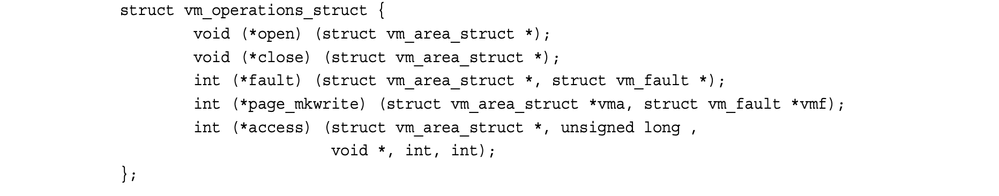

Here’s a description for each individual method:

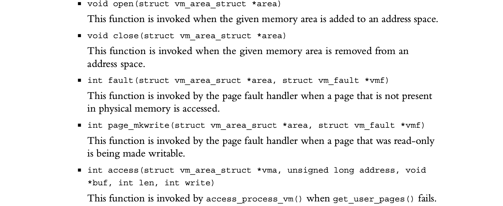

#### Lists and Trees of Memory Areas

As discussed, memory areas are accessed via both the mmap and the mm_rb fields of the memory descriptor.These two data structures independently point to all the memory area objects associated with the memory descriptor. In fact, they both contain pointers to the same vm_area_struct structures, merely represented in different ways.

如前所述，内存区域通过内存描述符中的 `mmap` 和 `mm_rb` 两个字段来访问。这两个数据结构各自独立地指向与该内存描述符关联的所有内存区域对象。事实上，它们保存的都是指向相同 `vm_area_struct` 结构体的指针，只是组织形式不同。

The first field, mmap, links together all the memory area objects in a singly linked list. Each vm_area_struct structure is linked into the list via its vm_next field.The areas are sorted by ascending address.The first memory area is the vm_area_struct structure to which mmap points.The last structure points to NULL.

第一个字段 `mmap`，将所有内存区域对象以**单链表**的形式串联起来。每个 `vm_area_struct` 结构体通过自身的 `vm_next` 字段挂入链表。这些区域按地址**升序**排列。链表的第一个内存区域就是 `mmap` 所指向的 `vm_area_struct`，最后一个结构体的指针为 `NULL`。

The second field, mm_rb, links together all the memory area objects in a red-black tree. The root of the red-black tree is mm_rb, and each vm_area_struct structure in this address space is linked to the tree via its vm_rb field.

第二个字段 `mm_rb`，将所有内存区域对象组织到一棵**红黑树**中。红黑树的根节点是 `mm_rb`，该地址空间内的每个 `vm_area_struct` 结构体都通过其 `vm_rb` 字段挂入这棵树。

A *red-black tree* is a type of balanced binary tree. Each element in a red-black tree is called a *node*.The initial node is called the *root* of the tree. Most nodes have two children: a left child and a right child. Some nodes have only one child, and the final nodes, called *leaves*, have no children. For any node, the elements to the left are smaller in value, whereas the elements to the right are larger in value. Furthermore, each node is assigned a color (red or black, hence the name of this tree) according to two rules:The children of a red node are black, and every path through the tree from a node to a leaf must contain the same number of black nodes.The root node is always red. Searching of, insertion to, and deletion from the tree is an O(log(n)) operation.

**红黑树**是一种平衡二叉树。红黑树中的每个元素称为一个**节点**。最顶层的节点称为树的**根节点**。大多数节点有两个子节点：左孩子和右孩子。部分节点只有一个子节点，而最末端的节点称为**叶子节点**，没有子节点。对于任意一个节点，其左侧元素的值更小，右侧元素的值更大。

此外，每个节点会被标记一种颜色（红或黑，红黑树因此得名），并遵循两条规则：红节点的子节点必须是黑节点；从树中任意节点到其可达叶子节点的所有路径，都包含相同数量的黑节点。根节点始终为红色。对红黑树的查找、插入和删除操作的时间复杂度均为 O (log (n))。

The linked list is used when every node needs to be traversed.The red-black tree is used when locating a specific memory area in the address space. In this manner, the kernel uses the redundant data structures to provide optimal performance regardless of the operation performed on the memory areas.

**链表**用于需要遍历所有节点的场景。**红黑树**则用于在地址空间中查找某个特定的内存区域。通过这种方式，内核使用这组冗余的数据结构，保证了无论对内存区域执行何种操作，都能获得最优的性能。

#### Memory Areas in Real Life

Let’s look at a particular process’s address space and the memory areas inside.This task uses the useful /proc filesystem and the pmap(1) utility.The example is a simple user- space program, which does absolutely nothing of value, except act as an example:

我们来查看一个特定进程的地址空间及其内部的内存区域。这个实践会用到实用的 `/proc` 文件系统和 `pmap(1)` 工具。以下是一个简单的用户态程序示例 —— 它本身没有任何实际功能，仅用作演示：

```c
int main(int argc, char *argv[]) {
	return 0;
}
```

Take note of a few of the memory areas in this process’s address space. First, you know there is the text section, data section, and bss. Assuming this process is dynamically linked with the C library, these three memory areas also exist for libc.so and again for ld.so. Finally, there is also the process’s stack.

留意该进程地址空间中的几个核心内存区域：首先，进程必然包含代码段（text section）、数据段（data section）和 BSS 段；假设该进程与 C 标准库动态链接，那么 `libc.so`（C 库）和 `ld.so`（动态链接器）也会各自拥有这三类内存区域；最后，进程还会有专属的栈空间。

The output from `/proc/<pid>/maps` lists the memory areas in this process’s address space:

`/proc/<pid>/maps` 文件的输出会列出该进程地址空间中的所有内存区域：

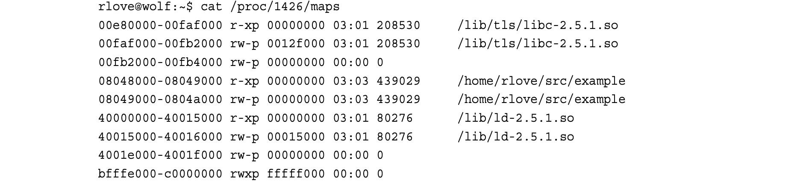

The data is in the form

```sh
start-end permission offset major:minor inode file
```

The pmap(1) utility formats this information in a bit more readable manner:

`pmap(1)` 工具会将这些信息以更易读的格式呈现出来：

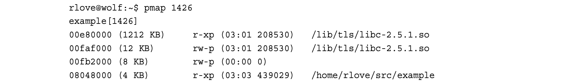

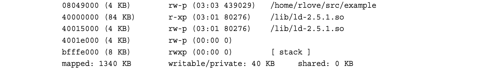

The first three rows are the text section, data section, and bss of libc.so, the C library. The next two rows are the text and data section of our executable object.The following three rows are the text section, data section, and bss for ld.so, the dynamic linker.The last row is the process’s stack.

前三行是 C 标准库 `libc.so` 的代码段、数据段和 BSS 段。接下来两行是我们可执行文件的代码段和数据段。再往后三行是动态链接器 `ld.so` 的代码段、数据段和 BSS 段。最后一行是进程的栈。

Note how the text sections are all readable and executable, which is what you expect for object code. On the other hand, the data section and bss (which both contain global variables) are marked readable and writable, but not executable.The stack is, naturally, readable, writable, and executable—not of much use otherwise.

可以看到，所有代码段都被标记为**可读、可执行**，这符合目标代码的权限要求。而数据段和 BSS 段（二者都存放全局变量）则被标记为**可读、可写，但不可执行**。栈区域自然是可读、可写且可执行的，否则无法正常工作。

The entire address space takes up about 1340KB, but only 40KB are writable and pri- vate. If a memory region is shared or nonwritable, the kernel keeps only one copy of the backing file in memory.This might seem like common sense for shared mappings, but the nonwritable case can come as a bit of a surprise. If you consider that a nonwritable map- ping can never be changed (the mapping is only read from), it is clear that it is safe to load the image only once into memory.Therefore, the C library needs to occupy only 1212KB in physical memory and not 1212KB multiplied by every process using the library. Because this process has access to about 1340KB worth of data and code, yet consumes only about 40KB of physical memory, the space savings from such sharing is substantial.

整个地址空间约占 1340KB，但其中只有 40KB 是**可写且私有**的。如果一个内存区域是共享的或不可写的，内核只会在内存中保留一份后备文件的副本。这对共享映射来说是常理，但对不可写区域而言可能有些出乎意料。试想，不可写映射永远不会被修改（仅用于读取），显然只将镜像加载一次到内存中是安全的。因此，C 库在物理内存中仅需占用 1212KB，而不是为每个使用它的进程都分配 1212KB。该进程虽然可访问总计约 1340KB 的代码和数据，却只消耗约 40KB 物理内存，这种共享方式节省的内存空间十分可观。

Note the memory areas without a mapped file on device 00:00 and inode zero.This is the zero page, which is a mapping that consists of all zeros. By mapping the zero page over a writable memory area, the area is in effect “initialized” to all zeros.This is impor- tant in that it provides a zeroed memory area, which is expected by the bss. Because the mapping is not shared, as soon as the process writes to this data, a copy is made (à la copy- on-write) and the value updated from zero.

注意那些没有映射文件、设备号为 00:00 且索引节点号为 0 的内存区域，这就是**零页（zero page）**，是一个全为 0 的内存映射。通过将零页映射到可写内存区域，该区域会被 “初始化” 为全 0。这一点很重要，因为 BSS 段需要这样的全零内存区域。由于该映射并非共享，一旦进程向这片数据执行写入操作，就会发生**写时复制（copy-on-write）**，系统会创建一份副本，并将数据从 0 更新为实际值。

Each of the memory areas associated with the process corresponds to a vm_area_struct structure. Because the process was not a thread, it has a unique mm_struct structure referenced from its task_struct.

该进程关联的每一个内存区域，都对应一个 `vm_area_struct` 结构体。由于该进程并非线程，它拥有一个独立的 `mm_struct` 结构体，由其 `task_struct` 结构体引用。

### Manipulating Memory Areas

The kernel often has to perform operations on a memory area, such as whether a given address exists in a givenVMA.These operations are frequent and form the basis of the mmap() routine, which is covered in the next section. A handful of helper functions are defined to assist these jobs.

内核经常需要对内存区域执行各类操作，例如判断某个指定地址是否存在于某个给定的 VMA 中。这类操作十分频繁，且构成了 `mmap()` 例程的实现基础（`mmap()` 将在下一节讲解）。内核定义了一组辅助函数来完成这些操作。这些函数均声明于 `<linux/mm.h>` 头文件中。

These functions are all declared in <linux/mm.h>.

这些函数均声明于 `<linux/mm.h>` 头文件中。

#### **find_vma()**

The kernel provides a function, find_vma(), for searching for the VMA in which a given memory address resides. It is defined in mm/mmap.c:

内核提供了 `find_vma()` 函数，用于查找包含指定内存地址的 VMA。该函数定义在 `mm/mmap.c` 文件中：

```c
struct vm_area_struct * find_vma(struct mm_struct *mm, unsigned long addr);
```

This function searches the given address space for the first memory area whose vm_end field is greater than addr. In other words, this function finds the first memory area that contains addr or begins at an address greater than addr. If no such memory area exists, the function returns NULL. Otherwise, a pointer to the vm_area_struct structure is returned. Note that because the returned VMA may start at an address greater than addr, the given address does not necessarily lie *inside* the returnedVMA.The result of the find_vma() function is cached in the mmap_cache field of the memory descriptor. Because of the probability of an operation on oneVMA being followed by more opera- tions on that same VMA, the cached results have a decent hit rate (about 30–40% in prac- tice). Checking the cached result is quick. If the given address is *not* in the cache, you must search the memory areas associated with this memory descriptor for a match.This is done via the red-black tree:

该函数会在指定的地址空间中，查找第一个 `vm_end` 字段值大于 `addr` 的内存区域。换句话说，它会找到第一个**包含 `addr`**，或**起始地址大于 `addr`** 的内存区域。若不存在此类内存区域，函数返回 `NULL`；否则返回指向该 `vm_area_struct` 结构体的指针。需要注意的是，由于返回的 VMA 的起始地址可能大于 `addr`，因此指定的地址未必处于返回的 VMA **内部**。

`find_vma()` 函数的执行结果会被缓存到内存描述符的 `mmap_cache` 字段中。由于对某个 VMA 执行操作后，后续大概率还会对该 VMA 执行更多操作，因此缓存的命中率相当可观（实际场景中约为 30% 至 40%）。检查缓存结果的过程十分高效。若指定地址未命中缓存，则必须在该内存描述符关联的所有内存区域中查找匹配项 —— 这一过程通过**红黑树**完成：

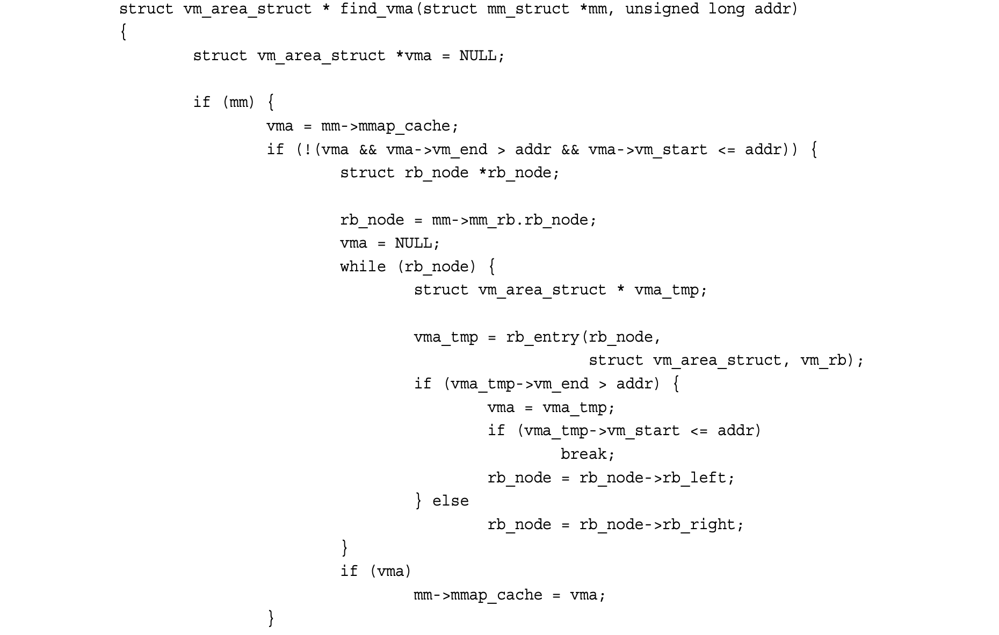


The initial check of mmap_cache tests whether the cached VMA contains the desired address. Note that simply checking whether the VMA’s vm_end field is bigger than addr would not ensure that this is the first suchVMA that is larger than addr.Thus, for the cache to be useful here, the given addr must lie in the VMA—thankfully, this is just the sort of scenario in which consecutive operations on the sameVMA would occur.

对 `mmap_cache` 的初始检查会验证**缓存的 VMA 是否包含目标地址**。需要注意的是，仅检查该 VMA 的 `vm_end` 字段是否大于 `addr`，并不能保证它就是第一个满足 `vm_end > addr` 的 VMA。因此，要让缓存在此处发挥作用，传入的 `addr` 必须**处于该 VMA 的地址范围内**—— 所幸，这正是 “对同一个 VMA 执行连续操作” 的典型场景。

If the cache does not contain the desired VMA, the function must search the red-black tree. If the current VMA’s vm_end is larger than addr, the function follows the left child; otherwise, it follows the right child.The function terminates as soon as aVMA is found that contains addr. If such a VMA is not found, the function continues traversing the tree and returns the first VMA it found that starts after addr. If no VMA is ever found, NULL is returned.

若缓存中不存在目标 VMA，函数就必须遍历红黑树进行查找：

- 若当前 VMA 的 `vm_end` 大于 `addr`，函数会转向**左子节点**；
- 反之，则转向**右子节点**。

一旦找到包含 `addr` 的 VMA，函数就会终止查找并返回该 VMA。若未找到这类 VMA，函数会继续遍历红黑树，最终返回第一个**起始地址大于 `addr`** 的 VMA；若始终未找到符合条件的 VMA，则返回 `NULL`。

#### find_vma_prev()

The find_vma_prev() function works the same as find_vma(), but it also returns the lastVMA *before* addr.The function is also defined in mm/mmap.c and declared in <linux/mm.h>:

`find_vma_prev()` 函数的工作逻辑与 `find_vma()` 完全一致，区别在于它还会返回地址 `addr` **之前** 的最后一个 VMA。该函数同样定义在 `mm/mmap.c` 文件中，声明于 `<linux/mm.h>` 头文件：

```c
struct vm_area_struct * find_vma_prev(struct mm_struct *mm, unsigned long addr,
                                      struct vm_area_struct **pprev)
```

The pprev argument stores a pointer to the VMA preceding addr.

参数 `pprev` 用于**存储指向 `addr` 之前那个 VMA 的指针**（注：`pprev` 是二级指针，函数会通过它把 “前驱 VMA” 的地址回传给调用者）。

#### **find_vma_intersection()**

The find_vma_intersection()function returns the first VMA that overlaps a given address interval.The function is defined in <linux/mm.h> because it is inline:

`find_vma_intersection()` 函数返回与指定地址区间**存在重叠**的第一个 VMA。该函数因被定义为内联函数，故实现于 `<linux/mm.h>` 头文件中：

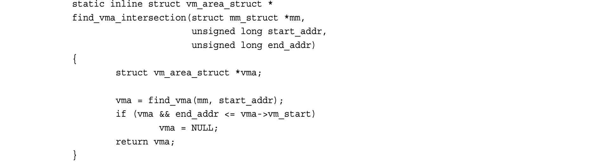

The first parameter is the address space to search, start_addr is the start of the inter- val, and end_addr is the end of the interval.

其中，第一个参数是待搜索的地址空间，`start_addr` 表示地址区间的起始地址，`end_addr` 表示地址区间的结束地址。

Obviously, if find_vma() returns NULL, so would find_vma_intersection(). If find_vma() returns a valid VMA, however, find_vma_intersection() returns the same VMA only if it does *not* start after the end of the given address range. If the returned memory area does start after the end of the given address range, the function returns NULL.

显然，若 `find_vma()` 返回 `NULL`，`find_vma_intersection()` 也会返回 `NULL`。但如果 `find_vma()` 返回了有效的 VMA，那么仅当该 VMA**并非**起始于给定地址区间的结束地址之后时，`find_vma_intersection()` 才会返回这个相同的 VMA；若返回的内存区域确实起始于给定地址区间的结束地址之后，则该函数返回 `NULL`。

#### **mmap()** and **do_mmap()**: Creating an Address Interval

The do_mmap()function is used by the kernel to create a new linear address interval. Say- ing that this function creates a newVMA is not technically correct,because if the created address interval is adjacent to an existing address interval, and if they share the same per- missions, the two intervals are merged into one. If this is not possible, a new VMA is cre- ated. In any case, do_mmap() is the function used to add an address interval to a process’s address space—whether that means expanding an existing memory area or creating a new one.

`do_mmap()` 函数是内核用于创建新**线性地址区间**的核心接口。严格来说，称该函数 “创建新 VMA” 并不严谨 —— 因为如果新建的地址区间与某个已有地址区间**相邻**，且二者拥有相同的访问权限，这两个区间会被合并为一个；若无法合并，则会创建新的 VMA。无论哪种情况，`do_mmap()` 都是向进程地址空间添加地址区间的函数 —— 其行为要么是扩展已有内存区域，要么是创建新的内存区域。

The do_mmap() function is declared in <linux/mm.h>:

`do_mmap()` 函数声明于 `<linux/mm.h>`：

```c
unsigned long do_mmap(struct file *file, unsigned long addr,
                      unsigned long len, unsigned long prot,
                      unsigned long flag, unsigned long offset)
```

This function maps the file specified by file at offset offset for length len.The file parameter can be NULL and offset can be zero, in which case the mapping will not be backed by a file. In that case, this is called an *anonymous mapping*. If a file and offset are provided, the mapping is called a *file-backed mapping*.

该函数将文件 `file` 中从偏移量 `offset` 开始、长度为 `len` 的内容映射到内存中。参数 `file` 可以为 `NULL` 且 `offset` 可为 0，此时该映射**没有文件作为后备存储**，这类映射被称为**匿名映射（anonymous mapping）**；若传入了文件和偏移量，则该映射称为**文件后备映射（file-backed mapping）**。

The addr function optionally specifies the initial address from which to start the search for a free interval.

参数 `addr` 可选地指定 “搜索空闲地址区间” 的起始地址。

The prot parameter specifies the access permissions for pages in the memory area.The possible permission flags are defined in <asm/mman.h> and are unique to each supported architecture, although in practice each architecture defines the flags listed in Table 15.2.

参数 `prot` 指定内存区域内页面的访问权限，可用的权限标志定义于 `<asm/mman.h>`，且因处理器架构而异；但实际上各架构都定义了表 15.2 中列出的标志。

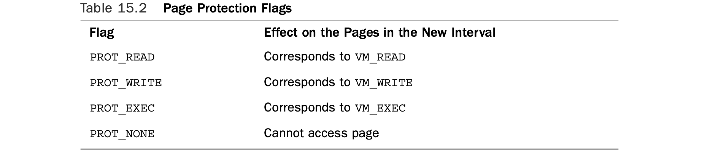

The flags parameter specifies flags that correspond to the remainingVMA flags. These flags specify the type and change the behavior of the mapping.They are also defined in <asm/mman.h>. See Table 15.3.

参数 `flags` 指定与其余 VMA 标志对应的标识位，这些标志定义了映射的类型并修改其行为，同样定义于 `<asm/mman.h>`（见表 15.3）。

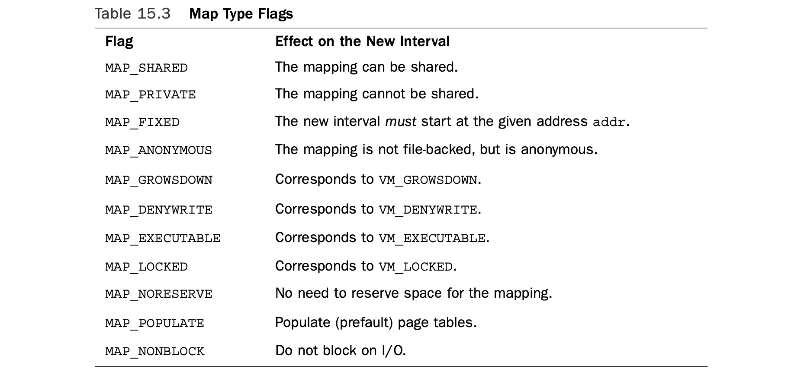

If any of the parameters are invalid, do_mmap() returns a negative value. Otherwise, a suitable interval in virtual memory is located. If possible, the interval is merged with an adjacent memory area. Otherwise, a new vm_area_struct structure is allocated from the vm_area_cachep slab cache, and the new memory area is added to the address space’s linked list and red-black tree of memory areas via the vma_link() function. Next, the total_vm field in the memory descriptor is updated. Finally, the function returns the ini- tial address of the newly created address interval.

若任一参数无效，`do_mmap()` 返回负值；否则，内核会在虚拟内存中找到合适的地址区间：

1. 若条件允许，该区间会与相邻的内存区域合并；
2. 若无法合并，则从 `vm_area_cachep` slab 缓存中分配新的 `vm_area_struct` 结构体，并通过 `vma_link()` 函数将新内存区域添加到地址空间的内存区域链表和红黑树中；
3. 随后更新内存描述符中的 `total_vm` 字段；
4. 最后返回新建地址区间的起始地址。

The do_mmap() functionality is exported to user-space via the mmap() system call.The mmap()system call is defined as

`do_mmap()` 的功能通过 `mmap()` 系统调用暴露给用户空间。该系统调用的定义如下：

```c
void * mmap2(void *start,
             size_t length,
             int prot, 
             int flags, 
             int fd, 
             off_t pgoff)
```

This system call is named mmap2() because it is the second variant of mmap().The original mmap() took an offset in bytes as the last parameter; the current mmap2() receives the offset in pages.This enables larger files with larger offsets to be mapped.The original mmap(), as specified by POSIX, is available from the C library as mmap(), but is no longer implemented in the kernel proper, whereas the new version is available as mmap2(). Both library calls use the mmap2() system call, with the original mmap() converting the offset from bytes to pages.

该系统调用命名为 `mmap2()`，因为它是 `mmap()` 的第二个版本：

- 早期的 `mmap()` 以**字节**为单位接收偏移量作为最后一个参数；
- 当前的 `mmap2()` 则以**页**为单位接收偏移量（参数名 `pgoff` 即 “page offset”），这使得更大的文件、更大的偏移量也能被映射。

POSIX 标准定义的原始 `mmap()` 仍可通过 C 标准库调用，但内核中已不再提供原生实现；新版本的 `mmap2()` 是内核当前支持的核心接口。这两个库函数最终都会调用 `mmap2()` 系统调用 —— 原始的 `mmap()` 会先将字节偏移量转换为页偏移量。

#### **munmap()** and **do_munmap()**: Removing an Address Interval

The do_munmap() function removes an address interval from a specified process address space.The function is declared in <linux/mm.h>:

`do_munmap()` 函数用于从指定进程的地址空间中移除一段地址区间。该函数声明于 `<linux/mm.h>`：

```c
int do_munmap(struct mm_struct *mm, unsigned long start, size_t len)
```

The first parameter specifies the address space from which the interval starting at address start of length len bytes is removed. On success, zero is returned. Otherwise, a negative error code is returned.

第一个参数指定要操作的地址空间，函数会从该地址空间中移除“起始地址为 `start`、长度为 `len` 字节”的地址区间。调用成功时返回 0，否则返回负的错误码。

The munmap() system call is exported to user-space as a means to enable processes to remove address intervals from their address space; it is the complement of the mmap() system call:

`munmap()` 系统调用作为用户空间接口暴露给进程，允许进程从自身地址空间中移除地址区间，是 `mmap()` 系统调用的**互补操作**：

```c
int munmap(void *start, size_t length)
```

The system call is defined in mm/mmap.c and acts as a simple wrapper to do_munmap():

该系统调用定义在 `mm/mmap.c` 中，本质是 `do_munmap()` 的轻量封装函数：

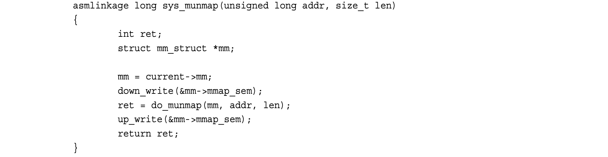

### Page Tables

Although applications operate on virtual memory mapped to physical addresses, proces- sors operate directly on those physical addresses. Consequently, when an application accesses a virtual memory address, it must first be converted to a physical address before the processor can resolve the request. Performing this lookup is done via page tables. Page tables work by splitting the virtual address into chunks. Each chunk is used as an index into a table.The table points to either another table or the associated physical page.

尽管应用程序基于**映射到物理地址的虚拟内存**运行，但处理器直接操作的是这些物理地址。因此，当应用程序访问一个虚拟内存地址时，该地址必须先被转换为物理地址，处理器才能处理此次访问请求。

这种地址查找工作由 **页表（page tables）** 完成。页表的工作方式是将虚拟地址拆分为多个片段，每个片段作为索引指向对应表项；表项要么指向另一级页表，要么指向对应的物理页。

In Linux, the page tables consist of three levels.The multiple levels enable a sparsely populated address space, even on 64-bit machines. If the page tables were implemented as a single static array, their size on even 32-bit architectures would be enormous. Linux uses three levels of page tables even on architectures that do not support three levels in hard- ware. (For example, some hardware uses only two levels or implements a hash in hard- ware.) Using three levels is a sort of “greatest common denominator”—architectures with a less complicated implementation can simplify the kernel page tables as needed with compiler optimizations.

在 Linux 中，页表采用**三级结构**。多级页表的设计，即便在 64 位机器上也能支持**稀疏地址空间**。如果页表以单一静态数组实现，即便在 32 位架构上，其占用空间也会极为庞大。

即便某些硬件架构本身不支持三级页表（例如部分硬件仅支持两级页表，或在硬件中实现哈希机制），Linux 依然统一采用三级页表。采用三级结构是一种 “最大公约数” 式设计：实现更简单的硬件架构，可以通过编译器优化按需简化内核页表。

The top-level page table is the page global directory (PGD), which consists of an array of pgd_t types. On most architectures, the pgd_t type is an unsigned long.The entries in the PGD point to entries in the second-level directory, the PMD.

**顶级页表是页全局目录（PGD, Page Global Directory）**，由 `pgd_t` 类型的数组构成。在多数架构中，`pgd_t` 是无符号长整型（`unsigned long`）。PGD 中的表项指向二级目录 ——**页中间目录（PMD, Page Middle Directory）**。

The second-level page table is the page middle directory (PMD), which is an array of pmd_t types.The entries in the PMD point to entries in the PTE.

**二级页表是页中间目录（PMD）**，由 `pmd_t` 类型的数组构成。PMD 中的表项指向最后一级的**页表项（PTE）**。

The final level is called simply the page table and consists of page table entries of type pte_t. Page table entries point to physical pages.

最后一级就是普通页表，由 `pte_t` 类型的页表项组成，页表项直接指向物理页。

In most architectures, page table lookups are handled (at least to some degree) by hard- ware. In normal operation, hardware can handle much of the responsibility of using the page tables.The kernel must set things up, however, in such a way that the hardware is happy and can do its thing. Figure 15.1 diagrams the flow of a virtual to physical address lookup using page tables.

在多数架构中，页表查找工作（至少部分）由**硬件**完成。正常运行时，硬件可以承担页表操作的大部分工作，但内核必须完成相应的初始化与配置，保证硬件能够正常工作。

图 15.1 展示了通过页表完成**虚拟地址到物理地址转换**的流程。

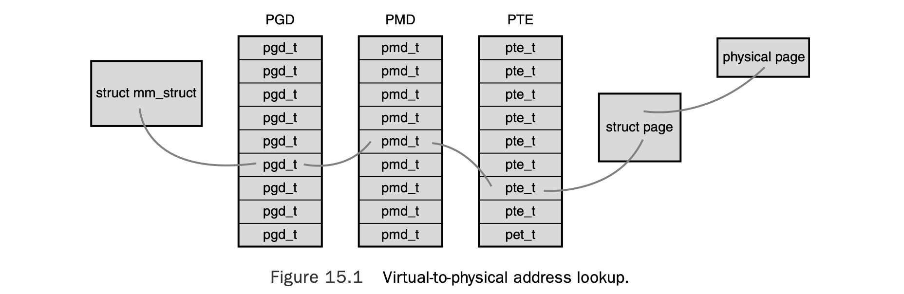

Each process has its own page tables (threads share them, of course).The pgd field of the memory descriptor points to the process’s page global directory. Manipulating and traversing page tables requires the page_table_lock, which is located inside the associ- ated memory descriptor.

每个进程都拥有独立的页表（当然，线程会共享所属进程的页表）。内存描述符（memory descriptor）中的 `pgd` 字段指向该进程的页全局目录（PGD）。对页表进行操作和遍历需要持有 `page_table_lock` 锁，该锁存放在对应的内存描述符中。

Page table data structures are quite architecture-dependent and thus are defined in <asm/page.h>.

页表的数据结构高度依赖于硬件架构，因此其定义位于 `<asm/page.h>` 头文件中。

Because nearly every access of a page in virtual memory must be resolved to its corre- sponding address in physical memory, the performance of the page tables is very critical. Unfortunately, looking up all these addresses in memory can be done only so quickly.To facilitate this, most processors implement a *translation lookaside buffer*, or simply *TLB*, which acts as a hardware cache of virtual-to-physical mappings.When accessing a virtual address, the processor first checks whether the mapping is cached in the TLB. If there is a hit, the physical address is immediately returned. Otherwise, if there is a miss, the page tables are consulted for the corresponding physical address.

由于虚拟内存中几乎每一次页面访问都必须解析到物理内存中的对应地址，页表的性能至关重要。但遗憾的是，在内存中逐一查找这些地址的速度存在天然上限。为优化这一过程，大多数处理器都实现了**地址转换后备缓冲器（Translation Lookaside Buffer，TLB）**—— 它本质是虚拟地址到物理地址映射的硬件缓存。当访问某个虚拟地址时，处理器会首先检查该地址映射是否缓存于 TLB 中：若命中（hit），则直接返回物理地址；若未命中（miss），则通过页表查找对应的物理地址。

Nonetheless, page table management is still a critical—and evolving—part of the ker- nel. Changes to this area in 2.6 include allocating parts of the page table out of high memory. Future possibilities include shared page tables with copy-on-write semantics. In that scheme, page tables would be shared between parent and child across a fork().When the parent or the child attempted to modify a particular page table entry, a copy would be created, and the two processes would no longer share that entry. Sharing page tables would remove the overhead of copying the page table entries on fork().

尽管如此，页表管理仍是内核中**关键且持续演进**的核心模块。Linux 2.6 版本对该模块的改进包括：从高端内存（high memory）中分配部分页表空间。未来可能的优化方向则包含实现带有写时复制（copy-on-write）语义的共享页表：在这种设计下，父进程与子进程在 `fork()` 操作后会共享页表；当父进程或子进程试图修改某个特定的页表项时，内核会为该表项创建副本，此后两个进程不再共享该表项。共享页表的设计能够彻底消除 `fork()` 时复制页表项带来的性能开销。


