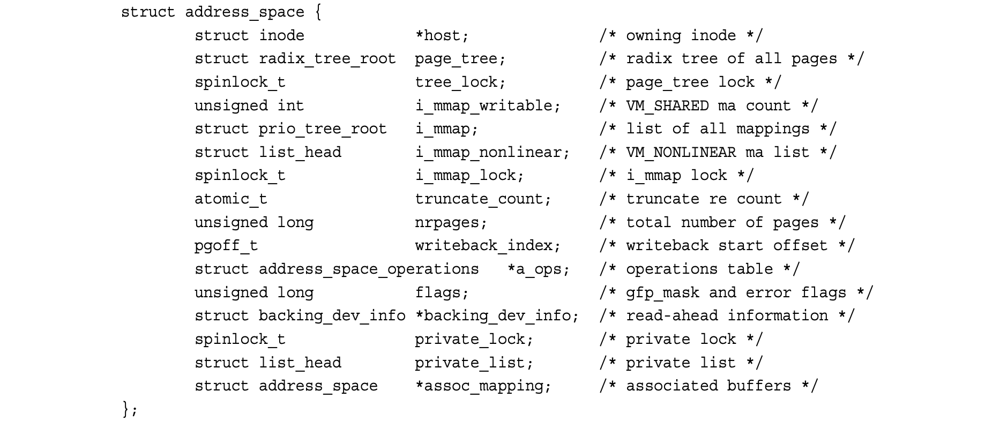
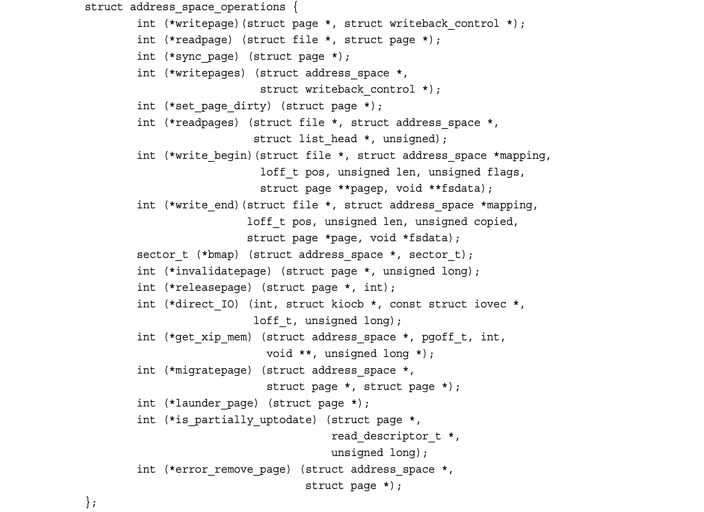
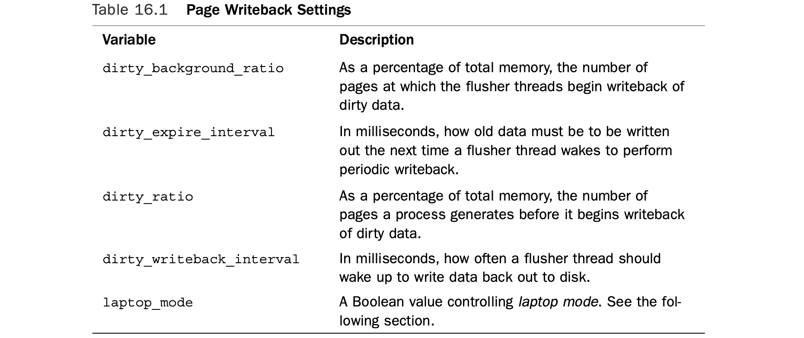

## 16 The Page Cache and Page Writeback

The Linux kernel implements a disk cache called the ***page cache***.The goal of this cache is to minimize disk I/O by storing data in physical memory that would otherwise require disk access.This chapter deals with the page cache and the process by which changes to the page cache are propagated back to disk, which is called *page writeback*.

Linux 内核实现了一种名为**页缓存（page cache）**的磁盘缓存。该缓存的设计目标是：将原本需要访问磁盘的数据存放在物理内存中，以此最小化磁盘 I/O 操作。本章将介绍页缓存，以及将页缓存中的修改回写到磁盘的过程 —— 该过程称为**页回写（page writeback）**。

Two factors comingle to make disk caches a critical component of any modern oper- ating system. First, disk access is several orders of magnitude slower than memory access— milliseconds versus nanoseconds.Accessing data from memory rather than the disk is much faster, and accessing data from the processor’s L1 or L2 cache is faster still. Second, data accessed once will, with a high likelihood, find itself accessed again in the near future.This principle—that access to a particular piece of data tends to be clustered in time—is called *temporal locality*, which ensures that if data is cached on its first access, there is a high probability of a cache hit (access to data in the cache) in the near future. Given that memory is so much faster than disk, coupled with the fact that once-used is likely twice-used data, an in-memory cache of the disk is a large performance win.

两大因素共同决定了磁盘缓存是所有现代操作系统的核心组件：

第一，磁盘访问的速度比内存访问慢**好几个数量级**—— 毫秒级 vs 纳秒级。从内存中读取数据远快于从磁盘读取，而从处理器的 L1 或 L2 高速缓存中访问则更快。

第二，**一旦被访问过的数据，在短期内极有可能被再次访问**。这种 “对某一数据的访问在时间上趋于集中” 的特性，称为**时间局部性（temporal locality）**。这就保证了：如果数据在第一次访问时被缓存，那么在不久的将来极大概率会产生**缓存命中（cache hit）**。

内存远快于磁盘，再加上 “用过一次的数据很可能会被再次使用” 这一特性，使得基于内存的磁盘缓存能带来巨大的性能提升。

### Approaches to Caching

The page cache consists of physical pages in RAM, the contents of which correspond to physical blocks on a disk.The size of the page cache is dynamic; it can grow to consume any free memory and shrink to relieve memory pressure.We call the storage device being cached the *backing store* because the disk stands behind the cache as the source of the canonical version of any cached data.Whenever the kernel begins a read operation—for example, when a process issues the read() system call—it first checks if the requisite data is in the page cache. If it is, the kernel can forgo accessing the disk and read the data directly out of RAM.This is called a *cache hit*. If the data is not in the cache, called a *cache miss*,the kernel must schedule block I/O operations to read the data off the disk.After the data is read off the disk, the kernel populates the page cache with the data so that any subsequent reads can occur out of the cache. Entire files need not be cached; the page cache can hold some files in their entirety while storing only a page or two of other files. What is cached depends on what has been accessed.

**页缓存**由内存中的物理页组成，其内容对应磁盘上的物理块。

页缓存的大小是**动态**的：它可以不断增长，占用所有空闲内存；也可以在内存紧张时收缩，以缓解内存压力。

我们把被缓存的存储设备称为**后备存储（backing store）**，因为磁盘作为缓存的后盾，是所有缓存数据**权威正本**的来源。

每当内核发起读操作时（例如进程调用 `read()` 系统调用），内核会先检查所需数据是否在页缓存中。

- 如果存在，内核就可以**不必访问磁盘**，直接从内存中读取数据，这称为**缓存命中（cache hit）**。
- 如果数据不在缓存中，即**缓存未命中（cache miss）**，内核就必须调度块 I/O 操作，从磁盘读取数据。

数据从磁盘读出后，内核会将其**存入页缓存**，这样后续的读操作就可以直接从缓存中获取。

无需缓存整个文件：页缓存可以完整缓存某些文件，而对另一些文件只缓存一两页。缓存哪些内容，取决于实际被访问的数据。

#### Write Caching

This explains how data ends up in the page cache via read operations, but what happens when a process writes to disk, for example via the write() system call? Generally speak- ing, caches can implement one of three different strategies.

这就解释了数据如何通过读操作进入页缓存，可当进程向磁盘写入数据时（比如通过 `write()` 系统调用），又会发生什么呢？一般来说，缓存可以采用三种不同策略。

In the first strategy, called *no- write*, the cache simply does not cache write operations.A write operation against a piece of data stored in the cache would be written directly to disk, invalidating the cached data and requiring it to be read from disk again on any subsequent read. Caches rarely employ this strategy because it not only fails to cache write operations, but it also makes them costly by invalidating the cache.

第一种策略叫作**不写（no-write）**：缓存完全不缓存写操作。对缓存里已有的数据执行写操作时，数据会直接写入磁盘，同时让缓存里的对应数据失效，后续再读就必须重新从磁盘读取。缓存几乎不会用这种策略 —— 它既不缓存写操作，还会因为让缓存失效而让写入代价变得很高。

In the second strategy, a write operation would automatically update both the in- memory cache and the on-disk file.This approach is called a *write-through cache* because write operations immediately go *through* the cache to the disk.This approach has the ben- efit of keeping the cache *coherent*—synchronized and valid for the backing store—without needing to *invalidate* it. It is also simple.

第二种策略：写操作会**同时自动更新内存缓存和磁盘文件**。这种方式叫作**写透缓存（write-through cache）**，因为写操作会立刻 “穿过” 缓存直接落到磁盘。它的好处是能让缓存一直保持**一致（coherent）**—— 和后备存储同步、有效 —— 不需要让缓存失效，而且实现简单。

The third strategy, employed by Linux, is called ***write-back***.1 In a write-back cache, processes perform write operations directly into the page cache.The backing store is not immediately or directly updated. Instead, the written-to pages in the page cache are marked as *dirty* and are added to a *dirty list*. Periodically, pages in the dirty list are written back to disk in a process called *writeback*, bringing the on-disk copy in line with the in- memory cache.The pages are then marked as no longer dirty.The term “dirty” can be confusing because what is actually dirty is not the data in the page cache (which is up to date) but the data on disk (which is out of date).A better term would be *unsynchronized*. Nonetheless, we say the cache contents, not the invalid disk contents, are dirty.A write- back is generally considered superior to a write-through strategy because by deferring the writes to disk, they can be coalesced and performed in bulk at a later time.The downside is complexity.

第三种策略，也是 **Linux 所采用的**，叫作**写回（write-back）**。

在写回缓存里：

- 进程直接把数据写到**页缓存**里；
- 磁盘并不会被立刻、直接更新；
- 页缓存里被修改过的页面会被标记为**脏页（dirty）**，并加入**脏页链表（dirty list）**；
- 系统会定期把脏页链表中的页面写回磁盘，这个过程就叫**回写（writeback）**，让磁盘上的数据和内存缓存保持一致；
- 写完之后，这些页面就不再被标记为脏页。

“脏” 这个词容易让人误解：其实 “脏” 的**不是页缓存里的数据**（缓存里是最新的），而是**磁盘上的数据**（已经过时）。更准确的说法应该是**未同步（unsynchronized）**。但习惯上，我们仍然把缓存里被改过的内容叫作 “脏”。

写回策略通常比写透更优秀：通过把写磁盘操作**延后**，系统可以把多次写操作**合并**，之后**批量**执行。代价则是实现更复杂。

#### Cache Eviction

**缓存回收**

The final piece to caching is the process by which data is removed from the cache, either to make room for more relevant cache entries or to shrink the cache to make available more RAM for other uses.This process, and the strategy that decides what to remove, is called ***cache eviction***. Linux’s cache eviction works by selecting *clean* (not dirty) pages and simply replacing them with something else. If insufficient clean pages are in the cache, the kernel forces a writeback to make more clean pages available.The hard part is deciding *what* to evict.The ideal eviction strategy evicts the pages least likely to be used in the future. Of course, knowing what pages are least likely to be accessed requires knowing the future, which is why this hopeful strategy is often referred to as the *clairvoyant algorithm*. Such a strategy is ideal, but impossible to implement.

缓存机制的最后一环，是将数据从缓存中移除的过程 —— 要么为更相关的缓存条目腾出空间，要么收缩缓存、释放更多内存给其他用途使用。这一过程，以及决定移除哪些内容的策略，统称为**缓存回收（cache eviction）**。

Linux 的缓存回收机制会优先挑选**干净页（clean pages）**（即非脏页），直接用新数据替换它们。如果缓存里的干净页不足，内核就会强制触发**回写（writeback）**，从而产生更多可用的干净页。

真正的难点在于**决定回收哪些页面**。理想的回收策略，是淘汰**未来最不可能被用到**的页面。但显然，要知道哪些页面最不可能被访问，需要预知未来 —— 这也是为什么这种理想策略常被称作**预知算法（clairvoyant algorithm）**。这类策略虽然完美，却无法真正实现。

##### Least Recently Used

Cache eviction strategies attempt to approximate the clairvoyant algorithm with what information they have access to. One of the more successful algorithms, particularly for general-purpose page caches, is called *least recently used*, or *LRU*.An LRU eviction strategy requires keeping track of when each page is accessed (or at least sorting a list of pages by access time) and evicting the pages with the oldest timestamp (or at the start of the sorted list).This strategy works well because the longer a piece of cached data sits idle, the less likely it is to be accessed in the near future. Least recently used is a great approximation of most likely to be used. However, one particular failure of the LRU strategy is that many files are accessed once and then never again. Putting them at the top of the LRU list is thus not optimal. Of course, as before, the kernel has no way of knowing that a file is going to be accessed only once. But it does know how many times it has been accessed in the past.

缓存回收策略会基于现有可获取的信息，**尽可能逼近**预知算法的效果。其中最成功、尤其适用于通用页缓存的算法，叫作**最近最少使用（Least Recently Used，LRU）**。

LRU 回收策略需要记录每个页面的访问时间（或至少按访问时间对页面列表排序），并回收时间戳最旧的页面（即排在有序列表最前面的页面）。该策略效果很好，因为一段缓存数据闲置越久，短期内被再次访问的概率就越低。**最近最少使用**是对 “未来最可能被使用” 的一个极佳近似。

不过，LRU 策略存在一个典型缺陷：很多文件只会被访问**一次**，之后便不再使用。把这类页面放到 LRU 列表顶端，显然不是最优选择。当然，和之前一样，内核无法预先知道一个文件只会被访问一次。但它**可以知道**该文件在过去被访问过多少次。

##### The Two-List Strategy

Linux, therefore, implements a modified version of LRU, called the *two-list strategy*. Instead of maintaining one list, the LRU list, Linux keeps two lists: the *active list* and the *inactive list*. Pages on the active list are considered “hot” and are not available for eviction. Pages on the inactive list are available for cache eviction. Pages are placed on the active list only when they are accessed *while already residing* on the inactive list. Both lists are maintained in a pseudo-LRU manner: Items are added to the tail and removed from the head, as with a queue.The lists are kept in balance: If the active list becomes much larger than the inac- tive list, items from the active list’s head are moved back to the inactive list, making them available for eviction.The two-list strategy solves the only-used-once failure in a classic LRU and also enables simpler, pseudo-LRU semantics to perform well.This two-list approach is also known as *LRU/2*; it can be generalized to n-lists, called *LRU/n*.

因此，Linux 实现了 LRU 的改进版本，称为**双链表策略（two-list strategy）**。Linux 不再维护单一的 LRU 链表，而是维护两条链表：**活跃链表（active list）**和**非活跃链表（inactive list）**。

活跃链表中的页面被视为 “热页”，不会被回收；非活跃链表中的页面则可被缓存回收。

只有页面原本就位于非活跃链表中、且再次被访问时，才会被移入活跃链表。

两条链表均以 **伪 LRU（pseudo-LRU）** 方式维护：像队列一样，从尾部添加元素，从头部移除元素。

两条链表会保持平衡：如果活跃链表远大于非活跃链表，活跃链表头部的元素会被移回非活跃链表，使其可被回收。

双链表策略解决了传统 LRU 在 “仅使用一次” 场景下的缺陷，也让更简单的伪 LRU 逻辑拥有出色表现。这种双链表方案也被称作 **LRU/2**，还可泛化为 n 条链表，称为 **LRU/n**。

We now know how the page cache is populated (via reads and writes), how it is syn- chronized in the face of writes (via writeback), and how old data is evicted to make way for new data (via a two-list strategy). Let’s now consider a real-world scenario to see how the page cache benefits the system.Assume you are working on a large software project— the Linux kernel,perhaps—and have many source files open.As you open and read source code, the files are stored in the page cache. Jumping around from file to file is instantaneous as the data is cached. As you edit the files, saving them appears instanta- neous as well because the writes only need to go to memory, not the disk.When you compile the project, the cached files enable the compilation to proceed with far fewer disk accesses, and thus much more quickly. If the entire source tree is too big to fit in memory, some of it must be evicted—and thanks to the two-list strategy, any evicted files will be on the inactive list and likely not one of the source files you are directly editing. Later, hopefully when you are not compiling, the kernel will perform page writeback and update the on-disk copies of the source files with any changes you made.This caching results in a dramatic increase in system performance.To see the difference, compare how long it takes to compile your large software project when “cache cold”—say, fresh off a reboot—versus “cache warm.”

至此，我们已经了解页缓存如何被填充（通过读写操作）、写操作时如何与磁盘同步（通过页回写），以及旧数据如何被回收以给新数据腾出空间（通过双链表策略）。

下面通过一个实际场景，看看页缓存如何为系统带来性能提升。

假设你正在开发一个大型软件项目 —— 比如 Linux 内核 —— 并打开了大量源文件。

当你打开、阅读源码时，文件会被存入页缓存。在文件间来回切换会是瞬时完成的，因为数据已在缓存中。

编辑文件时，保存操作看起来也是瞬时的，因为写入只需写到内存，无需直接落盘。

编译项目时，缓存中的文件能大幅减少磁盘访问，让编译速度快得多。

如果整个源码树过大，无法全部放进内存，部分数据就必须被回收 —— 而得益于双链表策略，被回收的文件只会来自非活跃链表，基本不会是你正在直接编辑的源文件。

之后，内核通常会在你不编译的时段执行页回写，将你所做的修改同步更新到磁盘上的源文件副本。

这种缓存机制极大提升了系统性能。想要直观感受差异，可以对比**缓存冷状态**（比如刚重启后）与**缓存热状态**下，编译大型项目所花费的时间。

### The Linux Page Cache

The page cache, as its name suggests, is a cache of pages in RAM.The pages originate from reads and writes of regular filesystem files, block device files, and memory-mapped files. In this manner, the page cache contains chunks of recently accessed files. During a page I/O operation, such as read(),2 the kernel checks whether the data resides in the page cache. If the data is in the page cache, the kernel can quickly return the requested page from memory rather than read the data off the comparatively slow disk. In the rest of this chapter, we explore the data structures and kernel facilities that maintain Linux’s page cache.

顾名思义，**页缓存**就是存放在物理内存中的页面缓存。这些缓存页面来源于对普通文件系统文件、块设备文件以及内存映射文件的读写操作。通过这种方式，页缓存保存了最近被访问文件的数据片段。

在执行页 I/O 操作（例如 `read()` 系统调用）时，内核会先检查所需数据是否已存在于页缓存中。如果数据在页缓存里，内核就可以直接从内存中快速返回请求的页面，而不必去访问速度相对缓慢的磁盘。本章后续部分，我们将深入探讨维护 Linux 页缓存所使用的数据结构与内核机制。

#### The **address_space** Object

A page in the page cache can consist of multiple noncontiguous physical disk blocks.3 Checking the page cache to see whether certain data has been cached is made difficult because of this noncontiguous layout of the blocks that constitute each page.Therefore, it is not possible to index the data in the page cache using only a device name and block number, which would otherwise be the simplest solution.

页缓存中的一个页面，可以对应磁盘上**多个不连续的物理块**。正是因为组成每个页面的磁盘块在物理上不连续，想要检查某段数据是否已被缓存，就变得比较困难。因此，不能只靠**设备名 + 块号**来对页缓存中的数据做索引 —— 尽管这本来是最简单的方案。

Furthermore, the Linux page cache is quite general in what pages it can cache. Indeed, the original page cache introduced in SystemV Release 4 cached only filesystem data. Consequently, the SVR4 page cache used its equivalent of the inode object, called struct vnode, to manage the page cache.The Linux page cache aims to cache *any* page- based object, which includes many forms of files and memory mappings.

此外，Linux 页缓存具有很强的通用性，可缓存的页面来源非常广泛。实际上，早期 System V Release 4 引入的页缓存，只缓存文件系统数据。因此，SVR4 的页缓存是用它自己的类索引节点对象（叫作 `struct vnode`）来管理的。而 Linux 页缓存的目标是缓存**所有基于页面的对象**，包括各类文件和多种内存映射。

Although the Linux page cache could work by extending the inode structure (dis- cussed in Chapter 13,“TheVirtual Filesystem”) to support page I/O operations, such a choice would confine the page cache to files.To maintain a generic page cache—one not tied to physical files or the inode structure—the Linux page cache uses a new object to manage entries in the cache and page I/O operations.That object is the address_space structure.Think of address_space as the physical analogue to the virtual vm_area_struct introduced in Chapter 15,“The Process Address Space.”While a single file may be represented by 10 vm_area_struct structures (if, say, five processes each mmap() it twice), the file has only one address_space structure—just as the file may have many virtual addresses but exist only once in physical memory. Like much else in the Linux kernel, address_space is misnamed. A better name is perhaps page_cache_entity or physical_pages_of_a_file.

虽然 Linux 页缓存也可以通过扩展索引节点（inode）结构（第 13 章《虚拟文件系统》中介绍过）来支持页 I/O 操作，但这么做会把页缓存**限定在文件范围内**。

为了实现一个**通用的页缓存**—— 不与物理文件或 inode 结构绑定 ——Linux 页缓存引入了一个新对象，用来管理缓存项和页 I/O 操作。这个对象就是 **`address_space` 结构体**。你可以把 `address_space` 理解成：第 15 章《进程地址空间》里介绍的虚拟内存区域 `vm_area_struct` 在**物理层面的对应体**。

同一个文件，可能对应 10 个 `vm_area_struct`（比如 5 个进程各对它做两次 `mmap()`），但这个文件**只对应一个 `address_space` 结构体**—— 就像一个文件可以有很多虚拟地址，但在物理内存里只存在一份。

和 Linux 内核里很多命名一样，`address_space` 这个名字其实**名不副实**。更合适的名字或许是 `page_cache_entity`（页缓存实体）或 `physical_pages_of_a_file`（文件的物理页面）。

The address_space structure is defined in <linux/fs.h>:

`address_space` 结构体定义在 `<linux/fs.h>` 中：



The i_mmap field is a **priority search tree** of all shared and private mappings in this address space.A priority search tree is a clever mix of heaps and radix trees.4 Recall from earlier that while a cached file is associated with one address_space structure, it can have many vm_area_struct structures—a one-to-many mapping from the physical pages to many virtual pages.The i_mmap field allows the kernel to efficiently find the mappings associated with this cached file.

`i_mmap` 字段是一棵**优先搜索树**，记录了该地址空间中所有的共享映射与私有映射。优先搜索树是堆与基数树的一种巧妙结合。

前面提到过：一个被缓存的文件只对应一个 `address_space` 结构体，却可以对应多个 `vm_area_struct`—— 也就是物理页面到多个虚拟页面的**一对多映射**。`i_mmap` 字段让内核能够高效地找到与该缓存文件相关联的所有映射。

There are a total of nrpages in the address space.

该地址空间中总共有 `nrpages` 个页面。

The address_space is associated with some kernel object. Normally, this is an inode. If so, the host field points to the associated inode.The host field is NULL if the associated object is not an inode—for example, if the address_space is associated with the swapper.

每个 `address_space` 都会关联某个内核对象，通常是一个索引节点（inode）。如果是这种情况，`host` 字段就指向对应的 inode。如果关联的对象不是 inode（比如该 `address_space` 与交换进程 swapper 相关），`host` 字段就为 NULL。

#### **address_space** Operations

The a_ops field points to the address space operations table, in the same manner as the VFS objects and their operations tables.The operations table is represented by struct address_space_operations and is also defined in <linux/fs.h>:

`a_ops` 字段指向**地址空间操作表（address space operations table）**，其设计思路与虚拟文件系统（VFS）对象及其操作表的实现方式完全一致。该操作表由 `struct address_space_operations` 结构体表示，同样定义在 `<linux/fs.h>` 头文件中：



These function pointers point at the functions that implement page I/O for this cached object. Each backing store describes how it interacts with the page cache via its own address_space_operations. For example, the ext3 filesystem defines its operations in fs/ext3/inode.c.Thus, these are the functions that manage the page cache, including the most common: reading pages into the cache and updated data in the cache.Thus, the readpage() and writepage()methods are most important. Let’s look at the steps involved in each, starting with a page read operation. 

这些函数指针指向为该缓存对象实现**页 I/O 操作**的具体函数。每种后备存储（backing store）都会通过自身的 `address_space_operations` 结构体，定义其与页缓存交互的方式。例如，ext3 文件系统在 `fs/ext3/inode.c` 文件中定义了专属的操作函数。因此，这些函数是页缓存的核心管理入口，涵盖最常用的操作：将页面读取到缓存中、更新缓存内的数据 —— 其中 `readpage()` 和 `writepage()` 方法是最关键的。

下面我们拆解每个操作的执行步骤，先从**页面读操作**说起：

First, the Linux kernel attempts to find the request data in the page cache.The find_get_page() method is used to perform this check; it is passed an address_space and page offset.These values search the page cache for the desired data:

首先，Linux 内核会尝试在页缓存中查找请求的数据。这一检查通过 `find_get_page()` 方法完成，调用时需传入 `address_space` 结构体和页面偏移量（page offset），内核会根据这两个参数检索目标数据：

```c
page = find_get_page(mapping, index);
```

Here, mapping is the given address_space and index is the desired offset into the file, in pages. (Yes, calling the address_space structure mapping just furthers the naming confusion. I’m replicating the kernel’s naming for consistency, but I do not condone it.) 

这里的 `mapping` 是传入的 `address_space` 结构体，`index` 则是文件内以 “页面” 为单位的目标偏移量。（注：将 `address_space` 结构体命名为 `mapping` 进一步加剧了命名混淆。为保持与内核代码命名一致，本文沿用该写法，但并不认同这一命名方式。）

If the page does not exist in the cache, find_get_page()returns NULL and a new page is allocated and added to the page cache:

如果目标页面不在缓存中，`find_get_page()` 会返回 `NULL`，此时内核会分配一个新页面并将其加入页缓存：

```c
struct page *page;
int error;

/* allocate the page ... */
page = page_cache_alloc_cold(mapping);
if (!page)
	/* error allocating memory */

/* ... and then add it to the page cache */
error = add_to_page_cache_lru(page, mapping, index, GFP_KERNEL);
if (error)
	/* error adding page to page cache */
```

Finally, the requested data can be read from disk, added to the page cache, and returned to the user:

最后，请求的数据会从磁盘读取、写入页缓存，并返回给用户：

```c
error = mapping->a_ops->readpage(file, page);
```

Write operations are a bit different. 

**写操作**的流程则略有不同：

For file mappings, whenever a page is modified, theVM simply calls

对于**文件映射（file mappings）** 场景，只要页面被修改，虚拟内存（VM）子系统会直接调用：

```c
SetPageDirty(page);
```

The kernel later writes the page out via the writepage() method.

内核后续会通过 `writepage()` 方法将该页面的数据刷写到磁盘。

Write operations on specific files are more complicated.The generic write path in mm/filemap.c performs the following steps:

而针对**特定文件的写操作**则更为复杂，`mm/filemap.c` 文件中实现的通用写路径会执行以下步骤：

```c
page = __grab_cache_page(mapping, index, &cached_page, &lru_pvec);
status = a_ops->prepare_write(file, page, offset, offset+bytes);
page_fault = filemap_copy_from_user(page, offset, buf, bytes);
status = a_ops->commit_write(file, page, offset, offset+bytes);
```

First, the page cache is searched for the desired page. If it is not in the cache, an entry is allocated and added. Next, the kernel sets up the write request and the data is copied from user-space into a kernel buffer. Finally, the data is written to disk.

执行逻辑拆解：

1. 内核先在页缓存中查找目标页面；若未找到，则分配新缓存项并加入页缓存；
2. 内核初始化写请求，并将数据从用户空间拷贝到内核缓冲区；
3. 最终将数据写入磁盘。

Because the previous steps are performed during all page I/O operations, all page I/O is guaranteed to go through the page cache. Consequently, the kernel attempts to satisfy all read requests from the page cache. If this fails, the page is read in from disk and added to the page cache. For write operations, the page cache acts as a staging ground for the writes.Therefore, all written pages are also added to the page cache.

由于所有页 I/O 操作都会执行上述步骤，因此**所有页 I/O 操作都必然经过页缓存**：

- 对于读请求，内核会优先尝试从页缓存中满足；若缓存未命中，则从磁盘读取页面并将其加入页缓存；
- 对于写请求，页缓存充当写操作的 “暂存区”—— 所有被写入的页面也都会被加入页缓存。

#### Radix Tree

Because the kernel must check for the existence of a page in the page cache before initi- ating any page I/O, such a check must be quick. Otherwise, the overhead of searching and checking the page cache could nullify any benefits the cache might provide. (At least if the cache hit rate is low—the overhead would have to be awful to cancel out the bene- fit of retrieving the data from memory in lieu of disk.)

因为内核在发起任何页 I/O 操作之前，都必须先检查页缓存中是否存在目标页面，所以这一检查过程必须足够**快速**。

否则，查找与校验页缓存的开销，可能会抵消掉缓存本身带来的全部收益。（至少在缓存命中率较低时是这样 —— 除非开销大到非常夸张，才会抵消掉 “从内存取数据而非磁盘” 的优势。）

As you saw in the previous section, the page cache is searched via the address_space object plus an offset value. Each address_space has a unique radix tree stored as page_tree.A radix tree is a type of binary tree.The radix tree enables quick searching for the desired page, given only the file offset. Page cache searching functions such as find_get_page() call radix_tree_lookup(), which performs a search on the given tree for the given object.

正如上一节所见，页缓存的查找是通过 **`address_space` 对象 + 偏移值** 来完成的。

每个 `address_space` 中都以 `page_tree` 的形式维护一棵**基数树（radix tree）**。

基数树是一种二叉树结构，只需传入文件偏移量，就能快速查找到所需页面。

像 `find_get_page()` 这样的页缓存查找函数，内部会调用 `radix_tree_lookup()`，在指定的树上对目标对象进行查找。

The core radix tree code is available in generic form in lib/radix-tree.c. Users of the radix tree need to include <linux/radix-tree.h>.

基数树的核心通用实现在 `lib/radix-tree.c` 中，使用基数树的代码需要包含头文件 `<linux/radix-tree.h>`。

#### The Old Page Hash Table

Prior to the 2.6 kernel, the page cache was not searched via the radix tree. Instead, a global hash was maintained over all the pages in the system.The hash returned a doubly linked list of entries that hash to the same given value. If the desired page were in the cache, one of the items in the list was the corresponding page. Otherwise, the page was not in the page cache and the hash function returned NULL.

在 2.6 版内核之前，页缓存**并非通过基数树**查找，而是对系统中所有页面维护一个**全局哈希表**。

哈希表会返回一个**双向链表**，包含所有哈希到同一值的表项。如果目标页面在缓存中，链表中就会有对应的页面；否则页面不在页缓存中，哈希函数返回 `NULL`。

The global hash had four primary problems:

- A single global lock protected the hash. Lock contention was quite high on even moderately sized machines, and performance suffered as a result.
- The hash was larger than necessary because it contained all the pages in the page cache, whereas only pages pertaining to the current file were relevant.
- Performance when the hash lookup failed (that is, the given page was not in the page cache) was slower than desired, particularly because it was necessary to walk the chains off of a given hash value.
- The hash consumed more memory than other possible solutions.

这种全局哈希表主要存在**四个问题**：

- 全局哈希由**单一全局锁**保护。即使在中等规模的机器上，锁竞争也非常激烈，进而影响性能。
- 哈希表体积过大，因为它存放了页缓存里的**所有页面**，而实际查找时只需要和当前文件相关的页面。
- **哈希未命中**（即页面不在缓存中）时的性能不尽如人意，尤其需要遍历对应哈希值的链表，耗时较长。
- 相比其他可行方案，哈希表消耗的内存更多。

The introduction of the radix tree-based page cache in 2.6 solved these issues.

2.6 内核引入**基于基数树**的页缓存后，这些问题都得到了解决。

### The Buffer Cache

Individual disk blocks also tie into the page cache, by way of block I/O buffers. Recall from Chapter 14,“The Block I/O Layer,” that a buffer is the in-memory representation of a single physical disk block. Buffers act as descriptors that map pages in memory to disk blocks; thus, the page cache also reduces disk access during block I/O operations by both caching disk blocks and buffering block I/O operations until later.This caching is often referred to as the *buffer cache*, although as implemented it is not a separate cache but is part of the page cache.

单独的磁盘块也会通过**块 I/O 缓冲区**与页缓存关联起来。回顾第 14 章《块 I/O 层》：**缓冲区（buffer）** 是单个物理磁盘块在内存中的表示。缓冲区相当于描述符，把内存中的页面映射到磁盘块。因此，页缓存通过缓存磁盘块、并将块 I/O 操作延后处理，同样减少了块 I/O 时的磁盘访问。这种缓存通常被称为**缓冲区缓存（buffer cache）**，但从实现上看，它**并不是独立的缓存**，而是**页缓存的一部分**。

Block I/O operations manipulate a single disk block at a time.A common block I/O operation is reading and writing inodes.The kernel provides the bread() function to perform a low-level read of a single block from disk.Via buffers, disk blocks are mapped to their associated in-memory pages and cached in the page cache.

块 I/O 操作一次只操作一个磁盘块，常见的块 I/O 操作包括读写索引节点（inode）。

内核提供 `bread()` 函数，用于从磁盘底层读取单个块。

通过缓冲区，磁盘块被映射到对应的内存页面，并缓存在页缓存中。

The buffer and page caches were not always unified; doing so was a major feature of the 2.4 Linux kernel. In earlier kernels, there were two separate disk caches: the page cache and the buffer cache.The former cached pages; the latter cached buffers.The two caches were not unified:A disk block could exist in both caches simultaneously.This led to wasted effort synchronizing the two cached copies and memory wasted in duplicating cached items.Today, we have one disk cache: the page cache.The kernel still needs to use buffers, however, to represent disk blocks in memory. Conveniently, the buffers describe the mapping of a block onto a page, which is in the page cache.

缓冲区缓存与页缓存**并非一直是统一的**，二者合并是 Linux 2.4 内核的一项重要特性。在更早的内核中，存在两个独立的磁盘缓存：

- **页缓存（page cache）**：缓存页面
- **缓冲区缓存（buffer cache）**：缓存缓冲区

两套缓存互不统一，同一个磁盘块可能同时存在于两个缓存中，导致：

- 为同步两份缓存副本做无用功
- 缓存项重复，浪费内存

如今，Linux 只有**一套磁盘缓存：页缓存**。不过，内核仍然需要用缓冲区在内存中表示磁盘块。方便的是，缓冲区正好用来描述**一个磁盘块到页缓存中某个页面的映射关系**。

### The Flusher Threads

Write operations are deferred in the page cache.When data in the page cache is newer than the data on the backing store, we call that data *dirty*. Dirty pages that accumulate in memory eventually need to be written back to disk. Dirty page writeback occurs in three situations:

- When free memory shrinks below a specified threshold, the kernel writes dirty data back to disk to free memory because only clean (nondirty) memory is available for eviction.When clean, the kernel can evict the data from the cache and then shrink the cache, freeing up more memory.

- When dirty data grows older than a specific threshold, sufficiently old data is writ- ten back to disk to ensure that dirty data does not remain dirty indefinitely.
- When a user process invokes the sync() and fsync() system calls, the kernel per- forms writeback on demand.

页缓存中的写操作会被**延迟执行**。当页缓存里的数据比后备存储上的数据更新时，我们称这些数据为**脏数据（dirty）**。

内存中累积的脏页最终都需要回写到磁盘，脏页回写会在三种情况下触发：

- 当空闲内存低于某个指定阈值时，内核会把脏数据回写到磁盘，以释放内存 —— 因为只有 **干净页（非脏页）** 才可以被回收。页面变干净后，内核才能把它从缓存中移除、收缩缓存，从而腾出更多内存。

- 当脏数据存放时间超过指定阈值时，这些 “陈旧” 的脏数据会被回写到磁盘，保证脏页不会无限期留在内存里。

- 当用户进程调用 `sync()`、`fsync()` 系统调用时，内核会**按需执行回写**。

These three jobs have rather different goals. In fact, two separate kernel threads per- formed the work in older kernels (see the following section). In 2.6, however, a gang5 of kernel threads, the *flusher threads*, performs all three jobs.

这三项工作的目标差异很大。

在更早的内核里，是由两个独立内核线程分别完成（见下一节）。

而从 Linux 2.6 开始，统一由一组内核线程 ——**刷出线程（flusher threads）**—— 负责这三件事。

First, the flusher threads need to flush dirty data back to disk when the amount of free memory in the system shrinks below a specified level.The goal of this background write- back is to regain memory consumed by dirty pages when available physical memory is low. The memory level at which this process begins is configured by the dirty_background_ratio sysctl.When free memory drops below this threshold, the ker- nel invokes the wakeup_flusher_threads() call to wake up one or more flusher threads and have them run the bdi_writeback_all () function to begin writeback of dirty pages.

第一项任务：当系统空闲内存降到指定水平以下时，刷出线程要把脏数据刷写到磁盘。

这种后台回写的目的，是在物理内存紧张时，回收被脏页占用的内存。触发这个流程的内存阈值由 `dirty_background_ratio` 这个 sysctl 参数配置。当空闲内存低于该阈值时，内核调用 `wakeup_flusher_threads()` 唤醒一个或多个刷出线程，让它们执行 `bdi_writeback_all()` 函数，开始回写脏页。

This function takes as a parameter the number of pages to attempt to write back. The function continues writing out data until two conditions are true:

- The specified minimum number of pages has been written out.
- The amount of free memory is above the dirty_background_ratio threshold.

该函数以 “尝试回写的页面数” 为参数，会持续写出数据，直到**两个条件同时满足**：

1. 已写出至少指定数量的页面；
2. 空闲内存量重新高于 `dirty_background_ratio` 阈值。

These conditions ensure that the flusher threads do their part to relieve low-memory conditions.Writeback stops prior to these conditions only if the flusher threads write back *all* the dirty pages and there is nothing left to do.

这样可以保证刷出线程切实缓解内存紧张。只有在刷出线程已经把**所有脏页都回写完**、没数据可写了，才会在条件满足前提前停止。

For its second goal, a flusher thread periodically wakes up (unrelated to low-memory conditions) and writes out old dirty pages.This is performed to ensure that no dirty pages remain in memory indefinitely. During a system failure, because memory is volatile, dirty pages in memory that have not been written to disk are lost. Consequently, periodically synchronizing the page cache with the disk is important. On system boot, a timer is ini- tialized to wake up a flusher thread and have it run the wb_writeback() function.This function then writes back all data that was modified longer than dirty_expire_interval milliseconds ago.The timer is then reinitialized to expire again in dirty_writeback_ interval milliseconds. In this manner, the flusher threads periodically wake up and write to disk all dirty pages older than a specified limit.

第二项任务：刷出线程会**周期性自动唤醒**（和内存紧张无关），把 “太老” 的脏页写回磁盘。

这么做是为了避免脏页永远留在内存里。内存是易失的，一旦系统崩溃，没写到磁盘的脏页就会丢失，所以定期把页缓存和磁盘同步非常重要。

系统启动时会初始化一个定时器，唤醒刷出线程并执行 `wb_writeback()` 函数。该函数会回写所有**修改时间超过 `dirty_expire_interval` 毫秒**的数据。然后定时器重新设定为 `dirty_writeback_interval` 毫秒后再次触发。通过这种方式，刷出线程会定期醒来，把超过指定时长的脏页都写到磁盘。

The system administrator can set these values either in /proc/sys/vm or via sysctl. Table 16.1 lists the variables.

系统管理员可以在 `/proc/sys/vm` 下或通过 `sysctl` 设置这些参数，表 16.1 列出了相关变量。



The flusher code lives in mm/page-writeback.c and mm/backing-dev.c and the writeback mechanism lives in fs/fs-writeback.c.

刷出线程的代码位于：

- `mm/page-writeback.c`
- `mm/backing-dev.c`

回写机制的实现则在：

- `fs/fs-writeback.c`

#### Laptop Mode

*Laptop mode* is a special page writeback strategy intended to optimize battery life by mini- mizing hard disk activity and enabling hard drives to remain spun down as long as possi- ble. It is configurable via /proc/sys/vm/laptop_mode. By default, this file contains a zero and laptop mode is disabled.Writing a one to this file enables laptop mode.

**笔记本模式（Laptop mode）** 是一种特殊的页回写策略，其核心目标是**延长电池续航时间**。它通过最大限度减少磁盘活动，让硬盘尽可能长时间保持 **停转（spun down）** 状态。该模式可通过 `/proc/sys/vm/laptop_mode` 文件配置：默认情况下该文件值为 **0**，表示禁用笔记本模式；若写入 **1**，则启用该模式。

Laptop mode makes a single change to page writeback behavior. In addition to per- forming writeback of dirty pages when they grow too old, the flusher threads also piggy- back off any other physical disk I/O, flushing *all* dirty buffers to disk. In this manner, page writeback takes advantage that the disk was just spun up, ensuring that it will not cause the disk to spin up later.

笔记本模式仅对页回写行为做了一处关键调整。除了在脏页超时时触发回写外，**刷出线程（flusher threads）**还会**借势**利用所有其他磁盘 I/O 操作：一旦磁盘因其他 I/O 启动，就顺势将 **所有脏缓冲区（dirty buffers）** 一次性刷写到磁盘。这样一来，页回写就能充分利用磁盘 “已经启动” 的时机，避免后续为了回写数据再次唤醒磁盘。

This behavioral change makes the most sense when dirty_expire_interval and dirty_writeback_interval are set to large values—say, 10 minutes.With writeback so delayed, the disk is spun up infrequently, and when it does spin up, laptop mode ensures that the opportunity is well utilized. Because shutting off the disk drive is a significant source of power savings, laptop mode can greatly improve how long a laptop lasts on bat- tery.The downside is that a system crash or other failure can lose a lot of data.

这种策略在将 `dirty_expire_interval` 和 `dirty_writeback_interval` 这两个参数设为较大值时（比如 **10 分钟**）效果最佳。由于回写被大幅延迟，磁盘启动的频率会变得很低；而一旦启动，笔记本模式会确保充分利用这次启动的机会。毕竟，让硬盘停转是**最显著的省电方式**，因此笔记本模式能大幅提升笔记本的电池续航。

其代价是：一旦发生系统崩溃或其他故障，未刷写的大量数据可能会丢失。

Many Linux distributions automatically enable and disable laptop mode, and modify other writeback tunables, when going on and off battery.This enables a machine to bene- fit from laptop mode when on battery power and then automatically return to normal page writeback behavior when plugged into AC.

许多 Linux 发行版会在**切换到电池供电 / 交流供电**时，自动启用或禁用笔记本模式，并调整其他回写相关参数。

这样一来，设备在使用电池时能享受笔记本模式的续航优化，连接交流电源时则自动恢复正常的页回写行为。

#### History: bdflush, kupdated, and pdflush

Prior to the 2.6 kernel, the job of the flusher threads was met by two other kernel threads, *bdflush* and *kupdated*.

在 2.6 内核之前，刷出线程所承担的工作，由另外两个内核线程 ——`bdflush` 和 `kupdated`—— 负责完成。

The bdflush kernel thread performed background writeback of dirty pages when available memory was low.A set of thresholds was maintained,similar to the flusher threads’, and bdflush was awakened via wakeup_bdflush() whenever free memory dropped below those thresholds.

`bdflush` 内核线程会在空闲内存紧张时，对脏页执行后台回写。

内核维护了一组阈值，和如今的刷出线程类似；一旦空闲内存低于这些阈值，就会通过 `wakeup_bdflush()` 唤醒 `bdflush`。

Two main differences distinguish bdflush and the current flusher threads.The first, which is discussed in the next section, is that there was always only one bdflush daemon, whereas the number of flusher threads is a function of the number of disk spindles.The second difference is that bdflush was buffer-based; it wrote back dirty buffers. Conversely, the flusher threads are page-based; they write back whole pages. Of course, the pages can correspond to buffers, but the actual I/O unit is a full page and not a single buffer.This is beneficial as managing pages is easier than managing buffers because pages are a more general and common unit.

`bdflush` 和现在的刷出线程主要有两点区别：

第一点（下一节会讲到）是：`bdflush` 始终**只有一个守护进程**，而刷出线程的数量则和**磁盘盘片（主轴）数量**挂钩。

第二点区别是：`bdflush` 是**基于缓冲区**的，它回写的是脏缓冲区；而刷出线程是**基于页面**的，直接回写完整页面。

当然，页面可以对应多个缓冲区，但实际 I/O 单元是一整个页面，而不是单个缓冲区。

这样更有利，因为页面是更通用、更常见的单元，管理页面比管理缓冲区更简单。

Because bdflush flushes buffers only when memory is low or the number of buffers is too large, the kupdated thread was introduced to periodically write back dirty pages. It served an identical purpose to the wb_writeback() function.

由于 `bdflush` 只在内存不足或缓冲区数量过多时才刷写缓冲区，内核又引入了 `kupdated` 线程，用来**周期性回写脏页**，它的作用和现在的 `wb_writeback()` 函数完全一样。

In the 2.6 kernel, bdflush and kupdated gave way to the *pdflush threads*. Short for *page dirty flush* (more of those confusing names), the pdflush threads performed similar to the flusher threads of today.The main difference is that the number of pdflush threads is dynamic, by default between two and eight, depending on the I/O load of the system. The pdflush threads are not associated with any specific disk; instead, they are global to all disks in the system.This allows for a simple implementation.The downside is that pdflush can easily trip up on congested disks, and congestion is easy to cause with modern hard- ware. Moving to per-spindle flushing enables the I/O to perform synchronously, simplify- ing the congestion logic and improving performance.The flusher threads replaced the pdflush threads in the 2.6.32 kernel.The per-spindle flushing is the main difference; the rest of this section is also applicable to pdflush and thus any 2.6 kernel.

在 2.6 内核中，`bdflush` 和 `kupdated` 被 **`pdflush` 线程** 取代。`pdflush` 是 *page dirty flush*（脏页刷出）的缩写（又是一个容易让人混淆的命名），它的行为和现在的刷出线程很像。主要区别在于：

- `pdflush` 线程数量是**动态**的，默认在 2～8 个之间，取决于系统 I/O 负载；
- `pdflush` 线程**不绑定任何特定磁盘**，而是对系统所有磁盘全局生效，实现比较简单。

缺点是：`pdflush` 在磁盘拥塞时很容易出问题，而现代硬件很容易造成拥塞。

改为**按磁盘主轴单独刷出**后，I/O 可以同步执行，简化了拥塞逻辑并提升性能。在 **2.6.32 内核**中，刷出线程正式取代了 `pdflush` 线程。按磁盘主轴刷出是最核心的区别，本节剩下的内容同样适用于 `pdflush`，也适用于整个 2.6 系列内核。

#### Avoiding Congestion with Multiple Threads

One of the major flaws in the bdflush solution was that bdflush consisted of one thread. This led to possible congestion during heavy page writeback where the single bdflush thread would block on a single congested device queue (the list of I/O requests waiting to submit to disk), whereas other device queues would sit relatively idle. If the system has multiple disks and the associated processing power, the kernel should keep each disk busy. Unfortunately, even with plenty of data needing writeback, bdflush can become stuck handling a single queue and fail to keep all disks saturated.This occurs because the throughput of disks is a finite—and unfortunately comparatively small—number. If only a single thread is performing page writeback, that single thread can easily spend a long time waiting for a single disk because disk throughput is such a limiting quantity.To mitigate this, the kernel needs to multithread page writeback. In this manner, no single device queue can become a bottleneck.

`bdflush` 方案的一个重大缺陷是，它**仅由单个线程**构成。这会在大量页回写时引发拥塞：唯一的 `bdflush` 线程会阻塞在某个拥塞的设备队列（等待提交到磁盘的 I/O 请求链表）上，而其他设备队列却相对空闲。如果系统配有多块磁盘且具备相应处理能力，内核本应让每块磁盘都保持繁忙。可即便有大量数据等待回写，`bdflush` 也可能卡在处理单个队列上，无法让所有磁盘都满载运行。

这是因为磁盘吞吐量是有限的，而且相对来说非常小。单线程执行页回写时，很容易长时间等待单块磁盘，磁盘吞吐量就成了严重瓶颈。要缓解这一问题，内核必须对页回写采用**多线程**设计，避免单个设备队列成为瓶颈。

The 2.6 kernel solves this problem by enabling multiple flusher threads to exist. Each thread individually flushes dirty pages to disk, allowing different flusher threads to con- centrate on different device queues.With the pdflush threads, the number of threads was dynamic, and each thread tried to stay busy grabbing data from the per-superblock dirty list and writing it back to disk.The pdflush approach prevents a single busy disk from starving other disks.This is all good, but what if each pdflush thread were to get hung up writing to the same, congested, queue? In that case, the performance of multiple pdflush threads would not be an improvement over a single thread.The memory consumed, how- ever, would be significantly greater.To mitigate this effect, the pdflush threads employ congestion avoidance:They actively try to write back pages whose queues are not con- gested. As a result, the pdflush threads spread out their work and refrain from merely hammering on the same busy device.

2.6 内核通过支持**多个刷出线程**解决了这一问题。每个线程独立将脏页刷写到磁盘，不同刷出线程可以专注处理不同的设备队列。在 `pdflush` 线程设计中，线程数量是动态的，每个线程都会尽量从**每个超级块的脏页链表**取数据并回写到磁盘。

`pdflush` 方案避免了单块磁盘繁忙而其他磁盘闲置的问题。但如果所有 `pdflush` 线程都堵在同一个拥塞队列上，多线程性能并不会比单线程更好，内存消耗却会大得多。为缓解这一点，`pdflush` 线程采用**拥塞避免**策略：主动选择向无拥塞的队列回写页面。这样，`pdflush` 线程可以把工作分散开，避免全部扎堆压在同一块繁忙的磁盘上。

This approach worked fairly well, but the congestion avoidance was not perfect. On modern systems, congestion is easy to cause because I/O bus technology improves at a slower rate than the rest of the computer—processors keep getting faster according to Moore’s Law, but hard drives are only marginally quicker than they were two decades ago. Moreover, aside from pdflush, no other part of the I/O system employs congestion avoidance.Thus, in certain cases pdflush can avoid writing back on a specific disk far longer than desired.With the current flusher threads model, available since 2.6.32, the threads are associated with a block device, so each thread grabs data from its per-block device dirty list and writes it back to its disk.Writeback is thus synchronous and the threads, because there is one per disk, do not need to employ complicated congestion avoidance.This approach improves fairness and decreases the risk of starvation.

这套方案效果尚可，但拥塞避免机制并不完美。在现代系统中，拥塞很容易出现，因为 I/O 总线技术的发展速度远慢于计算机其他部件：处理器按摩尔定律持续提速，而硬盘速度相比二十年前只提升了一点点。

此外，除了 `pdflush` 之外，I/O 系统的其他部分都没有实现拥塞避免。因此在某些场景下，`pdflush` 可能会过长时间避开向某块磁盘回写。从 2.6.32 内核开始使用的**当前刷出线程模型**中，线程与块设备**一一绑定**：每个线程只从对应块设备的脏页链表取数据，并回写到自己的磁盘。这样回写是同步的，而且每块磁盘一个线程，不需要复杂的拥塞避免逻辑。该方案提升了公平性，降低了磁盘饥饿的风险。

Because of the improvements in page writeback, starting with the introduction of pdflush and continuing with the flusher threads, the 2.6 kernel can keep many more disks saturated than any earlier kernel. In the face of heavy activity, the flusher threads can maintain high throughput across multiple disks.

得益于从 `pdflush` 到刷出线程的一系列页回写优化，2.6 内核相比更早版本，能让更多磁盘保持满载。在高 I/O 压力下，刷出线程可以在多块磁盘上维持高吞吐量。

 