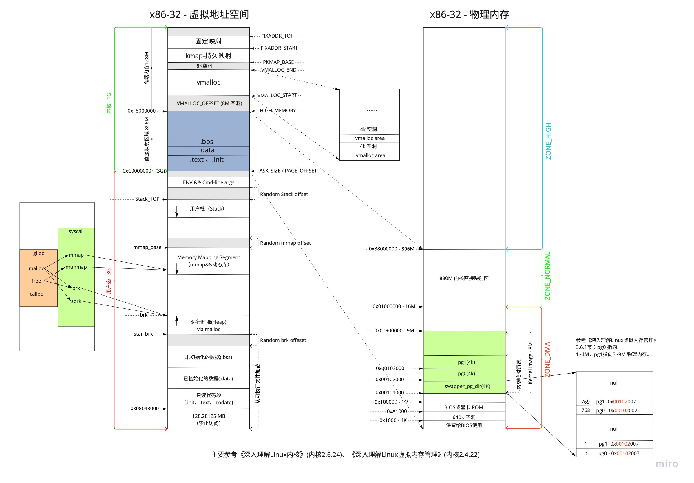
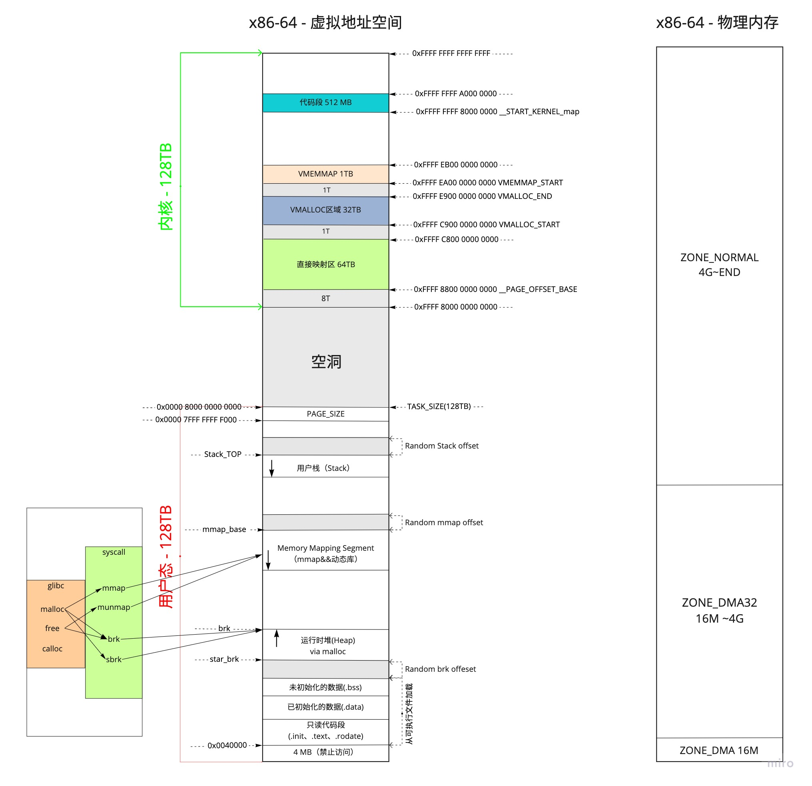

# Linux内核 x86-32位虚拟地址空间



`Linux`内核一般将处理器的虚拟地址空间划分为两个部分。底部比较大的部分用于用户进程，顶部则专用于内核。虽然（在两个用户进程之间的）上下文切换期间会改变下半部分，**但虚拟地址空间的内核部分总是保持不变**。

x86-32系统中`Linux`将虚拟地址空间划分为：`0~3G`为用户空间，`3~4G`为内核空间

## 用户地址空间

### 保留区 - 0x08048000

位于虚拟地址空间的最低部分，未赋予物理地址。任何对它的引用都是非法的，用于捕捉使用空指针和小整型值指针引用内存的异常情况。

它并不是一个单一的内存区域，而是对地址空间中受到操作系统保护而禁止用户进程访问的地址区域的总称。大多数操作系统中，极小的地址通常都是不允许访问的，如`NULL`。`C语言`将无效指针赋值为0也是出于这种考虑，因为0地址上正常情况下不会存放有效的可访问数据。

因为“历史原因”前面 `128.28125MB` 属于保留空间。

[On Linux, why does the text segment start at 0x08048000? What is stored below that address?](https://www.quora.com/On-Linux-why-does-the-text-segment-start-at-0x08048000-What-is-stored-below-that-address)

[Where are “the kernel stack”, “Frames for C run-time startup functions”, and “Frame for main()” in the memory layout of a program?](https://unix.stackexchange.com/questions/466389/where-are-the-kernel-stack-frames-for-c-run-time-startup-functions-and-fr)

### 代码段(text)

代码段也称正文段或文本段，通常用于存放程序执行代码(即`CPU`执行的机器指令)。一般`C语言`执行语句都编译成机器代码保存在代码段。通常代码段是可共享的，因此频繁执行的程序只需要在内存中拥有一份拷贝即可。代码段通常属于只读，以防止其他程序意外地修改其指令(对该段的写操作将导致段错误)。某些架构也允许代码段为可写，即允许修改程序。

代码段指令根据程序设计流程依次执行，对于顺序指令，只会执行一次(每个进程)；若有反复，则需使用跳转指令；若进行递归，则需要借助栈来实现。

代码段指令中包括操作码和操作对象(或对象地址引用)。若操作对象是立即数(具体数值)，将直接包含在代码中；若是局部数据，将在栈区分配空间，然后引用该数据地址；若位于`BSS`段和数据段，同样引用该数据地址。

代码段最容易受优化措施影响。

### 数据段(data)

数据段通常用于存放程序中已初始化且初值不为`0`的全局变量和静态局部变量。数据段属于静态内存分配(静态存储区)，可读可写。

数据段保存在目标文件中(在嵌入式系统里一般固化在镜像文件中)，其内容由程序初始化。例如，对于全局变量`int gVar = 10`，必须在目标文件数据段中保存`10`这个数据，然后在程序加载时复制到相应的内存。

数据段与`BSS段`的区别如下：

- `BSS段`不占用物理文件尺寸，但占用内存空间；数据段占用物理文件，也占用内存空间。对于大型数组如`int ar0[10000] = {1, 2, 3, ...}`和`int ar1[10000]`，`ar1`放在`BSS段`，只记录共有`10000*4`个字节需要初始化为`0`，而不是像`ar0`那样记录每个数据`1、2、3...`，此时`BSS`为目标文件所节省的磁盘空间相当可观。
- 当程序读取数据段的数据时，系统会出发缺页故障，从而分配相应的物理内存；当程序读取`BSS段`的数据时，内核会将其转到一个全零页面，不会发生缺页故障，也不会为其分配相应的物理内存。

运行时数据段和`BSS段`的整个区段通常称为数据区。某些资料中“数据段”指代数据段 + `BSS段` + 堆。

### BSS段

`BSS(Block Started by Symbol)`段中通常存放程序中以下符号：

- 未初始化的全局变量和静态局部变量
- 初始值为`0`的全局变量和静态局部变量(依赖于编译器实现)
- 未定义且初值不为`0`的符号(该初值即`common block`的大小)

`C语言`中，未显式初始化的静态分配变量被初始化为`0`(算术类型)或空指针(指针类型)。由于程序加载时，`BSS`会被操作系统清零，所以未赋初值或初值为`0`的全局变量都在`BSS`中。`BSS段`仅为未初始化的静态分配变量预留位置，在目标文件中并不占据空间，这样可减少目标文件体积。但程序运行时需为变量分配内存空间，故目标文件必须记录所有未初始化的静态分配变量大小总和(通过`start_bss`和`end_bss`地址写入机器代码)。当加载器(`loader`)加载程序时，将为`BSS段`分配的内存初始化为0。

> 注意，尽管均放置于`BSS段`，但初值为`0`的全局变量是强符号，而未初始化的全局变量是弱符号。若其他地方已定义同名的强符号(初值可能非 `0`)，则弱符号与之链接时不会引起重定义错误，但运行时的初值可能并非期望值(会被强符号覆盖)。因此，定义全局变量时，若只有本文件使用，则尽量使用`static`关键字修饰；否则需要为全局变量定义赋初值(哪怕`0`值)，保证该变量为强符号，以便链接时发现变量名冲突，而不是被未知值覆盖。

### 堆(heap)

堆用于存放进程运行时动态分配的内存段，可动态扩张或缩减。堆中内容是匿名的，不能按名字直接访问，只能通过指针间接访问。当进程调用`malloc(C)/new(C++)`等函数分配内存时，新分配的内存动态添加到堆上(扩张)；当调用`free(C)/delete(C++)`等函数释放内存时，被释放的内存从堆中剔除(缩减) 。

分配的堆内存是经过字节对齐的空间，以适合原子操作。堆管理器通过链表管理每个申请的内存，由于堆申请和释放是无序的，最终会产生内存碎片。堆内存一般由应用程序分配释放，回收的内存可供重新使用。若程序员不释放，程序结束时操作系统可能会自动回收。

堆的末端由`break`指针标识，当堆管理器需要更多内存时，可通过系统调用`brk()`和`sbrk()`来移动`break`指针以扩张堆，一般由系统自动调用。

> 【扩展阅读】栈和堆的区别
>
> ①管理方式：栈由编译器自动管理；堆由程序员控制，使用方便，但易产生内存泄露。
>
> ②生长方向：栈向低地址扩展(即”向下生长”)，是连续的内存区域；堆向高地址扩展(即”向上生长”)，是不连续的内存区域。这是由于系统用链表来存储空闲内存地址，自然不连续，而链表从低地址向高地址遍历。
>
> ③空间大小：栈顶地址和栈的最大容量由系统预先规定(通常默认`2M`或`10M`)；堆的大小则受限于计算机系统中有效的虚拟内存，`32`位`Linux`系统中堆内存可达`2.9G`空间。
>
> ④存储内容：栈在函数调用时，首先压入主调函数中下条指令(函数调用语句的下条可执行语句)的地址，然后是函数实参，然后是被调函数的局部变量。本次调用结束后，局部变量先出栈，然后是参数，最后栈顶指针指向最开始存的指令地址，程序由该点继续运行下条可执行语句。堆通常在头部用一个字节存放其大小，堆用于存储生存期与函数调用无关的数据，具体内容由程序员安排。
>
> ⑤分配方式：栈可静态分配或动态分配。静态分配由编译器完成，如局部变量的分配。动态分配由`alloca`函数在栈上申请空间，用完后自动释放。堆只能动态分配且手工释放。
>
> ⑥分配效率：栈由计算机底层提供支持：分配专门的寄存器存放栈地址，压栈出栈由专门的指令执行，因此效率较高。堆由函数库提供，机制复杂，效率比栈低得多。`Windows`系统中`VirtualAlloc`可直接在进程地址空间中分配一块内存，快速且灵活。
>
> ⑦分配后系统响应：只要栈剩余空间大于所申请空间，系统将为程序提供内存，否则报告异常提示栈溢出。
>
> 操作系统为堆维护一个记录空闲内存地址的链表。当系统收到程序的内存分配申请时，会遍历该链表寻找第一个空间大于所申请空间的堆结点，然后将该结点从空闲结点链表中删除，并将该结点空间分配给程序。若无足够大小的空间(可能由于内存碎片太多)，有可能调用系统功能去增加程序数据段的内存空间，以便有机会分到足够大小的内存，然后进行返回。，大多数系统会在该内存空间首地址处记录本次分配的内存大小，供后续的释放函数(如`free/delete`)正确释放本内存空间。
>
> 此外，由于找到的堆结点大小不一定正好等于申请的大小，系统会自动将多余的部分重新放入空闲链表中。
>
> ⑧碎片问题：栈不会存在碎片问题，因为栈是先进后出的队列，内存块弹出栈之前，在其上面的后进的栈内容已弹出。而频繁申请释放操作会造成堆内存空间的不连续，从而造成大量碎片，使程序效率降低。
>
> 可见，堆容易造成内存碎片；由于没有专门的系统支持，效率很低；由于可能引发用户态和内核态切换，内存申请的代价更为昂贵。所以栈在程序中应用最广泛，函数调用也利用栈来完成，调用过程中的参数、返回地址、栈基指针和局部变量等都采用栈的方式存放。所以，建议尽量使用栈，仅在分配大量或大块内存空间时使用堆。
>
> 使用栈和堆时应避免越界发生，否则可能程序崩溃或破坏程序堆、栈结构，产生意想不到的后果。

### 内存映射段(mmap)

此处，内核将硬盘文件的内容直接映射到内存, 任何应用程序都可通过`Linux`的`mmap()`系统调用或`Windows`的`CreateFileMapping()/MapViewOfFile()`请求这种映射。内存映射是一种方便高效的文件`I/O`方式， 因而被用于装载动态共享库。用户也可创建匿名内存映射，该映射没有对应的文件, 可用于存放程序数据。在`Linux`中，若通过`malloc()`请求一大块内存，`C运行库`将创建一个匿名内存映射，而不使用堆内存。”大块” 意味着比阈值 `MMAP_THRESHOLD`还大，缺省为`128KB`，可通过`mallopt()`调整。

**PS: 内存映射端在Linux 2.6.7以前是向上增长的，在2.6.7之后改为向下增长**。

更多可以查看`《深入理解操作系统内核》4.2.1章节`

### 栈(stack)

栈又称堆栈，由编译器自动分配释放。堆栈主要有三个用途：

- 为函数内部声明的非静态局部变量(`C语言`中称“自动变量”)提供存储空间。

- 记录函数调用过程相关的维护性信息，称为栈帧(`Stack Frame`)或过程活动记录(`Procedure Activation Record`)。它包括函数返回地址，不适合装入寄存器的函数参数及一些寄存器值的保存。除递归调用外，堆栈并非必需。**因为编译时可获知局部变量，参数和返回地址所需空间**，并将其分配于BSS段。
  临时存储区，用于暂存长算术表达式部分计算结果或`alloca()`函数分配的栈内内存。

- 持续地重用栈空间有助于使活跃的栈内存保持在CPU缓存中，从而加速访问。进程中的每个线程都有属于自己的栈。向栈中不断压入数据时，若超出其容量就会耗尽栈对应的内存区域，从而触发一个页错误。此时若栈的大小低于堆栈最大值`RLIMIT_STACK`(通常是8M)，则栈会动态增长，程序继续运行。映射的栈区扩展到所需大小后，不再收缩。

`Linux`中`ulimit -s`命令可查看和设置堆栈最大值，当程序使用的堆栈超过该值时, 发生栈溢出(`Stack Overflow`)，程序收到一个段错误(`Segmentation Fault`)。注意，调高堆栈容量可能会增加内存开销和启动时间。

堆栈既可向下增长(向内存低地址)也可向上增长, 这依赖于具体的实现。本文所述堆栈向下增长。

堆栈的大小在运行时由内核动态调整。

## 内核地址空间

### 直接映射区（896M）

所谓的直接映射区，就是这一块空间是连续的，和物理内存是非常简单的映射关系，其实就是虚拟内存地址减去 `3G`，就得到物理内存的位置。

```c
__pa(vaddr) 返回与虚拟地址 vaddr 相关的物理地址；
__va(paddr) 则计算出对应于物理地址 paddr 的虚拟地址。

// PAGE_OFFSET => 3G  0x0c0000000
#define __va(x)      ((void *)((unsigned long)(x)+PAGE_OFFSET))
#define __pa(x)    __phys_addr((unsigned long)(x))
#define __phys_addr(x)    __phys_addr_nodebug(x)
#define __phys_addr_nodebug(x)  ((x) - PAGE_OFFSET)
```

这 `896M` 还需要仔细分解。在系统启动的时候，物理内存的前 `1M` 已经被占用了，从 `1M` 开始加载内核代码段，然后就是内核的`全局变量`、`BSS` 等，也是 `ELF` 里面涵盖的。这样内核的代码段，全局变量，`BSS` 也就会被映射到 `3G` 后的虚拟地址空间里面。具体的物理内存布局可以查看。

```sh
cat /proc/iomem
.....

00100000-bffdbfff : System RAM
  01000000-01a02fff : Kernel code
  01a03000-021241bf : Kernel data
  02573000-02611fff : Kernel bss
  25000000-34ffffff : Crash kernel

.....
```

在内核运行的过程中，如果碰到系统调用创建进程，会创建 `task_struct` 这样的实例，内核的进程管理代码会将实例创建在 `3G` 至 `3G+896M` 的虚拟空间中，当然也会被放在物理内存里面的前 `896M` 里面，相应的页表也会被创建。

在内核运行的过程中，会涉及内核栈的分配，内核的进程管理的代码会将内核栈创建在 `3G` 至 `3G+896M` 的虚拟空间中，当然也就会被放在物理内存里面的前 `896M` 里面，相应的页表也会被创建。

### 高端内存 - HIGH_MEMORY

`x86-32`下特有的（`x64下没有这个东西`），因为内核虚拟空间只有`1G`无法管理全部的内存空间。

> 目前现实中，64位Linux内核不存在高端内存，因为64位内核可以支持超过512GB内存。若机器安装的物理内存超过内核地址空间范围，就会存在高端内存。

当内核想访问高于`896MB`物理地址内存时，从`0xF8000000 ~ 0xFFFFFFFF`地址空间范围内找一段相应大小空闲的逻辑地址空间，借用一会。借用这段逻辑地址空间，建立映射到想访问的那段物理内存（即填充内核`PTE`页面表），临时用一会，用完后归还。这样别人也可以借用这段地址空间访问其他物理内存，实现了使用有限的地址空间，访问所有所有物理内存。

> 用户进程能访问多少物理内存？内核代码能访问多少物理内存？
>
> 32位系统用户进程最大可以访问3GB，内核代码可以访问所有物理内存。64位系统用户进程最大可以访问超过512GB，内核代码可以访问所有物理内存。

### VMALLOC_OFFSET

系统会在`low memory`和`VMALLOC`区域留8M，防止访问越界。因此假如理论上`vmalloc size`有`300M`，实际可用的也是只有`292M`。

```c
include/asm-x86/pgtable_32.h 
#define VMALLOC_OFFSET (8*1024*1024)
```

这个缺口可用作针对任何内核故障的保护措施。如果访问越界地址（即无意地访问物理上不存在的内存区），则访问失败并生成一个异常，报告该错误。如果`vmalloc`区域紧接着直接映射，那么访问将成功而不会注意到错误。在稳定运行的情况下，肯定不需要这个额外的保护措施，但它对开发尚未成熟的新内核特性是有用的。

>《深入理解Linux内核》3.4

### VMALLOC

虚拟内存中连续、但物理内存中不连续的内存区，可以在`vmalloc`区域分配。内核自身会试图尽力避免非连续的物理地址，内核通常会成功，因为大部分大的内存块都在启动时分配给内核，那时内存的碎片尚不严重。但在已经运行了很长时间的系统上，在内核需要物理内存时，就可能出现可用空间不连续的情况。此类情况，主要出现在动态加载模块时。

```go
include/asm-x86/pgtable_32.h 
#define VMALLOC_START (((unsigned long) high_memory + \ 
 2*VMALLOC_OFFSET-1) & ~(VMALLOC_OFFSET-1)) 
#ifdef CONFIG_HIGHMEM 
#define VMALLOC_END (PKMAP_BASE-2*PAGE_SIZE) 
#else 
#define VMALLOC_END (FIXADDR_START-2*PAGE_SIZE) 
#endif
```

`VMALLOC_START` 到 `VMALLOC_END` 之间称为内核动态映射空间，也即内核想像用户态进程一样 `malloc` 申请内存，在内核里面可以使用 `vmalloc`，映射关系放在专门给内核自己用的页表里面。

使用`vmalloc`的最著名的实例是内核对模块的实现。因为模块可能在任何时候加载，如果模块数据比较多，那么无法保证有足够的连续内存可用，特别是在系统已经运行了比较长时间的情况下。如果能够用小块内存拼接出足够的内存，那么使用`vmalloc`可以规避该问题。内核中还有大约`400`处地方调用了`vmalloc`，特别是在设备和声音驱动程序中。

因为用于`vmalloc`的内存页总是必须映射在内核地址空间中，因此使用`ZONE_HIGHMEM`内存域的页要优于其他内存域。这使得内核可以节省更宝贵的较低端内存域，而又不会带来额外的坏处。因此，`vmalloc`（连同其他映射函数在`3.5.8节`讨论）是内核出于自身的目的（并非因为用户空间应用程序）使用高端内存页的少数情形之一。

> 《深入理解Linux内核》3.4

### 持久映射

...

# x86-64位虚拟地址空间




## 参考文章

- https://fanlv.wiki/2021/07/25/linux-mem/
