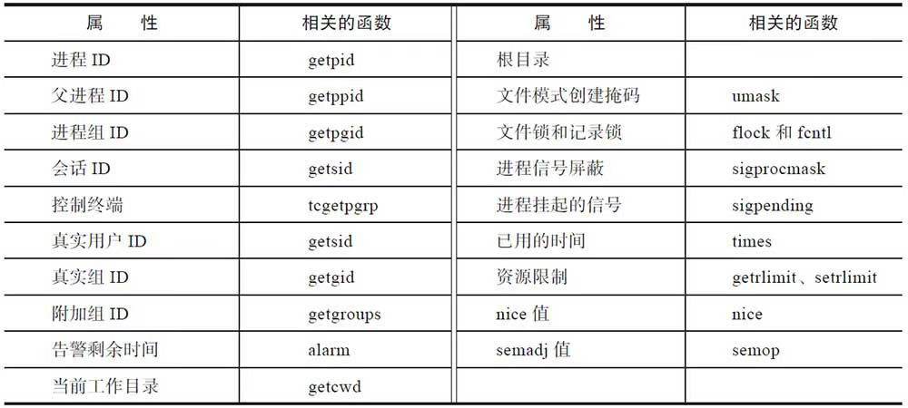

# 进程控制

每个进程都有自己唯一的标识：进程ID，也有自己的生命周期。一个典型的进程的生命周期如下图所示：


## 进程ID

Linux下每个进程都会有一个非负整数表示的唯一进程ID，简称pid。Linux提供了getpid函数来获取进程的pid，同时还提供了getppid函数来获取父进程的pid，相关接口定义如下：

```c
#include <sys/types.h>
 #include <unistd.h>
 pid_t getpid(void);
 pid_t getppid(void);
```

每个进程都有自己的父进程，父进程又会有自己的父进程，最终都会追溯到1号进程即init进程。这就决定了操作系统上所有的进程必然会组成树状结构，就像一个家族的家谱一样。可以通过`pstree`的命令来查看进程的家族树。

procfs文件系统会在/proc下为每个进程创建一个目录，名字是该进程的pid。目录下有很多文件，用于记录进程的运行情况和统计信息等。

Linux分配进程ID的算法不同于给进程分配文件描述符的最小可用算法，它采用了延迟重用的算法，即分配给新创建进程的ID尽量不与最近终止进程的ID重复，这样就可以防止将新创建的进程误判为使用相同进程ID的已经退出的进程。

内核采用的方法如下：

1. 位图记录进程ID的分配情况（0为可用，1为已占用）。
2. 将上次分配的进程ID记录到last_pid中，分配进程ID时，从last_pid+1开始找起，从位图中寻找可用的ID。
3. 如果找到位图集合的最后一位仍不可用，则回滚到位图集合的起始位置，从300位置开始找。
   - 内核在kernel/pid.c文件中定义了RESERVED_PIDS，其值是300，300以下的pid会被系统占用，而不能分配给用户进程。

位图的大小直接决定了系统允许同时存在的进程的最大个数，这个最大个数在系统中称为pid_max。

Linux系统下可以通过procfs或sysctl命令来查看pid_max的值：

```sh
$ cat /proc/sys/kernel/pid_max
4194304
$ sysctl kernel.pid_max
kernel.pid_max = 4194304
```

对于单线程的程序，进程ID比较好理解，就是唯一标识进程的数字。对于多线程的程序，每一个线程调用getpid函数，其返回值都是一样的，即进程的ID。

## 进程的层次

每个进程都有父进程，父进程也有父进程，这就形成了一个以init进程为根的家族树。除此以外，进程还有其他层次关系：进程、进程组和会话。

进程组和会话在进程之间形成了两级的层次：进程组是一组相关进程的集合，会话是一组相关进程组的集合。

一个进程会有如下ID：

- PID：进程的唯一标识。对于多线程的进程而言，所有线程调用getpid函数会返回相同的值。
- PGID：进程组ID。每个进程都会有进程组ID，表示该进程所属的进程组。默认情况下新创建的进程会继承父进程的进程组ID
- SID：会话ID。每个进程也都有会话ID。默认情况下，新创建的进程会继承父进程的会话ID。

可以调用如下指令来查看所有进程的层次关系：

```sh
ps -ejH
ps axjf
```

对于进程而言，可以通过如下函数调用来获取其进程组ID和会话ID。

```c
#include <unistd.h>
pid_t getpgrp(void);
pid_t getsid(pid_t pid);
```

进程组和会话是为了支持shell作业控制而引入的概念。

当有新的用户登录Linux时，登录进程会为这个用户创建一个会话。用户的登录shell就是会话的首进程。会话的首进程ID会作为整个会话的ID。会话是一个或多个进程组的集合，囊括了登录用户的所有活动。

### 进程组

修改进程组ID的接口如下：

```c
#include <unistd.h>
int setpgid(pid_t pid, pid_t pgid);
```

这个函数的含义是，找到进程ID为pid的进程，将其进程组ID修改为pgid，如果pid的值为0，则表示要修改调用进程的进程组ID。该接口一般用来创建一个新的进程组。

setpgid函数有很多限制：

- pid参数必须指定为调用setpgid函数的进程或其子进程，不能随意修改不相关进程的进程组ID，如果违反这条规则，则返回-1，并置errno为ESRCH。
- pid参数可以指定调用进程的子进程，但是子进程如果已经执行了exec函数，则不能修改子进程的进程组ID。如果违反这条规则，则返回-1，并置errno为EACCESS。
- 在进程组间移动，调用进程，pid指定的进程及目标进程组必须在同一个会话之内。如果违反这条规则，则返回-1，并置errno为EPERM。
- pid指定的进程，不能是会话首进程。如果违反这条规则，则返回-1，并置errno为EPERM。

最常见的创建进程组的场景就是在shell中执行管道命令，代码如下：

```sh
cmd1 | cmd2 | cmd3
```

引入了进程组的概念，可以更方便地管理这一组进程了。比如这项工作放弃了，不必向每个进程一一发送信号，可以直接将信号发送给进程组，进程组内的所有进程都会收到该信号。

前文曾提到过，子进程一旦执行exec，父进程就无法调用setpgid函数来设置子进程的进程组ID了，这条规则会影响shell的作业控制。出于保险的考虑，一般父进程在调用fork创建子进程后，会调用setpgid函数设置子进程的进程组ID，同时子进程也要调用setpgid函数来设置自身的进程组ID。这两次调用有一次是多余的，但是这样做能够保证无论是父进程先执行，还是子进程先执行，子进程一定已经进入了指定的进程组中。由于fork之后，父子进程的执行顺序是不确定的，因此如果不这样做，就会造成在一定的时间窗口内，无法确定子进程是否进入了相应的进程组。

用户在shell中可以同时执行多个命令。对于耗时很久的命令（如编译大型工程），用户不必傻傻等待命令运行完毕才执行下一个命令。用户在执行命令时，可以在命令的结尾添加“&”符号，表示将命令放入后台执行。这样该命令对应的进程组即为后台进程组。在任意时刻，可能同时存在多个后台进程组，但是不管什么时候都只能有一个前台进程组。只有在前台进程组中进程才能在控制终端读取输入。当用户在终端输入信号生成终端字符（如ctrl+c、ctrl+z、ctr+\等）时，对应的信号只会发送给前台进程组。

shell中可以存在多个进程组，无论是前台进程组还是后台进程组，它们或多或少存在一定的联系，为了更好地控制这些进程组（或者称为作业），系统引入了会话的概念。会话的意义在于将很多的工作囊括在一个终端，选取其中一个作为前台来直接接收终端的输入及信号，其他的工作则放在后台执行。

### 会话

会话是一个或多个进程组的集合。


系统提供setsid函数来创建会话，其接口定义如下：

```c
#include <unistd.h>
pid_t setsid(void);
```

如果这个函数的调用进程不是进程组组长，那么调用该函数会发生以下事情：

1. 创建一个新会话，会话ID等于进程ID，调用进程成为会话的首进程。
2. 创建一个进程组，进程组ID等于进程ID，调用进程成为进程组的组长。
3. 该进程没有控制终端，如果调用setsid前，该进程有控制终端，这种联系就会断掉。

调用setsid函数的进程不能是进程组的组长，否则调用会失败，返回-1，并置errno为EPERM。这个限制是比较合理的。如果允许进程组组长迁移到新的会话，而进程组的其他成员仍然在老的会话中，那么，就会出现同一个进程组的进程分属不同的会话之中的情况，这就破坏了进程组和会话的严格的层次关系了。

Linux提供了setsid命令，可以在新的会话中执行命令：

```sh
manu@manu-hacks:~$ setsid sleep 100
manu@manu-hacks:~$ ps ajxf
PPID   PID  PGID   SID TTY      TPGID STAT   UID   TIME COMMAND…
1     4469  4469  4469 ?           -1   Ss   1000   0:00 sleep 100
```

常用的调用setsid函数的场景是login和shell。除此以外创建daemon进程也要调用setsid函数。

## fork()

Linux系统下，进程可以调用fork函数来创建新的进程。调用进程为父进程，被创建的进程为子进程。

fork函数的接口定义如下：

```c
#include <unistd.h>
pid_t fork(void);
```

与普通函数不同，fork函数会返回两次。一般说来，创建两个完全相同的进程并没有太多的价值。大部分情况下，父子进程会执行不同的代码分支。fork函数的返回值就成了区分父子进程的关键。fork函数向子进程返回0，并将子进程的进程ID返给父进程。当然了，如果fork失败，该函数则返回-1，并设置errno。

所以一般而言，调用fork的程序，大多会如此处理：

```c
ret = fork();
if(ret == 0)
{
    …//此处是子进程的代码分支
}
else if(ret > 0)
{
    …//此处是父进程的代码分支
}
else
{
     …// fork失败，执行error handle
}
```

> fork可能失败。检查返回值进行正确的出错处理，是一个非常重要的习惯。设想如果fork返回-1，而程序没有判断返回值，直接将-1当成子进程的进程号，那么后面的代码执行kill（child_pid，9）就相当于执行kill（-1，9）。这会发生什么？后果是惨重的，它将杀死除了init以外的所有进程，只要它有权限。读者可以通过man 2 kill来查看kill（-1，9）的含义。

从内核2.6.32开始，在默认情况下，父进程将成为fork之后优先调度的对象。采取这种策略的原因是：fork之后，父进程在CPU中处于活跃的状态，并且其内存管理信息也被置于硬件内存管理单元的转译后备缓冲器（TLB），所以先调度父进程能提升性能。

从2.6.24起，Linux采用完全公平调度（Completely Fair Scheduler，CFS）。用户创建的普通进程，都采用CFS调度策略。对于CFS调度策略，procfs提供了如下控制选项：

 ```sh
 /proc/sys/kernel/sched_child_runs_first
 ```

该值默认是0，表示父进程优先获得调度。如果将该值改成1，那么子进程会优先获得调度。

POSIX标准和Linux都没有保证会优先调度父进程。因此在应用中，决不能对父子进程的执行顺序做任何的假设。如果确实需要某一特定执行的顺序，那么需要使用进程间同步的手段。

### fork之后父子进程的内存关系

fork之后的子进程完全拷贝了父进程的地址空间，包括栈、堆、代码段等。

Linux提供了execve系统调用，构建在该系统调用之上，glibc提供了exec系列函数。这个系列函数会丢弃现存的程序代码段，并构建新的数据段、栈及堆。调用fork之后，子进程几乎总是通过调用exec系列函数，来执行新的程序。

在这种背景下，fork时子进程完全拷贝父进程的数据段、栈和堆的做法是不明智的，因为接下来的exec系列函数会毫不留情地抛弃刚刚辛苦拷贝的内存。为了解决这个问题，Linux引入了**写时拷贝（copy-on-write）**的技术。

写时拷贝是指子进程的页表项指向与父进程相同的物理内存页，这样只拷贝父进程的页表项就可以了，当然要把这些页面标记成只读。如果父子进程都不修改内存的内容，大家便相安无事，共用一份物理内存页。但是一旦父子进程中有任何一方尝试修改，就会引发缺页异常（page fault）。此时，内核会尝试为该页面创建一个新的物理页面，并将内容真正地复制到新的物理页面中，让父子进程真正地各自拥有自己的物理内存页，然后将页表中相应的表项标记为可写。


对于没有修改的页面，内核并没有真正地复制物理内存页，仅仅是复制了父进程的页表。这种机制的引入提升了fork的性能，从而使内核可以快速地创建一个新的进程。

从内核代码层面来讲，其调用关系如下图所示：


Linux的内存管理使用的是四级页表，从4级页表的名字便可以推断出上述函数的作用：


在最后的copy_one_pte函数中有如下代码：

```c
   /*如果是写时拷贝，那么无论是初始页表，还是拷贝的页表，都设置了写保护
    *后面无论父子进程，修改页表对应位置的内存时，都会触发page fault
    */
    if (is_cow_mapping(vm_flags)) {
        ptep_set_wrprotect(src_mm, addr, src_pte);
        pte = pte_wrprotect(pte);
    }
```

该代码将页表设置成写保护，父子进程中任意一个进程尝试修改写保护的页面时，都会引发缺页中断，内核会走向do_wp_page函数，该函数会负责创建副本，即真正的拷贝。

写时拷贝技术极大地提升了fork的性能，在一定程度上让vfork成为了鸡肋。

### fork之后父子进程与文件的关系

执行fork函数，内核会复制父进程所有的文件描述符。对于父进程打开的所有文件，子进程也是可以操作的。

对于read函数，父子进程共用了一套文件偏移量。写文件也是一样，如果fork之前打开了某文件，之后父子进程写入同一个文件描述符而又不采取任何同步的手段，那么就会因为共享文件偏移量而使输出相互混合，不可阅读。

文件描述符还有一个文件描述符标志（file descriptor flag）。目前只定义了一个标志位：FD_CLOSEXEC，这是close_on_exec标志位。细心阅读open函数手册也会发现，open函数也有一个类似的标志位，即O_CLOSEXEC，该标志位也是用于设置文件描述符标志的。

那么这个标志位到底有什么作用呢？如果文件描述符中将这个标志位置位，那么调用exec时会自动关闭对应的文件。

可是为什么需要这个标志位呢？主要是出于安全的考虑。

对于fork之后子进程执行exec这种场景，如果子进程可以操作父进程打开的文件，就会带来严重的安全隐患。一般来讲，调用exec的子进程时，因为它会另起炉灶，因此父进程打开的文件描述符也应该一并关闭，但事实上内核并没有主动这样做。

为了解决这个问题，Linux引入了close on exec机制。设置了FD_CLOSEXEC标志位的文件，在子进程调用exec家族函数时会将相应的文件关闭。而设置该标志位的方法有两种：

- open时，带上O_CLOSEXEC标志位。
- open时如果未设置，那就在后面调用fcntl函数的F_SETFD操作来设置。

建议使用第一种方法。原因是第二种方法在某些时序条件下并不那么绝对的安全。

### 文件描述符复制的内核实现

CLONE_FILES标志位用来控制是否共享父进程的文件描述符。如果该标志位置位，则表示不必费劲复制一份父进程的文件描述符了，增加引用计数，直接共用一份就可以了。对于vfork函数和创建线程的pthread_create函数来说都是如此。但是fork函数却不同，调用fork函数时，该标志位为0，表示需要为子进程拷贝一份父进程的文件描述符。

父子进程之间拷贝的是struct file的指针，而不是struct file的实例，父子进程的struct file类型指针，都指向同一个struct file实例。

fork之后，父子进程的文件描述符关系：


下面来看看struct file成员变量：

```c
struct file{
    ...
    unsigned int    f_flags
    fmode_t         f_mode
    loff_t          f_pos;/*文件位置指针的当前值，即文件偏移量*/
    ...
}
```

就不难理解父子进程是如何共享文件偏移量的了，那是因为父子进程的指针都指向了同一个struct file结构体。

### 进程的创建之vfork()

在早期的实现中，fork没有实现写时拷贝机制，而是直接对父进程的数据段、堆和栈进行完全拷贝，效率十分低下。很多程序在fork一个子进程后，会紧接着执行exec家族函数，这更是一种浪费。所以BSD引入了vfork。既然fork之后会执行exec函数，拷贝父进程的内存数据就变成了一种无意义的行为，所以引入的vfork压根就不会拷贝父进程的内存数据，而是直接共享。再后来Linux引入了写时拷贝的机制，其效率提高了很多，这样一来，vfork其实就可以退出历史舞台了。除了一些需要将性能优化到极致的场景，大部分情况下不需要再使用vfork函数了。

vfork会创建一个子进程，该子进程会共享父进程的内存数据，而且系统将保证子进程先于父进程获得调度。子进程也会共享父进程的地址空间，而父进程将被一直挂起，直到子进程退出或执行exec。

注意，vfork之后，子进程如果返回，则不要调用return，而应该使用`_exit`函数。如果使用return，就会出现诡异的错误。

调用子进程，如果使用return返回，就意味着main函数返回了，因为栈是父子进程共享的，所以程序的函数栈发生了变化。main函数return之后，通常会调用exit系的函数，父进程收到子进程的exit之后，就会开始从vfork返回，但是这时整个main函数的栈都已经不复存在了，所以父进程压根无法执行。于是会返回一个诡异的栈地址，对于在某些内核版本中，进程会直接报栈错误然后退出，但是在某些内核版本中，有可能就会再次进出main，于是进入一个无限循环，直到vfork返回错误。笔者的Ubuntu版本就是后者。

一般来说，vfork创建的子进程会执行exec，执行完exec后应该调用`_exit`返回。注意是`_exit`而不是exit。因为exit会导致父进程stdio缓冲区的冲刷和关闭。

### daemon进程的创建

daemon进程又被称为守护进程，一般来说它有以下两个特点：

- 生命周期很长，一旦启动，正常情况下不会终止，一直运行到系统退出。但凡事无绝对：daemon进程其实也是可以停止的，如很多daemon提供了stop命令，执行stop命令就可以终止daemon，或者通过发送信号将其杀死，又或者因为daemon进程代码存在bug而异常退出。这些退出一般都是由手工操作或因异常引发的。
- 在后台执行，并且不与任何控制终端相关联。即使daemon进程是从终端命令行启动的，终端相关的信号如SIGINT、SIGQUIT和SIGTSTP，以及关闭终端，都不会影响到daemon进程的继续执行。

习惯上daemon进程的名字通常以d结尾，如sshd、rsyslogd等。但这仅仅是习惯，并非一定要如此。

一般来讲，创建一个daemon进程的步骤被概括地称为double-fork magic。主要有如下步骤：

1. 执行fork（）函数，父进程退出，子进程继续。执行这一步，原因有二：
   1. 父进程有可能是进程组的组长（在命令行启动的情况下），从而不能够执行后面要执行的setsid函数，子进程继承了父进程的进程组ID，并且拥有自己的进程ID，一定不会是进程组的组长，所以子进程一定可以执行后面要执行的setsid函数。
   2. 如果daemon是从终端命令行启动的，那么父进程退出会被shell检测到，shell会显示shell提示符，让子进程在后台执行。
2. 子进程执行如下三个步骤，以摆脱与环境的关系
   1. 修改进程的当前目录为根目录（/）。这样做是有原因的，因为daemon一直在运行，如果当前工作路径上包含有根文件系统以外的其他文件系统，那么这些文件系统将无法卸载。因此，常规是将当前工作目录切换成根目录，当然也可以是其他目录，只要确保该目录所在的文件系统不会被卸载即可。
   2. 调用setsid函数。这个函数的目的是切断与控制终端的所有关系，并且创建一个新的会话。这一步比较关键，因为这一步确保了子进程不再归属于控制终端所关联的会话。因此无论终端是否发送SIGINT、SIGQUIT或SIGTSTP信号，也无论终端是否断开，都与要创建的daemon进程无关，不会影响到daemon进程的继续执行。
   3. 设置文件模式创建掩码为0。`umask(0)`。这一步的目的是让daemon进程创建文件的权限属性与shell脱离关系。因为默认情况下，进程的umask来源于父进程shell的umask。如果不执行umask（0），那么父进程shell的umask就会影响到daemon进程的umask。如果用户改变了shell的umask，那么也就相当于改变了daemon的umask，就会造成daemon进程每次执行的umask信息可能会不一致。
3. 再次执行fork，父进程退出，子进程继续。
   1. 再执行一次fork的原因：daemon进程有可能会打开一个终端设备。这个打开的终端设备是否会成为daemon进程的控制终端，取决于两点：1 daemon进程是不是会话的首进程。2 系统实现。（BSD风格的实现不会成为daemon进程的控制终端，但是POSIX标准说这由具体实现来决定）。为了确保万无一失，只有确保daemon进程不是会话的首进程，才能保证打开的终端设备不会自动成为控制终端。因此，不得不执行第二次fork，fork之后，父进程退出，子进程继续。这时，子进程不再是会话的首进程，也不是进程组的首进程了。
4. 关闭标准输入（stdin）、标准输出（stdout）和标准错误（stderr）
   1. 因为文件描述符0、1和2指向的就是控制终端。daemon进程已经不再与任意控制终端相关联，因此这三者都没有意义。一般来讲，关闭了之后，会打开/dev/null，并执行dup2函数，将0、1和2重定向到/dev/null。这个重定向是有意义的，防止了后面的程序在文件描述符0、1和2上执行I/O库函数而导致报错。

上述步骤比较繁琐，对于C语言而言，glibc提供了daemon函数，从而帮我们将程序转化成daemon进程。

```c
#include <unistd.h>
int daemon(int nochdir, int noclose);
```

该函数有两个入参，分别控制一种行为，具体如下。

1. 其中的nochdir，用来控制是否将当前工作目录切换到根目录。
   1. 0：将当前工作目录切换到/。
   2. 1：保持当前工作目录不变。
2. noclose，用来控制是否将标准输入、标准输出和标准错误重定向到/dev/null。
   1. 0：将标准输入、标准输出和标准错误重定向到/dev/null。
   2. 1：保持标准输入、标准输出和标准错误不变。

一般情况下，这两个入参都要为0。

glibc的daemon函数做的事情，和前面讨论的大体一致，但是做得并不彻底，没有执行第二次的fork。

## 进程的终止

在不考虑线程的情况下，进程的退出有以下5种方式。

正常退出有3种：

- 从main函数return返回

- 调用exit

- 调用_exit

异常退出有两种：

- 调用abort

- 接收到信号，由信号终止

### _exit函数

_exit函数的接口定义如下：

```c
#include <unistd.h>
void _exit(int status);
```

_exit函数中status参数定义了进程的终止状态，父进程可以通过wait（）来获取该状态值。需要注意的是返回值，虽然status是int型，但是仅有低8位可以被父进程所用。所以写exit（-1）结束进程时，在终端执行“$？”会发现返回值是255。

用户调用_exit函数，本质上是调用**exit_group**系统调用。

### exit函数

exit函数更常见一些，其接口定义如下：

```c
#include <stdlib.h>
void exit(int status);
```

exit（）函数的最后也会调用`_exit（）`函数，但是exit在调用_exit之前，还做了其他工作：

1. 执行用户通过调用atexit函数或on_exit定义的清理函数。

2. 关闭所有打开的流（stream），所有缓冲的数据均被写入（flush），通过tmpfile创建的临时文件都会被删除。
3. 调用_exit。

exit和_exit比较:


exit函数和_exit函数的不同之处:

1. exit函数会执行用户注册的清理函数。用户可以通过调用atexit（）函数或on_exit（）函数来定义清理函数。这些清理函数在调用return或调用exit时会被执行。执行顺序与函数注册的顺序相反。当进程收到致命信号而退出时，注册的清理函数不会被执行；当进程调用`_exit`退出时，注册的清理函数不会被执行；当执行到某个清理函数时，若收到致命信号或清理函数调用了`_exit（）`函数，那么该清理函数不会返回，从而导致排在后面的需要执行的清理函数都会被丢弃。
2. 其次是exit函数会冲刷（flush）标准I/O库的缓冲并关闭流。

glibc提供的很多与I/O相关的函数都提供了缓冲区，用于缓存大块数据。

缓冲有三种方式：无缓冲（`_IONBF`）、行缓冲（`_IOLBF`）和全缓冲（`_IOFBF`）。

- 无缓冲：就是没有缓冲区，每次调用stdio库函数都会立刻调用read/write系统调用。

- 行缓冲：对于输出流，收到换行符之前，一律缓冲数据，除非缓冲区满了。对于输入流，每次读取一行数据。
- 全缓冲：就是缓冲区满之前，不会调用read/write系统调用来进行读写操作。

对于后两种缓冲，可能会出现这种情况：进程退出时，缓冲区里面可能还有未冲刷的数据。如果不冲刷缓冲区，缓冲区的数据就会丢失。比如行缓冲迟迟没有等到换行符，又或者全缓冲没有等到缓冲区满。尤其是后者，很容易出现，因为glibc的缓冲区默认是8192字节。exit函数在关闭流之前，会冲刷缓冲区的数据，确保缓冲区里的数据不会丢失。

3. 存在临时文件，exit函数会负责将临时文件删除。

exit函数的最后调用了_exit（）函数，最终殊途同归，走向内核清理。

### return退出

return是一种更常见的终止进程的方法。执行return（n）等同于执行exit（n），因为调用main（）的运行时函数会将main的返回值当作exit的参数。

## 等待子进程

### 僵尸进程

进程的退出其实并没有将所有的资源完全释放，仍保留了少量的资源，比如进程的PID依然被占用着，不可被系统分配。此时的进程不可运行，事实上也没有地址空间让其运行，进程进入**僵尸进程**。

僵尸进程依然保留的资源有进程控制块task_struct、内核栈等。这些资源不释放是为了提供一些重要的信息，比如进程为何退出，是收到信号退出还是正常退出，进程退出码是多少，进程一共消耗了多少系统CPU时间，多少用户CPU时间，收到了多少信号，发生了多少次上下文切换，最大内存驻留集是多少，产生多少缺页中断？等等。这些信息，就像墓志铭，总结了进程的一生。

如果没有这个僵尸状态，进程的这些信息也会随之流逝，系统也将再也没有机会获知该进程的相关信息了。因此进程退出后，会保留少量的资源，等待父进程前来收集这些信息。一旦父进程收集了这些信息之后（通过调用下面提到的wait/waitpid等函数），这些残存的资源完成了它的使命，就可以释放了，进程就脱离僵尸状态，彻底消失了。

从上面的讨论可以看出，制造一个僵尸进程是一件很容易的事情，只要父进程调用fork创建子进程，子进程退出后，父进程如果不调用wait或waitpid来获取子进程的退出信息，子进程就会沦为僵尸进程。

ps命令输出的进程状态Z，就表示进程处于僵尸状态，另外procfs提供的status信息中的State给出的值是Z（zombie），也表明进程处于僵尸状态。

进程一旦进入僵尸状态，就进入了一种刀枪不入的状态，“杀人不眨眼”的kill-9也无能为力，因为谁也没有办法杀死一个已经死去的进程。

清除僵尸进程有以下两种方法：

- 父进程调用wait函数，为子进程“收尸”。

- 父进程退出，init进程会为子进程“收尸”。

系统不希望大量进程长期处于僵尸状态，因为会浪费系统资源。除了少量的内存资源外，比较重要的是进程ID。僵尸进程并没有将自己的进程ID归还给系统，而是依然占有这个进程ID，因此系统不能将该ID分配给其他进程。

如果不关心子进程的退出状态，就应该将父进程对SIGCHLD的处理函数设置为SIG_IGN，或者在调用sigaction函数时设置SA_NOCLDWAIT标志位。这两者都会明确告诉子进程，父进程很“绝情”，不会为子进程“收尸”。子进程退出的时候，内核会检查父进程的SIGCHLD信号处理结构体是否设置了SA_NOCLDWAIT标志位，或者是否将信号处理函数显式地设为SIG_IGN。如果是，则autoreap为true，子进程发现autoreap为true也就“死心”了，不会进入僵尸状态，而是调用**release_task**函数“自行了断”了。

### 等待子进程之wait（）

Linux提供了wait（）函数来获取子进程的退出状态：

```c
include <sys/wait.h>
pid_t wait(int *status);
```

成功时，返回已退出子进程的进程ID；失败时，则返回-1并设置errno。

子进程退出和父进程调用wait（）函数来获取子进程的退出状态在时间上是独立的事件，因此会出现以下两种情况：

1. 子进程先退出，父进程后调用wait（）函数。子进程几乎已经销毁了自己所有的资源，只留下少量的信息，苦苦等待父进程来“收尸”。当父进程调用wait（）函数的时候，父进程获取到子进程的状态信息，wait函数立刻返回。
2. 父进程先调用wait（）函数，子进程后退出。父进程先调用wait（）函数，调用时并无子进程退出，该函数调用就会陷入阻塞状态，直到某个子进程退出。

wait（）函数等待的是任意一个子进程，任何一个子进程退出，都可以让其返回。当多个子进程都处于僵尸状态，wait（）函数获取到其中一个子进程的信息后立刻返回。由于wait（）函数不会接受pid_t类型的入参，所以它无法明确地等待特定的子进程。

wait（）函数返回有三种可能性：

1. 等到了子进程退出，获取其退出信息，返回子进程的进程ID。
2. 等待过程中，收到了信号，信号打断了系统调用，并且注册信号处理函数时并没有设置SA_RESTART标志位，系统调用不会被重启，wait（）函数返回-1，并且将errno设置为EINTR。
3. 已经成功地等待了所有子进程，没有子进程的退出信息需要接收，在这种情况下，wait（）函数返回-1，errno为ECHILD。

通过上面的讨论，可以看出wait（）函数存在一定的局限性：

1. 不能等待特定的子进程。如果进程存在多个子进程，而它只想获取某个子进程的退出状态，并不关心其他子进程的退出状态，此时wait（）只能一一等待，通过查看返回值来判断是否为关心的子进程。
2. 如果不存在子进程退出，wait（）只能阻塞。有些时候，仅仅是想尝试获取退出子进程的退出状态，如果不存在子进程退出就立刻返回，不需要阻塞等待，类似于trywait的概念。wait（）函数没有提供trywait的接口。
3. wait（）函数只能发现子进程的终止事件，如果子进程因某信号而停止，或者停止的子进程收到SIGCONT信号又恢复执行，这些事件wait（）函数是无法获知的。换言之，wait（）能够探知子进程的死亡，却不能探知子进程的昏迷（暂停），也无法探知子进程从昏迷中苏醒（恢复执行）。

### 等待子进程之waitpid（）

waitpid（）函数接口如下：

```c
 #include <sys/wait.h>
 pid_t waitpid(pid_t pid, int *status, int options);
```

waitpid（）与wait（）函数相同的地方：

1. 返回值的含义相同，都是终止子进程或因信号停止或因信号恢复而执行的子进程的进程ID。
2. status的含义相同，都是用来记录子进程的相关事件。

waitpid函数可以明确指定要等待哪一个子进程的退出（以及停止和恢复执行）。事实上，扩展的功能不仅仅如此：

- pid＞0：表示等待进程ID为pid的子进程，也就是上文提到的精确打击的对象。

- pid＝0：表示等待与调用进程同一个进程组的任意子进程；因为子进程可以设置自己的进程组，所以某些子进程不一定和父进程归属于同一个进程组，这样的子进程，waitpid函数就毫不关心了。

- pid＝-1：表示等待任意子进程，同wait类似。waitpid（-1，&status，0）与wait（&status）完全等价。

- pid＜-1：等待所有子进程中，进程组ID与pid绝对值相等的所有子进程

内核之中，wait函数和waitpid函数调用的都是wait4系统调用。

waitpid函数的第三个参数options是一个位掩码（bit mask），可以同时存在多个标志。当options没有设置任何标志位时，其行为与wait类似，即阻塞等待与pid匹配的子进程退出。

options的标志位可以是如下标志位的组合：

- WUNTRACE：除了关心终止子进程的信息，也关心那些因信号而停止的子进程信息。

- WCONTINUED：除了关心终止子进程的信息，也关心那些因收到信号而恢复执行的子进程的状态信息。

- WNOHANG：指定的子进程并未发生状态变化，立刻返回，不会阻塞。这种情况下返回值是0。如果调用进程并没有与pid匹配的子进程，则返回-1，并设置errno为ECHILD，根据返回值和errno可以区分这两种情况。

传统的wait函数只关注子进程的终止，而waitpid函数则可以通过前两个标志位来检测子进程的停止和从停止中恢复这两个事件。

Linux提供了SIGSTOP（信号值19）和SIGCONT（信号值18）两个信号，来完成暂停和恢复的动作，可以通过执行kill-SIGSTOP或kill-19来暂停一个进程的执行，通过执行kill-SIGCONT或kill-18来让一个暂停的进程恢复执行。

waitpid（）函数可以通过WUNTRACE标志位关注停止的事件，如果有子进程收到信号处于暂停状态，waitpid就可以返回。同样的道理，通过WCONTINUED标志位可以关注恢复执行的事件，如果有子进程收到SIGCONT信号而恢复执行，waitpid就可以返回。

但是上述两个事件和子进程的终止事件是并列的关系，waitpid成功返回的时候，可能是等到了子进程的终止事件，也可能是等到了暂停或恢复执行的事件。这需要通过status的值来区分。

### 等待子进程之等待状态值

无论是wait（）函数还是waitpid（）函数，都有一个status变量。这个变量是一个int型指针。可以传递NULL，表示不关心子进程的状态信息。如果不为空，则根据填充的status值，可以获取到子进程的很多信息:


### 等待子进程之waitid（）

前面提到过，waitpid函数是wait函数的超集，wait函数能干的事情，waitpid函数都能做到。但是waitpid函数的控制还是不太精确，无论用户是否关心相关子进程的终止事件，终止事件都可能会返回给用户。因此Linux提供了waitid系统调用。glibc封装了waitid系统调用从而实现了waitid函数。尽管目前普遍使用的是wait和waitpid两个函数，但是waitid函数的设计显然更加合理。

waitid函数的接口定义如下：

```c
#include <sys/wait.h>
int waitid(idtype_t idtype, id_t id,siginfo_t *infop, int options);
```

该函数的第一个入参idtype和第二个入参id用于选择用户关心的子进程。

- `idtype==P_PID`：精确打击，等待进程ID等于id的进程。
- `idtype==P_PGID`：在所有子进程中等待进程组ID等于id的进程。
- `idtype==P_ALL`：等待任意子进程，第二个参数id被忽略。

waitid函数的改进在于第四个参数options。options参数是下面标志位的按位或：

- WEXITED：等待子进程的终止事件。
- WSTOPPED：等待被信号暂停的子进程事件。
- WCONTINUED：等待先前被暂停，但是被SIGCONT信号恢复执行的子进程。

第三个参数infop本质是个返回值，系统调用负责将子进程的相关信息填充到infop指向的结构体中。如果成功获取到信息，下面的字段将会被填充：

- si_pid：子进程的进程ID，相当于wait和waitpid成功时的返回值。
- si_uid：子进程真正的用户ID。
- si_signo：该字段总被填成SIGCHLD。
- si_code：指示子进程发生的事件，该字段可能的取值是：
  - CLD_EXIT（子进程正常退出）
  - CLD_KILLED（子进程被信号杀死）
  - CLD_DUMPED（子进程被信号杀死，并且产生了core dump）
  - CLD_STOPPED（子进程被信号暂停）
  - CLD_CONTINUED（子进程被SIGCONT信号恢复执行）
  - CLD_TRAPPED（子进程被跟踪）
- si_status：status值的语义与wait函数及waitpid函数一致。

对于返回值，在两种情况下会返回0：

- 成功等到子进程的变化，并取回相应的信息。
- 设置了WNOHANG标志位，并且子进程状态无变化。

### 进程退出和等待的内核实现

Linux引入多线程之后，为了支持进程的所有线程能够整体退出，内核引入了exit_group系统调用。对于进程而言，无论是调用exit（）函数、_exit（）函数还是在main函数中return，最终都会调用**exit_group**系统调用。

对于单线程的进程，从do_exit_group直接调用do_exit就退出了。但是对于多线程的进程，如果某一个线程调用了exit_group系统调用，那么该线程在调用do_exit之前，会通过zap_other_threads函数，给每一个兄弟线程挂上一个SIGKILL信号。内核在尝试递送信号给兄弟进程时（通过get_signal_to_deliver函数），会在挂起信号中发现SIGKILL信号。内核会直接调用do_group_exit函数让该线程也退出。


在do_exit函数中，进程会释放几乎所有的资源（文件、共享内存、信号量等）。

该进程并不甘心，因为它还有两桩心愿未了：

- 作为父进程，它可能还有子进程，进程退出以后，将来谁为它的子进程“收尸”。

- 作为子进程，它需要通知它的父进程来为自己“收尸”。

这两件事情是由exit_notify来负责完成的，具体来说forget_original_parent函数和do_notify_parent函数各自负责一件事。

forget_original_parent（）。顾名思义，该函数用来给自己的子进程安排新的父进程。

给自己的子进程安排新的父进程，细分下来，是两件事情：

1. 为子进程寻找新的父进程。
2. 将子进程的父进程设置为第1步中找到的新的父亲。

为子进程寻找父进程，是由find_new_reaper（）函数完成的。如果退出的进程是多线程进程，则可以将子进程托付给自己的兄弟线程。如果没有这样的线程，就“托孤”给init进程。

为自己的子进程找到新的父亲之后，内核会遍历退出进程的所有子进程，将新的父亲设置为子进程的父亲。

进程“死”的时候，会向父进程发送信号SIGCHLD，Linux也提供了一种机制，允许父进程“死”的时候向子进程发送信号。

```c
            if (t->pdeath_signal)
                group_send_sig_info(t->pdeath_signal,
                       SEND_SIG_NOINFO, t);
```

可以通过man prctl，查看PR_SET_PDEATHSIG标志位部分。如果应用程序通过prctl函数设置了父进程“死”时要向子进程发送信号，就会执行到这部分内核代码，以通知其子进程。

接下来是第二桩未了的心愿：想办法通知父进程为自己“收尸”。

对于单线程的程序来说完成这桩心愿比较简单，但是多线程的情况就复杂些。**只有线程组的主线程才有资格通知父进程，线程组的其他线程终止的时候，不需要通知父进程，也没必要保留最后的资源并陷入僵尸态，直接调用release_task函数释放所有资源就好**。

> 为什么要这样设计？细细想来，这么做是合理的。父进程创建子进程时，只有子进程的主线程是父进程亲自创建出来的，是父进程的亲生儿子，父进程也只关心它，至于子进程调用pthread_create产生的其他线程，父进程压根就不关心。

由于父进程只认子进程的主线程，所以在线程组中，主线程一定要挺住。在用户层面，可以调用pthread_exit让主线程先“死”，但是在内核态中，主线程的task_struct一定要挺住，哪怕变成僵尸，也不能释放资源。

如果主线程率先退出了，而其他线程还在正常工作，内核又将如何处理？

```c
    else if (thread_group_leader(tsk)) {
       /*线程组组长只有在全部线程都已退出的情况下，
        *才能调用do_notify_parent通知父进程*/
        autoreap = thread_group_empty(tsk) &&
        do_notify_parent(tsk, tsk->exit_signal);
    } else {
        /*如果是线程组的非组长线程，可以立即调用release_task，
        *释放残余的资源，因为通知父进程这件事和它没有关系*/
        autoreap = true;
    }
```

如果退出的进程是线程组的主线程，但是线程组中还有其他线程尚未终止（thread_group_empty函数返回false），那么autoreaper就等于false，也就不会调用do_notify_parent向父进程发送信号了。

因为子进程的线程组中有其他线程还活着，因此子进程的主线程退出时不能通知父进程，错过了调用do_notify_parent的机会，那么父进程如何才能知晓子进程已经退出了呢？

```c
   leader = p->group_leader;
   if (leader != p && thread_group_empty(leader) && leader->exit_state == EXIT_ZOMBIE) {
        zap_leader = do_notify_parent(leader, leader->exit_signal);
        if (zap_leader)
            leader->exit_state = EXIT_DEAD;
    }
```

当线程组的最后一个线程退出时，如果发现：

- 该线程不是线程组的主线程。

- 线程组的主线程已经退出，且处于僵尸状态。

- 自己是最后一个线程。

同时满足这三个条件的时候，该子进程就需要冒充线程组的组长，即以子进程的主线程的身份来通知父进程。

上面讨论了一种比较少见又比较折腾的场景，正常的多线程编程应该不会如此安排。对于多线程的进程，一般情况下会等所有其他线程退出后，主线程才退出。这时，主线程会在exit_notify函数中发现自己是组长，线程组里所有成员均已退出，然后它调用do_notify_parent函数来通知父进程。

do_notify_parent是完成父子进程之间互动的主要函数。

```c
bool do_notify_parent(struct task_struct *tsk, int sig)
{
    struct siginfo info;
    unsigned long flags;
    struct sighand_struct *psig;
    bool autoreap = false;
    BUG_ON(sig == -1);
    /* do_notify_parent_cldstop should have been called instead.  */
    BUG_ON(task_is_stopped_or_traced(tsk));
    BUG_ON(!tsk->ptrace &&
            (tsk->group_leader != tsk || !thread_group_empty(tsk)));
    if (sig != SIGCHLD) {
        /*
         * This is only possible if parent == real_parent.
         * Check if it has changed security domain.
         */
        if (tsk->parent_exec_id != tsk->parent->self_exec_id)
            sig = SIGCHLD;
    }
    info.si_signo = sig;
    info.si_errno = 0;
    rcu_read_lock();
    info.si_pid = task_pid_nr_ns(tsk, tsk->parent->nsproxy->pid_ns);
    info.si_uid = __task_cred(tsk)->uid;
    rcu_read_unlock();
    info.si_utime = cputime_to_clock_t(cputime_add(tsk->utime,
                tsk->signal->utime));
    info.si_stime = cputime_to_clock_t(cputime_add(tsk->stime,
                tsk->signal->stime));
    info.si_status = tsk->exit_code & 0x7f;
    if (tsk->exit_code & 0x80)
        info.si_code = CLD_DUMPED;
    else if (tsk->exit_code & 0x7f)
        info.si_code = CLD_KILLED;
    else {
        info.si_code = CLD_EXITED;
        info.si_status = tsk->exit_code >> 8;
    }
    psig = tsk->parent->sighand;
    spin_lock_irqsave(&psig->siglock, flags);
    if (!tsk->ptrace && sig == SIGCHLD &&
            (psig->action[SIGCHLD-1].sa.sa_handler == SIG_IGN ||
             (psig->action[SIGCHLD-1].sa.sa_flags & SA_NOCLDWAIT))) {
        autoreap = true;
        if (psig->action[SIGCHLD-1].sa.sa_handler == SIG_IGN)
            sig = 0;
    }
    /*子进程向父进程发送信号*/
    if (valid_signal(sig) && sig)
        __group_send_sig_info(sig, &info, tsk->parent);
    /* 子进程尝试唤醒父进程，如果父进程正在等待其终止 */__wake_up_parent(tsk, tsk->parent);
    spin_unlock_irqrestore(&psig->siglock, flags);
    return autoreap;
}
```

父子进程之间的互动有两种方式：

- 子进程向父进程发送信号SIGCHLD。

- 子进程唤醒父进程。

#### 父子进程互动之SIGCHLD信号

当子进程退出时，会向父进程发送SIGCHLD信号。

父进程收到该信号，默认行为是置之不理。在这种情况下，子进程就会陷入僵尸状态，而这又会浪费系统资源，该状态会维持到父进程退出，子进程被init进程接管，init进程会等待僵尸进程，使僵尸进程释放资源。

如果父进程不太关心子进程的退出事件，可以采取以下办法：

- 父进程调用signal函数或sigaction函数，将SIGCHLD信号的处理函数设置为SIG_IGN。
- 父进程调用sigaction函数，设置标志位时置上SA_NOCLDWAIT位（如果不关心子进程的暂停和恢复执行，则置上SA_NOCLDSTOP位）。

从内核代码来看，如果父进程的SIGCHLD的信号处理函数为SIG_IGN或sa_flags中被置上了SA_NOCLDWAIT位，子进程运行到此处时就知道了，父进程并不关心自己的退出信息，do_notify_parent函数就会返回true。在外层的exit_notify函数发现返回值是true，就会调用release_task函数，释放残余的资源，自行了断，子进程也就不会进入僵尸状态了。

如果父进程关心子进程的退出，情况就不同了。父进程除了调用wait函数之外，还有了另外的选择，即注册SIGCHLD信号处理函数，在信号处理函数中处理子进程的退出事件。

为SIGCHLD写信号处理函数并不简单，原因是SIGCHLD是传统的不可靠信号。信号处理函数执行期间，会将引发调用的信号暂时阻塞（除非显式地指定了SA_NODEFER标志位），在这期间收到的SIGCHLD之类的传统信号，都不会排队。因此，如果在处理SIGCHLD信号时，有多个子进程退出，产生了多个SIGCHLD信号，但父进程只能收到一个。如果在信号处理函数中，只调用一次wait或waitpid，则会造成某些僵尸进程成为漏网之鱼。

正确的写法是，信号处理函数内，带着NOHANG标志位循环调用waitpid。如果返回值大于0，则表示不断等待子进程退出，返回0则表示，当前没有僵尸子进程，返回-1则表示出错，最大的可能就是errno等于ECHLD，表示所有子进程都已退出。

```c
while(waitpid(-1,&status,WNOHANG) > 0)
{
      /*此处处理返回信息*/
      continue;
}
```

#### 父子进程互动之等待队列

上一种方法可以称之为信号通知。另一种情况是父进程调用wait主动等待。如果父进程调用wait陷入阻塞，那么子进程退出时，又该如何及时唤醒父进程呢？

子进程会调用`__wake_up_parent`函数，来及时唤醒父进程。事实上，前提条件是父进程确实在等待子进程的退出。如果父进程并没有调用wait系列函数等待子进程的退出，那么，等待队列为空，子进程的`__wake_up_parent`对父进程并无任何影响。

```c
void __wake_up_parent(struct task_struct *p, struct task_struct *parent)
{
    __wake_up_sync_key(&parent->signal->wait_chldexit,
            TASK_INTERRUPTIBLE, 1, p);
}
```

父进程的进程描述符的signal结构体中有wait_childexit变量，这个变量是等待队列头。父进程调用wait系列函数时，会创建一个wait_opts结构体，并把该结构体挂入等待队列中。

```c
static long do_wait(struct wait_opts *wo)
{
    struct task_struct *tsk;
    int retval;
    trace_sched_process_wait(wo->wo_pid);
    /*挂入等待队列*/
    init_waitqueue_func_entry(&wo->child_wait, child_wait_callback);
    wo->child_wait.private = current;
    add_wait_queue(&current->signal->wait_chldexit, &wo->child_wait);
repeat:
    /**/
    wo->notask_error = -ECHILD;
    if ((wo->wo_type < PIDTYPE_MAX) &&
            (!wo->wo_pid || hlist_empty(&wo->wo_pid->tasks[wo->wo_type])))
        goto notask;
    set_current_state(TASK_INTERRUPTIBLE);
    read_lock(&tasklist_lock);
    tsk = current;
    do {
        retval = do_wait_thread(wo, tsk);
        if (retval)
            goto end;
        retval = ptrace_do_wait(wo, tsk);
        if (retval)
            goto end;
        if (wo->wo_flags & __WNOTHREAD)
            break;
    } while_each_thread(current, tsk);
    read_unlock(&tasklist_lock);
/*找了一圈，没有找到满足等待条件的的子进程，下一步的行为将取决于WNOHANG标志位
*如果将WNOHANG标志位置位，则表示不等了，直接退出，
*如果没有置位，则让出CPU，醒来后继续再找一圈*/
notask:
    retval = wo->notask_error;
    if (!retval && !(wo->wo_flags & WNOHANG)) {
        retval = -ERESTARTSYS;
        if (!signal_pending(current)) {
            schedule();
            goto repeat;
        }
    }
end:
    __set_current_state(TASK_RUNNING);
    remove_wait_queue(&current->signal->wait_chldexit, &wo->child_wait);
    return retval;
}
```

父进程先把自己设置成TASK_INTERRUPTIBLE状态，然后开始寻找满足等待条件的子进程。如果找到了，则将自己重置成TASK_RUNNING状态，欢乐返回；如果没找到，就要根据WNOHANG标志位来决定等不等待子进程。如果没有WNOHANG标志位，那么，父进程就会让出CPU资源，等待别人将它唤醒。

回到另一头，子进程退出的时候，会调用__wake_up_parent，唤醒父进程，父进程醒来以后，回到repeat，再次扫描。这样做，子进程的退出就能及时通知到父进程，从而使父进程的wait系列函数可以及时返回。

## exec家族

整个exec家族有6个函数，这些函数都是构建在execve系统调用之上的。该系统调用的作用是，**将新程序加载到进程的地址空间，丢弃旧有的程序，进程的栈、数据段、堆栈等会被新程序替换**。

基于execve系统调用的6个exec函数，接口虽然各异，实现的功能却是相同的。

### execve函数

execve函数的接口定义如下：

```c
#include <unistd.h>
int execve(const char * filename, char *const argv[],
          char *const envp[]);
```

- 参数filename是准备执行的新程序的路径名，可以是绝对路径，也可以是相对于当前工作目录的相对路径。
- 第二个参数类似于c语言main的第二个参数，事实上格式也是一样的：字符串指针组成的数组，以NULL结束。argv[0]一般对应可执行文件的文件名，也就是filename中的basename（路径名最后一个/后面的部分）。当然如果argv[0]不遵循这个约定也无妨，因为execve可以从第一个参数获取到要执行文件的路径，只要不是NULL即可。
- 第三个参数与C语言的main函数中的第三个参数envp一样，也是字符串指针数组，以NULL结束，指针指向的字符串的格式为name=value。

一般来说，execve（）函数总是紧随fork函数之后。父进程调用fork之后，子进程执行execve函数，抛弃父进程的程序段。但是也可以不执行fork，单独调用execve函数。

execve函数的返回是特殊的。如果失败，则会返回-1，但是如果成功，则永不返回，这是可以理解的。execve做的就是斩断过去，奔向新生活的事情，如果成功，自然不可能再返回来，再次执行老程序的代码。

execve返回的错误码常见的有以下几种：

- EACCESS：这个是我们最容易想到的，就是第一个参数filename，不是个普通文件，或者该文件没有赋予可执行的权限，或者目录结构中某一级目录不可搜索，或者文件所在的文件系统是以MS_NOEXEC标志挂载的。
- ENOENT：文件不存在。
- ETXTBSY：存在其他进程尝试修改filename所指代的文件。
- ENOEXEC：这个错误其实是比较高端的一种错误了，文件存在，也可以执行，但是无法执行，比如说，Windows下的可执行程序，拿到Linux下，调用execve来执行，文件的格式不对，就会返回这种错误。

### exec家族

从内核的角度来说，提供execve系统调用就足够了，但是从应用层编程的角度来讲，execve函数就并不那么好使了：

- 第一个参数必须是绝对路径或是相对于当前工作目录的相对路径。习惯在shell下工作的用户会觉得不太方便，因为日常工作都是写ls和mkdir之类命令的，没有人会写/bin/ls或/bin/mkdir。shell提供了环境变量PATH，即可执行程序的查找路径，对于位于查找路径里的可执行程序，我们不必写出完整的路径，很方便，而execve函数享受不到这个福利，因此使用不便。
- execve函数的第三个参数是环境变量指针数组，用户使用execve编程时不得不自己负责环境变量，书写大量的“key=value”，但大部分情况下并不需要定制环境变量，只需要使用当前的环境变量即可。

正是为了提供相应的便利，所以用户层提供了6个函数，当然，这些函数本质上都是调用execve系统调用，只是使用的方法略有不同，代码如下：

```c
#include <unistd.h>
extern char **environ;
int execl(const char *path, const char *arg, ...);
int execlp(const char *file, const char *arg, ...);
int execle(const char *path, const char *arg,
                  ..., char * const envp[]);
int execv(const char *path, char *const argv[]);
int execvp(const char *file, char *const argv[]);
int execve(const char *path, char *const argv[],
                 char *const envp[]);
```

上述6个函数分成上下两个半区。分类的依据是参数采用列表（l，表示list）还是数组（v，表示vector）。上半区采用列表，它们会罗列所有的参数，下半区采用数组。

在每个半区之中，带p的表示可以使用环境变量PATH，带e的表示必须要自己维护环境变量，而不使用当前环境变量。

exec家族函数：


### execve 系统调用的内核实现

execve是平台相关的系统调用，刨去我们不太关心的平台差异，内核都会走到do_execve_common函数这一步。

首先，内核会将程序运行需要的参数argv和环境变量搜集到linux_binprm结构体中，比较关键的一步是:

```c
retval = prepare_binprm(bprm);
```

在prepare_binprm函数中读取可执行文件的头128个字节，存放在linux_binprm结构体的buf[BINPRM_BUF_SIZE]中。

日常写shell脚本、python脚本的时候，总是会在第一行写下如下语句：

```bash
#! /bin/bash
#! /usr/bin/python
#! /usr/bin/env python
```

开头的#！被称为shebang，又被称为sha-bang、hashbang等，指的就是脚本中开始的字符。在类Unix操作系统中，运行这种程序，需要相应的解释器。使用哪种解释器，取决于shebang后面的路径。#！后面跟随的一般是解释器的绝对路径，或者是相对于当前工作目录的相对路径。格式如下所示：

```bash
#! interpreter [optional-arg]
```

除了脚本文件以外，还有其他格式的文件。Linux平台上最主要的可执行文件格式是ELF格式，当然还有出现较早，逐渐退出历史舞台的的a.out格式，这些文件的特点是最初的128字节中都包含了可执行文件的属性的重要信息。比如图4-14中ELF格式的可执行文件，开头4字节为7F 45（E）4C（L）46（F）。


prepare_binprm函数将文件开始的128字节存入linux_binprm，是为了让后面的程序根据文件开头的magic number选择正确的处理方式。做完准备工作后，开始执行，核心代码位于search_binary_handler（)函数中。内核之中存在一个全局链表，名叫formats，挂到此链表的数据结构为structlinux_binfmt。

操作系统启动的时候，每个编译进内核的可执行文件的“代理人”都会调用register_binfmt函数来注册，把自己挂到formats链表中。每个成员代表一种可执行文件的代理人，前面提到过，会将可执行文件的头128字节存放到linux_binprm的buf中，同时会将运行时的参数和环境变量也存放到linux_binprm的相关结构中。formats链表中的成员依次前来认领，如果是自己代表的可执行文件的格式，后面执行的事情，就委托给了该“代理人”。

如果遍历了链表，所有的linux_binfmt都表示不认识该可执行文件，那又当如何呢？这种情况要根据头部的信息，查看是否有为该格式设计的，作为可动态安装的模块实现的“代理人”存在。如果有的话，就把该模块安装进来，挂入全局的formats链表之中，然后让formats链表中的所有成员再试一次。

我们可以通过下面的方式来查看自己机器的编译选项，从而得知支持的可执行文件的类型：


在内核代码树中fs目录下，Makefile记录了支持的格式，在fs目录下，每一种支持的格式xx都有一个binfmt_xx.c文件:

- binfmt_aout.c是对应a.out类型的可执行文件，这种文件格式是早期Unix系统使用的可执行文件的格式，由AT&T设计，今天已经退出了历史舞台。
- binfmt_elf.c对应的是ELF格式的可执行文件。ELF最早由Unix系统实验室（Unix SYSTEMLaboratories USL）开发，目的是取代传统的a.out格式。目前，ELF格式已经成为Linux下最主要的可执行文件格式
- binfmt_script对应的是script格式的可执行文件，这种格式的可执行文件一般以“#！”开头，查找相应的解释器来执行脚本。比如python脚本、shell脚本和perl脚本等。

binfmt_misc：binfmt把这个功能开放给了用户层，用户可以引入自己的可执行文件格式，只要你能定义好magic number，识别出文件是不是自己的这种格式，另外自己定义好解释器就可以了。

从表面来看，有很多种类型的文件，但是最终都会归结到ELF格式，这是因为那些脚本的解释器是ELF格式。

### exec与信号

exec系列函数，会将现有进程的所有文本段抛弃。调用exec之前，进程可能执行过signal或sigaction，为某些信号注册了新的信号处理函数。一旦决裂，这些新的信号处理函数就无处可寻了。所以内核会为那些曾经改变信号处理函数的信号负责，将它们的处理函数重新设置为SIG_DFL（默认处理）。

这里有一个特例，就是将处理函数设置为忽略（SIG_IGN）的SIGCHLD信号。调用exec之后，SIGCHLD（子进程结束）的信号处理函数是保持为SIG_IGN还是重置成SIG_DFL，SUSv3语焉不详，这点要取决于操作系统。对于Linux系统而言，采用的是前者：保持为SIG_IGN。

### 执行exec之后进程继承的属性

执行exec的进程也继承了一些属性。

exec运行之后，与进程相关的ID都保持不变。

如果进程在执行exec之前，设置了告警（如调用了alarm函数），那么在告警时间到时，它仍然会产生一个信号。

在执行exec后，挂起信号依然保留。

创建文件时，掩码umask和执行exec之前一样。

调用exec之后进程保持的属性：



通过fork创建的子进程继承的属性和执行exec之后进程保持的属性，两相比较，差异不小。对于fork而言：

- 告警剩余时间：不仅仅是告警剩余时间，还有其他定时器（setitimer、timer_create等），fork创建的子进程都不继承。
- 进程挂起信号：子进程会将挂起信号初始化为空。
- 信号量调整值semadj：子进程不继承父进程的该值，详情请见进程间通信的相关章节。
- 记录锁（fcntl）：子进程不继承父进程的记录锁。比较有意思的地方是文件锁fock子进程是继承的。
- 已用的时间times：子进程将该值初始化成0。

## system函数

前面提到了fork函数、exec系列函数、wait系列函数。库将这些接口糅合在一起，提供了一个system函数。程序可以通过调用system函数，来执行任意的shell命令。

### system函数接口

system函数接口定义如下:

```c
#include <stdlib.h>
int system(const char *command);
```

这里将需要执行的命令作为command参数，传给system函数，该函数就帮你执行该命令。这样看来system最大的好处就在于使用方便。不需要自己来调用fork、exec和waitpid，也不需要自己处理错误，处理信号。

但是system函数的缺点也是很明显的。首先是效率，使用system运行命令时，一般要创建两个进程，一个是shell进程，另外一个或多个是用于shell所执行的命令。如果对效率要求比较高，最好是自己直接调用fork和exec来执行既定的程序。

从进程的角度来看，调用system的函数，首先会创建一个子进程shell，然后shell会创建子进程来执行command，如下图所示：


### system函数与信号

正确地处理信号，将会给system的实现带来复杂度。

首先要考虑SIGCHLD。如果调用system函数的进程还存在其他子进程，并且对SIGCHLD信号的处理函数也执行了wait（）。那么这种情况下，由system（）创建的子进程退出并产生SIGCHLD信号时，主程序的信号处理函数就可能先被执行，导致system函数内部的waitpid无法等待子进程的退出，这就产生了竞争。这种竞争带来的危害是双方面的：

- 程序会误认为自己调用fork创建的子进程退出了。
- system函数内部的waitpid返回失败，无法获取内部子进程的终止状态。

鉴于上述原因，system运行期间必须要暂时阻塞SIGCHLD信号。

其他需要考虑的信号还有由终端的中断操作（一般是ctrl+c）和退出操作（一般是ctrl+\）产生的SIGINT信号和SIGQUIT信号。调用system函数会创建shell子进程，然后由shell子进程再创建子进程来执行command。

那么这三个进程又是如何应对的呢？SUSv3标准规定：

- 调用system函数的进程，需要忽略SIGINT和SIGQUIT信号。
- system函数内部创建的进程，要恢复对SIGINT和SIGQUIT的默认处理。

从逻辑上讲，当命令传入给system开始执行时，调用system函数的进程，其实已经放弃了控制权。所以调用system函数的进程不应该响应SIGINT信号和SIGQUIT信号，而应该由system内部创建的子进程来负责响应。考虑到system函数执行的可能是交互式应用，交给system创建的子进程来响应SIGINT和SIGQUIT信号更合情合理。

用更通俗的话来讲，就是调用system函数，在system返回之前会忽略SIGINT和SIGQUIT，无论是调用采用终端的操作（ctrl+c或ctrl+\），还是采用kill来发送SIGINT或SIGQUIT信号，调用system函数的进程都会不动如山。但是system内部创建的执行command的子进程，对SIGINT和SIGQUIT的响应是默认值，也就是说会杀掉响应的子进程而导致system函数的返回。
