# 进程控制：状态、调度和优先级

## 进程的状态

进程无法始终占有CPU运行。原因有三：

1. 进程可能需要等待某种外部条件的满足，在条件满足之前，进程是无法继续执行的。这种情况下，该进程继续占有CPU就是对CPU资源的浪费。
2. Linux是多用户多任务的操作系统，可能同时存在多个可以运行的进程，进程个数可能远远多于CPU的个数。一个进程始终占有CPU对其他进程来说是不公平的，进程调度器会在合适的时机，选择合适的进程使用CPU资源。
3. Linux进程支持软实时，实时进程的优先级高于普通进程，实时进程之间也有优先级的差别。软实时进程进入可运行状态的时候，可能会发生抢占，抢占当前运行的进程。

### 进程状态概述

Linux下，进程的状态有以下7种:

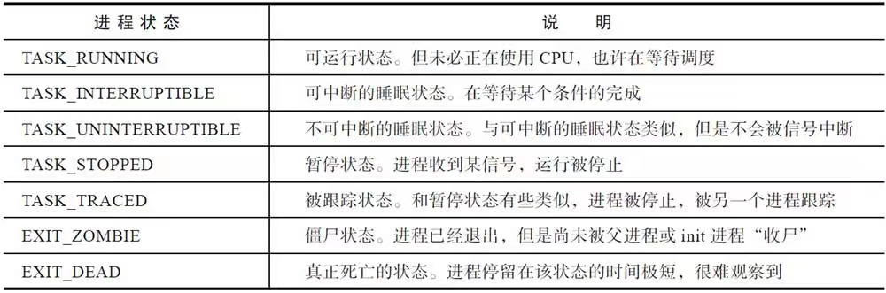

#### 可运行状态

首先是可运行状态。该状态的名称为**TASK_RUNNING**，严格来说这个名字是不准确的，因为该状态的确切含义是可运行状态，并非一定是在占有CPU运行，将该状态称为TASK_RUNABLE会更准确。

TASK_RUNNIING可以根据是否在CPU上运行，进一步细分成RUNNING和READY两种状态。处于READY状态的进程表示，它们随时可以投入运行，只不过由于CPU资源有限，调度器暂时并未选中它运行。

处于可运行状态的进程是进程调度的对象。如果进程并不处于可运行状态，进程调度器就不会选择它投入运行。在Linux中，**每一个CPU都有自己的运行队列**，事实上还不止一个，根据进程所属调度类别的不同，可运行状态的进程也会位于不同的队列上：

- 如果是实时进程（属于实时调度类），则根据优先级的情况，落在相应的优先级的队列上；
- 如果是普通进程（属于完全公平调度类），则根据虚拟运行时间的大小，落在红黑树的相应位置上。

这样进程调度器就可以根据一定的算法从运行队列上挑选合适的进程来使用CPU资源。

处于RUNNING状态的进程，可能正在执行用户态（user-mode）代码，也可能正在执行内核态（kernel-mode）代码，内核提供了进一步的区分和统计。Linux提供的time命令可以统计进程在用户态和内核态消耗的CPU时间：

```sh
$ time sleep 2
sleep 2  0.00s user 0.00s system 0% cpu 2.001 total
```

time命令统计了三种时间：实际时间、用户CPU时间和系统CPU时间。其中实际时间最好理解，就是日常生活中的时间（墙上时间，wall clock time），即进程从开始到终止，一共执行了多久。user一行统计的是进程执行用户态代码消耗的CPU时间；sys一行统计的是进程在内核态运行所消耗的CPU时间。

如何区分用户态CPU时间和内核态CPU时间呢？我们举例来说明。如果进程在执行加减乘除或浮点数计算或排序等操作时，尽管这些操作正在消耗CPU资源，但是和内核并没有太多的关系，CPU大部分时间都在执行用户态的指令。这种场景下，我们称CPU时间消耗在用户态。如果进程频繁地执行创建进程、销毁进程、分配内存、操作文件等操作，那么进程不得不频繁地陷入内核执行系统调用，这些时间都累加在进程的内核态CPU时间。

对于这三种时间，最容易产生的误解的是real time=user time+sys time。这种想法是错误的。在单核系统上，real time总是不小于user time与sys time的总和。但是在多核系统上，user time与sys time的总和可以大于real time。利用这三个时间，我们可以计算出程序的CPU使用率：

```sh
cpu_usage = ((user time) + (sys time))/(real time)
```

在多核处理器情况下，cpu_usage如果大于1，则表示该进程是计算密集型（CPUbound）的进程，且cpu_usage的值越大，表示越充分地利用了多处理器的并行运行优势；如果cpu_usage的值小于1，则表示进程为I/O密集型（I/O bound）的进程，多核并行的优势并不明显。

time命令的问题在于要等进程运行完毕后，才能获取到进程的统计信息，正所谓盖棺定论。有些时候，我们需要了解正在运行的进程：它运行了多久，内核态CPU时间和用户态CPU时间分别是多少？procfs在/proc/PID/stat中提供了相关的信息：

```sh
$ cat /proc/84624/stat
84624 (mysqld) S 84579 84624 84624 0 -1 4194560 137780 23138 78 49 288415 333036 9 9 20 0 50 0 236742 1841668096 117565 18446744073709551615 94271090282496 94271150385624 140724899044720 0 0 0 543239 4096 9448 0 0 0 17 1 0 0 5 0 0 94271150390240 94271155623384 94271168163840 140724899053095 140724899053264 140724899053264 140724899053543 0
```

数组中的每个字段都有自己独特的含义。如果从0开始计数，那么字段13对应的是进程消耗的用户态CPU时间，字段14记录的是进程消耗的内核态CPU时间。两者的单位是时钟嘀嗒（clock tick）。

一个时钟嘀嗒是多久？可以通过如下命令来获取：

```sh
$ grep CONFIG_HZ /boot/config-`uname -r`
# CONFIG_HZ_PERIODIC is not set
# CONFIG_HZ_100 is not set
CONFIG_HZ_250=y
# CONFIG_HZ_300 is not set
# CONFIG_HZ_1000 is not set
CONFIG_HZ=250

# 250HZ表示每个时钟滴答的单位是4ms
```

如何获得进程的实际运行时间呢？通过ps命令的etime（elapsed time的缩写）可以获取该值：

```sh
$ ps -p 84624 -o etime,cmd,pid
    ELAPSED CMD                             PID
44-21:15:41 mysqld --default-authentica   84624
```

#### 可中断睡眠状态和不可中断睡眠状态

有些进程需要等待某种特定条件（比如进程等待子进程退出、等待socket连接、尝试获得锁、等待信号量等）得到满足后方可以执行，而等待的时间往往是不可预估的。在这种情况下，进程依然占用CPU就不合适了，对CPU资源而言，这是一种极大的浪费。因此内核会将该进程的状态改变成其他状态，将其从CPU的运行队列中移除，同时调度器选择其他的进程来使用CPU资源。

Linux存在两种睡眠的状态：**可中断的睡眠状态（TASK_INTERRUPTIBLE）**和**不可中断的睡眠状态（TASK_UNINTERRUPTIBLE）**。这两种睡眠状态是很类似的。两者的区别就在于能否响应收到的信号。

处于可中断的睡眠状态的进程，返回到可运行的状态有以下两种可能性：

- 等待的事件发生了，继续运行的条件满足了。

- 收到未被屏蔽的信号。

当处于可中断睡眠状态的进程收到信号时，会返回EINTR给用户空间。程序员需要检测返回值，并做出正确的处理。

对于不可中断的睡眠状态，只有一种可能性能使其返回到可运行的状态，即等待的事件发生了，继续运行的条件满足了:

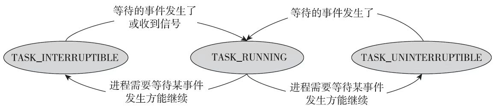


TASK_UNINTERRUPTIBLE状态存在的意义在于，内核中某些处理流程是不应该被打断的，如果响应异步信号，程序的执行流程中就会插入一段用于处理异步信号的流程，原有的流程就被中断了。因此当进程在对某些硬件进行某些操作时（比如进程调用read系统调用对某个文件进行读操作，read系统调用最终执行对应设备驱动的代码，并与对应的物理设备交互），需要使用TASK_UNINTERRUPTIBLE状态把进程保护起来，以避免进程与设备的交互过程被打断，致使设备陷入不可控的状态。

TASK_UNINTERRUPTIBLE是一种很危险的状态，因为进程进入该状态后，刀枪不入，任何信号都无法打断它。我们无法通过信号杀死一个处于不可中断的休眠状态的进程，SIGKILL信号也不行。

 内核提供了hung task检测机制，它会启动一个名为khungtaskd的内核线程来检测处于TASK_UNINTERRUPTIBLE状态的进程是否已经失控。khungtaskd定期被唤醒（默认是120秒），它会遍历所有处于TASK_UNINTERRUPTIBLE状态的进程进行检查，如果某进程超过120秒未获得调度，那么内核就会打印出警告信息和该进程的堆栈信息。

120秒这个时间是可以定制的，内核提供了控制选项：

```sh
$ sysctl  kernel.hung_task_timeout_secs
kernel.hung_task_timeout_secs = 120
```

无论进程处于可中断的睡眠状态，还是不可中断的睡眠状态，我们都可能会希望了解进程停在什么位置或在等待什么资源。procfs的wchan提供了这方面的信息，wchan是wait channel的含义。ps命令也可以通过wchan获得该信息：

```sh
$ ps -p 84624 -o pid,wchan,cmd
    PID WCHAN  CMD
  84624 poll_s mysqld --default-authentication-plugin=mysql_native_password --character-set-server=utf8mb4 --collation-server=utf8mb4_general_ci --explicit_defaults_for_timestamp=true
```

另外一种方法是查看进程的stack信息，方法如下所示：

```sh
$ cat /proc/84624/stack
[<0>] poll_schedule_timeout.constprop.0+0x46/0x70
[<0>] do_sys_poll+0x3ee/0x520
[<0>] __x64_sys_poll+0x3b/0x150
[<0>] do_syscall_64+0x57/0x190
[<0>] entry_SYSCALL_64_after_hwframe+0x44/0xa9
```

#### 睡眠进程和等待队列

进程无论是处于可中断的睡眠状态还是不可中断的睡眠状态，有一个数据结构是绕不开的：**等待队列（wait queue）**。进程但凡需要休眠，必然是等待某种资源或等待某个事件，内核必须想办法将进程和它等待的资源（或事件）关联起来，当等待的资源可用或等待的事件已发生时，可以及时地唤醒相关的进程。内核采用的方法是等待队列。

等待队列作为Linux内核中的基础数据结构和进程调度紧密地结合在一起。当进程需要等待特定事件时，就将其放置在合适的等待队列上，因此等待队列对应的是一组进入休眠状态的进程，当等待的事件发生时（或者说等待的条件满足时），这组进程会被唤醒，这类事件通常包括：中断（比如DISK I/O完成）、进程同步、休眠时间到时等。

内核使用双向链表来实现等待队列，每个等待队列都可以用等待队列头来标识:

```c
struct __wait_queue_head {
    spinlock_t lock;
    struct list_head task_list;
};
typedef struct __wait_queue_head wait_queue_head_t;
```

进程需要休眠的时候，需要定义一个等待队列元素，将该元素挂入合适的等待队列，等待队列元素的定义如下：

```c
typedef struct __wait_queue wait_queue_t;
struct __wait_queue {
    unsigned int flags;
#define WQ_FLAG_EXCLUSIVE   0x01
    void *private;
    wait_queue_func_t func;
    struct list_head task_list;
};
```

等待队列上的每个等待队列元素，都对应于一个处于睡眠状态的进程:

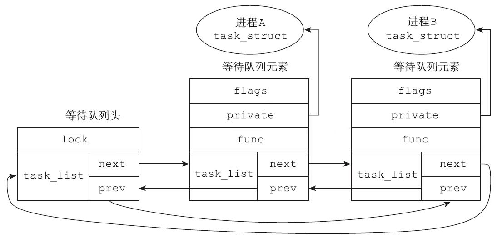

内核如何使用等待队列完成睡眠，以及条件满足之后如何唤醒对应的进程呢？

首先要定义和初始化等待队列头部。内核提供了init_waitqueue_head和DECLARE_WAIT_QUEUE_HEAD两个宏，用来初始化等待队列头部。

其次，当进程需要睡眠时，需要定义等待队列元素。内核提供了init_waitqueue_entry函数和init_waitqueue_func_entry函数来完成等待队列元素的初始化：

```c
static inline void init_waitqueue_entry(wait_queue_t *q, struct task_struct *p)
{
    q->flags = 0;
    q->private = p;
    q->func = default_wake_function;/*通用的唤醒回调函数*/
}
static inline void init_waitqueue_func_entry(wait_queue_t *q,
                    wait_queue_func_t func)
{
    q->flags = 0;
    q->private = NULL;
    q->func = func;
}
```

除此以外，内核还提供了宏DECLARE_WAITQUEUE，也可用来初始化等待队列元素：

```c
#define __WAITQUEUE_INITIALIZER(name, tsk) {                \
    .private    = tsk,                      \
    .func       = default_wake_function,            \
    .task_list  = { NULL, NULL } }
#define DECLARE_WAITQUEUE(name, tsk)                    \
    wait_queue_t name = __WAITQUEUE_INITIALIZER(name, tsk)
```

从等待队列元素的初始化函数或初始化宏不难看出，等待队列元素的private成员变量指向了进程的进程描述符task_struct，因此就有了等待队列元素，就可以将进程挂入对应的等待队列了。

第三步是将等待队列元素（即睡眠进程）放入合适的等待队列中。内核同时提供了add_wait_queue和add_wait_queue_exclusive两个函数来把等待队列元素添加到等待队列头部指向的双向链表，代码如下：

```c
void add_wait_queue(wait_queue_head_t *q, wait_queue_t *wait)
{
    unsigned long flags;
    wait->flags &= ~WQ_FLAG_EXCLUSIVE;
    spin_lock_irqsave(&q->lock, flags);
    __add_wait_queue(q, wait);
    spin_unlock_irqrestore(&q->lock, flags);
}
void add_wait_queue_exclusive(wait_queue_head_t *q, wait_queue_t *wait)
{
    unsigned long flags;
    wait->flags |= WQ_FLAG_EXCLUSIVE;
    spin_lock_irqsave(&q->lock, flags);
    __add_wait_queue_tail(q, wait);
    spin_unlock_irqrestore(&q->lock, flags);
}
```

这两个函数的区别在于：

- 一个等待队列元素设置了WQ_FLAG_EXCLUSIVE标志位，而另一个则没有。
- 一个等待队列元素放到了等待队列的尾部，而另一个则放到了等待队列的头部。

如果存在多个进程在等待同一个条件满足或同一个事件发生（即等待队列上有多个等待队列元素），那么当条件满足时，应该把所有进程一并唤醒还是只唤醒某一个或某几个进程？

答案是具体情况具体分析。有时候需要唤醒等待队列上的所有进程，但又有些时候唤醒操作需要具有排他性（EXCLUSIVE）。比如多个进程等待临界区资源，当锁的持有者释放锁时，如果内核将所有等待在该锁上的进程一起唤醒，那么最终也只能有一个进程竞争到锁资源，而大多数的竞争者，不过是从休眠中醒来，然后继续休眠，这会浪费CPU资源，如果等待队列中的进程数目很大，还会严重影响性能。这就是所谓的惊群效应（thundering herd problem）。因此内核提供了WQ_FLAG_EXCLUSEVE标志位来实现互斥等待，add_wait_queue_exclusive函数会将带有该标志位的等待队列元素添加到等待队列的尾部。当内核唤醒等待队列上的进程时，等待队列元素中的WQ_FLAG_EXCLUSEVE标志位会影响唤醒行为，比如wake_up宏，它唤醒第一个带有WQ_FLAG_EXCLUSEVE标志位的进程后就会停止。

事实上，当内核需要等待某个条件满足而不得不休眠（或是可中断的睡眠，或是不可中断的睡眠）时，内核封装了一些宏来完成前面提到的流程。这些宏包括：

```c
wait_event(wq, condition)
wait_event_timeout(wq, condition, timeout)
wait_event_interruptible(wq, condition)
wait_event_interruptible_timeout(wq, condition, timeout)
```

第一个参数指向的是等待队列头部，表示进程会睡眠在该等队列上。进程醒来时，condition需要得到满足，否则继续阻塞。其中wait_event和wait_event_interruptible的区别在于，睡眠过程中，前者的进程状态是不可中断的睡眠状态，不能被信号中断，而后者是可中断的睡眠状态，可以被信号中断。名字中带有_timeout的宏意味着阻塞等待的超时时间，以jiffy为单位，当超时时间到达时，无论condition是否满足，均返回。

以wait_event宏为例，欣赏一下内核是如何使用等待队列，等待某个条件的满足的：

```c
#define wait_event(wq, condition)                   \
do {                                    \
    if (condition)                          \
        break;                          \
    __wait_event(wq, condition);                    \
} while (0)
#define __wait_event(wq, condition)                     \
do {                                    \
    DEFINE_WAIT(__wait);                        \
                                    \
    for (;;) {                          \
        prepare_to_wait(&wq, &__wait, TASK_UNINTERRUPTIBLE);    \
        if (condition)                      \
            break;                      \
        schedule();                     \
    }                               \
    finish_wait(&wq, &__wait);                  \
} while (0)
void
prepare_to_wait(wait_queue_head_t *q, wait_queue_t *wait, int state)
{
    unsigned long flags;
    wait->flags &= ~WQ_FLAG_EXCLUSIVE;
    spin_lock_irqsave(&q->lock, flags);
    if (list_empty(&wait->task_list))
        __add_wait_queue(q, wait);
    set_current_state(state);
    spin_unlock_irqrestore(&q->lock, flags);
}
```

prepare_to_wait函数负责将等待队列元素添加到对应的等待队列，同时将进程的状态设置成TASK_UNINTERRUPTIBLE，完成prepare_to_wait的工作后，会检查条件是否满足条件，如果条件不满足，则调用schedule（）函数，主动让出CPU使用权，等待被唤醒。

```c
wake_up(x)
wake_up_nr(x, nr)
wake_up_all(x)
wake_up_interruptible(x)
wake_up_interruptible_nr(x, nr)
wake_up_interruptible_all(x)
```

wake_event和wake_up配对使用情况:

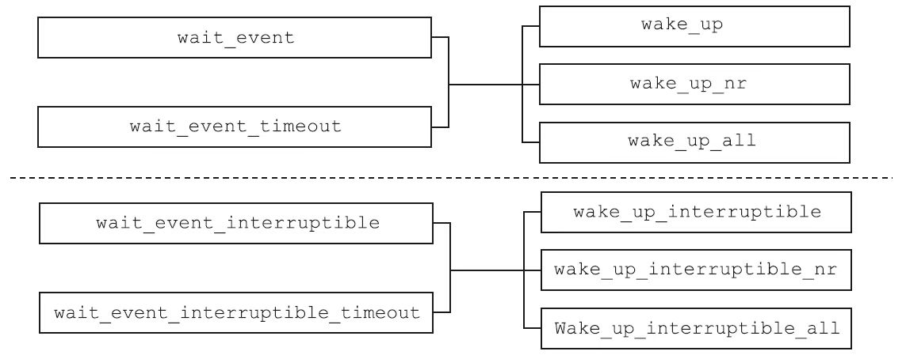

其中该系列宏中，名字里带`_interruptible`的宏只能唤醒处于TASK_INTERRUPTIBLE状态的进程，而名字中不带`_interruptible`的宏，既可以唤醒TASK_INTERRUPTIBLE状态的进程，也可以唤醒TASK_UNINTERRUPTIBLE状态的进程。

这些wake_up系列的宏，其实现部分最终都是通过__wake_up函数的简单封装来实现的:

```c
void __wake_up(wait_queue_head_t *q, unsigned int mode,
            int nr_exclusive, void *key)
{
    unsigned long flags;
    spin_lock_irqsave(&q->lock, flags);
    __wake_up_common(q, mode, nr_exclusive, 0, key);
    spin_unlock_irqrestore(&q->lock, flags);
}
static void __wake_up_common(wait_queue_head_t *q, unsigned int mode,
            int nr_exclusive, int wake_flags, void *key)
{
    wait_queue_t *curr, *next;
    /*遍历等待队列头部对应的双向链表*/
    list_for_each_entry_safe(curr, next, &q->task_list, task_list) {
        unsigned flags = curr->flags;
        /*最多唤醒nr设置了排他性标志位的等待进程，以防止惊群*/
        if (curr->func(curr, mode, wake_flags, key) &&
                (flags & WQ_FLAG_EXCLUSIVE) && !--nr_exclusive)
            break;
    }
}
```

注意，遍历等待队列上的所有等待队列元素时，对于每一个需要唤醒的进程，执行的是等待队列元素中定义的func，最多唤醒nr_exclusive个带有WQ_FLAG_EXCLUSIVE的等待队列元素。

在初始化等待队列元素的时候，需要注册回调函数func。当内核唤醒该进程时，就会执行等待队列元素中的回调函数。

等待队列元素最常用的回调函数是default_wake_function，就像它的名字一样，是默认的唤醒回调函数。无论是DECLARE_WAITQUEUE还是init_waitqueue_entry，都将等待队列元素的func指向default_wake_function。而default_wake_function仅仅是大名鼎鼎的try_to_wake_up函数的简单封装，代码如下：

```c
int default_wake_function(wait_queue_t *curr, unsigned mode, int wake_flags,
            void *key)
{
    return try_to_wake_up(curr->private, mode, wake_flags);
}
```

try_to_wake_up是进程调度里非常重要的一个函数，它负责将睡眠的进程唤醒，并将醒来的进程放置到CPU的运行队列中，然后并设置进程的状态为TASK_RUNNING。

#### TASK_KILLABLE状态

ps命令输出的D状态不能简单地理解成UNINTERRUPTIBLE状态。内核自2.6.25版本起引入了一种新的状态即TASK_KILLABLE状态。可中断的睡眠状态太容易被信号打断，与之对应，不可中断的睡眠状态完全不可以被信号打断，又容易失控，两者都失之极端。而内核新引入的TASK_KILLABLE状态则介于两者之间，是一种调和状态。该状态行为上类似于TASK_UNINTERRUPTIBLE状态，但是进程收到致命信号（即杀死一个进程的信号）时，进程会被唤醒。

有了该状态，wait_event系列宏也增加了killable的变体，即wait_event_killable宏。该宏会将进程置为TASK_KILLABLE状态，同时睡眠在等待队列上。致命信号SIGKILL可以将其唤醒。

#### TASK_STOPPED状态和TASK_TRACED状态

TASK_STOPPED状态是一种比较特殊的状态。SIGSTOP、SIGTSTP、SIGTTIN和SIGTTOU等信号会将进程暂时停止，停止后进程就会进入到该状态。上述4种信号中的**SIGSTOP**具有和SIGKILL类似的属性，即不能忽略，不能安装新的信号处理函数，不能屏蔽等。当处于TASK_STOPPED状态的进程收到**SIGCONT**信号后，可以恢复进程的执行。

可运行状态和暂停状态的切换:

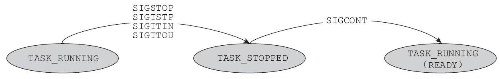

TASK_TRACED是被跟踪的状态，进程会停下来等待跟踪它的进程对它进行进一步的操作。如何才能制造出处于TASK_TRACED状态的进程呢？最简单的例子是用gdb调试程序，当进程在断点处停下来时，此时进程处于该状态。

TASK_TRACED和TASK_STOPPED状态的类似之处是都处于暂停状态，不同之处是TASK_TRACED不会被SIGCONT信号唤醒。只有调试进程通过ptrace系统调用，下达PTRACE_CONT、PTRACE_DETACH等指令，或者调试进程退出，被调试的进程才能恢复TASK_RUNNING的状态。

#### EXIT_ZOMBIE状态和EXIT_DEAD状态

EXIT_ZOMBIE和EXIT_DEAD是两种退出状态，严格说来，它们并不是运行状态。当进程处于这两种状态中的任何一种时，它其实已经死去了。内核会将这两种状态记录在进程描述符的exit_state中。

两种状态的区别在于，如果父进程没有将SIGCHLD信号的处理函数重设为SIG_IGN，或者没有为SIGCHLD设置SA_NOCLDWAIT标志位，那么子进程退出后，会进入僵尸状态等待父进程或init进程来收尸，否则直接进入EXIT_DEAD。如果不停留在僵尸状态，进程的退出是非常快的，因此很难观察到一个进程是否处于EXIT_DEAD状态。

### 观察进程状态

在proc文件系统中，在/proc/PID/status中，记录了PID对应进程的状态信息。其中State项记录了该进程的瞬时状态。因为进程状态是不断迁移变化的，所以读出来的结果是瞬时的值。

```sh
$ cat /proc/84624/status
Name:	mysqld
Umask:	0026
State:	S (sleeping)
```

进程的状态有几种可能的值呢？一起去查看内核的源码。在fs/proc/array.c中，定义了所有可能的值，定义如下：

```c
static const char * const task_state_array[] = {
    "R (running)",      /*   0 */
    "S (sleeping)",      /*   1 */
    "D (disk sleep)",   /*   2 */
    "T (stopped)",       /*   4 */
    "t (tracing stop)", /*   8 */
    "Z (zombie)",        /*  16 */
    "X (dead)",     /*  32 */
    "x (dead)",     /*  64 */
    "K (wakekill)",     /* 128 */
    "W (waking)",       /* 256 */
};
```

TASK_DEAD、TASK_WAKEKILL和TASK_WAKING，在procfs中，无法观察到下面这三个值，它们从不出现。

procfs中的进程状态：

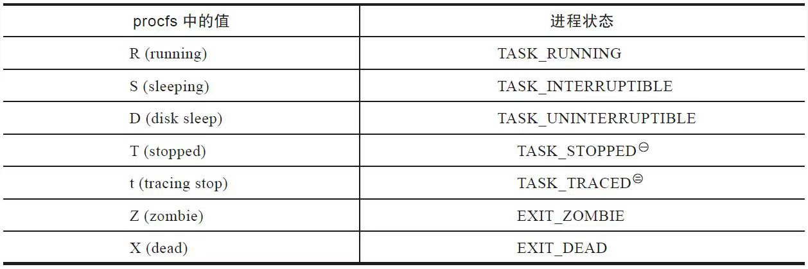

## 进程调度概述

进程调度器是对处于可运行（TASK_RUNNING）状态的进程进行调度，如果进程并非TASK_RUNNING的状态，那么该进程和进程调度是没有关系的。

Linux属于**抢占式多任务系统**。

不同的进程之间，其行为模式可能存在着巨大的差异。进程的行为模式可以粗略地分成两类：CPU消耗型（CPU bound）和I/O消耗型（I/O bound）。所谓CPU消耗型是指进程因为没有太多的I/O需求，始终处于可运行的状态，始终在执行指令。而I/O消耗型是指进程会有大量I/O请求（比如等待键盘键入、读写块设备上的文件、等待网络I/O等），它处于可执行状态的时间不多，而是将更多的时间耗费在等待上。当然这种划分方法并非绝对的，可能有些进程某段时间表现出CPU消耗型的特征，另一段时间又表现出I/O消耗型的特征。

另一种进程分类的方法:

- 交互型进程：这种类型的进程有很多的人机交互，进程会不断地陷入休眠状态，等待键盘和鼠标的输入。但是这种进程对系统的响应时间要求非常高，用户输入之后，进程必须被及时唤醒，否则用户就会觉得系统反应迟钝。比较典型的例子是文本编辑程序和图形处理程序等。
- 批处理型进程：这类进程和交互型的进程相反，它不需要和用户交互，通常在后台执行。这样的进程不需要及时的响应。比较典型的例子是编译、大规模科学计算等，一般来说，这种进程总是“被侮辱的和被损害的”。
- 实时进程：这类进程优先级比较高，不应该被普通进程和优先级比它低的进程阻塞。一般需要比较短的响应时间。

设计一个优秀的进程调度器绝不是一件容易的事情，它还有很多事情需要考虑，很多目标需要达成：

- 公平：每一个进程都可以获得调度的机会，不能出现“饿死”的现象。
- 良好的调度延迟：尽量确保进程在一定的时间范围内，总能够获得调度的机会。
- 差异化：允许重要的进程获得更多的执行时间。
- 支持软实时进程：软实时进程，比普通进程具有更高的优先级。
- 负载均衡：多个CPU之间的负载要均衡，不能出现一些CPU很忙，而另一些CPU很闲的情况。
- 高吞吐量：单位时间内完成的进程个数尽可能多。
- 简单高效：调度算法要高效。不应该在调度上花费太长的时间。
- 低耗电量：在系统并不繁忙的情况下，降低系统的耗电量。

目前Linux采用的是每个CPU都要有自己的运行队列，即**per cpu run queue**。每个CPU去自己的运行队列中选择进程，这样就降低了竞争。这种方案还有另外一个好处：缓存重利用。某个进程位于这个CPU的运行队列上，经过多次调度之后，内核趋于选择相同的CPU执行该进程。这种情况下上次运行的变量很可能仍然在CPU的缓存中，这样就提升了效率。

Linux选择了每一个CPU都有自己的运行队列这种解决方案。这种选择也带来了一种风险：CPU之间负载不均衡，可能出现一些CPU闲着而另外一些CPU忙不过来的情况。为了解决这个问题，load_balance就闪亮登场了。**load_balance的任务就是在一定的时机下，通过将任务从一个CPU的运行队列迁移到另一个CPU的运行队列，来保持CPU之间的负载均衡。**

进程调度具体要做哪些事情呢？概括地说，进程调度的职责是挑选下一个执行的进程，如果下一个被调度到的进程和调度前运行的进程不是同一个，则执行上下文切换，将新选择的进程投入运行。

根据调度的入口点函数schedule（）来看下进程调度做了哪些事情，代码如下：

```c
asmlinkage void __sched schedule(void)
{
    struct task_struct *tsk = current;
    sched_submit_work(tsk);
    __schedule();
}
static void __sched __schedule(void)
{
    struct task_struct *prev, *next;
    unsigned long *switch_count;
    struct rq *rq;
    int cpu;
need_resched:
    preempt_disable();
    cpu = smp_processor_id();
    rq = cpu_rq(cpu);
    rcu_note_context_switch(cpu);
    prev = rq->curr;
    schedule_debug(prev);
    if (sched_feat(HRTICK))
        hrtick_clear(rq);
    raw_spin_lock_irq(&rq->lock);
    switch_count = &prev->nivcsw;
    if (prev->state && !(preempt_count() & PREEMPT_ACTIVE)) {
        if (unlikely(signal_pending_state(prev->state, prev))) {
            prev->state = TASK_RUNNING;
        } else {
            /*先前的进程不再处于可执行状态，需要将其从运行队列中移除出去*/
            deactivate_task(rq, prev, DEQUEUE_SLEEP);
            prev->on_rq = 0;
            if (prev->flags & PF_WQ_WORKER) {
                struct task_struct *to_wakeup;
                to_wakeup = wq_worker_sleeping(prev, cpu);
                if (to_wakeup)
                    try_to_wake_up_local(to_wakeup);
            }
        }
        switch_count = &prev->nvcsw;
    }
    /*调度之前的准备工作*/
    pre_schedule(rq, prev);/*当前CPU运行队列上没有可运行的进程了，太闲了，需要负载均衡*/
    if (unlikely(!rq->nr_running))
        idle_balance(cpu, rq);
    /*将被抢占的进程放入指定的合适的位置*/
    put_prev_task(rq, prev);
    /*挑选下一个执行的进程*/
    next = pick_next_task(rq);
    /*清除被抢占进程的需要调度的标志位*/
    clear_tsk_need_resched(prev);
    rq->skip_clock_update = 0;
    /*如果选中的进程与原进程不是同一个进程，则需要上下文切换*/
    if (likely(prev != next)) {
        rq->nr_switches++;
        rq->curr = next;
        ++*switch_count;
        /*上下文切换，切换之后，新选中的进程投入执行*/
        context_switch(rq, prev, next);
        cpu = smp_processor_id();
        rq = cpu_rq(cpu);
    } else
        raw_spin_unlock_irq(&rq->lock);
    post_schedule(rq);
    preempt_enable_no_resched();
    if (need_resched())
        goto need_resched;
}
```

Linux是可抢占式内核（Preemptive Kernel），从内核2.6版本开始，Linux不仅支持用户态抢占，也开始支持内核态抢占。可抢占式内核的优势在于可以保证系统的响应时间。当高优先级的任务一旦就绪，总能及时得到CPU的控制权。但是内核抢占不能随意发生，某些情况下是不允许发生内核抢占的。为了更好地支持内核抢占，内核为每一个进程的thread_info引入了preempt_count计数器，数值为0时表示可以抢占，当该计数器的值不为0时，表示禁止抢占。

并不是所有的时机都允许发生内核抢占。以自旋锁为例，在内核可抢占的系统中，自旋锁持有期间不允许发生内核抢占，否则可能会导致其他CPU长期不能获得锁而死等。因此在spin_lock函数中（通过__raw_spin_lock），会调用preempt_disable宏，而该宏会将进程preempt_count计数器的值加1，表示不允许抢占。同样的道理，解锁的时候，会将preempt_count的值减1（通过preempt_enable宏）。

```c
static inline void __raw_spin_lock(raw_spinlock_t *lock)
{
    preempt_disable();
    spin_acquire(&lock->dep_map, 0, 0, _RET_IP_);
    LOCK_CONTENDED(lock, do_raw_spin_trylock, do_raw_spin_lock);
}
```

内核的preempt_schedule函数是内核抢占时呼叫调度器的入口，它会调用`__schedule`函数发起调度。在调用`__schedule`函数之前，会设置进程的PREEMPT_ACTIVE标志位，表示这是从抢占过程中进入_`_schedule`函数的。

```c
asmlinkage void __sched notrace preempt_schedule(void)
{
    struct thread_info *ti = current_thread_info();
    if (likely(ti->preempt_count || irqs_disabled()))
        return;
    do {
        add_preempt_count_notrace(PREEMPT_ACTIVE);
        __schedule();
        sub_preempt_count_notrace(PREEMPT_ACTIVE);
        barrier();
    } while (need_resched());
}
```

在`__schedule`函数中，内核会检查进程的PREEMPT_ACTIVE标志位，如果发现了该标志位置位，就不会调用deactivate_task函数将其从运行队列中移除。

如果进程不处于TASK_RUNNING的状态，并且PREEMPT_ACTIVE并没有置位，那么就有可能会调用deactivate_task函数将其从运行队列中移除。这里说可能是因为，该进程可能存在尚未处理的信号，如果是这种情况它并不会被移除出运行队列，相反会被再次设置成TASK_RUNNING的状态，获得再次被调度到的机会。

__schdule函数的基本流程如下图所示，流程图中带有背景色的部分都是调度框架里的hook点。内核的进程调度是模块化的，实现一个新的调度算法，只需要实现一组框架需要的钩子函数即可，内核将会在合适的时机调用这些函数。

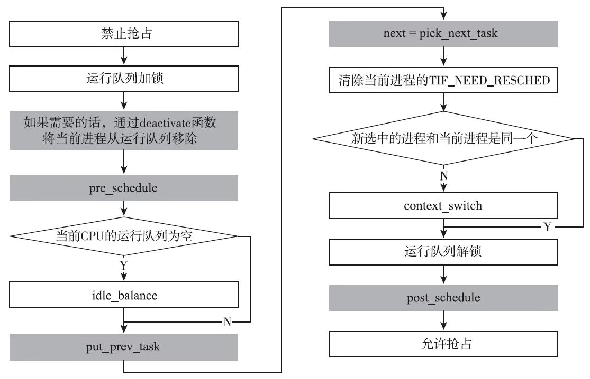

以deactivate_task为例，来看下调度框架与具体调度算法中的函数之间的关系。deactivate_task函数的职责可以顾名思义，即进程不再处于TASK_RUNNING的状态，需要将其从对应的运行队列中移除。因此其实现为：

```c
static void deactivate_task(struct rq *rq, struct task_struct *p, int flags)
{
    if (task_contributes_to_load(p))
        rq->nr_uninterruptible++;
    dequeue_task(rq, p, flags);
}
static void dequeue_task(struct rq *rq, struct task_struct *p, int flags)
{
    update_rq_clock(rq);
    sched_info_dequeued(p);
    p->sched_class->dequeue_task(rq, p, flags);
}
```

内核会调用进程所属调度类的dequeue_task函数，至于调度类的dequeue_task函数具体做了哪些事情，完全由具体的调度类来决定。

调用schedule函数时，当前进程可能仍然处于可运行的状态（主动让出CPU或被其他进程抢占），因此选择下一个占用CPU的进程之前，需要调用put_prev_task函数。该函数的目的是，当前进程被调度出去之前，留给具体调度算法一个时机来更新内部的状态（。和deactivate_task函数一样，根据当前进程所属的调度类，调用具体的put_prev_task函数。

```c
static void put_prev_task(struct rq *rq, struct task_struct *prev)
{
    if (prev->on_rq || rq->skip_clock_update < 0)
        update_rq_clock(rq);
    prev->sched_class->put_prev_task(rq, prev);
}
```

Linux内核实现了如下4种调度类：

- stop_sched_class：停止类
- rt_sched_class：实时类
- fair_sched_class：完全公平调度类
- idle_sched_class：空闲类

这4种调度类是按照优先级顺序排列的，停止类（stop_sched_class）具有最高的调度优先级，与之对应的，空闲类（idle_sched_class）具有最低的调度优先级。进程调度器挑选下一个执行的进程时，会首先从停止类中挑选进程，如果停止类中没有挑选到可运行的进程，再从实时类中挑选进程，依此类推。

pick_next_task函数负责挑选下一个运行的进程，从其实现逻辑中可以看出，系统是按照优先级顺序从调度类中挑选进程的

```c
static inline struct task_struct *
pick_next_task(struct rq *rq)
{
    const struct sched_class *class;
    struct task_struct *p;
    /*此处是优化，若所有任务都属于公平类，则直接从公平类中挑选下一个类*/
    if (likely(rq->nr_running == rq->cfs.h_nr_running)) {
        p = fair_sched_class.pick_next_task(rq);
        if (likely(p))
            return p;
    }
    /*按照调度类的优先级，从高到低挑选下一个进程，直到挑选到为止*/
    for_each_class(class) {
        p = class->pick_next_task(rq);
        if (p)
            return p;
    }
    ...
}
```


优先级最高的停止类进程，主要用于多个CPU之间的负载均衡和CPU的热插拔，它所做的事情就是停止正在运行的CPU，以进行任务的迁移或插拔CPU。优先级最低的空闲类，负责将CPU置于停机状态，直到有中断将其唤醒。idle_sched_class类的空闲任务只有在没有其他任务的时候才能被执行。

每一个CPU只有一个停止任务和一个空闲任务。从上面的职责描述也可以看出，这两种调度类属于诸神之战，和应用层的关系并不大。应用层无法将进程设置成停止类进程或空闲类进程。

和应用层关系比较密切的两种调度类是实时类和完全公平调度类，尤其是完全公平调度类。

## 普通进程的优先级

事实上，除非将Linux用在特定的领域，否则在大部分时间里所有可运行的进程都属于**完全公平调度（Completely Fair Scheduler，简称CFS)**。从内核代码pick_next_task函数（该函数负责挑选下一个进程放到CPU上执行）中所做的优化可见一斑。

**完全公平调度（Completely Fair Scheduler，简称CFS)**，使用了一种动态时间片的算法。它给每个进程分配了使用CPU的时间比例。进程调度设计上，有一个很重要的指标是**调度延迟**，即保证每一个可运行的进程都至少运行一次的时间间隔。比如调度延迟是20毫秒，如果运行队列上只有2个同等优先级的进程，那么可以允许每个进程执行10毫秒，如果运行队列上是4个同等优先级的进程，那么，每个进程可以运行5毫秒。

完全公平调度提供了另一种控制方法：**调度最小粒度**。调度最小粒度指的是任一进程所运行的时间长度的基准值。任何一个进程，只要分配到了CPU资源，都至少会执行调度最小粒度的时间，除非进程在执行过程中执行了阻塞型的系统调用或主动让出CPU资源（通过sched_yield调用）

在Linux操作系统中，调度延迟被称为sysctl_sched_latency，记录在/proc/sys/kernel/sched_latency_ns中，而调度最小粒度被称为sysctl_sched_min_granularity，记录在/proc/sys/kernel/sched_min_granularity_ns中，两者的单位都是纳秒。

```sh
# uyouii @ VM-0-8-ubuntu in ~ [19:43:06]
$ cat /proc/sys/kernel/sched_latency_ns
12000000
# uyouii @ VM-0-8-ubuntu in ~ [19:43:07]
$ cat /proc/sys/kernel/sched_min_granularity_ns
1500000
```

调度延迟和调度最小粒度综合起来看是比较有意思的，它反映了在调度延迟内允许的最大活动进程数目。这个值被称为sched_nr_latency。如果运行队列上可运行状态的进程太多，超出了该值，调度最小粒度和调度延迟两个目标则不可能被同时实现。内核并没有提供参数来指定sched_nr_latency，它的值完全是由调度延迟和调度最小粒度来决定的。计算公式如下：

因此调度延迟是一个尽力而为的目标。当可运行的进程个数小于sched_nr_latency的时候，调度周期总是等于调度延迟（sysctl_sched_latency）。但是如果可运行的进程个数超过了sched_nr_latency，系统就会放弃调度延迟的承诺，转而保证调度最小粒度。在这种情况下**调度周期等于最小粒度乘以可运行进程的个数**。

完全公平调度又引入了优先级的概念。完全公平调度通过引入调度**权重**来实现优先级，进程之间按照权重的比例，分配CPU时间。引入权重后，调度周期内分配给进程的运行时间的计算公式如下：

```
分配给进程的运行时间＝调度周期*进程权重/运行队列所有进程权重之和
```

Linux下每一个进程都有一个nice值，该值的取值范围是[-20，19]，其中**nice值越高，表示优先级越低。默认的优先级是0**。

> nice值越高，表示越友好，越谦让，即优先级越低。具体说就是同等情况下，占有的CPU资源越少。

内核定义了一个数组，来表述每个不同nice值对应的权重：

 ```c
 static const int prio_to_weight[40] = {
 /* -20 */      88761,     71755,     56483,     46273,     36291,
  /* -15 */     29154,     23254,     18705,     14949,     11916,
  /* -10 */      9548,      7620,      6100,      4904,      3906,
  /*  -5 */      3121,      2501,      1991,      1586,      1277,
  /*   0 */      1024,       820,       655,       526,       423,
  /*   5 */       335,       272,       215,       172,       137,
  /*  10 */       110,        87,        70,        56,        45,
  /*  15 */        36,        29,        23,        18,        15,
 };
 ```

这个数组基本是通过如下公式来获得的：

```c
weight = 1024 / (1.25 ^ nice)
```

其中普通进程的nice值等于0，其权重为基准的1024。nice值为0的进程权重被称为NICE_0_LOAD。当nice值为1时，权重等于1024/1.25，约等于820，当nice值为2时，权重等于1024/（1.25^2）。

> 很有意思的是计算公式中的1.25是怎么来的？**一般的概念是这样的，进程每降低一个nice值，将多获得10%的CPU时间**。如果运行队列里有两个进程，一个nice值为0，另一个nice值为-1。那么按照约定，nice值为0的应该获得45%的CPU时间，而nice值为-1的应该获得55%的CPU时间。那么两者的权重比例应该是多少？1/（1+x）＝0.45根据上面的计算公式，很容易算出，该值约等于1.222左右。内核计算时，选择该值为1.25。具体可阅读prio_to_weight定义出的注释。

Linux提供了如下函数来获取和修改进程的nice值：

```c
#include <sys/time.h>
#include <sys/resource.h>
int getpriority(int which, int who);
int setpriority(int which, int who, int prio);
```

调整进程的优先级会有什么影响？

完全公平调度算法里，优先级比较高（nice值比较低）的进程会获得更多的CPU时间。比如，有两个进程位于CPU的运行队列上，一个nice值是0（权重是1024），另外一个nice值是5（权重是335），按照前面的权重可以推算出，nice值为0的进程获得CPU的时间应该是nice值为5的3倍。

有意思的是，如果CPU运行队列上的两个进程的nice值分别是10和15，那么两者占用的CPU时间的比例依然约等于3：1。原因是绝对的nice值并不影响调度决策，而是运行队列上进程间的优先级相对值，影响了CPU时间的分配。

## 完全公平调度的实现

分配给进程的运行时间＝调度周期*进程权重/所有进程权重之和

### 时间片和虚拟运行时间

在Linux操作系统中，每个CPU都维护有运行队列。在该队列上可能存在多个进程处于可执行状态，那么哪个进程应该先获得调度呢？

在进程优先级都相等的情况下，时间记账是一个非常好的方法，但是优先级的存在，给时间记账带来了一定的麻烦。

Linux引入了**虚拟运行时间**来解决这个记账的问题。假设CPU运行队列上有两个进程需要调度，nice值分别为0和5，两者的权重比是3：1，调度周期为20毫秒。那么按照公式，第一个进程应该运行15毫秒，接着第二个进程运行5毫秒。尽管两个进程在调度周期内的实际运行时间不同，但是我们希望第一个进程的15毫秒和第二个进程的5毫秒，时间记账是相等的。

即：第一个进程15毫秒的记账值＝第二个进程的5毫秒的记账值

这样两个进程就能根据时间记账值的大小交替执行了。这种**时间加权记账**的思想就是完全公平调度的核心了。

Linux内核定义了调度实体结构体，代码如下：

```c
struct sched_entity {
    struct load_weight  load;
    struct rb_node      run_node;
    struct list_head    group_node;
    unsigned int        on_rq;
    u64         exec_start;
    u64         sum_exec_runtime;
    u64         vruntime;
    u64         prev_sum_exec_runtime;
    u64         nr_migrations;
    ...
}
```

上述结构中，sum_exec_runtime维护的是真实时间记账信息。而vruntime维护的则是加权过的时间记账，即虚拟运行时间。

如何根据真实的时间计算出虚拟的运行时间，作为加权过的时间记账？公式如下。


NICE_0_LOAD的值是nice值为0的进程的权重，即1024。

内核的sched_slice函数负责计算进程在本轮调度周期应分得的真实运行时间，其实现代码如下：

```c
static u64 sched_slice(struct cfs_rq *cfs_rq, struct sched_entity *se)
{
    /*本轮调度周期的时间长度*/
    u64 slice = __sched_period(cfs_rq->nr_running + !se->on_rq);
     /*Linux支持组调度，所以此处有一个循环，*如果不考虑组调度，将调度实体简化成进程，会更好理解*/
    for_each_sched_entity(se) {
        struct load_weight *load;
        struct load_weight lw;
        cfs_rq = cfs_rq_of(se);
        load = &cfs_rq->load;
        if (unlikely(!se->on_rq)) {
            lw = cfs_rq->load;
            update_load_add(&lw, se->load.weight);
            load = &lw;
        }
        /*根据调度实体所占的权重，分配时间片的大小*/
        slice = calc_delta_mine(slice, se->load.weight, load);
    }
    return slice;
}
```

在这个函数中，calc_delta_mine函数就是用来计算分配这个调度实体的时间片长度：

```sh
分配给进程的运行时间=调度周期 * 进程权重 / 所有进程权重之和
slice = calc_delta_mine(slice, se->load.weight, load);
```

内核会周期性地检查进程是不是已经耗完了自己的时间片，检查的方法就是判断进程本轮运行时间是否已经超过了sched_slice计算出来的时间片。如果超过，则表示运行时间足够久了，应该发生一次抢占。

更新进程虚拟运行时间的逻辑位于内核的__update_curr函数，该函数里更新了当前进程的真实运行时间和虚拟运行时间，同时也更新了CFS运行队列的最小虚拟运行时间。

```c
static inline void
__update_curr(struct cfs_rq *cfs_rq, struct sched_entity *curr,
          unsigned long delta_exec)
{
    unsigned long delta_exec_weighted;
    schedstat_set(curr->statistics.exec_max,
              max((u64)delta_exec, curr->statistics.exec_max));
    /*更新进程的真实运行时间*/
    curr->sum_exec_runtime += delta_exec;
    schedstat_add(cfs_rq, exec_clock, delta_exec);
    /*calc_delta_fair用来计算加权后的运行时间*/
    delta_exec_weighted = calc_delta_fair(delta_exec, curr);
    /*更新进程的虚拟运行时间*/
    curr->vruntime += delta_exec_weighted;
    /*更新运行队列的最小虚拟运行时间*/update_min_vruntime(cfs_rq);
#if defined CONFIG_SMP && defined CONFIG_FAIR_GROUP_SCHED
    cfs_rq->load_unacc_exec_time += delta_exec;
#endif
}
```

- 运行队列的最小虚拟运行时间是什么？为什么需要它？
  - 运行队列上存在多个进程，随着时间的流逝，每个进程的虚拟时间各不相同，内核会将所有进程中虚拟运行时间的最小值记录到运行队列的最小虚拟运行时间（vruntime）中。当然运行队列的最小虚拟运行时间是奔流向前的，只会单调增大，绝不会减小。
- 为什么要维护这个值？
  - CFS算法可确保队列上的所有进程步调一致地轮流运行，虚拟运行时间不断增大，大部分进程的虚拟运行时间相差也不会太远。但是记录下队列虚拟运行时间的最小值仍然是有意义的。比如新加入一个进程，应该给它的虚拟运行时间赋初始值，再比如进程陷入了漫长的休眠，醒来时内核应该将该进程的虚拟运行时间调整成何值？又比如内核不得不将某个进程从一个CPU的运行队列拉到另一个CPU的运行队列中，该进程的虚拟运行时间该如何调整？
  - 此时，维护运行队列的最小虚拟运行时间的意义就彰显出来了。运行队列的最小虚拟运行时间给了我们一个基准，根据这个基准值可以知道，该CPU运行队列上的大部分进程的虚拟运行时间就在该值附近，且大于该值。在后面分析新创建的进程和唤醒休眠

进程有了虚拟运行时间，完全公平调度器挑选下一个运行程序时就变得非常简单了，**只需要挑选具有最小虚拟运行时间（vruntime）的进程投入运行即可。这就是完全公平调度算法的核心所在。**

内核为了加速挑选具有最小虚拟运行时间的进程，使用了**红黑树**数据结构。运行队列上的所有调度实体都是红黑树的节点。红黑树是平衡二叉树的一种，调度实体的虚拟运行时间是红黑树的键值。虚拟运行时间最小的调度实体，位于红黑树的最左端。因此挑选下一个运行程序，就简化成了从红黑树上取出最左端的节点。

### 周期性任务调度

周期性调度任务是调度框架中很重要的一个部分。因为Linux是抢占式多任务，系统需要周期性地检查，当前运行的进程是不是已经耗尽了它的时间片，是不是应该发起一次抢占了。这就是周期性调度任务的职责。

当时钟发生中断时，首先调用的是tick_handle_peroid函数。该函数会调用scheduler_tick函数，而scheduler_tick函数是进程调度框架中的重要函数，负责处理进程调度相关的周期性任务：

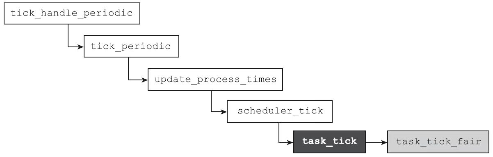

在scheduler_tick函数中一个非常重要的调用是：

```c
curr->sched_class->task_tick(rq, curr, 0);
```

在Linux的实现中调度器采用了模块化的实现，任何一个调度类，都要实现task_tick这个函数。那这个task_tick函数要完成哪些使命呢？主要的工作是更新当前运行进程调度相关的统计信息，以及判断是否需要发生调度。

对于完全公平的调度而言，task_tick函数为：

```c
.task_tick      = task_tick_fair,
```

在task_tick_fair函数中，内核更新了正在运行的进程的时间统计，包括真实运行时间和虚拟运行时间，代码如下：

```c
static void task_tick_fair(struct rq *rq, struct task_struct *curr, int queued)
{
    struct cfs_rq *cfs_rq;
    struct sched_entity *se = &curr->se;
    /*为了支持组调度，引入了调度实体的概念*/
    for_each_sched_entity(se) {
        cfs_rq = cfs_rq_of(se);
        entity_tick(cfs_rq, se, queued);
    }
}
static void
entity_tick(struct cfs_rq *cfs_rq, struct sched_entity *curr, int queued)
{
    /*更新正在运行进程的统计信息*/
    update_curr(cfs_rq);
    update_entity_shares_tick(cfs_rq);
    ...
    /*如果可运行状态的进程个数大于1，检查是否可以抢占当前进程*/
    if (cfs_rq->nr_running > 1)
        check_preempt_tick(cfs_rq, curr);
}
```

时钟中断触发了周期性的调度任务，其中一项重要的任务就是通过updat_curr函数更新调度的统计信息。它随着时钟中断处理函数周期性地执行，更新进程的虚拟运行时间、真实运行时间和运行队列的最小虚拟运行时间等。

内核需要知道在什么时候调用schedule函数，而不能仅仅依靠用户程序显式地调用schedule函数。如果将schedule函数的发起完全委托给用户程序，那么用户程序可能会无止尽地执行下去，而导致其他进程饿死。内核提供了一个need_resched标志位来表明是否需要重新执行一次调度。很明显，伴随着时钟中断发生的周期性调度任务是一个非常好的时机来判断当前进程是否应该被抢占（另一个时机是进程从睡眠状态醒来时，try_to_wake_up函数也会判断是否需要设置need_resched标志位来抢占当前的进程）。

当运行队列上处于可运行状态的进程不止一个时，内核会调用check_preempt_tick函数来检查是否应该发生抢占。该函数确保了当前进程使用完自己的时间片后，可以及时地让出CPU:

```c
static void
check_preempt_tick(struct cfs_rq *cfs_rq, struct sched_entity *curr)
{
    unsigned long ideal_runtime, delta_exec;
    struct sched_entity *se;
    s64 delta;
    /*ideal_runtime记录进程应该运行的时间*/
    ideal_runtime = sched_slice(cfs_rq, curr);
    /* delta_exec记录进程真实运行的时间 */
    delta_exec = curr->sum_exec_runtime - curr->prev_sum_exec_runtime;
    /*如果实际运行时间超过了应该运行的时间，则需要调度出去，被抢占*/
    if (delta_exec > ideal_runtime) {
        /*resched_task 会负责设置need_resched标志位*/
        resched_task(rq_of(cfs_rq)->curr);
        clear_buddies(cfs_rq, curr);
        return;
    }
    ...
    /* 如果当前进程运行时间低于调度的最小粒度，则不允许发生抢占 */
    if (delta_exec < sysctl_sched_min_granularity)
        return;
    ...
}
```

进程有自己的完美运行时间，即本轮调度周期应得的时间片。如果本轮执行时间已经超出了时间片，就会执行resched_task函数，在该函数中会通过set_tsk_need_resched函数来设置need_resched标志位，告诉内核请尽快调用schedule函数。如果进程的本轮运行时间小于调度最小粒度，那么不允许发生抢占。

resched_task函数仅仅是设置标志位，并没有真正地执行进程切换。进程调度发生的时机之一是发生在中断返回时，check_preempt_tick函数是scheduler_tick函数的一部分，而scheduler_tick函数是中断处理程序的一部分。执行完中断处理，会检查need_resched标志位是否置位，如果置位，那就自然会调用schedule函数来执行切换。

### 新进程的加入

创建新进程中与调度相关的函数:

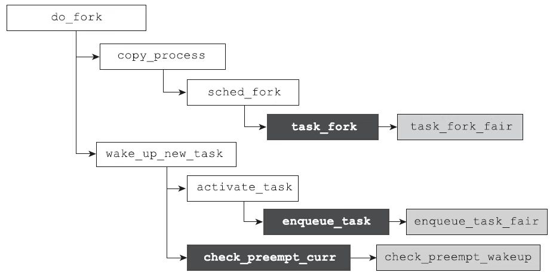

sched_fork函数的主要工作是初始化进程的与调度相关的变量，确定进程所属的调度类及优先级设置。根据进程所属的调度类，执行与调度类相关的函数。

调度类需要实现task_fork这个hook函数。该函数用于处理与新创建的进程相关的初始化事宜。对于完全公平调度类，该函数的实现为：

```c
     .task_fork      = task_fork_fair,
```

```c
static void task_fork_fair(struct task_struct *p)
{
    struct cfs_rq *cfs_rq = task_cfs_rq(current);
    struct sched_entity *se = &p->se, *curr = cfs_rq->curr;
    int this_cpu = smp_processor_id();
    struct rq *rq = this_rq();
    unsigned long flags;
    raw_spin_lock_irqsave(&rq->lock, flags);
    update_rq_clock(rq);
    if (unlikely(task_cpu(p) != this_cpu)) {
        rcu_read_lock();
        __set_task_cpu(p, this_cpu);
        rcu_read_unlock();
    }
    /*更新CFS调度类的队列,包括执行__update_curr更新当前进程统计 */
    update_curr(cfs_rq);
    /*新创建进程的vruntime初始化成父进程的vruntime，
    *紧随其后的place_entity函数会负责调整新创建进程的vruntime*/
    if (curr)
        se->vruntime = curr->vruntime;
    place_entity(cfs_rq, se, 1);
    /*如果设置了子进程先运行，并且父进程的vruntime小于子进程，则交换彼此的vruntime，确保子进程先执行*/
    if (sysctl_sched_child_runs_first && curr && entity_before(curr, se)) {
        swap(curr->vruntime, se->vruntime);
        resched_task(rq->curr);
    }
    /*此处减去当前运行队列的最小虚拟运行时间，*真正进入运行队列，即执行enqueue_entity时，*进程的vruntime会加上cfs_rq->vruntime*/
    se->vruntime -= cfs_rq->min_vruntime;
    raw_spin_unlock_irqrestore(&rq->lock, flags);
}
```

关于新进程，进程调度领域有两大悬疑：

- 新进程的虚拟运行时间到底是多少？
- 父子进程中哪个先执行？

#### 新创建进程的虚拟运行时间初始值

task_fork_fair函数中有以下内容：

```c
    if (curr)
        se->vruntime = curr->vruntime;
    place_entity(cfs_rq, se, 1);
```

从上面的函数中可以看出，新创建子进程的虚拟运行时间首先被初始化成父进程的虚拟运行时间，接下来会调用了place_entity函数，而place_entity函数会调整新创建进程的虚拟运行时间。

place_entity函数用来处理两种比较特殊的情况：

- 调整新创建进程的虚拟运行时间。
- 调整从休眠中唤醒进程的虚拟运行时间。

place_entity函数是如何调整新创建进程的虚拟运行时间的，代码如下:

```c
static void
place_entity(struct cfs_rq *cfs_rq, struct sched_entity *se, int initial)
{
    u64 vruntime = cfs_rq->min_vruntime;
    if (initial && sched_feat(START_DEBIT))
        vruntime += sched_vslice(cfs_rq, se);…vruntime = max_vruntime(se->vruntime, vruntime);se->vruntime = vruntime;
}
static u64 sched_vslice(struct cfs_rq *cfs_rq, struct sched_entity *se)
{
    return calc_delta_fair(sched_slice(cfs_rq, se), se);
}
```

完全公平调度类的运行队列cfs_rq中维护有成员变量min_vruntime，该变量存放的是此运行队列中的最小虚拟运行时间。就像前面所说的，它提供了一个基准值，通过它我们无须遍历队列上所有进程的虚拟运行时间，就可以得知该运行队列的整体情况了。大多数进程的虚拟值在该值附近，且略大于该值。

内核提供了很多调度的特性，记录在/sys/kernel/debug/sched_features中，如下所示：

```sh
$ sudo cat /sys/kernel/debug/sched_features
GENTLE_FAIR_SLEEPERS START_DEBIT NO_NEXT_BUDDY LAST_BUDDY CACHE_HOT_BUDDY WAKEUP_PREEMPTION NO_HRTICK NO_DOUBLE_TICK NONTASK_CAPACITY TTWU_QUEUE NO_SIS_AVG_CPU SIS_PROP NO_WARN_DOUBLE_CLOCK RT_PUSH_IPI NO_RT_RUNTIME_SHARE NO_LB_MIN ATTACH_AGE_LOAD WA_IDLE WA_WEIGHT WA_BIAS UTIL_EST
```

其中START_DEBIT特性是用来给新创建的进程略加惩罚的。如果没有START_DEBIT选项，子进程的虚拟运行时间为：

```
max(父进程的虚拟进程时间，CFS运行队列最小进程时间)
```

这个值通常比较小，这就意味着子进程很快就能获得调度的机会，因此也就给了恶意进程可乘之机。因为恶意进程可以通过不停地fork来获得更多的CPU时间。如果设置了START_DEBIT选项，会通过增大子进程的虚拟运行时间来惩罚新创建的进程，使新创建的进程晚一点才能获得被调度的机会。

打开了START_DEBIT特性，子进程的虚拟运行时间就会被初始化成：

```
max(父进程的虚拟进程时间，CFS运行队列最小进程时间 + 进程虚拟时间片)
```

#### 父子进程谁先执行

另一大悬案是父子进程哪个会先执行？内核提供了配置选项sched_child_runs_first，该值记录在：

```
/proc/sys/kernel/sched_child_runs_first
```

该配置选项是1的话，fork之后子进程将优先获得调度，如果是0的话，父进程将优先获得调度。内核版本自2.6.32开始，该值默认是0，即父进程优先执行。

task_fork_fair函数中有以下代码：

```c
    if (sysctl_sched_child_runs_first && curr && entity_before(curr, se)) {
        swap(curr->vruntime, se->vruntime);
        resched_task(rq->curr);
    }
```

如果要设置子进程优先获得调度，则会通过entity_before函数来比较父子进程的vruntime，如果父进程的vruntime小，则需要和子进程互换vruntime以确保子进程优先获得调度。

但是正如Linus在邮件中提到的，无论是父进程先运行还是子进程先运行，内核控制选项提供的是一种倾向或偏好（preference），而不是一种保证（guarantees）。在编写应用程序时，无论内核参数sched_child_runs_first为何值，都不能作为作为父进程或子进程先运行的保证，如果需要保证运行次序，程序需要使用其他同步方法来确保运行的次序。

继续分析task_fork_fair函数。在该函数中有一条语句非常奇怪，该语句代码如下：

```c
se->vruntime -= cfs_rq->min_vruntime;
```

为何要减掉运行队列的最小虚拟运行时间？

因为在do_fork的末尾会调用wake_up_new_task函数。事实上在对称多处理器结构上，新创建的进程和父进程不一定在同一个CPU上运行。进程刚刚创建好，尚未运行，这是多个CPU之间负载均衡的一个良机。Linux也是这么做的，在wake_up_new_task函数中会首先调用如下语句，选择一个合适的CPU：

```c
set_task_cpu(p, select_task_rq(p, SD_BALANCE_FORK, 0));
```

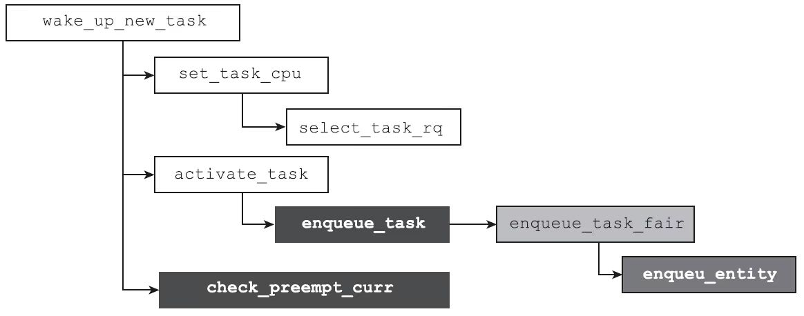

很不幸的是，不同的CPU之间负载并不完全相同，有的CPU更忙一些，而且每个CPU都有自己的运行队列cfs_rq，不同的CPU运行队列的最小虚拟运行时间min_vruntime并不相同。如果新创建的进程从一个CPU的运行队列迁移到另外一个CPU的运行队列，就可能会产生问题。比如新创建的进程从min_vruntime小的CPU A跳到min_vruntime非常大的CPU B，它就会占便宜，因为它的虚拟运行时间会在相当长的时间范围内都是最小的，从而产生调度的不公平。

解决的方法非常简单：

```
迁移前：进程的虚拟运行时间 -= 迁移前所在CPU队列的最小虚拟运行时间
迁移后：进程的虚拟运行时间 += 迁移后所在CPU运行队列最小虚拟运行时间
```

enqueue_task也是调度类的hook函数，每一个调度类都要实现该函数，对于完全公平的调度而言：

```c
.enqueue_task       = enqueue_task_fair,
```

在enqueue_task_fair函数中，会调用enqueue_entity函数，在该函数中有以下语句和task_fork_fair函数相呼应：

```c
static void task_fork_fair(struct task_struct *p)
{se->vruntime -= cfs_rq->min_vruntime;
}
static void
enqueue_entity(struct cfs_rq *cfs_rq, struct sched_entity *se, int flags)
{
    ...if (!(flags & ENQUEUE_WAKEUP) || (flags & ENQUEUE_WAKING))
         se->vruntime += cfs_rq->min_vruntime;...
}
```

事实上该解决方案不仅仅只是用于新创建的进程这一个场景。Linux支持CPU之间的负载均衡，可以将进程从一个CPU迁移到另外一个CPU，为了防止不公平的产生，也采用了上述的解决方案。

创建新的进程不仅是CPU之间负载均衡的良机，也是检测是否可以发生抢占的良机。因此，wake_up_new_task在最后会调用check_preempt_curr函数。该函数会负责检查可否抢占当前的运行进程。

### 睡眠进程醒来

睡眠进程的虚拟运行时间会保持不变吗？

当内核调用wake_up系列宏时，会执行运行队列元素中指定的回调函数，而回调函数通常是default_wake_function。该函数是try_to_wake_up的简单封装，因此当进程被内核唤醒时，内核通常会执行try_to_wake_up函数。

概括地讲，try_to_wake_up函数的职责是：

1. 把从休眠中醒来的进程放到合适的运行队列。
2. 将进程的状态设置为TASK_RUN-NING。
3. 判断醒来的进程是否应该抢占当前正在运行的进程，如果是，则设置need_resched标志位。

try_to_wake_up函数:

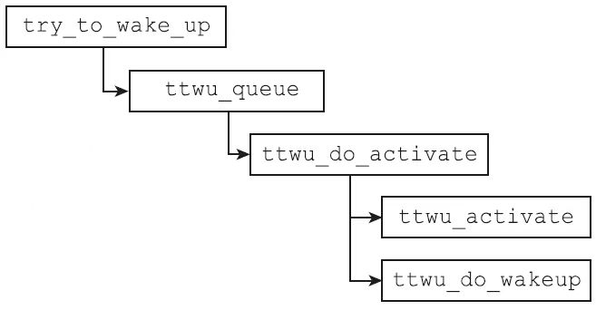

try_to_wake_up三个主要任务及对应的负责函数:

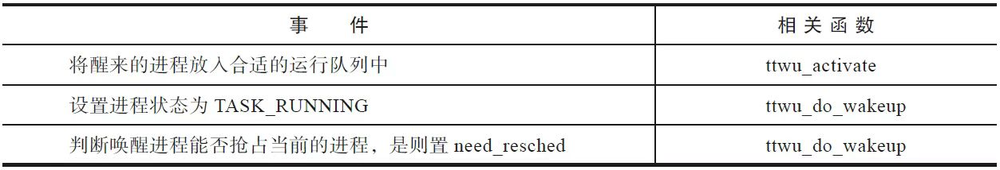

activate函数相关流程:

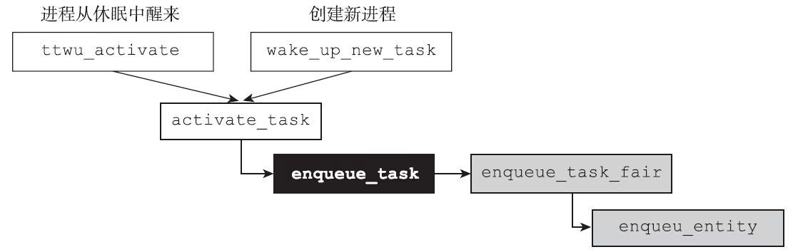

activate_task函数和deactivate_task函数一样，都是调度框架内的重要函数，并且两者是一对，就好像wake_up和wait_event是一对一样。当进程调用wait_event时，进程从可运行状态变成睡眠状态，因此需要通过deactivate_task函数将进程从运行队列中移除，与此对应的，当内核调用wake_up函数把进程从休眠状态唤醒时，内核需要通过activate_task函数将进程放入运行队列中。如果对5.4.3节创建新进程还有印象的话，可以看到无论是创建新进程，还是唤醒休眠进程，都会执行到该函数。

enqueue_task_fair很大部分的工作是更新调度相关的统计，CFS的enqueue_task_fair函数：

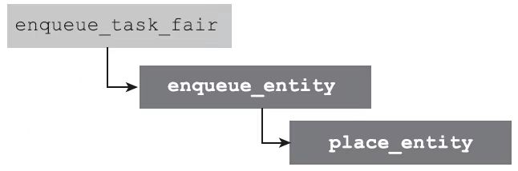

这条路径之所以很重要，是因为它决定了休眠进程醒来后的虚拟运行时间。回到本节开头的问题：休眠进程的虚拟运行时间会保持不变吗？答案是否定的。很多进程可能会长时间地休眠，在这个过程中，如果虚拟运行时间vruntime保持不变，一旦该进程醒来，它的vruntime就会比运行队列上的其他进程小很多，因为会长时间保持调度的优势。这显然是不合理的。对于这种情况，完全公平调度的做法是，以运行队列的min_vruntime为基础，给予一定的补偿。

place_entity函数, 在创建新进程时，曾经走到过该函数，那时该函数负责决定新进程的虚拟运行时间。下面来看看对于被唤醒的休眠进程，该函数是如何决定进程的虚拟运行时间的：

```c
static void
place_entity(struct cfs_rq *cfs_rq, struct sched_entity *se, int initial)
{
    u64 vruntime = cfs_rq->min_vruntime;
    ...
    /*从休眠中醒来*/
    if (!initial) {
        /*补偿一个调度周期*/
        unsigned long thresh = sysctl_sched_latency;
        /*如果设置了GENTLE_FAIR_SLEEPERS,则补偿半个调度周期*/
        if (sched_feat(GENTLE_FAIR_SLEEPERS))
            thresh >>= 1;
        vruntime -= thresh;
    }
    vruntime = max_vruntime(se->vruntime, vruntime);
    se->vruntime = vruntime;
}
```

当initial等于0时，表示正在处理从休眠中醒来的进程。如果没有设置GENTLE_FAIR_SLEEPERS特性，那么在队列最小虚拟运行时间的基础上，补偿1个调度延迟，如果设置了GENTLE_FAIR_SLEEPERS，那么补偿减半，即补偿半个调度延迟。默认情况下，GENTLE_FAIR_SLEEPER的特性是打开的。

但休眠进程醒来后的虚拟运行时间并非只是简单粗暴地设置成队列的最小运行时间减掉补偿值。影响因素还有进程原本的虚拟运行时间，如下所示：

```
vruntime = max_vruntime(se->vruntime, vruntime);
```

如果休眠进程的睡眠时间非常短，很有可能进程原本的虚拟运行时间要大于上述计算得到的值，此时，休眠进程的虚拟运行时间不变，即为睡眠前的值。如果休眠进程的睡眠时间特别久，么就将虚拟运行时间设置为所在运行队列的最小虚拟运行时间减去补偿量。

从上面的代码可以看出，从长时间休眠中醒来的进程，因为其虚拟运行时间较小（比队列的最小虚拟运行时间还小），所以会获得优先的调度，从而使交互型进程得到及时的响应。

### 唤醒抢占

无论是try_to_wake_up唤醒睡眠的进程还是wake_up_new_task唤醒新创建的进程，内核都会使用check_preempt_curr函数来检查新唤醒的进程或新创建进程是否可以抢占当前运行的进程:

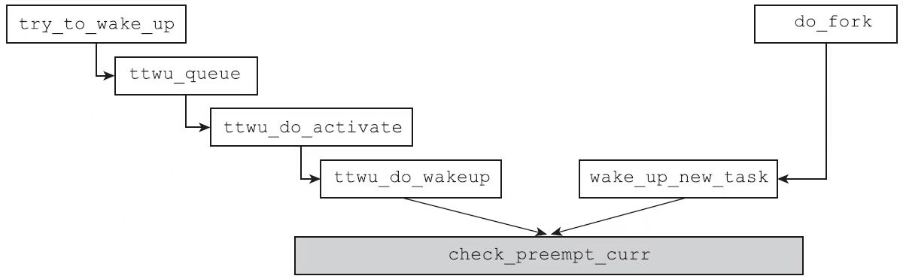

判断是否应该抢占的工作被委托给了check_preempt_curr函数来完成。

```c
static void check_preempt_curr(struct rq *rq, struct task_struct *p, int flags)
{
    const struct sched_class *class;
    if (p->sched_class == rq->curr->sched_class) {
        rq->curr->sched_class->check_preempt_curr(rq, p, flags);
    } else {/*for_each_class，从高优先级的调度类到低优先级的调度类*/
        for_each_class(class) {
        /*如果候选进程的调度类低于当前进程所属的调度类，就直接跳出。不许低优先级的调度类抢占高优先级的调度类*/
            if (class == rq->curr->sched_class)
                break;
        /*如果候选进程所属的调度类优先级高于当前进程的调度类，则通过执行resched_task函数，设置need_resched标志位*/
            if (class == p->sched_class) {
                resched_task(rq->curr);
                break;
            }
        }
    }
    if (rq->curr->on_rq && test_tsk_need_resched(rq->curr))
        rq->skip_clock_update = 1;
}
```

判断能否发生抢占的逻辑异常简单，也是符合正常人思维的：

- 如果候选进程和正在运行的进程属于同一个调度类，那么调度类内部提供方法解决。
- 如果候选进程和正在运行的进程属于不同的调度类，候选进程所属调度类的优先级高于正在运行进程的调度类的优先级，则可以抢占，否则不可以。

注意新唤醒的进程不一定是普通进程，也可能是实时进程。如果唤醒的进程是实时进程而当前运行的进程为普通进程，则会设置need_resched标志位，因为实时进程总是会抢占CFS调度域的普通进程。

每一种调度类都应该实现自己的check_preempt_cur函数来判断是否需要发生抢占，对于完全公平调度类，check_preempt_cur的实现为check_preempt_wakeup函数。

```c
  .check_preempt_curr = check_preempt_wakeup,
```

如果候选进程和正在运行的进程都属于完全公平调度类，那么候选进程到底会不会抢占当前运行的进程呢？哪些因素会影响到抢占行为呢？

如果被唤醒的进程的睡眠时间非常久（上百毫秒、几百毫秒、几秒甚至更久），前面的place_entity函数会将睡眠进程的虚拟运行时间设置为队列的最小虚拟运行时间减掉补偿的半个调度周期，这会使睡眠进程的虚拟运行时间非常的小，醒来时几乎总是会抢占当前的进程，这种行为也是期待的行为，因为它可以保证交互型进程的响应时间。

但是也有很多进程的睡眠时间非常短暂（比如只有几毫秒甚至更短），醒来之后通过place_entity函数计算得出的虚拟运行时间值仍然是自己本来的虚拟运行时间值。如果仅仅比较醒来的进程和当前运行进程的虚拟运行时间来决定是否抢占，那么很可能会使得抢占过于频繁[插图]。因此Linux引入了唤醒抢占粒度sched_wakeup_granularity_ns，可以通过如下方法来查看系统的唤醒抢占粒度sched_wakeup_granularity_ns的值：

```sh
cat /proc/sys/kernel/sched_wakeup_granularity_ns
2000000
```

引入该最小粒度后，唤醒进程抢占当前进程的条件是：只有当唤醒进程的vruntime小，并且两者的差值vdiff大于sched_wakeup_granularity_ns时，才能抢占。具体的算法实现如下：

```c
static int
wakeup_preempt_entity(struct sched_entity *curr, struct sched_entity *se)
{
    s64 gran, vdiff = curr->vruntime - se->vruntime;
    if (vdiff <= 0)
        return -1;
    gran = wakeup_gran(curr, se);
    if (vdiff > gran)
        return 1;
    return 0;
}
static unsigned long
wakeup_gran(struct sched_entity *curr, struct sched_entity *se)
{
    unsigned long gran = sysctl_sched_wakeup_granularity;
    return calc_delta_fair(gran, se);
}
```

如果系统的唤醒抢占太过频繁，大量的上下文切换会影响系统的整体性能。这种情况下可以通过调整sched_wakeup_granularity_ns的值来解决，sched_wakeup_granularity_ns的值越大，发生唤醒抢占就越不容易。注意sched_wakeup_granularity_ns的值不要超过调度周期sched_latency_ns的一半，否则的话，就相当于禁止唤醒抢占了。

## 实时进程

对于普通进程来说，完全公平调度已经能够提供足够好的性能和响应体验了。但是某些进程对实时性的要求更高。严格说来实时系统可以分成两类：硬实时进程和软实时进程。

- 硬实时进程对响应时间的要求非常严格，必须保证在一定的时间内完成，超过时间限制就会失败，而且后果非常严重。这类应用典型的例子有军用武器系统、航空航天系统、交通导航系统、医疗设备等。硬实时的关键特征是任务必须在可保证的时间范围内得到处理。当然这并不意味所要求的时间范围特别短，而是系统必须保证绝不会超过某一时间范围，无论当时系统的负载如何。主流内核的Linux并不支持硬实时进程，当然有些修改版本提供了该特性。
- 软实时进程是硬实时的一种弱化形式。尽管软实时进程仍然需要快速响应和要在规定的时间内完成，但是超过了时间的范围也不会有什么灾难性的后果。比较典型的例子是视频处理应用，如果超过了操作时限，则会影响用户体验，但是少量的丢帧还是可以忍受的。

### 实时进程调度策略和优先级

Linux提供了两种实时调度的策略：先进先出（SCHED_FIFO）策略和时间片轮转（SCHED_RR）策略。无论进程使用哪种实时策略，其优先级都会高于前面介绍的采用完全公平调度的普通进程。

实时进程也有一个优先级的范围。Linux中为实时进程提供了99个实时优先级。从内核层面看，从0到99范围内的优先级属于实时调度范围，从100到139共40个等级属于前面讨论过的完全公平调度的优先级。其中创建普通进程的时候，其优先级的值为完全公平调度中的中间值120。从整体来看，优先级的值越低，其优先级就越高。

事实上每个CPU都有实时运行队列。根据99种离散的优先级可知，共有99个队列。具有相同优先级的实时进程都保存在一个队列之中。这使得在实时调度类中选择下一个运行的进程也就比较简单了，按照优先级从高到低的顺序，选择存在可运行进程的最高优先级队列中的第一个进程即可。事实上内核中还维护有位图来表征哪个优先级的运行队列有可运行的进程，相关结构体定义如下：

```c
  struct rt_prio_array {
       DECLARE_BITMAP(bitmap, MAX_RT_PRIO+1); /* include 1 bit for delimiter */
       struct list_head queue[MAX_RT_PRIO];
   };
struct rt_rq {
        struct rt_prio_array active;
}
```

实时进程的优先级队列:

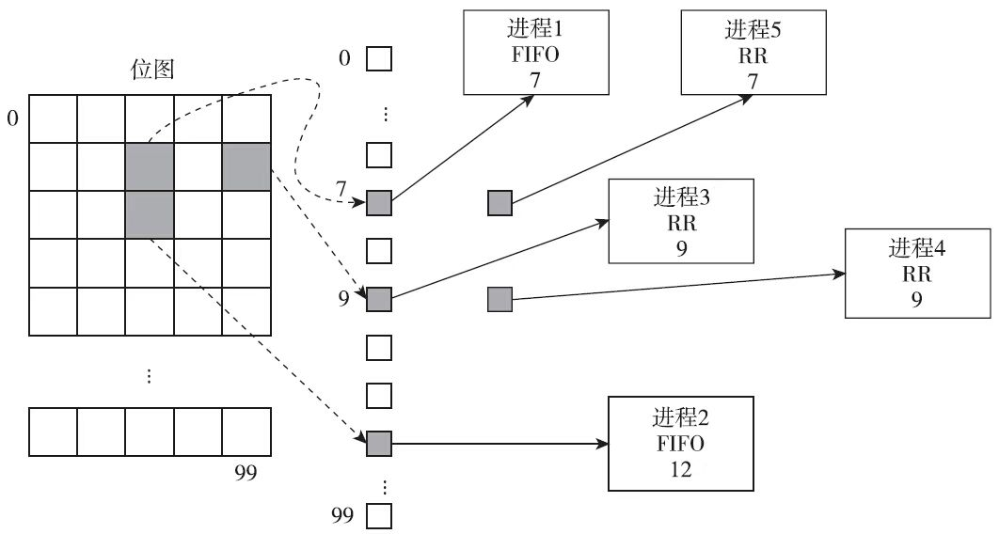

> 注意　对于实时进程而言，内核态的优先级和用户进程通过sched_setscheduler或sched_setparam系统调用设置的优先级并不相同：对于内核态而言，优先级的值越小，优先级就越高，而用户进程通过系统调用设置的优先级正好相反，优先级的值越大，优先级越高。两者的换算关系是：内核态优先级＝MAX_RT_PRIO－1－用户态优先级。其中MAX_RT_PRIO的值为100。

#### 1.SCHED_FIFO策略

SCHED_FIFO策略是一种比较简单的策略，即先进先出。

一旦一个调度策略为SCHED_FIFO的进程获得了CPU控制权，它就会始终占有CPU资源直到下面的某种情况发生：

- 自动放弃CPU资源，如执行了一个阻塞型的系统调用或调用了sched_yield系统调用，进程不再处于可执行状态。
- 进程终止了。
- 被一个优先级更高的进程抢占。

如果FIFO类型的进程通过sched_yield系统调用主动让出了CPU，那么内核会将该进程放到对应队列的尾部；如果进程被更高优先级的进程抢占，那么该进程在队列中的位置不变，一旦高优先级的进程停止执行，被抢占的FIFO类型的进程会继续执行。

#### 2. SCHED_RR策略

在时间片轮转的策略中，具有相同优先级的进程轮流执行，进程每次使用CPU的时间为一个固定长度的时间片。

使用SCHED_RR策略的实施进程一旦被调度器选中，就会一直占有CPU资源，直到下面的某种情况发生：

- 时间片耗尽。
- 进程自动放弃CPU：或者执行了阻塞式的系统调用，或者主动执行sched_yield函数让出CPU资源。
- 进程终止了。
- 被更高优先级的进程抢占。

前两种情况下，SCHED_RR策略的进程会被放到其优先级运行队列的队尾。最后一种情况下，被抢占的SCHED_RR策略的实施进程仍然位于其运行队列的头部，在更高优先级的进程运行结束后，被抢占的进程会继续执行，直到其时间片的剩余部分耗光为止。

在时间片轮转策略中，时间片的长度是一个关键的参数。POSIX定义了接口来查询SCHED_RR策略的时间片长度：

```c
#include <sched.h>
int sched_rr_get_interval(pid_t pid, struct timespec * tp);
```

默认情况下，SCHED_RR类型进程的时间片总是100毫秒。如果内核版本不低于3.9，时间片的大小可以通过调整/proc/sys/kernel/sched_rr_timeslice_ms的值来调整。

伴随着时钟中断处理程序，scheduler_tick函数会根据当前进程的调度类执行对应的task_tick函数，如下所示：

```c
curr->sched_class->task_tick(rq, curr, 0);
```

实时调度类的task_tick函数为task_tick_rt，该函数的实现代码如下所示：

```c
static void task_tick_rt(struct rq *rq, struct task_struct*p, int queued)
{
    update_curr_rt(rq);
    watchdog(rq, p);
    /*FIFO类型没有时间片的概念，不会因为执行时间足够长而被抢占*/
    if (p->policy != SCHED_RR)
        return;
    /*如果时间片还没到，就直接返回*/
    if (--p->rt.time_slice)
        return;/*时间片已经耗尽，先将进程的时间片重新初始化为默认时间片*/
    p->rt.time_slice = DEF_TIMESLICE;
    /*如果队列上存在其他进程，则将自身移到队列的尾部，
         *并且设置need_resched标志位*/
    if (p->rt.run_list.prev != p->rt.run_list.next) {
        requeue_task_rt(rq, p, 0);
        set_tsk_need_resched(p);
    }
}
```

从上面的代码不难看出，采用SCHED_RR调度策略的实时进程，时间片大小为时钟滴答的整数倍。如果系统CONFIG_HZ为250，那么每4毫秒一个时钟滴答，即时间片大小总是4毫秒的整数倍。

现在的服务器上一般不止一个CPU，在多CPU系统上实时进程的负载均衡是需要解决的问题。严格来讲，对于具有N个CPU的系统，N个最高优先级的可运行状态的实时进程（如果存在大于等于N个实时进程的话）应该占据N个CPU核。对实时进程负载均衡这个话题感兴趣的话，可以阅读《Process Scheduling in Linux》。

#### 3.SCHED_OTHER策略

SCHED_OTHER策略不属于实时调度的范畴。SCHED_OTHER和下面要讨论的SCHED_BATCH、SCHED_IDLE策略同属于完全公平调度的范畴。事实上，我们遇到的大多数进程都是属于SCHED_OTHER的调度策略。

前面讨论的是nice值在-20~19范围内的进程，都是属于SCHED_OTHER的调度策略。在这种调度策略下，不同的nice值，意味着不同的时间片权重。优先级越高的普通进程，将获得越多的CPU时间。

#### 4.SCHED_BATCH策略

尽管可以通过POSIX实时调度的API设置进程的策略为SCHED_BATCH，但是SCHED_BATCH策略并不属于实时调度的策略。

SCHED_BATCH策略是在Linux 2.6.16的内核中加入的。最初引入这个策略的目的是告知内核，指定这个策略的进程并非交互型的进程，不需要根据休眠时间更改优先级。

这个策略主要用于早期的O（1）调度器，对于完全公平的调度，SCHED_BATCH策略和SCHED_OTHER策略几乎一样。

#### 5.SCHED_IDLE策略

SCHED_IDLE策略也隶属于完全公平调度的范畴。采取SCHED_IDLE调度策略的进程拥有非常低的优先级，比nice值为19的进程的优先级还要低（nice值是19的进程，其权重是15，采用SCHED_IDLE调度策略的进程其权重是3）。一般来说，该策略用于运行优先级非常低的进程，通常在系统中没有其他任务需要使用CPU时这些任务才会运行。

完全公平调度类中负责检查是否应该唤醒抢占的check_preempt_wakeup函数中有如下的语句：

```c
    if (unlikely(curr->policy == SCHED_IDLE) &&
        likely(p->policy != SCHED_IDLE))
        goto preempt;
```

这段代码表明，在CFS调度域内，如果醒来的候选进程采用的不是SCHED_IDLE策略，而当前运行的进程采用的调度策略是SCHED_IDLE，那么抢占总是会发生。

### 实时调度相关API

Linux下可以通过sched_setscheduler函数来修改进程的调度策略及优先级，其接口定义如下：

```c
#include <sched.h>
int sched_setscheduler(pid_t pid, int policy,
                           const struct sched_param *param);
struct sched_param {
     ...
     int sched_priority;
     ...
}
```

该接口用于修改pid对应进程的调度策略和优先级。当pid等于0时，修改函数调用进程的调度策略和优先级。策略和优先级的有效值如下表所示。

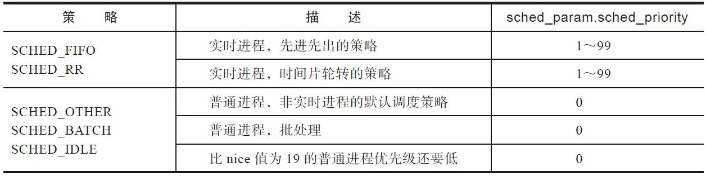

通过fork创建的子进程会保持父进程的调度策略和优先级。有些时候，不希望子进程继承父进程的调度策略和优先级，尤其是父进程是实时进程或nice值是负值的时候。Linux自2.6.32版本开始，提供了SCHED_RESET_ON_FORK选项，一旦设置了该选项，子进程就不会继承父进程的调度策略或nice值了。可通过如下代码设置该标志位：

```c
ret = sched_setscheduler(0, SCHED_RR |SCHED_RESET_ON_FORK, &sp);
```

- 如果调用进程的调度策略是SCHED_FIFO或SCHED_RR，那么将fork创建出来的子进程调度策略重设成SCHED_OTHER。
- 如果调用进程的nice值是负值，那么将fork创建出来的进程的nice值重新设置成0。

可以通过ps命令的输出来查看进程的调度策略和优先级：

 ```c
 $ ps -p 84624 -o pid,cmd,sched,rtprio,pri
     PID CMD                         SCH RTPRIO PRI
   84624 mysqld --default-authentica   0      -  19
 
 $ ps -p 11 -o pid,cmd,sched,rtprio,pri
     PID CMD                         SCH RTPRIO PRI
      11 [migration/0]                 1     99 139
 ```

在sched字段中SCHED_OTHER、SCHED_FIFO、SCHED_RR、SCHED_BATCH和SCHED_IDLE对应的值分别为0、1、2、3和5。

### 限制实时进程运行时间

实时进程的优先级高于普通进程，如果实时进程处于可执行的状态，那么普通进程无法获得CPU资源。如果使用实时调度策略的进程出现了bug，始终处于可运行的状态，系统将不会调度其他普通进程。这种情况是非常危险的，系统很可能会失去控制，而用户甚至超级用户也无能为力。

为了防止出现这种情况，系统做了改进，纵然始终存在可以运行的实时进程，仍然允许普通进程获得一定的CPU时间。

系统提供了控制选项来控制单位时间内最多分配多少CPU时间给实时进程。在Linux中，这两个控制参数为：

```sh
# uyouii @ VM-0-8-ubuntu in ~ [22:42:56]
$ sysctl -n kernel.sched_rt_period_us
1000000

# uyouii @ VM-0-8-ubuntu in ~ [22:43:03]
$ sysctl -n kernel.sched_rt_runtime_us
950000
```

这两个参数的含义是在以sched_rt_period_us为一个周期的时间内，所有实时进程运行的时间总和不超过sched_rt_runtime_us。这两个配置项的默认值为1秒和0.95秒，表示每秒钟为一个周期，所有实时进程运行的总时间不超过0.95秒，剩下的0.05秒留给普通进程。有了这个机制，哪怕始终有实时进程处于TASK_RUNNING状态，普通进程也能获得运行的机会。

如果在一个周期的时间内，实时进程对CPU的需求不足0.95秒，那么剩余的时间都会分配给普通的进程。而如果实时进程对CPU的需求大于0.95秒，它也只能够运行0.95秒，剩下的0.05秒留给其他普通进程。但是如果0.05秒内并没有任何普通进程处于可运行状态，实时进程能否运行超过0.95秒吗？答案还是不能，内核宁可让CPU闲着，也不给实时进程使用。

但是前面讨论的场景都是单CPU的场景，如果存在N个CPU，那么所有CPU上的所有实时进程占有CPU的上限应该为N*sched_rt_runtime_us/sched_rt_period_us。有的CPU上实时进程对CPU的需求超过sched_rt_runtime_us，而有的CPU上实时进程对CPU的需求不足sched_rt_runtime_us，因此内核允许CPU之间互相拆借。若实时进程在CPU上占用的时间超过了sched_rt_runtime_us，则该实时进程会尝试去其他CPU上借时间，将其他CPU剩余的时间借过来。这样做的好处是避免了进程在CPU之间迁移导致的上下文切换、缓存失效等开销。这部分逻辑出现在kernel/sched_rt.c中的sched_rt_runtime_exceeded函数，该函数会通过balance_runtime函数向其他CPU借用时间。

事实上，实时进程也支持组调度，可以控制一组实时进程（task_group）占用的CPU时间，将CPU占用的管理分配得更加细致。

## CPU的亲和力

在对称多处理器（SMP）环境中，一个进程被重新调度时，不一定是在上次执行的CPU上运行。

同一个进程在不同CPU之间迁移会带来性能的损失，损失的主要原因在于缓存。在进程迁移到新的处理器上后写入新数据到内存时，原有处理器的缓存就过期了。当进程在不同处理器之间迁移时，会带来两方面的性能损失：

1. 进程不能访问老的缓存数据；
2. 原处理器中缓存中的数据必须标记为无效。

由于迁移会带来性能损失，因此进程调度器趋于把进程固定在一个处理器上执行。

如何查看进程当前运行在哪个CPU上？可以通过ps命令的PSR字段来查看进程当前执行或上一次执行时所在的CPU编号。因为进程调度并不保证进程总是固定在某个CPU上，所以多次查看进程的PSR，其值可能会发生变化。

```sh
$ ps -p 84624 -o pid,cmd,psr
    PID CMD                         PSR
  84624 mysqld --default-authentica   1
```

有时候需要把进程绑定到某个或某几个CPU上运行。这就需要设置进程的CPU硬亲和力了。Linux提供了非标准的系统调用来获取和修改进程的硬亲和力：即sched_setaffinity函数和sched_getaffinity函数。

sched_setaffinity函数用来设置pid指定进程的CPU亲和力，如果pid的值为0，那么该函数用来修改调用进程的CPU亲和力。函数接口定义如下：

```c
#define _GNU_SOURCE
#include <sched.h>
int sched_setaffinity(pid_t pid, size_t cpusetsize,
                        cpu_set_t *mask);
```

nproc命令和lscpu命令都可以获取系统的CPU核数，代码如下：

```sh
$ lscpu
Architecture:                    x86_64
CPU op-mode(s):                  32-bit, 64-bit
Byte Order:                      Little Endian
Address sizes:                   46 bits physical, 48 bits virtual
CPU(s):                          2
On-line CPU(s) list:             0,1
```

通过proc文件系统的/proc/cpuinfo也可以获取CPU的核数。

可以通过下面的代码将某进程迁移到CPU 1上：

```c
cpu_set_t set;
/*必须首先调用CPU_ZERO清空，不可想当然地认为是空*/
CPU_ZERO(&set);
CPU_SET(1,&set);
sched_setaffinity(pid,sizeof(cpu_set_t),&set);
```

内核如何保证进程只会在某些CPU上执行？内核中的进程对应的进程描述符中有个cpumask_t类型的成员变量cpus_allowed，该成员变量会记住进程允许的CPU。内核在调度的时候会通过select_task_rq来选择CPU，只会选择出允许的CPU。

```c
static inline
int select_task_rq(struct task_struct *p, int sd_flags, int wake_flags)
{
    int cpu = p->sched_class->select_task_rq(p, sd_flags, wake_flags);
    if (unlikely(!cpumask_test_cpu(cpu, tsk_cpus_allowed(p)) ||
             !cpu_online(cpu)))
        cpu = select_fallback_rq(task_cpu(p), p);
    return cpu;
}
```

有个很有意思的话题是内核调用select_task_rq的时机：当新的进程创建出来时，当进程调用exec时，当进程从睡眠中醒来时，都是调用select_task_rq的好时机，可以通过这些时机来实现各个CPU之间的负载均衡。

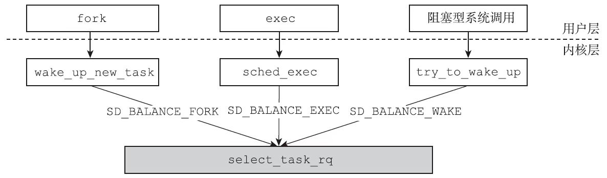

