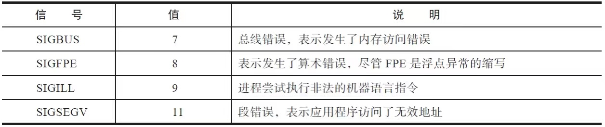

# 信号

信号是一种软件中断，用来处理异步事件。内核递送这些异步事件到某个进程，告诉进程某个特殊事件发生了。这些异步事件，可能来自硬件，比如访问了非法的内存地址，或者除以0了；可能来自用户的输入，比如shell终端上用户在键盘上敲击了Ctrl+C；还可能来自另一个进程，甚至有些来自进程自身。

信号的本质是一种进程间的通信，一个进程向另一个进程发送信号，内核至少传递了信号值这个字段。实际上，通信的内容不止是信号值。

## 信号完整的生命周期

信号的本质是一种进程间的通信。

信号产生了。这时候，Linux内核收到了产生的信号，然后就在目标进程的进程描述符里记录了一笔：收到信号SIGHUP一枚。Linux内核会在适当的时机，将信号递送（deliver）给进程。在内核收到信号，但是还没有递送给目标进程的这一段时间里，信号处于挂起状态，被称为挂起（pending）信号，也称为未决信号。内核将信号递送给进程，进程就会暂停当前的控制流，转而去执行信号处理函数。这就是一个信号的完整生命周期。

一个典型的信号会按照上面所述的流程来处理，但是实际情况要复杂得多，还有很多场景需要考虑，比如：

- 目标进程正在执行关键代码，不能被信号中断，需要阻塞某些信号，那么在这期间，信号就不允许被递送到进程，直到目标进程解除阻塞。
- 内核发现同一个信号已经存在，那么它该如何处理这种重复的信号，排队还是丢弃？
- 内核递送信号的时候，发现已有多个不同的信号被挂起，那它应该优先递送哪个信号？
- 对于多线程的进程，如果向该进程发送信号，应该由哪个线程来负责响应？

## 信号的产生

作为进程间通信的一种手段，进程之间可以互相发送信号，然而发给进程的信号，通常源于内核，包括：

- 硬件异常。
- 终端相关的信号。
- 软件事件相关的信号。

### 硬件异常

硬件检测到了错误并通知内核，由内核发送相应的信号给相关进程。

与硬件异常有关的信号：



常见的能触发SIGBUS信号的场景有：

- 变量地址未对齐：很多架构访问数据时有对齐的要求。比如int型变量占用4个字节，因此架构要求int变量的地址必须为4字节对齐，否则就会触发SIGBUS信号。
- mmap映射文件：使用mmap将文件映射入内存，如果文件大小被其他进程截短，那么在访问文件大小以外的内存时，会触发SIGBUS信号。

虽然SIGFPE的后缀FPE是浮点异常（Float Point Exception）的含义，但是该异常并不限于浮点运算，常见的算术运算错误也会引发SIGFPE信号。最常见的就是“整数除以0”的例子。

SIGILL的含义是非法指令（illegal instruction）。一般表示进程执行了错误的机器指令。

SIGSEGV:段错误信号，常见段错误的原因： 

- 访问未初始化的指针或NULL指针指向的地址。
- 进程企图在用户态访问内核部分的地址。
- 进程尝试去修改只读的内存地址。

一般是由程序自身引发的，不是由其他进程发送的信号引发的，并且这些异常都比较致命，以至于进程无法继续下去。所以这些信号产生之后，会立刻递送给进程。默认情况下，这四种信号都会使进程终止，并且产生core dump文件以供调试。对于这些信号，进程既不能忽略，也不能阻塞。

###  终端相关的信号

终端有很多的设置，可以通过执行如下指令来查看：

```sh
$ stty -a
speed 38400 baud; rows 50; columns 190; line = 0;
intr = ^C; quit = ^\; erase = ^?; kill = ^U; eof = ^D; eol = M-^?; eol2 = M-^?; swtch = <undef>; start = ^Q; stop = ^S; susp = ^Z; rprnt = ^R; werase = ^W; lnext = ^V; discard = ^O;
min = 1; time = 0;
-parenb -parodd -cmspar cs8 -hupcl -cstopb cread -clocal -crtscts
-ignbrk -brkint -ignpar -parmrk -inpck -istrip -inlcr -igncr icrnl ixon -ixoff -iuclc ixany imaxbel iutf8
opost -olcuc -ocrnl onlcr -onocr -onlret -ofill -ofdel nl0 cr0 tab0 bs0 vt0 ff0
isig icanon iexten echo echoe echok -echonl -noflsh -xcase -tostop -echoprt echoctl echoke -flusho -extproc
```

终端定义了如下几种信号生成字符：

- Ctrl+C：产生SIGINT信号。
- Ctrl+\：产生SIGQUIT信号。
- Ctrl+Z：产生SIGTSTP信号。

键入这些信号生成字符，相当于向前台进程组发送了对应的信号。

另一个和终端关系比较密切的信号是SIGHUP信号。很多程序员都遇到过这种问题：使用ssh登录到远程的Linux服务器，执行比较耗时的操作（如编译项目代码），却因为网络不稳定，或者需要关机回家，ssh连接被断开，最终导致操作中途被放弃而失败。

是因为一个控制进程在失去其终端之后，内核会负责向其发送一个SIGHUP信号。在登录会话中，shell通常是终端的控制进程，控制进程收到SIGHUP信号后，会引发如下的连锁反应。

shell收到SIGHUP后会终止，但是在终止之前，会向由shell创建的前台进程组和后台进程组发送SIGHUP信号，为了防止处于停止状态的任务接收不到SIGHUP信号，通常会在SIGHUP信号之后，发送SIGCONT信号，唤醒处于停止状态的任务。前台进程组和后台进程组的进程收到SIGHUP信号，默认的行为是终止进程，这也是前面提到的耗时任务会中途失败的原因。

注意，单纯地将命令放入后台执行（通过&符号，如下所示），并不能摆脱被SIGHUP信号追杀的命运。

```sh
command &
```

那么如何让进程在后台稳定地执行而不受终端连接断开的影响呢？

**1.nohup**

可以使用如下方式执行命令：

```sh
nohup command
```

标准输入会重定向到/dev/null，标准输出和标准错误会重定向到nohup.out，如果无权限写入当前目录下的nohup.out，则会写入home目录下的nohup.out。

**2.setsid**

使用如下方式执行命令：

```sh
setsid command
```

这种方式和nohup的原理不太一样。nohup仅仅是使启动的进程不再响应SIGHUP信号，但是setsid则完全不属于shell所在的会话了，并且其父进程也已经不是shell而是init进程了。

**3.disown**

很多情况下，启动命令时，忘记了使用nohup或setsid，可还有办法亡羊补牢？

答案是使用作业控制里面的disown。

使用disown之后，shell退出时，就不会向这些进程发送SIGHUP信号了。

> screen 命令也可以做到这一点，方法是重新创建会话和shell。

## 软件事件相关的信号

软件事件触发信号产生的情况也比较多：

- 子进程退出，内核可能会向父进程发送SIGCHLD信号。
- 父进程退出，内核可能会给子进程发送信号。
- 定时器到期，给进程发送信号。

与子进程退出向父进程发送信号相反，有时候，进程希望父进程退出时向自己发送信号，从而可以得知父进程的退出事件。Linux也提供了这种机制。

```c
int pdeath_signal;  /*  The signal sent when the parent dies  */
```

如果父进程退出，子进程希望收到通知，那么子进程可以通过执行如下代码来做到：

```c
prctl(PR_SET_PDEATHSIG, sig);
```

父进程退出时，会遍历其子进程，发现有子进程很关心自己的退出，就会向该子进程发送子进程希望收到的信号。

很多定时器相关的函数，背后都牵扯到信号。


## 信号的默认处理函数

很多信号尤其是传统的信号，都会有默认的信号处理方式。如果我们不改变信号的处理函数，那么收到信号之后，就会执行默认的操作。

信号的默认操作有以下几种：

- 显式地忽略信号：即内核将会丢弃该信号，信号不会对目标进程产生任何影响。
- 终止进程：很多信号的默认处理是终止进程，即将进程杀死。
- 生成核心转储文件并终止进程：进程被杀死，并且产生核心转储文件。核心转储文件记录了进程死亡现场的信息。用户可以使用核心转储文件来调试，分析进程死亡的原因。
- 停止进程：停止进程不同于终止进程，终止进程是进程已经死亡，但是停止进程仅仅是使进程暂停，将进程的状态设置成TASK_STOPPED，一旦收到恢复执行的信号，进程还可以继续执行。
- 恢复进程的执行：和停止进程相对应，某些信号可以使进程恢复执行。

这5种行为的简单标记如下：

- ignore
- terminate
- core
- stop
- continue

事实上，根据信号的默认操作，可以将传统信号分成5派：

ignore派的信号:


terminate派的信号：


core派的信号：


stop派的信号：


continue派的信号：


信号的这些默认行为是非常有用的。比如停止行为和恢复执行。系统可能有一些备份的工作，这些工作优先级并不高，但是却消耗了大量的I/O资源，甚至是CPU资源（比如需要先压缩再备份）。这样的工作一般是在夜深人静，业务稀少的时候进行的。在业务比较繁忙的情况下，如果备份工作还在进行，则可能会影响到业务。这时候停止和恢复就非常有用了。在业务繁忙之前，可以通过SIGSTOP信号将备份进程暂停，在几乎没有什么业务的时候，通过SIGCONT信号使备份进程恢复执行。

很多信号产生核心转储文件也是非常有意义的。一般而言，程序出错才会导致SIGSEGV、SIGBUS、SIGFPE、SIGILL及SIGABRT等信号的产生。生成的核心转储文件（core dump）保留了进程死亡的现场，提供了大量的信息供程序员调试、分析错误产生的原因。核心转储文件的作用有点类似于航空中的黑盒子，可以帮助程序员还原事故现场，找到程序漏洞。

很多情况下，默认的信号处理函数，可能并不能满足实际的需要，这时需要修改信号的信号处理函数。信号发生时，不执行默认的信号处理函数，改而执行用户自定义的信号处理函数。为信号指定新的信号处理函数的动作，被称为信号的安装。glibc提供了signal函数和sigaction函数来完成信号的安装。

## 信号的分类

在Linux的shell终端，执行kill-l，可以看到所有的信号：

```sh
 1) SIGHUP      2) SIGINT         3) SIGQUIT        4) SIGILL          5) SIGTRAP
 6) SIGABRT     7) SIGBUS         8) SIGFPE         9) SIGKILL        10) SIGUSR1
11) SIGSEGV    12) SIGUSR2       13) SIGPIPE       14) SIGALRM        15) SIGTERM
16) SIGSTKFLT  17) SIGCHLD       18) SIGCONT       19) SIGSTOP        20) SIGTSTP
21) SIGTTIN    22) SIGTTOU       23) SIGURG        24) SIGXCPU        25) SIGXFSZ
26) SIGVTALRM  27) SIGPROF       28) SIGWINCH      29) SIGIO          30) SIGPWR
31) SIGSYS      34) SIGRTMIN     35) SIGRTMIN+1   36) SIGRTMIN+2  37) SIGRTMIN+3
38) SIGRTMIN+4  39) SIGRTMIN+5   40) SIGRTMIN+6   41) SIGRTMIN+7  42) SIGRTMIN+8
43) SIGRTMIN+9  44) SIGRTMIN+10  45) SIGRTMIN+11  46) SIGRTMIN+12 47) SIGRTMIN+13
48) SIGRTMIN+14 49) SIGRTMIN+15  50) SIGRTMAX-14  51) SIGRTMAX-13 52) SIGRTMAX-12
53) SIGRTMAX-11 54) SIGRTMAX-10  55) SIGRTMAX-9   56) SIGRTMAX-8  57) SIGRTMAX-7
58) SIGRTMAX-6  59) SIGRTMAX-5   60) SIGRTMAX-4   61) SIGRTMAX-3  62) SIGRTMAX-2
63) SIGRTMAX-1  64) SIGRTMAX
```

这些信号可以分成两类：

- 可靠信号。
- 不可靠信号。

信号值在[1，31]之间的所有信号，都被称为不可靠信号；在[SIGRTMIN，SIGRTMAX]之间的信号，被称为可靠信号。

所谓不可靠，指的是发送的信号，内核不一定能递送给目标进程，信号可能会丢失。

对于不可靠信号，内核用位图来记录该信号是否处于挂起状态。如果收到某不可靠信号，内核发现已经存在该信号处于未决状态，就会简单地丢弃该信号。因此发送不可靠信号，信号可能会丢失，即内核递送给目标进程的次数，可能小于信号发送的次数。

对于可靠信号，内核内部有队列来维护，如果收到可靠信号，内核会将信号挂到相应的队列中，因此不会丢失。严格说来，内核也设有上限，挂起信号的个数也不能无限制地增大，因此只能说，在一定范围之内，可靠信号不会被丢弃。

> 注意　如果细心观察从kill-l列出的信号，可以看出，其中少了32号信号和33号信号。这两个信号（SIGCANCEL和SIGSETXID）被NPTL这个线程库征用了，用来实现线程的取消。从内核层来说，32号信号应该是最小的实时信号（SIGRTMIN），但是由于32号和33号被glibc内部征用了，所以glibc将SIGRTMIN设置成了34号信号。

## 传统信号的特点

glibc提供了signal函数来注册用户定义的信号处理函数，代码如下：

```c
#include <signal.h>
typedef void (*sighandler_t)(int);
sighandler_t signal(int signum, sighandler_t handler);
```

### 信号中断系统调用的重启特性

Linux操作系统提供了一个标志位SA_RESTART来告诉内核，被信号中断后是否要重启系统调用。如果该标志位为1，则表示如果系统调用被信号中断，那么内核会自动重启系统调用。

BSD风格的signal函数和glibc的函数，毫无意外地都带有该标志位：

```c
rt_sigaction(SIGINT, {0x8048736, [INT], SA_RESTART}, {SIG_DFL, [], 0}, 8) = 0
```

非常不幸的是，并不是所有的系统调用对信号中断都表现出同样的行为。某些系统调用哪怕设置了SA_RESTART的标志位，也绝不会自动重启。

设置了SA_RESTART标志位，中断后可以自动重启的系统调用:


设置了SA_RESTART标志位，中断后也无法自动重启的系统调用:


Linux系统会通过一些标志位和屏蔽信号集来完成对某些特性的控制。

- SA_ONESHOT（或SA_RESERTHAND）：将信号处理函数恢复成默认值。
- SA_NODEFER（或SA_NOMASK）：显式地告诉内核，不要将当前处理信号值添加进阻塞信号集。
- SA_RESTART：将中断的系统调用重启，而不是返回错误码EINTR。

## 信号的可靠性

### 信号可靠性差异的根源

可靠信号和不可靠信号存在着不小的差异。不可靠信号，不能可靠地被传递给进程处理，内核可能会丢弃部分信号。会不会丢弃，以及丢弃多少，取决于信号到来和信号递送给进程的时序。而可靠信号，基本不会丢失信号。

之所以存在这种差异，是因为重复的信号到来时，内核采取了不同的处理方式。从内核收到发给某进程的信号，到内核将信号递送给该进程，中间有个时间窗口。在这个时间窗口内，内核会负责记录收到的信号信息，这些信号被称为挂起信号或未决信号。但是对于可靠信号和不可靠信号，内核采取了不同的记录方式。

内核中负责记录挂起信号的数据结构为sigpending结构体，定义代码如下：

```c
struct sigpending {
        struct list_head list;
        sigset_t signal;
};
#define _NSIG           64
#define _NSIG_BPW      64
#define _NSIG_WORDS   (_NSIG / _NSIG_BPW)
typedef struct {
        unsigned long sig[_NSIG_WORDS];
} sigset_t;
```

在sigpending结构体中，sigset_t类型的成员变量signal本质上是一个位图，用一个比特来记录是否存在与该位置对应的信号处于未决的状态。根据位图可以有效地判断某信号是否已经存在未决信号。因为共有64种不同的信号，因此对于64位的操作系统，一个无符号的长整型就足以描述所有信号的挂起情况了。

在sigpending结构体中，第一个成员变量是个链表头。内核定义了结构体sigqueue，代码如下：

```c
struct sigqueue {
        struct list_head list;
        int flags;
        siginfo_t info;
        struct user_struct *user;
};
```

该结构体中info成员变量详细记录了信号的信息。如果内核收到发给某进程的信号，则会分配一个sigqueue结构体，并将该结构体挂入sigpending中第一个成员变量list为表头的链表之中。

内核的进程描述符提供了两套机制来记录挂起信号：**位图和队列**。

内核收到不可靠信号时，会检查位图中对应位置是否已经是1，如果不是1，则表示尚无该信号处于挂起状态，然后会分配sigqueue结构体，并将信号挂入链表之中，同时将位图对应位置置1。但是如果位图显示已经存在该不可靠信号，那么内核会直接丢弃本次收到的信号。换句话说，内核的sigpending链表之中，最多只会存在一个不可靠信号的sigqueue结构体。

内核收到可靠信号时，不论是否已经存在该信号处于挂起状态，都会为该信号分配一个sigqueue结构体，并将sigqueue结构体挂入sigpending的链表之中，以确保不会丢失信号。

那么可靠信号是不是可以无限制地挂入队列呢？也不是。实际上内核也做了限制，一个进程默认挂起信号的个数是有限的，超过限制，可靠信号也会变得没那么可靠了，也会丢失信号。限制项（RLIMIT_SIGPENDING）限制了目标进程所属的真实用户ID信号队列中挂起信号的总数。

可以通过如下命令来查看系统的限制：

```sh
$ ulimit -i
13293
```

这个挂起信号的上限值是可以修改的，可以用ulimit-i unlimited这个命令将进程挂起信号的最大值设为无穷大，从而确保内核不会主动丢弃实时信号。

## 信号的安装

Linux提供了新的信号安装方法：sigaction函数。和signal函数相比，这个函数的优点在于语义明确，可以提供更精确的控制。

先来看一下sigaction函数的定义：

```c
#include <signal.h>
int sigaction(int signum, const struct sigaction *act,
                 struct sigaction *oldact);
struct sigaction {
       void     (*sa_handler)(int);
       void     (*sa_sigaction)(int, siginfo_t *, void *);
       sigset_t   sa_mask;
       int       sa_flags;
       void     (*sa_restorer)(void);
};
```

sa_mask就是信号处理函数执行期间的屏蔽信号集。

需要特别指出的是，并不是所有的信号都能被屏蔽。对于SIGKILL和SIGSTOP，不可以为它们安装信号处理函数，也不能屏蔽掉这些信号。原因是，系统总要控制某些进程，如果进程可以自行设计所有信号的处理函数，那么操作系统可能无法控制这些进程。换言之，操作系统是终极boss，需要杀死某些进程的时候，要能够做到，SIGKILL和SIGSTOP不能被屏蔽，就是为了防止出现进程无法无天而操作系统徒叹奈何的困境。

> 注意　SIGKILL和SIGSTOP也不是万能的。如果进程处于TASK_UNINTERRUPTIBLE的状态，进程就不会处理信号。如果进程失控，长期处于该状态，SIGKILL也无法杀死该进程。

若通过sigaction强行给SIGKILL或SIGSTOP注册信号处理函数，则会返回-1，并置errno为EINVAL。

## 信号的发送

### kill、tkill和tgkill

kill函数的接口定义如下：

```c
#include <sys/types.h>
#include <signal.h>
int kill(pid_t pid, int sig);
```

**kill函数的作用是发送信号**。kill函数不仅可以向特定进程发送信号，也可以向特定进程组发送信号。

第一个参数pid的值，决定了kill函数的不同含义，具体来讲，可以分成以下几种情况。

- pid＞0：发送信号给进程ID等于pid的进程。
- pid＝0：发送信号给调用进程所在的同一个进程组的每一个进程。
- pid＝-1：有权限向调用进程发送信号的所有进程发出信号，init进程和进程自身除外。
- pid＜-1：向进程组-pid发送信号。

即调用kill函数时，第二个参数signo的值为0。众所周知，没有一个信号的值是为0的，这种情况下，kill函数其实并不是真的向目标进程或进程组发送信号，而是用来检测目标进程或进程组是否存在。如果kill函数返回-1且errno为ESRCH，则可以断定我们关注的进程或进程组并不存在。

Linux提供了tkill和tgkill两个系统调用来向某个线程发送信号：

```c
int tkill(int tid, int sig);
int tgkill(int tgid, int tid, int sig);
```

这两个都是内核提供的系统调用，glibc并没有提供对这两个系统调用的封装，所以如果想使用这两个函数，需要采用syscall的方式，如下：

```c
ret = syscall(SYS_tkill,tid,sig)
ret = syscall(SYS_tgkill,tgid,tid,sig)
```

为什么有了tkill，还要引入tgkill？实际上，tkill是一个过时的接口，并不推荐使用它来向线程发送信号。相比之下，tgkill接口更加安全。

tgkill系统调用的第一个参数tgid，为线程组中主线程的线程ID，或者称为进程号。这个参数表面看起来是多余的，其实它能起到保护的作用，防止向错误的线程发送信号。进程ID或线程ID这种资源是由内核负责管理的，进程（或线程）有自己的生命周期，比如向线程ID为1234的线程发送信号时，很可能线程1234早就退出了，而线程ID 1234恰好被内核分配给了另一个不相干的进程。这种情况下，如果直接调用tkill，就会将信号发送到不相干的进程上。为了防止出现这种情况，于是内核引入了tgkill系统调用，含义是向线程组ID是tgid、线程ID为tid的线程发送信号。这样，出现误杀的可能就几乎不存在了。

### raise函数

Linux提供了向进程自身发送信号的接口：raise函数，其定义如下：

```c
#include int raise(int sig);
```

这个接口对于单线程的程序而言，就相当于执行如下语句：

```c
kill(getpid(),sig)
```

这个接口对于多线程的程序而言，就相当于执行如下语句：

```c
pthread_kill(pthread_self(),sig)
```

执行成功的时候，返回0，否则返回非零的值，并置errno。如果sig的值是无效的，raise函数就将errno置为EINVAL。

信号处理函数执行完毕之后，raise才能返回。

### sigqueue函数

在信号发送的方式当中，sigqueue算是后起之秀，传统的信号多用signal/kill这两个函数搭配，完成信号处理函数的安装和信号的发送。后来因为signal函数的表达力有限，控制不够精准，所以引入了sigaction函数来负责信号的安装，与其对应的是，引入了sigqueue函数来完成实时信号的发送。当然了，sigqueue函数也能发送非实时信号。

sigqueue函数的接口定义如下：

```c
#include <signal.h>
int sigqueue(pid_t pid, int sig, const union sigval value);
```

sigqueue函数拥有和kill函数类似的语义，也可以发送空信号（信号0）来检查进程是否存在。和kill函数不同的地方在于，它不能通过将pid指定为负值而向整个进程组发送信号。

比较有意思的是函数的第三个入参，它指定了信号的伴随数据（或者称为有效载荷，payload），该参数的数据类型是联合体，定义代码如下：

```c
union sigval {
      int   sival_int;
      void *sival_ptr;
};
```

通过指定sigqueue函数的第三个参数，可以传递一个int值或指针给目标进程。考虑到不同的进程有各自独立的地址空间，传递指针到另一个进程几乎没有任何意义。因此sigqueue函数很少传递指针（sival_ptr），大多是传递整型（sival_int）。

sigval联合体的存在，扩展了信号的通信能力。一些简单的消息传递完全可以使用sigqueue函数来进行。比如，通信双方事先定义某些事件为不同的int值，通过sigval联合体，将事件发送给目标进程。目标进程根据联合体中的int值来区分不同的事件，做出不同的响应。但是这种方法传递的消息内容受到了限制，不容易扩展，所以不宜作为常规的通信手段。

一般来说，sigqueue函数的黄金搭档是sigaction函数。在使用sigaction函数时，只要给成员变量sa_flags置上SA_SIGINFO的标志位，就可以使用三参数的信号处理函数来处理实时信号。

三参数的信号处理函数如下：

```c
void   handle(int, siginfo_t *info, void *ucontext);
```

…

## 信号与线程的关系

POSIX标准对多线程情况下的信号机制提出了一些要求：

- 信号处理函数必须在多线程进程的所有线程之间共享，但是每个线程要有自己的挂起信号集合和阻塞信号掩码。
- POSIX函数kill/sigqueue必须面向进程，而不是进程下的某个特定的线程。
- 每个发给多线程应用的信号仅递送给一个线程，这个线程是由内核从不会阻塞该信号的线程中随意选出来的。
- 如果发送一个致命信号到多线程，那么内核将杀死该应用的所有线程，而不仅仅是接收信号的那个线程。

这些就是POSIX标准提出的要求，Linux也要遵循这些要求，那它是怎么做到的呢？

### 线程之间共享信号处理函数

对于进程下的多个线程来说，信号处理函数是共享的。

在Linux内核实现中，同一个线程组里的所有线程都共享一个struct sighand结构体。该结构体中存在一个action数组，数组共64项，每一个成员都是k_sigaction结构体类型，一个k_sigaction结构体对应一个信号的信号处理函数。

在创建线程时，最终会执行内核的do_fork函数，由do_fork函数走进copy_sighand来实现线程组内信号处理函数的共享。创建线程时，CLONE_SIGHAND标志位是置位的。创建线程组的主线程时，内核会分配sighand_struct结构体；创建线程组内的其他线程时，并不会另起炉灶，而是共享主线程的sighand_struct结构体，只须增加引用计数而已。

同一进程里的多个线程共享信号处理函数:


### 线程有独立的阻塞信号掩码

每个线程都拥有独立的阻塞信号掩码。

如果进程将某信号添加进了阻塞信号掩码，纵然内核收到了该信号，甚至该信号在挂起队列中已经存在了相当长的时间，内核也不会将信号递送给进程，直到进程解除对该信号的阻塞为止。

信号也是如此。进程在执行某些操作的时候，可能只需要屏蔽一部分信号，而不是所有信号。

为了实现掩码的功能，Linux提供了一种新的数据结构：信号集。多个信号组成的集合被称为信号集，其数据类型为sigset_t。在Linux的实现中，sigset_t的类型是位掩码，每一个比特代表一个信号。

Linux提供了两个函数来初始化信号集，如下：

```c
#include<signal.h>
int sigemptyset(sigset_t *set);
int sigfillset(sigset_t *set);
```

sigemptyset函数用来初始化一个空的未包含任何信号的信号集，而sigfillset函数则会初始化一个包含所有信号的信号集。

初始化信号之后，Linux提供了sigaddset函数向信号集中添加一个信号，同时还提供了sigdelset函数在信号集中移除一个信号：

```c
int sigaddset(sigset_t *set, int signum);
int sigdelset(sigset_t *set, int signum);
```

为了判断某一个信号是否属于信号集，Linux提供了sigismember函数：

```c
int sigismember(const sigset_t *set, int signum);
```

如果signum属于信号集，则返回1，否则返回0。出错的时候，返回-1。

有了信号集，就可以使用信号集来设置进程的阻塞信号掩码了。Linux提供了sigprocmask函数来做这件事情：

```c
#include <signal.h>
int sigprocmask(int how, const sigset_t *set, sigset_t *oldset);
```

对于多线程的进程而言，每一个线程都有自己的阻塞信号集。

```c
struct task_struct{
    sigset_t blocked;
}
```

sigprocmask函数改变的是调用线程的阻塞信号掩码，而不是整个进程。

为了更显式地设置线程的阻塞信号掩码，线程库提供了pthread_sigmask函数来设置线程的阻塞信号掩码：

```c
#include <signal.h>
int pthread_sigmask(int how, const sigset_t *set, sigset_t *oldset);
```

事实上pthread_sigmask函数和sigprocmask函数的行为是一样的。

### 私有挂起信号和共享挂起信号

POSIX标准中有如下要求：对于多线程的进程，kill和sigqueue发送的信号必须面对所有的线程，而不是某个线程，内核是如何做到的呢？而系统调用tkill和tgkill发送的信号，又必须递送给进程下某个特定的线程。内核又是如何做到的呢？

内核的进程描述符task_struct之中，维护了两套sigpending，代码如下所示：

```c
struct task_struct{
    ...
    struct signal_struct *signal;
    struct sighand_struct *sighand;
    struct sigpending pending;      ...
}
struct signal_struct {...
    struct sigpending       shared_pending;
    ...
}
```

信号挂起队列相关的数据结构:


内核就是靠两个挂起队列实现了POSIX标准的要求。在Linux实现中，线程作为独立的调度实体也有自己的进程描述符。Linux下既可以向进程发送信号，也可以向进程中的特定线程发送信号。因此进程描述符中需要有两套sigpending结构。其中task_struct结构体中的pending，记录的是发送给线程的未决信号；而通过signal指针指向signal_struct结构体的shared_pending，记录的是发送给进程的未决信号。每个线程都有自己的私有挂起队列（pending），但是进程里的所有线程都会共享一个公有的挂起队列（shared_pending）。

发送信号相关的内核处理流程:


在__send_signal函数中，通过group入参的值来判断需要将信号放入哪个挂起队列（如果需要进队列的话）。

```c
static int __send_signal(int sig, struct siginfo *info, struct task_struct *t,
           int group, int from_ancestor_ns)
{
    ...pending = group ? &t->signal->shared_pending : &t->pending;...
}
```

如果用户调用的是kill或sigqueue，那么group就是1；如果用户调用的是tkill或tgkill，那么group参数就是0。内核就是以此来区分该信号是发给进程的还是发给某个特定线程的

多线程情况下发送给进程的信号，到底由哪个线程来负责处理？

Linux还是采取了尽力而为的策略，尽量地尊重函数调用者的意愿，如果进程的主线程方便的话，则优先选择主线程来处理信号；如果主线程确实不方便，那就有可能由线程组里的其他线程来负责处理信号。

用户在调用kill/sigqueue函数之后，内核最终会走到__send_signal函数。在该函数的最后，由complete_signal函数负责寻找合适的线程来处理该信号。因为主线程的线程ID等于进程ID，所以该函数会优先查询进程的主线程是否方便处理信号。如果主线程不方便，则会遍历线程组中的其他线程。如果找到了方便处理信号的线程，就调用signal_wake_up函数，唤醒该线程去处理信号。

```c
signal_wake_up(t, sig == SIGKILL);
```

如果线程组内全都不方便处理信号，complete函数也就当即返回了。

如何判断方便不方便？内核通过wants_signal函数来判断某个调度实体是否方便处理某信号：

```c
static inline int wants_signal(int sig, struct task_struct *p)
{
    if (sigismember(&p->blocked, sig))/*位于阻塞信号集，不方便*/
        return 0;
    if (p->flags & PF_EXITING)/*正在退出，不方便*/
        return 0;
    if (sig == SIGKILL)/*SIGKILL信号，必须处理*/
        return 1;
    if (task_is_stopped_or_traced(p))/*被调试或被暂停，不方便*/
        return 0;
    return task_curr(p) || !signal_pending(p);
}
```

### 致命信号下，进程组全体退出

Linux为了应对多线程，提供了exit_group系统调用，确保多个线程一起退出。对于线程收到致命信号的这种情况，操作是类似的。可以通过给每个调度实体的pending上挂上一个SIGKILL信号以确保每个线程都会退出。

## 信号递送的顺序

信号实质上是一种软中断，中断有优先级，信号也有优先级。如果一个进程有多个未决信号，那么对于同一个未决的实时信号，内核将按照发送的顺序来递送信号。如果存在多个未决的实时信号，那么值（或者说编号）越小的越优先被递送。如果既存在不可靠信号，又存在可靠信号（实时信号），虽然POSIX对这一情况没有明确规定，但Linux系统和大多数遵循POSIX标准的操作系统一样，即将优先递送不可靠信号。

1. 出现在阻塞掩码集中的信号不能被选出。
2. 优先选择同步信号，所谓同步信号指的是以下6种信号：
   - {SIGSEGV,SIGBUS,SIGILL,SIGTRAP,SIGFPE,SIGSYS}，
   - 这6种信号都是与硬件相关的信号。
3. 如果没有上面6种信号，非实时信号优先；如果存在多种非实时信号，小信号值的信号优先。
3. 如果没有非实时信号，那么实时信号按照信号值递送，小信号值的信号优先递送。

## 异步信号安全

当内核递送信号给进程时，进程正在执行的指令序列就会被中断，转而执行信号处理函数。待信号处理函数执行完毕返回（如果可以返回的话），则继续执行被中断的正常指令序列。此时，问题就来了，同一个进程中出现了两条执行流，而两条执行流正是信号机制众多问题的根源。


在信号处理函数中有很多函数都不可以使用，原因就是它们并不是异步信号安全的，强行使用这些不安全的函数隐患重重，还可能带来很诡异的bug。

引入多线程后，很多库函数为了保证线程安全，不得不使用锁来保护临界区。比如malloc就是一种典型的场景。

还是以malloc为例，如果主程序执行流调用malloc已经持有了锁，但是尚未完成临界区的操作，这时候被信号中断，转而执行信号处理函数，如果信号处理函数中再次调用malloc加锁，就会发生死锁。

异步信号安全是一个很苛刻的条件。事实上只有非常有限的函数才能保证异步信号安全。

一般说来，不安全的函数大抵上可以分为以下几种情况：

- 使用了静态变量，典型的是strtok、localtime等函数。
- 使用了malloc或free函数。
- 标准I/O函数，如printf。

既然陷阱重重，那该如何使用信号机制呢？

#### 1.轻量级信号处理函数

这是一种比较常见的做法，就是信号处理函数非常短，基本就是设置标志位，然后由主程序执行流根据标志位来获知信号已经到达。

这是一种常见的设计，信号处理函数非常简单，非常轻量，仅仅是设置了一个标志位。程序的主流程会周期性地检查标志，以此来判断是否收到某信号。若收到信号，则执行相应的操作，通常也会将标志重新清零。

一般来讲定义标志的时候，会将标志的类型定义成：

```c
volatile sig_atomic_t flag;
```

sig_atomic_t是C语言标志定义的一种数据类型，该数据类型可以保证读写操作的原子性。而volatile关键字则是告诉编译器，flag的值是易变的，每次使用它的时候，都要到flag的内存地址去取。之所以这么做，是因为编译器会做优化，编译器如果发现两次取flag值之间，并没有代码修改过flag，就有可能将上一次的flag值拿来用。而由于主程序和信号处理不在一个控制流之中，因此编译器几乎总是会做这种优化，这就违背了设计的本意。因此使用volatile来保证主程序流能够看到信号处理函数对flag的修改。

#### 2.化异步为同步

前面提到的sigwait和signalfd机制。

sigwait的设计本意是同步地等待信号。在执行流中，执行sigwait函数会陷入阻塞，直到等待的信号降临。一般来讲，sigwait用在多线程的程序中，而等待信号降临的使命，一般落在主线程身上。

sigwait虽然化异步为同步，但是也废掉了一条执行流。signalfd机制则提供了另外一种思路：

```c
#include <sys/signalfd.h>
int signalfd(int fd, const sigset_t *mask, int flags);
```

具体步骤如下：

1. 将关心的信号放入集合。
2. 调用sigprocmask函数，阻塞关心的信号。
3. 调用signalfd函数，返回一个文件描述符。

有了文件描述符，就可以使用select/poll/epoll等I/O多路复用函数来监控它。这样，当信号来临时，就可以通过read接口来获取到信号的相关信息：

```c
struct signalfd_info signalfd_info;
read(signal_fd,&signalfd_info,sizeof(struct signalfd_info));
```

在引入signalfd机制以前，有一种很有意思的化异步为同步的方式被广泛使用。这种技术被称为“self-pipe trick”。简单地讲，就是打开一个无名管道，在信号处理函数中向管道写入一个字节（write函数是异步信号安全的），而主程序从无名管道中读取一个字节。通过这种方式也做到了在主程序流中处理信号的目的。

《Linux高性能服务器编程》一书中，在“统一事件源”一节中详细介绍了这个技术。不过使用的不是无名管道，而是socketpair函数。

```c
static int pipefd[2]
/*信号处理函数中，向socketpair中写入1个字节，即信号值*/
void sig_handler(int sig)
{
    int save_errno = errno ;
    int msg = sig;
    send(pipefd[1],(char*)&msg,1,0);
    errno = save_errno ;
}
ret = socketpair(PF_UNIX,SOCK_STREAM,0,pipefd);
/*当I/O多路复用函数，侦测到pipefd[0]，有内容到来时，则使用recv读取*/
char signals[1024];
ret = recv(pipefd[0],signals,sizeof(signals),0);
```

将socketpair的一端置于select/poll/epoll等函数的监控下，当信号到达的时候，信号处理函数会往socketpair的另一端写入1个字节，即信号的值。此时，主程序的select/poll/epoll函数就能侦测到此事，对socketpair执行recv操作，获取到信号处理函数写入的信号值，进行相应的处理。
