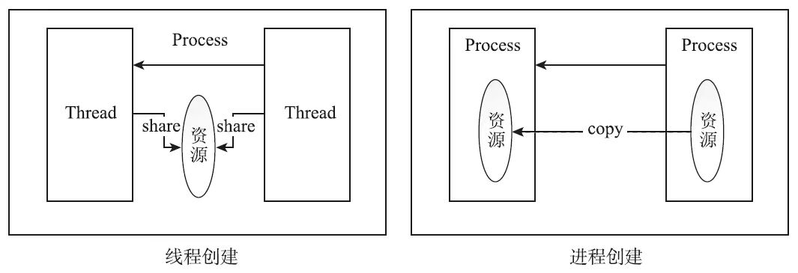
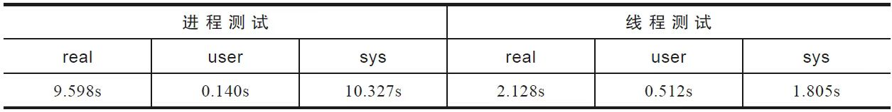
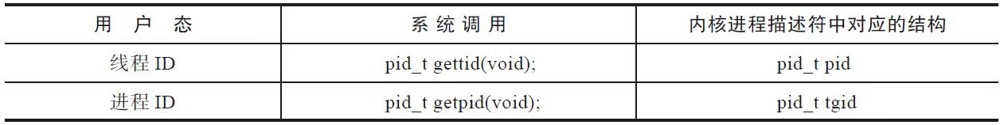
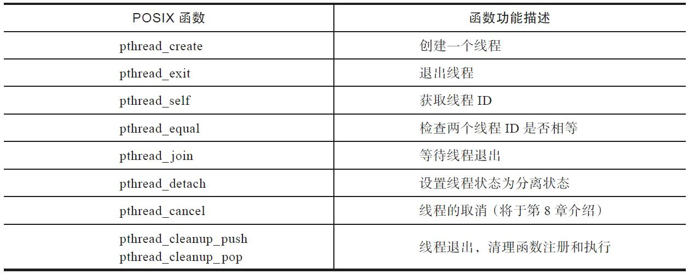
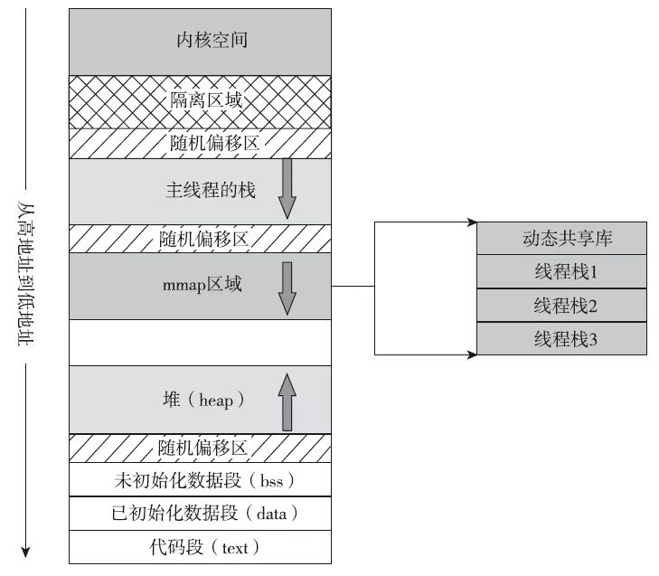
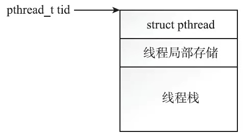
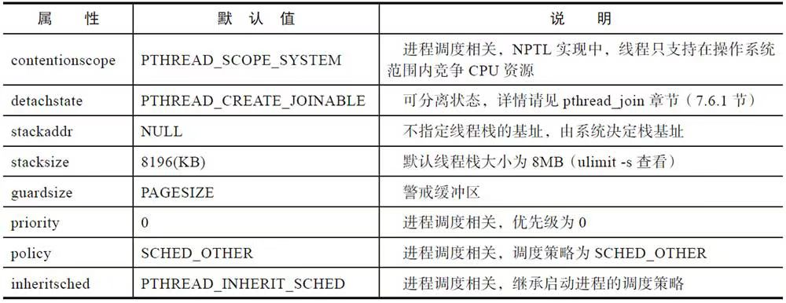
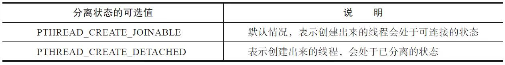

# 理解Linux线程（1）

Unix原本是不支持线程的，线程概念的引入给Unix家族带来了一些麻烦，很多函数都不是线程安全（thread-safe）的，需要重新定义，信号机制在线程加入以后也变得更加复杂了。

## 线程与进程

在Linux下，程序或可执行文件是一个静态的实体，它只是一组指令的集合，没有执行的含义。进程是一个动态的实体，有自己的生命周期。线程是操作系统进程调度器可以调度的最小执行单元。

一个进程可能包含多个线程，传统意义上的进程，不过是多线程的一种特例，即该进程只包含一个线程。

进程之间，彼此的地址空间是独立的，但线程会共享内存地址空间。同一个进程的多个线程共享一份全局内存区域，包括初始化数据段、未初始化数据段和动态分配的堆内存段。

线程之间共享资源：



这种共享给线程带来了很多的优势：

- 创建线程花费的时间要少于创建进程花费的时间。
- 终止线程花费的时间要少于终止进程花费的时间。
- 线程之间上下文切换的开销，要小于进程之间的上下文切换。
- 线程之间数据的共享比进程之间的共享要简单。

来比较下创建10万个进程和10万个线程各自的开销:



从测试结果上看，创建线程花费的时间约是创建进程花费时间的五分之一。

在上述测试中，调用fork函数和pthread_create函数之前，并没有分配大块内存。一旦分配大块内存，考虑到创建进程需要拷贝页表，而创建线程不需要，则两者之间效率上的差距会进一步拉大。

线程间的上下文切换，指的是同一个进程里不同线程之间发生的上下文切换。由于线程原本属于同一个进程，它们会共享地址空间，大量资源共享，切换的代价小于进程之间的切换是自然而然的事情。

线程之间通信的代价低于进程之间通信的代价。线程共享地址空间的设计，让多个线程之间的通信变得非常简单。进程之间的通信代价则要高很多。进程之间不得不采用一些进程间通信的手段（如管道、共享内存及信号量等）来协作。

## 进程ID和线程ID

在Linux中，目前的线程实现是Native POSIX Thread Library，简称NPTL。在这种实现下，线程又被称为**轻量级进程**（Light Weighted Process），**每一个用户态的线程，在内核之中都对应一个调度实体，也拥有自己的进程描述符（task_struct结构体）**。

没有线程之前，一个进程对应内核里的一个进程描述符，对应一个进程ID。但是引入了线程的概念之后，情况就发生了变化，一个用户进程下管辖N个用户态线程，每个线程作为一个独立的调度实体在内核态都有自己的进程描述符，进程和内核的进程描述符一下子就变成了1∶N的关系，POSIX标准又要求进程内的所有线程调用getpid函数时返回相同的进程ID。如何解决上述问题呢？

内核引入了**线程组（Thread Group）**的概念。

```c
struct task_struct {...
    pid_t pid;
    pid_t tgid
      ...
    struct task_struct *group_leader;
      ...
    struct list_head thread_group;
      ...
}
```

多线程的进程，又被称为线程组，线程组内的每一个线程在内核之中都存在一个进程描述符（task_struct）与之对应。进程描述符结构体中的pid，表面上看对应的是进程ID，其实不然，它对应的是线程ID；进程描述符中的tgid，含义是Thread Group ID，该值对应的是用户层面的进程ID

线程ID和进程ID的值:



本节介绍的线程ID，不同于后面会讲到的pthread_t类型的线程ID，和进程ID一样，线程ID是pid_t类型的变量，而且是用来唯一标识线程的一个整型变量。那么如何查看一个线程的ID呢？

```c
$ ps -eLF
UID          PID    PPID     LWP  C NLWP    SZ   RSS PSR STIME TTY          TIME CMD
```

ps命令中的-L选项，会显示出线程的如下信息。

- LWP：线程ID，即gettid（）系统调用的返回值。
- NLWP：线程组内线程的个数。

对于线程，Linux提供了gettid系统调用来返回其线程ID，可惜的是glibc并没有将该系统调用封装起来，再开放出接口来供程序员使用。如果确实需要获取线程ID，可以采用如下方法：

```c
#include <sys/syscall.h>
int TID = syscall(SYS_gettid);
```

线程组内的第一个线程，在用户态被称为主线程（main thread），在内核中被称为Group Leader。内核在创建第一个线程时，会将线程组ID的值设置成第一个线程的线程ID，group_leader指针则指向自身，即主线程的进程描述符，如下。

```c
/*线程组ID等于主线程的ID，group_leader指向自身*/
p->tgid = p->pid;
p->group_leader = p;
INIT_LIST_HEAD(&p->thread_group);
```

所以可以看到，线程组内存在一个线程ID等于进程ID，而该线程即为线程组的主线程。

至于线程组其他线程的ID则由内核负责分配，其线程组ID总是和主线程的线程组ID一致，无论是主线程直接创建的线程，还是创建出来的线程再次创建的线程，都是这样。

```c
if (clone_flags & CLONE_THREAD)
         p->tgid = current->tgid;
if (clone_flags & CLONE_THREAD) {
     p->group_leader = current->group_leader;
     list_add_tail_rcu(&p->thread_group, &p->group_leader->thread_group);
}
```

通过group_leader指针，每个线程都能找到主线程。主线程存在一个链表头，后面创建的每一个线程都会链入到该双向链表中。

利用上述的结构，每个线程都可以轻松地找到其线程组的主线程（通过group_leader指针），另一方面，通过线程组的主线程，也可以轻松地遍历其所有的组内线程（通过链表）。

需要强调的一点是，线程和进程不一样，进程有父进程的概念，但在线程组里面，所有的线程都是对等的关系。

- 并不是只有主线程才能创建线程，被创建出来的线程同样可以创建线程
- 不存在类似于fork函数那样的父子关系，大家都归属于同一个线程组，进程ID都相等，group_leader都指向主线程，而且各有各的线程ID。
- 并非只有主线程才能调用pthread_join连接其他线程，同一线程组内的任意线程都可以对某线程执行pthread_join函数。
- 并非只有主线程才能调用pthread_detach函数，其实任意线程都可以对同一线程组内的线程执行分离操作。

## pthread库接口介绍

这些接口包括线程的创建、退出、取消和分离，以及连接已经终止的线程，互斥量，读写锁，线程的条件等待等。



## 线程的创建和标识

创建线程的接口，即pthread_create函数。程序开始启动的时候，产生的进程只有一个线程，我们称之为主线程或初始线程。对于单线程的进程而言，只存在主线程一个线程。如果想在主线程之外，再创建一个或多个线程，就需要用到这个接口了。

### pthread_create函数

pthread库提供了如下接口来创建线程：

```c
#include <pthread.h>
int pthread_create(pthread_t *restrict thread,
                   const pthread_attr_t *restrict attr,
                   void *(*start_routine)(void*),
                   void *restrict arg);
```

- pthread_create函数的第一个参数是pthread_t类型的指针，线程创建成功的话，会将分配的线程ID填入该指针指向的地址。线程的后续操作将使用该值作为线程的唯一标识。
- 第二个参数是pthread_attr_t类型，通过该参数可以定制线程的属性，比如可以指定新建线程栈的大小、调度策略等。如果创建线程无特殊的要求，该值也可以是NULL，表示采用默认属性。
- 第三个参数是线程需要执行的函数。创建线程，是为了让线程执行一定的任务。线程创建成功之后，该线程就会执行start_routine函数，该函数之于线程，就如同main函数之于主线程。
- 第四个参数是新建线程执行的start_routine函数的入参。新建线程如果想要正常工作，则可能需要入参，那么主线程在调用pthread_create的时候，就可以将入参的指针放入第四个参数以传递给新建线程。如果线程的执行函数start_routine需要很多入参，传递一个指针就能提供足够的信息吗？答案是能。线程创建者（一般是主线程）和线程约定一个结构体，创建者便把信息填入该结构体，再将结构体的指针传递给子进程，子进程只要解析该结构体，就能取出需要的信息。

如果成功，则pthread_create返回0；如果不成功，则pthread_create返回一个非0的错误码。

pthread_create函数的返回情况有些特殊，通常情况下，函数调用失败，则返回-1，并且设置errno。pthread_create函数则不同，它会将errno作为返回值，而不是一个负值。

### 线程ID及进程地址空间布局

pthread_create函数，会产生一个线程ID，存放在第一个参数指向的地址中。这个线程ID和之前说的轻量级进程ID不是同一个东西。

轻量级进程ID属于进程调度的范畴。因为线程是轻量级进程，是操作系统调度器的最小单位，所以需要一个数值来唯一标识该线程。

pthread_create函数产生并记录在第一个参数指向地址的线程ID中，属于NPTL线程库的范畴，线程库的后续操作，就是根据该线程ID来操作线程的。

线程库NPTL提供了pthread_self函数，可以获取到线程自身的ID：

```c
#include <pthread.h>
pthread_t pthread_self(void);
```

在同一个线程组内，线程库提供了接口，可以判断两个线程ID是否对应着同一个线程：

```c
#include <pthread.h>
int pthread_equal(pthread_t t1, pthread_t t2);
```

返回值是0的时候，表示两个线程是同一个线程，非零值则表示不是同一个线程。

POSIX标准并没有限制pthread_t的数据类型，所以该类型取决于具体实现。**对于Linux目前使用的NPTL实现而言，pthread_t类型的线程ID，本质就是一个进程地址空间上的一个地址。**

在x86_64平台上，用户地址空间约为128TB，对于地址空间的布局，系统有如下控制选项：

```bash
$ cat /proc/sys/vm/legacy_va_layout
0
```

该选项影响地址空间的布局，主要是影响mmap区域的基地址位置，以及mmap是向上还是向下增长。如果该值为1，那么mmap的基地址mmap_base变小（约在128T的三分之一处），mmap区域从低地址向高地址扩展。如果该值为0，那么mmap区域的基地址在栈的下面（约在128T空间处），mmap区域从高地址向低地址扩展。默认值为0



可以通过procfs或pmap命令来查看进程的地址空间的情况：

```bash
pmap PID
```

或者

```bash
cat /proc/PID/maps
```

在接近128TB的巨大地址空间里面，代码段、已初始化数据段、未初始化数据段，以及主线程的栈，所占用的空间非常小，都是KB、MB这个数量级的，

主线程的栈大小并不是固定的，要在运行时才能确定大小（上限大概在8MB左右）,因此，在栈中不能存在巨大的局部变量，另外编写递归函数时一定要小心，递归不能太深，否则很可能耗尽栈空间

进程地址空间之中，最大的两块地址空间是内存映射区域和堆。堆的起始地址特别低，向上扩展，mmap区域的起始地址特别高，向下扩展。

用户调用pthread_create函数时，glibc首先要为线程分配线程栈，而线程栈的位置就落在mmap区域。glibc会调用mmap函数为线程分配栈空间。pthread_create函数分配的pthread_t类型的线程ID，不过是分配出来的空间里的一个地址，更确切地说是一个结构体的指针：



创建两个线程，将其pthread_self（）的返回值打印出来，输出如下：

```c
address of tid in thread-1 = 0x7f011ca12700
address of tid in thread-2 = 0x7f011c211700
```

pthread_t类型的线程ID很有可能会被复用。在满足下列条件时，线程ID就有可能会被复用：

1. 线程退出。
2. 线程组的其他线程对该线程执行了pthread_join，或者线程退出前将分离状态设置为已分离。
3. 再次调用pthread_create创建线程。

对于pthread_t类型的线程ID，虽然在同一时刻不会存在两个线程的ID值相同，但是如果线程退出了，重新创建的线程很可能复用了同一个pthread_t类型的ID。从这个角度看，如果要设计调试日志，用pthread_t类型的线程ID来标识进程就不太合适了。用pid_t类型的线程ID(轻量级进程ID）则是一个比较不错的选择。

```c
#include <sys/syscall.h>
int TID = syscall(SYS_gettid);
```

虽然在同一时刻不会存在两个线程的ID值相同，但是如果线程退出了，重新创建的线程很可能复用了同一个pthread_t类型的ID。从这个角度看，如果要设计调试日志，用pthread_t类型的线程ID来标识进程就不太合适了。用pid_t类型的线程ID则是一个比较不错的选择。

```c
#include <sys/syscall.h>
int TID = syscall(SYS_gettid);
```

采用pid_t类型的线程ID来唯一标识进程有以下优势：

- 返回类型是pid_t类型，进程之间不会存在重复的线程ID，而且不同线程之间也不会重复，在任意时刻都是全局唯一的值。
- procfs中记录了线程的相关信息，可以方便地查看/proc/pid/task/tid来获取线程对应的信息。
- ps命令提供了查看线程信息的-L选项，可以通过输出中的LWP和NLWP，来查看同一个线程组的线程个数及线程ID的信息。

另外一个比较有意思的功能是我们可以给线程起一个有意义的名字，命名以后，既可以从procfs中获取到线程的名字，也可以从ps命令中得到线程的名字，这样就可以更好地辨识不同的线程。

Linux提供了prctl系统调用：

```c
#include <sys/prctl.h>
int  prctl(int  option,  unsigned  long arg2,
           unsigned long arg3 , unsigned long arg4,
           unsigned long arg5)
```

这个系统调用和ioctl非常类似，通过option来控制系统调用的行为。当需要给线程设定名字的时候，只需要将option设为PR_SET_NAME，同时将线程的名字作为arg2传递给prctl系统调用即可，这样就能给线程命名了。

### 线程创建的默认属性

线程创建的第二个参数是pthread_attr_t类型的指针，pthread_attr_init函数会将线程的属性重置成默认值。

```c
pthread_attr_t    attr;
pthread_attr_init(&attr);
```

在创建线程时，传递重置过的属性，或者传递NULL，都可以创建一个具有默认属性的线程。



本节现在来介绍线程栈的基地址和大小。默认情况下，线程栈的大小为8MB。

```sh
$ ulimit -s
8192
```

调用pthread_attr_getstack函数可以返回线程栈的基地址和栈的大小。出于可移植性的考虑不建议指定线程栈的基地址。但是有时候会有修改线程栈的大小的需要。

一个线程需要分配8MB左右的栈空间，就决定了不可能无限地创建线程，在进程地址空间受限的32位系统里尤为如此。在32位系统下，3GB的用户地址空间决定了能创建线程的个数不会太多。如果确实需要很多的线程，可以调用接口来调整线程栈的大小：

```c
#include <pthread.h>
int pthread_attr_getstacksize(const pthread_attr_t *restrict attr,
       size_t *restrict stacksize);
int pthread_attr_setstacksize(pthread_attr_t *attr, size_t stacksize);
```

## 线程的退出

下面的三种方法中，线程会终止，但是进程不会终止（如果线程不是进程组里的最后一个线程的话）：

- 创建线程时的start_routine函数执行了return，并且返回指定值。
- 线程调用pthread_exit。
- 其他线程调用了pthread_cancel函数取消了该线程。

**如果线程组中的任何一个线程调用了exit函数，或者主线程在main函数中执行了return语句，那么整个线程组内的所有线程都会终止。**

pthread_exit函数的定义：

```c
#include <pthread.h>
void pthread_exit(void *retval);
```

alue_ptr是一个指针，存放线程的“临终遗言”。线程组内的其他线程可以通过调用pthread_join函数接收这个地址，从而获取到退出线程的临终遗言。如果线程退出时没有什么遗言，则可以直接传递NULL指针。

```c
pthread_exit(NULL);
```

但是这里有一个问题，就是不能将遗言存放到线程的局部变量里，因为如果用户写的线程函数退出了，线程函数栈上的局部变量可能就不复存在了，线程的临终遗言也就无法被接收者读到。

该如何正确地传递返回值呢？

- 如果是int型的变量，则可以使用“pthread_exit（（int*）ret）；”。tricky的做法，我们将返回值ret进行强制类型转换，接收方再把返回值强制转换成int。但是不推荐使用这种方法。这种方法虽然是奏效的，但是太tricky，而且C标准没有承诺将int型转成指针后，再从指针转成int型时，数据一直保持不变。
- 使用全局变量返回。
- 将返回值填入到用malloc在堆上分配的空间里。因为堆上的空间不会随着线程的退出而释放，所以pthread_join可以取出返回值。切莫忘记释放该空间，否则会引起内存泄漏。
- 使用字符串常量，如pthread_exit（“hello，world”）: 之所以可行，是因为字符串常量有静态存储的生存期限。

传递线程的返回值，除了pthread_exit函数可以做到，线程的启动函数（start_routine函数）return也可以做到，两者的数据类型要保持一致，都是`void*`类型。这也解释了为什么线程的启动函数start_routine的返回值总是void*类型。

```c
void pthread_exit(void *retval);
void * start_routine(void *param)
```

线程退出有一种比较有意思的场景，即线程组的其他线程仍在执行的情况下，主线程却调用pthread_exit函数退出了。这会发生什么事情？

首先要说明的是这不是常规的做法，但是如果真的这样做了，那么**主线程将进入僵尸状态，而其他线程则不受影响**，会继续执行。

## 线程的连接与分离

### 线程的连接

线程库提供了pthread_join函数，用来等待某线程的退出并接收它的返回值。这种操作被称为连接（joining）。

```c
#include <pthread.h>
int pthread_join(pthread_t thread, void **retval);
```

该函数第一个参数为要等待的线程的线程ID，第二个参数用来接收返回值。根据等待的线程是否退出，可得到如下两种情况：

- 等待的线程尚未退出，那么pthread_join的调用线程就会陷入阻塞。
- 等待的线程已经退出，那么pthread_join函数会将线程的退出值（void*类型）存放到retval指针指向的位置。

线程的连接（join）操作有点类似于进程等待子进程退出的等待（wait）操作的不同之处：

- 第一点不同之处是进程之间的等待只能是父进程等待子进程，而线程则不然。线程组内的成员是对等的关系，只要是在一个线程组内，就可以对另外一个线程执行连接（join）操作
- 第二点不同之处是进程可以等待任一子进程的退出，但是线程的连接操作没有类似的接口，即不能连接线程组内的任一线程，必须明确指明要连接的线程的线程ID。

当调用失败时，和pthread_create函数一样，errno作为返回值返回。

pthread_join函数之所以能够判断是否死锁和连接操作是否被其他线程捷足先登，是因为目标线程的控制结构体struct pthread中，存在如下成员变量，记录了该线程的连接者。

```c
struct pthread *joinid;
```

该指针存在三种可能

- NULL：线程是可连接的，但是尚没有其他线程调用pthread_join来连接它。
- 指向线程自身的struct pthread：表示该线程属于自我了断型，执行过分离操作，或者创建线程时，设置的分离属性为PTHREAD_CREATE_DETACHED，一旦退出，则自动释放所有资源，无需其他线程来连接。
- 指向线程组内其他线程的struct pthread：表示joinid对应的线程会负责连接。

如果两个线程几乎同时对处于可连接状态的线程执行连接操作，只有一个线程能够成功，另一个则返回EINVAL。

```c
(atomic_compare_and_exchange_bool_acq（&pd->joined,self,NULL）
```

NTPL提供了原子性的保证：

- 如果是NULL，则设置成调用线程的线程ID，CAS操作（Compare And Swap）是原子操作，不可分割，决定了只有一个线程能成功。
- 如果joinid不是NULL，表示该线程已经被别的线程连接了，或者正处于已分离的状态，在这两种情况下，都会返回EINVAL。

### 为什么要连接退出的线程

如果不执行连接操作：

1. 已经退出的线程，其空间没有被释放，仍然在进程的地址空间之内。
2. 新创建的线程，没有复用刚才退出的线程的地址空间。

如果不执行连接操作，线程的资源就不能被释放，也不能被复用，这就造成了资源的泄漏。

当线程组内的其他线程调用pthread_join连接退出线程时，内部会调用__free_tcb函数，该函数会负责释放退出线程的资源。

值得一提的是，纵然调用了pthread_join，也并没有立即调用munmap来释放掉退出线程的栈，它们是被后建的线程复用了，这是NPTL线程库的设计。释放线程资源的时候，NPTL认为进程可能再次创建线程，而频繁地munmap和mmap会影响性能，所以NTPL将该栈缓存起来，放到一个链表之中，如果有新的创建线程的请求，NPTL会首先在栈缓存链表中寻找空间合适的栈，有的话，直接将该栈分配给新创建的线程。

始终不将线程栈归还给系统也不合适，所以缓存的栈大小有上限，默认是40MB，如果缓存起来的线程栈的空间总和大于40MB，NPTL就会扫描链表中的线程栈，调用munmap将一部分空间归还给系统。

### 线程的分离

默认情况下，新创建的线程处于可连接（Joinable）的状态，可连接状态的线程退出后，需要对其执行连接操作，否则线程资源无法释放，从而造成资源泄漏。

如果其他线程并不关心线程的返回值，那么连接操作就会变成一种负担：你不需要它，但是你不去执行连接操作又会造成资源泄漏。这时候你需要的东西只是：线程退出时，系统自动将线程相关的资源释放掉，无须等待连接。

NPTL提供了pthread_detach函数来将线程设置成已分离（detached）的状态，如果线程处于已分离的状态，那么线程退出时，系统将负责回收线程的资源，如下：

```c
#include <pthread.h>
int pthread_detach(pthread_t thread);
```

可以是线程组内其他线程对目标线程进行分离，也可以是线程自己执行pthread_detach函数，将自身设置成已分离的状态。

```c
pthread_detach(pthread_self())
```

线程的状态之中，可连接状态和已分离状态是冲突的，一个线程不能既是可连接的，又是已分离的。因此，如果线程处于已分离的状态，其他线程尝试连接线程时，会返回EINVAL错误。

所谓已分离，并不是指线程失去控制，不归线程组管理，而是指线程退出后，系统会自动释放线程资源。若线程组内的任意线程执行了exit函数，即使是已分离的线程，也仍然会受到影响，一并退出。

将线程设置成已分离状态，并非只有pthread_detach一种方法。另一种方法是在创建线程时，将线程的属性设定为已分离：

```c
#include <pthread.h>
int pthread_attr_setdetachstate(pthread_attr_t *attr, int detachstate);
int pthread_attr_getdetachstate(const pthread_attr_t *attr,
int *detachstate);
```

如果确实不关心线程的返回值，可以在创建线程之初，就指定其分离属性为PTHREAD_CREATE_DETACHED。

分离状态的合法值:



## 互斥量

锁是一个很普遍的需求，当然用户可以自行实现锁来保护临界区。但是实现一个正确并且高效的锁非常困难。纵然抛下高效不谈，让用户从零开始实现一个正确的锁也并不容易。正是因为这种需求具有普遍性，所以Linux提供了互斥量。

