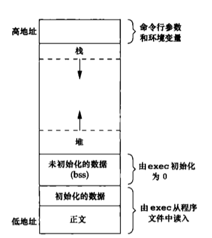

[TOC]


# 进程环境

## main函数

c程序总是从main函数开始执行。

当内核执行C程序时（使用一个exec函数），在调用mian函数前先调用一个特殊的启动例程。启动例程从内核取得命令行参数和环境变量值。

## 进程终止

有8种方式使进程终止(termination)，其中5种为正常终止，它们是：
1. 从mian返回
2. 调用exit
3. 调用`_exit`或`_Exit`
4. 最后一个线程从其启动例程返回
5. 从最后一个线程调用`pthread_exit`

异常终止有3种方式：
6. 调用abort
7. 接到一个信号
8. 最后一个线程对取消请求做出响应

### 退出函数

```c
#include <stdlib.h>

void exit(int status);
void _Exit(int status);

#include <unistd.h>

void _exit(int status);
```

3个函数用于正常终止一个程序：`_exit`和`_Exit`立即进入内核，`exit`则先执行一些清理处理，然后返回内核。

`exit`函数总是执行一个标准I/O库的清理关闭操作；对于所有打开流调用`fclose`函数。这造成输出缓冲中所有的数据都被冲洗（写到文件上）。

3个退出函数都带一个整型参数，称为终止状态（或 退出状态，exit status）。大多数UNIX系统shell都提供检查进程终止状态的方法。如果(a)调用这些函数时不带终止状态，或(b)main执行了一个无返回值的return语句，或(c)main没有声明返回类型为整型，则该进程的终止状态是未定义的。

但是若main的返回类型是整型，并且mian执行到最后一条语句时返回（隐式返回），那么该进程的终止状态是0。

### 函数atexit

按照ISO C的规定，一个进程可以登记至多32个函数，这些函数将由exit自动调用。这些函数为终止处理程序（exit handler），并调用`atexit`函数来登记这些函数。

如果程序调用exec族中的任一函数，则将清除已安装的所有终止处理程序。

## c程序的储存空间布局




> 典型储存空间安排

c语言一直由一下几个部分组成：
- **正文段**。这是CPU执行机器指令的部分。通常，正文段是可以共享的，所以即使是频繁执行的程序，在储存器中也只需要有一个副本，而且正文段通常是只读的，以防止程序由于意外而修改其指令。
- **初始化数据段**。通常将此段称为数据段，它包含了程序中需明确地赋初值的变量。例如，C程序中任何函数之外的声明:
```
int maxcount = 99;
```
- **未初始化数据段**。通常将此段称为bss段，这一名称来源于早期汇编程序一个操作符，意思是“由符号开始的块”（block started by symbol），在程序开始执行之前，内核讲此段中的数据初始化为0或空指针。函数外的声明：
```
long sum[1000];
```
使此变量存放在非初始化数据段中。
- **栈**。自动变量以及每次函数调用时所需保存的信息都存放在此段中。每次函数调用时，其返回地址以及调用者的环境信息（如某些机器寄存器的值）都存放在栈中。然后，最近被调用的函数在栈上为其自动和临时变量分配储存空间。
- **堆**。通常在堆中进行动态内存分配。

对于32位Intel x86处理器上的linux，正文段从0x04048000单元开始，栈底则在0xC0000000之下开始。堆顶和栈顶之间未用的虚地址空间很大。

未初始化数据段的内容并不存放在磁盘文件中。其原因是，内核在程序开始运行前将它们都设置为0。需要存放在磁盘程序文件中的段只有正文段和初始化数据段。

## 共享库

大多数UNIX系统支持共享库。

共享库时的可执行文件中不再需要包含公共的库函数，而只需在所有进程都可引用的储存区中保存这种库例程的一个副本。

程序第一次执行或者第一次调用某个库函数时，用动态链接方法将程序与共享库函数相链接。

这减少了每个可执行文件的长度，但增加了一些运行时间开销。这种时间开销发生在该程序第一次被执行时，或者每个共享库函数第一次被调用时。

共享库的另一个有点是可以用库函数的新版本代替老版本而无需对使用该库的程序重新连接编辑。

## 储存空间分配

ISO C 说明了3个用于储存空间分配的函数。
1. `malloc`，分配指定字节数的储存区。此储存区中的初始值不确定。
2. `calloc`，为指定数量指定长度的对象分配储存空间。该空间中的每一位(bit)都初始化为0。
3. `realloc`，增加或减少以前分配区的长度。当增加长度时，可能需将以前分配区的内容移到另一个足够大的区域，以便在尾端提供增加的储存区，而新增区域内的初始值则不确定。

函数`free`释放ptr指向的储存空间。被释放的空间通常被送入可用储存区池，以后再调用上述3个函数时再分配。

这些分配例程通常用`sbrk(2)`系统调用实现。该系统调用扩充（或缩小）进程的堆。

虽然sbrk可以扩充或者缩小进程的储存空间，但是大多数malloc和free的实现都不减小进程的储存空间。释放的空间可供以后再分配，但将它们保持在malloc池中而不返回给内核。

大多数实现说分配的储存空间比所要求的稍微大一些，额外的空间用来记录管理信息————分配块长度、指向下一个分配块的指针等。