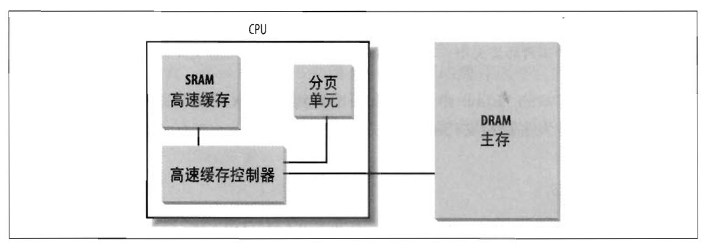

# 内存寻址

## 内存地址

- 逻辑地址(logical address)：每一个逻辑地址都由一个段(segment)和偏移量(offset 或 displacement)组成，段偏移量指明了从段开始的地方到实际地址之间的距离
- 线性地址(linear address)(也称虚拟地址 virtual address)：32位无符号整数，可以用来表示高达4GB的地址。
- 物理地址(physical address)： 用于内存芯片级内存单元寻址。

```sequence
A->分段单元: 逻辑地址
分段单元->分页单元: 线性地址
分页单元->B:  物理地址
```


## 硬件中的分段

## Linux中的分段

## 硬件中的分页

分页单元把线性地址转换为物理地址。其中一个关键任务是把所请求的访问类型与线性地址的访问权限相比较，如果这次内存访问是无效的，就产生一个缺页异常。

把线性地址映射到物理地址的数据结构称为页表(page table)。页表存放在主存中。

### 常规分页

Intel处理器的分页单元处理4KB的页。

32位的线性地址被分为3个域：

- Directory(目录): 最高10位
- Table(页表): 中间10位
- Offset(偏移量): 最低12位

线性地址的转换分为两步完成，每一步都基于一种转换表，第一种转换表称为页目录表(page directory)，第二种转换表称为页表(page table)。

使用这种二级模式的目的在于减少每个进程页表所需的RAM的数量。二级模式通过只为进城世纪使用的那些虚拟内存去请求页表来较少内存使用量。

### 硬件高速缓存

为了缩小CPU和RAM之间的速度不匹配，引入了**硬件高速缓存内存(hardware cache memory)**

硬件高速缓存基于著名的**局部性原理(locality principle)**，该原理既适用程序结构也适用于数据结构。这表明由于程序的循环结构及相关数组可以组织成线性数组，最近最常用的相邻地址在最近的将来又被用到的可能性极大。

高速缓存单元插在分页单元和主内存之间。它包含一个**硬件高速缓存内存(hardware cache memory)**和一个**高速缓存控制器(cache controller)**。高速缓存内存中存放内存真正的行。高速缓存控制器存放一个表项数组，每个表项对应高速缓存内存中的一个行。每个表项有一个标签(tag)和描述高速缓存行状态的几个标志(flag)。

这种物理内存地址通常分为3组：最高几位对应标签，中间几位对应高速缓存控制器的字集索引，最低几位对应行内的偏移量。

> 处理器硬件高速缓存



当访问一个RAM储存单元时，CPU从物理地址中提取出子集的索引号并把子集中所有行的标签与物理地址的高几位比较。如果发现某一行的标签与这个物理地址的高位相同，则CPU命中一个高速缓存(cache hit)；否则，高速缓存没有命中(cache miss)。

当命中一个高速缓存时，高速缓存控制器执行不同的操作。

对于读操作，控制器从高速缓存行中选择数据并送到CPU寄存器；不需要访问RAM因而节约了CPU时间，因此，高速缓存系统起到了应有的作用。

对于写操作，控制器可能采用以下两个基本策略之一：

- **通写(write-through)**：控制器总是既写RAM也写高速缓存行
- **回写(write-back)**：回写的方式只更新高速缓存行，不改变RAM内容，提供了更快的功效。只有当CPU执行一条要求刷新高速缓存表项的指令时，或者当一个FLUSH硬件信号产生时（通常在高速缓存不命中之后），高速缓存控制器才把高速缓存行写回到RAM中。

当高速缓存没有命中时，高速缓存行被写回到内存中，如果有必要的话，把正确的行从RAM中取出放到高速缓存行的表项中。

### 转换后援缓冲器（TLB）

TLB（Translation Lookaside Buffer）用于加快线性地址的转换。当一个线性地址第一次被使用时，通过慢速访问RAM中的页表计算出相应的物理地址。同时，物理地址被存放在一个TLB表项中，以便以后对同一个线性地址的引用可以快速的得到转换。


## Linux中的分页

