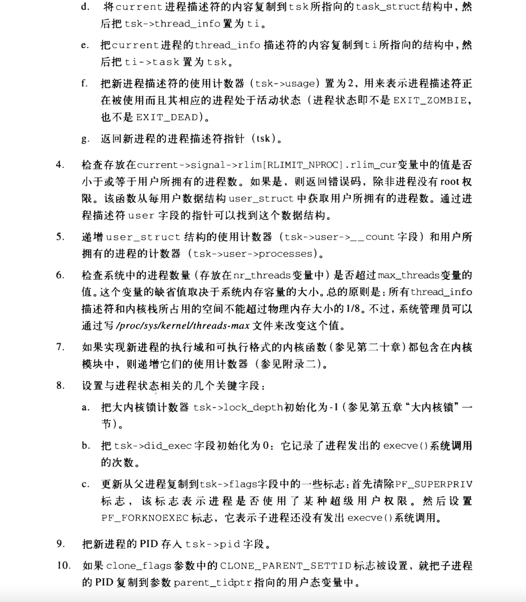

## 进程

### 进程、轻量级进程和线程

从内核观点看，进程的目的就是担当分配系统资源（CPU时间、内存等）的实体。

Linux使用轻量级进程(LWP, lightweight process)对多线程应用程序提供更好的支持。两个轻量级进程基本上可以共享一些资源，诸如地址空间、打开的文件等等。

### 进程描述符

进程描述符(process descriptor)——进程描述符都是task_struct类型结构，它的字段包含了与一个进程相关的所有信息。

> linux 进程描述符


#### 进程状态

进程描述符中的state字段描述了进程当前所处的状态。它由一组标志组成，其中每个标志描述一种可能的进程状态。在当前的Linux版本中，这些状态是互斥的，因此，严格意义上说，只能设置一种状态；其余的标志将被清除。

- **可运行状态(TASK_RUNNING)**
  - 进程要么在CPU上执行，要么准备执行
- **可中断的等待状态(TASK_INTERRUPTIBLE)**
  - 进程被挂起（睡眠），直到某个条件变为真。产生一个硬件中断，释放进程正等待的系统资源，或传递一个信号都是可以唤醒进程的条件（把进程的状态放回到TASK_RUNNING）。
- **不可中断的等待状态(TASK_UNINTERRUPTIBLE)**
  - 与可中断的等待状态类似，但有一个例外，把信号传递到睡眠进程不能改变它的状态。这种状态很少用到，但在一些特殊的情况下（进程必须等待，直到一个不能被中断的事件发生），这种状态是很有用的。
  - 例如，当进程打开一个设备文件，其相应的设备驱动程序开始探测相应的硬件设备时会用到这种状态。探测完成以前，设备驱动程序不能被中断，否则，硬件设备会处于不可预知的状态。
- **暂停状态(TASK_STOPPED)**
  - 进程的执行被暂停。当进程接收到SIGSTOP、SIGTSTP、SIGTTIN或SIGTTOU信号后，进入暂停状态。
- **跟踪状态(TASK_TRACED)**
  - 进程的执行已由debugger程序暂停。当一个进程被另一个进程监控时，任何信号都可以把这个进程置于TASK_TRACED状态。

还有两个进程状态既可以存放在进程描述符的state字段中，也可以存放在exit_state字段中。从这两个字段名称可以看出，只有当进程的执行被终止时，进程的状态才会改变为这两种状态中的一种。

- **僵死状态(EXIT_ZOMBIE)**

  - 进程的执行被终止，但是，父进程还没有发布wait4()或waitpid()系统调用来返回有关死亡进程的信息。发布wait()类系统调用前，内核不能丢弃包含在死进程描述符中的数据，因为父进程可能还需要它。

- **僵死撤销状态(EXIT_DEAD)**

  - 最终状态：由于父进程刚发出wait4()或waitpid()系统调用，因而进程由系统删除。为了防止其他执行线程在同一个进程上也执行wait()类系统调用(这是一种竞争状态)，而把进程的状态由僵死(EXIT_ZOMBIE)状态改为僵死撤销状态(EXIT_DEAD)。

#### 标识一个进程

能够独立调度的每个执行上下文都必须拥有它自己的进程描述符。

进程和进程描述符有非常严格的一一对应关系，使得32位的进程描述符地址可以很容易的标识进程。进程描述符指针指向这些地址，内核对进程的大部分引用是通过进程描述符指针进行的。

类Unix操作系统允许用户使用一个叫进程描述符processID(或PID)的数来标识进程，PID存放在进程描述符的**pid**字段中。

PID的值有一个上限，默认情况下，最大的PID号是32767(`PID_MAX_DEFAULT` - 1)；系统管理员可以通过往`/proc/sys/kernel/pid_max`这个文件中写入一个更小的值来减小PID的上限值。在64位的体系结构中，系统管理员可以把PID的上限扩大到4194303。

由于循环使用PID编号，内核必须通过管理一个**`pidmap_array`位图**来表示当前已分配的PID号和闲置的PID号。因为一个页框包含32768个位，所以在32位体系结构中`pidmap_array`位图存放在一个单独的页中。然而在64位体系结构中，需要为PID位图增加更多的页。系统会一直保存这些页不被释放。

Unix希望同一组的线程有共同的PID。例如，可以把信号发送给指定PID的一组线程，这个信号会作用于该组中的所有线程。

Linux遵照这个标准引入了线程组的表示。一个线程组的所有线程使用和该线程组的领头线程(thread group leader)相同的PID，也就是该组中的第一个轻量级进程的PID，它被存入进程描述符的`tgid`字段中。`getpid()`系统调用返回当前进程的`tgid(thread group id)`值而不是`pid`值，因此，一个多线程应用的所有线程共享相同的PID。

##### 进程描述符处理

进程是动态实体，内核必须能够同时处理很多进程，并把进程描述符存放在动态内存中，而不是永久分配给内核的内存区。

对每个进程来说，Linux都把两个不同的数据结构紧凑地存放在一个单独为进程分配的储存区域：一个是与进程描述符相关的小数据结构`thread_info`，叫做线程描述符。另一个是内核态的进程堆栈。这块储存区域的大小通常为8192个字节(两个页框)。考虑到效率的因素，内核让这8K空间占据连续的两个页框并让第一个页框的起始地址是2^13的倍数。

内核态的进程访问处于内核数据段的栈，这个栈不同于用户态的进程所用的栈。因为内核控制器路径使用很少的栈，因此只需要几千字节的内核态堆栈。所以，对于内核栈和`thread_info`结构来说，8KB足够了。

> thread_info 结构和进程内核存放在两个连续的页框中


esp寄存器是CPU栈指针，用来存放栈顶单元的地址。从用户态切换到内核态以后，进程的内核栈总是空的，因此，esp寄存器指向这个栈的顶端。

c语言使用下列的联合结构方便的表示一个进程的线程描述符和内核栈:

```c
union thread_union {
	struct thread_info thread_info;
    unsigned long stack[2048]; /* 对4K的栈数组下标是1024 */
};
```

##### 标识当前进程

`thread_info`结构与内核态堆栈之间紧密结合提供的主要好处是：内核可以很容易从esp寄存器的值获取当前在CPU运行进程的`thread_info`结构的地址。如果`thread_union`结构长度是8K，内核则屏蔽掉esp的低13位有效位就可以获得`thread_info`结构的基地址；而如果`thread_union`结构长度是4K，内核则需要屏蔽掉esp的低12位有效地址。

进程最常用的是进程描述符地址而不是`thread_info`结构的地址，通过`thread_info`的task指针可以很容易的获取到进程描述符。

##### 进程链表

进程链表把所有进程的描述符链接起来。

每个`task_struct`结构都包含一个`list_head`类型的`tasks`字段，这个类型的`prev`和`next`字段分别指向前面和后面的`task_struct`元素。

进程链表的头是`init_task` 描述符，它是所谓的0进程（process 0）或swapper进程的进程描述符。`init_task`的`task.prev`字段指向链表中最后插入的进程描述符的`tasks`字段。

##### TASK_RUNNING状态的进程链表

当内核寻找一个新进程在CPU运行时，必须只考虑可运行进程(即处在TASK_RUNNING状态的进程)

提高调度程序运行速度的诀窍是建立多个可运行进程链表，每种进程优先权对应一个不同的链表。每个`task_struct`描述符包含一个`list_head`类型的字段`run_list`。如果进程的优先权等于k，run_list字段把该进程链入优先权为k的可运行进程的链表中。

#### 进程间关系

> 进程描述符中表示进程亲属关系的字段描述

| 字段名      | 说明                                                         |
| ----------- | ------------------------------------------------------------ |
| real_parent | 指向创建了P的进程的描述符，如果P的父进程不再存在，就指向进程1(init)的描述符（因此，如果用户运行一个后台进程而且推出了shell，后台进程就会成为init的子进程） |
| parent      | 指向P的当前父进程（这种进程的子进程终止时，必须向父进程发信号）。它的值通常与`real_parent`一致，但偶尔也可以不同，例如，当另一个进程发出监控P的ptrace()系统调用请求时 |
| children    | 链表的头部，链表中的所有元素都是P创建的子进程                |
| sibling     | 指向兄弟进程链表的下一个元素或前一个元素的指针，这些兄弟进程的父进程都是P |

##### pidhash表及链表

内核需要从进程的PID导出对应的进程描述符指针。为了加速查找，引入了4个散列表。

Linux利用链表来处理冲突的PID：每一个表项是由冲突的进程描述符组成的双向链表。

由于需要跟踪进程间的关系，PID散列表中使用的数据结构非常复杂。

PID散列表的数据结构是四个pid结构的数组，它在进程描述符的pids字段中。

> pid结构的字段

```c
struct pid
{
	int nr;							// pid的数值
	struct hlist_node pid_chain;	// 链接散列表的下一个和前一个元素
	struct list_head pid_list;		// 每个pid的进程链表头
};
```

> PID散列表


#### 如何组织进程

运行队列链表把处于TASK_RUNNING状态的所有进程组织在一起。当要把其他状态的进程分组时，不同的状态要求不同的处理。

-   没有为处于TASK_STOPPED、EXIT_ZOMBIE或EXIT_DEAD状态的进程建立专门的链表。由于对处于暂停、僵死、死亡状态进程的访问比较简单，或者通过PID，或者通过特定的父进程的子进程链表，所以不必对这三种状态进程分组。
-   根据不同的特殊事件把处于TASK_INTERRUPTIBLE或TASK_UNINTERRUPTIBLE状态的进程细分为很多类，每一类都对应某个特殊的事件。

##### 等待队列

等待队列在内核中有很多用途，尤其在中断处理、进程同步及定时。

进程必须经常等待某些事件的发生，例如，等待一个磁盘操作的终止，等待释放系统资源，或等待时间经过固定的间隔。

等待队列表示一组睡眠的进程，当某一条件变为真时，由内核唤醒他它们。

等待队列由双向链表实现。因为等待队列是由中断处理程序和主要内核函数修改的，因此必须对其双向链表进行保护以免对其进行同时访问，因为同时访问会导致不和预测的后果。同步等待是通过等待队列头的lock自旋锁达到的。

### 进程切换

为了控制进程的执行，内核必须有能力挂起正在CPU上运行的进程，并恢复以前挂起的某个进程的执行。这种行为被称为进程切换（process switch）、任务切换（task switch）、或者上下文切换（context switch）。

#### 硬件上下文

每个进程拥有属于自己的地址空间，但所有进程必须共享CPU寄存器。在恢复一个执行的进程之前，内核必须确保每个寄存器装入了挂起进程时的值。

linux中进程硬件上下文的一部分放在TSS段，而剩余部分放在内核态的堆栈中。

进程的切换只发生在内核态。在执行进程切换之前，用户态进程使用的所有寄存器的内容都已保存在内核态的堆栈上，包括ss和esp这对寄存器的内容（存储用户态堆栈指针的地址）。

#### thead字段

每个进程描述符包含一个类型为thread_struct的thread字段，只要进程被切换出去，内核就把其硬件上下文保存在这个结构中。这个数据结构包含的字段涉及大部分CPU寄存器，但不包含诸如eax、ebx等等这些通用寄存器，它们的值保留在内核堆栈中。

#### 执行进程切换

每个进程的切换由两步组成：

1.   切换页全局目录以安装一个新的地址空间。
2.   切换内核态堆栈和硬件上下文，因为硬件上下文提供了内核执行新进程所需要的所有信息，包括CPU寄存器。

### 创建进程

现在操作系统引入三种不同的机制来解决子进程需要copy父进程整个地址空间，但大部分情况又几乎不使用的问题（大部分子进程会立即调用execve()，并清除父进程仔细copy过来的地址空间）：

1.   写时复制技术允许父子进程读相同的物理页。只要两者中有一个试图写一个物理页，内核就把整个页的内容拷贝到一个新的物理页，并把这个新的物理页分配给正在写的进程。
2.   轻量级进程（线程）允许父子进程共享每进程在内核中的很多数据结构，如页面（也就是整个用户态地址空格键）、打开文件表及信号处理。
3.   vfork()系统调用创建的进程能共享其父进程的内存地址空间。为了房子父进程重写子进程需要的数据，会阻塞父进程的执行，一直到子进程退出或者执行一个新的程序为止。

#### clone(), fork() 及 vfork()系统调用

在linux中，轻量级进程是由名为clone()的函数创建的。


clone flag：


clone()是在C语言库中定义的一个封装函数，它负责建立新轻量级进程的堆栈并调用对编程者隐藏的clone()系统调用。

实现clone()系统调用的 sys_clone()服务例程没有fn和arg参数。实际上，封装函数把fn指针存放在子进程堆栈的某个位置处，该位置就是该封装函数本身返回地址存放的位置。arg指针正好存放在子进程堆栈中fn的下面。当那个封装函数结束时，cpu从堆栈中取出返回地址，然后执行fn (arg)函数。

传统的fork()系统调用在Linux中是用clone()实现的，其中clone()的flags参数执行为SIGCHLD信号以及所有清0的clone标志，它的chlid_stack参数是父进程当前的堆栈指针。因此，父进程和子进程暂时共享一个用户态堆栈。根据写时复制机制，通常只要父子进程中有一个试图去改变栈，则立即各自的到用户态堆栈的一份copy。

vfork()系统调用在Linux中也是用 clone()实现的，其中clone()参数指定为SIGCHLD信号和CLONE_VM以及CLONE_VFORK标志，clone()参数child_stack等于父进程当前的栈指针。

#### do_fork函数

 do_fork()函数负责处理clone(), fork()和vfork()系统调用。

do_fork执行主要步骤：


#### copy_process()函数

copy_process()创建进程描述符以及子进程执行所需要的其他数据结构。参数与do_fork()相同，外加子进程的PID。





    

### 内核线程(kernel thread)

在Linux中，内核线程区别于普通进程：

1. 内核线程只运行在内核态，而普通进程及可以运行在内核态，也可以运行在用户态。
2. 内核线程只运行在内核态，他们只使用大于PAGE_OFFSET的线性地址空间。另一方面，不管在用户态还是内核态，普通进程可以用4GB的线性地址空间。

#### 创建一个内核线程

kernel_thread()函数创建一个新的内核线程，该函数本质上以下面的方式调用do_fork():

```c
do_fork(flags | CLONE_VM | CLONE_UNTRACED, 0, pregs, 0, NULL, NULL);
```

CLONE_VM标志避免复制调用进程的页表：由于新内核进程无论如何都不会访问用户地址空间，所以避免这种复制造成时间和空间的浪费。

#### 进程0

所有进程的祖先叫进程0，idle进程或者因为历史原因叫做swapper进程，它是在linux的初始化阶段从无到有创建的一个内核线程。

在多处理器系统中，每个CPU都有一个进程0。

#### 进程1

由进程0创建的内核线程执行init()函数，init()依次完成内核初始化。init()调用execve()系统调用装入可执行程序init。结果，init内核线程变为一个普通进程，且拥有自己的每进程（per-process）内核数据结构。

在系统关闭之前，init进程一直存活，因为它创建和监控在操作系统外层执行的所有进程的活动。

### 撤销进程

进程终止发生时，必须通知内核以便内核释放进程所拥有的资源，包括内存、打开文件以及其他的东西，如信号量等。

进程终止一般的方式是调用exit()库函数，改函数释放C函数库所分配的资源，执行编程者注册的每个函数，并从系统回收进程的那个系统调用。

C编译程序总是把exit()函数插入到main()函数的最后一条语句之后。

#### 进程终止

linux中有两个终止用户态应用的系统调用：

- exit_group()系统调用，它终止整个线程组，即整个多线程的应用。do_group_exit()是实现这个系统调用的主要内核函数。这是C库函数exit()应该调用的系统调用。
- exit()系统调用，它终止某一个进程，而不管改线程所属线程组中的所有其他进程。do_exit()是实现这个系统调用的主要内核函数。这是被诸如pthread_exit()的Linux线程库的函数所调用的系统调用。

#### do_group_exit()函数库

do_group_exit()函数杀死属于current线程组的所有进程。


#### do_exit()函数

所有进程的终止都是由do_exit()函数来处理的，这个函数从内核数据结构中删除对终止进程的大部分引用。


#### 进程删除

系统不允许Unix内核在进程一终止后就丢弃包含在进程描述符字段中的数据。只有父进程发出了与被终止的进程先关的wait()类系统调用之后才允许这样做，这就是引入僵死状态的原因。

如果父进程在子进程之前退出，其子进程就会被init函数收养。init进程在用wait()类系统调用检查其合法的子进程终止时，就会撤销僵死进程。


