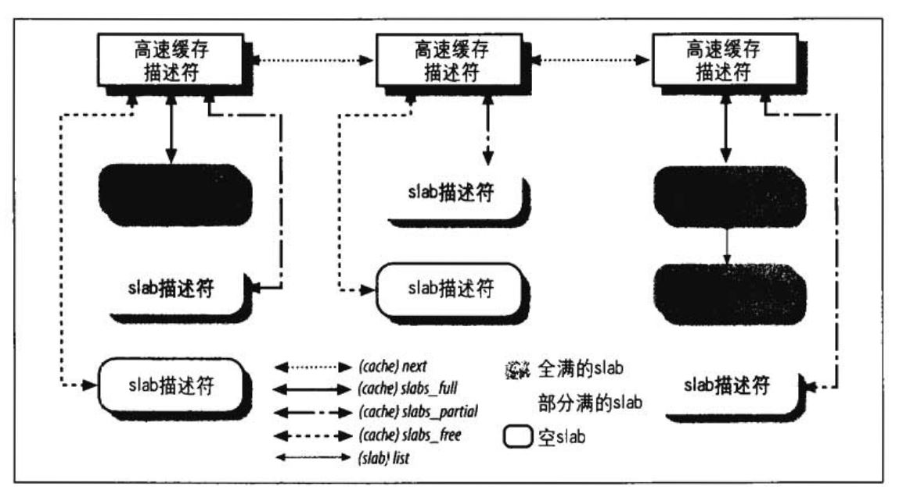

# 内存管理

RAM的某些部分永久地分配给内核，并用来存放内核代码以及静态内核数据结构。

RAM的其余部分称为动态内存(dynamic memory)

## 页框管理

### 页描述符

内核需要记录每个页框当前的状态。

例如：内核需要区分哪些页框包含的是属于进程的页，哪些页框包含的是内核代码或内核数据。内核还必须能够确定动态内存中的页是否空闲。在以下情况下页框是不空闲的：包含用户态进程的数据、某个软件高速缓存的数据、动态内存分配的内核数据结构、设备驱动程序缓冲的数据、内核模块的代码等等。

页框的状态信息保存在一个类型为page的页描述符中。所有的页描述符存放在`mem_map`数组中。因为每个描述符长度为32字节，所以`mem_map`所需要的空间略小于整个RAM的1%。

> 页描述符字段

| 类型                   | 名字      | 说明                                                         |
| ---------------------- | --------- | ------------------------------------------------------------ |
| unsigned long          | flags     | 一组标志。也对页框所在的管理区进行编号                       |
| atomic_t               | _count    | 页框的引用计数器                                             |
| atomic_t               | _mapcount | 页框中页表项数目（如果没有则为-1）                           |
| unsigned long          | private   | 可用于正在使用页的内核成分（例如，在缓冲页的情况下它是一个缓冲头指针）。如果页是空闲的，则该字段由伙伴系统使用。 |
| struct address_space * | mapping   | 当页被插入页高速缓存中时使用，或者当页属于匿名区时使用       |
| unsigned long          | index     | 作为不同含义被几种内核成分使用。例如，它在页磁盘映像或者匿名区中标识存放在页框中的数据的位置，或者它存放一个换出页标识符 |
| struct list_head       | lru       | 包含页的最近最少使用(LRU)双向链表的指针                      |

- `_count`：页的引用计数器。如果该字段为-1，则相应页框空闲，并可分配给任一进程或内核本身；如果该字段的值大于0或等于0，则说明页框被分配给了一个或多个进程，或用于存放一些内核数据结构。`page_count()`函数返回`_count`加1后的值，也就是该页的使用者的数目。
- `flags`：包含多达32个用来描述页框状态的标志。

> 描述页框状态的标志

| 标志名          | 含义                                     |
| --------------- | ---------------------------------------- |
| PG_locked       | 页被锁定。例如，在磁盘I/O操作中涉及的页  |
| PG_error        | 在传输页时发生I/O错误                    |
| PG_referenced   | 刚刚访问过的页                           |
| PG_uptodate     | 在完成读操作后置位，除非发生磁盘I/O错误  |
| PG_dirty        | 页已经被修改                             |
| PG_lru          | 页在活动或非活动页链表中                 |
| PG_active       | 页在活动页链表中                         |
| PG_slab         | 包含在slab中的页框                       |
| PG_highmem      | 页框属于`ZONE_HIGHMEM`管理区             |
| PG_checked      | 由一些文件系统（如Ext2和Ext3）使用的标志 |
| PG_arch_1       | 在80x86体系结构上没有使用                |
| PG_reserved     | 页框留给内核代码或没有使用               |
| PG_private      | 页描述符的private字段存放了有意义的数据  |
| PG_writeback    | 正在使用`writepage`方法将页写到磁盘上    |
| PG_nosave       | 系统挂起/唤醒时使用                      |
| PG_compound     | 通过扩展分页机制处理页框                 |
| PG_swapcache    | 页属于交换高速缓存                       |
| PG_mappedtodisk | 页框中的所有数据对应于磁盘上分配的块     |
| PG_reclaim      | 为回收内存对页已经做了写入磁盘的标记     |
| PG_nosave_free  | 系统挂起/恢复时使用                      |

### 非一致内存访问(NUMA)

Linux 2.6支持**非一致内存访问(Non-Uniform Memory Access, NUMA)**模型，在这种模型中，给定CPU对不同的内存单元的访问时间可能不一样。

系统的物理内存被划分为几个节点(node)。在一个单独的节点内，任一给定CPU访问页面所需的时间都是相同的。然而，对不同CPU，这个时间就可能不同。

### 内存管理区

linux把内存节点的物理内存划分为3个管理区(zone)：

- ZONE_DMA：包含低于16MB的内存页框
- ZONE_NORMAL：包含高于16MB且低于896MB的内存页框
- ZONE_HIGHMEM：包含从896MB开始高于896MB的内存页框

ZONE_DMA和ZONE_NORMAL区包含内存的"常规"页框，通常把它们线性映射到线性地址空间的第4个GB，内核就可以直接进行访问。相反，ZONE_HIGHMEM区包含的内存页就不能由内核直接访问，尽管它们也线性地映射到了线性地址空间的第4个GB。在64位体系结构上ZONE_HIGHMEM区总是空的。

### 保留的页框池

可以用两种不同的方法来满足内存分配请求，如果有足够的空闲内存可使用，请求就会被立刻满足。否则，必须回收一些内存，并且将发出请求的内核控制路径阻塞，直到有内存被释放。

但是，当请求内存时，一些内核控制路径不能被阻塞——例如，这种情况发生在处理中断或在执行临界区的代码时。在这种情况下，一条内核控制路径应当产生**原子内核分配请求** 。原子请求从不被阻塞，如果没有足够的空闲页，则仅仅是分配失败而已。

内核为原子内存分配器请求保留了一个页框池，只有在内存不足时才使用。

保留内存的数量(以KB为单位)存放在`min_free_kbytes`变量中。初始值在内核初始化时被设置，并取决于直接映射到内核线性地址空间的第4个GB的物理内存的数量——也就是说，取决于包含在ZONE_DMA和ZONE_NORMAL内存管理区内的页框数目:
$$
保留池的大小 = [ \sqrt{16 \times 直接映射内存} ](KB)
$$
但是，`min_free_kbytes`的初始值不能小于128也不能大于65536。

### 分区页框分配器

分区页框分配器(zoned page frame allocator)的内核子系统，处理对连续页框组的内存分配请求。

> 分区页框分配器的组成

其中，管理区分配器部分接受动态内存的分配与释放的请求。在请求分配的情况下，该部分搜索一个能满足所请求的一组连续页框内存的管理区。在每个管理区内，页框被名为"伙伴系统"的部分来处理。为达到更好的系统性能，小部分页框保留在高速缓存中用于快速地满足单个页框地分配请求。

### 高端内存页框地内核映射

与直接映射地物理内存地末端、高端内存地始端所应对地线性地址存放在`high_memory`变量中，它被设置为896MB。896MB边界以上地页框并不映射在内核线性地址空间的第4个GB，因此，内核不能直接访问它们。也就意味着，返回所分配页框线性地址的页分配器函数不适用于高端内存，即不适用于`ZONE_HIGHMEM`内存管理区内的页框。

64位硬件平台上不存在这个问题，因为可使用的线性地址空间远大于能安装的RAM大小，简言之，这些体系结构的`ZONE_HIGHMEM`管理区总是空的。

### 伙伴系统算法

内存分配算法必须解决外部碎片问题(external fragmentation)。

从本质上说，避免外部随眠的方法有两种：

- 利用分页单元把一组分连续的空闲页框映射到连续的线性地址空间
- 开发一种适当的技术来记录现存的空闲连续页框块的情况，以尽量避免位满足对小块的请求而分割大的空闲块。

基于下面的原因，内核采取第二种方法：

- 在某些情况下，连续的页框确实是必要的，因为连续的线性地址不足以满足请求。
- 即使连续页框的分配并不是很重要，但它在保持内核页表不变的方面所起的作用也是不容忽视的。（频繁地修改页表势必导致平均访问内存次数增加，因为这会使CPU频繁地刷新转换后援缓冲器(TLB)的内容。
- 内核通过4MB的页可以访问大块连续物理内存。这样减少了TLB的失效率，因此提高了内存的平均速度。

Linux采用著名的伙伴系统(buddy system)算法来解决外部碎片的问题。把所有空闲页框分组位11块链表，每个块链表分别包含大小为1,2,4,8,16,32,64,128,256,512,1024个连续的页框。对1024个页框的最大请求对应着4MB大小的连续RAM块。

内核试图把大小为b的一对空闲伙伴合并为要给大小为2b的单都块。满足以下条件的两个块称为伙伴：

- 两个块具有相同的大小，记作b。
- 它们的物理地址是连续的。
- 第一块的第一个页框的物理地址是$2 \times b \times 2^{12}$的倍数

该算法是迭代的，如果它成功合并所释放的块，它会试图合并2b的块，以再次试图形成更大的块。

### 每CPU页框高速缓存

内核经常请求和释放单个页框。为了提升系统性能，每个内存管理区定义了一个"每CPU"页框高速缓存。所有"每CPU"高速缓存包含一些预先分配的页框，它们被用于满足本地CPU发出的单一内存请求。

实际上，这里为每个内存管理区和每个CPU提供了两个高速缓存：一个热高速缓存，它存放的页框中所包含的内容很可能就在CPU硬件高速缓存中；还有一个冷高速缓存。

如果内核或用户态进程在刚分配到页框后就立即向页框写，那么从热高速缓存中获取页框就对系统性能有利。实际上，每次对页框储存单元的访问都会导致从另一个页框中给硬件高速缓存“窃取”一行——当然，除非硬件高速缓存包含有一行：它映射刚被访问的“热”页框单元。

反过来，如果页框将要被DMA操作填充，那么从冷高速缓存中获取页框是方便的。在这种情况下，不会涉及CPU，并且硬件高速缓存的行不会被修改。冷高速缓存获得页框为其他类型的内存分配保存了热页框储备。

实现每CPU页框高速缓存的主要数据结构存放在内存管理区描述符的pageset字段中的一个`per_cpu_pageset`数据数据结构。该数组包含为每个CPU提供的一个元素；这个元素依次由两个`per_cpu_pageset`描述符组成，一个留给热高速缓存而另一个留给冷高速缓存。

> per_cpu_pages描述符的字段

| 类型             | 名称  | 描述                                 |
| ---------------- | ----- | ------------------------------------ |
| int              | count | 高速缓存中的页框个数                 |
| int              | low   | 下界，表示高速缓存需要补充           |
| int              | high  | 上界，表示高速缓存用尽               |
| int              | batch | 在高速缓存中将要添加或删去的页框个数 |
| struct list_head | list  | 高速缓存中包含的页框描述符链表       |

内核使用两个位标志来监视热高速缓存和冷高速缓存大小：

- 如果页框个数低于下界low，内核通过从伙伴系统中分配batch个单一页框来补充对应的高速缓存
- 如果页框个数高于上界high，内核从高速缓存释放batch个页框到伙伴系统中。

值batch、low和high本质上取决于内存管理区中包含的页框个数。

## 内存区管理

伙伴算法系统采用页框作为基本内存区，这适合对于大块内存的请求。

为了存放很少的字节而分配一整个页框这显然是一种浪费，取而代之的正确方法就是引入一种新的数据结构来描述在同一页框中如何分配小内存区。但是也引出了一个新的问题，即所谓的内部碎片(internal fragmentation)。内部碎片的产生主要是由于请求内存大小与分配给它的大小不匹配造成的。

### slab分配器

算法基于以下前提：

- 所存放的数据结构的类型可以影响内存区的分配方式。slab分配器概念扩充了这种思想，并把内存区看作对象(object)。为了避免重复初始化对象，slab分配器并不丢弃已经分配的对象，而是释放它们但把它们保存在内存中。当以后又要请求新的对象时，就可以从内存获取而不用重新初始化。
- 内核函数倾向于反复请求同一类型的内存区。例如，只要内核创建一个新进程，它就要为一些固定大小的表[如进程描述符、打开文件对象等]分配内存区。当进程结束时，包含这些表的内存区还可以被重新使用。因为进程的创建和撤销非常频繁，在没有slab分配器时，内核把时间浪费在反复分配和回收哪些包含在同一内存区的页框上；slab分配器把那些页框保存在高速缓存中并很快地重新使用它们。
- 对内存区地请求可以根据它们发生地频率来分类。对于预期频繁请求一个特定大小地内存区而言，可以通过创建一组具有适当大小地专用对象来高效地处理，由此以避免内部碎片的产生。另一种情况，对于很少遇到的内存区的大小，可以通过基于一系列几何分布大小（如早期linux版本使用的2的幂次方大小）的对象的分配模式来处理，即使这种方法会导致内部碎片的产生。
- 在引入对象的大小不是几何分布的情况下，也就是说，数据结构的起始物理地址不是2的幂次，这可以借助处理器硬件高速缓存而导致较好的性能。
- 硬件高速缓存的高性能又是尽可能地限制对伙伴系统分配器调用的另一个理由，因为对伙伴系统函数的每次调用都"弄脏"硬件高速缓存，所以增加了对内存的平均访问时间。内核函数对硬件高速缓存的影响就是所谓的函数“足迹(footprint)”，其定义为函数结束时重写高速缓存的百分比。显而易见，大的“足迹”导致内核函数刚执行之后较慢的代码执行，因为硬件高速缓存此时填满了无用的信息。

slab分配器把对象分组放进高速缓存。每个高速缓存都是同种类型对象的一种“储备”。

包含高速缓存的主内存区被划分为多个slab，每个slab由一个或多个连续的页框组成，这些页框中既包含已分配的对象，也包含空闲的对象。

> slab分配器组成

### 高速缓存描述符

每个高速缓存描述符由kmem_cache_t(等价于struct kmem_cache_s类型)类型的数据结构来描述的。

......

### slab 描述符

高速缓存中的每个slab都有自己的类型为slab的描述符。

> slab 描述符字段

| 类型             | 名称      | 说明                                                         |
| ---------------- | --------- | ------------------------------------------------------------ |
| struct list_head | list      | slab描述符的三个双向循环链表中的一个(在高速缓存描述符的kmem_list3结构中的slabs_full、slabs_partial或slabs_free链表)使用的指针 |
| unsigned long    | colouroff | slab中第一个对象的偏移                                       |
| void *           | s_mem     | slab中的第一个对象(或者已被分配，或者空闲)的地址             |
| unsigned int     | inuse     | 当前正在使用的（分空闲）slab中的对象个数                     |
| kmem_bufctl_t    | free      | slab中下一个空闲对象的下标，如果没有剩下空闲对象则为BUFCTL_END |

slab描述符可能存放在两个地方：

- 外部slab描述符 ：存放在slab外部，位于cache_sizes指向的一个不适合ISA DMA的普通高速缓存中。
- 内部slab描述符：存放在slab内部，位于分配给slab的第一个页框的起始位置。

当对象小于512MB时，或者当内部碎片为slab描述符和对象描述符在slab中留下足够的空间时，slab分配器选择第二种方案。如果slab描述符存放在slab外部，那么高速缓存描述符的flags字段中的CFLGS_OFF_SLAB标志置为1；否则它被置为0。

> 高速缓存描述符与slab描述符之间的关系

### 给高速缓存分配slab

一个新创建的高速缓存没有包含任何slab。只有当以下两个条件都为真时，才给高速缓存分配slab：

- 已发出一个分配新对象的请求
- 高速缓存不包含任何空闲对象

### 从高速缓存撤销slab

在两种条件下才能撤销slab：

- slab高速缓存中有太多空闲的对象
- 被周期性调用的定时器函数确定是否有完全未使用的slab能被释放

### 对齐内存中的对象                                                                                                                                                                                                                                                                                                                                         

slab分配器所管理的对象可以在内存中进行对齐，也就是说，存放它们的内存单元的起始物理地址是一个给定常量的倍数，通常是2的倍数。这个常量就是对齐因子（alignment factor)。

slab分配器所允许的最大对其因子是4096，即页框大小。

通常情况下，如果内存单元的物理地址是字大小（即计算机的内部内存总线的宽度）对齐的，那么，微机对内存单元的存取会非常快。

### slab着色

同一硬件高速缓存行可以映射RAM中很多不同的块。相同大小的对象倾向于存放在高速缓存内相同的偏移量处。

在不同slab内具有相同偏移量的对象最终很可能映射在同一高速缓存行中。

高速缓存的硬件可能因此而花费内存周期在同一高速缓存行与RAM内存单元之间来来往往传送两个对象，而其他的高速缓存行并未充分使用。

slab通过一种叫做slab着色（slab coloring）的策略，尽量降低高速缓存这种不愉快的行为。

### 内存池

内存池（memery pool）是linux 2.6的一个新特性。基本上将，一个内存池允许一个内核成分，如块设备子系统，仅在内存不足的紧急情况下分配一些动态内存来使用。

与保留的页框池不同，保留的页框池只用于满足中断处理程序或内部临界区发出的原子内存分配请求。

内存池则是动态内存的储备，只能被特定的内核成分（内存池的拥有者）使用。拥有着通常不使用储备，但是，如果动态内存变得极其稀有以至于普通内存分配请求都将失败的话，那么作为最后的解决手段，内核成分就能调用特定的内存池函数提取得到储备所需的内存。

一个内存池通常叠加在slab分配器之上——也就是说，它被用来保存slab对象的储备。

内存池通常可以被用来分配任何一种类型的动态内存，从整个页框到使用`kmalloc()`分配的小内存区。

## 非连续内存区管理

把内存区映射到一组连续的页框是最好的选择，这样会充分利用高速缓存并获得较低的平均访问时间。如果对内存区的请求不是很频繁，通过连续的线性地址访问非连续的页框这样一种分配模式就会很有意义。这种模式的主要优点是避免了外部碎片，而缺点是必须打乱内核页表。

。。。