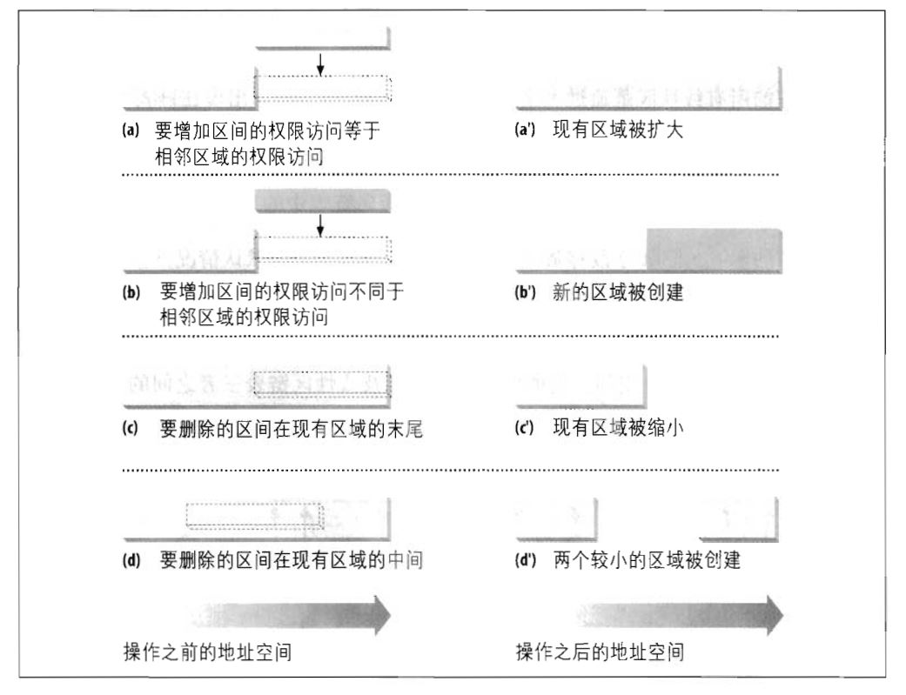
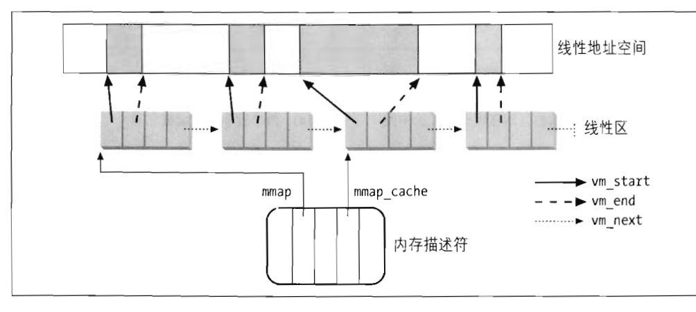
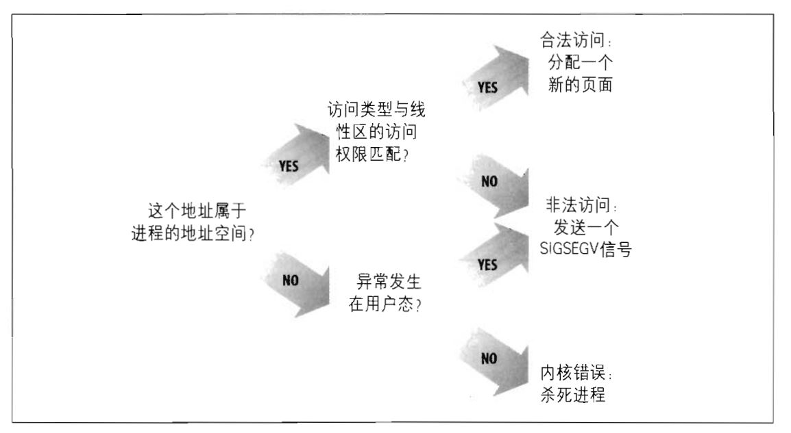
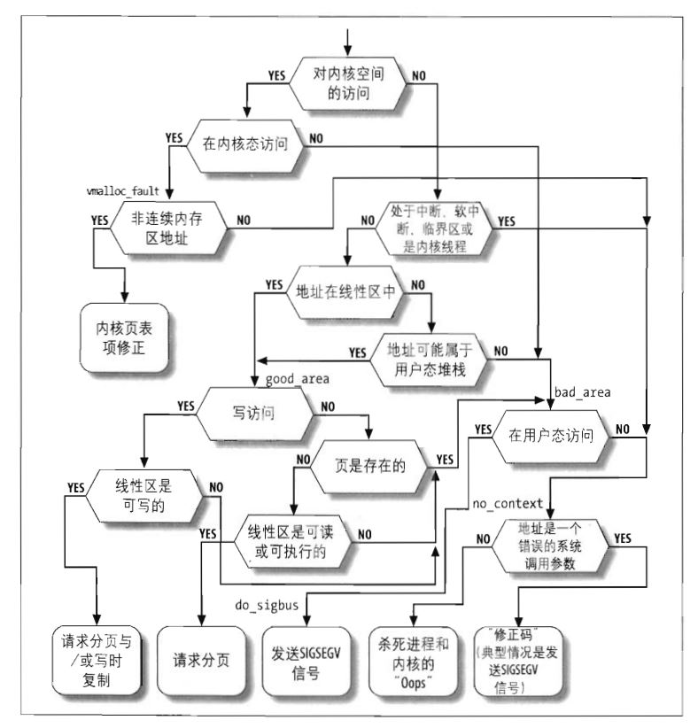

# 进程地址空间

内核中的函数总是以相当直接了当的方式获得动态内存，这是通过调用以下几种函数中的一个达到的：`__get_free_pages()`或者`alloc_pages()`从分区页框分配器中获得页框，`kmem_cache_alloc()`或`kmalloc()`使用slab分配器为专用或通用对象分配块，而`vmalloc()`或`vmalloc_32()`获得一块非连续的内存区。如果所请求的内存区得以满足，这些函数都返回一个页描述符地址或线性地址（即所分配动态内存区的起始地址）。

使用这些简单方法基于以下两个原因：

- 内核是操作系统中优先级最高的成分。如果某个内核函数请求动态内存，那么，必定有正当的理由发出那个请求，因此，没有道理试图推迟这个请求。
- 内核信任自己。所有的内核函数都被假定是没有错误的，因此内核函数不必插入针对编程错误的任何保护措施。

当给用户态分配内存时，情况完全不同：

- 进程对动态内存的请求被认为是不紧迫的。一般来说，内核总是尽量推迟给用户态进程分配动态内存。
- 由于用户进程是不可信任的，因此，内核必须能随时准备捕获用户态进程引起的所有寻址错误。

内核使用了一种新的资源实现了对进程动态内存的推迟分配。当用户态进程请求动态内存时，并没有获得请求的页框，而仅仅获得对一个新的线性区间的使用权，而这一线性地址空间成为进程地址空间的一部分。这一区间叫做“线性区”(memory region)

## 进程的地址空间

进程的地址空间（address space）由允许进程使用的全部线性地址组成。

内核通过所谓线性区资源来表示线性地址空间，线性区是由起始线性地址、长度和一些访问权限来描述的。为了效率起见，其实地址和线性区的长度都必须是4096的倍数，以便每个线性区所识别的数据完全填满分配给它的页框。

获得新线性区的一些典型情况：

- 当用户在控制台输入一条命令时，shell进程创建一个新的进程去执行这个命令。结果是一个全新的地址空间分配给了新进程。
- 正在运行的进程有可能决定装入一个完全不同的程序。在这种情况下，进程标识符仍然保持不变，可是在装入这个程序以前所使用的线性区却被释放，并有一组新的线性区分配给这个进程。
- 正在运行的进程可能对一个文件（或它的一部分）执行“内存映射"。在这种情况下，内核给这个进程分配一个新的线性区来映射这个文件。
- 进程可能持续向它的用户态堆栈增加数据，直到映射这个堆栈的线性区用完为止。在这种情况下，内核也许会决定扩展这个线性区的大小。
- 进程可能创建一个IPC共享线性区来与其他合作进程共享数据。在这种情况下，内核给这个进程分配一个新的线性区以实现这个方案。
- 进程可能通过调用类似malloc()这样的函数扩展自己的动态区(堆)。结果是，内核可能决定扩展给这个堆分配的线性区。

| 系统调用           | 说明                                           |
| ------------------ | ---------------------------------------------- |
| brk()              | 改变进程堆的大小                               |
| execve()           | 装入一个新的可执行文件，从而改变进程的地址空间 |
| _exit()            | 结束当前进程并撤销它的地址空间                 |
| fork()             | 创建一个新的进程，并为它创建新的地址空间       |
| mmap(), mmap2()    | 为文件创建一个内存映射，从而扩大进程的地址空间 |
| mremap()           | 扩大或缩小线性区                               |
| remap_file_pages() | 为文件创建非线性区映射                         |
| munmap()           | 撤销对文件的内存映射，从而缩小进程的地址空间   |
| shmat()            | 创建一个共享线性区                             |
| shmdt()            | 撤销一个共享线性区                             |

## 内存描述符

与进程地址空间的全部信息都包含在一个叫做**内存描述符(memory descriptor)**的数据结构中，这个结构类型为`mm_struct`，进程描述符的`mm`字段就指向这个数据结构。

所有的内存描述符存放在一个双向链表中。

### 内核线程的内存描述符

内核线程仅运行在内核态，因此，它们永远不会访问低于`TASK_SIZE`（等于`PAGE_OFFSET`，通常为0xc0000000）的地址。与普通进程相反，内核线程不用线性区，因此，内存描述符的很多字段对内核线程都是没有意义的。

因为大于 `TASK_SIZE`线性地址的相应页表项都应该总是相同的，因此，一个内核线程到底使用了什么样的页表集根本就没有什么关系。为了避免无用的TLB和高速缓存的刷新，内核线程使用一组最近运行的普通进程的页表。结果，在每个进程描述符中包含了两种内存描述符指针： `mm`和`active_mm`。

...

## 线性区

Linux通过类型为`vm_area_struct`的对象实现线性区。

进程所拥有的线性区从来不重叠，并且内核尽力把新分配的线性区与紧邻的现有线性区进行合并。如果两个相邻区的访问权限相匹配，就能把它们合并到一起。

> 增加或删除一个线性区地址空间



### 线性区数据结构

进程所拥有的所有线性区是通过一个简单的链表链接在一起的。出现在链表中的线性区是按内存地址的升序排列的；不过，每两个线性区可以由未用的内存地址隔开。

每个`vm_area_struct`元素的`vm_next`字段指向链表的下一个元素。内核通过进程的内存描述符的`mmp`字段来查找线性区，其中`mmap`字段指向链表中的第一个线性区描述符。

内存描述符的`map_count`字段存放进程所拥有的线性区数目。

> 与进程地址相关的描述符



Linux2.6把内存描述符同时放在红黑树中。

为了存放进程的线性区，Linux既使用了链表，也使用了红黑树。这两种数据结构包含指向同一线性区描述符的指针，当插入或删除一个线性区描述符时，内核通过红黑树搜索前后元素，并用搜索结果快速更新链表而不用扫描链表。

一般来说，红黑树用来确定含有指定地址的线性区，而链表通常在扫描整个线性区集合时来使用。

### 分配线性区地址空间

`do_mmap()`函数为当前进程创建并初始化一个新的线性区。分配成功之后，可以把这个新的饿线性区与进程已有的其他线性区进行合并。

`do_mmap()`函数使用下面的参数：

- `file`和`offest`：如果新的线性区把一个文件映射到内存，则使用文件描述符指针file和文件偏移量offset。
- `addr`：这个线性地址指定从何处开始查找一个空闲的区间。
- `len`：线性地址区间的长度
- `prot`：这个参数指定这个线性区所包含页的访问权限。
- `flag`：这个参数指定线性区的其他标志。
  - `MAP_SHARED`和`MAP_PRIVATE`：前一个标志指定线性区中的页可以被几个进程共享；后一个标志作用相反。这两个标志都与`vm_area_struct`描述符中的`VM_SHARED`标志有关。
  - `MAP_FIXED`：区间的起始地址必须是由参数`addr`所指定的。
  - `MAP_ANONYMOUS`：没有文件与这个线性区相关联
  - `MAP_NORESERVE`：函数不必预先检查空闲页框的数目
  - `MAP_POPULATE`：函数应该为线性区建立的映射提前分配需要的页框。该标志仅对映射文件的线性区和IPC共享的线性区有意义。
  - `MAP_NONBLOCK`：只有在`MAP_POPULATE`标志置位时才有意义：提前分配页框时，函数肯定不会阻塞。


`do_mmap()`函数对`offset`的值进行检查，然后执行`do_mmap_pgoff()`函数。这里仅对匿名线性区的实现进行讨论：

1. 检查参数是否正确，主要检查以下条件

   - 线性区地址区间的长度为0或者包含的地址大于`TASK_SIZE`
   - 进程已经映射了过多的线性区，因此`mm`内存描述符的`map_count`字段的值超过了允许的范围
   - flag参数指定的新线性区地址区间的页必须被锁在RAM中，但不允许进程创建上锁的线性区，或者进程加锁页的总数超过了保存在进程描述符`signal->rlim[RLIMIT_MENLOCK].rlim_cur`字段中的阈值。

   如果以上情况中的任何一个成立，则`do_mmap_pgoff()`函数终止并返回一个负值。如果线性区的地址空间长度为0，则函数不执行任何操作就返回。

2. 调用`get_unmapped_area()`获得新线性区的线性地址区间

3. 通过把存放在`prot`和`flags`参数中的值进行组合来计算新线性区描述符的标志。

4. 调用`find_vma_prepare()`确定处于新区间之前的线性区对象的位置，以为在红黑树中线性区的位置。

   ```c
   for(;;) {
   	vma = find_vma_perpare(mm, addr, &prev, &rb_link, &rb_parent);
       if(!vma || vma->vm_struct >= addr + len)
           break;
       if(do_mummap(mm, addr, len))
           return -ENOMEM;
   }
   ```

   `find_vma_prepare()`函数也检查是否还存在与新区间重叠的线性区。如果返回一个非空的地址，这个地址指向一个线性区，而该区的起始位置位于新区间结束地址之前的时候。这种情况下，`do_mmap_pgoff()`调用`do_munmap()`删除新区间，然后重复这个步骤。

5. 检查插入新的线性区是否引起进程地址空间的大小（`mm->total_vm < PAGE_SHIFT) + len`）超过存放在进程描述符`signal->flim[RLIMIT_AS].rlim_cur`字段中的阈值。如果是，就返回出错码`-ENOMEM`。

6. 如果在`flags`参数中没有设置`MAP_NORESERVE`标志，新的线性区包含私有可写页，并且没有足够的空闲页框，则返回出错码`-ENOMEM`；这最后一个检查是由`security_vm_enough_memory()`函数实现的。

7. 如果新区间是私有的（没有设置`VM_SHARED`），且映射的不是磁盘上的一个文件，那么，调用`vma_merge()`检查前一个线性区是否可以以这样的方式进行扩展来包含新区间。要求前一个线性区必须与在`vm_flags`局部变量中存放标志的那些线性区具有完全相同的标志。如果前一个线性区可以扩展，那么，`vma_merge()`页试图把它与随后的线性区进行合并。一旦扩展前一个线性区成功，则跳转到第12步。

8. 调用`slab`分配函数`kmem_cheche_alloc()`为新线性区分配一个`vm_area_struct`数据结构。

9. 初始化新的线性区对象。

10. 如果`MAP_SHARED`标志被设置（以及新的线性区不映射磁盘上的文件），则该线性区是一个共享匿名区；调用`shmem_zero_setup()`对它进行初始化。共享匿名区主要用于进程间通信。

11. 调用`vma_link()`把新线性区插入到线性区链表和红黑树中。

12. 增加存放在内存描述符`total_vm`字段中的进程地址空间大小。

13. 如果设置了`VM_LOCKED`标志，就调用`make_pages_present()`连续分配线性区的所有页，并把它们锁在RAM中。

14. 最后，函数通过返回新线性区的线性地址而终止。

### 释放线性区地址空间

内核使用`do_mummap()`函数从当前进程的地址空间中删除一个线性地址区间。参数为：进程内存描述符的地址`mm`，地址区间的起始地址`strat`和它的长度`len`。要删除的区间并不总是对应一个线性区，它或许是一个线性区的一部分，或许跨越两个或多个线性区。

#### `do_munmap()`函数

该函数经过两个主要的阶段。第一阶段，扫描进程所拥有的线性区链表，并把包含在进程地址空间的线性地址空间中的所有线性区从链表中解除链接。第二阶段，更新进程的页表，并把第一阶段找到并标识出的线性区删除。函数利用稍后要说明的`split_vma()`和`unmap_region()`函数。`do_munmap()`执行下面的步骤：

1. 对参数值进行一些初步检查：如果线性地址区间所含的地址大于`TASK_SIZE`，如果`start`不是4096的倍数，或者线性区地址区间的长度为0，则函数返回一个错误代码`-EINVAL`。

2. 确定要删除的线性区地址区间之后的第一个线性区`mpnt`的位置(`mpnt->end > start`)，如果有这样的线性区：

   ```c
   mpnt = find_vma_prev(mm, start, &prev);
   ```

3. 如果没有这样的线性区，也没有与线性区间重叠的线性区，就什么都不做：

   ```c
   end = start + len;
   if(!mpnt || mpnt->vm_start >= end)
   	return 0;
   ```

4. 如果线性区的起始地址在线性区`mpnt`内，就调用`split_vma()`把线性区`mpnt`划分为两个较小的区；一个区在线性区间外部，而另一个在区间内部。

   ```c
   if(start > mpnt->vm_start) {
   	if(split_vma(mm, mpnt, start, 0))
   		return -ENOMEM;
   	prev = mpnt;
   }
   ```

   更新局部变量`prev`，以前它存储的是指向线性区`mpnt`前面一个线性区的指针，现在要让它指向`mpnt`，即指向线性地址区间外部的那个新线性区。`prev`仍然指向要删除的第一个线性区前面的那个线性区。

5. 如果线性区地址区间的结束地址在一个线性区内部，就再次调用`split_vma()`把最后重叠的那个线性区划分成两个较小的区：一个区在线性区地址区间的内部，而另一个在区间外部。

   ```c
   last = find_vma(mm, end);
   if(last && end > last->vm_start) {
   	if(split_vma(mm, last, start, end , 1))
   		return -ENOMEM;
   }
   ```

6. 更新`mpnt`的值，使它指向线性地址区间的第一个线性区。如果`prev`为NULL，即没有上述线性区，就从`mm->mmap`获得第一个线性区的地址：

   ```c
   mpnt = prev ? prve->vm->next : mm->mmap;
   ```

7. 调用`detach_vmas_to_be_unmaped()`从进程的线性地址空间中删除位于线性地址区间中的线性区。要删除的线性区的描述符放在一个排好序的链表中，局部变量`mpnt`指向该链表的头。

8. 获得`mm->page_table_lock`自旋锁

9. 调用`unmap_region()`清除与线性地址区间对应的页表项并释放相应的页框。

10. 释放`mm->page_table_lock`自旋锁

11. 释放在第7步建立链表时收集的线性区描述符，对在链表中的所有线性区调用`unmap_vma()`函数，它本质上执行下述步骤:

    1. 更新`mm->total_vm`和`mm->locked_vm`字段
    2. 执行内存描述符的`mm->unmap_area`方法。
    3. 调用线性区的`close`方法（如果定义了的话）
    4. 如果线性区是匿名的，则函数把它从`mm->anon_vma`所指向的匿名线性链表中删除。
    5. 调用`kmem_cache_free()`释放线性区描述符

12. 返回0（成功）

## 缺页异常处理程序

Linux的缺页(Page Fault)异常处理程序必须区分两种情况：

1. 由编程引起的异常
2. 由引用属于进程地址空间但还尚未分配物理页框的页引起的异常

> 缺页异常处理程序的总体方案



`do_page_fault()`函数接收以下输入参数：

- `pt_regs`结构的地址`regs`，改结构包含当异常发生时的微处理器寄存器的值
- 3位的`error_code`，当异常发生时由控制单元压入栈中。这些位有以下含义
  - 如果第0位被清0，则异常由访问一个不存在的页所引起；否则，如果第0位被设置，则异常由无效的访问权限所引起
  - 如果第1位被清0，则异常由读访问或者执行访问所引起；如果该位置被设置，则异常由写访问所引起
  - 如果第2位被清0，则异常发生在处理器处于内核态时；否则，异常发生在处理器处于用户态时。

> 缺页处理程序流程图



`do_page_fault()`首先检查引起缺页的线性地址是否属于第4个GB:

```c
info.si_code = SEGV_MAPERP;
if(address >= TASK_SIZE) {
	if(!error_code & 5)
		goto vmlloc_fault;
	goto bad_area_nosemaphore;
}
```

如果发生了由于内核试图访问不存在的页框引起的异常，就跳转去执行`vmlloc_fault`标记处的代码，该部分代码处理可能由于在内核态访问非连续内存区而引起的缺页。否则就去跳转执行`bad_area_nosemaphore`标记处的代码。

### 请求调页

