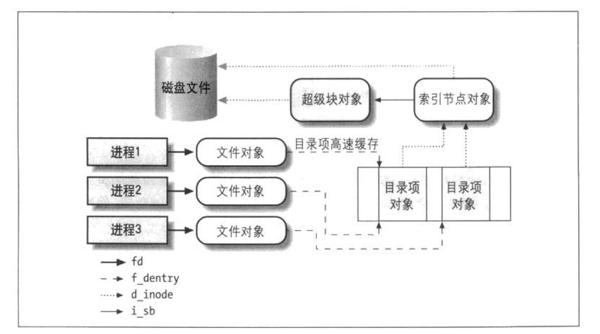

# 虚拟文件系统

### 虚拟文件系统（VFS）的作用

虚拟文件系统(Virtual Filesystem)也可以称之为虚拟文件系统转换(Virtual Filesystem Switch, VFS)，是一个内核软件层，用来处理于Unix标准文件系统相关的所有系统调用。

VFS支持的文件系统可以划分为三种主要类型：

- **磁盘文件系统**
  - 这些文件系统管理在本地磁盘分区中可用的储存空间或者其他可以起到磁盘作用的设备（比如说一个USB闪存）
- **网络文件系统**
  - 这些文件系统允许轻易地访问属于其他网络计算机的文件系统所包含的文件。
- **特殊文件系统**
  - 这些文件系统部管理本地或者远程磁盘空间。/proc文件系统是特殊文件系统的一个典型范例。

Unix目录建立了一颗根目录为"/"的树。根目录包含在文件系统(root filesystem)中，在Linux中这个跟文件系统通常是Ext2或Ext3类型。其他所有文件系统都可以被”安装“在根文件系统的子目录中。

基于磁盘的文件系统通常放在硬件设备中，如硬盘、软盘或者CD-ROM。

#### 通用文件模型

VFS所隐含的主要思想在于引入一个通用的文件模型(common file model)，这个模型能够表示所有支持的文件系统。不过，要实现每个具体的文件系统，必须将其物立组织结构转换为虚拟文件系统的通用文件模型。

从本质上说，Linux内核不能对一个特定的函数进行硬编码来执行诸如read()或ioctl()这样的操作，而是对每个操作都必须使用一个指针，指向要访问的具体文件系统的适当函数。

通用文件模型由下列对象组成：

- **超级块对象(superblock object)**
  - 存放已安装文件系统的有关信息。对基于磁盘的文件系统，这类对象通常对于存放在磁盘上的**文件系统控制块(filesystem control block)**
- **索引节点对象(inode object)**
  - 存放关于具体文件的一般信息。对于基于磁盘的文件系统，这类对象通常对应于存放在磁盘上的**文件控制块(file control block)**。每个索引节点对象都有一个索引节点号，这个节点号唯一地标识文件系统中的文件。
- **文件对象(file object)**
  - 存放打开文件与进程之间进行交互的有关信息。这类信息仅当进程访问文件期间存在内核内存中。
- **目录项对象(dentry object)**
  - 存放目录项（也就是文件的特定名称）与对应文件进行链接的有关信息。每个磁盘文件系统都以自己特有的方式将改类信息存放在磁盘上。

> 进程与VFS对象之间的交互

例如：三个不同的进程已经打开同一个文件，其中两个进程使用同一个硬链接。在这种情况下，每个进程都使用自己的文件对象，但只需要两个目录项对象，每个硬链接对应一个目录项对象。这两个目录项对象指向同一个索引节点文件，该索引节点对象标识超级块对象，以及随后的普通磁盘文件。

最近最常使用的目录项被存放在所谓目录项高速缓存 (dentry cache)的**磁盘高速缓存**中，以加速从文件路径名到最后一个路径分量的索引节点的转换过程。

一般来说，**磁盘高速缓存(disk cache)**属于软件机制，它允许内核将原本存在磁盘上的某些信息保存在RAM中，以便这些数据得的进一步访问能快速进行，而不必慢速访问磁盘本身。

磁盘高速缓存不同于**硬件高速缓存**或**内存高速缓存**，后两者都与磁盘或者其他设备无关。硬件高速缓存是一个快速静态RAM，它加快了直接对慢速动态RAM的请求。内存高速缓存是一种软件机制，引入它是为了绕过内核内存分配器。

除了**目录项高速缓存**和**索引节点高速缓存**之外，Linux还使用其他磁盘高速缓存。其中最重要的一种就是**页高速缓存**。

### VFS数据结构

#### 超级块对象

所有超级块对象都以双向循环链表的形式链接在一起。

