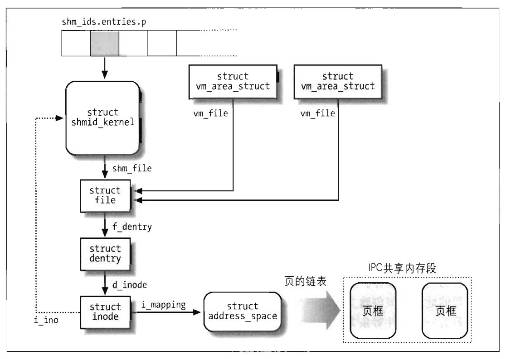

# 进程通信

## System V IPC

### IPC 共享内存

共享内存机制允许两个或多个进程通过把公共数据结构放入一个共享内存区(IPC shared memory region)来访问它们。如果进程要访问这种存放在共享内存区的数据结构，就必须在自己的地址空间中增加一个新内存区，它将映射与这个共享内存区相关的页框。这样的页框可以很容易地由内核通过请求调页进行处理。

- 调用`shmget()`函数来获得一个共享内存地IPC标识符，如果这个共享内存区不存在，就创建它。
- 调用`shmat()`函数把一个共享内存区"附加(attach)"到一个进程上。该函数使用IPC共享内存资源地标识符作为参数，并试图把一个共享内存加入到调用进程的地址空间中。调用进程可以获得这个内存区域的起始线性地址，但是这个地址通常不重要，访问这个共享内存区的每个进程都可以使用自己地址空间中的不同地址。`shmat()`函数不修改进程的页表。
- 调用`shmdt()`函数来”分离“由IPC标识符所指定的共享内存区域，也就是说把响应的共享内存区域从进程的地址空间删除。IPC共享内存资源是持久的，即使现在没有进程在使用它，相应的页也不能被丢弃，但是可以被换出。

> IPC共享内存数据结构

> shmid_kernel数据结构中的字段

| 类型                 | 字段       | 说明                                               |
| -------------------- | ---------- | -------------------------------------------------- |
| struct kern_ipc_perm | shm_perm   | kern_ipc_perm数据结构                              |
| struct file *        | shm_file   | 共享段的特殊文件                                   |
| int                  | id         | 共享段的位置索引                                   |
| unsigned long        | shm_nattch | 当前附加的内存区数                                 |
| unsigned long        | shm_segsz  | 内存区字节数                                       |
| time_t               | shm_atim   | 最后访问时间                                       |
| time_t               | shm_dtim   | 最后分离时间                                       |
| time_t               | shm_ctim   | 最后修改时间                                       |
| pid_t                | shm_cprid  | 创建者的PID                                        |
| pid_t                | shm_lprid  | 最后访问进程的PID                                  |
| struct user_struct * | mlock_user | 锁定在共享内存RAM中的用户的user_struct描述符的指针 |

字段`shm_file`是存放文件对象的地址。Linux 2.6中IPC共享内存与VFS紧密结合。每个IPC共享内存区与属于shm特殊文件系统的一个普通文件关联。

因为shm文件系统在系统目录中没有安装点，因此，用户不能通过普通的VFS系统调用打开并访问它的文件。但是，只要进程"附加"一个内存段，内核就调用`do_mmap()`，并在进程的地址空间创建文件的一个新的共享内存映射。因此，属于shm特殊文件系统的文件只有一个文件对象方法mmap，该方法是由`shm_mmap()`函数实现的。

对于任何共享内存映射，通过`address_space`对象把页框包含在页高速缓存中，而`address_space`对象包含在索引节点中而且被索引节点的`i_mapping`字段引用。万一页框属于IPC共享内存区，`address_space`对象的方法就存放在全局变量`shmem_aops`中。

#### 换出IPC共享内存区的页

因为IPC共享内存区映射的是在磁盘上没有映像的特殊索引节点，因此其页是可交换的。因此为了回收IPC共享内存区的页，内核必须把它写入交换区。因为IPC共享内存区是持久的——也就是说内存段不附加到进程，也必须保留这些页。因此即使这些页没有进程在使用，内核也不能简单地删除它们。

...

#### IPC共享内存区的请求调页

通过`shmat()`加入进程的页都是哑元页(dummy page)；该函数把一个新内存区加入一个进程地址空间中，但是它不修改进程的页表。IPC共享内存区的页可以被换出。因此，可以通过请求调页机制来处理这些页。

当进程试图访问IPC共享内存区的一个单元，而其基本的页框还没有分配时则发生缺页异常。相应的异常处理程序确定引起的缺页的地址是在进程的地址空间内，且相应的页表项为空；因此，它就调用`do_no_page()`函数。这个函数又检查是否为了这个内存区定义了`nopage`方法。然后调用这个方法，并把页表项设置成所返回的地址。

IPC共享内存所使用的内存区通常定义了`nopage`方法。这是通过`shmem_nopage()`函数实现的，该函数执行以下操作：

1. 遍历VFS对象的指针链表，并导出IPC共享内存资源的索引节点对象的地址。
2. 从内存区域描述符的`vm_start`字段和请求的地址计算共享内存内的逻辑页号
3. 检查页是否已经在交换高速缓存中，如果是，则结束并返回描述符的地址
4. 检查页是否在交换高速缓存内且是否最新，如果是，则结束并返回该描述符地址。
5. 检查内嵌在索引节点对象的`shmem_inode_info`是否存放着逻辑页号对应的换出页标识符。如果是，就调用`read_swap_cache_async()`执行换入操作，并一直等到数据传送完成，然后结束并返回页描述符的地址。
6. 否则，页不在交换区中；因此就从伙伴系统中分配一个新页框，把它插入到页高速缓存，并返回它的地址。

`do_no_page()`函数对引起缺页的地址在进程的页表中所对应表项进行设置，以使该函数指向`nopage`方法返回的页框。