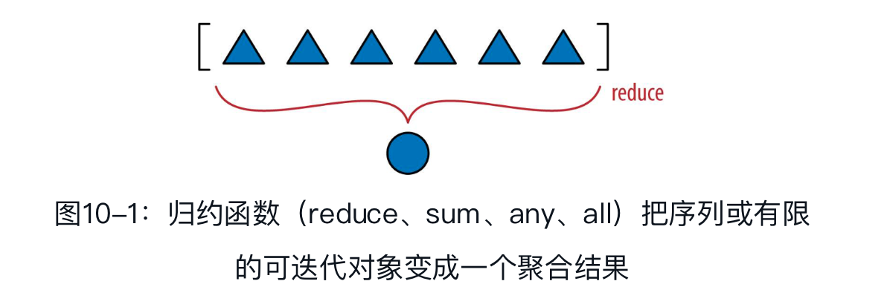

## 序列的修改、散列和切片

### 协议和鸭子类型

在Python中创建功能完善的序列类型无需使用继承，只需实现符合序列协议的方法。

在面向对象编程中，协议是非正式的接口，只在文档中定义，在代码中不定义。例如，Python的序列协议只需要`__len__`和`__getitem__`两个方法。任何类（如Spam），只要使用标准的签名和语义实现了这两个方法，就能用在任何期待序列的地方。Spam是不是哪个类的子类无关紧要，只要提供了所需的方法即可。

协议是非正式的，没有强制力，因此如果你知道类的具体使用场景，通常只需要实现一个协议的部分。例如，为了支持迭代，只需实现`__getitem__`方法，没必要提供`__len__`方法。

### Vector类第3版：动态存取属性

属性查找失败后，解释器会调用`__getattr__`方法。简单来说，对my_obj.x表达式，Python会检查my_obj实例有没有名为x的属性；如果没有，到类（`my_obj.__class__`）中查找；如果还没有，顺着继承树继续查找。[插图]如果依旧找不到，调用my_obj所属类中定义的`__getattr__`方法，传入self和属性名称的字符串形式（如'x'）。

```python
shortcut_names = 'xyzt'
def __getattr__(self, name):
    cls = type(self)  ➊
    if len(name) == 1:  ➋
        pos = cls.shortcut_names.find(name)  ➌
        if 0 <= pos < len(self._components):  ➍
            return self._components[pos]
    msg = '{.__name__!r} object has no attribute {!r}'  ➎
    raise AttributeError(msg.format(cls, name))
```

不恰当的行为：为v.x赋值没有抛出错误，但是前后矛盾:

```python
>>> v = Vector(range(5))
>>> v
Vector([0.0, 1.0, 2.0, 3.0, 4.0])
>>> v.x  # ➊
0.0
>>> v.x = 10  # ➋
>>> v.x  # ➌
10
>>> v
Vector([0.0, 1.0, 2.0, 3.0, 4.0])  # ➍
```

之所以前后矛盾，是`__getattr__`的运作方式导致的：仅当对象没有指定名称的属性时，Python才会调用那个方法，这是一种后备机制。可是，像v.x=10这样赋值之后，v对象有x属性了，因此使用v.x获取x属性的值时不会调用`__getattr__`方法了，解释器直接返回绑定到v.x上的值，即10。另一方面，`__getattr__`方法的实现没有考虑到self._components之外的实例属性，而是从这个属性中获取shortcut_names中所列的“虚拟属性”。

为了避免歧义，在Vector类中，如果为名称是单个小写字母的属性赋值，也想抛出那个异常。为此，要实现`__setattr__`方法:

```python
def __setattr__(self, name, value):
    cls = type(self)
    if len(name) == 1:  ➊
        if name in cls.shortcut_names:  ➋
            error = 'readonly attribute {attr_name!r}'
        elif name.islower（ ）:  ➌
            error = "can't set attributes 'a' to 'z' in {cls_name!r}"
        else:
            error = ''  ➍
        if error:  ➎
            msg = error.format(cls_name=cls.__name__, attr_name=name)
            raise AttributeError(msg)
    super（ ）.__setattr__(name, value)  ➏
```

- ➏默认情况：在超类上调用`__setattr__`方法，提供标准行为。

super（　）函数用于动态访问超类的方法，对Python这样支持多重继承的动态语言来说，必须能这么做。程序员经常使用这个函数把子类方法的某些任务委托给超类中适当的方法

有一个问题要特别注意：多数时候，如果实现了`__getattr__`方法，那么也要定义`__setattr__`方法，以防对象的行为不一致。

如果想允许修改分量，可以使用`__setitem__`方法，支持v[0]=1.1这样的赋值，以及（或者）实现`__setattr__`方法，支持v.x=1.1这样的赋值。

### Vector类第4版：散列和快速等值测试

我们要再次实现`__hash__`方法。加上现有的`__eq__`方法，这会把Vector实例变成可散列的对象。

这一次，我们要使用^（异或）运算符依次计算各个分量的散列值，像这样：v[0] ^ v[1] ^ v[2]...。这正是functools.reduce函数的作用。



我们已经知道functools.reduce（　）可以替换成sum（　），下面说说它的原理。它的关键思想是，把一系列值归约成单个值。reduce（　）函数的第一个参数是接受两个参数的函数，第二个参数是一个可迭代的对象。假如有个接受两个参数的fn函数和一个lst列表。调用reduce(fn, lst)时，fn会应用到第一对元素上，即fn(lst[0], lst[1])，生成第一个结果r1。然后，fn会应用到r1和下一个元素上，即fn(r1, lst[2])，生成第二个结果r2。接着，调用fn(r2, lst[3])，生成r3……直到最后一个元素，返回最后得到的结果rN。

```python
>>> import functools
>>> functools.reduce(lambda a,b: a * b, range(1,6))
120

>>> functools.reduce(lambda a,b: a^b, range(6))
1
>>> import operator
>>> functools.reduce(operator.xor, range(6))
1
```

operator模块以函数的形式提供了Python的全部中缀运算符，从而减少使用lambda表达式。

添加`__hash__`方法:

```python
from array import array
import reprlib
import math
import functools  # ➊
import operator  # ➋
class Vector:
    typecode = 'd'
    #排版需要，省略了很多行...
    def __eq__(self, other):  # ➌
        return tuple(self) == tuple(other)
    def __hash__(self):
        hashes = (hash(x) for x in self._components)  # ➍
        return functools.reduce(operator.xor, hashes, 0)  # ➎
    #省略了很多行...
```

使用reduce函数时最好提供第三个参数，reduce(function, iterable, initializer)，这样能避免这个异常：TypeError: reduce（　） of empty sequence with no initialvalue。如果序列为空，initializer是返回的结果；否则，在归约中使用它作为第一个参数，因此应该使用恒等值。比如，对+、|和^来说， initializer应该是0；而对*和&来说，应该是1。

下面示例实现的`__hash__`方法是一种映射归约计算:映射归约：把函数应用到各个元素上，生成一个新序列（映射，map），然后计算聚合值（归约，reduce）。

```python
def __hash__(self):
  hashes = map(hash, self._components)
  return functools.reduce(operator.xor, hashes)
```

为了提高比较的效率，`Vector.__eq__`方法在for循环中使用zip函数:

```python
def __eq__(self, other):
  if len(self) != len(other):
    return False
  for a, b in zip(self, other):
    if a != b:
      return False
  return True
```

用于计算聚合值的整个for循环可以替换成一行all函数调用：如果所有分量对的比较结果都是True，那么结果就是True。只要有一次比较的结果是False，all函数就返回False。使用all函数实现`__eq__`方法的方式如下：

```python
def __eq__(self, other):
  return len(self) == len(other) and all(a == b for a, b in zip(self,  other))
```

使用for循环迭代元素不用处理索引变量，还能避免很多缺陷，但是需要一些特殊的实用函数协助。其中一个是内置的zip函数。使用zip函数能轻松地并行迭代两个或更多可迭代对象，它返回的元组可以拆包成变量，分别对应各个并行输入中的一个元素。

zip函数使用示例：

```python
>>> zip(range(3), 'ABC')
[(0, 'A'), (1, 'B'), (2, 'C')]
>>> list( zip(range(3), 'ABC'))
[(0, 'A'), (1, 'B'), (2, 'C')]
>>> list( zip(range(3), 'ABC',[0.0,1.1,2.2,3.3]))
[(0, 'A', 0.0), (1, 'B', 1.1), (2, 'C', 2.2)]
>>> from itertools import zip_longest
>>> list(zip_longest(range(3), 'ABC', [0.0,1.1,2.2,3.3], fillvalue=-1))
[(0, 'A', 0.0), (1, 'B', 1.1), (2, 'C', 2.2), (-1,-1,3.3)]
```

 zip有个奇怪的特性：当一个可迭代对象耗尽后，它不发出警告就停止

 itertools.zip_longest函数的行为有所不同：使用可选的fillvalue（默认值为None）填充缺失的值，因此可以继续产出，直到最长的可迭代对象耗尽。

为了避免在for循环中手动处理索引变量，还经常使用内置的enumerate生成器函数。


