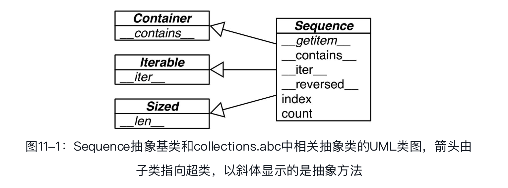
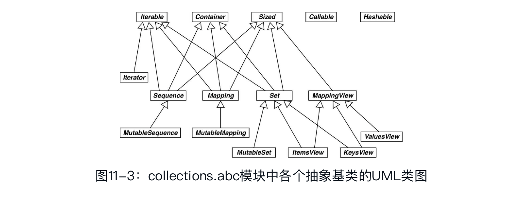

## 接口：从协议到抽象基类

### Python文化中的接口和协议

Python语言没有interface关键字，而且除了抽象基类，每个类都有接口：类实现或继承的公开属性（方法或数据属性），包括特殊方法，如`__getitem__`或`__add__`。

关于接口，这里有个实用的补充定义：对象公开方法的子集，让对象在系统中扮演特定的角色。Python文档中的“文件类对象”或“可迭代对象”就是这个意思，这种说法指的不是特定的类。接口是实现特定角色的方法集合。一个类可能会实现多个接口，从而让实例扮演多个角色。

协议是接口，但不是正式的（只由文档和约定定义），因此协议不能像正式接口那样施加限制（本章后面会说明抽象基类对接口一致性的强制）。一个类可能只实现部分接口，这是允许的。

序列协议是Python最基础的协议之一。即便对象只实现了那个协议最基本的一部分，解释器也会负责任地处理。

### Python喜欢序列



Foo类。它没有继承abc.Sequence，而且只实现了序列协议的一个方法： `__getitem__` （没有实现`__len__`方法）。

定义`__getitem__`方法，只实现序列协议的一部分，这样足够访问元素、迭代和使用in运算符了:

```python
>>> class Foo:
...   def __getitem__(self, pos):
...         return range(0, 30, 10)[pos]
...
>>> f = Foo()
>>> f[1]
10
>>> for i in f: print(i)
...
0
10
20
>>> 20 in f
True
>>> 15 in f
False
>>>
```

虽然没有`__iter__`方法，但是Foo实例是可迭代的对象，因为发现有`__getitem__`方法时，Python会调用它，传入从0开始的整数索引，尝试迭代对象（这是一种后备机制）。尽管没有实现`__contains__`方法，但是Python足够智能，能迭代Foo实例，因此也能使用in运算符：Python会做全面检查，看看有没有指定的元素。

综上，鉴于序列协议的重要性，如果没有`__iter__`和`__contains__`方法，Python会调用`__getitem__`方法，设法让迭代和in运算符可用。

### 使用猴子补丁在运行时实现协议

Python是动态语言，因此我们可以在运行时修正这个问题，甚至还可以在交互式控制台中。

我们把set_card函数赋值给特殊方法`__setitem__`，从而把它依附到FrenchDeck类上。这种技术叫**猴子补丁**：在运行时修改类或模块，而不改动源码。猴子补丁很强大，但是打补丁的代码与要打补丁的程序耦合十分紧密，而且往往要处理隐藏和没有文档的部分。

### 定义抽象基类的子类

我们将遵循Martelli的建议，先利用现有的抽象基类（collections.MutableSequence），然后再斗胆自己定义。

FrenchDeck2，collections.MutableSequence的子类:

```python
import collections
Card = collections.namedtuple('Card', ['rank', 'suit'])
class FrenchDeck2(collections.MutableSequence):
    ranks = [str(n) for n in range(2, 11)]+list('JQKA')
    suits = 'spades diamonds clubs hearts'.split（ ）
    def __init__(self):
        self._cards = [Card(rank, suit) for suit in self.suits
                                        for rank in self.ranks]
    def __len__(self):
        return len(self._cards)
    def __getitem__(self, position):
        return self._cards[position]
    def __setitem__(self, position, value):  # ➊
        self._cards[position] = value
    def __delitem__(self, position):  # ➋
        del self._cards[position]
    def insert(self, position, value):  # ➌
        self._cards.insert(position, value)
```

导入时（加载并编译frenchdeck2.py模块时），Python不会检查抽象方法的实现，在运行时实例化FrenchDeck2类时才会真正检查。因此，如果没有正确实现某个抽象方法，Python会抛出TypeError异常，并把错误消息设为"Can't instantiateabstract class FrenchDeck2 with abstract methods `__delitem__`, insert"。正是这个原因，即便FrenchDeck2类不需要`__delitem__`和insert提供的行为，也要实现，因为MutableSequence抽象基类需要它们。


FrenchDeck2从Sequence继承了几个拿来即用的具体方法：`__contains__`、`__iter__`、`__reversed__`、index和count。FrenchDeck2从MutableSequence继承了append、extend、pop、remove和`__iadd__`。

### 标准库中的抽象基类

从Python 2.6开始，标准库提供了抽象基类。大多数抽象基类在collections.abc模块中定义，不过其他地方也有。但是，collections.abc中的抽象基类最常用。

#### collections.abc模块中的抽象基类

标准库中有两个名为abc的模块，这里说的是collections.abc。为了减少加载时间，Python 3.4在collections包之外实现这个模块（在Lib/_collections_abc.py中），因此要与collections分开导入。另一个abc模块就是abc（即Lib/abc.py），这里定义的是abc.ABC类。每个抽象基类都依赖这个类，但是不用导入它，除非定义新抽象基类。

Python 3.4在collections.abc模块中定义了16个抽象基类，简要的UML类图（没有属性名称）如图11-3所示。



- **Iterable、Container 和 Sized**： 各个集合应该继承这三个抽象基类，或者至少实现兼容的协议。Iterable通过`__iter__`方法支持迭代，Container通过`__contains__`方法支持in运算符，Sized通过`__len__`方法支持len（　）函数。
- **Sequence、Mapping 和 Set**:这三个是主要的不可变集合类型，而且各自都有可变的子类: MutableSequence、MutableMapping和MutableSet。
- **MappingView**：在Python 3中，映射方法.items（　）、.keys（　）和.values（　）返回的对象分别是ItemsView、KeysView和ValuesView的实例。前两个类还从Set类继承了丰富的接口。
- **Callable 和 Hashable**：这两个抽象基类与集合没有太大的关系，只不过因为collections.abc是标准库中定义抽象基类的第一个模块，而它们又太重要了，因此才把它们放到collections.abc模块中。
- **Iterator**：它是Iterable的子类。

继collections.abc之后，标准库中最有用的抽象基类包是numbers。

### 抽象基类的数字塔

numbers包定义的是“数字塔”（即各个抽象基类的层次结构是线性的），其中Number是位于最顶端的超类，随后是Complex子类，依次往下，最底端是Integral类：

- Number
- Complex
- Real
- Rational
- Integal

因此，如果想检查一个数是不是整数，可以使用isinstance(x,numbers.Integral)，这样代码就能接受int、bool（int的子类），或者外部库使用numbers抽象基类注册的其他类型。为了满足检查的需要，你或者你的API的用户始终可以把兼容的类型注册为numbers.Integral的虚拟子类。

与之类似，如果一个值可能是浮点数类型，可以使用isinstance(x, numbers.Real)检查。这样代码就能接受bool、int、float、fractions.Fraction，或者外部库（如NumPy，它做了相应的注册）提供的非复数类型。

### 定义并使用一个抽象基类

 抽象方法使用@abstractmethod装饰器标记，而且定义体中通常只有文档字符串。

抽象基类可以包含具体方法。

其实，抽象方法可以有实现代码。即便实现了，子类也必须覆盖抽象方法，但是在子类中可以使用super（　）函数调用抽象方法，为它添加功能，而不是从头开始实现。@abstractmethod装饰器的用法参见abc模块的文档。

异常的部分层次结构如示例11-10所示（完整的层次结构参见Python标准库文档中的“5.4. Exception hierarchy”一节。：

```python
BaseException
    ├── SystemExit
    ├── KeyboardInterrupt
    ├── GeneratorExit
    └── Exception
        ├── StopIteration
        ├── ArithmeticError
        │    ├── FloatingPointError
        │    ├── OverflowError
        │    └── ZeroDivisionError
        ├── AssertionError
        ├── AttributeError
        ├── BufferError
        ├── EOFError
        ├── ImportError
        ├── LookupError  ➊
        │    ├── IndexError  ➋
        │    └── KeyError  ➌
        ├── MemoryError
        ... etc.
```

#### 抽象基类句法详解

声明抽象基类最简单的方式是继承abc.ABC或其他抽象基类。

然而，abc.ABC是Python 3.4新增的类，因此如果你使用的是旧版Python，并且继承现有的抽象基类也不可取时，必须在class语句中使用metaclass=关键字，把值设为abc.ABCMeta（不是abc.ABC）:

```python
class Tombola(metaclass=abc.ABCMeta):
  # ...
```

metaclass=关键字参数是Python 3引入的。在Python 2中必须使用__metaclass__类属性：

```python
class Tombola(object): #这事Python2 ！！！
  __metalcass__ = abc.ABCMeta
  # ...
```

装饰器可以在@abstractmethod上堆叠。例如，声明抽象类方法的推荐方式是：

```python
class MyABC(abc.ABC):
  @classmethod
  @abc.abstractmethod
  def an_abstract_classmethod(cls, ...):
    pass
```

在函数上堆叠装饰器的顺序通常很重要，@abstractmethod的文档就特别指出：与其他方法描述符一起使用时，abstractmethod（　）应该放在最里层，也就是说，在@abstractmethod和def语句之间不能有其他装饰器。

#### Tombola的虚拟子类

白鹅类型的一个基本特征：即便不继承，也有办法把一个类注册为抽象基类的**虚拟子类**。这样做时，我们保证注册的类忠实地实现了抽象基类定义的接口，而Python会相信我们，从而不做检查。如果我们说谎了，那么常规的运行时异常会把我们捕获。

注册虚拟子类的方式是在抽象基类上调用register方法。这么做之后，注册的类会变成抽象基类的虚拟子类，而且issubclass和isinstance等函数都能识别，但是注册的类不会从抽象基类中继承任何方法或属性。

> 虚拟子类不会继承注册的抽象基类，而且任何时候都不会检查它是否符合抽象基类的接口，即便在实例化时也不会检查。为了避免运行时错误，虚拟子类要实现所需的全部方法。

register方法通常作为普通的函数调用（参见11.9节），不过也可以作为装饰器使用。

```python
from random import randrange
from tombola import Tombola
@Tombola.register  # ➊
class TomboList(list):  # ➋
    def pick(self):
        # ...
    load = list.extend  # ➎
    def loaded(self):
        return bool(self)  # ➏
    def inspect(self):
        return tuple(sorted(self))
# Tombola.register(TomboList)  # ➐
```

 如果是Python 3.3或之前的版本，不能把.register当作类装饰器使用，必须使用标准的调用句法。

注册之后，可以使用issubclass和isinstance函数判断TomboList是不是Tombola的子类。

然而，类的继承关系在一个特殊的类属性中指定——`__mro__`，即方法解析顺序（Method ResolutionOrder）。这个属性的作用很简单，按顺序列出类及其超类，Python会按照这个顺序搜索方法。[插图]查看TomboList类的`__mro__`属性，你会发现它只列出了“真实的”超类，即list和object：

```python
>>> TomboList.__mro__
(<class 'tombolist.TomboList'>, <class 'list'>, <class 'object'>)
```

`Tombolist.__mro__`中没有Tombola，因此Tombolist没有从Tombola中继承任何方法。

### Tombola子类的测试方法

`__subclasses__()`:这个方法返回类的直接子类列表，不含虚拟子类。

`_abc_registry_`:只有抽象基类有这个数据属性，其值是一个WeakSet对象，即抽象类注册的虚拟子类的弱引用。

### Python使用register的方式

在Python3.3之前的版本中不能把register当作类装饰器使用，必须在定义类之后像普通函数那样调用。

虽然现在可以把register当作装饰器使用了，但更常见的做法还是把它当作函数使用，用于注册其他地方定义的类。例如，在collections.abc模块的源码中，是这样把内置类型tuple、str、range和memoryview注册为Sequence的虚拟子类的：

```python
Sequence.register(tuple)
Sequence.register(str)
Sequence.register(range)
Sequence.register(memoryview)
```

其他几个内置类型在_collections_abc.py文件中注册为抽象基类的虚拟子类。这些类型在导入模块时注册，这样做是可以的，因为必须导入才能使用抽象基类：能访问MutableMapping才能编写isinstance(my_dict,MutableMapping)。

### 鹅的行为有可能像鸭子

即便不注册，抽象基类也能把一个类识别为虚拟子类：

```python
>>> class Struggle:
...    def __len__(self): return 23
...
>>> from collections import abc
>>> isinstance(Struggle(), abc.Sized)
True
>>> issubclass(Struggle, abc.Sized)
True
```

经issubclass函数确认（isinstance函数也会得出相同的结论），Struggle是abc.Sized的子类，这是因为abc.Sized实现了一个特殊的类方法，名为`__subclasshook__`。

Sized类的源码，摘自Lib/_collections_abc.py（Python 3.4）:

```python
class Sized(metaclass=ABCMeta):
        __slots__ = （ ）
    @abstractmethod
    def __len__(self):
        return 0
    @classmethod
    def __subclasshook__(cls, C):
        if cls is Sized:
            if any("__len__" in B.__dict__ for B in C.__mro__):  # ➊
                return True  # ➋
        return NotImplemented  # ➌
```

- ❶ 对`C.__mro__` （即C及其超类）中所列的类来说，如果类的`__dict_`_属性中有名为`__len__`的属性……

`__subclasshook__`在白鹅类型中添加了一些鸭子类型的踪迹。我们可以使用抽象基类定义正式接口，可以始终使用isinstance检查，也可以完全使用不相关的类，只要实现特定的方法即可。当然，只有提供`__subclasshook__`方法的抽象基类才能这么做。

在自己定义的抽象基类中要不要实现`__subclasshook__`方法呢？可能不需要。在Python源码中只见到Sized这一个抽象基类实现了`__subclasshook__`方法，而Sized只声明了一个特殊方法，因此只用检查这么一个特殊方法。

### 杂谈

#### 强类型和弱类型

如果一门语言很少隐式转换类型，说明它是强类型语言；如果经常这么做，说明它是弱类型语言。Java、C++和Python是强类型语言。PHP、JavaScript和Perl是弱类型语言。

#### 静态类型和动态类型

在编译时检查类型的语言是静态类型语言，在运行时检查类型的语言是动态类型语言。静态类型需要声明类型（有些现代语言使用类型推导避免部分类型声明）。Fortran和Lisp是最早的两门语言，现在仍在使用，它们分别是静态类型语言和动态类型语言。

因为Python不会自动在字符串和数字之间强制转换，所以在Python 3中，上述`==`表达式的结果都是False（保留了`==`的意思），而<比较会抛出TypeError。

静态类型使得一些工具（编译器和IDE）便于分析代码、找出错误和提供其他服务（优化、重构，等等）。动态类型便于代码重用，代码行数更少，而且能让接口自然成为协议而不提早实行。

综上，Python是动态强类型语言。“PEP 484—Type Hints”无法改变这一点，但是API作者能够添加可选的类型注解，执行某种静态类型检查。

#### Java、Go和Ruby的接口

从C++2.0（1989年发布）起，这门语言开始使用抽象类指定接口。Java的设计者选择不支持类的多重继承，这排除了使用抽象类作为接口规范的可能性，因为一个类通常会实现多个接口。但是，Java的设计者添加了interface这个语言结构，而且允许一个类实现多个接口——这是一种多重继承。以更为明确的方式定义接口是Java的一大贡献。在Java 8中，接口可以提供方法实现，这叫默认方法。有了这个功能，Java的接口与C++和Python中的抽象类更像了。

Go语言采用的方式完全不同。首先，Go不支持继承。我们可以定义接口，但是无需（其实也不能）明确地指出某个类型实现了某个接口。编译器能自动判断。因此，考虑到接口在编译时检查，但是真正重要的是实现了什么类型，Go语言可以说是具有“静态鸭子类型”。

与Python相比，对Go来说就好像每个抽象基类都实现了`__subclasshook__`方法，它会检查函数的名称和签名，而我们自己从不需要继承或注册抽象基类。如果想让Python更像Go，可以对所有函数参数做类型检查。

Ruby程序员是鸭子类型的坚定拥护者，而且Ruby没有声明接口或抽象类的正式方式，只能像Python 2.6之前的版本那样做，即在方法的定义体中抛出NotImplementedError，以此表明方法是抽象的，用户必须在子类中实现。

