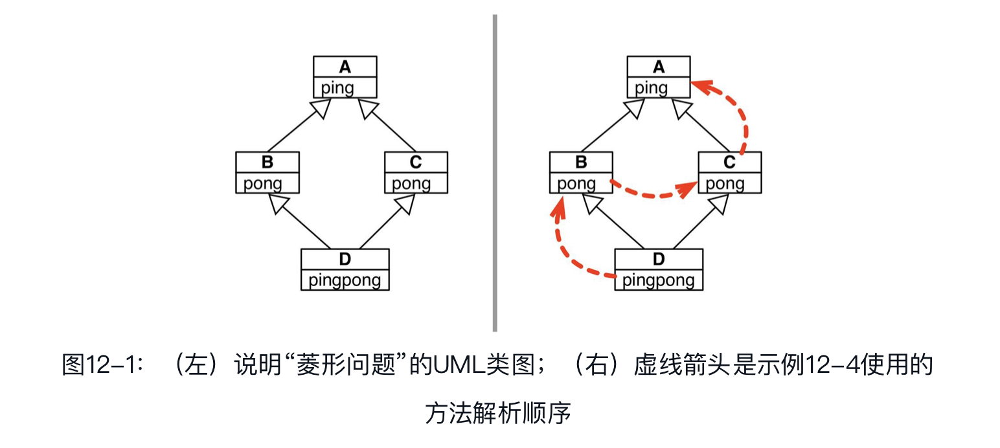
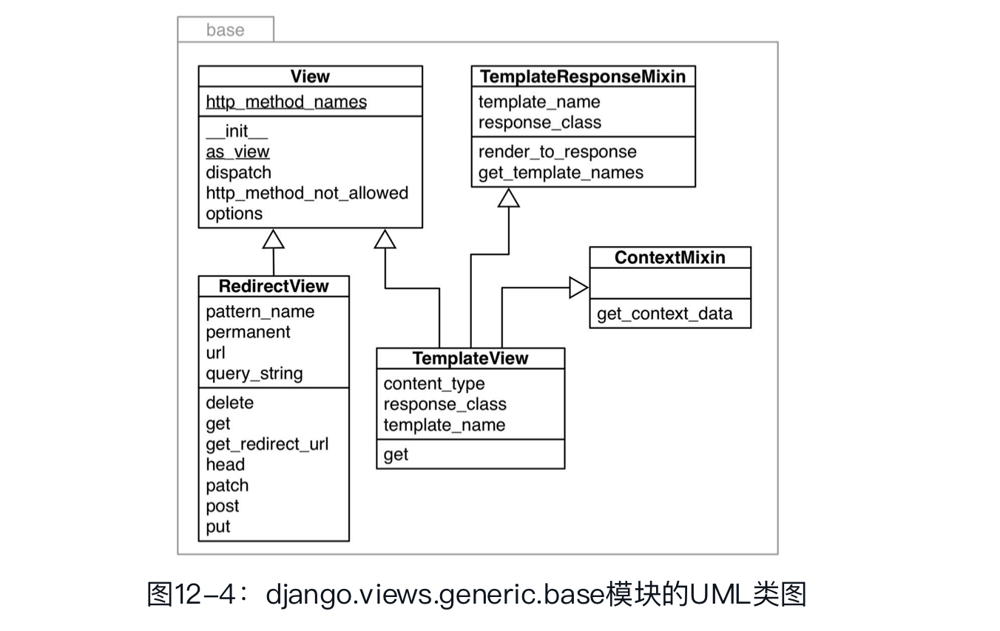
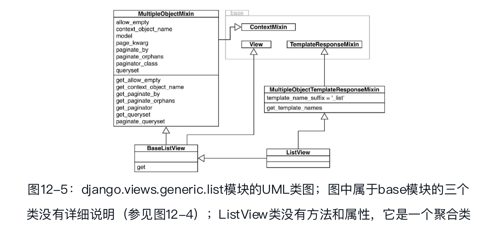

## 继承的优缺点

### 子类化内置类型很麻烦

在Python 2.2之前，内置类型（如list或dict）不能子类化。在Python 2.2之后，内置类型可以子类化了，但是有个重要的注意事项：内置类型（使用C语言编写）不会调用用户定义的类覆盖的特殊方法。

至于内置类型的子类覆盖的方法会不会隐式调用，CPython没有制定官方规则。基本上，内置类型的方法不会调用子类覆盖的方法。例如，dict的子类覆盖的`__getitem__（　）`方法不会被内置类型的get（　）方法调用。

内置类型dict的`__init__`和`__update__`方法会忽略我们覆盖的`__setitem__`方法:

```python
>>> class DoppelDict(dict):
...     def __setitem__(self, key, value):
...         super（ ）.__setitem__(key, [value] * 2)  # ➊
...
>>> dd = DoppelDict(one=1)  # ➋
>>> dd
{'one': 1}
>>> dd['two'] = 2  # ➌
>>> dd
{'one': 1, 'two': [2, 2]}
>>> dd.update(three=3)  # ➍
>>> dd
{'three': 3, 'one': 1, 'two': [2, 2]}
```

- ❷ 继承自dict的`__init_`_方法显然忽略了我们覆盖的`__setitem__`方法：'one'的值没有重复。
- ❸ []运算符会调用我们覆盖的`__setitem__`方法，按预期那样工作：'two'对应的是两个重复的值，即[2, 2]。
- ❹ 继承自dict的update方法也不使用我们覆盖的`__setitem__`方法：'three'的值没有重复。

原生类型的这种行为违背了面向对象编程的一个基本原则：始终应该从实例（self）所属的类开始搜索方法，即使在超类实现的类中调用也是如此。在这种糟糕的局面中，`__missing__`方法却能按预期方式工作，不过这只是特例。

dict.update方法会忽略`AnswerDict.__getitem__`方法:

```python
>>> class AnswerDict(dict):
...     def __getitem__(self, key):  # ➊
...         return 42
...
>>> ad = AnswerDict(a='foo')  # ➋
>>> ad['a']  # ➌
42
>>> d = {}
>>> d.update(ad)  # ➍
>>> d['a']  # ➎
'foo'
>>> d
{'a': 'foo'}
```

- ❸ ad['a']返回42，这与预期相符。
- ❹ d是dict的实例，使用ad中的值更新d。

直接子类化内置类型（如dict、list或str）容易出错，因为内置类型的方法通常会忽略用户覆盖的方法。不要子类化内置类型，用户自己定义的类应该继承collections模块中的类，例如UserDict、UserList和UserString，这些类做了特殊设计，因此易于扩展。

本节所述的问题只发生在C语言实现的内置类型内部的方法委托上，而且只影响直接继承内置类型的用户自定义类。如果子类化使用Python编写的类，如UserDict或MutableMapping，就不会受此影响。

### 多重继承和方法解析顺序

任何实现多重继承的语言都要处理潜在的命名冲突，这种冲突由不相关的祖先类实现同名方法引起。这种冲突称为“菱形问题”:



A、B、C和D四个类:

```python
class A:
        def ping(self):
        print('ping:', self)
class B(A):
    def pong(self):
        print('pong:', self)
class C(A):
    def pong(self):
        print('PONG:', self)
class D(B, C):
    def ping(self):
        super（ ）.ping（ ）
        print('post-ping:', self)
    def pingpong(self):
        self.ping（ ）
        super（ ）.ping（ ）
        self.pong（ ）
        super（ ）.pong（ ）
        C.pong(self)
```

在D的实例上调用d.pong（　）方法的话，运行的是哪个pong方法呢？在C++中，程序员必须使用类名限定方法调用来避免这种歧义。Python也能这么做：

```python
>>> from diamond import *
>>> d = D（ ）
>>> d.pong（ ）  # ➊
pong: <diamond.D object at 0x10066c278>
>>> C.pong(d)  # ➋
PONG: <diamond.D object at 0x10066c278>
```

- ❷ 超类中的方法都可以直接调用，此时要把实例作为显式参数传入。

Python能区分d.pong（　）调用的是哪个方法，是因为Python会按照特定的顺序遍历继承图。这个顺序叫方法解析顺序（Method Resolution Order，MRO）。类都有一个名为`__mro__`的属性，它的值是一个元组，按照方法解析顺序列出各个超类，从当前类一直向上，直到object类。D类的`__mro__`属性如下:

```python
>>> D.__mro__
(<class 'diamond.D'>, <class 'diamond.B'>, <class 'diamond.C'>,<class 'diamond.A'>, <class 'object'>)
```

若想把方法调用委托给超类，推荐的方式是使用内置的super（　）函数。在Python 3中，这种方式变得更容易了。有时可能需要绕过方法解析顺序，直接调用某个超类的方法——这样做有时更方便：

```python
def ping(self):
  A.ping(self) #而不是super().ping()
  print('post-ping:', self)
```

使用super（　）最安全，也不易过时。调用框架或不受自己控制的类层次结构中的方法时，尤其适合使用super（　）。使用super（　）调用方法时，会遵守方法解析顺序。

### 多重继承的真实应用

在Python标准库中，最常使用多重继承的是collections.abc包。

在标准库中，GUI工具包Tkinter（tkinter模块是Tcl/Tk的Python接口，https://docs.python.org/3/library/tkinter.html）把多重继承用到了极致。

### 处理多重继承

继承有很多用途，而多重继承增加了可选方案和复杂度。使用多重继承容易得出令人费解和脆弱的设计。我们还没有完整的理论，下面是避免把类图搅乱的一些建议：

- 把接口继承和实现继承区分开：使用多重继承时，一定要明确一开始为什么创建子类。主要原因可能有：继承接口，创建子类型，实现“是什么”关系。继承实现，通过重用避免代码重复。其实这两条经常同时出现，不过只要可能，一定要明确意图。通过继承重用代码是实现细节，通常可以换用组合和委托模式。而接口继承则是框架的支柱。

- 使用抽象基类显式表示接口：现代的Python中，如果类的作用是定义接口，应该明确把它定义为抽象基类。Python 3.4及以上的版本中，我们要创建abc.ABC或其他抽象基类的子类。

- 通过混入重用代码：如果一个类的作用是为多个不相关的子类提供方法实现，从而实现重用，但不体现“是什么”关系，应该把那个类明确地定义为混入类（mixin class）。从概念上讲，混入不定义新类型，只是打包方法，便于重用。混入类绝对不能实例化，而且具体类不能只继承混入类。混入类应该提供某方面的特定行为，只实现少量关系非常紧密的方法。

- 在名称中明确指明混入：因为在Python中没有把类声明为混入的正规方式，所以强烈推荐在名称中加入...Mixin后缀。

- 抽象基类可以作为混入，反过来则不成立：抽象基类可以实现具体方法，因此也可以作为混入使用。不过，抽象基类会定义类型，而混入做不到。此外，抽象基类可以作为其他类的唯一基类，而混入决不能作为唯一的超类，除非继承另一个更具体的混入——真实的代码很少这样做。

  抽象基类有个局限是混入没有的：抽象基类中实现的具体方法只能与抽象基类及其超类中的方法协作。这表明，抽象基类中的具体方法只是一种便利措施，因为这些方法所做的一切，用户调用抽象基类中的其他方法也能做到。

- 不要子类化多个具体类：具体类可以没有，或最多只有一个具体超类。[插图]也就是说，具体类的超类中除了这一个具体超类之外，其余的都是抽象基类或混入。例如，在下述代码中，如果Alpha是具体类，那么Beta和Gamma必须是抽象基类或混入：

  ```python
  class MyConcreteClass(Alpha, Beta, Gamma):
    """这是一个具体类，可以实例化。"""
    # ...更多代码...
  ```

- 为用户提供聚合类：如果抽象基类或混入的组合对客户代码非常有用，那就提供一个类，使用易于理解的方式把它们结合起来。GradyBooch把这种类称为**聚合类**（aggregate class）。下面是tkinter.Widget类的完整代码:

  ```python
  class Widget(BaseWidget, Pack, Place, Grid):
    """Internal class.
    Base class for a widget which can be positioned with the geometry managers Pack, Place or Grid.
    """
    pass
  ```
  Widget类的定义体是空的，但是这个类提供了有用的服务：把四个超类结合在一起，这样需要创建新小组件的用户无需记住全部混入，也不用担心声明class语句时有没有遵守特定的顺序。Django中的ListView类是更好的例子
- “优先使用对象组合，而不是类继承”： 这句话引自《设计模式：可复用面向对象软件的基础》一书。

### 一个现代示例：Django通用视图中的混入

在Django中，视图是可调用的对象，它的参数是表示HTTP请求的对象，返回值是一个表示HTTP响应的对象。响应可以是简单的重定向，没有主体内容，也可以是复杂的内容，如在线商店的目录页面，它使用HTML模板渲染，列出多个货品，而且有购买按钮和详情页面链接。

最初的通用视图是函数，不能扩展。如果需求与列表视图相似但不完全一样，那么不得不自己从头实现。

Django 1.3引入了基于类的视图，而且还通过基类、混入和拿来即用的具体类提供了一些通用视图类。这些基类和混入在django.views.generic包的base模块里。在这张图中，位于顶部的两个类，View和TemplateResponseMixin，负责完全不同的工作。



View是所有视图（可能是个抽象基类）的基类，提供核心功能，如dispatch方法。这个方法委托具体子类实现的处理方法（handler），如get、head、post等，处理不同的HTTP动词。RedirectView类只继承View，可以看到，它实现了get、head、post等方法。

View的具体子类应该实现处理方法，但它们为什么不在View接口中呢？原因是：子类只需实现它们想支持的处理方法。TemplateView只用于显示内容，因此它只实现了get方法。如果把HTTP POST请求发给TemplateView，经继承的View.dispatch方法检查，它没有post处理方法，因此会返回HTTP 405 Method Not Allowed（不允许使用的方法）响应。

TemplateResponseMixin提供的功能只针对需要使用模板的视图。例如，RedirectView没有主体内容，因此它不需要模板，也就没有继承这个混入。TemplateResponseMixin为TemplateView和django.views.generic包中定义的使用模板渲染的其他视图（例如ListView、DetailView，等等）提供行为。



对Django用户来说，在图12-5中，最重要的类是ListView。这是一个聚合类，不含任何代码（定义体中只有一个文档字符串）。ListView实例有个object_list属性，模板会迭代它显示页面的内容，通常是数据库查询返回的多个对象。生成这个可迭代对象列表的相关功能都由MultipleObjectMixin提供。这个混入还提供了复杂的分页逻辑，即在一页中显示部分结果，并提供指向其他页面的链接。

假设你想创建一个使用模板渲染的视图，但是会生成一组JSON格式的对象，此时用得到BaseListView类。这个类提供了易于使用的扩展点，把View和MultipleObjectMixin的功能整合在一起，避免了模板机制的开销。

与Tkinter相比，Django基于类的视图API是多重继承更好的示例。尤其是，Django的混入类易于理解：各个混入的目的明确，而且名称的后缀都是...Mixin。


