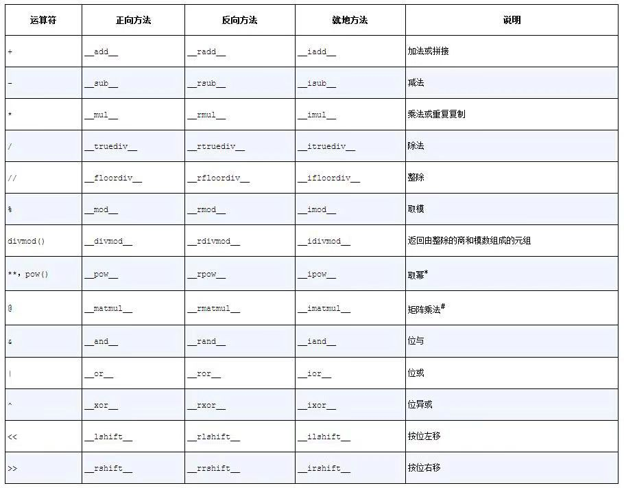

## 正确重载运算符

### 运算符重载基础

Python对运算符重载加了一些限制：

- 不能重载内置类型的运算符
- 不能新建运算符，只能重载现有的
- 某些运算符不能重载——is、and、or和not（不过位运算符&、|和~可以）

### 一元运算符

在Python语言参考手册中，“6.5. Unary arithmetic andbitwise operations”一节[插图]列出了三个一元运算符。下面是这三个运算符和对应的特殊方法：

- `- (__neg__)`:一元取负算术运算符。如果x是-2，那么-x==2。
- `+ (__pos__)`:一元取正算术运算符。通常，x==+x，但也有一些例外。
- `~ (__invert__)`:对整数按位取反，定义为`~x==-(x+1)`。如果x是2，那么~x==-3。

Python语言参考手册中的“Data Model”一章还把内置的abs(...)函数列为一元运算符。它对应的特殊方法是`__abs__`。

支持一元运算符很简单，只需实现相应的特殊方法。这些特殊方法只有一个参数，self。然后，使用符合所在类的逻辑实现。不过，要遵守运算符的一个基本规则：始终返回一个新对象。也就是说，**不能修改self，要创建并返回合适类型的新实例**。

对-和+来说，结果可能是与self同属一类的实例。多数时候，+最好返回self的副本。abs(...)的结果应该是一个标量。但是对~来说，很难说什么结果是合理的，因为可能不是处理整数的位，例如在ORM中，SQL WHERE子句应该返回反集。

#### **x和+x何时不相等**

每个人都觉得x==+x，而且在Python中，几乎所有情况下都是这样。但是，作者在标准库中找到两例x !=+x的情况。

第一例与decimal.Decimal类有关。如果x是Decimal实例，在算术运算的上下文中创建，然后在不同的上下文中计算+x，那么x !=+x。例如，x所在的上下文使用某个精度，而计算+x时，精度变了。

x !=+x的第二例在collections.Counter的文档中。Counter类实现了几个算术运算符，例如中缀运算符+，作用是把两个Counter实例的计数器加在一起。然而，从实用角度出发，Counter相加时，负值和零值计数会从结果中剔除。而一元运算符+等同于加上一个空Counter，因此它产生一个新的Counter且仅保留大于零的计数器。

### 重载向量加法运算符+

`Vector.__add__`方法，第1版：

```python
  #在Vector类中定义
  def __add__(self, other):
    pairs = itertools.zip_longest(self, other, fillvalue=0.0) # 1⃣️
    return Vector(a+b for a, b in pairs) # 2⃣️
```

> 实现一元运算符和中缀运算符的特殊方法一定不能修改操作数。使用这些运算符的表达式期待结果是新对象。只有增量赋值表达式可能会修改第一个操作数（self）

 第1版`Vector.__add__`方法也支持Vector之外的对象：

```python
>>> v1 = Vector([3,4,5])
>>> v1 + (10, 20, 30)
Vector([13.0, 24.0, 35.0])
>>> from vector2d_v3 import Vector2d
>>> v2d = Vector2d(1, 2)
>>> v1+v2d
Vector([4.0, 6.0, 5.0])
```

两个加法都能如我们所期待的那样计算，这是因为`__add__`使用了zip_longest(...)，它能处理任何可迭代对象，而且构建新Vector实例的生成器表达式仅仅是把zip_longest(...)生成的值对相加（a+b），因此可以使用任何生成数字元素的可迭代对象。

然而，如果对调操作数，混合类型的加法就会失败。如果左操作数是Vector之外的对象，第一版`Vector.__add__`方法无法处理。

为了支持涉及不同类型的运算，Python为中缀运算符特殊方法提供了特殊的分派机制。对表达式a+b来说，解释器会执行以下几步操作:

1. 如果a有`__add__`方法，而且返回值不是NotImplemented，调用`a.__add__(b)`，然后返回结果。
2. 如果a没有`__add__`方法，或者调用`__add__`方法返回NotImplemented，检查b有没有`__radd__`方法，如果有，而且没有返回NotImplemented，调用`b.__radd__(a)`，然后返回结果。
3. 如果b没有`__radd__`方法，或者调用`__radd__`方法返回NotImplemented，抛出TypeError，并在错误消息中指明操作数类型不支持。

`__radd__`是`__add__`的“反射”（reflected）版本或“反向”（reversed）版本。

> 别把NotImplemented和NotImplementedError搞混了。前者是特殊的单例值，如果中缀运算符特殊方法不能处理给定的操作数，那么要把它返回（return）给解释器。而NotImplementedError是一种异常，抽象类中的占位方法把它抛出（raise），提醒子类必须覆盖。

`Vector.__add__`和`__radd__`方法:

```python
  #在Vector类中定义
  def __add__(self, other):
    pairs = itertools.zip_longest(self, other, fillvalue=0.0) # 1⃣️
    return Vector(a+b for a, b in pairs) # 2⃣️
  def __radd__(self, other):
    return self+other
```

如果由于类型不兼容而导致运算符特殊方法无法返回有效的结果，那么应该返回NotImplemented，而不是抛出TypeError。返回NotImplemented时，另一个操作数所属的类型还有机会执行运算，即Python会尝试调用反向方法。

```python
  #在Vector类中定义
  def __add__(self, other):
    try:
      pairs = itertools.zip_longest(self, other, fillvalue=0.0) # 1⃣️
      return Vector(a+b for a, b in pairs) # 2⃣️
    except:
      return NotImplemented
  def __radd__(self, other):
    return self+other
```

### 重载标量乘法运算符*

增加*运算符方法:

```python
class Vector:
  typecode = 'd'
  def __init__(self, conponents):
    self._components = array(self.typecode, components)
  # ...
  def __mul__(self, scalar):
    if isinstance(scalar, numbers.Real):
      return Vector(n * scalar for n in self)
    else:
      return NotImplemented
  def __rmul__(self, scalar):
    return self * scalar
```

+和*用的技术对下表中列出的所有运算符都适用:



> pow的第三个参数modulo是可选的：pow(a, b, modulo)，直接调用特殊方法时也支持这个参数（如`a.__pow__(b,modulo)`)。

**Python 3.5新引入的**

Python 3.5新引入的中缀运算符@。

@运算符由特殊方法`__matmul__`、`__rmatmul__`和`__imatmul__`提供支持，名称取自“matrix multiplication”（矩阵乘法）。目前，标准库还没用到这些方法，但是Python 3.5的解释器能识别，因此NumPy团队（以及我们自己）可以在用户定义的类型中支持@运算符。Python解析器也做了修改，能处理中缀运算符@（在Python 3.4中，a @ b是一种句法错误）。

### 众多比较运算符

Python解释器对众多比较运算符（==、!=、>、<、>=、<=）的处理与前文类似，不过在两个方面有重大区别。

- 正向和反向调用使用的是同一系列方法。例如，对==来说，正向和反向调用都是`__eq__`方法，只是把参数对调了；而正向的`__gt__`方法调用的是反向的`__lt__`方法，并把参数对调。
- 对==和！=来说，如果反向调用失败，Python会比较对象的ID，而不抛出TypeError。

众多比较运算符：正向方法返回NotImplemented的话，调用反向方法:

**python3的新行为**：

Python 2之后的比较运算符后备机制都变了。对于`__ne__`，现在Python 3返回结果是对`__eq__`结果的取反。对于排序比较运算符，Python 3抛出TypeError，并把错误消息设为'unorderable types: int（　） < tuple（　）'。在Python 2中，这些比较的结果很怪异，会考虑对象的类型和ID，而且无规律可循。然而，比较整数和元组确实没有意义，因此此时抛出TypeError是这门语言的一大进步。

从object继承的`__ne__`方法的后备行为满足了我们的需求：定义了`__eq__`方法，而且它不返回NotImplemented，`__ne__`会对`__eq__`返回的结果取反。

改进Vector类的`__eq__`方法:

```python
def __eq__(self, other):
  if isinstance(other, Vector):
    return (len(self) == len(other) and all(a == b for a, b in zip(self, other)))
  else:
    return NotImplemented
```

从object中继承的`__ne__`方法，运作方式与下述代码类似，不过原版是用C语言实现的：

```python
def __ne__(self, other):
  eq_result = self == other
  if eq_result is NotImplemented:
    return NotImplemented
  else:
    return not eq_result
```

### 增量赋值运算符

如果一个类没有实现就地运算符，增量赋值运算符只是语法糖：a+=b的作用与a=a+b完全一样。对不可变类型来说，这是预期的行为，而且，如果定义了`__add__`方法的话，不用编写额外的代码，+=就能使用。然而，如果实现了就地运算符方法，例如`__iadd__`，计算a+=b的结果时会调用就地运算符方法。这种运算符的名称表明，它们会就地修改左操作数，而不会创建新对象作为结果。

> 不可变类型，一定不能实现就地特殊方法。

>  一般来说，如果中缀运算符的正向方法（如`__mul__`）只处理与self属于同一类型的操作数，那就无需实现对应的反向方法（如`__rmul__`），因为按照定义，反向方法是为了处理类型不同的操作数。
