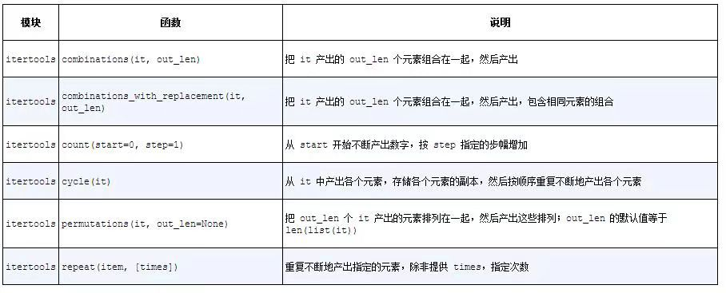

## 可迭代对象、迭代器和生成器

迭代是数据处理的基石。扫描内存中放不下的数据集时，我们要找到一种惰性获取数据项的方式，即按需一次获取一个数据项。这就是迭代器模式（Iterator pattern）。本章说明Python语言是如何内置迭代器模式的，这样就避免了自己手动去实现。

Python 2.2（2001年）加入了yield关键字。[插图]这个关键字用于构建生成器（generator），其作用与迭代器一样。

> 所有生成器都是迭代器，因为生成器完全实现了迭代器接口。不过，根据《设计模式：可复用面向对象软件的基础》一书的定义，迭代器用于从集合中取出元素；而生成器用于“凭空”生成元素。通过斐波纳契数列能很好地说明二者之间的区别：斐波纳契数列中的数有无穷个，在一个集合里放不下。不过要知道，在Python社区中，大多数时候都把迭代器和生成器视作同一概念。

在Python 3中，生成器有广泛的用途。现在，即使是内置的range（　）函数也返回一个类似生成器的对象，而以前则返回完整的列表。如果一定要让range（　）函数返回列表，那么必须明确指明（例如，list(range(100))）。

在Python中，所有集合都可以迭代。在Python语言内部，迭代器用于支持：

- for循环
- 构建和扩展集合类型
- 逐行遍历文本文件
- 列表推导、字典推导和集合推导
- 元组拆包
- 调用函数时，使用*拆包实参

### Sentence类第1版：单词序列

定义了一个Sentence类，通过索引从文本中提取单词：

```python
import re
import reprlib
RE_WORD = re.compile('\w+')
class Sentence:
  def __init__(self, text):
    self.text = text
    self.words = RE_WORD.findall(text) # 1
  
  def __getitem__(self, index):
    return self.words[index] # 2
  def __len__(self): # 3
    return len(self.words)
  def __repr__(self):
    return 'Sentence(%s)'%reprlib.repr(self.text) # 4
```

- 1 re.findall函数返回一个字符串列表，里面的元素是正则表达式的全部非重叠匹配。
- 4 reprlib.repr这个实用函数用于生成大型数据结构的简略字符串表示形式

默认情况下，reprlib.repr函数生成的字符串最多有30个字符。

#### 序列可以迭代的原因：iter函数

解释器需要迭代对象x时，会自动调用iter(x)。

内置的iter函数有以下作用。

1. 检查对象是否实现了`__iter__`方法，如果实现了就调用它，获取一个迭代器。
2. )如果没有实现`__iter__`方法，但是实现了`__getitem__`方法，Python会创建一个迭代器，尝试按顺序（从索引0开始）获取元素。
3. 如果尝试失败，Python抛出TypeError异常，通常会提示“Cobject is not iterable”（C对象不可迭代），其中C是目标对象所属的类。

任何Python序列都可迭代的原因是，它们都实现了`__getitem__`方法。其实，标准的序列也都实现了``__iter__``方法，因此你也应该这么做。之所以对`__getitem__`方法做特殊处理，是为了向后兼容，而未来可能不会再这么做。

在白鹅类型（goose-typing）理论中，可迭代对象的定义简单一些，不过没那么灵活：如果实现了`__iter__`方法，那么就认为对象是可迭代的。此时，不需要创建子类，也不用注册，因为abc.Iterable类实现了`__subclasshook__`方法。下面举个例子：

```python
>>> class Foo:
...     def __iter__(self):
...         pass
...
>>> from collections import abc
>>> issubclass(Foo, abc.Iterable)
True
>>> f = Foo（ ）
>>> isinstance(f, abc.Iterable)
True
```

不过要注意，虽然前面定义的Sentence类是可以迭代的，但却无法通过issubclass (Sentence, abc.Iterable)测试。

> 从Python 3.4开始，检查对象x能否迭代，最准确的方法是：调用iter(x)函数，如果不可迭代，再处理TypeError异常。这比使用isinstance(x, abc.Iterable)更准确，因为iter(x)函数会考虑到遗留的`__getitem__`方法，而abc.Iterable类则不考虑。

### 可迭代的对象与迭代器的对比

**可迭代的对象**: 使用iter内置函数可以获取迭代器的对象。如果对象实现了能返回迭代器的`__iter__`方法，那么对象就是可迭代的。序列都可以迭代；实现了`__getitem__`方法，而且其参数是从零开始的索引，这种对象也可以迭代。

可迭代的对象和迭代器之间的关系：Python从可迭代的对象中获取迭代器。

字符串'ABC'是可迭代对象，背后是有迭代器的，只不过我们看不到：

```python
>>> s = 'ABC'
>>> for char in s:
...     print(char)
...
A
B
C
```

如果没有for语句，使用while循环模拟：

```python
>>> s = 'ABC'
>>> it = iter(s) # 1
>>> while True:
...     try:
...             print(next(it)) # 2
...     except StopIteration: # 3
...             del it # 4
...             break
...
A
B
C
```

- 1 使用可迭代的对象构建迭代器it。
- 2 不断在迭代器上调用next函数，获取下一个字符。
- 3 如果没有字符了，迭代器会抛出StopIteration异常。
- 4 释放对it的引用，即废弃迭代器对象。

StopIteration异常表明迭代器到头了。Python语言内部会处理for循环和其他迭代上下文（如列表推导、元组拆包，等等）中的StopIteration异常。

标准的迭代器接口有两个方法:

- `__next__`:返回下一个可用的元素，如果没有元素了，抛出StopIteration异常。
- `__iter__`: 返回self，以便在应该使用可迭代对象的地方使用迭代器，例如在for循环中。

这个接口在collections.abc.Iterator抽象基类中制定。这个类定义了`__next__`抽象方法，而且继承自Iterable类；`__iter__`抽象方法则在Iterable类中定义。


Iterator抽象基类实现`__iter__`方法的方式是返回实例本身（return self）。这样，在需要可迭代对象的地方可以使用迭代器。

abc.Iterator类的源码, 摘自Lib/_collections_abc.py:

```python
class Iterator(Iterable):
    __slots__ = ()
    @abstractmethod
    def __next__(self):
        'Return the next item from the iterator. When exhausted, raise StopIteration'
        raise StopIteration
    def __iter__(self):
        return self
    @classmethod
    def __subclasshook__(cls, C):
        if cls is Iterator:
            if (any("__next__" in B.__dict__ for B in C.__mro__) and
                any("__iter__" in B.__dict__ for B in C.__mro__)):
                return True
        return NotImplemented
```

> 在Python 3中，Iterator抽象基类定义的抽象方法是`it.__next__（　）`，而在Python 2中是it.next（　）。一如既往，我们应该避免直接调用特殊方法，使用next(it)即可，这个内置的函数在Python 2和Python 3中都能使用。

在Python 3.4中，Lib/types.py模块的源码里有下面这段注释：

```python
# Iterators in Python aren't a matter of type but of protocol.  A large
# and changing number of builtin types implement *some* flavor of
# iterator.  Don't check the type!  Use hasattr to check for both
# "__iter__" and "__next__" attributes instead.
```

考虑到Lib/types.py中的建议，以及Lib/_collections_abc.py中的实现逻辑，检查对象x是否为迭代器最好的方式是调用isinstance(x, abc.Iterator)。得益于`Iterator.__subclasshook__`方法，即使对象x所属的类不是Iterator类的真实子类或虚拟子类，也能这样检查。

因为迭代器只需`__next__`和`__iter__`两个方法，所以除了调用next（　）方法，以及捕获StopIteration异常之外，没有办法检查是否还有遗留的元素。此外，也没有办法“还原”迭代器。如果想再次迭代，那就要调用iter(...)，传入之前构建迭代器的可迭代对象。传入迭代器本身没用，因为前面说过`Iterator.__iter__`方法的实现方式是返回实例本身，所以传入迭代器无法还原已经耗尽的迭代器。

根据本节的内容，可以得出迭代器的定义如下: 

迭代器是这样的对象：实现了无参数的`__next__`方法，返回序列中的下一个元素；如果没有元素了，那么抛出StopIteration异常。Python中的迭代器还实现了`__iter__`方法，因此迭代器也可以迭代。

### Sentence类第2版：典型的迭代器

示例14-4中定义的Sentence类可以迭代，因为它实现了特殊的`__iter__`方法，构建并返回一个SentenceIterator实例。

示例14-4 sentence_iter.py：使用迭代器模式实现Sentence类:

```python
import re
import reprlib
RE_WORD = re.compile('\w+')
class Sentence:
    def __init__(self, text):
        self.text = text
        self.words = RE_WORD.findall(text)
    def __repr__(self):
        return 'Sentence(%s)'%reprlib.repr(self.text)
    def __iter__(self):  ➊
        return SentenceIterator(self.words)  ➋

class SentenceIterator:
    def __init__(self, words):
        self.words = words  ➌
        self.index = 0  ➍
    def __next__(self):
        try:
            word = self.words[self.index]  ➎
        except IndexError:
            raise StopIteration（ ）  ➏
        self.index+= 1  ➐
        return word  ➑
    def __iter__(self):  ➒
        return self
```

- ❷ 根据可迭代协议，`__iter__`方法实例化并返回一个迭代器。

注意，对这个示例来说，其实没必要在SentenceIterator类中实现`__iter__`方法，不过这么做是对的，因为迭代器应该实现`__next__`和`__iter__`两个方法，而且这么做能让迭代器通过issubclass(SentenceIterator, abc.Iterator)测试。如果让SentenceIterator类继承abc.Iterator类，那么它会继承`abc.Iterator.__iter__`这个具体方法。

#### 把Sentence变成迭代器：坏主意

构建可迭代的对象和迭代器时经常会出现错误，原因是混淆了二者。要知道，可迭代的对象有个`__iter__`方法，每次都实例化一个新的迭代器；而迭代器要实现`__next__`方法，返回单个元素，此外还要实现`__iter__`方法，返回迭代器本身。

因此，迭代器可以迭代，但是可迭代的对象不是迭代器。

除了`__iter__`方法之外，你可能还想在Sentence类中实现`__next__`方法，让Sentence实例既是可迭代的对象，也是自身的迭代器。可是，这种想法非常糟糕。根据有大量Python代码审查经验的Alex Martelli所说，这也是常见的反模式。

《设计模式：可复用面向对象软件的基础》一书讲解迭代器设计模式时，在“适用性”一节中说：

迭代器模式可用来：

- 访问一个聚合对象的内容而无需暴露它的内部表示
- 支持对聚合对象的多种遍历
- 为遍历不同的聚合结构提供一个统一的接口（即支持多态迭代）

为了“支持多种遍历”，必须能从同一个可迭代的实例中获取多个独立的迭代器，而且各个迭代器要能维护自身的内部状态，因此这一模式正确的实现方式是，每次调用iter(my_iterable)都新建一个独立的迭代器。这就是为什么这个示例需要定义SentenceIterator类。

> 可迭代的对象一定不能是自身的迭代器。也就是说，可迭代的对象必须实现`__iter__`方法，但不能实现`__next__`方法。另一方面，迭代器应该一直可以迭代。迭代器的`__iter__`方法应该返回自身。

### Sentence类第3版：生成器函数

实现相同功能，但却符合Python习惯的方式是，用生成器函数代替SentenceIterator类。

示例14-5 使用生成器函数实现Sentence类

```python
import re
import reprlib
RE_WORD = re.compile('\w+')
class Sentetnce:
  def __init__(self, text):
    self.text = text
    self.words = RE_WORD.findall(text)
  def __repr__(self):
    return 'Sentence(%s)'%reprlib.repr(self.text)
  def __iter__(self):
    for word in self.words:
      yield word
    return # ❸
# 完成 ❹
```

- ❸ 这个return语句不是必要的；这个函数可以直接“落空”，自动返回。不管有没有return语句，生成器函数都不会抛出StopIteration异常，而是在生成完全部值之后会直接退出
- ❹ 不用再单独定义一个迭代器类！

在示例14-5中，迭代器其实是生成器对象，每次调用`__iter__`方法都会自动创建，因为这里的`__iter__`方法是生成器函数。

#### 生成器函数的工作原理

只要Python函数的定义体中有yield关键字，该函数就是生成器函数。调用生成器函数时，会返回一个生成器对象。也就是说，生成器函数是生成器工厂。

> 普通的函数与生成器函数在句法上唯一的区别是，在后者的定义体中有yield关键字。

```python
>>> def gen_123(): # ❶
...     yield 1
...     yield 2
...     yield 3
...
>>> gen_123
<function gen_123 at 0x7fa71809c9d0>
>>> gen_123()
<generator object gen_123 at 0x7fa71809ffa0> # ❹
>>> for i in gen_123():
...     print(i)
...
1
2
3
>>> g = gen_123()
>>> next(g)
1
>>> next(g)
2
>>> next(g)
3
>>> next(g)
Traceback (most recent call last):
  File "<stdin>", line 1, in <module>
StopIteration
```

- ❶ 只要Python函数中包含关键字yield，该函数就是生成器函数。
- ❹ 但是调用时，gen_123（　）返回一个生成器对象。

生成器函数会创建一个生成器对象，包装生成器函数的定义体。把生成器传给next(...)函数时，生成器函数会向前，执行函数定义体中的下一个yield语句，返回产出的值，并在函数定义体的当前位置暂停。最终，函数的定义体返回时，外层的生成器对象会抛出StopIteration异常——这一点与迭代器协议一致。

### Sentence类第4版：惰性实现

设计Iterator接口时考虑到了惰性：next(my_iterator)一次生成一个元素。懒惰的反义词是急迫，其实，惰性求值（lazyevaluation）和及早求值（eager evaluation）是编程语言理论方面的技术术语。

目前实现的几版Sentence类都不具有惰性，因为`__init__`方法急迫地构建好了文本中的单词列表，然后将其绑定到self.words属性上。这样就得处理整个文本，列表使用的内存量可能与文本本身一样多（或许更多，这取决于文本中有多少非单词字符）。如果只需迭代前几个单词，大多数工作都是白费力气。

只要使用的是Python 3，思索着做某件事有没有懒惰的方式，答案通常都是肯定的。

re.finditer函数是re.findall函数的惰性版本，返回的不是列表，而是一个生成器，按需生成re.MatchObject实例。如果有很多匹配，re.finditer函数能节省大量内存。我们要使用这个函数让第4版Sentence类变得懒惰，即只在需要时才生成下一个单词。

示例14-7 sentence_gen2.py：在生成器函数中调用re.finditer生成器函数，实现Sentence类

```python
import re
import reprlib
RE_WORD = re.compile('\w+')
class Sentetnce:
  def __init__(self, text):
    self.text = text
  def __repr__(self):
    return 'Sentence(%s)'%reprlib.repr(self.text)
  def __iter__(self):
		for match in RE_WORD.finditer(self.text):
      yield match.group()
```

### Sentence类第5版：生成器表达式

简单的生成器函数可以替换成生成器表达式。

生成器表达式可以理解为列表推导的惰性版本：不会迫切地构建列表，而是返回一个生成器，按需惰性生成元素。

```python
>>> def gen_AB():
...     print('start')
...     yield 'A'
...     print('continue')
...     yield 'B'
...     print('end.')
...
>>> res1 = [x * 3 for x in gen_AB()]
start
continue
end.
>>> print(res1)
['AAA', 'BBB']
>>> res2 = (x * 3 for x in gen_AB())
>>> res2
<generator object <genexpr> at 0x7fefe014f0a0>
>>> for i in res2:
...     print(i)
...
start
AAA
continue
BBB
end.
```

生成器表达式会产出生成器。

使用生成器表达式实现Sentence类：

```python
import re
import reprlib
RE_WORD = re.compile('\w+')
class Sentence:
	def __init__(self, text):
    self.text = text
  def __repr__(self):
    return 'Sentence(%s)'%reprlib.repr(self.text)
  def __iter__(self):
    return (match.group() for match in RE_WORD.finditer(self.text))
```

这里不是生成器函数了（没有yield），而是使用生成器表达式构建生成器，然后将其返回。不过，最终的效果一样：调用`__iter__`方法会得到一个生成器对象。

### 何时使用生成器表达式

生成器表达式是创建生成器的简洁句法，这样无需先定义函数再调用。不过，生成器函数灵活得多，可以使用多个语句实现复杂的逻辑，也可以作为协程使用。

句法提示：如果函数或构造方法只有一个参数，传入生成器表达式时不用写一对调用函数的括号，再写一对括号围住生成器表达式，只写一对括号就行了。如果生成器表达式后面还有其他参数，那么必须使用括号围住，否则会抛出SyntaxError异常。

### 另一个示例：等差数列生成器

内置的range函数用于生成有穷整数等差数列（Arithmetic Progression，AP），itertools.count函数用于生成无穷等差数列 也是通过迭代器实现的。

ArithmeticProgression类的实现：

```python
class ArithmeticProgression:
  def __init__(self, begin, step, end=None):
    self.begin = begin
    self.step = step
    self.end = end
  def __iter__(self):
    result = type(self.begin + self.step)(self.begin)
    forever = self.end is None
    index = 0
    while forever or result < self.end:
      yield result
      index += 1
      result = self.begin + self.step * index
```

#### 使用itertools模块生成等差数列

标准库中有许多现成的生成器。Python 3.4中的itertools模块提供了19个生成器函数，结合起来使用能实现很多有趣的用法。

例如，itertools.count函数返回的生成器能生成多个数。如果不传入参数，itertools.count函数会生成从零开始的整数数列。

```python
>>> import itertools
>>> gen = itertools.count(1, .5)
>>> next(gen)
1
>>> next(gen)
1.5
>>> next(gen)
2.0
```

然而，itertools.count函数从不停止，因此，如果调用list(count（　）)，Python会创建一个特别大的列表，超出可用内存，在调用失败之前，电脑会疯狂地运转。

不过，itertools.takewhile函数则不同，它会生成一个使用另一个生成器的生成器，在指定的条件计算结果为False时停止。因此，可以把这两个函数结合在一起使用，编写下述代码：

```python
>>> gen = itertools.takewhile(lambda n: n < 3, itertools.count(1, .5))
>>> list(gen)
[1, 1.5, 2.0, 2.5]
```

实现等差数列：

```python
import itertools
def aritprog_gen(begin, step, end=None):
  first = type(begin + step)(begin)
  ap_gen = itertools.ccount(first, step)
  if end is not None:
    ap_gen = itertools.takewhile(lambda n: n < end, ap_gen)
  return ap_gen
```

aritprog_gen不是生成器函数，因为定义体中没有yield关键字。但是它会返回一个生成器，因此它与其他生成器函数一样，也是生成器工厂函数。

### 标准库中的生成器函数

第一组是用于过滤的生成器函数：从输入的可迭代对象中产出元素的子集，而且不修改元素本身。例如 itertools.takewhile函数。与takewhile函数一样，表14-1中的大多数函数都接受一个断言参数（predicate）。这个参数是个布尔函数，有一个参数，会应用到输入中的每个元素上，用于判断元素是否包含在输出中。

> 表14-1：用于过滤的生成器函数


```python
>>> def vowel(c):
...     return c.lower() in 'aeiou'
...
>>> list(filter(vowel, 'Aardvark'))
['A', 'a', 'a']
>>> import itertools
>>> list(itertools.filterfalse(vowel, 'Aardvark'))
['r', 'd', 'v', 'r', 'k']
>>> list(itertools.dropwhile(vowel, 'Aardvark'))
['r', 'd', 'v', 'a', 'r', 'k']
>>> list(itertools.takewhile(vowel, 'Aardvark'))
['A', 'a']
>>> list(itertools.compress('Aardvark', (1,0,1,1,0,1)))
['A', 'r', 'd', 'a']
>>> list(itertools.islice('Aardvark', 4))
['A', 'a', 'r', 'd']
>>> list(itertools.islice('Aardvark', 4, 7))
['v', 'a', 'r']
>>> list(itertools.islice('Aardvark', 1, 7, 2))
['a', 'd', 'a']
```


下一组是用于映射的生成器函数：在输入的单个可迭代对象（map和starmap函数处理多个可迭代的对象）中的各个元素上做计算，然后返回结果。表14-2中的生成器函数会从输入的可迭代对象中的各个元素中产出一个元素。如果输入来自多个可迭代的对象，第一个可迭代的对象到头后就停止输出。

> 表14-2：用于映射的生成器函数


演示itertools.accumulate生成器函数
```python
>>> sample = [5, 4, 2, 8, 7, 6, 3, 0, 9, 1]
>>> import itertools
>>> list(itertools.accumulate(sample))  # ➊
[5, 9, 11, 19, 26, 32, 35, 35, 44, 45]
>>> list(itertools.accumulate(sample, min))  # ➋
[5, 4, 2, 2, 2, 2, 2, 0, 0, 0]
>>> list(itertools.accumulate(sample, max))  # ➌
[5, 5, 5, 8, 8, 8, 8, 8, 9, 9]
>>> import operator
>>> list(itertools.accumulate(sample, operator.mul))  # ➍
[5, 20, 40, 320, 2240, 13440, 40320, 0, 0, 0]
>>> list(itertools.accumulate(range(1, 11), operator.mul))
[1, 2, 6, 24, 120, 720, 5040, 40320, 362880, 3628800]  # ➎
```

演示用于映射的生成器函数:

```python
>>> list(enumerate('albatroz', 1))  # ➊
[(1, 'a'), (2, 'l'), (3, 'b'), (4, 'a'), (5, 't'), (6, 'r'), (7, 'o'), (8, 'z')]
>>> import operator
>>> list(map(operator.mul, range(11), range(11)))  # ➋
[0, 1, 4, 9, 16, 25, 36, 49, 64, 81, 100]
>>> list(map(operator.mul, range(11), [2, 4, 8]))  # ➌
[0, 4, 16]
>>> list(map(lambda a, b: (a, b), range(11), [2, 4, 8]))  # ➍
[(0, 2), (1, 4), (2, 8)]
>>> import itertools
>>> list(itertools.starmap(operator.mul, enumerate('albatroz', 1)))  # ➎
['a', 'll', 'bbb', 'aaaa', 'ttttt', 'rrrrrr', 'ooooooo', 'zzzzzzzz']
>>> sample = [5, 4, 2, 8, 7, 6, 3, 0, 9, 1]
>>> list(itertools.starmap(lambda a, b: b/a,
...     enumerate(itertools.accumulate(sample), 1)))  # ➏
[5.0, 4.5, 3.6666666666666665, 4.75, 5.2, 5.333333333333333,
5.0, 4.375, 4.888888888888889, 4.5]
```


接下来这一组是用于合并的生成器函数，这些函数都从输入的多个可迭代对象中产出元素。chain和chain.from_iterable按顺序（一个接一个）处理输入的可迭代对象，而product、zip和zip_longest并行处理输入的各个可迭代对象。如表14-3所示。

表14-3：合并多个可迭代对象的生成器函数:


>  zip函数的名称出自zip fastener或zipper（拉链，与ZIP压缩没有关系）。

演示用于合并的生成器函数:

```python
>>> list(itertools.chain('ABC', range(2)))  # ➊
['A', 'B', 'C', 0, 1]
>>> list(itertools.chain(enumerate('ABC')))  # ➋
[(0, 'A'), (1, 'B'), (2, 'C')]
>>> list(itertools.chain.from_iterable(enumerate('ABC')))  # ➌
[0, 'A', 1, 'B', 2, 'C']
>>> list(zip('ABC', range(5)))  # ➍
[('A', 0), ('B', 1), ('C', 2)]
>>> list(zip('ABC', range(5), [10, 20, 30, 40]))  # ➎
[('A', 0, 10), ('B', 1, 20), ('C', 2, 30)]
>>> list(itertools.zip_longest('ABC', range(5)))  # ➏
[('A', 0), ('B', 1), ('C', 2), (None, 3), (None, 4)]
>>> list(itertools.zip_longest('ABC', range(5), fillvalue='?'))  # ➐
[('A', 0), ('B', 1), ('C', 2), ('?', 3), ('?', 4)]
```

itertools.product生成器是计算笛卡儿积的惰性方式。

```python
>>> list(itertools.product('ABC', range(2)))  # ➊
[('A', 0), ('A', 1), ('B', 0), ('B', 1), ('C', 0), ('C', 1)]
>>> suits = 'spades hearts diamonds clubs'.split（ ）
>>> list(itertools.product('AK', suits))  # ➋
[('A', 'spades'), ('A', 'hearts'), ('A', 'diamonds'), ('A', 'clubs'),
('K', 'spades'), ('K', 'hearts'), ('K', 'diamonds'), ('K', 'clubs')]
>>> list(itertools.product('ABC'))  # ➌
[('A',), ('B',), ('C',)]
>>> list(itertools.product('ABC', repeat=2))  # ➍
[('A', 'A'), ('A', 'B'), ('A', 'C'), ('B', 'A'), ('B', 'B'),
('B', 'C'), ('C', 'A'), ('C', 'B'), ('C', 'C')]
>>> list(itertools.product(range(2), repeat=3))
[(0, 0, 0), (0, 0, 1), (0, 1, 0), (0, 1, 1), (1, 0, 0),
(1, 0, 1), (1, 1, 0), (1, 1, 1)]
>>> rows = itertools.product('AB', range(2), repeat=2)
>>> for row in rows: print(row)
...
('A', 0, 'A', 0)
('A', 0, 'A', 1)
('A', 0, 'B', 0)
('A', 0, 'B', 1)
('A', 1, 'A', 0)
('A', 1, 'A', 1)
('A', 1, 'B', 0)
('A', 1, 'B', 1)
('B', 0, 'A', 0)
('B', 0, 'A', 1)
('B', 0, 'B', 0)
('B', 0, 'B', 1)
('B', 1, 'A', 0)
('B', 1, 'A', 1)
('B', 1, 'B', 0)
('B', 1, 'B', 1)
```


有些生成器函数会从一个元素中产出多个值，扩展输入的可迭代对象。

表14-4：把输入的各个元素扩展成多个输出元素的生成器函数：



itertools模块中的count和repeat函数返回的生成器“无中生有”：这两个函数都不接受可迭代的对象作为输入。

演示count、repeat和cycle的用法：

```python
>>> ct = itertools.count（ ）  # ➊
>>> next(ct)  # ➋
0
>>> next(ct), next(ct), next(ct)  # ➌
(1, 2, 3)
>>> list(itertools.islice(itertools.count(1, .3), 3))  # ➍
[1, 1.3, 1.6]
>>> cy = itertools.cycle('ABC')  # ➎
>>> next(cy)
'A'
>>> list(itertools.islice(cy, 7))  # ➏
['B', 'C', 'A', 'B', 'C', 'A', 'B']
>>> rp = itertools.repeat(7)  # ➐
>>> next(rp), next(rp)
(7, 7)
>>> list(itertools.repeat(8, 4))  # ➑
[8, 8, 8, 8]
>>> list(map(operator.mul, range(11), itertools.repeat(5)))  # ➒
[0, 5, 10, 15, 20, 25, 30, 35, 40, 45, 50]
```

- ❸ 不能使用ct构建列表，因为ct是无穷的，所以我获取接下来的3个元素。

在itertools模块的文档中，combinations、combinations_with_replacement和permutations生成器函数，连同product函数，称为组合学生成器（combinatoricgenerator）。itertools.product函数和其余的组合学函数有紧密的联系。

组合学生成器函数会从输入的各个元素中产出多个值：

```python
>>> list(itertools.combinations('ABC', 2))  # ➊
[('A', 'B'), ('A', 'C'), ('B', 'C')]
>>> list(itertools.combinations_with_replacement('ABC', 2))  # ➋
[('A', 'A'), ('A', 'B'), ('A', 'C'), ('B', 'B'), ('B', 'C'), ('C', 'C')]
>>> list(itertools.permutations('ABC', 2))  # ➌
[('A', 'B'), ('A', 'C'), ('B', 'A'), ('B', 'C'), ('C', 'A'), ('C', 'B')]
>>> list(itertools.product('ABC', repeat=2))  # ➍
[('A', 'A'), ('A', 'B'), ('A', 'C'), ('B', 'A'), ('B', 'B'), ('B', 'C'),
('C', 'A'), ('C', 'B'), ('C', 'C')]
```

最后一组生成器函数用于产出输入的可迭代对象中的全部元素，不过会以某种方式重新排列。其中有两个函数会返回多个生成器，分别是itertools.groupby和itertools.tee。这一组里的另一个生成器函数，内置的reversed函数，是本节所述的函数中唯一一个不接受可迭代的对象，而只接受序列为参数的函数。这在情理之中，因为reversed函数从后向前产出元素，而只有序列的长度已知时才能工作。不过，这个函数会按需产出各个元素，因此无需创建反转的副本。

表14-5：用于重新排列元素的生成器函数:


注意，itertools.groupby假定输入的可迭代对象要使用分组标准排序；即使不排序，至少也要使用指定的标准分组各个元素。

itertools.groupby函数的用法:

```python
>>> list(itertools.groupby('LLLLAAGGG'))  # ➊
[('L', <itertools._grouper object at 0x102227cc0>),
('A', <itertools._grouper object at 0x102227b38>),
('G', <itertools._grouper object at 0x102227b70>)]
>>> for char, group in itertools.groupby('LLLLAAAGG'):  # ➋
...     print(char, '->', list(group))
...
L-> ['L', 'L', 'L', 'L']
A-> ['A', 'A',]
G-> ['G', 'G', 'G']
>>> animals = ['duck', 'eagle', 'rat', 'giraffe', 'bear',
...            'bat', 'dolphin', 'shark', 'lion']
>>> animals.sort(key=len)  # ➌
>>> animals
['rat', 'bat', 'duck', 'bear', 'lion', 'eagle', 'shark',
'giraffe', 'dolphin']
>>> for length, group in itertools.groupby(animals, len):  # ➍
...     print(length, '->', list(group))
...
3-> ['rat', 'bat']
4-> ['duck', 'bear', 'lion']
5-> ['eagle', 'shark']
7-> ['giraffe', 'dolphin']
>>> for length, group in itertools.groupby(reversed(animals), len): # ➎
...     print(length, '->', list(group))
...
7-> ['dolphin', 'giraffe']
5-> ['shark', 'eagle']
4-> ['lion', 'bear', 'duck']
3-> ['bat', 'rat']
>>>
```

这一组里的最后一个生成器函数是iterator.tee，这个函数只有一个作用：从输入的一个可迭代对象中产出多个生成器，每个生成器都可以产出输入的各个元素。产出的生成器可以单独使用，

```python
>>> list(itertools.tee('ABC'))
[<itertools._tee object at 0x10222abc8>, <itertools._tee object at 0x10222ac08>]
>>> g1, g2 = itertools.tee('ABC')
>>> next(g1)
'A'
>>> next(g2)
'A'
>>> next(g2)
'B'
>>> list(g1)
['B', 'C']
>>> list(g2)
['C']
>>> list(zip(*itertools.tee('ABC')))
[('A', 'A'), ('B', 'B'), ('C', 'C')]
```

### Python 3.3中新出现的句法：yield from

如果生成器函数需要产出另一个生成器生成的值，传统的解决方法是使用嵌套的for循环。

```python
def chain(*itertables):
  for it in iterables:
    for i in it:
      yield i
```

“PEP 380—Syntax for Delegating to aSubgenerator”引入了一个新句法，如下所示：

```python
def chain(*iterables):
  for i in iterables:
    yield from i
```

除了代替循环之外，yield from还会创建通道，把内层生成器直接与外层生成器的客户端联系起来。把生成器当成协程使用时，这个通道特别重要，不仅能为客户端代码生成值，还能使用客户端代码提供的值。

### 可迭代的归约函数

表14-6中的函数都接受一个可迭代的对象，然后返回单个结果。这些函数叫“归约”函数、“合拢”函数或“累加”函数。其实，这里列出的每个内置函数都可以使用functools.reduce函数实现，内置是因为使用它们便于解决常见的问题。此外，对all和any函数来说，有一项重要的优化措施是reduce函数做不到的：这两个函数会短路（即一旦确定了结果就立即停止使用迭代器）。

读取迭代器，返回单个值的内置函数


all和any函数的操作演示如下所示：

```python
>>> all([1, 2, 3])
True
>>> all([1, 0, 3])
False
>>> all([])
True
>>> any([1, 2, 3])
True
>>> any([1, 0, 3])
True
>>> any([0, 0.0])
False
>>> any([])
False
>>> g = (n for n in [0, 0.0, 7, 8])
>>> any(g)
True
>>> next(g)
8
```

还有一个内置的函数接受一个可迭代的对象，返回不同的值——sorted。reversed是生成器函数，与此不同，sorted会构建并返回真正的列表。毕竟，要读取输入的可迭代对象中的每一个元素才能排序，而且排序的对象是列表，因此sorted操作完成后返回排序后的列表。

sorted和这些归约函数只能处理最终会停止的可迭代对象。否则，这些函数会一直收集元素，永远无法返回结果。

### 深入分析iter函数

在Python中迭代对象x时会调用iter(x)。

可是，iter函数还有一个鲜为人知的用法：传入两个参数，使用常规的函数或任何可调用的对象创建迭代器。这样使用时，第一个参数必须是可调用的对象，用于不断调用（没有参数），产出各个值；第二个值是哨符，这是个标记值，当可调用的对象返回这个值时，触发迭代器抛出StopIteration异常，而不产出哨符。

下述示例展示如何使用iter函数掷骰子，直到掷出1点为止：

```python
>>> def d6（ ）:
...     return randint(1, 6)
...
>>> d6_iter = iter(d6, 1)
>>> d6_iter
<callable_iterator object at 0x00000000029BE6A0>
>>> for roll in d6_iter:
...     print(roll)
...
4
3
6
3
```

注意，这里的iter函数返回一个callable_iterator对象。

与常规的迭代器一样，这个示例中的d6_iter对象一旦耗尽就没用了。如果想重新开始，必须再次调用iter(...)，重新构建迭代器。

### 把生成器当成协程

Python 2.2引入了yield关键字实现的生成器函数，大约五年后，Python 2.5实现了“PEP 342—Coroutines via EnhancedGenerators”。这个提案为生成器对象添加了额外的方法和功能，其中最值得关注的是.send（　）方法。

与`.__next__（　）`方法一样，.send（　）方法致使生成器前进到下一个yield语句。不过，.send（　）方法还允许使用生成器的客户把数据发给自己，即不管传给.send（　）方法什么参数，那个参数都会成为生成器函数定义体中对应的yield表达式的值。也就是说，.send（　）方法允许在客户代码和生成器之间双向交换数据。而`.__next__（　）`方法只允许客户从生成器中获取数据。

这是一项重要的“改进”，甚至改变了生成器的本性：像这样使用的话，生成器就变身为协程。

