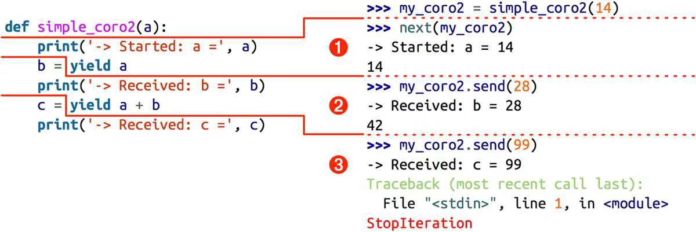

## 协程

### 生成器如何进化成协程

协程的底层架构在“PEP 342—Coroutines via EnhancedGenerators”中定义，并在Python 2.5（2006年）实现了。自此之后，yield关键字可以在表达式中使用，而且生成器API中增加了.send(value)方法。生成器的调用方可以使用.send(...)方法发送数据，发送的数据会成为生成器函数中yield表达式的值。因此，生成器可以作为协程使用。协程是指一个过程，这个过程与调用方协作，产出由调用方提供的值。

除了.send(...)方法，PEP 342还添加了.throw(...)和.close（　）方法：前者的作用是让调用方抛出异常，在生成器中处理；后者的作用是终止生成器。

协程最近的演进来自Python 3.3（2012年）实现的“PEP 380—Syntax for Delegating to a Subgenerator”。PEP 380对生成器函数的句法做了两处改动，以便更好地作为协程使用：

- 现在，生成器可以返回一个值；以前，如果在生成器中给return语句提供值，会抛出SyntaxError异常。
- 新引入了yield from句法，使用它可以把复杂的生成器重构成小型的嵌套生成器，省去了之前把生成器的工作委托给子生成器所需的大量样板代码。

### 用作协程的生成器的基本行为

展示了协程的行为:

```python
>>> def simple_coroutine（ ）: #  ➊
...     print('-> coroutine started')
...     x = yield  # ➋
...     print('-> coroutine received:', x)
...
>>> my_coro = simple_coroutine（ ）
>>> my_coro  # ➌
<generator object simple_coroutine at 0x100c2be10>
>>> next(my_coro)  # ➍
-> coroutine started
>>> my_coro.send(42)  # ➎
-> coroutine received: 42
Traceback (most recent call last):  # ➏
  ...
StopIteration
```

- ❷ yield在表达式中使用；如果协程只需从客户那里接收数据，那么产出的值是None——这个值是隐式指定的，因为yield关键字右边没有表达式。
- ❹ 首先要调用next(...)函数，因为生成器还没启动，没在yield语句处暂停，所以一开始无法发送数据。
- ❺ 调用这个方法后，协程定义体中的yield表达式会计算出42；现在，协程会恢复，一直运行到下一个yield表达式，或者终止。

协程可以身处四个状态中的一个。当前状态可以使用inspect.getgeneratorstate(...)函数确定，该函数会返回下述字符串中的一个:

- 'GEN_CREATED': 等待开始执行。
- 'GEN_RUNNING': 解释器正在执行。
- 'GEN_SUSPENDED': 在yield表达式处暂停。
- 'GEN_CLOSED': 执行结束。

因为send方法的参数会成为暂停的yield表达式的值，所以，仅当协程处于暂停状态时才能调用send方法，例如my_coro.send(42)。不过，如果协程还没激活（即，状态是'GEN_CREATED'），情况就不同了。调用next(my_coro)激活协程——也可以调用my_coro.send(None)，效果一样。

如果创建协程对象后立即把None之外的值发给它，会出现下述错误：

```python
>>> my_coro = simple_coroutine（ ）
>>> my_coro.send(1729)
Traceback (most recent call last):
  File "<stdin>", line 1, in <module>
TypeError: can't send non-None value to a just-started generator
```

最先调用next(my_coro)函数这一步通常称为“预激”（prime）协程（即，让协程向前执行到第一个yield表达式，准备好作为活跃的协程使用）。

下面举个产出多个值的例子，以便更好地理解协程的行为:

```python
>>> def simple_coro2(a):
...     print('-> Started: a =', a)
...     b = yield a
...     print('-> Received: b =', b)
...     c = yield a+b
...     print('-> Received: c =', c)
...
>>> my_coro2 = simple_coro2(14)
>>> from inspect import getgeneratorstate
>>> getgeneratorstate(my_coro2) ➊
'GEN_CREATED'
>>> next(my_coro2) ➋
-> Started: a = 14
14
>>> getgeneratorstate(my_coro2) ➌
'GEN_SUSPENDED'
>>> my_coro2.send(28) ➍
-> Received: b = 28
42
>>> my_coro2.send(99) ➎
-> Received: c = 99
Traceback (most recent call last):
  File "<stdin>", line 1, in <module>
StopIteration
>>> getgeneratorstate(my_coro2) ➏
'GEN_CLOSED'
```

- ❶ inspect.getgeneratorstate函数指明，处于GEN_CREATED状态（即协程未启动）。
- ❷ 向前执行协程到第一个yield表达式，打印-> Started: a=14消息，然后产出a的值，并且暂停，等待为b赋值。
- ❹ 把数字28发给暂停的协程；计算yield表达式，得到28，然后把那个数绑定给b。打印-> Received: b=28消息，产出a+b的值（42），然后协程暂停，等待为c赋值。
- ❺ 把数字99发给暂停的协程；计算yield表达式，得到99，然后把那个数绑定给c。打印-> Received: c=99消息，然后协程终止，导致生成器对象抛出StopIteration异常。

simple_coro2协程的执行过程分为3个阶段:

1. 调用next(my_coro2)，打印第一个消息，然后执行yield a，产出数字14。
2. 调用my_coro2.send(28)，把28赋值给b，打印第二个消息，然后执行yield a+b，产出数字42。
3. 调用my_coro2.send(99)，把99赋值给c，打印第三个消息，协程终止。



...