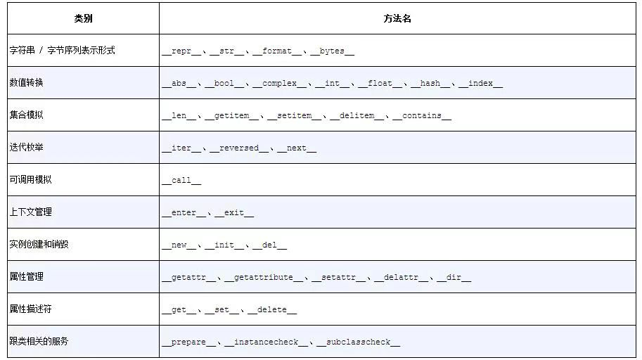
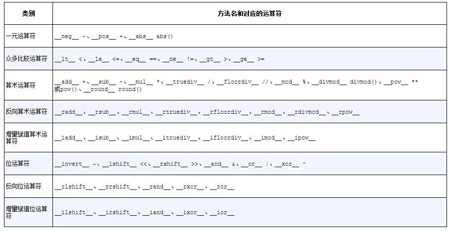

## 如何使用特殊方法

特殊方法的存在是为了被Python解释器调用的，你自己并不需要调用它们。在执行len(my_object)的时候，如果my_object是一个自定义类的对象，那么Python会自己去调用其中由你实现的`__len__`方法。

如果是Python内置的类型，比如列表（list）、字符串（str）、字节序列（bytearray）等，那么CPython会抄个近路，`__len__`实际上会直接返回PyVarObject里的ob_size属性。PyVarObject是表示内存中长度可变的内置对象的C语言结构体。直接读取这个值比调用一个方法要快很多。

很多时候，特殊方法的调用是隐式的，比如for i in x:这个语句，背后其实用的是iter(x)，而这个函数的背后则是x.`__iter__()`方法。当然前提是这个方法在x中被实现了。

通过内置的函数（例如len、iter、str，等等）来使用特殊方法是最好的选择。这些内置函数不仅会调用特殊方法，通常还提供额外的好处，而且对于内置的类来说，它们的速度更快

### 字符串表示形式

Python有一个内置的函数叫repr，它能把一个对象用字符串的形式表达出来以便辨认，这就是“字符串表示形式”。repr就是通过`__repr__`这个特殊方法来得到一个对象的字符串表示形式的。

`__repr__`和`__str__`的区别在于，后者是在str（　）函数被使用，或是在用print函数打印一个对象的时候才被调用的，并且它返回的字符串对终端用户更友好。如果你只想实现这两个特殊方法中的一个，`__repr__`是更好的选择，因为如果一个对象没有`__str__`函数，而Python又需要调用它的时候，解释器会用`__repr__`作为替代。

### 算数运算符

通过`__add__`和`__mul__`，带来了+和*这两个算术运算符。值得注意的是，这两个方法的返回值都是新创建的向量对象，被操作的两个对象（self或other）还是原封不动，代码里只是读取了它们的值而已。中缀运算符的基本原则就是不改变操作对象，而是产出一个新的值。

### 自定义布尔值

为了判定一个值x为真还是为假，Python会调用bool(x)，这个函数只能返回True或者False。

默认情况下，我们自己定义的类的实例总被认为是真的，除非这个类对`__bool__`或者`__len__`函数有自己的实现。bool(x)的背后是调用x.`__bool__（　）`的结果；如果不存在`__bool__`方法，那么bool(x)会尝试调用x.`__len__（　）`。若返回0，则bool会返回False；否则返回True。

## 特殊方法一览

1. 和运算符无关的特殊方法

2. 跟运算符相关的特殊方法

当交换两个操作数的位置时，就会调用反向运算符（b * a而不是a * b）。增量赋值运算符则是一种把中缀运算符变成赋值运算的捷径（a=a * b就变成了a*=b）。

### 为什么len不是普通方法

如果x是一个内置类型的实例，那么len(x)的速度会非常快。背后的原因是CPython会直接从一个C结构体里读取对象的长度，完全不会调用任何方法。获取一个集合中元素的数量是一个很常见的操作，在str、list、memoryview等类型上，这个操作必须高效。

len之所以不是一个普通方法，是为了让Python自带的数据结构可以走后门，abs也是同理。但是多亏了它是特殊方法，我们也可以把len用于自定义数据类型。

