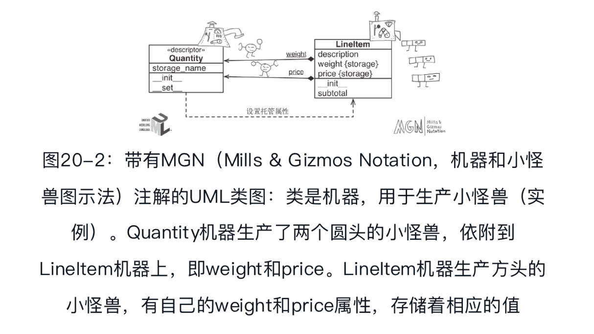

## 属性描述符

描述符是实现了特定协议的类，这个协议包括`__get__`、`__set__`和`__delete__`方法。property类实现了完整的描述符协议。通常，可以只实现部分协议。其实，我们在真实的代码中见到的大多数描述符只实现了`__get__`和`__set__`方法，还有很多只实现了其中的一个。

### 描述符示例：验证属性

 ####  LineItem类第3版：一个简单的描述符

实现了`__get__`、`__set__`或`__delete__`方法的类是描述符。描述符的用法是，创建一个实例，作为另一个类的类属性。



使用Quantity描述符管理LineItem的属性:

```python
class Quantity:  ➊
    def __init__(self, storage_name):
        self.storage_name = storage_name  ➋
    def __set__(self, instance, value):  ➌
        if value > 0:
            instance.__dict__[self.storage_name] = value  ➍
        else:
            raise ValueError('value must be > 0')
class LineItem:
    weight = Quantity('weight')  ➎
    price = Quantity('price')  ➏
    def __init__(self, description, weight, price):  ➐
        self.description = description
        self.weight = weight
        self.price = price
    def subtotal(self):
        return self.weight * self.price
```

- ❶ 描述符基于协议实现，无需创建子类。
- ❹ 这里，必须直接处理托管实例的`__dict__`属性；如果使用内置的setattr函数，会再次触发`__set__`方法，导致无限递归。

编写`__set__`方法时，要记住self和instance参数的意思：self是描述符实例，instance是托管实例。管理实例属性的描述符应该把值存储在托管实例中。因此，Python才为描述符中的那个方法提供了instance参数。

你可能想把各个托管属性的值直接存在描述符实例中，但是这种做法是错误的。为了理解错误的原因，可以想想`__set__`方法前两个参数（self和instance）的意思。这里，self是描述符实例，它其实是托管类的类属性。同一时刻，内存中可能有几千个LineItem实例，不过只会有两个描述符实例：LineItem.weight和LineItem.price。因此，存储在描述符实例中的数据，其实会变成LineItem类的类属性，从而由全部LineItem实例共享。

####  LineItem类第4版：自动获取储存属性的名称

为了生成storage_name，我们以'`_Quantity#`'为前缀，然后在后面拼接一个整数： `Quantity.__counter`类属性的当前值，每次把一个新的Quantity描述符实例依附到类上，都会递增这个值。在前缀中使用井号能避免storage_name与用户使用点号创建的属性冲突，因为`nutmeg._Quantity#0`是无效的Python句法。但是，内置的getattr和setattr函数可以使用这种“无效的”标识符获取和设置属性，此外也可以直接处理实例属性`__dict__`。

每个Quantity描述符都有独一无二的storage_name:

```python
class Quantity:
    __counter = 0  ➊
    def __init__(self):
        cls = self.__class__  ➋
        prefix = cls.__name__
        index = cls.__counter
        self.storage_name = '_{}#{}'.format(prefix, index)  ➌
        cls.__counter+= 1  ➍
    def __get__(self, instance, owner):  ➎
        return getattr(instance, self.storage_name)  ➏
    def __set__(self, instance, value):
       if value > 0:
           setattr(instance, self.storage_name, value)  ➐
       else:
           raise ValueError('value must be > 0')
class LineItem:
    weight = Quantity（ ）  ➑
    price = Quantity（ ）
    def __init__(self, description, weight, price):
        self.description = description
        self.weight = weight
        self.price = price
    def subtotal(self):
        return self.weight * self.price
```

- ❷ cls是Quantity类的引用。

这里可以使用内置的高阶函数getattr和setattr存取值，无需使用`instance.__dict__`，因为托管属性和储存属性的名称不同，所以把储存属性传给getattr函数不会触发描述符，不会像之前示例那样出现无限递归。

注意，`__get__`方法有三个参数：self、instance和owner。owner参数是托管类（如LineItem）的引用，通过描述符从托管类中获取属性时用得到。如果使用LineItem.weight从类中获取托管属性（以weight为例），描述符的`__get__`方法接收到的instance参数值是None。

此外，为了给用户提供内省和其他元编程技术支持，通过类访问托管属性时，最好让`__get__`方法返回描述符实例:

```python
class Quantity:
        __counter = 0
    def __init__(self):
        cls = self.__class__
        prefix = cls.__name__
        index = cls.__counter
        self.storage_name = '_{}#{}'.format(prefix, index)
        cls.__counter+= 1
    def __get__(self, instance, owner):
        if instance is None:
            return self  ➊
        else:
            return getattr(instance, self.storage_name)  ➋
    def __set__(self, instance, value):
        if value > 0:
            setattr(instance, self.storage_name, value)
        else:
            raise ValueError('value must be > 0')
```

如果想自动把储存属性的名称设成与托管属性的名称类似，需要用到类装饰器或元类。

#### LineItem类第5版：一种新型描述符

我们可以重构，并创建两个基类。

AutoStorage：自动管理储存属性的描述符类。

Validated：扩展AutoStorage类的抽象子类，覆盖`__set__`方法，调用必须由子类实现的validate方法。

重构后的描述符类:

```python
import abc
class AutoStorage:  ➊
    __counter = 0
    def __init__(self):
        cls = self.__class__
        prefix = cls.__name__
        index = cls.__counter
        self.storage_name = '_{}#{}'.format(prefix, index)
        cls.__counter+= 1
    def __get__(self, instance, owner):
        if instance is None:
            return self
        else:
            return getattr(instance, self.storage_name)
    def __set__(self, instance, value):
        setattr(instance, self.storage_name, value)  ➋
class Validated(abc.ABC, AutoStorage):  ➌
    def __set__(self, instance, value):
        value = self.validate(instance, value)  ➍
        super（ ）.__set__(instance, value)  ➎
    @abc.abstractmethod
    def validate(self, instance, value):  ➏
        """return validated value or raise ValueError"""
class Quantity(Validated):  ➐
    """a number greater than zero"""
    def validate(self, instance, value):
        if value <= 0:
            raise ValueError('value must be > 0')
        return value
class NonBlank(Validated):
    """a string with at least one non-space character"""
    def validate(self, instance, value):
        value = value.strip（ ）
        if len(value) == 0:
            raise ValueError('value cannot be empty or blank')
        return value  ➑
```

### 覆盖型与非覆盖型描述符对比

Python存取属性的方式特别不对等。通过实例读取属性时，通常返回的是实例中定义的属性；但是，如果实例中没有指定的属性，那么会获取类属性。而为实例中的属性赋值时，通常会在实例中创建属性，根本不影响类。

这种不对等的处理方式对描述符也有影响。其实，根据是否定义`__set__`方法，描述符可分为两大类。

几个简单的类，用于研究描述符的覆盖行为:

```python
def cls_name(obj_or_cls):
        cls = type(obj_or_cls)
    if cls is type:
        cls = obj_or_cls
    return cls.__name__.split('.')[-1]
def display(obj):
    cls = type(obj)
    if cls is type:
        return '<class {}>'.format(obj.__name__)
    elif cls in [type(None), int]:
        return repr(obj)
    else:
        return '<{} object>'.format(cls_name(obj))
def print_args(name, *args):
    pseudo_args = ', '.join(display(x) for x in args)
    print('-> {}.__{}__({})'.format(cls_name(args[0]), name, pseudo_args))
class Overriding:  ➊
    """也称数据描述符或强制描述符"""
    def __get__(self, instance, owner):
        print_args('get', self, instance, owner)  ➋
    def __set__(self, instance, value):
        print_args('set', self, instance, value)
class OverridingNoGet:  ➌
    """没有``__get__``方法的覆盖型描述符"""
    def __set__(self, instance, value):
        print_args('set', self, instance, value)
class NonOverriding:  ➍
    """也称非数据描述符或遮盖型描述符"""
    def __get__(self, instance, owner):
        print_args('get', self, instance, owner)
class Managed:  ➎
    over = Overriding（ ）
    over_no_get = OverridingNoGet（ ）
    non_over = NonOverriding（ ）
    def spam(self):  ➏
        print('-> Managed.spam({})'.format(display(self)))
```

- ❶ 有`__get__`和`__set__`方法的典型覆盖型描述符。
- ❸ 没有`__get__`方法的覆盖型描述符。
- ❹ 没有`__set__`方法，所以这是非覆盖型描述符。

#### 覆盖型描述符

实现`__set__`方法的描述符属于**覆盖型描述符**，因为虽然描述符是类属性，但是实现`__set__`方法的话，会覆盖对实例属性的赋值操作。

特性也是覆盖型描述符：如果没提供设值函数，property类中的`__set__`方法会抛出AttributeError异常，指明那个属性是只读的。

覆盖型描述符的行为，其中obj.over是Overriding类的实例:

```python
  >>> obj = Managed（ ）  ➊
  >>> obj.over  ➋
 -> Overriding.__get__(<Overriding object>, <Managed object>,
      <class Managed>)
  >>> Managed.over  ➌
 -> Overriding.__get__(<Overriding object>, None, <class Managed>)
  >>> obj.over = 7  ➍
 -> Overriding.__set__(<Overriding object>, <Managed object>, 7)
  >>> obj.over  ➎
 -> Overriding.__get__(<Overriding object>, <Managed object>,
     <class Managed>)
  >>> obj.__dict__['over'] = 8  ➏
  >>> vars(obj)  ➐
  {'over': 8}
  >>> obj.over  ➑
 -> Overriding.__get__(<Overriding object>, <Managed object>,
      <class Managed>) 
```

- ❹ 为obj.over赋值，触发描述符的`__set__`方法，最后一个参数的值是7。
- ❺ 读取obj.over，仍会触发描述符的`__get__`方法。
- ❽ 然而，即使是名为over的实例属性，Managed.over描述符仍会覆盖读取obj.over这个操作。

#### 没有`__get__`方法的覆盖型描述符

通常，覆盖型描述符既会实现`__set__`方法，也会实现`__get__`方法，不过也可以只实现`__set__`方法。此时，只有写操作由描述符处理。通过实例读取描述符会返回描述符对象本身，因为没有处理读操作的`__get__`方法。如果直接通过实例的`__dict__`属性创建同名实例属性，以后再设置那个属性时，仍会由`__set__`方法插手接管，但是读取那个属性的话，就会直接从实例中返回新赋予的值，而不会返回描述符对象。也就是说，实例属性会遮盖描述符，不过只有读操作是如此。

没有`__get__`方法的覆盖型描述符，其中obj.over_no_get是OverridingNoGet类的实例:

```python
 >>> obj.over_no_get  ➊
 <__main__.OverridingNoGet object at 0x665bcc>
 >>> Managed.over_no_get  ➋
 <__main__.OverridingNoGet object at 0x665bcc>
 >>> obj.over_no_get = 7  ➌
-> OverridingNoGet.__set__(<OverridingNoGet object>, <Managed object>, 7)
 >>> obj.over_no_get  ➍
 <__main__.OverridingNoGet object at 0x665bcc>
 >>> obj.__dict__['over_no_get'] = 9  ➎
 >>> obj.over_no_get  ➏
 9
 >>> obj.over_no_get = 7  ➐
-> OverridingNoGet.__set__(<OverridingNoGet object>, <Managed object>, 7)
 >>> obj.over_no_get  ➑
 9
```

- ❶ 这个覆盖型描述符没有`__get__`方法，因此，obj.over_no_get从类中获取描述符实例。
- ❺ 通过实例的`__dict__`属性设置名为over_no_get的实例属性。
- ❻ 现在，over_no_get实例属性会遮盖描述符，但是只有读操作是如此。

#### 非覆盖型描述符

没有实现`__set__`方法的描述符是非覆盖型描述符。如果设置了同名的实例属性，描述符会被遮盖，致使描述符无法处理那个实例的那个属性。方法是以非覆盖型描述符实现的。

非覆盖型描述符的行为，其中obj.non_over是NonOverriding类的实例:

```python
>>> obj = Managed（ ）
>>> obj.non_over  ➊
-> NonOverriding.__get__(<NonOverriding object>, <Managed object>,
     <class Managed>)
 >>> obj.non_over = 7  ➋
 >>> obj.non_over  ➌
 7
 >>> Managed.non_over  ➍
-> NonOverriding.__get__(<NonOverriding object>, None, <class Managed>)
 >>> del obj.non_over  ➎
 >>> obj.non_over  ➏
-> NonOverriding.__get__(<NonOverriding object>, <Managed object>,
     <class Managed>)
```

- ❸ 现在，obj有个名为non_over的实例属性，把Managed类的同名描述符属性遮盖掉。
- ❹ Managed.non_over描述符依然存在，会通过类截获这次访问。
- ❺ 如果把non_over实例属性删除了……

#### 在类中覆盖描述符

不管描述符是不是覆盖型，为类属性赋值都能覆盖描述符。这是一种猴子补丁技术。

读写属性的另一种不对等：读类属性的操作可以由依附在托管类上定义有`__get__`方法的描述符处理，但是写类属性的操作不会由依附在托管类上定义有`__set__`方法的描述符处理。

> 若想控制设置类属性的操作，要把描述符依附在类的类上，即依附在元类上。默认情况下，对用户定义的类来说，其元类是type，而我们不能为type添加属性。在下一章，我们会自己创建元类。

### 方法是描述符

在类中定义的函数属于绑定方法（bound method），因为用户定义的函数都有`__get__`方法，所以依附到类上时，就相当于描述符。

方法是非覆盖型描述符:

```python
>>> obj = Managed（ ）
>>> obj.spam  ➊
<bound method Managed.spam of <descriptorkinds.Managed object at 0x74c80c>>
>>> Managed.spam  ➋
<function Managed.spam at 0x734734>
>>> obj.spam = 7  ➌
>>> obj.spam
7
```

- ❶ obj.spam获取的是绑定方法对象。
- ❷ 但是Managed.spam获取的是函数。
- ❸ 如果为obj.spam赋值，会遮盖类属性，导致无法通过obj实例访问spam方法。

函数没有实现`__set__`方法，因此是非覆盖型描述符。

obj.spam和Managed.spam获取的是不同的对象。与描述符一样，通过托管类访问时，函数的`__get__`方法会返回自身的引用。但是，通过实例访问时，函数的`__get__`方法返回的是绑定方法对象：一种可调用的对象，里面包装着函数，并把托管实例（例如obj）绑定给函数的第一个参数（即self），这与functools.partial函数的行为一致。

method_is_descriptor.py：Text类，继承自UserString类:

```python
import collections
class Text(collections.UserString):
  def __repr__(self):
    return 'Text({!r})'.format(self.data)
  def reverse(self):
    return self[::-1]
```

测试一个方法:

```python
>>> word = Text('forward')
>>> word  ➊
Text('forward')
>>> word.reverse（ ）  ➋
Text('drawrof')
>>> Text.reverse(Text('backward'))  ➌
Text('drawkcab')
>>> type(Text.reverse), type(word.reverse)  ➍
(<class 'function'>, <class 'method'>)
>>> list(map(Text.reverse, ['repaid', (10, 20, 30), Text('stressed')]))  ➎
['diaper', (30, 20, 10), Text('desserts')]
>>> Text.reverse.__get__(word)  ➏
<bound method Text.reverse of Text('forward')>
>>> Text.reverse.__get__(None, Text)  ➐
<function Text.reverse at 0x101244e18>
>>> word.reverse  ➑
<bound method Text.reverse of Text('forward')>
>>> word.reverse.__self__  ➒
Text('forward')
>>> word.reverse.__func__ is Text.reverse  ➓
True
```

- ❹ 注意类型是不同的，一个是function，一个是method。
- ❻ 函数都是非覆盖型描述符。在函数上调用`__get__`方法时传入实例，得到的是绑定到那个实例上的方法。
- ❼ 调用函数的`__get__`方法时，如果instance参数的值是None，那么得到的是函数本身。
- ❽ word.reverse表达式其实会调用`Text.reverse.__get__(word)`，返回对应的绑定方法。
- ❾ 绑定方法对象有个`__self__`属性，其值是调用这个方法的实例引用。
- ❿ 绑定方法的`__func__`属性是依附在托管类上那个原始函数的引用。

绑定方法对象还有个`__call__`方法，用于处理真正的调用过程。这个方法会调用`__func__`属性引用的原始函数，把函数的第一个参数设为绑定方法的`__self__`属性。这就是形参self的隐式绑定方式。

函数会变成绑定方法，这是Python语言底层使用描述符的最好例证。

### 描述符用法建议

- **使用特性以保持简单**: 内置的property类创建的其实是覆盖型描述符，`__set__`方法和`__get__`方法都实现了，即便不定义设值方法也是如此。特性的`__set__`方法默认抛出AttributeError: can't set attribute，因此创建只读属性最简单的方式是使用特性，这能避免下一条所述的问题。
- **只读描述符必须有`__set__`方法**: 如果使用描述符类实现只读属性，要记住，`__get__`和`__set__`两个方法必须都定义，否则，实例的同名属性会遮盖描述符。只读属性的`__set__`方法只需抛出AttributeError异常，并提供合适的错误消息。
- **用于验证的描述符可以只有`__set__`方法**: 对仅用于验证的描述符来说，`__set__`方法应该检查value参数获得的值，如果有效，使用描述符实例的名称为键，直接在实例的`__dict__`属性中设置。这样，从实例中读取同名属性的速度很快，因为不用经过`__get__`方法处理。
- **仅有`__get__`方法的描述符可以实现高效缓存**:如果只编写了`__get__`方法，那么创建的是非覆盖型描述符。这种描述符可用于执行某些耗费资源的计算，然后为实例设置同名属性，缓存结果。同名实例属性会遮盖描述符，因此后续访问会直接从实例的`__dict__`属性中获取值，而不会再触发描述符的`__get__`方法。
- **非特殊的方法可以被实例属性遮盖**:解释器只会在类中寻找特殊的方法，也就是说，repr(x)执行的其实是`x.__class__.__repr__(x)`，因此x的`__repr__`属性对repr(x)方法调用没有影响。出于同样的原因，实例的`__getattr__`属性不会破坏常规的属性访问规则。

### 描述符的文档字符串和覆盖删除操作

描述符类的文档字符串用于注解托管类中的各个描述符实例。