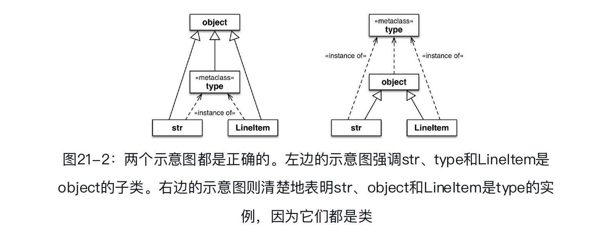
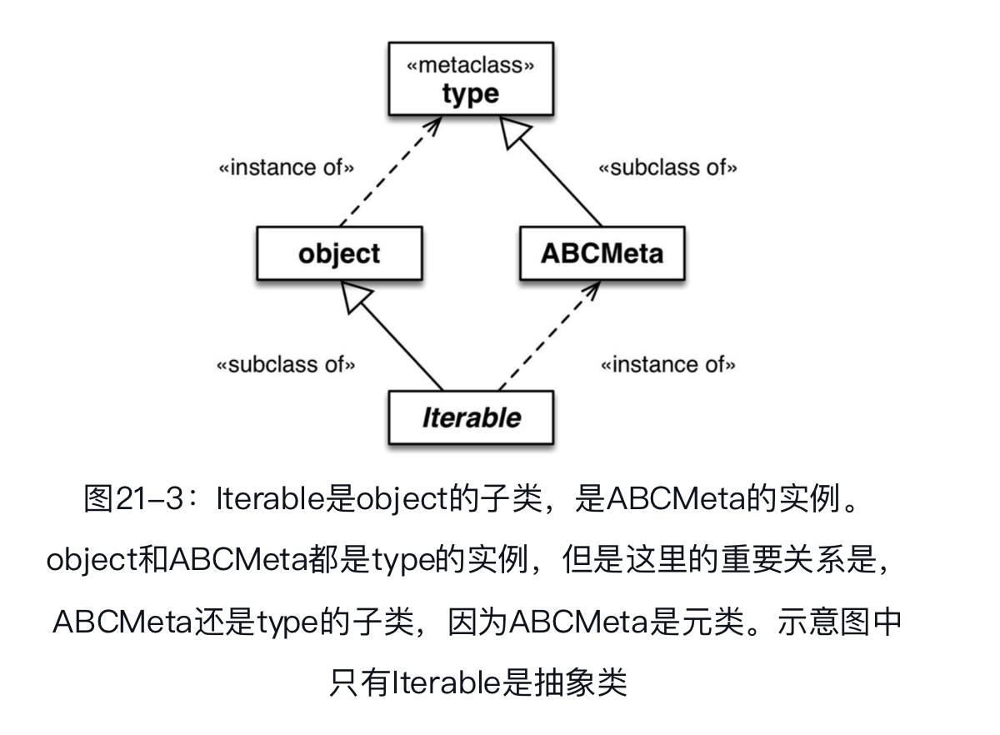

## 类元编程

类元编程是指在运行时创建或定制类的技艺。在Python中，类是一等对象，因此任何时候都可以使用函数新建类，而无需使用class关键字。类装饰器也是函数，不过能够审查、修改，甚至把被装饰的类替换成其他类。最后，元类是类元编程最高级的工具：使用元类可以创建具有某种特质的全新类种，例如抽象基类。

### 类工厂函数

本书多次提到标准库中的一个类工厂函数——collections.namedtuple。我们把一个类名和几个属性名传给这个函数，它会创建一个tuple的子类，其中的元素通过名称获取，还为调试提供了友好的字符串表示形式（`__repr__`）。

参考collections.namedtuple，下面我们创建一个record_factory函数，即时创建简单的类:

```python
def record_factory(cls_name, field_names):
    try:
        field_names = field_names.replace(',', ' ').split（ ）  ➊
    except AttributeError:  #不能调用.replace或.split方法
        pass  #假定field_names本就是标识符组成的序列
    field_names = tuple(field_names)  ➋
    def __init__(self, *args, **kwargs):  ➌
        attrs = dict(zip(self.__slots__, args))
        attrs.update(kwargs)
        for name, value in attrs.items（ ）:
            setattr(self, name, value)
    def __iter__(self):  ➍
        for name in self.__slots__:
            yield getattr(self, name)
    def __repr__(self):  ➎
        values = ', '.join('{}={!r}'.format(*i) for i
                           in zip(self.__slots__, self))
        return '{}({})'.format(self.__class__.__name__, values)
    cls_attrs = dict(__slots__ = field_names,  ➏
                     __init__  = __init__,
                     __iter__  = __iter__,
                     __repr__  = __repr__)
    return type(cls_name, (object,), cls_attrs)  ➐
```

- ❻ 组建类属性字典。
- ❼ 调用type构造方法，构建新类，然后将其返回。

通常，我们把type视作函数，因为我们像函数那样使用它，例如，调用type(my_object)获取对象所属的类——作用与`my_object.__class__`相同。然而，type是一个类。当成类使用时，传入三个参数可以新建一个类：

```python
MyClass = type('MyClass', (MySuperClass, MyMixin),
               {'x':42, 'x2': lambda self: self.x * 2})
```

type的三个参数分别是name、bases和dict。最后一个参数是一个映射，指定新类的属性名和值。

上述代码的作用与下述代码相同：

```python
class MyClass(MySuperClass, MyMixin):
  x = 42
  def x2(self):
    return self.x * 2
```

让人觉得新奇的是，type的实例是类，例如这里的MyClass类。

总之，上面示例中record_factory函数的最后一行会构建一个类，类的名称是cls_name参数的值，唯一的直接超类是object，有`__slots__`、`__init__`、`__iter__`和`__repr__`四个类属性，其中后三个是实例方法。

> 在Python中做元编程时，最好不用exec和eval函数。如果接收的字符串（或片段）来自不可信的源，那么这两个函数会带来严重的安全风险。Python提供了充足的内省工具，大多数时候都不需要使用exec和eval函数。然而，Python核心开发者实现namedtuple函数时选择了使用exec函数，这样做是为了让生成的类代码能通过._source属性获取。

### 定制描述符的类装饰器

一旦组建好整个类，而且把描述符绑定到类属性上之后，我们就可以审查类，并为描述符设置合理的储存属性名称。LineItem类的`__new__`方法可以做到这一点，因此，在`__init__`方法中使用描述符时，储存属性已经设置了正确的名称。为了解决这个问题而使用`__new__`方法纯属白费力气：每次新建LineItem实例时都会运行`__new__`方法中的逻辑，可是，一旦LineItem类构建好了，描述符与托管属性之间的绑定就不会变了。因此，我们要在创建类时设置储存属性的名称。使用类装饰器或元类可以做到这一点。 

首先使用类装饰器实现：

使用Quantity和NonBlank描述符的LineItem类:

```python
import model_v6 as model
@model.entity  ➊
class LineItem:
    description = model.NonBlank（ ）
    weight = model.Quantity（ ）
    price = model.Quantity（ ）
    def __init__(self, description, weight, price):
        self.description = description
        self.weight = weight
        self.price = price
    def subtotal(self):
        return self.weight * self.price
```

- ➊ 这个类唯一的变化是添加了装饰器。

一个类装饰器：

```python
def entity(cls):  # 1
  for key, attr in cls.__dict__.items(): # 2
    if isinstance(attr, Validated):
      type_name = type(attr).__name__
      attr.storage_name = '_{}#{}'.format(type_name, key) # 4
  return cls
```

- ❶ 装饰器的参数是一个类。
- ❷ 迭代存储类属性的字典。
- ❹ ……使用描述符类的名称和托管属性的名称命名storage_name（例如_NonBlank#description）。
- ❺ 返回修改后的类。

类装饰器能以较简单的方式做到以前需要使用元类去做的事情——创建类时定制类。

类装饰器有个重大缺点：只对直接依附的类有效。这意味着，被装饰的类的子类可能继承也可能不继承装饰器所做的改动，具体情况视改动的方式而定。

### 导入时和运行时比较

在导入时，解释器会从上到下一次性解析完.py模块的源码，然后生成用于执行的字节码。如果句法有错误，就在此时报告。如果本地的`__pycache__`文件夹中有最新的.pyc文件，解释器会跳过上述步骤，因为已经有运行所需的字节码了。

编译肯定是导入时的活动，不过那个时期还会做些其他事，因为Python中的语句几乎都是可执行的，也就是说语句可能会运行用户代码，修改用户程序的状态。尤其是import语句，它不只是声明，在进程中首次导入模块时，还会运行所导入模块中的全部顶层代码——以后导入相同的模块则使用缓存，只做名称绑定。那些顶层代码可以做任何事，包括通常在“运行时”做的事，例如连接数据库。因此，“导入时”与“运行时”之间的界线是模糊的：import语句可以触发任何“运行时”行为。

导入模块时，解释器会执行顶层的def语句，解释器会编译函数的定义体（首次导入模块时），把函数对象绑定到对应的全局名称上，但是显然解释器不会执行函数的定义体。通常这意味着解释器在导入时定义顶层函数，但是仅当在运行时调用函数时才会执行函数的定义体。

对类来说，情况就不同了：在导入时，解释器会执行每个类的定义体，甚至会执行嵌套类的定义体。执行类定义体的结果是，定义了类的属性和方法，并构建了类对象。从这个意义上理解，类的定义体属于“顶层代码”，因为它在导入时运行。

### 元类基础知识

根据Python对象模型，类是对象，因此类肯定是另外某个类的实例。默认情况下，Python中的类是type类的实例。也就是说，type是大多数内置的类和用户定义的类的元类：

```python
>>> 'spam'.__class__
<class 'str'>
>>> str.__class__
<class 'type'>
>>> from bulkfood_v6 import LineItem
>>> LineItem.__class__
<class 'type'>
>>> type.__class__
<class 'type'>
```

为了避免无限回溯，type是其自身的实例。

并不是说str或LineItem继承自type，str和LineItem是type的实例。这两个类是object的子类。



> object类和type类之间的关系很独特：object是type的实例，而type是object的子类。这种关系很“神奇”，无法使用Python代码表述，因为定义其中一个之前另一个必须存在。type是自身的实例这一点也很神奇。


除了type，标准库中还有一些别的元类，例如ABCMeta和Enum。如下述代码片段所示，collections.Iterable所属的类是abc.ABCMeta。Iterable是抽象类，而ABCMeta不是——不管怎样，Iterable是ABCMeta的实例：

```python
>>> import collections
>>> collections.Iterable.__class__
<class 'abc.ABCMeta'>
>>> import abc
>>> abc.ABCMeta.__class__
<class 'type'>
>>> abc.ABCMeta.__mro__
(<class 'abc.ABCMeta'>, <class 'type'>, <class 'object'>)
```

向上追溯，ABCMeta最终所属的类也是type。所有类都直接或间接地是type的实例，不过只有元类同时也是type的子类。

若想理解元类，一定要知道这种关系：元类（如ABCMeta）从type类继承了构建类的能力。



所有类都是type的实例，但是元类还是type的子类，因此可以作为制造类的工厂。具体来说，元类可以通过实现`__init__`方法定制实例。元类的`__init__`方法可以做到类装饰器能做的任何事情，但是作用更大。


MetaAleph类，发现`__init__`方法有四个参数。

- self: 这是要初始化的类对象（例如ClassFive）。
- name、bases、dic与构建类时传给type的参数一样。

```python
class MetaAleph(type):
    print('<[400]> MetaAleph body')
    def __init__(cls, name, bases, dic):
        print('<[500]> MetaAleph.__init__')
        def inner_2(self):
            print('<[600]> MetaAleph.__init__:inner_2')
        cls.method_z = inner_2
```

编写元类时，通常会把self参数改成cls。例如，在上述元类的`__init__`方法中，把第一个参数命名为cls能清楚地表明要构建的实例是类。

### 定制描述符的元类

```python
class EntityMeta(type):
        """元类，用于创建带有验证字段的业务实体"""
    def __init__(cls, name, bases, attr_dict):
        super（ ）.__init__(name, bases, attr_dict)  ➊
        for key, attr in attr_dict.items（ ）:  ➋
            if isinstance(attr, Validated):
                type_name = type(attr).__name__
                attr.storage_name = '_{}#{}'.format(type_name, key)
class Entity(metaclass=EntityMeta):  ➌
    """带有验证字段的业务实体"""
```

- ❶ 在超类（在这里是type）上调用`__init__`方法。

### 类作为对象

Python数据模型为每个类定义了很多属性，参见标准库参考中“Built-in Types”一章的“4.13. Special Attributes”一节。其中三个属性已经见过多次：`__mro__`、`__class__`和`__name__`。此外，还有以下属性:

- `cls.__bases__`:由类的基类组成的元组。
- `cls.__qualname__`:Python 3.3新引入的属性，其值是类或函数的限定名称，即从模块的全局作用域到类的点分路径。
- `cls.__subclasses__()`:这个方法返回一个列表，包含类的直接子类。这个方法的实现使用弱引用，防止在超类和子类（子类在`__bases__`属性中储存指向超类的强引用）之间出现循环引用。这个方法返回的列表中是内存里现存的子类
- `cls.mro()`:构建类时，如果需要获取储存在类属性`__mro__`中的超类元组，解释器会调用这个方法。元类可以覆盖这个方法，定制要构建的类解析方法的顺序

dir(...)函数不会列出本节提到的任何一个属性。
