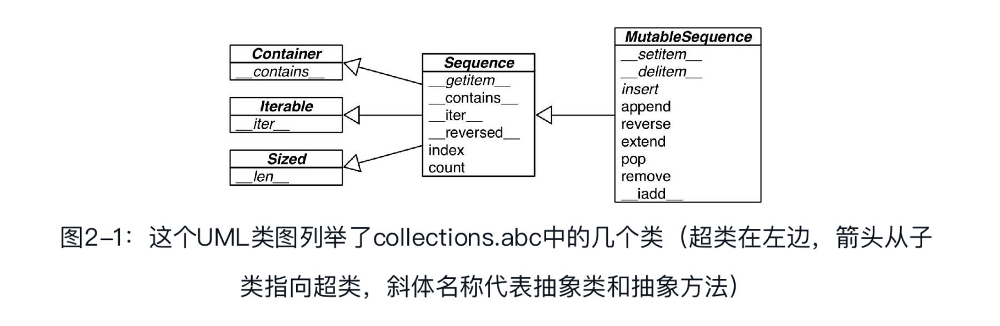
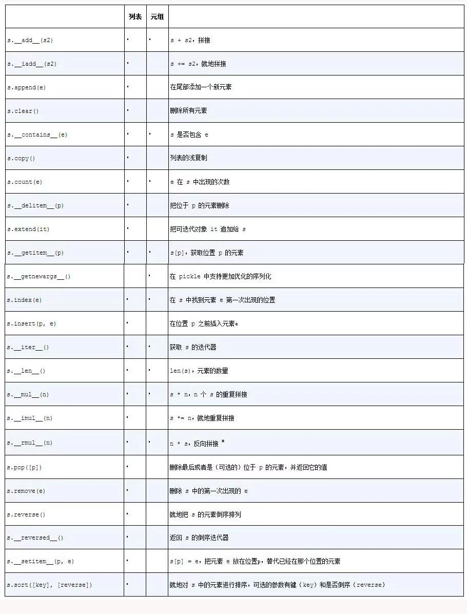
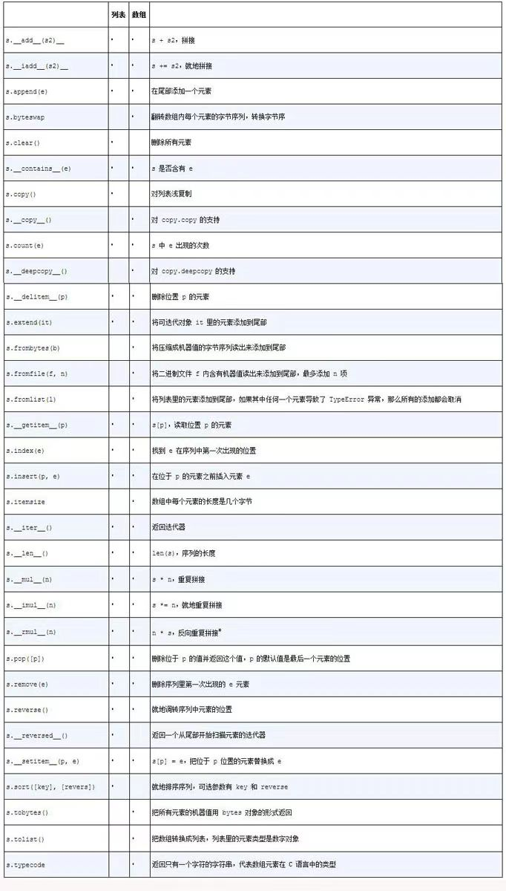
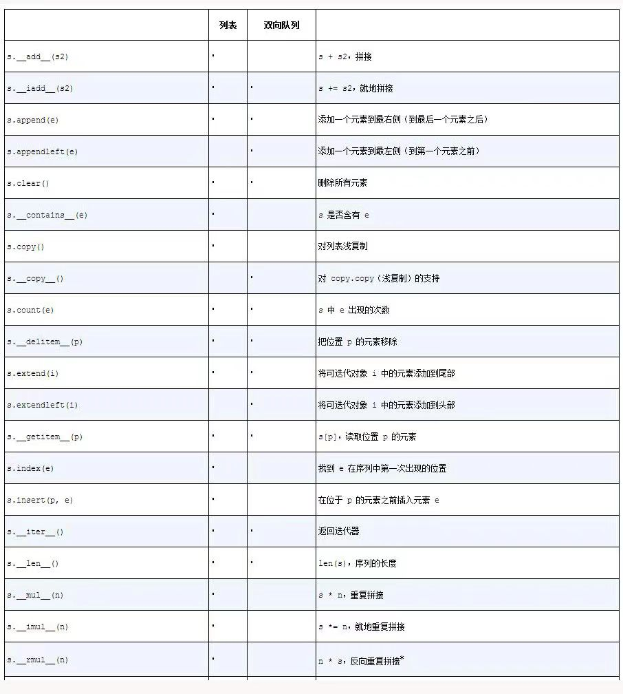

## 序列构成的数组

### 内置序列类型概览

Python标准库用C实现了丰富的序列类型，

- 容器序列 : list、tuple和collections.deque这些序列能存放不同类型的数据。
- 扁平序列 : str、bytes、bytearray、memoryview和array.array，这类序列只能容纳一种类型。

**容器序列**存放的是它们所包含的任意类型的对象的引用，而**扁平序列**里存放的是值而不是引用。

换句话说，扁平序列其实是一段连续的内存空间。由此可见扁平序列其实更加紧凑，但是它里面只能存放诸如字符、字节和数值这种基础类型。

序列类型还能按照能否被修改来分类。

- 可变序列 : list、bytearray、array.array、collections.deque和memoryview。

- 不可变序列 : tuple、str和bytes。

图2-1显示了可变序列（MutableSequence）和不可变序列（Sequence）的差异，同时也能看出前者从后者那里继承了一些方法。虽然内置的序列类型并不是直接从Sequence和MutableSequence这两个抽象基类（Abstract Base Class，ABC）继承而来的。



### 列表推导和生成器表达式

列表推导(list comprehension)是构建列表（list）的快捷方式，而生成器表达式（generator expression）则可以用来创建其他任何类型的序列。

#### 列表推导和可读性

> 句法提示: Python会忽略代码里[]、{}和（　）中的换行，因此如果你的代码里有多行的列表、列表推导、生成器表达式、字典这一类的，可以省略不太好看的续行符\。

Python 2.x中，在列表推导中for关键词之后的赋值操作可能会影响列表推导上下文中的同名变量。像下面这个Python 2.7控制台对话：

```python
>>> x = 'my precious'
>>> dummy = [ x for x in 'ABC']
>>> x
'C'
```

x原本的值被取代了，但是这种情况在Python 3中是不会出现的。

列表推导、生成器表达式，以及同它们很相似的集合（set）推导和字典（dict）推导，在Python 3中都有了自己的局部作用域，就像函数似的。表达式内部的变量和赋值只在局部起作用，表达式的上下文里的同名变量还可以被正常引用，局部变量并不会影响到它们。

#### 笛卡尔积

用列表推导可以生成两个或以上的可迭代类型的笛卡儿积。笛卡儿积是一个列表，列表里的元素是由输入的可迭代类型的元素对构成的元组，因此笛卡儿积列表的长度等于输入变量的长度的乘积。

```python
>>> colors = ['black', 'white']
>>> sizes = ['S', 'M', 'L']
>>> tshirts = [(color, size) for color in colors for size in sizes]
>>> tshirts
[('black', 'S'), ('black', 'M'), ('black', 'L'), ('white', 'S'), ('white', 'M'), ('white', 'L')]
```

列表推导的作用只有一个：生成列表。如果想生成其他类型的序列，生成器表达式就派上了用场。

#### 生成器表达式

虽然也可以用列表推导来初始化元组、数组或其他序列类型，但是生成器表达式是更好的选择。这是因为生成器表达式背后遵守了迭代器协议，可以逐个地产出元素，而不是先建立一个完整的列表，然后再把这个列表传递到某个构造函数里。前面那种方式显然能够节省内存。

生成器表达式的语法跟列表推导差不多，只不过把方括号换成圆括号而已。

```python
>>> symbols = "abcde"
>>> tuple(ord(symbol) for symbol in symbols)
(97, 98, 99, 100, 101)
>>> import array
>>> array.array('I', (ord(symbol) for symbol in symbols))
array('I', [97L, 98L, 99L, 100L, 101L])
```

> 如果生成器表达式是一个函数调用过程中的唯一参数，那么不需要额外再用括号把它围起来。

生成器表达式会在每次for循环运行时才生成一个组合

```python
>>> colors = ['black', 'white']
>>> sizes = ['S', 'M', 'L']
>>> for tshirt in ('%s%s'%(c,s) for c in colors for s in sizes):
...     print(tshirt)
...
blackS
blackM
blackL
whiteS
whiteM
whiteL
>>> ('%s%s'%(c,s) for c in colors for s in sizes)
<generator object <genexpr> at 0x7f82000f1f00>
```

### 元组不仅仅是不可变的列表

除了用作不可变的列表，它还可以用于没有字段名的记录。

#### 元组和记录

元组其实是对数据的记录：元组中的每个元素都存放了记录中一个字段的数据，外加这个字段的位置。

#### 元组拆包

元组拆包可以应用到任何可迭代对象上，唯一的硬性要求是，被可迭代对象中的元素数量必须要跟接受这些元素的元组的空档数一致。除非我们用*来表示忽略多余的元素。

最好辨认的元组拆包形式就是平行赋值，也就是说把一个可迭代对象里的元素，一并赋值到由对应的变量组成的元组中。就像下面这段代码：

```python
>>> lax_coordinates = (33.9245, -118.4080056)
>>> latitude, longitude = lax_coordinates
>>> latitude
33.9245
>>> longitude
-118.4080056
```

另外一个很优雅的写法当属不使用中间变量交换两个变量的值：

```python
b, a = a, b
```

还可以用*运算符把一个可迭代对象拆开作为函数的参数：

```python
>>> divmod(20,8)
(2, 4)
>>> t = (20,8)
>>> divmod(*t)
(2, 4)
```

除此之外，在元组拆包中使用`*`也可以帮助我们把注意力集中在元组的部分元素上。用`*`来处理剩下的元素在Python中，函数用`*args`来获取不确定数量的参数算是一种经典写法了。

Python 3里，这个概念被扩展到了平行赋值中。

在平行赋值中，*前缀只能用在一个变量名前面，但是这个变量可以出现在赋值表达式的任意位置：

```python
>>> a, *body, c, d = range(5)
>>> a,bidy,c,d
>>> a,body,c,d
(0, [1, 2], 3, 4)
```

#### 嵌套元组拆包

接受表达式的元组可以是嵌套式的，例如(a, b, (c, d))。只要这个接受元组的嵌套结构符合表达式本身的嵌套结构，Python就可以作出正确的对应。

在Python 3之前，元组可以作为形参放在函数声明中，例如def fn(a, (b, c),d):。然而Python 3不再支持这种格式。

#### 具名元组

collections.namedtuple是一个工厂函数，它可以用来构建一个带字段名的元组和一个有名字的类。

用namedtuple构建的类的实例所消耗的内存跟元组是一样的，因为字段名都被存在对应的类里面。这个实例跟普通的对象实例比起来也要小一些，因为Python不会用`__dict__`来存放这些实例的属性。

```python
>>> from collections import namedtuple
>>> City = namedtuple('City', 'name country population coordinates')
>>> tokyo = City('Tokyo', 'JP', 36.933, (35.789722, 139.691667))
>>> tokyo
City(name='Tokyo', country='JP', population=36.933, coordinates=(35.789722, 139.691667))
>>> tokyo.population
36.933
```

- 创建一个具名元组需要两个参数，一个是类名，另一个是类的各个字段的名字。后者可以是由数个字符串组成的可迭代对象，或者是由空格分隔开的字段名组成的字符串。
-  存放在对应字段里的数据要以一串参数的形式传入到构造函数中（注意，元组的构造函数却只接受单一的可迭代对象）。
- 可以通过字段名或者位置来获取一个字段的信息。

具名元组还有一些自己专有的属性：`_fields`类属性、类方法`_make(iterable)`和实例方法`_asdict（　）`。

```python
>>> City._fields
('name', 'country', 'population', 'coordinates')
>>> LatLong = namedtuple('LatLong', 'lat long')
>>> delhi_data = ('Delhi NCR', 'IN', 21.935, LatLong(28.613889, 77.208889))
>>> delhi = City._make(delhi_data)
>>> delhi
City(name='Delhi NCR', country='IN', population=21.935, coordinates=LatLong(lat=28.613889, long=77.208889))
>>> delhi._asdict()
OrderedDict([('name', 'Delhi NCR'), ('country', 'IN'), ('population', 21.935), ('coordinates', LatLong(lat=28.613889, long=77.208889))])
>>> for key, value in delhi._asdict().items():
...     print(key+":",value)
...
('name:', 'Delhi NCR')
('country:', 'IN')
('population:', 21.935)
('coordinates:', LatLong(lat=28.613889, long=77.208889))
```

- _fields属性是一个包含这个类所有字段名称的元组。
- 用_make（　）通过接受一个可迭代对象来生成这个类的一个实例，它的作用跟City(*delhi_data)是一样的。
-  _asdict（　）把具名元组以collections.OrderedDict的形式返回，我们可以利用它来把元组里的信息友好地呈现出来。

#### 作为不可变列表的元组

除了跟增减元素相关的方法之外，元组支持列表的其他所有方法。还有一个例外，元组没有`__reversed__`方法，但是这个方法只是个优化而已，reversed(my_tuple)这个用法在没有`__reversed__`的情况下也是合法的。

> 列表或者元组的方法属性



### 切片

切片和区间会忽略最后一个元素。

#### 对对象进行切片

一个众所周知的秘密是，我们还可以用`s[a:b:c]`的形式对s在a和b之间以c为间隔取值。c的值还可以为负，负值意味着反向取值。

`a:b:c`这种用法只能作为索引或者下标用在[]中来返回一个切片对象：slice(a, b,c)。

对seq[start:stop:step]进行求值的时候，Python会调用`seq.__getitem__(slice(start, stop, step))`。

#### 多维切片和省略

切片还有个两个额外的功能：多维切片和省略表示法（...）。

[]运算符里还可以使用以逗号分开的多个索引或者是切片，外部库NumPy里就用到了这个特性，二维的numpy.ndarray就可以用a[i, j]这种形式来获取，抑或是用a[m:n, k:l]的方式来得到二维切片。

要正确处理这种[]运算符的话，对象的特殊方法`__getitem__`和`__setitem__`需要以元组的形式来接收a[i, j]中的索引。也就是说，如果要得到a[i, j]的值，Python会调用`a.__getitem__((i, j))`。

Python内置的序列类型都是一维的，因此它们只支持单一的索引，成对出现的索引是没有用的。

省略（ellipsis）的正确书写方法是三个英语句号（...）,省略在Python解析器眼里是一个符号，而实际上它是Ellipsis对象的别名，而Ellipsis对象又是ellipsis类的单一实例。它可以当作切片规范的一部分，也可以用在函数的参数清单中，比如f(a, ..., z)，或a[i:...]。在NumPy中，...用作多维数组切片的快捷方式。如果x是四维数组，那么x[i, ...]就是x[i, :, :, :]的缩写。

#### 给切片赋值

如果把切片放在赋值语句的左边，或把它作为del操作的对象，我们就可以对序列进行嫁接、切除或就地修改操作。

```python
>>> l = list(range(10))
>>> l
[0, 1, 2, 3, 4, 5, 6, 7, 8, 9]
>>> l[2:5]=[20,30]
>>> l
[0, 1, 20, 30, 5, 6, 7, 8, 9]
>>> del l[5:7]
>>> l
[0, 1, 20, 30, 5, 8, 9]
>>> l[3::2]=[11,22]
>>> l
[0, 1, 20, 11, 5, 22, 9]
>>> l[2:5]=100
Traceback (most recent call last):
  File "<stdin>", line 1, in <module>
TypeError: can only assign an iterable
>>> l[2:5]=[100]
>>> l
[0, 1, 100, 22, 9]
```

- 如果赋值的对象是一个切片，那么赋值语句的右侧必须是个可迭代对象。即便只有单独一个值，也要把它转换成可迭代的序列。

###  对序列使用+和*

Python程序员会默认序列是支持+和*操作的。通常+号两侧的序列由相同类型的数据所构成，在拼接的过程中，两个被操作的序列都不会被修改，Python会新建一个包含同样类型数据的序列来作为拼接的结果。

```python
>>> l = [1,2,3]
>>> l * 5
[1, 2, 3, 1, 2, 3, 1, 2, 3, 1, 2, 3, 1, 2, 3]
>>> 5 * 'abcd'
'abcdabcdabcdabcdabcd'
```

+和*都遵循这个规律，不修改原有的操作对象，而是构建一个全新的序列。

> 如果在a * n这个语句中，序列a里的元素是对其他可变对象的引用的话，就需要格外注意了，因为这个式子的结果可能会出乎意料。比如，你想用my_list=[[]] * 3来初始化一个由列表组成的列表，但是得到的列表里包含的3个元素其实是3个引用，而且这3个引用指向的都是同一个列表。

#### 建立由列表组成的列表

最好的选择是使用列表推导。

```python
>>> board = [['_'] * 3 for i in range(3)]
>>> board
[['_', '_', '_'], ['_', '_', '_'], ['_', '_', '_']]
>>> board[1][2] = 'X'
>>> board
[['_', '_', '_'], ['_', '_', 'X'], ['_', '_', '_']]
```

 含有3个指向同一对象的引用的列表是毫无用处的。

```python
>>> wired_board = [['_'] * 3] * 3
>>> wired_board
[['_', '_', '_'], ['_', '_', '_'], ['_', '_', '_']]
>>> wired_board[1][2]='O'
>>> wired_board
[['_', '_', 'O'], ['_', '_', 'O'], ['_', '_', 'O']]
```

### 序列的增量赋值

增量赋值运算符+=和*=的表现取决于它们的第一个操作对象。

+=背后的特殊方法是`__iadd__` （用于“就地加法”）。但是如果一个类没有实现这个方法的话，Python会退一步调用`__add__`。

```python
a+= b
```

如果a实现了`__iadd__`方法，就会调用这个方法。同时对可变序列（例如list、bytearray和array.array）来说，a会就地改动，就像调用了a.extend(b)一样。但是如果a没有实现`__iadd__`的话，a+=b这个表达式的效果就变得跟a=a+b一样了：首先计算a+b，得到一个新的对象，然后赋值给a。也就是说，在这个表达式中，变量名会不会被关联到新的对象，完全取决于这个类型有没有实现`__iadd__`这个方法。

总体来讲，可变序列一般都实现了`__iadd__`方法，因此+=是就地加法。而不可变序列根本就不支持这个操作，对这个方法的实现也就无从谈起。

上面所说的这些关于+=的概念也适用于*=，不同的是，后者相对应的是`__imul__`。

```python
>>> l=[1,2,3]
>>> id(l)
140487575936288
>>> l *= 2
>>> l
[1, 2, 3, 1, 2, 3]
>>> id(l)
140487575936288
>>> t=(1,2,3)
>>> id(t)
140487575933808
>>> t *= 2
>>> id(t)
140487575768992
```

对不可变序列进行重复拼接操作的话，效率会很低，因为每次都有一个新对象，而解释器需要把原来对象中的元素先复制到新的对象里，然后再追加新的元素。

### list.sort方法和内置函数sorted

list.sort方法会就地排序列表，也就是说不会把原列表复制一份。

这也是这个方法的返回值是None的原因。在这种情况下返回None其实是Python的一个惯例：如果一个函数或者方法对对象进行的是就地改动，那它就应该返回None，好让调用者知道传入的参数发生了变动，而且并未产生新的对象。

与list.sort相反的是内置函数sorted，它会新建一个列表作为返回值。这个方法可以接受任何形式的可迭代对象作为参数，甚至包括不可变序列或生成器。而不管sorted接受的是怎样的参数，它最后都会返回一个列表。

不管是list.sort方法还是sorted函数，都有两个可选的关键字参数。

- reverse：如果被设定为True，被排序的序列里的元素会以降序输出（也就是说把最大值当作最小值来排序）。这个参数的默认值是False。
- key：一个只有一个参数的函数，这个函数会被用在序列里的每一个元素上，所产生的结果将是排序算法依赖的对比关键字。比如说，在对一些字符串排序时，可以用key=str.lower来实现忽略大小写的排序，或者是用key=len进行基于字符串长度的排序。这个参数的默认值是恒等函数（identity function），也就是默认用元素自己的值来排序。

已排序的序列可以用来进行快速搜索，而标准库的bisect模块给我们提供了二分查找算法。

### 用bisect来管理已排序的序列

bisect模块包含两个主要函数，bisect和insort，两个函数都利用二分查找算法来在有序序列中查找或插入元素。

#### 用bisect来搜索

bisect(haystack, needle)在haystack（干草垛）里搜索needle（针）的位置，该位置满足的条件是，把needle插入这个位置之后，haystack还能保持升序。

其中haystack必须是一个有序的序列。可以先用bisect(haystack, needle)查找位置index，再用haystack.insert(index, needle)来插入新值。但也可用insort来一步到位，并且后者的速度更快一些。

bisect的表现可以从两个方面来调教：

1. 可以用它的两个可选参数——lo和hi——来缩小搜寻的范围。lo的默认值是0，hi的默认值是序列的长度，即len（　）作用于该序列的返回值。
2. bisect函数其实是bisect_right函数的别名，后者还有个姊妹函数叫bisect_left。它们的区别在于，bisect_left返回的插入位置是原序列中跟被插入元素相等的元素的位置，也就是新元素会被放置于它相等的元素的前面，而bisect_right返回的则是跟它相等的元素之后的位置。

#### 用bisect.insort插入新元素

排序很耗时，因此在得到一个有序序列之后，我们最好能够保持它的有序。bisect.insort就是为了这个而存在的。

insort(seq, item)把变量item插入到序列seq中，并能保持seq的升序顺序。

### 当列表不是首选时

比如，要存放1000万个浮点数的话，数组（array）的效率要高得多，因为数组在背后存的并不是float对象，而是数字的机器翻译，也就是字节表述。这一点就跟C语言中的数组一样。再比如说，如果需要频繁对序列做先进先出的操作，deque（双端队列）的速度应该会更快。

#### 数组

如果我们需要一个只包含数字的列表，那么array.array比list更高效。数组支持所有跟可变序列有关的操作，包括.pop、.insert和.extend。另外，数组还提供从文件读取和存入文件的更快的方法，如.frombytes和.tofile。

Python数组跟C语言数组一样精简。创建数组需要一个类型码，这个类型码用来表示在底层的C语言应该存放怎样的数据类型。

一个小试验告诉我，用array.fromfile从一个二进制文件里读出1000万个双精度浮点数只需要0.1秒，这比从文本文件里读取的速度要快60倍，因为后者会使用内置的float方法把每一行文字转换成浮点数。

另外，使用array.tofile写入到二进制文件，比以每行一个浮点数的方式把所有数字写入到文本文件要快7倍。另外，1000万个这样的数在二进制文件里只占用80000000个字节（每个浮点数占用8个字节，不需要任何额外空间），如果是文本文件的话，我们需要181515739个字节。

>  另外一个快速序列化数字类型的方法是使用pickle模块。pickle.dump处理浮点数组的速度几乎跟array.tofile一样快。不过前者可以处理几乎所有的内置数字类型，包含复数、嵌套集合，甚至用户自定义的类。前提是这些类没有什么特别复杂的实现。

> 列表和数组的属性和方法。



#### 内存视图

memoryview是一个内置类，它能让用户在不复制内容的情况下操作同一个数组的不同切片。

memoryview.cast的概念跟数组模块类似，能用不同的方式读写同一块内存数据，而且内容字节不会随意移动。这听上去又跟C语言中类型转换的概念差不多。memoryview.cast会把同一块内存里的内容打包成一个全新的memoryview对象给你。

```python
>>> numbers = array.array('h', [-2,-1, 0, 1, 2])
>>> memv = memoryview(numbers)  ➊
>>> len(memv)
5
>>> memv[0]  ➋
-2
>>> memv_oct = memv.cast('B')  ➌
>>> memv_oct.tolist（ ）  ➍
[254, 255, 255, 255, 0, 0, 1, 0, 2, 0]
>>> memv_oct[5] = 4  ➎
>>> numbers
array('h', [-2,-1, 1024, 1, 2])  ➏
```

#### NumPy和SciPy

凭借着NumPy和SciPy提供的高阶数组和矩阵操作，Python成为科学计算应用的主流语言。NumPy实现了多维同质数组（homogeneous array）和矩阵，这些数据结构不但能处理数字，还能存放其他由用户定义的记录。通过NumPy，用户能对这些数据结构里的元素进行高效的操作。

SciPy是基于NumPy的另一个库，它提供了很多跟科学计算有关的算法，专为线性代数、数值积分和统计学而设计。SciPy的高效和可靠性归功于其背后的C和Fortran代码，而这些跟计算有关的部分都源自于Netlib库。换句话说，SciPy把基于C和Fortran的工业级数学计算功能用交互式且高度抽象的Python包装起来，让科学家如鱼得水。

> numpy.ndarryy和行和列进行基本操作

```python
>>> import numpy  ➊
>>> a = numpy.arange(12)  ➋
>>> a
array([ 0,  1,  2,  3,  4,  5,  6,  7,  8,  9,  10,  11])
>>> type(a)
<class 'numpy.ndarray'>
>>> a.shape  ➌
(12,)
>>> a.shape = 3, 4  ➍
>>> a
array([[  0,  1,  2,  3],
       [  4,  5,  6,  7],
       [  8,  9, 10, 11]])
>>> a[2]  ➎
array([  8,  9,  10,  11])
>>> a[2, 1]  ➏
9
>>> a[:, 1]  ➐
array([1, 5, 9])
>>> a.transpose（ ） ➑
array([[  0,  4,  8],
       [  1,  5,  9],
       [  2,  6, 10],
       [  3,  7, 11]])
```

#### 双向队列和其他形式的队列

collections.deque类（双向队列）是一个线程安全、可以快速从两端添加或者删除元素的数据类型。

```python
>>> from collections import deque
>>> dq = deque(range(10), maxlen=10)  ➊
>>> dq
deque([0, 1, 2, 3, 4, 5, 6, 7, 8, 9], maxlen=10)
>>> dq.rotate(3)  ➋
>>> dq
deque([7, 8, 9, 0, 1, 2, 3, 4, 5, 6], maxlen=10)
>>> dq.rotate(-4)
>>> dq
deque([1, 2, 3, 4, 5, 6, 7, 8, 9, 0], maxlen=10)
>>> dq.appendleft(-1)  ➌
>>> dq
deque([-1, 1, 2, 3, 4, 5, 6, 7, 8, 9], maxlen=10)
>>> dq.extend([11, 22, 33])  ➍
>>> dq
deque([3, 4, 5, 6, 7, 8, 9, 11, 22, 33], maxlen=10)
>>> dq.extendleft([10, 20, 30, 40])  ➎
>>> dq
deque([40, 30, 20, 10, 3, 4, 5, 6, 7, 8], maxlen=10)
```

双向队列实现了大部分列表所拥有的方法，也有一些额外的符合自身设计的方法，比如说popleft和rotate。但是为了实现这些方法，双向队列也付出了一些代价，从队列中间删除元素的操作会慢一些，因为它只对在头尾的操作进行了优化。

append和popleft都是原子操作，也就说是deque可以在多线程程序中安全地当作先进先出的队列使用，而使用者不需要担心资源锁的问题。

> 列表和双向队列的方法



除了deque之外，还有些其他的Python标准库也有对队列的实现。

- queue：提供了同步（线程安全）类Queue、LifoQueue和PriorityQueue，不同的线程可以利用这些数据类型来交换信息。这三个类的构造方法都有一个可选参数maxsize，它接收正整数作为输入值，用来限定队列的大小。但是在满员的时候，这些类不会扔掉旧的元素来腾出位置。相反，如果队列满了，它就会被锁住，直到另外的线程移除了某个元素而腾出了位置。这一特性让这些类很适合用来控制活跃线程的数量。
- multiprocessing：这个包实现了自己的Queue，它跟queue.Queue类似，是设计给进程间通信用的。同时还有一个专门的multiprocessing.JoinableQueue类型，可以让任务管理变得更方便。
- asyncio：Python 3.4新提供的包，里面有Queue、LifoQueue、PriorityQueue和JoinableQueue，这些类受到queue和multiprocessing模块的影响，但是为异步编程里的任务管理提供了专门的便利。
- heapq：跟上面三个模块不同的是，heapq没有队列类，而是提供了heappush和heappop方法，让用户可以把可变序列当作堆队列或者优先队列来使用。
