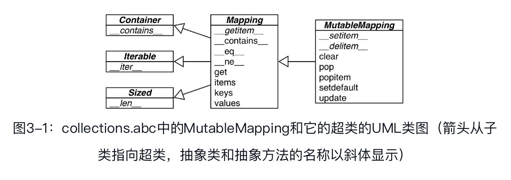
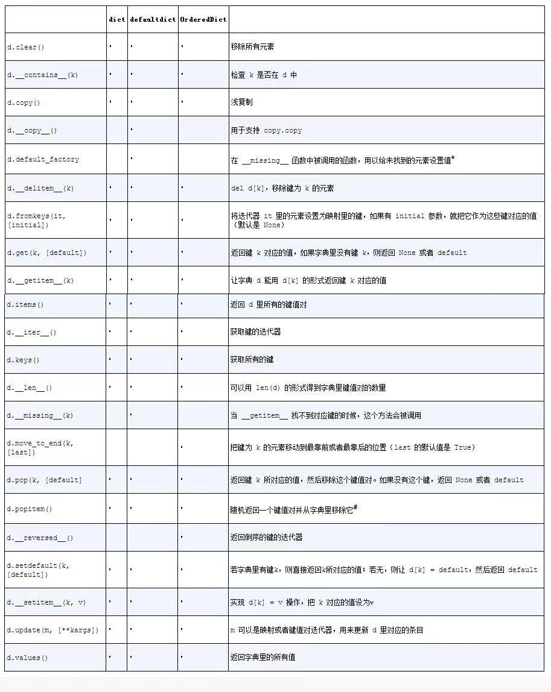
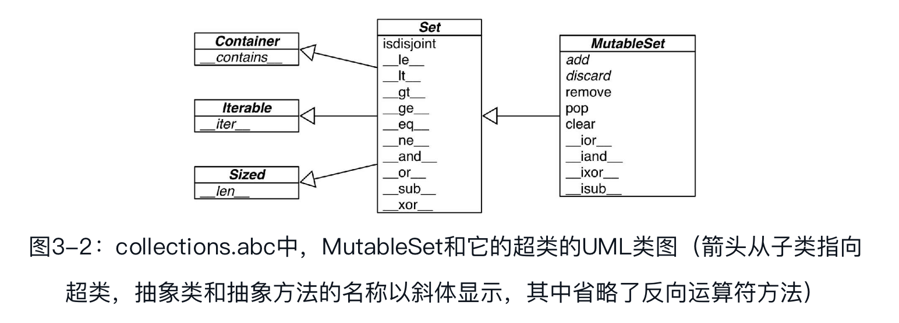
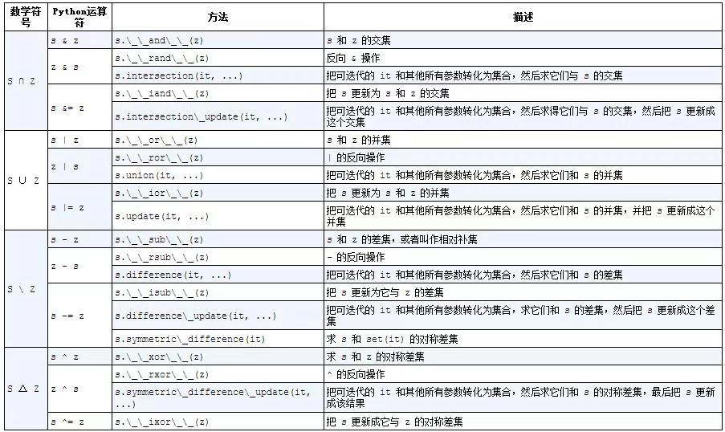
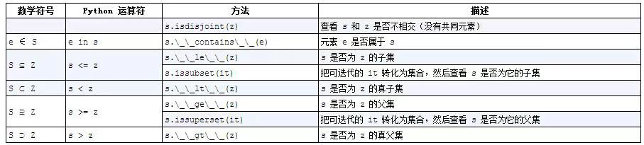
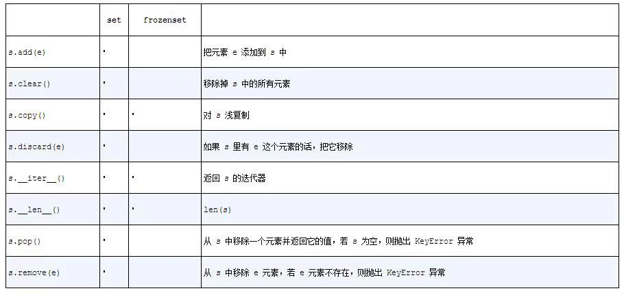

## 字典和集合

dict类型不但在各种程序里广泛使用，它也是Python语言的基石。模块的命名空间、实例的属性和函数的关键字参数中都可以看到字典的身影。跟它有关的内置函数都在`__builtins__.__dict__`模块中。

正是因为字典至关重要，Python对它的实现做了高度优化，而散列表则是字典类型性能出众的根本原因。

### 泛映射类型

collections.abc模块中有Mapping和MutableMapping这两个抽象基类，它们的作用是为dict和其他类似的类型定义形式接口（在Python 2.6到Python 3.2的版本中，这些类隶属于collections模块）。



然而，非抽象映射类型一般不会直接继承这些抽象基类，它们会直接对dict或是collections.UserDict进行扩展。这些抽象基类的主要作用是作为形式化的文档，它们定义了构建一个映射类型所需要的最基本的接口。然后它们还可以跟isinstance一起被用来判定某个数据是不是广义上的映射类型。

```python
>>> my_dict = {}
>>> isinstance(my_dict, collections.Mapping)
True
```

标准库里的所有映射类型都是利用dict来实现的，因此它们有个共同的限制，即只有可散列的数据类型才能用作这些映射里的键。

> 可散列的数据类型：如果一个对象是可散列的，那么在这个对象的生命周期中，它的散列值是不变的，而且这个对象需要实现`__hash__（　）`方法。另外可散列对象还要有`__eq__（　）`方法，这样才能跟其他键做比较。如果两个可散列对象是相等的，那么它们的散列值一定是一样的……

- 原子不可变数据类型（str、bytes和数值类型）都是可散列类型，
- frozenset也是可散列的，因为根据其定义，frozenset里只能容纳可散列类型。
- 元组的话，只有当一个元组包含的所有元素都是可散列类型的情况下，它才是可散列的。

根据这些定义，字典提供了很多种构造方法：

```python
>>> a = dict(one=1, two=2, three=3)
>>> b = {'one': 1, 'two': 2, 'three': 3}
>>> c = dict(zip(['one', 'two', 'three'], [1, 2, 3]))
>>> d = dict([('two', 2), ('one', 1), ('three', 3)])
>>> e = dict({'three': 3, 'one': 1, 'two': 2})
>>> a == b == c == d == e
True
```

### 字典推导

自Python 2.7以来，列表推导和生成器表达式的概念就移植到了字典上，从而有了字典推导。

**字典推导（dictcomp）**可以从任何以键值对作为元素的可迭代对象中构建出字典。

```python
>>> DIAL_CODES = [                ➊
...         (86, 'China'),
...         (91, 'India'),
...         (1, 'United States'),
...         (62, 'Indonesia'),
...         (55, 'Brazil'),
...         (92, 'Pakistan'),
...         (880, 'Bangladesh'),
...         (234, 'Nigeria'),
...         (7, 'Russia'),
...         (81, 'Japan'),
...     ]
>>> country_code = {country: code for code, country in DIAL_CODES}  ➋
>>> country_code
{'China': 86, 'India': 91, 'Bangladesh': 880, 'United States': 1, 'Pakistan': 92, 'Japan': 81, 'Russia': 7, 'Brazil': 55, 'Nigeria': 234, 'Indonesia': 62}
>>> {code: country.upper（ ） for country, code in country_code.items（ ）  ➌
...   if code < 66}
{1: 'UNITED STATES', 55: 'BRAZIL', 62: 'INDONESIA', 7: 'RUSSIA'}
```

### 常见的映射方法

映射类型的方法其实很丰富。

> dict、collections.defaultdict和collections.OrderedDict这三种映射类型的方法列表



- default_factory并不是一个方法，而是一个可调用对象（callable），它的值在defaultdict初始化的时候由用户设定。
- OrderedDict.popitem（　）会移除字典里最先插入的元素（先进先出）；同时这个方法还有一个可选的last参数，若为真，则会移除最后插入的元素（后进先出）。

update方法处理参数m的方式，是典型的“鸭子类型”。函数首先检查m是否有keys方法，如果有，那么update函数就把它当作映射对象来处理。否则，函数会退一步，转而把m当作包含了键值对(key, value)元素的迭代器。Python里大多数映射类型的构造方法都采用了类似的逻辑，因此你既可以用一个映射对象来新建一个映射对象，也可以用包含(key,value)元素的可迭代对象来初始化一个映射对象。

#### 用setdefault处理找不到的键

获取单词的出现情况列表，如果单词不存在，把单词和一个空列表放进映射，然后返回这个空列表，这样就能在不进行第二次查找的情况下更新列表了。

也就是说，这样写：

```python
my_dict.setdefult(key, []).append(new_value)
```

和这样写

```python
if key not in my_dict:
  my_dict[key] = []
my_dict[key].append(new_value)
```

### 映射的弹性键查询

有时候为了方便起见，就算某个键在映射里不存在，我们也希望在通过这个键读取值的时候能得到一个默认值。有两个途径能帮我们达到这个目的，

1. 一个是通过defaultdict这个类型而不是普通的dict，
2. 另一个是给自己定义一个dict的子类，然后在子类中实现`__missing__`方法。

#### defaultdict: 处理找不到键的一个选择

具体而言，在实例化一个defaultdict的时候，需要给构造方法提供一个可调用对象，这个可调用对象会`__getitem__`碰到找不到的键的时候被调用，让`__getitem__`返回某种默认值。

比如，新建了这样一个字典：dd = defaultdict(list)，如果键'new-key'在dd中还不存在的话，表达式dd['new-key']会按照以下的步骤来行事。

- 调用list（　）来建立一个新列表。
- 把这个新列表作为值，'new-key'作为它的键，放到dd中。
- 返回这个列表的引用。

而这个用来生成默认值的可调用对象存放在名为default_factory的实例属性里。

> defaultdict里的default_factory只会在`__getitem__`里被调用，在其他的方法里完全不会发挥作用。比如，dd是个defaultdict，k是个找不到的键， dd[k]这个表达式会调用default_factory创造某个默认值，而dd.get(k)则会返回None。

所有这一切背后的功臣其实是特殊方法`__missing__`。它会在defaultdict遇到找不到的键的时候调用default_factory，而实际上这个特性是所有映射类型都可以选择去支持的。

#### 特殊方法`__missing__`

所有的映射类型在处理找不到的键的时候，都会牵扯到`__missing__`方法。

虽然基类dict并没有定义这个方法，但是dict是知道有这么个东西存在的。如果有一个类继承了dict，然后这个继承类提供了`__missing__`方法，那么在`__getitem__`碰到找不到的键的时候，Python就会自动调用它，而不是抛出一个KeyError异常。

> `__missing__`方法只会被`__getitem__`调用（比如在表达式d[k]中）。提供`__missing__`方法对get或者`__contains__`（in运算符会用到这个方法）这些方法的使用没有影响。


> 像k in my_dict.keys（　）这种操作在Python 3中是很快的，而且即便映射类型对象很庞大也没关系。这是因为dict.keys（　）的返回值是一个“视图”。视图就像一个集合，而且跟字典类似的是，在视图里查找一个元素的速度很快。
>
> Python 2的dict.keys（　）返回的是个列表，因此虽然上面的方法仍然是正确的，它在处理体积大的对象的时候效率不会太高，因为k in my_list操作需要扫描整个列表。

### 字典的变种

**collections.OrderedDict**

这个类型在添加键的时候会保持顺序，因此键的迭代次序总是一致的。OrderedDict的popitem方法默认删除并返回的是字典里的最后一个元素，但是如果像my_odict.popitem(last=False)这样调用它，那么它删除并返回第一个被添加进去的元素。

**collections.ChainMap**

该类型可以容纳数个不同的映射对象，然后在进行键查找操作的时候，这些对象会被当作一个整体被逐个查找，直到键被找到为止。这个功能在给有嵌套作用域的语言做解释器的时候很有用，可以用一个映射对象来代表一个作用域的上下文。

在collections文档介绍ChainMap对象的那一部分里有一些具体的使用示例，其中包含了下面这个Python变量查询规则的代码片段：

```python
import builtins
pylookup = ChainMap(loccals(), globals(), vars(builtins))
```

**collections.Counter**

这个映射类型会给键准备一个整数计数器。每次更新一个键的时候都会增加这个计数器。所以这个类型可以用来给可散列表对象计数，或者是当成多重集来用——多重集合就是集合里的元素可以出现不止一次。Counter实现了+和-运算符用来合并记录，还有像most_common([n])这类很有用的方法。most_common([n])会按照次序返回映射里最常见的n个键和它们的计数。

```python
>>> ct = collections.Counter('abracadabra')
>>> ct
Counter({'a': 5, 'b': 2, 'r': 2, 'c': 1, 'd': 1})
>>> ct.update('aaaaazzz')
>>> ct
Counter({'a': 10, 'z': 3, 'b': 2, 'r': 2, 'c': 1, 'd': 1})
>>> ct.most_common(2)
[('a', 10), ('z', 3)]
```

**collections.UserDict**

这个类其实就是把标准dict用纯Python又实现了一遍。

跟OrderedDict、ChainMap和Counter这些开箱即用的类型不同，UserDict是让用户继承写子类的。

### 子类化UserDict

就创造自定义映射类型来说，以UserDict为基类，总比以普通的dict为基类要来得方便。

更倾向于从UserDict而不是从dict继承的主要原因是，后者有时会在某些方法的实现上走一些捷径，导致我们不得不在它的子类中重写这些方法，但是UserDict就不会带来这些问题。

另外一个值得注意的地方是，UserDict并不是dict的子类，但是UserDict有一个叫作data的属性，是dict的实例，这个属性实际上是UserDict最终存储数据的地方。这样做的好处是UserDict的子类就能在实现`__setitem__`的时候避免不必要的递归，也可以让`__contains__`里的代码更简洁。

因为UserDict继承的是MutableMapping，所以StrKeyDict里剩下的那些映射类型的方法都是从UserDict、MutableMapping和Mapping这些超类继承而来的。特别是最后的Mapping类，它虽然是一个抽象基类（ABC），但它却提供了好几个实用的方法。以下两个方法值得关注。

**MutableMapping.update**

这个方法不但可以为我们所直接利用，它还用在`__init__`里，让构造方法可以利用传入的各种参数（其他映射类型、元素是(key, value)对的可迭代对象和键值参数）来新建实例。因为这个方法在背后是用self[key]=value来添加新值的，所以它其实是在使用我们的`__setitem__`方法。

**Mapping.get**
Python的源码显示，这个方法的实现方式跟StrKeyDict0.get是一模一样的:

```python
def get(self, key, default=None):
  try:
    return self[key]
  except KeyError:
    return default
```


### 不可变映射类型

从Python 3.3开始，types模块中引入了一个封装类名叫MappingProxyType。如果给这个类一个映射，它会返回一个只读的映射视图。虽然是个只读视图，但是它是动态的。这意味着如果对原映射做出了改动，我们通过这个视图可以观察到，但是无法通过这个视图对原映射做出修改。

### 集合论

“集”这个概念在Python中算是比较年轻的，同时它的使用率也比较低。set和它的不可变的姊妹类型frozenset直到Python 2.3才首次以模块的形式出现，然后在Python 2.6中它们升级成为内置类型。

集合中的元素必须是可散列的，set类型本身是不可散列的，但是frozenset可以。因此可以创建一个包含不同frozenset的set。

除了保证唯一性，集合还实现了很多基础的中缀运算符。给定两个集合a和b，a | b返回的是它们的合集，a & b得到的是交集，而a-b得到的是差集。

#### 集合字面量

除空集之外，集合的字面量——{1}、{1, 2}，等等——看起来跟它的数学形式一模一样。如果是空集，那么必须写成set（　）的形式。

> 句法的陷阱: 不要忘了，如果要创建一个空集，你必须用不带任何参数的构造方法set（　）。如果只是写成{}的形式，跟以前一样，你创建的其实是个空字典。

由于Python里没有针对frozenset的特殊字面量句法，我们只能采用构造方法。

#### 集合推导

Python 2.7带来了集合推导（setcomps）和字典推导。

```python
>>> from unicodedata import name
>>> {chr(i) for i in range(32,256) if 'SIGN' in name(chr(i), '')}
{'§', '±', '=', '©', '%', '¤', '£', '¥', '+', 'µ', '÷', '<', '#', '¬', '>', '°', '¢', '®', '¶', '×', '$'}
```

#### 集合的操作



> 表3-2中的中缀运算符需要两侧的被操作对象都是集合类型，但是其他的所有方法则只要求所传入的参数是可迭代对象。

表3-2：集合的数学运算：这些方法或者会生成新集合，或者会在条件允许的情况下就地修改集合




表3-3：集合的比较运算符，返回值是布尔类型



表3-4：集合类型的其他方法


### dict和set的背后

#### 字典中的散列表

散列表其实是一个稀疏数组（总是有空白元素的数组称为稀疏数组）。

在一般的数据结构教材中，散列表里的单元通常叫作表元（bucket）。在dict的散列表当中，每个键值对都占用一个bucket，每个bucket都有两个部分，一个是对键的引用，另一个是对值的引用。因为所有bucket的大小一致，所以可以通过偏移量来读取某个bucket。

因为Python会设法保证大概还有三分之一的bucket是空的，所以在快要达到这个阈值的时候，原有的散列表会被复制到一个更大的空间里面。

如果要把一个对象放入散列表，那么首先要计算这个元素键的散列值。Python中可以用hash（　）方法来做这件事情。

**散列值和相等性**

内置的hash（　）方法可以用于所有的内置类型对象。如果是自定义对象调用hash（　）的话，实际上运行的是自定义的`__hash__`。如果两个对象在比较的时候是相等的，那它们的散列值必须相等，否则散列表就不能正常运行了。例如，如果1==1.0为真，那么hash(1)==hash(1.0)也必须为真，但其实这两个数字（整型和浮点）的内部结构是完全不一样的。

为了让散列值能够胜任散列表索引这一角色，它们必须在索引空间中尽量分散开来。这意味着在最理想的状况下，越是相似但不相等的对象，它们散列值的差别应该越大。

> 从Python 3.3开始，str、bytes和datetime对象的散列值计算过程中多了随机的“加盐”这一步。所加盐值是Python进程内的一个常量，但是每次启动Python解释器都会生成一个不同的盐值。随机盐值的加入是为了防止DOS攻击而采取的一种安全措施。在`__hash__`特殊方法的文档里有相关的详细信息。

**散列表算法**

为了获取my_dict[search_key]背后的值，Python首先会调用hash(search_key)来计算search_key的散列值，把这个值最低的几位数字当作偏移量，在散列表里查找bucket（具体取几位，得看当前散列表的大小）。

若找到的表元是空的，则抛出KeyError异常。若不是空的，则表元里会有一对found_key:found_value。这时候Python会检验search_key==found_key是否为真，如果它们相等的话，就会返回found_value。

如果search_key和found_key不匹配的话，这种情况称为散列冲突。为了解决散列冲突，算法会在散列值中另外再取几位，然后用特殊的方法处理一下，把新得到的数字再当作索引来寻找表元。[插图]若这次找到的表元是空的，则同样抛出KeyError；若非空，或者键匹配，则返回这个值；或者又发现了散列冲突，则重复以上的步骤。

另外在插入新值时，Python可能会按照散列表的拥挤程度来决定是否要重新分配内存为它扩容。如果增加了散列表的大小，那散列值所占的位数和用作索引的位数都会随之增加，这样做的目的是为了减少发生散列冲突的概率。

#### dict的实现及其导致的结果

**键必须是可散列的**

一个可散列的对象必须满足以下要求：

1. 支持hash（　）函数，并且通过`__hash__（　）`方法所得到的散列值是不变的。
2. 支持通过`__eq__（　）`方法来检测相等性。
3. 若a==b为真，则hash(a)==hash(b)也为真。

所有由用户自定义的对象默认都是可散列的，因为它们的散列值由id（　）来获取，而且它们都是不相等的。

> 如果你实现了一个类的`__eq__`方法，并且希望它是可散列的，那么它一定要有个恰当的`__hash__`方法，保证在a==b为真的情况下hash(a)==hash(b)也必定为真。否则就会破坏恒定的散列表算法，导致由这些对象所组成的字典和集合完全失去可靠性。另一方面，如果一个含有自定义的`__eq__`依赖的类处于可变的状态，那就不要在这个类中实现`__hash__`方法，因为它的实例是不可散列的。

**字典在内存上的开销巨大**

由于字典使用了散列表，而散列表又必须是稀疏的，这导致它在空间上的效率低下。

用元组取代字典就能节省空间的原因有两个：其一是避免了散列表所耗费的空间，其二是无需把记录中字段的名字在每个元素里都存一遍。

在用户自定义的类型中，`__slots__`属性可以改变实例属性的存储方式，由dict变成tuple。

**键查询很快**

dict的实现是典型的空间换时间：字典类型有着巨大的内存开销，但它们提供了无视数据量大小的快速访问。

**键的次序取决于添加顺序**

当往dict里添加新键而又发生散列冲突的时候，新键可能会被安排存放到另一个位置。于是下面这种情况就会发生：由dict([(key1, value1), (key2, value2)])和dict([(key2,value2), (key1, value1)])得到的两个字典，在进行比较的时候，它们是相等的；但是如果在key1和key2被添加到字典里的过程中有冲突发生的话，这两个键出现在字典里的顺序是不一样的。

**往字典里添加新键可能会改变已有键的顺序**

无论何时往字典里添加新的键，Python解释器都可能做出为字典扩容的决定。扩容导致的结果就是要新建一个更大的散列表，并把字典里已有的元素添加到新表里。这个过程中可能会发生新的散列冲突，导致新散列表中键的次序变化。

要注意的是，上面提到的这些变化是否会发生以及如何发生，都依赖于字典背后的具体实现，因此你不能很自信地说自己知道背后发生了什么。如果你在迭代一个字典的所有键的过程中同时对字典进行修改，那么这个循环很有可能会跳过一些键——甚至是跳过那些字典中已经有的键。

由此可知，不要对字典同时进行迭代和修改。如果想扫描并修改一个字典，最好分成两步来进行：首先对字典迭代，以得出需要添加的内容，把这些内容放在一个新字典里；迭代结束之后再对原有字典进行更新。

> 在Python 3中，.keys（　）、.items（　）和.values（　）方法返回的都是字典视图。也就是说，这些方法返回的值更像集合，而不是像Python 2那样返回列表。视图还有动态的特性，它们可以实时反馈字典的变化。

#### set的实现以及导致的结果

set和frozenset的实现也依赖散列表，但在它们的散列表里存放的只有元素的引用（就像在字典里只存放键而没有相应的值）。

字典和散列表的几个特点，对集合来说几乎都是适用的：

1. 集合里的元素必须是可散列的。
2. 集合很消耗内存。
3. 可以很高效地判断元素是否存在于某个集合。
4. 元素的次序取决于被添加到集合里的次序
5. 往集合里添加元素，可能会改变集合里已有元素的次序。

