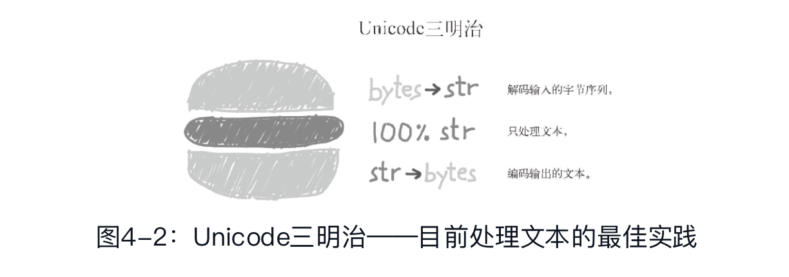

## 文本和字节序列

### 字符问题

从Python 3的str对象中获取的元素是Unicode字符，这相当于从Python 2的unicode对象中获取的元素，而不是从Python 2的str对象中获取的原始字节序列。

Unicode标准把字符的标识和具体的字节表述进行了如下的明确区分。

- 字符的标识，即码位，是0~1114111的数字（十进制），在Unicode标准中以4~6个十六进制数字表示，而且加前缀“U+”。例如，字母A的码位是U+0041。
- 字符的具体表述取决于所用的编码。编码是在码位和字节序列之间转换时使用的算法。举个例子，欧元符号（U+20AC）在UTF-8编码中是三个字节——\xe2\x82\xac，而在UTF-16LE中编码成两个字节：\xac\x20。

把码位转换成字节序列的过程是编码；把字节序列转换成码位的过程是解码。

编码和解码：

 ```python3
 >>> s = 'café'
 >>> len(s)  # ➊
 4
 >>> b  # ➋
 >>> b
 b'caf\xc3\xa9'  # ➌
 >>> len(b)  # ➍
 5
 >>> b.decode('utf8')  # ➎
 'café
 ```

> 可以把字节序列想成晦涩难懂的机器磁芯转储，把Unicode字符串想成“人类可读”的文本。那么，把字节序列变成人类可读的文本字符串就是解码，而把字符串变成用于存储或传输的字节序列就是编码。

虽然Python 3的str类型基本相当于Python 2的unicode类型，但是Python 3的bytes类型却不是把str类型换个名称那么简单，而且还有关系紧密的bytearray类型。

### 字节概要

Python内置了两种基本的二进制序列类型：Python3引入的不可变bytes类型和Python 2.6添加的可变bytearray类型。（Python 2.6也引入了bytes类型，但那只不过是str类型的别名，与Python 3的bytes类型不同。）

bytes或bytearray对象的各个元素是介于0~255（含）之间的整数。

```python3
>>> cafe = bytes('café', encoding='utf_8') ➊
>>> cafe
b'caf\xc3\xa9'
>>> cafe[0] ➋
99
>>> cafe[:1] ➌
b'c'
>>> cafe_arr = bytearray(cafe)
>>> cafe_arr ➍
bytearray(b'caf\xc3\xa9')
>>> cafe_arr[-1:] ➎
bytearray(b'\xa9')
```

虽然二进制序列其实是整数序列，但是它们的字面量表示法表明其中有ASCII文本。因此，各个字节的值可能会使用下列三种不同的方式显示。

- 可打印的ASCII范围内的字节（从空格到~），使用ASCII字符本身。
- 制表符、换行符、回车符和\对应的字节，使用转义序列\t、\n、\r和\\。
- 其他字节的值，使用十六进制转义序列（例如，\x00是空字节）。

二进制序列有个类方法是str没有的，名为fromhex，它的作用是解析十六进制数字对（数字对之间的空格是可选的），构建二进制序列：.

```python
>>> bytearray.fromhex('31 4b ce a9')
bytearray(b'1K\xce\xa9')
```

构建bytes或bytearray实例还可以调用各自的构造方法，传入下述参数:

- 一个str对象和一个encoding关键字参数。
- 一个可迭代对象，提供0~255之间的数值。
- 一个实现了缓冲协议的对象（如bytes、bytearray、memoryview、array.array）；此时，把源对象中的字节序列复制到新建的二进制序列中。

使用缓冲类对象构建二进制序列是一种低层操作，可能涉及类型转换。

#### 结构体和内存视图

struct模块提供了一些函数，把打包的字节序列转换成不同类型字段组成的元组，还有一些函数用于执行反向转换，把元组转换成打包的字节序列。struct模块能处理bytes、bytearray和memoryview对象。

memoryview类不是用于创建或存储字节序列的，而是共享内存，让你访问其他二进制序列、打包的数组和缓冲中的数据切片。

注意，memoryview对象的切片是一个新memoryview对象，而且不会复制字节序列。

### 基本的编解码器

Python自带了超过100种编解码器（codec,encoder/decoder），用于在文本和字节之间相互转换。每个编解码器都有一个名称，如'utf_8'，而且经常有几个别名，如'utf8'、'utf-8'和'U8'。这些名称可以传给open（　）、str.encode（　）、bytes.decode（　）等函数的encoding参数。

一些典型编码，介绍如下：

- latin1（即iso8859_1）：一种重要的编码，是其他编码的基础，例如cp1252和Unicode（注意，latin1与cp1252的字节值是一样的，甚至连码位也相同）。
- cp1252：Microsoft制定的latin1超集，添加了有用的符号，例如弯引号和€（欧元）；有些Windows应用把它称为“ANSI”，但它并不是ANSI标准。
- cp437：IBM PC最初的字符集，包含框图符号。与后来出现的latin1不兼容。
- gb2312：用于编码简体中文的陈旧标准；这是亚洲语言中使用较广泛的多字节编码之一。
- utf-8：目前Web中最常见的8位编码；与ASCII兼容（纯ASCII文本是有效的UTF-8文本）。
- utf-16le：UTF-16的16位编码方案的一种形式；所有UTF-16支持通过转义序列（称为“代理对”，surrogate pair）表示超过U+FFFF的码位。

### 了解编解码问题

虽然有个一般性的UnicodeError异常，但是报告错误时几乎都会指明具体的异常：

- UnicodeEncodeError（把字符串转换成二进制序列时）
- UnicodeDecodeError（把二进制序列转换成字符串时）。
- 如果源码的编码与预期不符，加载Python模块时还可能抛出SyntaxError。

#### 处理UnicodeEncodeError

多数非UTF编解码器只能处理Unicode字符的一小部分子集。把文本转换成字节序列时，如果目标编码中没有定义某个字符，那就会抛出UnicodeEncodeError异常，除非把errors参数传给编码方法或函数，对错误进行特殊处理。

#### 处理UnicodeDecodeError

不是每一个字节都包含有效的ASCII字符，也不是每一个字符序列都是有效的UTF-8或UTF-16。因此，把二进制序列转换成文本时，如果假设是这两个编码中的一个，遇到无法转换的字节序列时会抛出UnicodeDecodeError。

#### 使用预期之外的编码加载模块时抛出的SyntaxError

Python 3默认使用UTF-8编码源码，Python 2（从2.5开始）则默认使用ASCII。如果加载的.py模块中包含UTF-8之外的数据，而且没有声明编码，会得到类似下面的消息：

```python
SyntaxError: Non-UTF-8 code starting with '\xe1' in file ola.py on line
  1, but no encoding declared; see http://python.org/dev/peps/pep-0263/
  for details
```

为了修正这个问题，可以在文件顶部添加一个神奇的coding注释，

```python
# -*- coding: utf-8 -*
```

**源码中能不能使用非ASCII名称**

Python 3允许在源码中使用非ASCII标识符。

#### 如何找出字节序列的编码

统一字符编码侦测包Chardet能识别所支持的30种编码。Chardet是一个Python库，可以在程序中使用，不过它也提供了命令行工具chardetect。

二进制序列编码文本通常不会明确指明自己的编码，但是UTF格式可以在文本内容的开头添加一个字节序标记。

#### BOM：有用的鬼符

UTF-16编码的序列开头有几个额外的字节

```python
>>> u16 = 'El Niño'.encode('utf_16')
>>> u16
b'\xff\xfeE\x00l\x00 \x00N\x00i\x00\xf1\x00o\x00'
```

b'\xff\xfe'。这是BOM，即字节序标记（byte-ordermark），指明编码时使用Intel CPU的小字节序。

在小字节序设备中，各个码位的最低有效字节在前面：字母'E'的码位是U+0045（十进制数69），在字节偏移的第2位和第3位编码为69和0。在大字节序CPU中，编码顺序是相反的；'E'编码为0和69。

为了避免混淆，UTF-16编码在要编码的文本前面加上特殊的不可见字符ZERO WIDTH NO-BREAK SPACE（U+FEFF）。在小字节序系统中，这个字符编码为b'\xff\xfe'（十进制数255,254）。因为按照设计，U+FFFE字符不存在，在小字节序编码中，字节序列b'\xff\xfe'必定是ZERO WIDTH NO-BREAKSPACE，所以编解码器知道该用哪个字节序。

UTF-16有两个变种：UTF-16LE，显式指明使用小字节序；UTF-16BE，显式指明使用大字节序。如果使用这两个变种，不会生成BOM。

如果有BOM，UTF-16编解码器会将其过滤掉，为你提供没有前导ZERO WIDTH NO-BREAK SPACE字符的真正文本。根据标准，如果文件使用UTF-16编码，而且没有BOM，那么应该假定它使用的是UTF-16BE（大字节序）编码。然而，Intel x86架构用的是小字节序，因此有很多文件用的是不带BOM的小字节序UTF-16编码。

与字节序有关的问题只对一个字（word）占多个字节的编码（如UTF-16和UTF-32）有影响。UTF-8的一大优势是，不管设备使用哪种字节序，生成的字节序列始终一致，因此不需要BOM。

### 处理文本文件

处理文本的最佳实践是“Unicode三明治”。



在Python 3中能轻松地采纳Unicode三明治的建议，因为内置的open函数会在读取文件时做必要的解码，以文本模式写入文件时还会做必要的编码，所以调用my_file.read（　）方法得到的以及传给my_file.write(text)方法的都是字符串对象。

> 需要在多台设备中或多种场合下运行的代码，一定不能依赖默认编码。打开文件时始终应该明确传入encoding=参数，因为不同的设备使用的默认编码可能不同，有时隔一天也会发生变化。

#### 编码默认值：一团糟

有几个设置对Python I/O的编码默认值有影响：

```python
import sys, locale
expressions = """
        locale.getpreferredencoding()
        type(my_file)
        my_file.encoding
        sys.stdout.isatty()
        sys.stdout.encoding
        sys.stdin.isatty()
        sys.stdin.encoding
        sys.stderr.isatty()
        sys.stderr.encoding
        sys.getdefaultencoding()
        sys.getfilesystemencoding()
    """
my_file = open('dummy', 'w')
for expression in expressions.split():
    value = eval(expression)
    print(expression.rjust(30), '->', repr(value))
```

在GNU/Linux（Ubuntu 14.04）和OS X（Mavericks10.9）中的输出一样，表明这些系统中始终使用UTF-8：

```python
 locale.getpreferredencoding() -> 'UTF-8'
                 type(my_file) -> <class '_io.TextIOWrapper'>
              my_file.encoding -> 'UTF-8'
           sys.stdout.isatty() -> True
           sys.stdout.encoding -> 'utf-8'
            sys.stdin.isatty() -> True
            sys.stdin.encoding -> 'utf-8'
           sys.stderr.isatty() -> True
           sys.stderr.encoding -> 'utf-8'
      sys.getdefaultencoding() -> 'utf-8'
   sys.getfilesystemencoding() -> 'utf-8'
```

然而，在Windows中的输出有所不同.

```python
Z:\>python default_encodings.py  ➋
 locale.getpreferredencoding()-> 'cp1252'  ➌
                 type(my_file)-> <class '_io.TextIOWrapper'>
              my_file.encoding-> 'cp1252'  ➍
           sys.stdout.isatty()-> True      ➎
           sys.stdout.encoding-> 'cp850'   ➏
            sys.stdin.isatty()-> True
            sys.stdin.encoding-> 'cp850'
           sys.stderr.isatty()-> True
           sys.stderr.encoding-> 'cp850'
    sys.getdefaultencoding()-> 'utf-8'
 sys.getfilesystemencoding()-> 'mbcs'
```

在示例中有4种不同的编码。

- 如果打开文件时没有指定encoding参数，默认值由locale.getpreferredencoding（　）提供
- 如果设定了PYTHONIOENCODING环境变量，sys.stdout/stdin/stderr的编码使用设定的值；否则，继承自所在的控制台；如果输入/输出重定向到文件，则由locale.getpreferredencoding（　）定义。
- Python在二进制数据和字符串之间转换时，内部使用sys.getdefaultencoding（　）获得的编码；Python 3很少如此，但仍有发生。
- sys.getfilesystemencoding（　）用于编解码文件名（不是文件内容）。把字符串参数作为文件名传给open（　）函数时就会使用它；如果传入的文件名参数是字节序列，那就不经改动直接传给OS API。

> 在GNU/Linux和OS X中，这些编码的默认值都是UTF-8，而且多年来都是如此，因此I/O能处理所有Unicode字符。在Windows中，不仅同一个系统中使用不同的编码，还有只支持ASCII和127个额外的字符的代码页（如'cp850'或'cp1252'），而且不同的代码页之间增加的字符也有所不同。因此，若不多加小心，Windows用户更容易遇到编码问题。

综上，locale.getpreferredencoding（　）返回的编码是最重要的：这是打开文件的默认编码，也是重定向到文件的sys.stdout/stdin/stderr的默认编码。

关于编码默认值的最佳建议是：别依赖默认值。

### 为了正确比较而规范化Unicode字符串

因为Unicode有组合字符（变音符号和附加到前一个字符上的记号，打印时作为一个整体），所以字符串比较起来很复杂。

在Unicode标准中，'é'和'e\u0301'这样的序列叫“标准等价物”（canonical equivalent），应用程序应该把它们视作相同的字符。但是，Python看到的是不同的码位序列，因此判定二者不相等。

这个问题的解决方案是使用unicodedata.normalize函数提供的Unicode规范化。这个函数的第一个参数是这4个字符串中的一个：'NFC'、'NFD'、'NFKC'和'NFKD'。

NFC（Normalization Form C）使用最少的码位构成等价的字符串，而NFD把组合字符分解成基字符和单独的组合字符。这两种规范化方式都能让比较行为符合预期：

```python
>>> from unicodedata import normalize
>>> s1 = 'café'  #把"e"和重音符组合在一起
>>> s2 = 'cafe\u0301'  #分解成"e"和重音符
>>> len(s1), len(s2)
(4, 5)
>>> len(normalize('NFC', s1)), len(normalize('NFC', s2))
(4, 4)
>>> len(normalize('NFD', s1)), len(normalize('NFD', s2))
(5, 5)
>>> normalize('NFC', s1) == normalize('NFC', s2)
True
>>> normalize('NFD', s1) == normalize('NFD', s2)
True
```

西方键盘通常能输出组合字符，因此用户输入的文本默认是NFC形式。不过，安全起见，保存文本之前，最好使用normalize('NFC', user_text)清洗字符串。NFC也是W3C的“Character Model for the World Wide Web: String Matchingand Searching”规范推荐的规范化形式。

在另外两个规范化形式（NFKC和NFKD）的首字母缩略词中，字母K表示“compatibility”（兼容性）。这两种是较严格的规范化形式，对“兼容字符”有影响。虽然Unicode的目标是为各个字符提供“规范的”码位，但是为了兼容现有的标准，有些字符会出现多次。

在NFKC和NFKD形式中，各个兼容字符会被替换成一个或多个“兼容分解”字符，即便这样有些格式损失，但仍是“首选”表述——理想情况下，格式化是外部标记的职责，不应该由Unicode处理。

> 使用NFKC和NFKD规范化形式时要小心，而且只能在特殊情况中使用，例如搜索和索引，而不能用于持久存储，因为这两种转换会导致数据损失。

#### 大小写折叠

大小写折叠其实就是把所有文本变成小写，再做些其他转换。这个功能由str.casefold（　）方法（Python 3.3新增）支持。

自Python 3.4起，str.casefold（　）和str.lower（　）得到不同结果的有116个码位。Unicode 6.3命名了110122个字符，这只占0.11%。

#### 规范化文本匹配实用函数

对大多数应用来说，NFC是最好的规范化形式。不区分大小写的比较应该使用str.casefold（　）。

如果要处理多语言文本，工具箱中应该有nfc_equal和fold_equal函数。

#### 极端”规范化“：去掉变音符号

示例：去掉全部组合记号的函数

```python
import unicodedata
import string
def shave_marks(txt):
    """去掉全部变音符号"""
    norm_txt = unicodedata.normalize('NFD', txt)  ➊
    shaved = ''.join(c for c in norm_txt
                     if not unicodedata.combining(c))  ➋
    return unicodedata.normalize('NFC', shaved)  ➌
```

1. 把所有字符分解成基字符和组合记号。
2. 过滤掉所有组合记号。
3.  重组所有字符。

### Unicode文本排序

Python比较任何类型的序列时，会一一比较序列里的各个元素。对字符串来说，比较的是码位。可是在比较非ASCII字符时，得到的结果不尽如人意。

在Python中，非ASCII文本的标准排序方式是使用locale.strxfrm函数，根据locale模块的文档，这个函数会“把字符串转换成适合所在区域进行比较的形式”。

使用locale.strxfrm函数之前，必须先为应用设定合适的区域设置，还要祈祷操作系统支持这项设置。使用locale.strxfrm函数做排序键之前，要调用setlocale(LC_COLLATE, «your_locale»)。

标准库提供的国际化排序方案可用，但是似乎只支持GNU/Linux（可能也支持Windows，但你得是专家）。即便如此，还要依赖区域设置，而这会为部署带来问题。

幸好，有个较为简单的方案：PyPI中的PyUCA库。

#### 使用Unicode排序算法排序

PyUCA库，是Unicode排序算法（Unicode Collation Algorithm，UCA）的纯Python实现。

> 使用pyuca.Collator.sort_key方法

```python
>> import pyuca
>>> coll = pyuca.Collator（ ）
>>> fruits = ['caju', 'atemoia', 'cajá', 'açaí', 'acerola']
>>> sorted_fruits = sorted(fruits, key=coll.sort_key)
>>> sorted_fruits
['açaí', 'acerola', 'atemoia', 'cajá', 'caju']
```

在GNU/Linux、OS X和Windows中做过测试。目前，PyUCA只支持Python 3.x。

PyUCA没有考虑区域设置。如果想定制排序方式，可以把自定义的排序表路径传给Collator（　）构造方法。PyUCA默认使用项目自带的allkeys.txt，这就是Unicode 6.3.0的“DefaultUnicode Collation Element Table”的副本。

### Unicode数据库

Unicode标准提供了一个完整的数据库（许多格式化的文本文件），不仅包括码位与字符名称之间的映射，还有各个字符的元数据，以及字符之间的关系。

例如，Unicode数据库记录了字符是否可以打印、是不是字母、是不是数字，或者是不是其他数值符号。字符串的isidentifier、isprintable、isdecimal和isnumeric等方法就是靠这些信息作判断的。 str.casefold方法也用到了Unicode表中的信息。

unicodedata模块中有几个函数用于获取字符的元数据。例如，字符在标准中的官方名称是不是组合字符（如结合波形符构成的变音符号等），以及符号对应的人类可读数值（不是码位）。

> Unicode数据库中数值字符的元数据示例（各个标号说明输出中的各列）

```python
import unicodedata
import re
re_digit = re.compile(r'\d')
sample = '1\xbc\xb2\u0969\u136b\u216b\u2466\u2480\u3285'
for char in sample:
    print('U+%04x'%ord(char),                        ➊
          char.center(6),                              ➋
          're_dig' if re_digit.match(char) else '-',   ➌
          'isdig' if char.isdigit（ ） else '-',          ➍
          'isnum' if char.isnumeric（ ） else '-',        ➎
          format(unicodedata.numeric(char), '5.2f'),   ➏
          unicodedata.name(char),                      ➐
          sep='\t')
```


```python3
U+0031	  1   	re_dig	isdig	isnum	 1.00	DIGIT ONE
U+00bc	  ¼   	-	-	isnum	 0.25	VULGAR FRACTION ONE QUARTER
U+00b2	  ²   	-	isdig	isnum	 2.00	SUPERSCRIPT TWO
U+0969	  ३   	re_dig	isdig	isnum	 3.00	DEVANAGARI DIGIT THREE
U+136b	  ፫   	-	isdig	isnum	 3.00	ETHIOPIC DIGIT THREE
U+216b	  Ⅻ   	-	-	isnum	12.00	ROMAN NUMERAL TWELVE
U+2466	  ⑦   	-	isdig	isnum	 7.00	CIRCLED DIGIT SEVEN
U+2480	  ⒀   	-	-	isnum	13.00	PARENTHESIZED NUMBER THIRTEEN
```

re模块对Unicode的支持并不充分。PyPI中有个新开发的regex模块，它的最终目的是取代re模块，以提供更好的Unicode支持。

### 支持字符串和字节序列的双模式API

#### 正则表达式中的字符串和字节序列

如果使用字节序列构建正则表达式，\d和\w等模式只能匹配ASCII字符；相比之下，如果是字符串模式，就能匹配ASCII之外的Unicode数字或字母。

```python3
import re
re_numbers_str = re.compile(r'\d+')     
re_words_str = re.compile(r'\w+')
re_numbers_bytes = re.compile(rb'\d+')  
re_words_bytes = re.compile(rb'\w+')
text_str = ("Ramanujan saw \u0be7\u0bed\u0be8\u0bef"  
            " as 1729 = 1³+12³ = 9³+10³.")        
text_bytes = text_str.encode('utf_8')  
print('Text', repr(text_str), sep='\n  ')
print('Numbers')
print('  str  :', re_numbers_str.findall(text_str))      
print('  bytes:', re_numbers_bytes.findall(text_bytes))  
print('Words')
print('  str  :', re_words_str.findall(text_str))        
print('  bytes:', re_words_bytes.findall(text_bytes))    
```

```python
Text
  'Ramanujan saw ௧௭௨௯ as 1729 = 1³+12³ = 9³+10³.'
Numbers
  str  : ['௧௭௨௯', '1729', '1', '12', '9', '10']
  bytes: [b'1729', b'1', b'12', b'9', b'10']
Words
  str  : ['Ramanujan', 'saw', '௧௭௨௯', 'as', '1729', '1³', '12³', '9³', '10³']
  bytes: [b'Ramanujan', b'saw', b'as', b'1729', b'1', b'12', b'9', b'10']
```

字符串正则表达式有个re.ASCII标志，它让\w、\W、\b、\B、\d、\D、\s和\S只匹配ASCII字符。详情参阅re模块的文档。

####  os函数中的字符串和字节序列

GNU/Linux内核不理解Unicode，因此你可能发现了，对任何合理的编码方案来说，在文件名中使用字节序列都是无效的，无法解码成字符串。在不同操作系统中使用各种客户端的文件服务器，在遇到这个问题时尤其容易出错。

为了规避这个问题，os模块中的所有函数、文件名或路径名参数既能使用字符串，也能使用字节序列。如果这样的函数使用字符串参数调用，该参数会使用sys.getfilesystemencoding（　）得到的编解码器自动编码，然后操作系统会使用相同的编解码器解码。

```python3
>>> import os
>>> os.listdir('.')
['Effective Python.md', '流畅的python']
>>> os.listdir(b'.')
[b'Effective Python.md', b'\xe6\xb5\x81\xe7\x95\x85\xe7\x9a\x84python']
```

为了便于手动处理字符串或字节序列形式的文件名或路径名，os模块提供了特殊的编码和解码函数。

- fsencode(filename)如果filename是str类型（此外还可能是bytes类型），使用sys.getfilesystemencoding（　）返回的编解码器把filename编码成字节序列；否则，返回未经修改的filename字节序列。
- fsdecode(filename)如果filename是bytes类型（此外还可能是str类型），使用sys.getfilesystemencoding（　）返回的编解码器把filename解码成字符串；否则，返回未经修改的filename字符串。