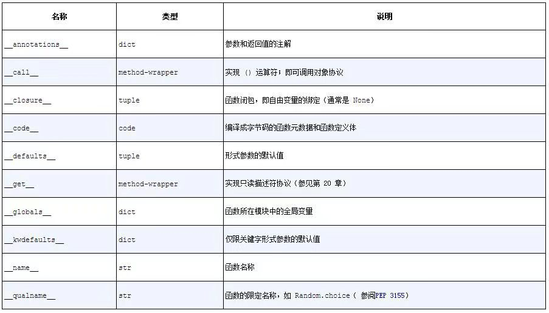

## 一等函数

在Python中，函数是一等对象。编程语言理论家把“一等对象”定义为满足下述条件的程序实体：

- 在运行时创建
- 能赋值给变量或数据结构中的元素
- 能作为参数传给函数
- 能作为函数的返回结果

### 把函数视作对象

这里我们创建了一个函数，然后调用它，读取它的`__doc__`属性，并且确定函数对象本身是function类的实例。

```python
>>> def factorial(n):  ➊
...     '''returns n!'''
...     return 1 if n < 2 else n * factorial(n-1)
...
>>> factorial(42)
1405006117752879898543142606244511569936384000000000
>>> factorial.__doc__  ➋
'returns n!'
>>> type(factorial)  ➌
<class 'function'>
```

`__doc__`属性用于生成对象的帮助文本。在Python交互式控制台中，help(func)命令会输出函数说明。

我们可以把factorial函数赋值给变量fact，然后通过变量名调用。我们还能把它作为参数传给map函数。map函数返回一个可迭代对象，里面的元素是把第一个参数（一个函数）应用到第二个参数（一个可迭代对象，这里是range(11)）中各个元素上得到的结果。

```python
>>> fact = factorial
>>> fact
<function factorial at 0x...>
>>> fact(5)
120
>>> map(factorial, range(11))
<map object at 0x...>
>>> list(map(fact, range(11)))
[1, 1, 2, 6, 24, 120, 720, 5040, 40320, 362880, 3628800]
```

### 高阶函数

接受函数为参数，或者把函数作为结果返回的函数是高阶函数（higher-order function）。map函数就是一例。内置函数sorted也是：可选的key参数用于提供一个函数，它会应用到各个元素上进行排序。

#### map、filter和reduce的现代替代品

函数式语言通常会提供map、filter和reduce三个高阶函数（有时使用不同的名称）。在Python 3中，map和filter还是内置函数，但是由于引入了列表推导和生成器表达式，它们变得没那么重要了。列表推导或生成器表达式具有map和filter两个函数的功能，而且更易于阅读。

```python
>>> list(map(fact, range(6)))  ➊
[1, 1, 2, 6, 24, 120]
>>> [fact(n) for n in range(6)]  ➋
[1, 1, 2, 6, 24, 120]
>>> list(map(factorial, filter(lambda n: n%2, range(6))))  ➌
[1, 6, 120]
>>> [factorial(n) for n in range(6) if n%2]  ➍
[1, 6, 120]
>>>
```

在Python 3中，map和filter返回生成器（一种迭代器），因此现在它们的直接替代品是生成器表达式（在Python 2中，这两个函数返回列表，因此最接近的替代品是列表推导）。

在Python 2中，reduce是内置函数，但是在Python 3中放到functools模块里了。这个函数最常用于求和，自2003年发布的Python 2.3开始，最好使用内置的sum函数。在可读性和性能方面，这是一项重大改善。

```python
>> from functools import reduce  ➊
>>> from operator import add ➋
>>> reduce(add, range(100))  ➌
4950
>>> sum(range(100))  ➍
4950
>>>
```

sum和reduce的通用思想是把某个操作连续应用到序列的元素上，累计之前的结果，把一系列值归约成一个值。

all和any也是内置的归约函数。

- all(iterable)：如果iterable的每个元素都是真值，返回True；all([])返回True。
- any(iterable)：只要iterable中有元素是真值，就返回True；any([])返回False。

### 匿名函数

lambda关键字在Python表达式内创建匿名函数。

Python简单的句法限制了lambda函数的定义体只能使用纯表达式。换句话说，lambda函数的定义体中不能赋值，也不能使用while和try等Python语句。

除了作为参数传给高阶函数之外，Python很少使用匿名函数。由于句法上的限制，非平凡的lambda表达式要么难以阅读，要么无法写出。

### 可调用对象

除了用户定义的函数，调用运算符（即（　））还可以应用到其他对象上。如果想判断对象能否调用，可以使用内置的callable（　）函数。

Python数据模型文档列出了7种可调用对象：

1. 用户定义的函数：使用def语句或lambda表达式创建。
2. 内置函数：使用C语言（CPython）实现的函数，如len或time.strftime。
3. 内置方法：使用C语言实现的方法，如dict.get。
4. 方法：在类的定义体中定义的函数。
5. 类：调用类时会运行类的`__new__`方法创建一个实例，然后运行`__init__`方法，初始化实例，最后把实例返回给调用方。因为Python没有new运算符，所以调用类相当于调用函数。（通常，调用类会创建那个类的实例，不过覆盖`__new__`方法的话，也可能出现其他行为。）
6. 类的实例：如果类定义了`__call__`方法，那么它的实例可以作为函数调用。
7. 生成器函数: 使用yield关键字的函数或方法。调用生成器函数返回的是生成器对象。

> Python中有各种各样可调用的类型，因此判断对象能否调用，最安全的方法是使用内置的callable（　）函数：

```python
>>> abs, str, 13
(<built-in function abs>, <class 'str'>, 13)
>>> [callable(obj) for obj in (abs, str, 13)]
[True, True, False]
```

### 用户定义的可调用类型

不仅Python函数是真正的对象，任何Python对象都可以表现得像函数。为此，只需实现实例方法`__call__`。

```python
import random
class BingoCage:
def __init__(self, items):
    self._items = list(items)  ➊
    random.shuffle(self._items)  ➋
def pick(self):  ➌
    try:
        return self._items.pop（ ）
    except IndexError:
        raise LookupError('pick from empty BingoCage')  ➍
def __call__(self):  ➎
    return self.pick（ ）

>>> bingo = BingoCage(range(3))
>>> bingo.pick（ ）
1
>>> bingo（ ）
0
>>> callable(bingo)
True
```

实现`__call__`方法的类是创建函数类对象的简便方式，此时必须在内部维护一个状态，让它在调用之间可用，例如BingoCage中的剩余元素。装饰器就是这样。装饰器必须是函数，而且有时要在多次调用之间“记住”某些事。

创建保有内部状态的函数，还有一种截然不同的方式——使用闭包。

###  函数内省

除了`__doc__`，函数对象还有很多属性。使用dir函数可以探知factorial具有下述属性：

```python
>>> dir(factorial)
['__annotations__', '__builtins__', '__call__', '__class__', '__closure__', '__code__', '__defaults__', '__delattr__', '__dict__', '__dir__', '__doc__', '__eq__', '__format__', '__ge__', '__get__', '__getattribute__', '__globals__', '__gt__', '__hash__', '__init__', '__init_subclass__', '__kwdefaults__', '__le__', '__lt__', '__module__', '__name__', '__ne__', '__new__', '__qualname__', '__reduce__', '__reduce_ex__', '__repr__', '__setattr__', '__sizeof__', '__str__', '__subclasshook__']
```

与用户定义的常规类一样，函数使用`__dict__`属性存储赋予它的用户属性。

列出常规对象没有而函数有的属性:

```python
>>> class C:
...     pass
...
>>> obj=C()
>>> def func():
...     pass
...
>>> sorted(set(dir(func))-set(dir(obj)))
['__annotations__', '__builtins__', '__call__', '__closure__', '__code__', '__defaults__', '__get__', '__globals__', '__kwdefaults__', '__name__', '__qualname__']
```



### 从定位参数到仅限关键字参数

Python最好的特性之一是提供了极为灵活的参数处理机制，而且Python 3进一步提供了仅限关键字参数（keyword-onlyargument）。与之密切相关的是，调用函数时使用*和**“展开”可迭代对象，映射到单个参数。

仅限关键字参数是Python 3新增的特性。它一定不会捕获未命名的定位参数。定义函数时若想指定仅限关键字参数，要把它们放到前面有`*`的参数后面。如果不想支持数量不定的定位参数，但是想支持仅限关键字参数，在签名中放一个`*`，如下所示：

```python
>>> def f(a, *, b):
...     return a, b
...
>>> f(1, b=2)
(1, 2)
```

仅限关键字参数不一定要有默认值，可以像上例中b那样，强制必须传入实参。

### 获取关于参数的信息

函数对象有个`__defaults__`属性，它的值是一个元组，里面保存着定位参数和关键字参数的默认值。仅限关键字参数的默认值在`__kwdefaults__`属性中。然而，参数的名称在`__code__`属性中，它的值是一个code对象引用，自身也有很多属性。

参数名称在`__code__.co_varnames`中，不过里面还有函数定义体中创建的局部变量。因此，参数名称是前N个字符串，N的值由`__code__.co_argcount`确定。

参数的默认值只能通过它们在`__defaults__`元组中的位置确定，因此要从后向前扫描才能把参数和默认值对应起来。

幸好，有更好的方式——使用inspect模块。

```python
def clip(text, max_len=80):
  pass

>> from inspect import signature
>>> sig = signature(clip)
>>> sig  # doctest:+ELLIPSIS
<inspect.Signature object at 0x...>
>>> str(sig)
'(text, max_len=80)'
>>> for name, param in sig.parameters.items（ ）:
...     print(param.kind, ':', name, '=', param.default)
...
POSITIONAL_OR_KEYWORD : text = <class 'inspect._empty'>
POSITIONAL_OR_KEYWORD : max_len = 80
```

inspect.signature函数返回一个inspect.Signature对象，它有一个parameters属性，这是一个有序映射，把参数名和inspect.Parameter对象对应起来。各个Parameter属性也有自己的属性，例如name、default和kind。特殊的inspect._empty值表示没有默认值，考虑到None是有效的默认值（也经常这么做），而且这么做是合理的。

kind属性的值是_ParameterKind类中的5个值之一，列举如下:

- POSITIONAL_OR_KEYWORD: 可以通过定位参数和关键字参数传入的形参（多数Python函数的参数属于此类）。
- VAR_POSITIONAL: 定位参数元组。
- VAR_KEYWORD: 关键字参数字典。
- KEYWORD_ONLY: 仅限关键字参数（Python 3新增）。
- POSITIONAL_ONLY: 仅限定位参数；目前，Python声明函数的句法不支持，但是有些使用C语言实现且不接受关键字参数的函数（如divmod）支持。

除了name、default和kind，inspect.Parameter对象还有一个annotation（注解）属性，它的值通常是inspect._empty，但是可能包含Python 3新的注解句法提供的函数签名元数据。

inspect.Signature对象有个bind方法，它可以把任意个参数绑定到签名中的形参上，所用的规则与实参到形参的匹配方式一样。框架可以使用这个方法在真正调用函数前验证参数。

### 函数注解

Python 3提供了一种句法，用于为函数声明中的参数和返回值附加元数据。

```python
def clip(text:str, max_len:'int > 0'=80)->str:
  pass
```

函数声明中的各个参数可以在:之后增加注解表达式。如果参数有默认值，注解放在参数名和=号之间。如果想注解返回值，在)和函数声明末尾的:之间添加->和一个表达式。那个表达式可以是任何类型。注解中最常用的类型是类（如str或int）和字符串（如'int > 0'）。

注解不会做任何处理，只是存储在函数的`__annotations__`属性（一个字典）中：

```python
>>> from clip_annot import clip
>>> clip.__annotations__
{'text': <class 'str'>, 'max_len': 'int > 0', 'return': <class 'str'>}
```

'return'键保存的是返回值注解。

Python对注解所做的唯一的事情是，把它们存储在函数的`__annotations__`属性里。仅此而已，Python不做检查、不做强制、不做验证，什么操作都不做。换句话说，注解对Python解释器没有任何意义。注解只是元数据，可以供IDE、框架和装饰器等工具使用。

### 支持函数式编程的包

#### operator模块

operator模块为多个算术运算符提供了对应的函数：

使用reduce和operator.mul函数计算阶乘

```python
from functools import reduce
from operator import mul
def fact(n):
  return reduce(mul,  range(1, n + 1))
```

operator模块中还有一类函数，能替代从序列中取出元素或读取对象属性的lambda表达式：因此，itemgetter和attrgetter其实会自行构建函数。

itemgetter(1)的作用与lambda fields: fields[1]一样：创建一个接受集合的函数，返回索引位1上的元素。

```python
>>> metro_data = [
...     ('Delhi NCR', 'IN', 21.935, (28.613889, 77.208889)),
...     ('Sao Paulo', 'BR', 19.649, (-23.547778,-46.635833)),
... ]
>>>
>>> from operator import itemgetter
>>> for city in sorted(metro_data, key=itemgetter(1)):
...     print(city)
...
('Sao Paulo', 'BR', 19.649, (-23.547778,-46.635833))
('Delhi NCR', 'IN', 21.935, (28.613889, 77.208889))

```

如果把多个参数传给itemgetter，它构建的函数会返回提取的值构成的元组。

itemgetter使用[]运算符，因此它不仅支持序列，还支持映射和任何实现`__getitem__`方法的类。

attrgetter与itemgetter作用类似，它创建的函数根据名称提取对象的属性。如果把多个属性名传给attrgetter，它也会返回提取的值构成的元组。此外，如果参数名中包含.（点号），attrgetter会深入嵌套对象，获取指定的属性。

下面是operator模块中定义的部分函数:

```python
>>> [name for name in dir(operator) if not name.startswith('_')]
['abs', 'add', 'and_', 'attrgetter', 'concat', 'contains', 'countOf', 'delitem', 'eq', 'floordiv', 'ge', 'getitem', 'gt', 'iadd', 'iand', 'iconcat', 'ifloordiv', 'ilshift', 'imatmul', 'imod', 'imul', 'index', 'indexOf', 'inv', 'invert', 'ior', 'ipow', 'irshift', 'is_', 'is_not', 'isub', 'itemgetter', 'itruediv', 'ixor', 'le', 'length_hint', 'lshift', 'lt', 'matmul', 'methodcaller', 'mod', 'mul', 'ne', 'neg', 'not_', 'or_', 'pos', 'pow', 'rshift', 'setitem', 'sub', 'truediv', 'truth', 'xor']
```

以i开头、后面是另一个运算符的那些名称（如iadd、iand等），对应的是增量赋值运算符（如+=、&=等）。

methodcaller的作用与attrgetter和itemgetter类似，它会自行创建函数。methodcaller创建的函数会在对象上调用参数指定的方法。

```python
>>> from operator import methodcaller
>>> s = 'The time has come'
>>> upcase = methodcaller('upper')
>>> upcase(s)
'THE TIME HAS COME'
>>> hiphenate = methodcaller('replace', ' ', '-')
>>> hiphenate(s)
'The-time-has-come'
```

methodcaller还可以冻结某些参数，也就是部分应用（partial application），这与functools.partial函数的作用类似。

#### 使用functools.partial冻结参数

functools.partial这个高阶函数用于部分应用一个函数。

部分应用是指，基于一个函数创建一个新的可调用对象，把原函数的某些参数固定。使用这个函数可以把接受一个或多个参数的函数改编成需要回调的API，这样参数更少。

使用partial把一个两参数函数改编成需要单参数的可调用对象:

```python
>>> from operator import mul
>>> from functools import partial
>>> triple = partial(mul, 3)  ➊
>>> triple(7)  ➋
21
>>> list(map(triple, range(1, 10)))  ➌
[3, 6, 9, 12, 15, 18, 21, 24, 27]
```

functools.partialmethod函数（Python 3.4新增）的作用与partial一样，不过是用于处理方法的。

functools模块中的lru_cache函数令人印象深刻，它会做备忘（memoization），这是一种自动优化措施，它会存储耗时的函数调用结果，避免重新计算。


