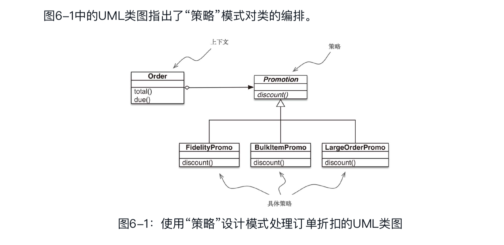
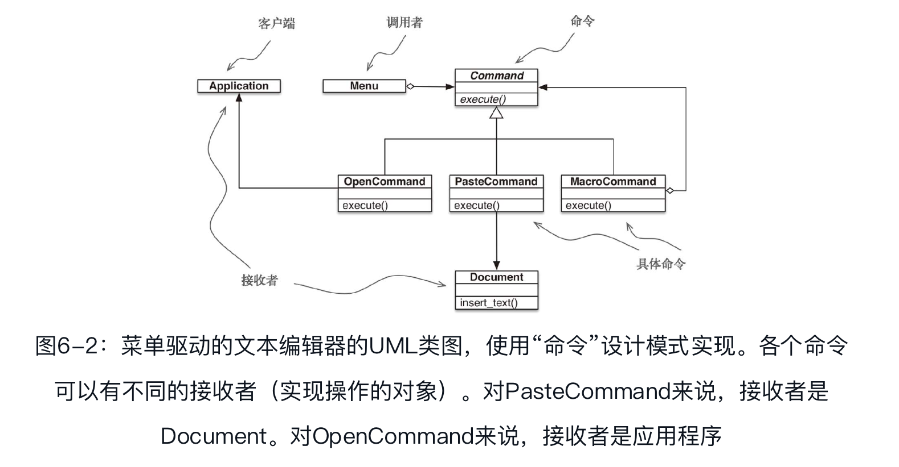

## 使用一等函数实现设计模式

### 案例分析：重构“策略”模式

#### 经典的策略模式

设计模式：可复用面向对象软件的基础》一书是这样概述“策略”模式的：定义一系列算法，把它们一一封装起来，并且使它们可以相互替换。本模式使得算法可以独立于使用它的客户而变化。

上下文：把一些计算委托给实现不同算法的可互换组件，它提供服务。在这个电商示例中，上下文是Order，它会根据不同的算法计算促销折扣。

策略：实现不同算法的组件共同的接口。在这个示例中，名为Promotion的抽象类扮演这个角色。

具体策略：“策略”的具体子类。fidelityPromo、BulkPromo和LargeOrderPromo是这里实现的三个具体策略。

按照《设计模式：可复用面向对象软件的基础》一书的说明，具体策略由上下文类的客户选择。

> 在Python 3.4中，声明抽象基类最简单的方式是子类化abc.ABC。

### “命令”模式

“命令”设计模式也可以通过把函数作为参数传递而简化。

“命令”模式的目的是解耦调用操作的对象（调用者）和提供实现的对象（接收者）。在《设计模式：可复用面向对象软件的基础》所举的示例中，调用者是图形应用程序中的菜单项，而接收者是被编辑的文档或应用程序自身。

这个模式的做法是，在二者之间放一个Command对象，让它实现只有一个方法（execute）的接口，调用接收者中的方法执行所需的操作。这样，调用者无需了解接收者的接口，而且不同的接收者可以适应不同的Command子类。调用者有一个具体的命令，通过调用execute方法执行。