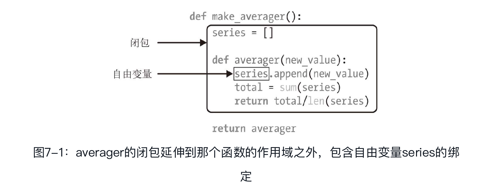

## 函数装饰器和闭包

### 装饰器基础知识

装饰器是可调用的对象，其参数是另一个函数（被装饰的函数）。装饰器可能会处理被装饰的函数，然后把它返回，或者将其替换成另一个函数或可调用对象。

假如有个名为decorate的装饰器：

```python
@decorate
def target():
  print('running target()')
```

上述代码的效果与下述写法一样：

```python
def target():
  print('running target()')
target = decorate(target)
```

两种写法的最终结果一样：上述两个代码片段执行完毕后得到的target不一定是原来那个target函数，而是decorate(target)返回的函数。

装饰器的一大特性是，能把被装饰的函数替换成其他函数。第二个特性是，装饰器在加载模块时立即执行。

### Python何时执行装饰器

装饰器的一个关键特性是，它们在被装饰的函数定义之后立即运行。这通常是在导入时（即Python加载模块时）。

### 变量作用域规则

b是局部变量，因为在函数的定义体中给它赋值了

```python
>> b = 6
>>> def f2(a):
...     print(a)
...     print(b)
...     b = 9
...
>>> f2(3)
3
Traceback (most recent call last):
  File "<stdin>", line 1, in <module>
  File "<stdin>", line 3, in f2
UnboundLocalError: local variable 'b' referenced before assignment
```

可事实是，Python编译函数的定义体时，它判断b是局部变量，因为在函数中给它赋值了。生成的字节码证实了这种判断，Python会尝试从本地环境获取b。后面调用f2(3)时， f2的定义体会获取并打印局部变量a的值，但是尝试获取局部变量b的值时，发现b没有绑定值。

这不是缺陷，而是设计选择：Python不要求声明变量，但是假定在函数定义体中赋值的变量是局部变量。

如果在函数中赋值时想让解释器把b当成全局变量，要使用global声明：

```python
>>> b = 6
>>> def f3(a):
...     global b
...     print(a)
...     print(b)
...     b = 9
...
>>> f3(3)
3
6
>>> b
9
>>> f3(3)
3
9
>>> b = 30
>>> b
30
>>>
```

**比较字节码**

dis模块为反汇编Python函数字节码提供了简单的方式。

反汇编示例中的f2函数:

```python
>>> dis(f2)
 2            0 LOAD_GLOBAL             0 (print)
              3 LOAD_FAST               0 (a)
              6 CALL_FUNCTION           1 (1 positional, 0 keyword pair)
              9 POP_TOP
 3           10 LOAD_GLOBAL             0 (print)
             13 LOAD_FAST               1 (b)  ➊
             16 CALL_FUNCTION           1 (1 positional, 0 keyword pair)
             19 POP_TOP
 4           20 LOAD_CONST              1 (9)
             23 STORE_FAST              1 (b)
             26 LOAD_CONST              0 (None)
             29 RETURN_VALUE
```

➊ 加载本地名称b。这表明，编译器把b视作局部变量，即使在后面才为b赋值，因为变量的种类（是不是局部变量）不能改变函数的定义体。

### 闭包

闭包指延伸了作用域的函数，其中包含函数定义体中引用、但是不在定义体中定义的非全局变量。函数是不是匿名的没有关系，关键是它能访问定义体之外定义的非全局变量。

average.py：计算移动平均值的高阶函数

```python
def make_averager():
  	series = []
    def averager(new_value):
      series.append(new_value)
      total = sum(series)
      return total/len(series)
    return averager
```

```python
>>> avg = make_averager（ ）
>>> avg(10)
10.0
>>> avg(11)
10.5
>>> avg(12)
11.0
```

在averager函数中，series是自由变量（free variable）。这是一个技术术语，指未在本地作用域中绑定的变量:



审查返回的averager对象，我们发现Python在`__code__`属性（表示编译后的函数定义体）中保存局部变量和自由变量的名称

```python
>>> avg.__code__.co_varnames
('new_value', 'total')
>>> avg.__code__.co_freevars
('series',)
```

series的绑定在返回的avg函数的`__closure__`属性中。`avg.__closure__`中的各个元素对应于`avg.__code__.co_freevars`中的一个名称。这些元素是cell对象，有个cell_contents属性，保存着真正的值。

```python
>> avg.__code__.co_freevars
('series',)
>>> avg.__closure__
(<cell at 0x107a44f78: list object at 0x107a91a48>,)
>>> avg.__closure__[0].cell_contents
[10, 11, 12]
```

综上，闭包是一种函数，它会保留定义函数时存在的自由变量的绑定，这样调用函数时，虽然定义作用域不可用了，但是仍能使用那些绑定。

> 注意，只有嵌套在其他函数中的函数才可能需要处理不在全局作用域中的外部变量。

### nonlocal声明

```python
def make_averager（ ）:
        count = 0
    total = 0
    def averager(new_value):
        count+= 1
        total+= new_value
        return total / count
    return averager

>>> avg = make_averager（ ）
>>> avg(10)
Traceback (most recent call last):
  ...
UnboundLocalError: local variable 'count' referenced before assignment
>>>
```

当count是数字或任何不可变类型时，count+=1语句的作用其实与count=count+1一样。因此，我们在averager的定义体中为count赋值了，这会把count变成局部变量。total变量也受这个问题影响。

对数字、字符串、元组等不可变类型来说，只能读取，不能更新。如果尝试重新绑定，例如count=count+1，其实会隐式创建局部变量count。这样，count就不是自由变量了，因此不会保存在闭包中。

为了解决这个问题，Python 3引入了nonlocal声明。它的作用是把变量标记为自由变量，即使在函数中为变量赋予新值了，也会变成自由变量。如果为nonlocal声明的变量赋予新值，闭包中保存的绑定会更新。 

```python
def make_averager（ ）:
        count = 0
    total = 0
    def averager(new_value):
      	nonlocal count, total
        count+= 1
        total+= new_value
        return total / count
    return averager
```

Python 2没有nonlocal，因此需要变通方法，“PEP 3104—Access to Names in Outer Scopes”（nonlocal在这个PEP中引入）中的第三个代码片段给出了一种方法。基本上，这种处理方式是把内部函数需要修改的变量（如count和total）存储为可变对象（如字典或简单的实例）的元素或属性，并且把那个对象绑定给一个自由变量。

### 实现一个简单的装饰器

一个简单的装饰器，输出函数的运行时间

```python
import time
def clock(func):
    def clocked(*args):  # ➊
        t0 = time.perf_counter（ ）
        result = func(*args)  # ➋
        elapsed = time.perf_counter（ ）-t0
        name = func.__name__
        arg_str = ', '.join(repr(arg) for arg in args)
        print('[%0.8fs]%s(%s)->%r'%(elapsed, name, arg_str, result))
        return result
    return clocked #  ➌
```

这是装饰器的典型行为：把被装饰的函数替换成新函数，二者接受相同的参数，而且（通常）返回被装饰的函数本该返回的值，同时还会做些额外操作。

示例中实现的clock装饰器有几个缺点：不支持关键字参数，而且遮盖了被装饰函数的`__name__`和`__doc__`属性。

改进后的clock装饰器使用functools.wraps装饰器把相关的属性从func复制到clocked中。此外，这个新版还能正确处理关键字参数。

```python
# clockdeco2.py
import time
import functools
def clock(func):
    @functools.wraps(func)
    def clocked(*args, **kwargs):
        t0 = time.time（ ）
        result = func(*args, **kwargs)
        elapsed = time.time（ ）-t0
        name = func.__name__
        arg_lst = []
        if args:
            arg_lst.append(', '.join(repr(arg) for arg in args))
        if kwargs:
            pairs = ['%s=%r'%(k, w) for k, w in sorted(kwargs.items（ ）)]
            arg_lst.append(', '.join(pairs))
        arg_str = ', '.join(arg_lst)
        print('[%0.8fs]%s(%s)->%r '%(elapsed, name, arg_str, result))

```

functools.wraps只是标准库中拿来即用的装饰器之一。

### 标准库中的装饰器

Python内置了三个用于装饰方法的函数：property、c和staticmethod。

另一个常见的装饰器是functools.wraps，它的作用是协助构建行为良好的装饰器。标准库中最值得关注的两个装饰器是lru_cache和全新的singledispatch（Python 3.4新增）。这两个装饰器都在functools模块中定义。

#### 使用functools.lru_cache做备忘

functools.lru_cache是非常实用的装饰器，它实现了备忘（memoization）功能。这是一项优化技术，它把耗时的函数的结果保存起来，避免传入相同的参数时重复计算。LRU三个字母是“Least Recently Used”的缩写，表明缓存不会无限制增长，一段时间不用的缓存条目会被扔掉。

生成第n个斐波纳契数这种慢速递归函数适合使用lru_cache，

```python
import functools
from clockdeco import clock
@functools.lru_cache（ ） # ➊
@clock  # ➋
def fibonacci(n):
    if n < 2:
        return n
    return fibonacci(n-2)+fibonacci(n-1)
if __name__=='__main__':
    print(fibonacci(6))
```

1. 注意，必须像常规函数那样调用lru_cache。这一行中有一对括号：@functools.lru_cache（　）。这么做的原因是，lru_cache可以接受配置参数
2. 这里叠放了装饰器：@lru_cache（　）应用到@clock返回的函数上。

特别要注意，lru_cache可以使用两个可选的参数来配置。它的签名是：

```python
functools.lru_cache(maxsize=128, typed=False)
```

- maxsize参数指定存储多少个调用的结果。缓存满了之后，旧的结果会被扔掉，腾出空间。为了得到最佳性能，maxsize应该设为2的幂。
- typed参数如果设为True，把不同参数类型得到的结果分开保存，即把通常认为相等的浮点数和整数参数（如1和1.0）区分开。顺便说一下，因为lru_cache使用字典存储结果，而且键根据调用时传入的定位参数和关键字参数创建，所以被lru_cache装饰的函数，它的所有参数都必须是可散列的。

#### 单分派泛函数

Python 3.4新增的functools.singledispatch装饰器可以把整体方案拆分成多个模块，甚至可以为你无法修改的类提供专门的函数。使用@singledispatch装饰的普通函数会变成泛函数（generic function）：根据第一个参数的类型，以不同方式执行相同操作的一组函数。

> functools.singledispatch是Python 3.4增加的，PyPI中的singledispatch包可以向后兼容Python 2.6到Python 3.3。

singledispatch创建一个自定义的htmlize.register装饰器，把多个函数绑在一起组成一个泛函数:

```python
from functools import singledispatch
from collections import abc
import numbers
import html
@singledispatch  ➊
def htmlize(obj):
    content = html.escape(repr(obj))
    return '<pre>{}</pre>'.format(content)
@htmlize.register(str)  ➋
def _(text):            ➌
    content = html.escape(text).replace('\n', '<br>\n')
    return '<p>{0}</p >'.format(content)
@htmlize.register(numbers.Integral)  ➍
def _(n):
    return '<pre>{0} (0x{0:x})</pre>'.format(n)
@htmlize.register(tuple)  ➎
@htmlize.register(abc.MutableSequence)
def _(seq):
    inner = '</li>\n<li>'.join(htmlize(item) for item in seq)
```

1. @singledispatch标记处理object类型的基函数。
2. 各个专门函数使用@«base_function».register(«type»)装饰。
3. 专门函数的名称无关紧要；_是个不错的选择，简单明了。
4. 为每个需要特殊处理的类型注册一个函数。numbers.Integral是int的虚拟超类。
5. 可以叠放多个register装饰器，让同一个函数支持不同类型。

只要可能，注册的专门函数应该处理抽象基类（如numbers.Integral和abc.MutableSequence），不要处理具体实现（如int和list）。

singledispatch机制的一个显著特征是，你可以在系统的任何地方和任何模块中注册专门函数。如果后来在新的模块中定义了新的类型，可以轻松地添加一个新的专门函数来处理那个类型。此外，你还可以为不是自己编写的或者不能修改的类添加自定义函数。

singledispatch是经过深思熟虑之后才添加到标准库中的，它提供的特性很多，这里无法一一说明。这个机制最好的文档是“PEP 443—Single-dispatch generic functions”。

装饰器是函数，因此可以组合起来使用。

### 叠放装饰器

把@d1和@d2两个装饰器按顺序应用到f函数上，作用相当于f=d1(d2(f))。

```python
@d1
@d2
def f():
  print('f')
```

等同于

```python
def f():
  print('f')
f = d1(d2(f))
```

### 参数化装饰器

怎么让装饰器接受其他参数呢？答案是：创建一个装饰器工厂函数，把参数传给它，返回一个装饰器，然后再把它应用到要装饰的函数上。

#### 一个参数话的注册装饰器

为了便于启用或禁用register执行的函数注册功能，我们为它提供一个可选的active参数，设为False时，不注册被装饰的函数。

从概念上看，这个新的register函数不是装饰器，而是装饰器工厂函数。调用它会返回真正的装饰器，这才是应用到目标函数上的装饰器。

```python
registry = set（ ）  ➊
def register(active=True):  ➋
    def decorate(func):  ➌
        print('running register(active=%s)->decorate(%s)'
             %(active, func))
        if active:   ➍
            registry.add(func)
        else:
            registry.discard(func)  ➎
        return func  ➏
    return decorate  ➐
@register(active=False)  ➑
def f1（ ）:
    print('running f1（ ）')
@register（ ）  ➒
def f2（ ）:
    print('running f2（ ）')ldef f3（ ）:
    print('running f3（ ）')
```

- ➌ decorate这个内部函数是真正的装饰器；注意，它的参数是一个函数。
- ➑ @register工厂函数必须作为函数调用，并且传入所需的参数。

这里的关键是，register（　）要返回decorate，然后把它应用到被装饰的函数上。

如果不使用@句法，那就要像常规函数那样使用register；若想把f添加到registry中，则装饰f函数的句法是register（　）(f)；不想添加（或把它删除）的话，句法是register(active=False)(f)。

参数化装饰器通常会把被装饰的函数替换掉，而且结构上需要多一层嵌套。

#### 参数化clock装饰器

再次探讨clock装饰器，为它添加一个功能：让用户传入一个格式字符串，控制被装饰函数的输出。

参数化clock装饰器：

```python
import time
DEFAULT_FMT = '[{elapsed:0.8f}s] {name}({args})-> {result}'
def clock(fmt=DEFAULT_FMT):   ➊
    def decorate(func):       ➋
        def clocked(*_args):  ➌
            t0 = time.time（ ）
            _result = func(*_args)  ➍
            elapsed = time.time（ ）-t0
            name = func.__name__
            args = ', '.join(repr(arg) for arg in _args)  ➎
            result = repr(_result)  ➏
            print(fmt.format(**locals（ ）))  ➐
            return _result  ➑
        return clocked  ➒
    return decorate  ➓
if __name__ == '__main__':
    @clock（ ）
    def snooze(seconds):
        time.sleep(seconds)
    for i in range(3):
        snooze(.123)
```

- ❶ clock是参数化装饰器工厂函数。
- ❷ decorate是真正的装饰器。
- ❸ clocked包装被装饰的函数。
- ❹ _result是被装饰的函数返回的真正结果。
- ❼ 这里使用**locals（　）是为了在fmt中引用clocked的局部变量。
- ❽ clocked会取代被装饰的函数，因此它应该返回被装饰的函数返回的值。

