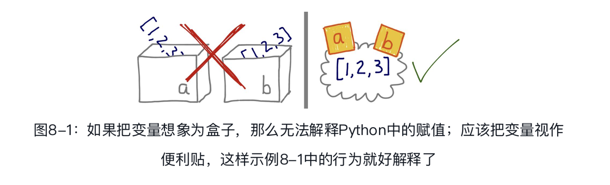
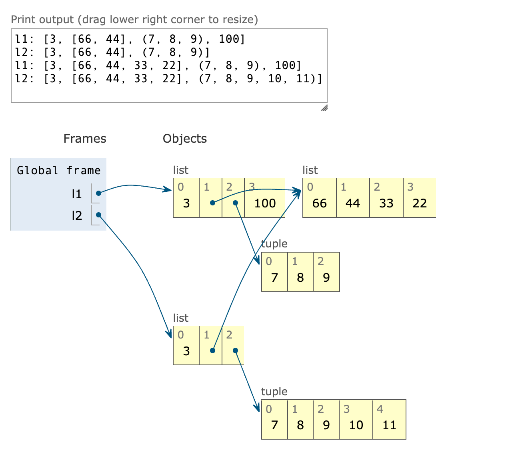

## 对象引用、可变性和垃圾和回收

### 变量不是盒子

python使用的是面向对象语言中的引用式变量。



对引用式变量来说，说把变量分配给对象更合理，反过来说就有问题。毕竟，对象在赋值之前就创建了。

创建对象之后才会把变量分配给对象：

```python
>>> x = Gizmo()
Gizmo id:140413218529104
>>> y = Gizmo() * 10
Gizmo id:140413218529184 ➌
Traceback (most recent call last):
  File "<stdin>", line 1, in <module>
TypeError: unsupported operand type(s) for *: 'instance' and 'int'
>>> dir()
['Gizmo', '__builtins__', '__doc__', '__name__', '__package__', 'x']
```

- ➌ 这里表明，在尝试求积之前其实会创建一个新的Gizmo实例。

对象在右边创建或获取，在此之后左边的变量才会绑定到对象上，这就像为对象贴上标注。

因为变量只不过是标注，所以无法阻止为对象贴上多个标注。贴的多个标注，就是别名。

### 标识、相等性和别名

charles和lewis指代同一个对象：

```python
>>> charles = {'name':'Charles', 'born':1832}
>>> lewis = charles
>>> lewis is charles
True
>>> id(charles), id(lewis)
(140243165514640, 140243165514640)
>>> lewis['balance'] = 950
>>> charles
{'born': 1832, 'balance': 950, 'name': 'Charles'}
>>>
```

alex与charles比较的结果是相等，但alex不是charles:

```python
>>> alex = {'born': 1832, 'balance': 950, 'name': 'Charles'}
>>> alex == charles
True
>>> alex is not charles
True
>>>
```

lewis和charles是别名，即两个变量绑定同一个对象。而alex不是charles的别名，因为二者绑定的是不同的对象。alex和charles绑定的对象具有相同的值（==比较的就是值），但是它们的标识不同。

每个变量都有标识、类型和值。对象一旦创建，它的标识绝不会变；你可以把标识理解为对象在内存中的地址。is运算符比较两个对象的标识；id（　）函数返回对象标识的整数表示。

对象ID的真正意义在不同的实现中有所不同。在CPython中，id（　）返回对象的内存地址，但是在其他Python解释器中可能是别的值。关键是，ID一定是唯一的数值标注，而且在对象的生命周期中绝不会变。

#### 在==和is之间选择

==运算符比较两个对象的值（对象中保存的数据），而is比较对象的标识。

在变量和单例值之间比较时，应该使用is。目前，最常使用is检查变量绑定的值是不是None。下面是推荐的写法：

```python
x is None
```

否定的正确写法是：

```python
x is not None
```

is运算符比`==`速度快，因为它不能重载，所以Python不用寻找并调用特殊方法，而是直接比较两个整数ID。而`a==b`是语法糖，等同于`a.__eq__(b)`。继承自object的`__eq__`方法比较两个对象的ID，结果与is一样。但是多数内置类型使用更有意义的方式覆盖了`__eq__`方法，会考虑对象属性的值。相等性测试可能涉及大量处理工作，例如，比较大型集合或嵌套层级深的结构时。

#### 元组的相对不可变性

元组与多数Python集合（列表、字典、集，等等）一样，保存的是对象的引用。[插图]如果引用的元素是可变的，即便元组本身不可变，元素依然可变。也就是说，元组的不可变性其实是指tuple数据结构的物理内容（即保存的引用）不可变，与引用的对象无关。

元组的值会随着引用的可变对象的变化而变。元组中不可变的是元素的标识:

```python
>>> t1 = (1, 2, [30, 40])  ➊
>>> t2 = (1, 2, [30, 40])  ➋
>>> t1 == t2  ➌
True
>>> id(t1[-1])  ➍
4302515784
>>> t1[-1].append(99)  ➎
>>> t1
(1, 2, [30, 40, 99])
>>> id(t1[-1])  ➏
4302515784
>>> t1 == t2  ➐
False
```

复制对象时，相等性和标识之间的区别有更深入的影响。副本与源对象相等，但是ID不同。可是，如果对象中包含其他对象，那么应该复制内部对象吗？可以共享内部对象吗？

### 默认做浅复制

复制列表（或多数内置的可变集合）最简单的方式是使用内置的类型构造方法。

```python
>>> l1 = [3, [55, 44], (7, 8, 9)]
>>> l2 = list(l1)  ➊
>>> l2
[3, [55, 44], (7, 8, 9)]
>>> l2 == l1  ➋
True
>>> l2 is l1  ➌
False
```

对列表和其他可变序列来说，还能使用简洁的l2=l1[:]语句创建副本。

然而，构造方法或[:]做的是浅复制（即复制了最外层容器，副本中的元素是源容器中元素的引用）。

可以把下列代码粘贴到[Python Tutor](https://pythontutor.com/visualize.html#mode=display)网站中查看动画效果。

```python
l1 = [3, [66, 55, 44], (7, 8, 9)]
l2 = list(l1)      # ➊
l1.append(100)     # ➋
l1[1].remove(55)   # ➌
print('l1:', l1)
print('l2:', l2)
l2[1]+= [33, 22]  # ➍
l2[2]+= (10, 11)  # ➎
print('l1:', l1)
print('l2:', l2)
```



l1和l2的最终状态：二者依然引用同一个列表对象，现在列表的值是[66,44, 33, 22]，不过l2[2]+=(10, 11)创建一个新元组，内容是(7, 8, 9, 10, 11)，它与l1[2]引用的元组(7, 8, 9)无关。

#### 为任意对象做深复制和浅复制

浅复制没什么问题，但有时我们需要的是深复制（即副本不共享内部对象的引用）。copy模块提供的deepcopy和copy函数能为任意对象做深复制和浅复制。

注意，一般来说，深复制不是件简单的事。如果对象有循环引用，那么这个朴素的算法会进入无限循环。deepcopy函数会记住已经复制的对象，因此能优雅地处理循环引用。

```python
>>> a = [10, 20]
>>> b = [a, 30]
>>> b
[[10, 20], 30]
>>> a.append(b)
>>> a
[10, 20, [[...], 30]]
>>> from copy import deepcopy
>>> c = deepcopy(a)
>>> c
[10, 20, [[...], 30]]
```

此外，深复制有时可能太深了。例如，对象可能会引用不该复制的外部资源或单例值。我们可以实现特殊方法__copy__（　）和__deepcopy__（　），控制copy和deepcopy的行为，详情参见copy模块的文档。

### 函数的参数作为引用时

Python唯一支持的参数传递模式是共享传参（call by sharing）。多数面向对象语言都采用这一模式，包括Ruby、Smalltalk和Java（Java的引用类型是这样，基本类型按值传参）。

共享传参指函数的各个形式参数获得实参中各个引用的副本。也就是说，函数内部的形参是实参的别名。

这种方案的结果是，函数可能会修改作为参数传入的可变对象，但是无法修改那些对象的标识。

示例中有个简单的函数，它在参数上调用+=运算符。分别把数字、列表和元组传给那个函数，实际传入的实参会以不同的方式受到影响：

```python
>>> def f(a, b):
...     a+= b
...     return a
...
>>> x = 1
>>> y = 2
>>> f(x, y)
3
>>> x, y  ➊
(1, 2)
>>> a = [1, 2]
>>> b = [3, 4]
>>> f(a, b)
[1, 2, 3, 4]
>>> a, b  ➋
([1, 2, 3, 4], [3, 4])
>>> t = (10, 20)
>>> u = (30, 40)
>>> f(t, u)
(10, 20, 30, 40)
>>> t, u ➌
((10, 20), (30, 40))
```

- ❶ 数字x没变。
- ❷ 列表a变了。
- ❸ 元组t没变。

#### 不要使用可变类型作为参数的默认值

可选参数可以有默认值，这是Python函数定义的一个很棒的特性，这样我们的API在进化的同时能保证向后兼容。然而，我们应该避免使用可变的对象作为参数的默认值。

一个简单的类，说明可变默认值的危险：

```python
class HauntedBus:
    """备受幽灵乘客折磨的校车"""
def __init__(self, passengers=[]):  ➊
    self.passengers = passengers  ➋
def pick(self, name):
    self.passengers.append(name)  ➌
def drop(self, name):
    self.passengers.remove(name)
```

- ❷ 这个赋值语句把self.passengers变成passengers的别名，而没有传入passengers参数时，后者又是默认列表的别名。
- ❸ 在self.passengers上调用.remove（　）和.append（　）方法时，修改的其实是默认列表，它是函数对象的一个属性。

 备受幽灵乘客折磨的校车:

```python
>>> bus1 = HauntedBus(['Alice', 'Bill'])
>>> bus1.passengers
['Alice', 'Bill']
>>> bus1.pick('Charlie')
>>> bus1.drop('Alice')
>>> bus1.passengers  ➊
['Bill', 'Charlie']
>>> bus2 = HauntedBus（ ）  ➋
>>> bus2.pick('Carrie')
>>> bus2.passengers
['Carrie']
>>> bus3 = HauntedBus（ ）  ➌
>>> bus3.passengers  ➍
['Carrie']
>>> bus3.pick('Dave')
>>> bus2.passengers  ➎
['Carrie', 'Dave']
>>> bus2.passengers is bus3.passengers  ➏
True
>>> bus1.passengers  ➐
['Bill', 'Charlie']
```

没有指定初始乘客的HauntedBus实例会共享同一个乘客列表。

这种问题很难发现。这是因为self.passengers变成了passengers参数默认值的别名。出现这个问题的根源是，默认值在定义函数时计算（通常在加载模块时），因此默认值变成了函数对象的属性。因此，如果默认值是可变对象，而且修改了它的值，那么后续的函数调用都会受到影响。

可以审查HauntedBus.__init__对象，看看它的`__defaults__`属性中的那些幽灵学生：

```python
>> dir(HauntedBus.__init__)  # doctest:+ELLIPSIS
['__annotations__', '__call__', ..., '__defaults__', ...]
>>> HauntedBus.__init__.__defaults__
(['Carrie', 'Dave'],)
```

可变默认值导致的这个问题说明了为什么通常使用None作为接收可变值的参数的默认值。

####  防御可变参数

如果定义的函数接收可变参数，应该谨慎考虑调用方是否期望修改传入的参数。

一个简单的类，说明接受可变参数的风险:

```python
class TwilightBus:
        """让乘客销声匿迹的校车"""
    def __init__(self, passengers=None):
        if passengers is None:
            self.passengers = []  ➊
        else:
            self.passengers = passengers  ➋
    def pick(self, name):
        self.passengers.append(name)
    def drop(self, name):
        self.passengers.remove(name)  ➌
```

- ❷ 这个赋值语句把self.passengers变成passengers的别名，而后者是传给__init__方法的实参（即示例8-14中的basketball_team）的别名。
- ❸ 在self.passengers上调用.remove（　）和.append（　）方法其实会修改传给构造方法的那个列表。

从TwilightBus下车后，乘客消失了:

```python
>>> basketball_team = ['Sue', 'Tina', 'Maya', 'Diana', 'Pat']  ➊
>>> bus = TwilightBus(basketball_team)  ➋
>>> bus.drop('Tina')  ➌
>>> bus.drop('Pat')
>>> basketball_team  ➍
['Sue', 'Maya', 'Diana']
```

- ❹ 下车的学生从篮球队中消失了！

TwilightBus违反了设计接口的最佳实践，即“最少惊讶原则”。

这里的问题是，校车为传给构造方法的列表创建了别名。正确的做法是，校车自己维护乘客列表。修正的方法很简单：在`__init__`中，传入passengers参数时，应该把参数值的副本赋值给self.passengers:

```python
def __init__(self, passengers=None):
  if passengers is None:
    self.passengers = []
  else:
    self.passengers = list(passengers)  # ➊
```

- ➊ 创建passengers列表的副本；如果不是列表，就把它转换成列表。

### del和垃圾回收

del语句删除名称，而不是对象。del命令可能会导致对象被当作垃圾回收，但是仅当删除的变量保存的是对象的最后一个引用，或者无法得到对象时。重新绑定也可能会导致对象的引用数量归零，导致对象被销毁。

> 有个`__del__`特殊方法，但是它不会销毁实例，不应该在代码中调用。即将销毁实例时，Python解释器会调用`__del__`方法，给实例最后的机会，释放外部资源。

在CPython中，垃圾回收使用的主要算法是引用计数。实际上，每个对象都会统计有多少引用指向自己。当引用计数归零时，对象立即就被销毁：CPython会在对象上调用`__del__`方法（如果定义了），然后释放分配给对象的内存。CPython 2.0增加了分代垃圾回收算法，用于检测引用循环中涉及的对象组——如果一组对象之间全是相互引用，即使再出色的引用方式也会导致组中的对象不可获取。Python的其他实现有更复杂的垃圾回收程序，而且不依赖引用计数，这意味着，对象的引用数量为零时可能不会立即调用`__del__`方法。

### 弱引用

正是因为有引用，对象才会在内存中存在。当对象的引用数量归零后，垃圾回收程序会把对象销毁。但是，有时需要引用对象，而不让对象存在的时间超过所需时间。这经常用在缓存中。

弱引用不会增加对象的引用数量。引用的目标对象称为所指对象（referent）。因此我们说，弱引用不会妨碍所指对象被当作垃圾回收。

弱引用在缓存应用中很有用，因为我们不想仅因为被缓存引用着而始终保存缓存对象。

如果对象存在，调用弱引用可以获取对象；否则返回None。

```python
>> import weakref
>>> a_set = {0, 1}
>>> wref = weakref.ref(a_set)  ➊
>>> wref
<weakref at 0x100637598; to 'set' at 0x100636748>
>>> wref（ ）  ➋
{0, 1}
>>> a_set = {2, 3, 4}  ➌
>>> wref（ ）  ➍
{0, 1}
>>> wref（ ） is None  ➎
False
>>> wref（ ） is None  ➏
True
```

- ❶ 创建弱引用对象wref，下一行审查它。
- ❷ 调用wref（　）返回的是被引用的对象，{0, 1}。因为这是控制台会话，所以{0, 1}会绑定给_变量。
- _❸ a_set不再指代{0, 1}集合，因此集合的引用数量减少了。但是_变量仍然指代它。
- ❹ 调用wref（　）依旧返回{0, 1}。
- ❺ 计算这个表达式时，{0, 1}存在，因此wref（　）不是None。但是，随后_绑定到结果值False。现在{0, 1}没有强引用了。
- ❻ 因为{0, 1}对象不存在了，所以wref（　）返回None。

weakref模块的文档指出，weakref.ref类其实是低层接口，供高级用途使用，多数程序最好使用weakref集合和finalize。也就是说，应该使用WeakKeyDictionary、WeakValueDictionary、WeakSet和finalize（在内部使用弱引用），不要自己动手创建并处理weakref.ref实例。

####  WeakValueDictionary简介

WeakValueDictionary类实现的是一种可变映射，里面的值是对象的弱引用。被引用的对象在程序中的其他地方被当作垃圾回收后，对应的键会自动从WeakValueDictionary中删除。因此，WeakValueDictionary经常用于缓存。

与WeakValueDictionary对应的是WeakKeyDictionary，后者的键是弱引用。weakref.WeakKeyDictionary的文档指出了一些可能的用途：（WeakKeyDictionary实例）可以为应用中其他部分拥有的对象附加数据，这样就无需为对象添加属性。这对覆盖属性访问权限的对象尤其有用。

weakref模块还提供了WeakSet类，按照文档的说明，这个类的作用很简单：“保存元素弱引用的集合类。元素没有强引用时，集合会把它删除。”如果一个类需要知道所有实例，一种好的方案是创建一个WeakSet类型的类属性，保存实例的引用。如果使用常规的set，实例永远不会被垃圾回收，因为类中有实例的强引用，而类存在的时间与Python进程一样长，除非显式删除类。

#### 弱引用的局限

不是每个Python对象都可以作为弱引用的目标（或称所指对象）。基本的list和dict实例不能作为所指对象，但是它们的子类可以轻松地解决这个问题：

```python
class MyList(list):
  """list的子类，实例可以作为弱引用的目标"""
a_list = MyList(range(10))
# a_list可以作为弱引用的目标
wref_to_a_list = weakref.ref(a_list)
```

set实例可以作为所指对象，用户定义的类型也没问题。但是，int和tuple实例不能作为弱引用的目标，甚至它们的子类也不行。

这些局限基本上是CPython的实现细节，在其他Python解释器中情况可能不一样。这些局限是内部优化导致的结果。

### Python对不可变类型施加的把戏

对元组t来说，t[:]不创建副本，而是返回同一个对象的引用。此外，tuple(t)获得的也是同一个元组的引用。

```python
>>> t1 = (1,2,3)
>>> t2 = tuple(t1)
>>> t2 is t1
True
>>> t3 = t1[:]
>>> t3 is t1
True
```

str、bytes和frozenset实例也有这种行为。注意，frozenset实例不是序列，因此不能使用fs[:]（fs是一个frozenset实例）。但是，fs.copy（　）具有相同的效果：它会欺骗你，返回同一个对象的引用，而不是创建一个副本。

字符串字面量可能会创建共享的对象：

```python
>>> t1 = (1,2,3)
>>> t3 = (1,2,3)
>>> t3 is t1
False
>>> s1 = 'ABC'
>>> s2 = 'ABC'
>>> s1 is s2
True
```

共享字符串字面量是一种优化措施，称为驻留（interning）。CPython还会在小的整数上使用这个优化措施，防止重复创建“热门”数字，如0、-1和42。注意，CPython不会驻留所有字符串和整数，驻留的条件是实现细节，而且没有文档说明。

> 千万不要依赖字符串或整数的驻留！比较字符串或整数是否相等时，应该使用==，而不是is。驻留是Python解释器内部使用的一个特性。

