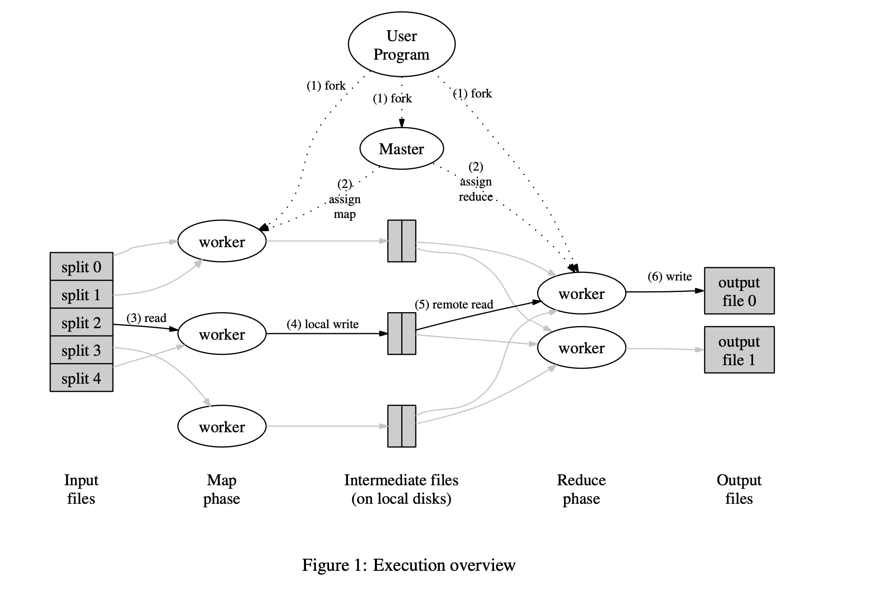

# **MapReduce: Simplified Data Processing on Large Clusters**(2004)

—— Jeffrey Dean and Sanjay Ghemawat jeff@google.com, sanjay@google.com

[original link](https://github.com/Uyouii/BookReading/blob/master/%E5%88%86%E5%B8%83%E5%BC%8F%E7%B3%BB%E7%BB%9F/MapReduce/mapreduce.pdf)

## **Abstract**

MapReduce is a programming model and an associated implementation for processing and generating large data sets. Users specify a *map* function that processes a key/value pair to generate a set of intermediate key/value pairs, and a *reduce* function that merges all intermediate values associated with the same intermediate key. Many real world tasks are expressible in this model, as shown in the paper.

## **Programming Model**

The computation takes a set of *input* key/value pairs, and produces a set of *output* key/value pairs. The user of the MapReduce library expresses the computation as two functions: *Map* and *Reduce*.

*Map*, written by the user, takes an input pair and produces a set of *intermediate* key/value pairs. The MapReduce library groups together all intermediate values associated with the same intermediate key *I* and passes them to the *Reduce* function.

The *Reduce* function, also written by the user, accepts an intermediate key *I* and a set of values for that key. It merges together these values to form a possibly smaller set of values. Typically just zero or one output value is produced per *Reduce* invocation. The intermediate values are supplied to the user’s reduce function via an iterator. This allows us to handle lists of values that are too large to fit in memory.

### **More Examples**

**Distributed Grep:** The map function emits a line if it matches a supplied pattern. The reduce function is an identity function that just copies the supplied intermedi- ate data to the output.

**Count of URL Access Frequency:** The map func- tion processes logs of web page requests and outputs ⟨URL, 1⟩. The reduce function adds together all values for the same URL and emits a ⟨URL, total count⟩ pair.

**Distributed Sort:** The map function extracts the key from each record, and emits a ⟨key, record⟩ pair. The reduce function emits all pairs unchanged. This computation depends on the partitioning facilities described in Section 4.1 and the ordering properties described in Section 4.2.

## **Implementation**

Many different implementations of the MapReduce interface are possible. The right choice depends on the environment. 

This section describes an implementation targeted to the computing environment in wide use at Google:large clusters of commodity PCs connected together with switched Ethernet . In our environment:

1. Machines are typically dual-processor x86 processors running Linux, with 2-4 GB of memory per machine.
2. Commodity networking hardware is used – typically either 100 megabits/second or 1 gigabit/second at the machine level, but averaging considerably less in overall bisection bandwidth.
3. A cluster consists of hundreds or thousands of machines, and therefore machine failures are common.
4. Storage is provided by inexpensive IDE disks attached directly to individual machines. A distributed file system developed in-house is used to manage the data stored on these disks. The file system uses replication to provide availability and reliability on top of unreliable hardware.
5. Users submit jobs to a scheduling system. Each job consists of a set of tasks, and is mapped by the scheduler to a set of available machines within a cluster.

### **Execution Overview**

The *Map* invocations are distributed across multiple machines by automatically partitioning the input data into a set of M *splits*. The input splits can be processed in parallel by different machines. *Reduce* invoca- tions are distributed by partitioning the intermediate key space into R pieces using a partitioning function (e.g., hash(key) mod R). The number of partitions (R) and the partitioning function are specified by the user.

Figure 1 shows the overall flow of a MapReduce op- eration in our implementation. When the user program calls the MapReduce function, the following sequence of actions occurs (the numbered labels in Figure 1 corre- spond to the numbers in the list below):

1. The MapReduce library in the user program first splits the input files into M pieces of typically 16 megabytes to 64 megabytes (MB) per piece (con- trollable by the user via an optional parameter). It then starts up many copies of the program on a clus- ter of machines.
2. One of the copies of the program is special – **the master**. The rest are workers that are assigned work by the master. There are M map tasks and R reduce tasks to assign. The master picks idle workers and assigns each one a map task or a reduce task.
3. A worker who is assigned a map task reads the contents of the corresponding input split. It parses key/value pairs out of the input data and passes each pair to the user-defined *Map* function. The intermediate key/value pairs produced by the *Map* function are buffered in memory.
4. Periodically, the buffered pairs are written to local disk, partitioned into R regions by the partitioning function. The locations of these buffered pairs on the local disk are passed back to the master, who is responsible for forwarding these locations to the reduce workers.
5. When a reduce worker is notified by the master about these locations, it uses remote procedure calls to read the buffered data from the local disks of the map workers. When a reduce worker has read all intermediate data, it sorts it by the intermediate keys so that all occurrences of the same key are grouped together. The sorting is needed because typically many different keys map to the same reduce task. If the amount of intermediate data is too large to fit in memory, an external sort is used.
6. The reduce worker iterates over the sorted intermediate data and for each unique intermediate key encountered, it passes the key and the corresponding set of intermediate values to the user’s *Reduce* function. The output of the *Reduce* function is appended to a final output file for this reduce partition.
7. When all map tasks and reduce tasks have been completed, the master wakes up the user program. At this point, the MapReduce call in the user program returns back to the user code.

After successful completion, the output of the mapreduce execution is available in the R output files (one per reduce task, with file names as specified by the user). Typically, users do not need to combine these R output files into one file – they often pass these files as input to another MapReduce call, or use them from another distributed application that is able to deal with input that is partitioned into multiple files.

### **Master Data Structures**

The master keeps several data structures. For each map task and reduce task, it stores the state (*idle*, *in-progress*, or *completed*), and the identity of the worker machine (for non-idle tasks).

The master is the conduit(通道，管道) through which the location of intermediate file regions is propagated from map tasks to reduce tasks. Therefore, for each completed map task, the master stores the locations and sizes of the R intermediate file regions produced by the map task. Updates to this location and size information are received as map tasks are completed. The information is pushed incrementally to workers that have *in-progress* reduce tasks.

### **Fault Tolerance**

Since the MapReduce library is designed to help process very large amounts of data using hundreds or thousands of machines, the library must tolerate machine failures gracefully.

#### **Worker Failure**

The master pings every worker periodically. If no response is received from a worker in a certain amount of time, the master marks the worker as failed. Any map tasks completed by the worker are reset back to their initial *idle* state, and therefore become eligible for scheduling on other workers. Similarly, any map task or reduce task in progress on a failed worker is also reset to *idle* and becomes eligible for rescheduling.

**Completed map tasks are reexecuted on a failure because their output is stored on the local disk(s) of the failed machine and is therefore inaccessible. Completed reduce tasks do not need to be reexecuted since their output is stored in a global file system.**

When a map task is executed first by worker A and then later executed by worker B (because A failed), all workers executing reduce tasks are notified of the reexecution.  Any reduce task that has not already read the data from worker A will read the data from worker B.

MapReduce is resilient(很强的适应力) to large-scale worker failures. For example, during one MapReduce operation, network maintenance on a running cluster was causing groups of 80 machines at a time to become unreachable for several minutes. The MapReduce master simply re-executed the work done by the unreachable worker machines, and continued to make forward progress, eventually completing the MapReduce operation.

#### **Master Failure**

It is easy to make the master write periodic checkpoints of the master data structures described above. If the master task dies, a new copy can be started from the last checkpointed state. However, given that there is only a single master, its failure is unlikely; therefore our current implementation **aborts the MapReduce computation if the master fails**. Clients can check for this condition and retry the MapReduce operation if they desire.

#### **Semantics(语义) in the Presence of Failures**

When the user-supplied *map* and *reduce* operators are deterministic(确定的) functions of their input values, our distributed implementation produces the same output as would have been produced by a non-faulting sequential execution of the entire program.

We rely on **atomic commits of map and reduce task** outputs to achieve this property. Each in-progress task writes its output to private temporary files. A reduce task produces one such file, and a map task produces R such files (one per reduce task). 

When a map task completes, the worker sends a message to the master and includes the names of the R temporary files in the message. If the master receives a completion message for an already completed map task, it ignores the message. Otherwise, it records the names of R files in a master data structure.

When a reduce task completes, the reduce worker atomically renames its temporary output file to the final output file. If the same reduce task is executed on multi- ple machines, multiple rename calls will be executed for the same final output file. We rely on the atomic rename operation provided by the underlying file system to guar- antee that the final file system state contains just the data produced by one execution of the reduce task.

The vast majority of our *map* and *reduce* operators are deterministic, and the fact that our semantics are equivalent to a sequential execution in this case makes it very easy for programmers to reason about their program’s behavior. When the *map* and/or *reduce* operators are non- deterministic, we provide weaker but still reasonable semantics. In the presence of non-deterministic operators, the output of a particular reduce task R1 is equivalent to the output for R1 produced by a sequential execution of the non-deterministic program. However, the output for a different reduce task R2 may correspond to the output for R2 produced by a different sequential execution of the non-deterministic program.

Consider map task M and reduce tasks R1 and R2. Let e(Ri) be the execution of Ri that committed (there is exactly one such execution). The weaker semantics arise because e(R1) may have read the output produced by one execution of M and e(R2) may have read the output produced by a different execution of M .

### **Locality**

Network bandwidth is a relatively scarce resource(稀缺资源) in our computing environment. We conserve network bandwidth by taking advantage of the fact that the input data (managed by GFS) is stored on the local disks of the machines that make up our cluster. GFS divides each file into 64 MB blocks, and stores several copies of each block (typically 3 copies) on different machines. The MapReduce master takes the location information of the input files into account and attempts to schedule a map task on a machine that contains a replica of the corresponding input data. Failing that, it attempts to schedule a map task near a replica of that task’s input data (e.g., on a worker machine that is on the same network switch as the machine containing the data). When running large MapReduce operations on a significant fraction of the workers in a cluster, most input data is read locally and consumes no network bandwidth.

### **Task Granularity**(任务粒度)

We subdivide the map phase into M pieces and the re- duce phase into R pieces, as described above. Ideally, M and R should be much larger than the number of worker machines. Having each worker perform many different tasks improves dynamic load balancing, and also speeds up recovery when a worker fails: the many map tasks it has completed can be spread out across all the other worker machines.

There are practical bounds on how large M and R can be in our implementation, since the master must make O(M + R) scheduling decisions and keeps O(M ∗ R) state in memory as described above. (The constant fac- tors for memory usage are small however: the O(M ∗ R) piece of the state consists of approximately one byte of data per map task/reduce task pair.)

Furthermore, R is often constrained by users because the output of each reduce task ends up in a separate out- put file. In practice, we tend to choose M so that each individual task is roughly 16 MB to 64 MB of input data (so that the locality optimization described above is most effective), and we make R a small multiple of the number of worker machines we expect to use. We often per- form MapReduce computations with M = 200, 000 and R = 5, 000, using 2,000 worker machines.

### **Backup Tasks**

One of the common causes that lengthens the total time taken for a MapReduce operation is a “straggler”: a ma- chine that takes an unusually long time to complete one of the last few map or reduce tasks in the computation. Stragglers can arise for a whole host of reasons. 

We have a general mechanism to alleviate the problem of stragglers. **When a MapReduce operation is close to completion, the master schedules backup executions of the remaining *in-progress* tasks.**  The task is marked as completed whenever either the primary or the backup execution completes. We have tuned this mechanism so that it typically increases the computational resources used by the operation by no more than a few percent. We have found that this significantly reduces the time to complete large MapReduce operations. As an exam- ple, the sort program described in Section 5.3 takes 44% longer to complete when the backup task mechanism is disabled.

## **Refinements**（改进）

Although the basic functionality provided by simply writing *Map* and *Reduce* functions is sufficient for most needs, we have found a few extensions useful. 

### **Partitioning Function**

The users of MapReduce specify the number of reduce tasks/output files that they desire (R). Data gets partitioned across these tasks using a partitioning function on the intermediate key. A default partitioning function is provided that uses hashing (e.g. “`hash(key) mod R`”).In some cases, however, it is useful to partition data by some other function of the key. For example, sometimes the output keys are URLs, and we want all entries for a single host to end up in the same output file. To support situations like this, the user of the MapReduce library can provide a special partitioning function. For example, using “hash(Hostname(urlkey)) mod R” as the par- titioning function causes all URLs from the same host to end up in the same output file.

就是支持定制化hash函数。

### **Ordering Guarantees**

We guarantee that within a given partition, the interme- diate key/value pairs are processed in increasing key or- der. This ordering guarantee makes it easy to generate a sorted output file per partition, which is useful when the output file format needs to support efficient random access lookups by key, or users of the output find it con- venient to have the data sorted.

保证key的顺序性。

### **Combiner Function**

In some cases, there is significant repetition in the intermediate keys produced by each map task, and the userspecified *Reduce* function is commutative and associative. A good example of this is the word counting exam- ple in Section 2.1. Since word frequencies tend to follow a Zipf distribution, each map task will produce hundreds or thousands of records of the form <the, 1>. All of these counts will be sent over the network to a single re- duce task and then added together by the *Reduce* function to produce one number. **We allow the user to specify an optional *Combiner* function that does partial merging of this data before it is sent over the network**.

The *Combiner* function is executed on each machine that performs a map task. Typically the same code is used to implement both the combiner and the reduce func- tions. The only difference between a reduce function and a combiner function is how the MapReduce library han- dles the output of the function. The output of a reduce function is written to the final output file. The output of a combiner function is written to an intermediate file that will be sent to a reduce task.

Partial combining significantly speeds up certain classes of MapReduce operations. 

### **Input and Output Types**

The MapReduce library provides support for reading in- put data in several different formats. Users can add support for a new input type by providing an implementation of a sim- ple *reader* interface, though most users just use one of a small number of predefined input types.

A *reader* does not necessarily need to provide data read from a file. For example, it is easy to define a *reader* that reads records from a database, or from data struc- tures mapped in memory.

In a similar fashion, we support a set of output types for producing data in different formats and it is easy for user code to add support for new output types.

### **Side-effects**

In some cases, users of MapReduce have found it con- venient to produce auxiliary files as additional outputs from their map and/or reduce operators. We rely on the application writer to make such side-effects atomic and idempotent. **Typically the application writes to a temporary file and atomically renames this file once it has been fully generated.**

We do not provide support for atomic two-phase commits of multiple output files produced by a single task. Therefore, tasks that produce multiple output files with cross-file consistency requirements should be deterministic. This restriction has never been an issue in practice.

### **Skipping Bad Records**

Sometimes there are bugs in user code that cause the *Map* or *Reduce* functions to crash deterministically on certain records. Such bugs prevent a MapReduce operation from completing. The usual course of action is to fix the bug, but sometimes this is not feasible; perhaps the bug is in a third-party library for which source code is unavail- able. Also, sometimes it is acceptable to ignore a few records, for example when doing statistical analysis on a large data set. **We provide an optional mode of execution where the MapReduce library detects which records cause deterministic crashes and skips these records in order to make forward progress.**

Each worker process installs a signal handler that catches segmentation violations and bus errors. Before invoking a user *Map* or *Reduce* operation, the MapReduce library stores the sequence number of the argument in a global variable. If the user code generates a signal, the signal handler sends a “last gasp” UDP packet that contains the sequence number to the MapReduce master. When the master has seen more than one failure on a particular record, it indicates that the record should be skipped when it issues the next re-execution of the corresponding Map or Reduce task.

### **Local Execution**

Debugging problems in *Map* or *Reduce* functions can be tricky, since the actual computation happens in a distributed system, often on several thousand machines, with work assignment decisions made dynamically by the master. **To help facilitate debugging, profiling, and small-scale testing, we have developed an alternative implementation of the MapReduce library that sequentially executes all of the work for a MapReduce operation on the local machine.** Controls are provided to the user so that the computation can be limited to particular map tasks. Users invoke their program with a special flag and can then easily use any debugging or testing tools they find useful (e.g. gdb).

### **Status Information**

**The master runs an internal HTTP server and exports a set of status pages for human consumption.** The status pages show the progress of the computation, such as how many tasks have been completed, how many are in progress, bytes of input, bytes of intermediate data, bytes of output, processing rates, etc. The pages also contain links to the standard error and standard output files generated by each task. The user can use this data to predict how long the computation will take, and whether or not more resources should be added to the computation. These pages can also be used to figure out when the computation is much slower than expected.

In addition, the top-level status page shows which workers have failed, and which map and reduce tasks they were processing when they failed. This information is useful when attempting to diagnose bugs in the user code.

### **Counters**

**The MapReduce library provides a counter facility to count occurrences of various events.** For example, user code may want to count total number of words processed or the number of German documents indexed, etc.

To use this facility, user code creates a named counter object and then increments the counter appropriately in the *Map* and/or *Reduce* function.

**The counter values from individual worker machines are periodically propagated to the master (piggybacked on the ping response).** The master aggregates the counter values from successful map and reduce tasks and returns them to the user code when the MapReduce operation is completed. The current counter values are also displayed on the master status page so that a human can watch the progress of the live computation. When aggregating counter values, the master eliminates the effects of duplicate executions of the same map or reduce task to avoid double counting. (Duplicate executions can arise from our use of backup tasks and from re-execution of tasks due to failures.)

Some counter values are automatically maintained by the MapReduce library, such as the number of input key/value pairs processed and the number of output key/value pairs produced.

Users have found the counter facility useful for sanity checking the behavior of MapReduce operations. For example, in some MapReduce operations, the user code may want to ensure that the number of output pairs produced exactly equals the number of input pairs processed, or that the fraction of German documents processed is within some tolerable fraction of the total number of documents processed.

## Experience

We wrote the first version of the MapReduce library in February of 2003, and made significant enhancements to it in August of 2003, including the locality optimization, dynamic load balancing of task execution across worker machines, etc. Since that time, we have been pleasantly surprised at how broadly applicable the MapReduce li- brary has been for the kinds of problems we work on. It has been used across a wide range of domains within Google, including:

- large-scale machine learning problems,

- clustering problems for the Google News and Froogle products,

- extraction of data used to produce reports of popular queries (e.g. Google Zeitgeist),

- extractionofpropertiesofwebpagesfornewexperiments and products (e.g. extraction of geographi- cal locations from a large corpus of web pages for localized search), and

- large-scale graph computations.

## **Conclusions**

The MapReduce programming model has been success- fully used at Google for many different purposes. We attribute this success to several reasons.

- First, the model is easy to use, even for programmers without experience with parallel and distributed systems, since it hides the details of parallelization, fault-tolerance, locality optimization, and load balancing. 
- Second, a large variety of problems are easily expressible as MapReduce com- putations. For example, MapReduce is used for the generation of data for Google’s production web search ser- vice, for sorting, for data mining, for machine learning, and many other systems.
- Third, we have developed an implementation of MapReduce that scales to large clusters of machines comprising thousands of machines. The implementation

   makes efficient use of these machine resources and therefore is suitable for use on many of the large computational problems encountered at Google.

We have learned several things from this work. 

- First, restricting the programming model makes it easy to parallelize and distribute computations and to make such computations fault-tolerant. 
- Second, network bandwidth is a scarce resource. A number of optimizations in our system are therefore targeted at reducing the amount of data sent across the network: the locality optimization allows us to read data from local disks, and writing a single copy of the intermediate data to local disk saves network bandwidth. 
- Third, redundant execution can be used to reduce the impact of slow machines, and to handle machine failures and data loss.

