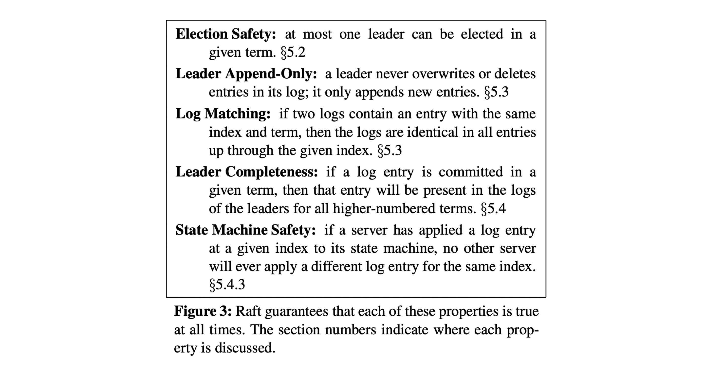
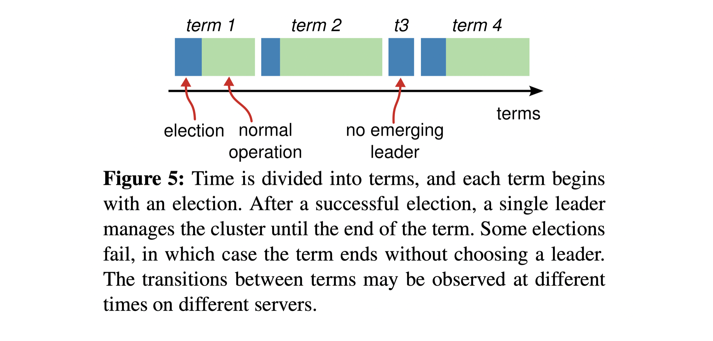
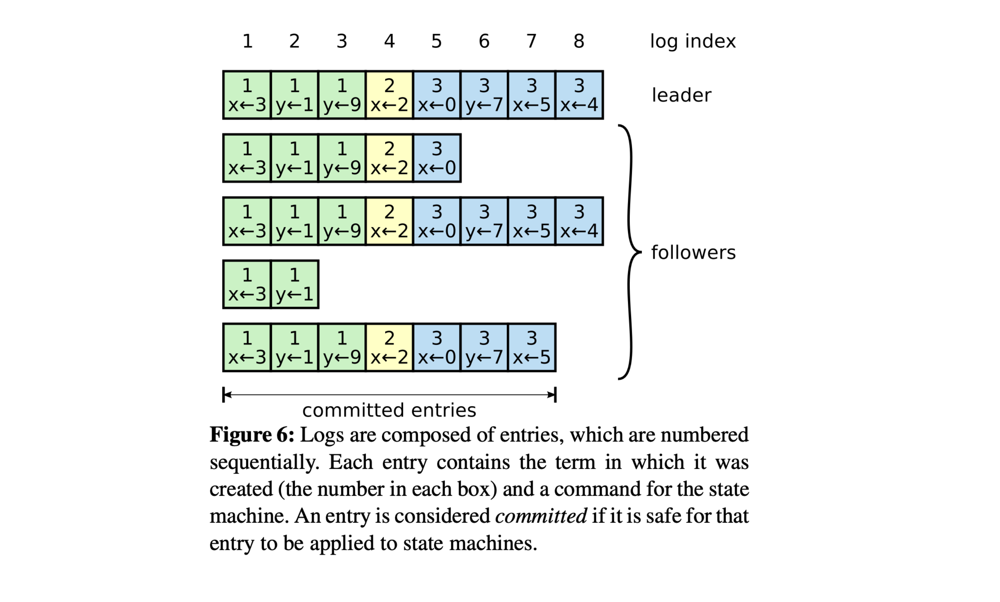
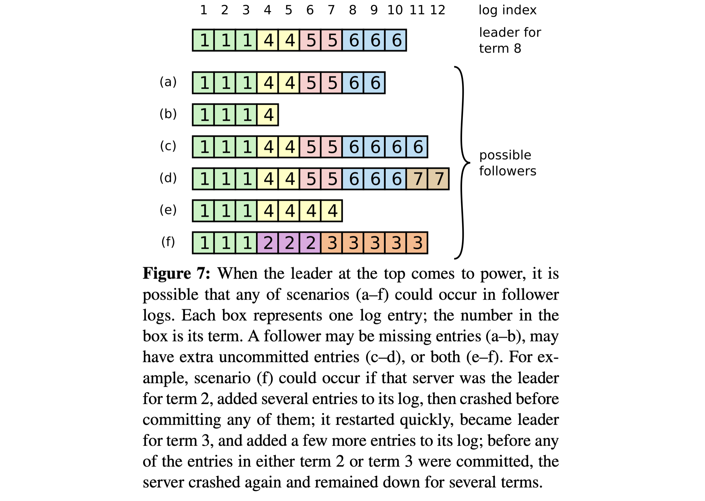
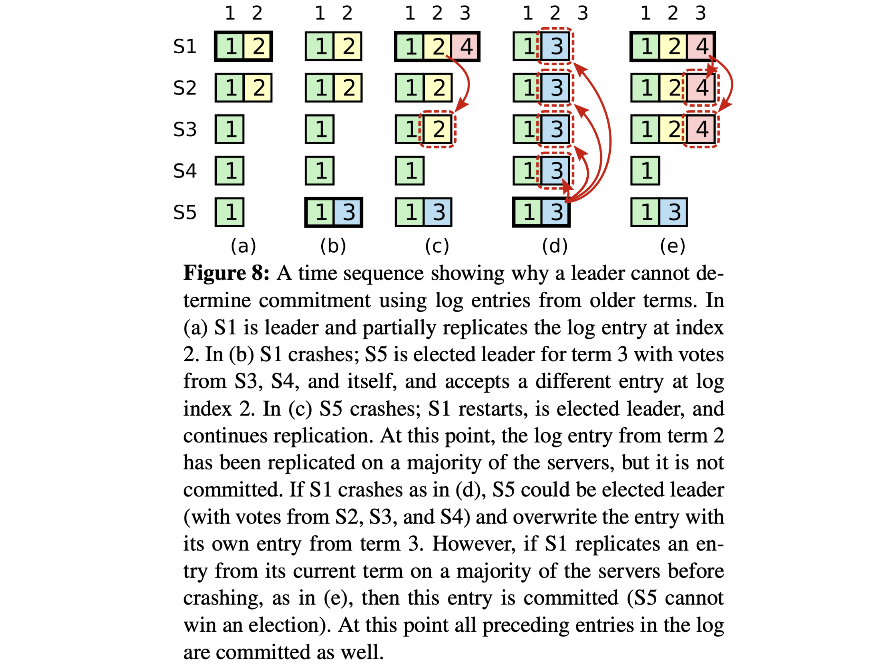
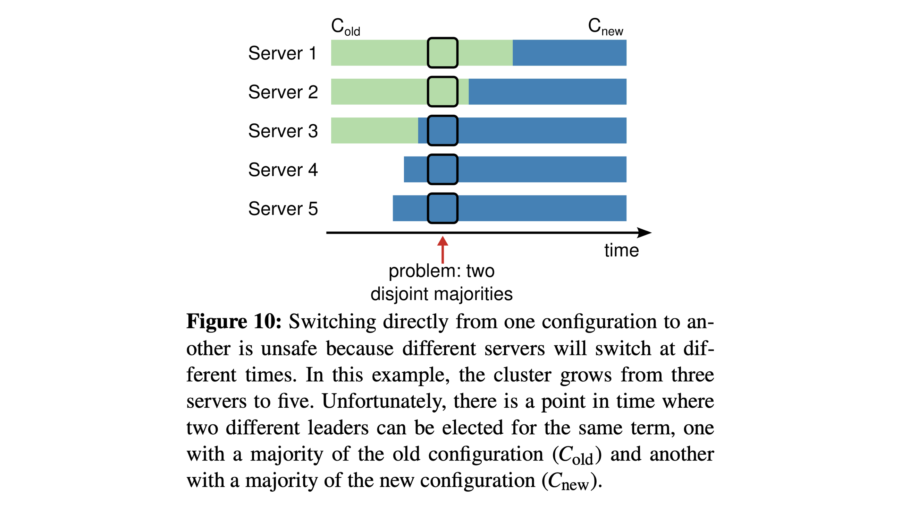
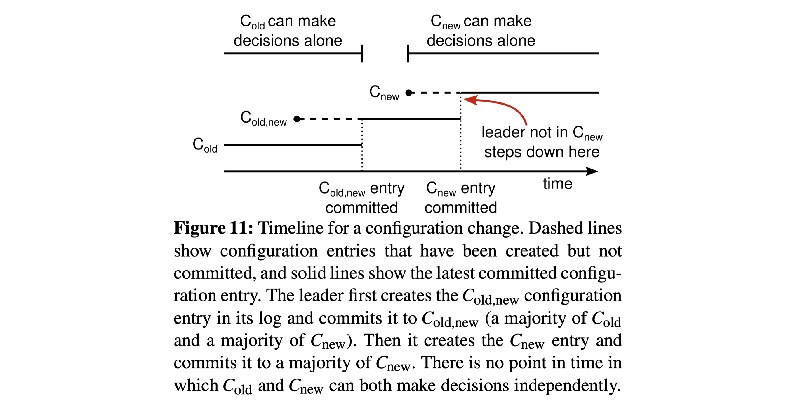
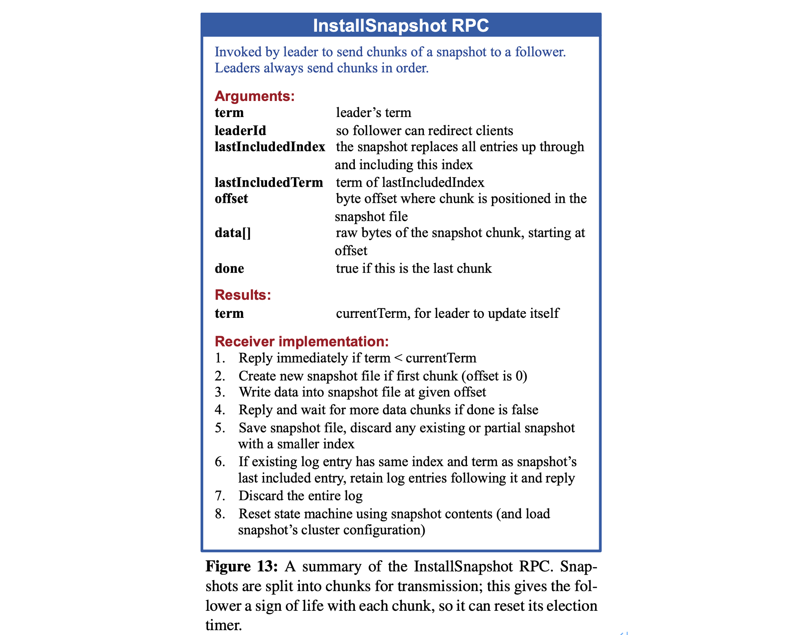

# In Search of an Understandable Consensus Algorithm (Extended Version) 2014

Diego Ongaro and John Ousterhout Stanford University

## Abstract

Raft is a consensus algorithm for managing a replicated log. It produces a result equivalent to (multi-)Paxos, and it is as efficient as Paxos, but its structure is different from Paxos; this makes Raft more understandable than Paxos and also provides a better foundation for building practical systems. In order to enhance understandability, Raft separates the key elements of consensus, such as leader election, log replication, and safety, and it enforces a stronger degree of coherency to reduce the number of states that must be considered. Results from a user study demonstrate that Raft is easier for students to learn than Paxos. Raft also includes a new mechanism for changing the cluster membership, which uses overlapping majorities to guarantee safety.

## 1 Introduction

Consensus algorithms allow a collection of machines to work as a coherent group that can survive the failures of some of its members. Because of this, they play a key role in building reliable largescale software systems. Paxos has dominated the discussion of consensus algorithms over the last decade: most implementations of consensus are based on Paxos or influenced by it, and Paxos has become the primary vehicle used to teach students about consensus.

Unfortunately, Paxos is quite difficult to understand, in spite of numerous attempts to make it more approachable. Furthermore, its architecture requires complex changes to support practical systems. As a result, both system builders and students struggle with Paxos.

After struggling with Paxos ourselves, we set out to find a new consensus algorithm that could provide a better foundation for system building and education. Our approach was unusual in that our primary goal was *understandability*: could we define a consensus algorithm for practical systems and describe it in a way that is significantly easier to learn than Paxos? Furthermore, we wanted the algorithm to facilitate the development of intuitions that are essential for system builders. It was important not just for the algorithm to work, but for it to be obvious why it works.

The result of this work is a consensus algorithm called Raft. In designing Raft we applied specific techniques to improve understandability, including decomposition (Raft separates leader election, log replication, and safety) and state space reduction (relative to Paxos, Raft reduces the degree of nondeterminism and the ways servers can be inconsistent with each other). A user study with 43 students at two universities shows that Raft is significantly easier to understand than Paxos: after learning both algorithms, 33 of these students were able to answer questions about Raft better than questions about Paxos.

Raft is similar in many ways to existing consensus algorithms (most notably, Oki and Liskov’s Viewstamped Replication), but it has several novel features:

- **Strong leader**: Raft uses a stronger form of leadership than other consensus algorithms. For example, log entries only flow from the leader to other servers. This simplifies the management of the replicated log and makes Raft easier to understand.
- **Leader election**: Raft uses randomized timers to elect leaders. This adds only a small amount of mechanism to the heartbeats already required for any consensus algorithm, while resolving conflicts simply and rapidly.
- **Membership changes**: Raft’s mechanism for changing the set of servers in the cluster uses a new *joint consensus* approach where the majorities of two different configurations overlap during transitions. This allows the cluster to continue operating normally during configuration changes.

We believe that Raft is superior to Paxos and other consensus algorithms, both for educational purposes and as a foundation for implementation. It is simpler and more understandable than other algorithms; it is described completely enough to meet the needs of a practical system; it has several open-source implementations and is used by several companies; its safety properties have been formally specified and proven; and its efficiency is comparable to other algorithms.

The remainder of the paper introduces the replicated state machine problem (Section 2), discusses the strengths and weaknesses of Paxos (Section 3), describes our general approach to understandability (Section 4), presents the Raft consensus algorithm (Sections 5–8), evaluates Raft (Section 9), and discusses related work (Section 10).

## 2 Replicated state machines

Consensus algorithms typically arise in the context of *replicated state machines*. In this approach, state machines on a collection of servers compute identical copies of the same state and can continue operating even if some of the servers are down. Replicated state machines are used to solve a variety of fault tolerance problems in distributed systems. For example, large-scale systems that have a single cluster leader, such as GFS, HDFS, and RAMCloud, typically use a separate replicated state machine to manage leader election and store configuration information that must survive leader crashes. Examples of replicated state machines include Chubby and ZooKeeper.

Replicated state machines are typically implemented using a replicated log, as shown in Figure 1. Each server stores a log containing a series of commands, which its state machine executes in order. Each log contains the same commands in the same order, so each state ma- chine processes the same sequence of commands. Since the state machines are deterministic, each computes the same state and the same sequence of outputs.

Keeping the replicated log consistent is the job of the consensus algorithm. The consensus module on a server receives commands from clients and adds them to its log. It communicates with the consensus modules on other servers to ensure that every log eventually contains the same requests in the same order, even if some servers fail. Once commands are properly replicated, each server’s state machine processes them in log order, and the outputs are returned to clients. As a result, the servers appear to form a single, highly reliable state machine.

Consensus algorithms for practical systems typically have the following properties:

- They ensure *safety* (never returning an incorrect result) under all non-Byzantine conditions, including network delays, partitions, and packet loss, duplication, and reordering.
- They are fully functional (*available*) as long as any majority of the servers are operational and can communicate with each other and with clients. Thus, a typical cluster of five servers can tolerate the failure of any two servers. Servers are assumed to fail by stopping; they may later recover from state on stable storage and rejoin the cluster.
- They do not depend on timing to ensure the consistency of the logs: faulty clocks and extreme message delays can, at worst, cause availability problems.
- In the common case, a command can complete as soon as a majority of the cluster has responded to a single round of remote procedure calls; a minority of slow servers need not impact overall system performance.

## 3 What’s wrong with Paxos?

Over the last ten years, Leslie Lamport’s Paxos protocol has become almost synonymous with consensus: it is the protocol most commonly taught in courses, and most implementations of consensus use it as a starting point. Paxos first defines a protocol capable of reaching agreement on a single decision, such as a single replicated log entry. We refer to this subset as *single-decree Paxos*. Paxos then combines multiple instances of this protocol to facilitate a series of decisions such as a log (*multi-Paxos*). Paxos ensures both safety and liveness, and it supports changes in cluster membership. Its correctness has been proven, and it is efficient in the normal case.

Unfortunately, Paxos has two significant drawbacks. The first drawback is that Paxos is exceptionally difficult to understand. The full explanation is notoriously opaque; few people succeed in understanding it, and only with great effort. As a result, there have been several attempts to explain Paxos in simpler terms. These explanations focus on the single-decree subset, yet they are still challenging. In an informal survey of attendees at NSDI 2012, we found few people who were comfortable with Paxos, even among seasoned researchers. We struggled with Paxos ourselves; we were not able to understand the complete protocol until after reading several simplified explanations and designing our own alternative protocol, a process that took almost a year.

We hypothesize that Paxos’ opaqueness derives from its choice of the single-decree subset as its foundation. Single-decree Paxos is dense and subtle: it is divided into two stages that do not have simple intuitive explanations and cannot be understood independently. Because of this, it is difficult to develop intuitions about why the single- decree protocol works. The composition rules for multi-Paxos add significant additional complexity and subtlety. We believe that the overall problem of reaching consensus on multiple decisions (i.e., a log instead of a single entry) can be decomposed in other ways that are more direct and obvious.

The second problem with Paxos is that it does not provide a good foundation for building practical implementations. One reason is that there is no widely agreedupon algorithm for multi-Paxos. Lamport’s descriptions are mostly about single-decree Paxos; he sketched possible approaches to multi-Paxos, but many details are missing. There have been several attempts to flesh out and optimize Paxos, such as [26], [39], and [13], but these differ from each other and from Lamport’s sketches. Systems such as Chubby have implemented Paxos-like algorithms, but in most cases their details have not been published.

Furthermore, the Paxos architecture is a poor one for building practical systems; this is another consequence of the single-decree decomposition. For example, there is little benefit to choosing a collection of log entries independently and then melding them into a sequential log; this just adds complexity. It is simpler and more efficient to design a system around a log, where new entries are appended sequentially in a constrained order. Another problem is that Paxos uses a symmetric peer-to-peer approach at its core (though it eventually suggests a weak form of leadership as a performance optimization). This makes sense in a simplified world where only one decision will be made, but few practical systems use this approach. If a series of decisions must be made, it is simpler and faster to first elect a leader, then have the leader coordinate the decisions.

As a result, practical systems bear little resemblance to Paxos. Each implementation begins with Paxos, discovers the difficulties in implementing it, and then develops a significantly different architecture. This is timeconsuming and error-prone, and the difficulties of understanding Paxos exacerbate the problem. Paxos’ formulation may be a good one for proving theorems about its correctness, but real implementations are so different from Paxos that the proofs have little value. The following comment from the Chubby implementers is typical:

>  There are significant gaps between the description of the Paxos algorithm and the needs of a real-world system. . . . the final system will be based on an unproven protocol.

Because of these problems, we concluded that Paxos does not provide a good foundation either for system building or for education. Given the importance of consensus in large-scale software systems, we decided to see if we could design an alternative consensus algorithm with better properties than Paxos. Raft is the result of that experiment.

## 4 Designing for understandability

We had several goals in designing Raft: it must provide a complete and practical foundation for system building, so that it significantly reduces the amount of design work required of developers; it must be safe under all conditions and available under typical operating conditions; and it must be efficient for common operations. But our most important goal—and most difficult challenge—was *understandability*. It must be possible for a large audience to understand the algorithm comfortably. In addition, it must be possible to develop intuitions about the algorithm, so that system builders can make the extensions that are inevitable in real-world implementations.

There were numerous points in the design of Raft where we had to choose among alternative approaches. In these situations we evaluated the alternatives based on understandability: how hard is it to explain each alternative (for example, how complex is its state space, and does it have subtle implications?), and how easy will it be for a reader to completely understand the approach and its implications?

We recognize that there is a high degree of subjectivity in such analysis; nonetheless, we used two techniques that are generally applicable. The first technique is the well-known approach of problem decomposition: wherever possible, we divided problems into separate pieces that could be solved, explained, and understood relatively independently. For example, in Raft we separated leader election, log replication, safety, and membership changes.

Our second approach was to simplify the state space by reducing the number of states to consider, making the system more coherent and eliminating nondeterminism where possible. Specifically, logs are not allowed to have holes, and Raft limits the ways in which logs can become inconsistent with each other. Although in most cases we tried to eliminate nondeterminism, there are some situations where nondeterminism actually improves understandability. In particular, randomized approaches introduce nondeterminism, but they tend to reduce the state space by handling all possible choices in a similar fashion (“choose any; it doesn’t matter”). We used randomization to simplify the Raft leader election algorithm.

## 5 The Raft consensus algorithm

Raft is an algorithm for managing a replicated log of the form described in Section 2. Figure 2 summarizes the algorithm in condensed form for reference, and Figure 3 lists key properties of the algorithm; the elements of these figures are discussed piecewise over the rest of this section.

Raft implements consensus by first electing a distinguished *leader*, then giving the leader complete responsibility for managing the replicated log. The leader accepts log entries from clients, replicates them on other servers, and tells servers when it is safe to apply log entries to their state machines. Having a leader simplifies the management of the replicated log. For example, the leader can decide where to place new entries in the log without consulting other servers, and data flows in a simple fashion from the leader to other servers. A leader can fail or become disconnected from the other servers, in which case a new leader is elected.

Given the leader approach, Raft decomposes the consensus problem into three relatively independent subproblems, which are discussed in the subsections that follow:

- Leader election: a new leader must be chosen when an existing leader fails (Section 5.2).
- Log replication: the leader must accept log entries from clients and replicate them across the cluster, forcing the other logs to agree with its own (Section 5.3).
- Safety: the key safety property for Raft is the State Machine Safety Property in Figure 3: if any server has applied a particular log entry to its state machine, then no other server may apply a different command for the same log index. Section 5.4 describes how Raft ensures this property; the solution involves an additional restriction on the election mechanism described in Section 5.2.

After presenting the consensus algorithm, this section discusses the issue of availability and the role of timing in the system.

### 5.1 Raft basics

A Raft cluster contains several servers; five is a typical number, which allows the system to tolerate two failures. At any given time each server is in one of three states: *leader*, *follower*, or *candidate*. In normal operation there is exactly one leader and all of the other servers are followers. Followers are passive: they issue no requests on their own but simply respond to requests from leaders and candidates. The leader handles all client requests (if a client contacts a follower, the follower redirects it to the leader). The third state, candidate, is used to elect a new leader as described in Section 5.2. Figure 4 shows the states and their transitions; the transitions are discussed below.

Raft divides time into *terms* of arbitrary length, as shown in Figure 5. Terms are numbered with consecutive integers. Each term begins with an *election*, in which one or more candidates attempt to become leader as described in Section 5.2. If a candidate wins the election, then it serves as leader for the rest of the term. In some situations an election will result in a split vote. In this case the term will end with no leader; a new term (with a new election) will begin shortly. Raft ensures that there is at most one leader in a given term.

Different servers may observe the transitions between terms at different times, and in some situations a server may not observe an election or even entire terms. Terms act as a logical clock in Raft, and they allow servers to detect obsolete information such as stale leaders. Each server stores a *current term* number, which increases monotonically over time. Current terms are exchanged whenever servers communicate; if one server’s current term is smaller than the other’s, then it updates its current term to the larger value. If a candidate or leader discovers that its term is out of date, it immediately reverts to follower state. If a server receives a request with a stale term number, it rejects the request.

Raft servers communicate using remote procedure calls (RPCs), and the basic consensus algorithm requires only two types of RPCs. RequestVote RPCs are initiated by candidates during elections (Section 5.2), and AppendEntries RPCs are initiated by leaders to replicate log entries and to provide a form of heartbeat (Section 5.3). Section 7 adds a third RPC for transferring snapshots between servers. Servers retry RPCs if they do not receive a response in a timely manner, and they issue RPCs in parallel for best performance.

### 5.2 Leader election

Raft uses a heartbeat mechanism to trigger leader election. When servers start up, they begin as followers. A server remains in follower state as long as it receives valid RPCs from a leader or candidate. Leaders send periodic heartbeats (AppendEntries RPCs that carry no log entries) to all followers in order to maintain their authority. If a follower receives no communication over a period of time called the *election timeout*, then it assumes there is no viable leader and begins an election to choose a new leader.

To begin an election, a follower increments its current term and transitions to candidate state. It then votes for itself and issues RequestVote RPCs in parallel to each of the other servers in the cluster. A candidate continues in this state until one of three things happens: 

1. it wins the election
2. another server establishes itself as leader
3. a period of time goes by with no winner.

These outcomes are discussed separately in the paragraphs below.

A candidate wins an election if it receives votes from a majority of the servers in the full cluster for the same term. Each server will vote for at most one candidate in a given term, on a first-come-first-served basis (note: Section 5.4 adds an additional restriction on votes). The majority rule ensures that at most one candidate can win the election for a particular term (the Election Safety Property in Figure 3). Once a candidate wins an election, it becomes leader. It then sends heartbeat messages to all of the other servers to establish its authority and prevent new elections.

While waiting for votes, a candidate may receive an AppendEntries RPC from another server claiming to be leader. If the leader’s term (included in its RPC) is at least as large as the candidate’s current term, then the candidate recognizes the leader as legitimate and returns to follower state. If the term in the RPC is smaller than the candidate’s current term, then the candidate rejects the RPC and continues in candidate state.

The third possible outcome is that a candidate neither wins nor loses the election: if many followers become candidates at the same time, votes could be split so that no candidate obtains a majority. When this happens, each candidate will time out and start a new election by incrementing its term and initiating another round of RequestVote RPCs. However, without extra measures split votes could repeat indefinitely.

Raft uses randomized election timeouts to ensure that split votes are rare and that they are resolved quickly. To prevent split votes in the first place, election timeouts are chosen randomly from a fixed interval (e.g., 150–300ms). This spreads out the servers so that in most cases only a single server will time out; it wins the election and sends heartbeats before any other servers time out. The same mechanism is used to handle split votes. Each candidate restarts its randomized election timeout at the start of an election, and it waits for that timeout to elapse before starting the next election; this reduces the likelihood of another split vote in the new election. Section 9.3 shows that this approach elects a leader rapidly.

Elections are an example of how understandability guided our choice between design alternatives. Initially we planned to use a ranking system: each candidate was assigned a unique rank, which was used to select between competing candidates. If a candidate discovered another candidate with higher rank, it would return to follower state so that the higher ranking candidate could more easily win the next election. We found that this approach created subtle issues around availability (a lower-ranked server might need to time out and become a candidate again if a higher-ranked server fails, but if it does so too soon, it can reset progress towards electing a leader). We made adjustments to the algorithm several times, but after each adjustment new corner cases appeared. Eventually we concluded that the randomized retry approach is more obvious and understandable.

### 5.3 Log replication

Once a leader has been elected, it begins servicing client requests. Each client request contains a command to be executed by the replicated state machines. The leader appends the command to its log as a new entry, then issues AppendEntries RPCs in parallel to each of the other servers to replicate the entry. When the entry has been safely replicated (as described below), the leader applies the entry to its state machine and returns the result of that execution to the client. If followers crash or run slowly, or if network packets are lost, the leader retries AppendEntries RPCs indefinitely (even after it has responded to the client) until all followers eventually store all log entries.

Logs are organized as shown in Figure 6. Each log entry stores a state machine command along with the term number when the entry was received by the leader. The term numbers in log entries are used to detect inconsistencies between logs and to ensure some of the properties in Figure 3. Each log entry also has an integer index identifying its position in the log.

The leader decides when it is safe to apply a log entry to the state machines; such an entry is called *committed*. Raft guarantees that committed entries are durable and will eventually be executed by all of the available state machines. A log entry is committed once the leader that created the entry has replicated it on a majority of the servers (e.g., entry 7 in Figure 6). This also commits all preceding entries in the leader’s log, including entries created by previous leaders. Section 5.4 discusses some subtleties when applying this rule after leader changes, and it also shows that this definition of commitment is safe. The leader keeps track of the highest index it knows to be committed, and it includes that index in future AppendEntries RPCs (including heartbeats) so that the other servers eventually find out. Once a follower learns that a log entry is committed, it applies the entry to its local state machine (in log order).

We designed the Raft log mechanism to maintain a high level of coherency between the logs on different servers. Not only does this simplify the system’s behavior and make it more predictable, but it is an important component of ensuring safety. Raft maintains the following properties, which together constitute the Log Matching Property in Figure 3:

- If two entries in different logs have the same index and term, then they store the same command.
- If two entries in different logs have the same index and term, then the logs are identical in all preceding entries.

The first property follows from the fact that a leader creates at most one entry with a given log index in a given term, and log entries never change their position in the log. The second property is guaranteed by a simple consistency check performed by AppendEntries. When sending an AppendEntries RPC, the leader includes the index and term of the entry in its log that immediately precedes the new entries. If the follower does not find an entry in its log with the same index and term, then it refuses the new entries. The consistency check acts as an induction step: the initial empty state of the logs satisfies the Log Matching Property, and the consistency check preserves the Log Matching Property whenever logs are extended. As a result, whenever AppendEntries returns successfully, the leader knows that the follower’s log is identical to its own log up through the new entries.

During normal operation, the logs of the leader and followers stay consistent, so the AppendEntries consistency check never fails. However, leader crashes can leave the logs inconsistent (the old leader may not have fully replicated all of the entries in its log). These inconsistencies can compound over a series of leader and follower crashes. Figure 7 illustrates the ways in which followers’ logs may differ from that of a new leader. A follower may be missing entries that are present on the leader, it may have extra entries that are not present on the leader, or both. Missing and extraneous entries in a log may span multiple terms.

In Raft, the leader handles inconsistencies by forcing the followers’ logs to duplicate its own. This means that conflicting entries in follower logs will be overwritten with entries from the leader’s log. Section 5.4 will show that this is safe when coupled with one more restriction.

To bring a follower’s log into consistency with its own, the leader must find the latest log entry where the two logs agree, delete any entries in the follower’s log after that point, and send the follower all of the leader’s entries after that point. All of these actions happen in response to the consistency check performed by AppendEntries RPCs. The leader maintains a *nextIndex* for each follower, which is the index of the next log entry the leader will send to that follower. When a leader first comes to power, it initializes all nextIndex values to the index just after the last one in its log (11 in Figure 7). If a follower’s log is inconsistent with the leader’s, the AppendEntries consistency check will fail in the next AppendEntries RPC. After a rejection, the leader decrements nextIndex and retries the AppendEntries RPC. Eventually nextIndex will reach a point where the leader and follower logs match. When this happens, AppendEntries will succeed, which removes any conflicting entries in the follower’s log and appends entries from the leader’s log (if any). Once AppendEntries succeeds, the follower’s log is consistent with the leader’s, and it will remain that way for the rest of the term.

If desired, the protocol can be optimized to reduce the number of rejected AppendEntries RPCs. For example, when rejecting an AppendEntries request, the follower can include the term of the conflicting entry and the first index it stores for that term. With this information, the leader can decrement nextIndex to bypass all of the conflicting entries in that term; one AppendEntries RPC will be required for each term with conflicting entries, rather than one RPC per entry. In practice, we doubt this optimization is necessary, since failures happen infrequently and it is unlikely that there will be many inconsistent entries.

With this mechanism, a leader does not need to take any special actions to restore log consistency when it comes to power. It just begins normal operation, and the logs automatically converge in response to failures of the AppendEntries consistency check. A leader never overwrites or deletes entries in its own log (the Leader Append-Only Property in Figure 3).

This log replication mechanism exhibits the desirable consensus properties described in Section 2: Raft can accept, replicate, and apply new log entries as long as a majority of the servers are up; in the normal case a new entry can be replicated with a single round of RPCs to a majority of the cluster; and a single slow follower will not impact performance.

### 5.4 Safety

The previous sections described how Raft elects leaders and replicates log entries. However, the mechanisms described so far are not quite sufficient to ensure that each state machine executes exactly the same commands in the same order. For example, a follower might be unavailable while the leader commits several log entries, then it could be elected leader and overwrite these entries with new ones; as a result, different state machines might execute different command sequences.

This section completes the Raft algorithm by adding a restriction on which servers may be elected leader. The restriction ensures that the leader for any given term contains all of the entries committed in previous terms (the Leader Completeness Property from Figure 3). Given the election restriction, we then make the rules for commitment more precise. Finally, we present a proof sketch for the Leader Completeness Property and show how it leads to correct behavior of the replicated state machine.

#### 5.4.1 Election restriction

In any leader-based consensus algorithm, the leader must eventually store all of the committed log entries. In some consensus algorithms, such as Viewstamped Replication [22], a leader can be elected even if it doesn’t initially contain all of the committed entries. These algorithms contain additional mechanisms to identify the missing entries and transmit them to the new leader, either during the election process or shortly afterwards. Unfortunately, this results in considerable additional mechanism and complexity. Raft uses a simpler approach where it guarantees that all the committed entries from previous terms are present on each new leader from the moment of its election, without the need to transfer those entries to the leader. This means that log entries only flow in one direction, from leaders to followers, and leaders never overwrite existing entries in their logs.

Raft uses the voting process to prevent a candidate from winning an election unless its log contains all committed entries. A candidate must contact a majority of the cluster in order to be elected, which means that every committed entry must be present in at least one of those servers. If the candidate’s log is at least as up-to-date as any other log in that majority (where “up-to-date” is defined precisely below), then it will hold all the committed entries. The RequestVote RPC implements this restriction: the RPC includes information about the candidate’s log, and the voter denies its vote if its own log is more up-to-date than that of the candidate.

Raft determines which of two logs is more up-to-date by comparing the index and term of the last entries in the logs. If the logs have last entries with different terms, then the log with the later term is more up-to-date. If the logs end with the same term, then whichever log is longer is more up-to-date.

#### 5.4.2 Committing entries from previous terms

As described in Section 5.3, a leader knows that an entry from its current term is committed once that entry is stored on a majority of the servers. If a leader crashes before committing an entry, future leaders will attempt to finish replicating the entry. However, a leader cannot immediately conclude that an entry from a previous term is committed once it is stored on a majority of servers. Figure 8 illustrates a situation where an old log entry is stored on a majority of servers, yet can still be overwritten by a future leader.

To eliminate problems like the one in Figure 8, Raft never commits log entries from previous terms by counting replicas. Only log entries from the leader’s current term are committed by counting replicas; once an entry from the current term has been committed in this way, then all prior entries are committed indirectly because of the Log Matching Property. There are some situations where a leader could safely conclude that an older log entry is committed (for example, if that entry is stored on every server), but Raft takes a more conservative approach for simplicity.

Raft incurs this extra complexity in the commitment rules because log entries retain their original term numbers when a leader replicates entries from previous terms. In other consensus algorithms, if a new leader rereplicates entries from prior “terms,” it must do so with its new “term number.” Raft’s approach makes it easier to reason about log entries, since they maintain the same term number over time and across logs. In addition, new leaders in Raft send fewer log entries from previous terms than in other algorithms (other algorithms must send redundant log entries to renumber them before they can be committed).

#### 5.4.3 Safety argument

Given the complete Raft algorithm, we can now argue more precisely that the Leader Completeness Property holds (this argument is based on the safety proof; see Section 9.2). We assume that the Leader Completeness Property does not hold, then we prove a contradiction. Suppose the leader for term T (leaderT) commits a log entry from its term, but that log entry is not stored by the leader of some future term. Consider the smallest term U > T whose leader (leaderU) does not store the entry.

1. The committed entry must have been absent from leaderU’s log at the time of its election (leaders never delete or overwrite entries).
2. leaderT replicated the entry on a majority of the cluster, and leaderU received votes from a majority of the cluster. Thus, at least one server (“the voter”) both accepted the entry from leader T and voted for leader U, as shown in Figure 9. The voter is key to reaching a contradiction.
3. The voter must have accepted the committed entry from leaderT *before* voting for leaderU; otherwise it would have rejected the AppendEntries request from leader T (its current term would have been higher than T).
4. The voter still stored the entry when it voted for leaderU, since every intervening leader contained the entry (by assumption), leaders never remove entries, and followers only remove entries if they conflict with the leader.
5. The voter granted its vote to leaderU, so leaderU’s log must have been as up-to-date as the voter’s. This leads to one of two contradictions.
6. First, if the voter and leader U shared the same last log term, then leaderU’s log must have been at least as long as the voter’s, so its log contained every entry in the voter’s log. This is a contradiction, since the voter contained the committed entry and leaderU was assumed not to.
7. Otherwise, leaderU’s last log term must have been larger than the voter’s. Moreover, it was larger than T, since the voter’s last log term was at least T (it con- tains the committed entry from term T). The earlier leader that created leaderU’s last log entry must have contained the committed entry in its log (by assump- tion). Then, by the Log Matching Property, leaderU’s log must also contain the committed entry, which is a contradiction.
8. This completes the contradiction. Thus, the leaders of all terms greater than T must contain all entries from term T that are committed in term T.
9. The Log Matching Property guarantees that future leaders will also contain entries that are committed indirectly, such as index 2 in Figure 8(d).

Given the Leader Completeness Property, we can prove the State Machine Safety Property from Figure 3, which states that if a server has applied a log entry at a given index to its state machine, no other server will ever apply a different log entry for the same index. At the time a server applies a log entry to its state machine, its log must be identical to the leader’s log up through that entry and the entry must be committed. Now consider the lowest term in which any server applies a given log index; the Log Completeness Property guarantees that the leaders for all higher terms will store that same log entry, so servers that apply the index in later terms will apply the same value. Thus, the State Machine Safety Property holds.

Finally, Raft requires servers to apply entries in log index order. Combined with the State Machine Safety Property, this means that all servers will apply exactly the same set of log entries to their state machines, in the same order.

### 5.5 Follower and candidate crashes

Until this point we have focused on leader failures. Follower and candidate crashes are much simpler to handle than leader crashes, and they are both handled in the same way. If a follower or candidate crashes, then future RequestVote and AppendEntries RPCs sent to it will fail. Raft handles these failures by retrying indefinitely; if the crashed server restarts, then the RPC will complete successfully. If a server crashes after completing an RPC but before responding, then it will receive the same RPC again after it restarts. Raft RPCs are idempotent, so this causes no harm. For example, if a follower receives an AppendEntries request that includes log entries already present in its log, it ignores those entries in the new request.

### 5.6 Timing and availability

One of our requirements for Raft is that safety must not depend on timing: the system must not produce incorrect results just because some event happens more quickly or slowly than expected. However, availability (the ability of the system to respond to clients in a timely manner) must inevitably depend on timing. For example, if message exchanges take longer than the typical time between server crashes, candidates will not stay up long enough to win an election; without a steady leader, Raft cannot make progress.

Leader election is the aspect of Raft where timing is most critical. Raft will be able to elect and maintain a steady leader as long as the system satisfies the following *timing requirement*:
$$
broadcastTime ≪ electionTimeout ≪ MTBF
$$
In this inequality *broadcastTime* is the average time it takes a server to send RPCs in parallel to every server in the cluster and receive their responses; *electionTimeout* is the election timeout described in Section 5.2; and *MTBF* is the average time between failures for a single server. The broadcast time should be an order of magnitude less than the election timeout so that leaders can reliably send the heartbeat messages required to keep followers from starting elections; given the randomized approach used for election timeouts, this inequality also makes split votes unlikely. The election timeout should be a few orders of magnitude less than MTBF so that the system makes steady progress. When the leader crashes, the system will be unavailable for roughly the election timeout; we would like this to represent only a small fraction of overall time.

The broadcast time and MTBF are properties of the underlying system, while the election timeout is something we must choose. Raft’s RPCs typically require the recipient to persist information to stable storage, so the broadcast time may range from 0.5ms to 20ms, depending on storage technology. As a result, the election timeout is likely to be somewhere between 10ms and 500ms. Typical server MTBFs are several months or more, which easily satisfies the timing requirement.

## 6 Cluster membership changes

Up until now we have assumed that the cluster *configuration* (the set of servers participating in the consensus algorithm) is fixed. In practice, it will occasionally be necessary to change the configuration, for example to replace servers when they fail or to change the degree of replication. Although this can be done by taking the entire cluster off-line, updating configuration files, and then restarting the cluster, this would leave the cluster unavailable during the changeover. In addition, if there are any manual steps, they risk operator error. In order to avoid these issues, we decided to automate configuration changes and incorporate them into the Raft consensus algorithm.

For the configuration change mechanism to be safe, there must be no point during the transition where it is possible for two leaders to be elected for the same term. Unfortunately, any approach where servers switch directly from the old configuration to the new configuration is unsafe. It isn’t possible to atomically switch all of the servers at once, so the cluster can potentially split into two independent majorities during the transition (see Figure 10).

In order to ensure safety, configuration changes must use a two-phase approach. There are a variety of ways to implement the two phases. For example, some systems (e.g., [22]) use the first phase to disable the old configuration so it cannot process client requests; then the second phase enables the new configuration. In Raft the cluster first switches to a transitional configuration we call *joint consensus*; once the joint consensus has been committed, the system then transitions to the new configuration. The joint consensus combines both the old and new configurations:

-  Log entries are replicated to all servers in both configurations.
- Any server from either configuration may serve as leader.
- Agreement (for elections and entry commitment) requires separate majorities from *both* the old and new configurations.

The joint consensus allows individual servers to transition between configurations at different times without compromising safety. Furthermore, joint consensus allows the cluster to continue servicing client requests throughout the configuration change.

Cluster configurations are stored and communicated using special entries in the replicated log; Figure 11 illustrates the configuration change process. When the leader receives a request to change the configuration from $C_{old}$ to $C_{new}$ , it stores the configuration for joint consensus ($C_{old, new}$in the figure) as a log entry and replicates that entry using the mechanisms described previously. Once a given server adds the new configuration entry to its log, it uses that configuration for all future decisions (a server always uses the latest configuration in its log, regardless of whether the entry is committed). This means that the leader will use the rules of $C_{old}$,new to determine when the log entry for $C_{old}$,new is committed. If the leader crashes, a new leader may be chosen under either $C_{old}$ or $C_{old, new}$, depending on whether the winning candidate has received $C_{old, new}$. In any case, $C_{new}$ cannot make unilateral decisions during this period.

Once $C_{old, new}$ has been committed, neither $C_{old}$ nor $C_{new}$ can make decisions without approval of the other, and the Leader Completeness Property ensures that only servers with the $C_{old,new}$ log entry can be elected as leader. It is now safe for the leader to create a log entry describing $C_{new}$ and replicate it to the cluster. Again, this configuration will take effect on each server as soon as it is seen. When the new configuration has been committed under the rules of $C_{new}$, the old configuration is irrelevant and servers not in the new configuration can be shut down. As shown in Figure 11, there is no time when $C_{old}$ and $C_{new}$ can both make unilateral decisions; this guarantees safety.

There are three more issues to address for reconfiguration. The first issue is that new servers may not initially store any log entries. If they are added to the cluster in this state, it could take quite a while for them to catch up, during which time it might not be possible to commit new log entries. In order to avoid availability gaps, Raft introduces an additional phase before the configuration change, in which the new servers join the cluster as nonvoting members (the leader replicates log entries to them, but they are not considered for majorities). Once the new servers have caught up with the rest of the cluster, the reconfiguration can proceed as described above.

The second issue is that the cluster leader may not be part of the new configuration. In this case, the leader steps down (returns to follower state) once it has committed the $C_{new}$ log entry. This means that there will be a period of time (while it is committing $C_{new}$ ) when the leader is managing a cluster that does not include itself; it replicates log entries but does not count itself in majorities. The leader transition occurs when $C_{new}$ is committed because this is the first point when the new configuration can operate independently (it will always be possible to choose a leader from $C_{new}$ ). Before this point, it may be the case that only a server from $C_{old}$ can be elected leader.

The third issue is that removed servers (those not in $C_{new}$) can disrupt the cluster. These servers will not receive heartbeats, so they will time out and start new elections. They will then send RequestVote RPCs with new term numbers, and this will cause the current leader to revert to follower state. A new leader will eventually be elected, but the removed servers will time out again and the process will repeat, resulting in poor availability.

To prevent this problem, servers disregard RequestVote RPCs when they believe a current leader exists. Specifically, if a server receives a RequestVote RPC within the minimum election timeout of hearing from a current leader, it does not update its term or grant its vote. This does not affect normal elections, where each server waits at least a minimum election timeout before starting an election. However, it helps avoid disruptions from removed servers: if a leader is able to get heartbeats to its cluster, then it will not be deposed by larger term numbers.

## 7 Log compaction

Raft’s log grows during normal operation to incorporate more client requests, but in a practical system, it cannot grow without bound. As the log grows longer, it occupies more space and takes more time to replay. This will eventually cause availability problems without some mechanism to discard obsolete information that has accumulated in the log.

Snapshotting is the simplest approach to compaction. In snapshotting, the entire current system state is written to a *snapshot* on stable storage, then the entire log up to that point is discarded. Snapshotting is used in Chubby and ZooKeeper, and the remainder of this section describes snapshotting in Raft.

Incremental approaches to compaction, such as log cleaning and log-structured merge trees, are also possible. These operate on a fraction of the data at once, so they spread the load of compaction more evenly over time. They first select a region of data that has accumulated many deleted and overwritten objects, then they rewrite the live objects from that region more compactly and free the region. This requires significant additional mechanism and complexity compared to snapshotting, which simplifies the problem by always operating on the entire data set. While log cleaning would require modifications to Raft, state machines can implement LSM trees using the same interface as snapshotting.

Figure 12 shows the basic idea of snapshotting in Raft. Each server takes snapshots independently, covering just the committed entries in its log. Most of the work consists of the state machine writing its current state to the snapshot. Raft also includes a small amount of metadata in the snapshot: the *last included index* is the index of the last entry in the log that the snapshot replaces (the last entry the state machine had applied), and the *last included term* is the term of this entry. These are preserved to support the AppendEntries consistency check for the first log entry following the snapshot, since that entry needs a previous log index and term. To enable cluster membership changes (Section 6), the snapshot also includes the latest configuration in the log as of last included index. Once a server completes writing a snapshot, it may delete all log entries up through the last included index, as well as any prior snapshot.

Although servers normally take snapshots independently, the leader must occasionally send snapshots to followers that lag behind. This happens when the leader has already discarded the next log entry that it needs to send to a follower. Fortunately, this situation is unlikely in normal operation: a follower that has kept up with the leader would already have this entry. However, an exceptionally slow follower or a new server joining the cluster (Section 6) would not. The way to bring such a follower up-to-date is for the leader to send it a snapshot over the network.

The leader uses a new RPC called InstallSnapshot to send snapshots to followers that are too far behind; see Figure 13. When a follower receives a snapshot with this RPC, it must decide what to do with its existing log entries. Usually the snapshot will contain new information not already in the recipient’s log. In this case, the follower discards its entire log; it is all superseded by the snapshot and may possibly have uncommitted entries that conflict with the snapshot. If instead the follower receives a snapshot that describes a prefix of its log (due to retransmission or by mistake), then log entries covered by the snapshot are deleted but entries following the snapshot are still valid and must be retained.

This snapshotting approach departs from Raft’s strong leader principle, since followers can take snapshots without the knowledge of the leader. However, we think this departure is justified. While having a leader helps avoid conflicting decisions in reaching consensus, consensus has already been reached when snapshotting, so no decisions conflict. Data still only flows from leaders to followers, just followers can now reorganize their data.

We considered an alternative leader-based approach in which only the leader would create a snapshot, then it would send this snapshot to each of its followers. How- ever, this has two disadvantages. First, sending the snapshot to each follower would waste network bandwidth and slow the snapshotting process. Each follower already has the information needed to produce its own snapshots, and it is typically much cheaper for a server to produce a snapshot from its local state than it is to send and receive one over the network. Second, the leader’s implementation would be more complex. For example, the leader would need to send snapshots to followers in parallel with repli- cating new log entries to them, so as not to block new client requests.

There are two more issues that impact snapshotting performance. First, servers must decide when to snapshot. If a server snapshots too often, it wastes disk bandwidth and energy; if it snapshots too infrequently, it risks exhausting its storage capacity, and it increases the time required to replay the log during restarts. One simple strategy is to take a snapshot when the log reaches a fixed size in bytes. If this size is set to be significantly larger than the expected size of a snapshot, then the disk bandwidth overhead for snapshotting will be small.

The second performance issue is that writing a snapshot can take a significant amount of time, and we do not want this to delay normal operations. The solution is to use copy-on-write techniques so that new updates can be accepted without impacting the snapshot being written. For example, state machines built with functional data structures naturally support this. Alternatively, the operating system’s copy-on-write support (e.g., fork on Linux) can be used to create an in-memory snapshot of the entire state machine (our implementation uses this approach).

## 8 Client interaction

This section describes how clients interact with Raft, including how clients find the cluster leader and how Raft supports linearizable semantics. These issues apply to all consensus-based systems, and Raft’s solutions are similar to other systems.

Clients of Raft send all of their requests to the leader. When a client first starts up, it connects to a randomly-chosen server. If the client’s first choice is not the leader, that server will reject the client’s request and supply information about the most recent leader it has heard from (AppendEntries requests include the network address of the leader). If the leader crashes, client requests will time out; clients then try again with randomly-chosen servers.

Our goal for Raft is to implement linearizable semantics (each operation appears to execute instantaneously, exactly once, at some point between its invocation and its response). However, as described so far Raft can execute a command multiple times: for example, if the leader crashes after committing the log entry but before responding to the client, the client will retry the command with a new leader, causing it to be executed a second time. The solution is for clients to assign unique serial numbers to every command. Then, the state machine tracks the latest serial number processed for each client, along with the associated response. If it receives a command whose serial number has already been executed, it responds immediately without re-executing the request.

Read-only operations can be handled without writing anything into the log. However, with no additional measures, this would run the risk of returning stale data, since the leader responding to the request might have been superseded by a newer leader of which it is unaware. Linearizable reads must not return stale data, and Raft needs two extra precautions to guarantee this without using the log. First, a leader must have the latest information on which entries are committed. The Leader Completeness Property guarantees that a leader has all committed entries, but at the start of its term, it may not know which those are. To find out, it needs to commit an entry from its term. Raft handles this by having each leader com- mit a blank *no-op* entry into the log at the start of its term. Second, a leader must check whether it has been de- posed before processing a read-only request (its information may be stale if a more recent leader has been elected). Raft handles this by having the leader exchange heartbeat messages with a majority of the cluster before responding to read-only requests. Alternatively, the leader could rely on the heartbeat mechanism to provide a form of lease, but this would rely on timing for safety (it assumes bounded clock skew).

